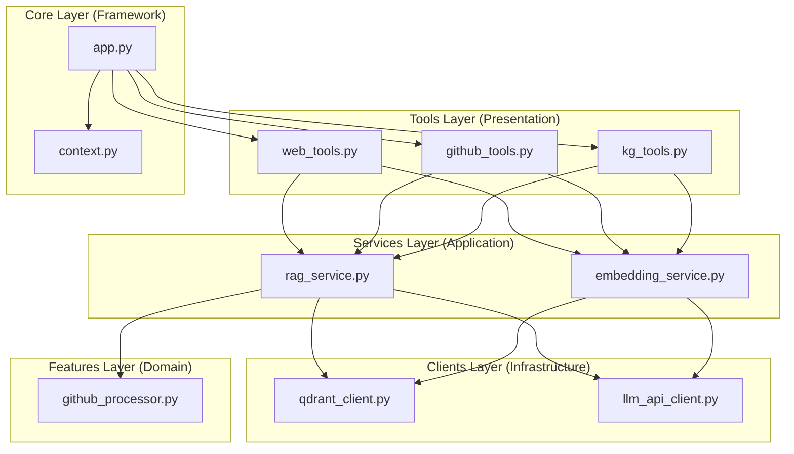

# Design Document: Application Modularization

## Overview

This design document outlines the architectural transformation of the `mcp-crawl4ai-rag` application from its current monolithic structure to a clean, layered architecture. The refactoring will decompose large, multi-responsibility modules into focused, single-purpose components that follow Clean Architecture principles.

The current application suffers from several architectural issues:
- `src/crawl4ai_mcp.py` (1000+ lines) contains MCP tool definitions, orchestration logic, re-ranking, and server initialization
- `src/utils.py` (800+ lines) mixes client creation, embedding generation, search logic, and code processing
- Confusing dual structure with both `src/utils.py` file and `src/utils/` directory
- High coupling between components and unclear dependency relationships

## Architecture

### Target Architecture Pattern

The refactored application will follow a **Layered Architecture** pattern inspired by Clean Architecture principles:



### Dependency Flow Rules

1. **Tools** depend on **Services** and **Core**
2. **Services** depend on **Clients** and **Features**
3. **Clients** are independent infrastructure adapters
4. **Core** is framework-level code with minimal dependencies
5. **Features** contain domain-specific business logic

### Directory Structure

```
src/
├── core/                    # Framework and application setup
│   ├── __init__.py
│   ├── app.py              # FastMCP instance and tool registration
│   └── context.py          # Crawl4AIContext definition
├── clients/                # External service adapters
│   ├── __init__.py
│   ├── qdrant_client.py    # Qdrant database client wrapper
│   └── llm_api_client.py   # OpenAI/DeepInfra API clients
├── services/               # Application business logic
│   ├── __init__.py
│   ├── rag_service.py      # Search, ranking, and retrieval logic
│   └── embedding_service.py # Embedding generation and caching
├── features/               # Domain-specific complex logic
│   ├── __init__.py
│   └── github_processor.py # GitHub repository processing
├── tools/                  # MCP tool implementations
│   ├── __init__.py
│   ├── web_tools.py        # Web crawling tools
│   ├── github_tools.py     # GitHub-specific tools
│   └── kg_tools.py         # Knowledge graph tools
├── embedding_cache.py      # (unchanged)
├── embedding_config.py     # (unchanged)
├── sparse_vector_types.py  # (unchanged)
├── device_manager.py       # (unchanged)
└── __main__.py            # (updated entry point)
```

## Components and Interfaces

### Core Layer

#### `src/core/context.py`
```python
@dataclass
class Crawl4AIContext:
    """Application context containing shared resources."""
    qdrant_client: QdrantClientWrapper
    embedding_cache: Any
    reranker: Optional[CrossEncoder]
```

#### `src/core/app.py`
```python
def create_app() -> FastMCP:
    """Create and configure the FastMCP application."""
    
def register_tools(app: FastMCP) -> None:
    """Register all MCP tools with the application."""
```

### Clients Layer

#### `src/clients/qdrant_client.py`
**Responsibility:** Qdrant database operations and connection management

**Key Components:**
- `QdrantClientWrapper` class (moved from `qdrant_wrapper.py`)
- `get_qdrant_client()` function
- Database initialization and health checks

**Interface:**
```python
class QdrantClientWrapper:
    def search_documents(self, query_vector: List[float], ...) -> List[Dict]
    def add_documents(self, documents: List[Dict]) -> None
    def create_collection(self, collection_name: str) -> None
```

#### `src/clients/llm_api_client.py`
**Responsibility:** LLM API client creation and configuration

**Key Components:**
- `get_embeddings_client()` - OpenAI/DeepInfra embedding clients
- `get_chat_client()` - Chat completion clients  
- `get_*_fallback_client()` - Fallback client configurations
- API configuration validation

**Interface:**
```python
def get_embeddings_client(provider: str = "openai") -> openai.OpenAI
def get_chat_client(provider: str = "openai") -> openai.OpenAI
def get_embeddings_fallback_client() -> openai.OpenAI
```

### Services Layer

#### `src/services/embedding_service.py`
**Responsibility:** Embedding generation, caching, and batch processing

**Key Components:**
- `EmbeddingService` class encapsulating embedding logic
- Dense and sparse embedding generation
- Redis cache integration
- Batch processing optimization

**Interface:**
```python
class EmbeddingService:
    def create_embedding(self, text: str) -> List[float]
    def create_embeddings_batch(self, texts: List[str]) -> List[List[float]]
    def create_sparse_embedding(self, text: str) -> Dict[int, float]
    def create_sparse_embeddings_batch(self, texts: List[str]) -> List[Dict[int, float]]
```

#### `src/services/rag_service.py`
**Responsibility:** Retrieval-Augmented Generation orchestration

**Key Components:**
- Document and code search coordination
- Hybrid search result fusion
- Re-ranking with CrossEncoder
- Source information management

**Interface:**
```python
class RagService:
    def search_documents(self, query: str, limit: int = 10) -> List[Dict]
    def search_code_examples(self, query: str, limit: int = 10) -> List[Dict]
    def hybrid_search(self, query: str, limit: int = 10) -> List[Dict]
    def rerank_results(self, query: str, results: List[Dict]) -> List[Dict]
```

### Features Layer

#### `src/features/github_processor.py`
**Responsibility:** GitHub repository analysis and processing

**Key Components:**
- `GitHubRepoManager` (moved from `src/utils/github_processor.py`)
- `MarkdownDiscovery`
- `GitHubMetadataExtractor`

### Tools Layer

#### `src/tools/web_tools.py`
**Responsibility:** Web crawling MCP tools

**Key Tools:**
- `crawl_single_page` - Single page crawling
- `smart_crawl_url` - Intelligent multi-page crawling

#### `src/tools/github_tools.py`
**Responsibility:** GitHub-specific MCP tools

**Key Tools:**
- `smart_crawl_github` - GitHub repository crawling and analysis

#### `src/tools/kg_tools.py`
**Responsibility:** Knowledge graph MCP tools

**Key Tools:**
- Knowledge graph creation and querying tools
- AI hallucination detection tools

## Data Models

### Shared Data Structures

The refactoring will maintain existing data structures but improve their organization:

```python
# Document structure (unchanged)
Document = Dict[str, Any]  # Contains: content, metadata, embeddings, etc.

# Search result structure (unchanged)  
SearchResult = Dict[str, Any]  # Contains: document, score, source_info, etc.

# Context structure (enhanced)
@dataclass
class Crawl4AIContext:
    qdrant_client: QdrantClientWrapper
    embedding_cache: Any
    reranker: Optional[CrossEncoder]
    embedding_service: EmbeddingService
    rag_service: RagService
```

### Configuration Models

Configuration handling will be centralized in the core layer:

```python
@dataclass
class DatabaseConfig:
    qdrant_url: str
    qdrant_api_key: Optional[str]
    collection_name: str

@dataclass  
class EmbeddingConfig:
    provider: str
    model: str
    dimensions: int
    batch_size: int
```

## Error Handling

### Layered Error Handling Strategy

1. **Client Layer Errors:**
   - Network connectivity issues
   - API authentication failures
   - Service unavailability
   - Wrap external exceptions in domain-specific exceptions

2. **Service Layer Errors:**
   - Business logic validation errors
   - Resource exhaustion (embedding limits, memory)
   - Data consistency issues
   - Aggregate and contextualize client errors

3. **Tool Layer Errors:**
   - User input validation
   - Tool-specific parameter errors
   - Present user-friendly error messages

### Error Types

```python
class Crawl4AIError(Exception):
    """Base exception for application errors."""

class ClientError(Crawl4AIError):
    """Errors from external service clients."""

class ServiceError(Crawl4AIError):
    """Errors from application services."""

class ValidationError(Crawl4AIError):
    """Input validation errors."""
```

### Retry and Resilience

- **Client Level:** Implement retry logic with exponential backoff for transient failures
- **Service Level:** Circuit breaker pattern for external service dependencies
- **Graceful Degradation:** Fallback mechanisms when secondary services are unavailable

## Testing Strategy

### Unit Testing Approach

1. **Client Layer Testing:**
   - Mock external services (Qdrant, OpenAI APIs)
   - Test connection handling and error scenarios
   - Validate request/response transformations

2. **Service Layer Testing:**
   - Mock client dependencies
   - Test business logic in isolation
   - Validate service orchestration and error handling

3. **Tool Layer Testing:**
   - Mock service dependencies
   - Test MCP tool interfaces and parameter validation
   - End-to-end tool execution scenarios

### Integration Testing

1. **Service Integration:**
   - Test service-to-client interactions with real external services
   - Validate data flow between services
   - Test error propagation and handling

2. **Application Integration:**
   - Test complete tool execution flows
   - Validate context sharing and lifecycle management
   - Performance testing under load

### Test Organization

```
tests/
├── unit/
│   ├── test_clients/
│   ├── test_services/
│   ├── test_features/
│   └── test_tools/
├── integration/
│   ├── test_service_integration.py
│   └── test_app_integration.py
└── fixtures/
    └── test_data/
```

### Migration Testing Strategy

1. **Regression Testing:** Ensure all existing tests pass after each refactoring phase
2. **Behavioral Testing:** Validate that tool outputs remain identical
3. **Performance Testing:** Ensure refactoring doesn't degrade performance
4. **Compatibility Testing:** Verify existing scripts and entry points work

## Implementation Phases

### Phase 1: Foundation (Clients & Services)
- Extract `QdrantClientWrapper` to `src/clients/qdrant_client.py`
- Create `src/clients/llm_api_client.py` with API client functions
- Create `src/services/embedding_service.py` with embedding logic
- Create `src/services/rag_service.py` with search and ranking logic
- Move `src/utils/github_processor.py` to `src/features/github_processor.py`

### Phase 2: Core & Tools
- Create `src/core/context.py` and `src/core/app.py`
- Extract tools from `src/crawl4ai_mcp.py` to respective tool modules
- Update entry points and registration logic

### Phase 3: Integration & Cleanup
- Update all import statements throughout the codebase
- Remove original monolithic files
- Update external scripts and dependencies
- Final testing and validation

## Migration Considerations

### Backward Compatibility

During the transition, maintain backward compatibility by:
- Keeping original files until migration is complete
- Using import aliases where necessary
- Gradual migration of dependent scripts

### Import Path Management

The refactoring will require systematic updates to import statements:
- Tools will import from `src.services` and `src.core`
- Services will import from `src.clients` and `src.features`
- Update all test files to use new import paths

### Configuration Migration

Existing environment variables and configuration will remain unchanged:
- Database connection strings
- API keys and endpoints
- Feature flags and settings

The refactored architecture will improve maintainability, testability, and extensibility while preserving all existing functionality and interfaces.