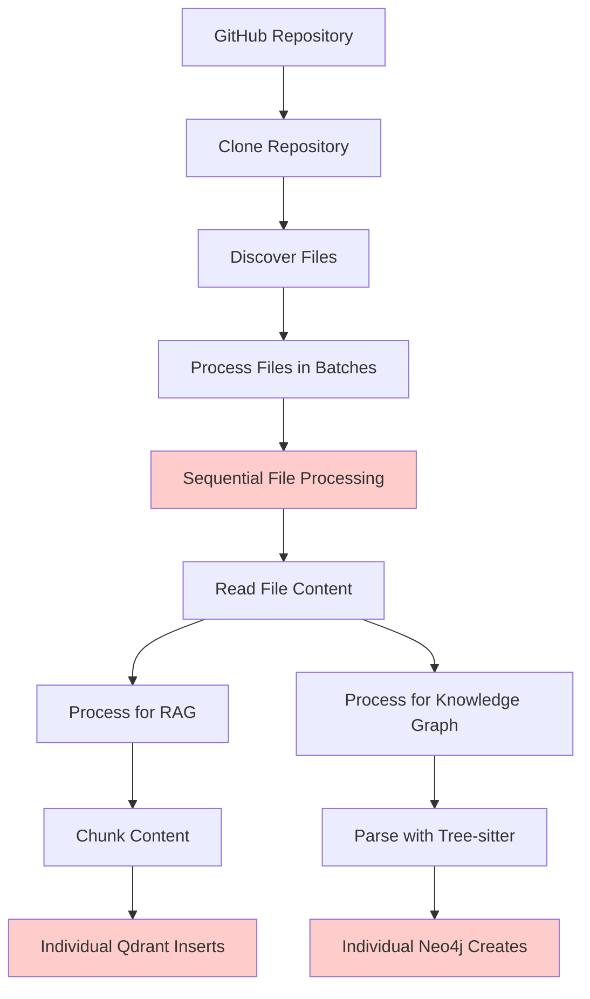
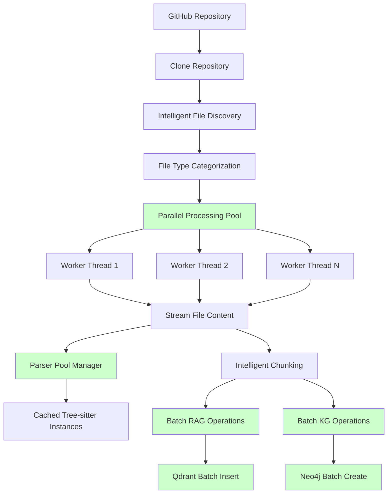
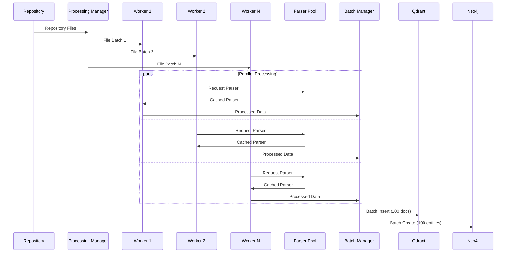
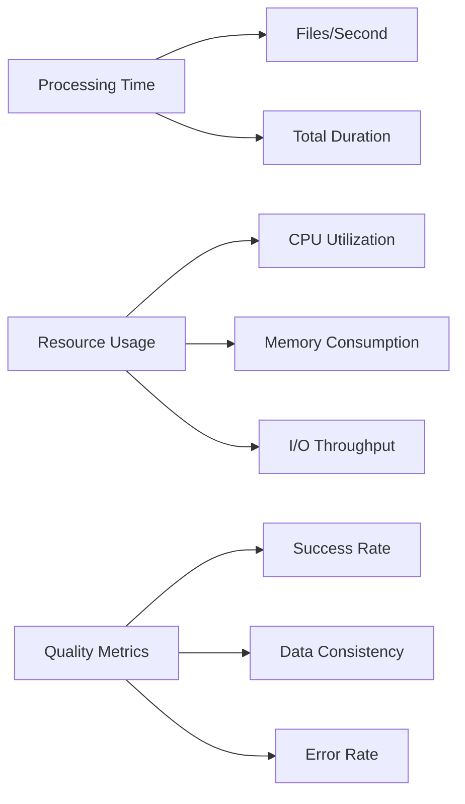

# GitHub Repository Indexing Optimization - Product Requirements Document

## Executive Summary

This PRD outlines optimization strategies for the `index_github_repository` MCP tool to achieve 50-70% performance improvements in processing GitHub repositories for RAG and Knowledge Graph indexing. The current implementation processes ~27.5 seconds per file, which can be optimized through parallel processing, intelligent batching, and resource management improvements.

## Problem Statement

### Current Performance Issues

- **Sequential File Processing**: Files are processed in small batches (5 concurrent files) with significant I/O wait times
- **Suboptimal Resource Utilization**: CPU cores and memory are underutilized during processing
- **Tree-sitter Parser Overhead**: AST parsing happens individually per file without caching optimizations
- **Network Latency**: Multiple individual database calls instead of efficient batch operations
- **Memory Management**: No intelligent chunking strategy for large files

### Success Metrics

- **Primary**: Reduce average processing time per file from 27.5s to 10-15s (45-55% improvement)
- **Secondary**: Increase concurrent file processing from 5 to 15-20 files
- **Tertiary**: Reduce memory footprint by 30% through intelligent chunking
- **Quality**: Maintain 100% accuracy and data consistency across optimizations

## Market & Technical Research

### Performance Benchmarks

Based on research findings:
- **Tree-sitter Performance**: AST parsing can achieve linear time complexity with proper caching
- **Async Processing**: Python asyncio can handle 50-100 concurrent operations efficiently
- **Batch Processing**: Database batch operations show 5-10x performance improvements
- **Parallel AST Parsing**: Multiple parser instances can process files concurrently safely

### Best Practices Identified

1. **Intelligent Batching**: Process similar file types together for parser optimization
2. **Connection Pooling**: Reuse database connections and prepared statements
3. **Memory Streaming**: Process large files in chunks without loading entirely in memory
4. **Cache Optimization**: Share parsed AST components between similar files

## User Stories & Requirements

### Epic: High-Performance Repository Processing

#### Story 1: Parallel File Processing
**As a** developer using the MCP tool  
**I want** repository files to be processed in parallel  
**So that** large repositories are indexed quickly without blocking

**Acceptance Criteria:**
- [ ] Support 15-20 concurrent file processing threads
- [ ] Intelligent batching based on file types and sizes
- [ ] Resource monitoring to prevent system overload
- [ ] Progress tracking with real-time updates

#### Story 2: Optimized Tree-sitter Processing
**As a** system administrator  
**I want** AST parsing to be optimized for performance  
**So that** code analysis doesn't become the bottleneck

**Acceptance Criteria:**
- [ ] Parser instance pooling for reuse
- [ ] Concurrent parsing with proper thread safety
- [ ] Grammar caching for repeated file types
- [ ] Intelligent filtering to skip unnecessary parsing

#### Story 3: Batch Database Operations
**As a** data engineer  
**I want** database operations to be batched efficiently  
**So that** network latency doesn't slow down processing

**Acceptance Criteria:**
- [ ] Batch insert operations for Qdrant vectors
- [ ] Batch create operations for Neo4j entities
- [ ] Connection pooling and reuse
- [ ] Transaction optimization

#### Story 4: Memory-Efficient Processing
**As a** system resource manager  
**I want** memory usage to be optimized  
**So that** large repositories don't exhaust system resources

**Acceptance Criteria:**
- [ ] Streaming file processing for large files
- [ ] Intelligent chunk size calculation
- [ ] Memory monitoring and adaptive processing
- [ ] Garbage collection optimization

## Technical Architecture

### Current Architecture Analysis



### Optimized Architecture Design



### Component Specifications

#### 1. Parallel Processing Manager

```python
class ParallelProcessingManager:
    """Manages concurrent file processing with intelligent resource allocation."""
    
    def __init__(self, max_workers: int = None):
        self.max_workers = max_workers or min(32, (os.cpu_count() or 1) + 4)
        self.semaphore = asyncio.Semaphore(self.max_workers)
        self.executor = ThreadPoolExecutor(max_workers=self.max_workers)
        
    async def process_files_parallel(self, files: List[Path]) -> AsyncIterator[FileResult]:
        """Process files with optimal concurrency and resource management."""
```

#### 2. Parser Pool Manager

```python
class ParserPoolManager:
    """Manages tree-sitter parser instances for efficient reuse."""
    
    def __init__(self, pool_size: int = 8):
        self.pool_size = pool_size
        self.parser_pools = {}  # language -> queue of parsers
        
    async def get_parser(self, language: str) -> TreeSitterParser:
        """Get or create parser instance for given language."""
```

#### 3. Batch Operations Manager

```python
class BatchOperationsManager:
    """Manages batch database operations for improved performance."""
    
    def __init__(self, batch_size: int = 100):
        self.batch_size = batch_size
        self.qdrant_batch = []
        self.neo4j_batch = []
        
    async def add_to_rag_batch(self, documents: List[Document]):
        """Add documents to RAG batch for processing."""
        
    async def add_to_kg_batch(self, entities: List[Entity]):
        """Add entities to Knowledge Graph batch for processing."""
```

## Data Flow Optimization

### Current vs Optimized Processing Flow



## Implementation Phases

### Phase 1: Parallel Processing Foundation (Week 1-2)
**Priority**: Critical  
**Dependencies**: None

**Tasks:**
- [ ] Implement `ParallelProcessingManager` class
- [ ] Upgrade file processing to use asyncio.gather() with semaphore
- [ ] Add resource monitoring and adaptive concurrency
- [ ] Update progress tracking for parallel operations

**Technical Requirements:**
- Maintain backward compatibility with existing API
- Add configuration options for concurrency limits
- Implement proper error handling and rollback

### Phase 2: Parser Optimization (Week 3)
**Priority**: High  
**Dependencies**: Phase 1

**Tasks:**
- [ ] Implement `ParserPoolManager` with parser instance reuse
- [ ] Add grammar caching for repeated file types
- [ ] Optimize tree-sitter parser configuration
- [ ] Add parser selection based on file content

**Technical Requirements:**
- Thread-safe parser instance management
- Memory-efficient parser pooling
- Support for all existing programming languages

### Phase 3: Batch Operations (Week 4)
**Priority**: High  
**Dependencies**: Phase 1

**Tasks:**
- [ ] Implement `BatchOperationsManager` for database operations
- [ ] Optimize Qdrant batch insert operations
- [ ] Optimize Neo4j batch create operations
- [ ] Add connection pooling and transaction management

**Technical Requirements:**
- Configurable batch sizes based on content
- Proper transaction handling for consistency
- Error recovery and partial batch processing

### Phase 4: Memory Optimization (Week 5)
**Priority**: Medium  
**Dependencies**: Phase 1-3

**Tasks:**
- [ ] Implement streaming file processing for large files
- [ ] Add intelligent chunk size calculation
- [ ] Optimize memory usage in concurrent processing
- [ ] Add memory monitoring and adaptive processing

**Technical Requirements:**
- Support for files larger than available RAM
- Adaptive processing based on system resources
- Memory-efficient data structures

### Phase 5: Advanced Optimizations (Week 6)
**Priority**: Low  
**Dependencies**: Phase 1-4

**Tasks:**
- [ ] Add file type-specific optimization strategies
- [ ] Implement intelligent caching for repeated patterns
- [ ] Add performance metrics and monitoring
- [ ] Optimize for specific repository patterns

## API Specifications

### Enhanced UnifiedIndexingService Interface

```python
class OptimizedUnifiedIndexingService:
    """Optimized version of UnifiedIndexingService with parallel processing."""
    
    def __init__(
        self,
        max_workers: int = None,
        batch_size: int = 100,
        parser_pool_size: int = 8,
        memory_limit_mb: int = 2048,
        **kwargs
    ):
        """Initialize with performance optimization settings."""
        
    async def process_repository_unified(
        self,
        request: UnifiedIndexingRequest,
        progress_callback: Optional[Callable] = None
    ) -> UnifiedIndexingResponse:
        """Process repository with optimized parallel processing."""
        
    async def get_performance_metrics(self) -> Dict[str, Any]:
        """Get detailed performance metrics for monitoring."""
```

### Configuration Options

```yaml
optimization_config:
  parallel_processing:
    max_workers: 20
    batch_size: 5
    memory_limit_mb: 2048
    
  parser_optimization:
    pool_size: 8
    cache_grammars: true
    reuse_instances: true
    
  database_optimization:
    qdrant_batch_size: 100
    neo4j_batch_size: 50
    connection_pool_size: 10
    
  memory_optimization:
    stream_large_files: true
    chunk_size_adaptive: true
    gc_threshold: 1024
```

## Performance Metrics & Monitoring

### Key Performance Indicators



### Monitoring Dashboard

- **Real-time Processing Rate**: Files processed per second
- **Resource Utilization**: CPU, Memory, I/O usage graphs
- **Error Tracking**: Failed files and error categories
- **Performance Trends**: Historical processing time improvements
- **Bottleneck Analysis**: Identification of slowest components

## Risk Assessment & Mitigation

### Technical Risks

| Risk | Impact | Probability | Mitigation Strategy |
|------|--------|-------------|-------------------|
| Memory exhaustion with large repositories | High | Medium | Implement adaptive processing and memory monitoring |
| Parser thread safety issues | High | Low | Use proper locking and parser instance isolation |
| Database connection exhaustion | Medium | Medium | Implement connection pooling with limits |
| Race conditions in batch processing | Medium | Low | Use proper synchronization primitives |
| Inconsistent data due to parallel processing | High | Low | Implement atomic batch operations with rollback |

### Performance Risks

| Risk | Impact | Probability | Mitigation Strategy |
|------|--------|-------------|-------------------|
| No performance improvement | High | Low | Benchmark each optimization phase |
| System overload with high concurrency | Medium | Medium | Implement adaptive concurrency controls |
| Increased complexity affecting maintainability | Medium | High | Maintain comprehensive test coverage |

## Success Validation

### Performance Benchmarks

```python
# Benchmark Configuration
test_repositories = [
    {"url": "https://github.com/pallets/click", "files": 10, "size": "small"},
    {"url": "https://github.com/fastapi/fastapi", "files": 50, "size": "medium"},
    {"url": "https://github.com/microsoft/vscode", "files": 200, "size": "large"}
]

target_improvements = {
    "processing_time_reduction": 0.45,  # 45% faster
    "memory_usage_reduction": 0.30,    # 30% less memory
    "concurrency_increase": 3.0,       # 3x more concurrent files
    "error_rate_maximum": 0.01         # <1% error rate
}
```

### Acceptance Testing

- [ ] Process 10 different repositories with size variations
- [ ] Verify data consistency between old and new implementations
- [ ] Measure performance improvements under different system loads
- [ ] Test error handling and recovery scenarios
- [ ] Validate memory usage under sustained processing

## Implementation Guidelines

### Code Quality Standards

- **Test Coverage**: Minimum 90% for all new optimization code
- **Performance Tests**: Automated benchmarks for each optimization
- **Documentation**: Comprehensive API documentation and performance guides
- **Backward Compatibility**: Maintain existing API interface

### Deployment Strategy

1. **Feature Flags**: Enable optimizations gradually with configuration
2. **A/B Testing**: Compare old vs new implementation performance
3. **Monitoring**: Real-time performance tracking during rollout
4. **Rollback Plan**: Quick revert capability if issues arise

## Future Considerations

### Advanced Optimizations (Phase 6+)

- **GPU Acceleration**: Use GPU for embedding calculations if available
- **Distributed Processing**: Scale across multiple machines for very large repositories
- **Machine Learning**: Predict optimal processing strategies based on repository characteristics
- **Streaming Architecture**: Process repositories without full download

### Integration Opportunities

- **Caching Layer**: Redis/Memcached for frequently accessed repositories
- **Message Queue**: RabbitMQ/Apache Kafka for distributed processing
- **Metrics Platform**: Prometheus/Grafana for advanced monitoring
- **Load Balancing**: Multiple service instances for high availability

---

This PRD provides a comprehensive roadmap for optimizing the GitHub repository indexing performance while maintaining data quality and system reliability. The phased approach allows for incremental improvements and risk management throughout the implementation process.