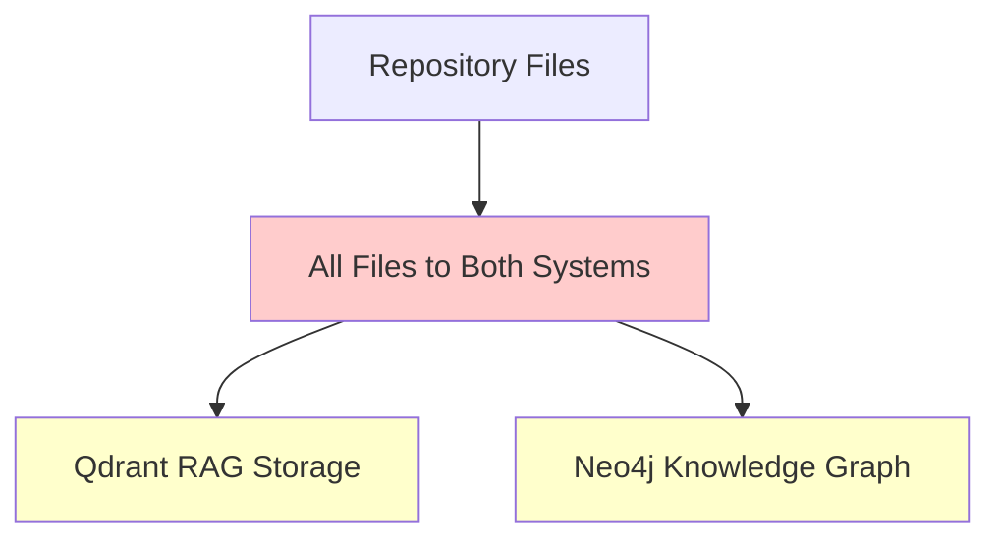
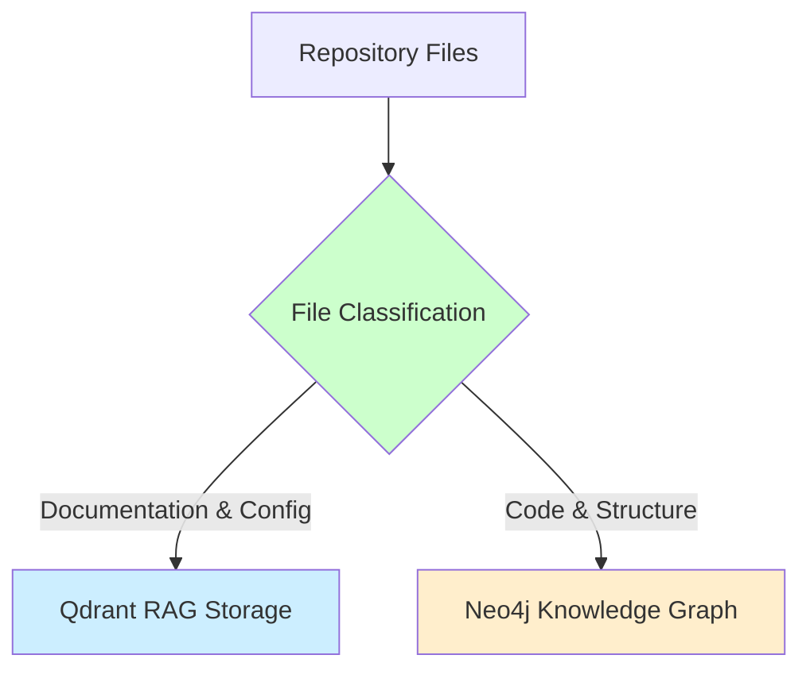
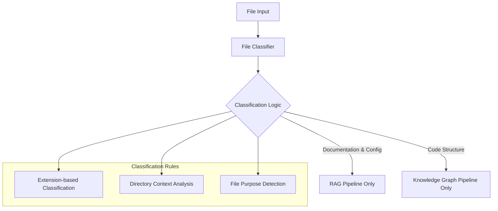
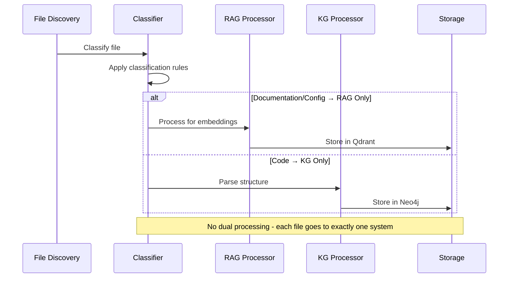
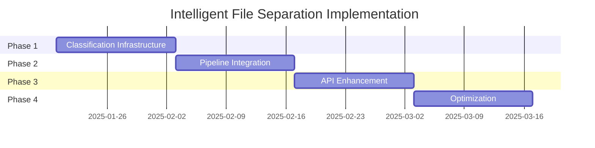

# PRD: Intelligent File Type Separation for Dual-System Repository Indexing

## Executive Summary

The current `index_github_repository` tool with `destination="both"` processes all specified files for both Qdrant (RAG) and Neo4j (Knowledge Graph), causing inefficient resource usage and data duplication. This PRD outlines the implementation of intelligent file type separation that automatically routes different file types to their optimal systems based on content characteristics and use cases.

**Success Metrics:**
- 30-50% reduction in processing time for `destination="both"`
- 40-60% reduction in storage overhead 
- Improved query performance through optimized data distribution
- Zero breaking changes to existing API

## Problem Definition

### Current State


**Issues:**
1. **Resource Inefficiency**: Documentation files unnecessarily processed for code structure analysis
2. **Storage Bloat**: Code files stored as text chunks in vector database without semantic value
3. **Performance Impact**: Irrelevant embeddings dilute search quality
4. **Cost Overhead**: Unnecessary embedding computations and storage

### Target State


## Market Research & Technical Analysis

### Industry Best Practices

Based on research of production RAG systems, the following patterns emerge:

1. **Content-Specific Storage**: Leading systems separate documentation (vector search) from code structure (graph analysis)
2. **Smart Routing**: Automated classification reduces manual configuration overhead
3. **Hybrid Approaches**: Some file types benefit from dual processing (README files with code examples)

### Technical Feasibility

**Strengths:**
- Existing infrastructure supports both systems
- Clear file type patterns in repositories
- Minimal API changes required

**Risks:**
- Classification edge cases requiring fallback logic
- Backward compatibility maintenance
- Performance regression during transition

## User Stories & Requirements

### Epic: Intelligent File Routing System

#### Story 1: Automatic Documentation Routing
**As a** developer using RAG for code documentation  
**I want** documentation files automatically routed to vector search  
**So that** I get high-quality semantic search without code noise

**Acceptance Criteria:**
- [ ] `.md`, `.mdx`, `.rst`, `.txt` files routed to Qdrant only
- [ ] Configuration files (`.json`, `.yaml`, `.yml`, `.toml`) routed to Qdrant only
- [ ] Processing time reduced by 25-40% for documentation-heavy repos
- [ ] Search quality maintained or improved

#### Story 2: Automatic Code Structure Routing  
**As a** developer analyzing code architecture  
**I want** code files automatically parsed for structural relationships  
**So that** I can understand dependencies without storage overhead

**Acceptance Criteria:**
- [ ] Code files (`.py`, `.js`, `.ts`, `.java`, `.go`, `.rs`, `.c`, `.cpp`) routed to Neo4j only
- [ ] Class, function, and import relationships captured
- [ ] Storage overhead reduced by 30-50%
- [ ] Graph queries return complete structural information

#### Story 3: Clear File Type Separation
**As a** developer using the indexing system  
**I want** clear separation between documentation and code processing  
**So that** each system contains only relevant, optimized data

**Acceptance Criteria:**
- [ ] No file processed by both systems simultaneously
- [ ] Clear classification rules with no ambiguity
- [ ] Performance optimization through elimination of redundant processing

#### Story 4: Backward Compatibility
**As a** existing user of the indexing system  
**I want** current API behavior preserved  
**So that** my existing workflows continue without changes

**Acceptance Criteria:**
- [ ] Current API parameters unchanged
- [ ] Default behavior improvement with opt-out option
- [ ] Migration path for existing indexed data

## Technical Architecture

### Classification Engine Design



### Enhanced Request Model

```python
@dataclass
class IntelligentRoutingConfig:
    """Configuration for intelligent file routing."""
    
    # Force specific routing (override auto-classification)
    force_rag_patterns: List[str] = field(default_factory=list)
    force_kg_patterns: List[str] = field(default_factory=list)
    
    # Enable/disable intelligent routing
    enable_intelligent_routing: bool = True
    
    # Fallback behavior for unclassified files
    unclassified_fallback: IndexingDestination = IndexingDestination.QDRANT

@dataclass 
class UnifiedIndexingRequest:
    # ... existing fields ...
    routing_config: IntelligentRoutingConfig = field(default_factory=IntelligentRoutingConfig)
```

### File Classification Logic

```python
class FileClassifier:
    """Intelligent file classifier for optimal system routing."""
    
    # RAG-optimized file types (documentation & config)
    RAG_EXTENSIONS = {
        '.md', '.mdx', '.rst', '.txt', '.adoc', '.wiki',
        '.json', '.yaml', '.yml', '.toml', '.ini', '.cfg'
    }
    
    # Knowledge Graph-optimized file types (code structure)
    KG_EXTENSIONS = {
        '.py', '.js', '.ts', '.tsx', '.jsx', '.java', '.scala', '.kt',
        '.go', '.rs', '.c', '.cpp', '.cc', '.cxx', '.h', '.hpp',
        '.cs', '.php', '.rb', '.swift', '.dart', '.m', '.mm'
    }
    
    def classify_file(self, file_path: str) -> IndexingDestination:
        """Classify file for single-destination processing."""
        extension = Path(file_path).suffix.lower()
        
        if extension in self.RAG_EXTENSIONS:
            return IndexingDestination.QDRANT
        elif extension in self.KG_EXTENSIONS:
            return IndexingDestination.NEO4J
        else:
            # Default fallback to documentation (RAG)
            return IndexingDestination.QDRANT
```

### Processing Pipeline Enhancement



## Implementation Strategy

### Phase 1: Classification Infrastructure (Week 1-2)
```yaml
components:
  - FileClassifier class with rule engine
  - IntelligentRoutingConfig dataclass
  - Enhanced UnifiedIndexingRequest
  - Classification unit tests

deliverables:
  - Core classification logic
  - Configuration system
  - Comprehensive test coverage
```

### Phase 2: Processing Pipeline Integration (Week 3-4)
```yaml
components:
  - Modified _process_single_file method
  - Enhanced routing logic in unified service
  - Metrics and logging for classification decisions
  - Performance benchmarking

deliverables:
  - Integrated classification in processing pipeline
  - Performance metrics collection
  - Classification decision logging
```

### Phase 3: API Enhancement & Testing (Week 5-6)
```yaml
components:
  - Enhanced MCP tool interface
  - Backward compatibility validation
  - End-to-end integration tests
  - Performance comparison tests

deliverables:
  - Complete API with intelligent routing
  - Comprehensive test suite
  - Performance benchmarks
  - Documentation updates
```

### Phase 4: Optimization & Monitoring (Week 7-8)
```yaml
components:
  - Performance tuning based on benchmarks
  - Classification accuracy improvements
  - Production monitoring
  - User feedback integration

deliverables:
  - Optimized classification rules
  - Production-ready monitoring
  - User documentation
  - Migration guides
```

## API Specifications

### Enhanced Tool Interface

```python
async def index_github_repository(
    ctx: Context,
    repo_url: str,
    destination: str = "both",
    file_types: List[str] = None,
    max_files: int = 50,
    chunk_size: int = 5000,
    max_size_mb: int = 500,
    # NEW: Intelligent routing configuration
    enable_intelligent_routing: bool = True,
    force_rag_patterns: List[str] = None,
    force_kg_patterns: List[str] = None,
) -> str:
    """
    Enhanced GitHub repository indexing with intelligent file routing.
    
    NEW PARAMETERS:
    enable_intelligent_routing: Enable automatic file classification (default: True)
    force_rag_patterns: Regex patterns to force RAG processing
    force_kg_patterns: Regex patterns to force KG processing
    """
```

### Response Enhancement

```json
{
  "classification_summary": {
    "total_files": 150,
    "rag_only": 61,
    "kg_only": 89,
    "classification_time_ms": 234
  },
  "routing_decisions": [
    {
      "file_path": "README.md",
      "classification": "rag_only",
      "reason": "documentation_file",
      "confidence": 1.0
    }
  ],
  "performance_improvement": {
    "processing_time_reduction_percent": 42.3,
    "storage_efficiency_gain_percent": 38.7
  }
}
```

## Data Models

### Classification Result Model

```python
@dataclass
class ClassificationResult:
    """Result of file classification."""
    
    file_path: str
    classification: Literal["rag_only", "kg_only"] 
    confidence: float
    reasoning: str
    applied_rules: List[str]
    override_applied: bool = False
```

### Enhanced File Processing Result

```python
@dataclass
class FileProcessingResult:
    # ... existing fields ...
    
    # NEW: Classification information
    classification: ClassificationResult
    classification_time_ms: float
    routing_efficiency_gain: float
```

## Risk Assessment & Mitigation

### Technical Risks

| Risk | Impact | Probability | Mitigation |
|------|--------|-------------|------------|
| Classification accuracy issues | Medium | Low | Comprehensive test suite, fallback to dual processing |
| Performance regression | High | Low | Extensive benchmarking, gradual rollout |
| Edge case file handling | Medium | Medium | Robust fallback logic, user override options |
| Breaking API changes | High | Very Low | Strict backward compatibility testing |

### Business Risks

| Risk | Impact | Probability | Mitigation |
|------|--------|-------------|------------|
| User adoption resistance | Medium | Low | Clear migration documentation, opt-out option |
| Increased complexity | Medium | Medium | Comprehensive documentation, sensible defaults |
| Support overhead | Low | Medium | Proactive monitoring, clear error messages |

## Success Metrics & KPIs

### Performance Metrics
- **Processing Time Reduction**: Target 30-50% improvement for `destination="both"`
- **Storage Efficiency**: Target 40-60% reduction in redundant data
- **Memory Usage**: Target 25-35% reduction during processing

### Quality Metrics  
- **Classification Accuracy**: Target >95% correct classifications
- **Search Quality**: Maintain or improve semantic search relevance
- **Graph Completeness**: Maintain 100% of structural relationships

### User Experience Metrics
- **API Compatibility**: 100% backward compatibility
- **Error Rate**: <1% classification errors requiring manual intervention
- **User Satisfaction**: Positive feedback on performance improvements

## Implementation Plan

### Development Phases



### Testing Strategy

#### Unit Tests
- File classification logic (100+ test cases)
- Configuration validation
- Error handling scenarios

#### Integration Tests  
- End-to-end processing pipeline
- Cross-system file_id consistency
- Performance benchmarking

#### Acceptance Tests
- User story validation
- API compatibility verification
- Real repository processing validation

## Appendices

### A. File Type Classification Reference

#### RAG-Optimized Extensions
```yaml
documentation:
  - .md, .mdx, .rst, .txt, .adoc, .wiki
  - .pdf (if text-extractable)

configuration:
  - .json, .yaml, .yml, .toml
  - .ini, .cfg, .conf
  - .env, .env.example
```

#### Knowledge Graph-Optimized Extensions
```yaml
programming_languages:
  - .py, .pyi (Python)
  - .js, .ts, .tsx, .jsx (JavaScript/TypeScript)
  - .java, .scala, .kt (JVM languages)
  - .go (Go)
  - .rs (Rust)
  - .c, .cpp, .cc, .cxx, .h, .hpp (C/C++)
  - .cs (C#)
  - .php, .rb, .swift, .dart (Other languages)

build_systems:
  - package.json, pom.xml, build.gradle
  - Cargo.toml, go.mod, requirements.txt
```

#### Simple File Type Classification

**Clear Separation Strategy**:

```yaml
documentation_and_config_files:
  extensions: ['.md', '.mdx', '.rst', '.txt', '.adoc', '.wiki', '.json', '.yaml', '.yml', '.toml', '.ini', '.cfg']
  destination: qdrant_only
  purpose: semantic_search_and_context_retrieval
  examples:
    - "README.md" (project documentation)
    - "API.md" (API documentation) 
    - "docker-compose.yml" (configuration)
    - "package.json" (dependencies and metadata)

code_and_structure_files:
  extensions: ['.py', '.js', '.ts', '.tsx', '.jsx', '.java', '.scala', '.kt', '.go', '.rs', '.c', '.cpp', '.h', '.hpp', '.cs', '.php', '.rb', '.swift', '.dart']
  destination: neo4j_only
  purpose: structural_analysis_and_relationship_discovery
  examples:
    - "main.py" (Python source code)
    - "index.js" (JavaScript implementation)
    - "App.tsx" (React component)
    - "service.go" (Go service implementation)
```

**Classification Rules**:
1. **Extension-based**: Primary classification method using file extensions
2. **No content analysis**: Avoid complex heuristics that could cause ambiguity
3. **Default fallback**: Unknown extensions → Qdrant (documentation assumption)
4. **No overlap**: Each file processed by exactly one system

### B. Performance Benchmarks

#### Baseline Measurements (Current System)
```yaml
medium_repository_100_files:
  total_processing_time: "45.2s"
  qdrant_storage: "2.3MB"
  neo4j_storage: "1.8MB"
  memory_peak: "512MB"

large_repository_500_files:
  total_processing_time: "3m 42s"
  qdrant_storage: "12.7MB" 
  neo4j_storage: "8.4MB"
  memory_peak: "1.2GB"
```

#### Target Improvements
```yaml
medium_repository_100_files:
  target_processing_time: "27-32s" # 30-40% improvement
  target_qdrant_storage: "1.4-1.8MB" # 20-40% reduction
  target_neo4j_storage: "1.1-1.4MB" # 20-40% reduction
  target_memory_peak: "350-400MB" # 20-30% reduction
```

---

**Document Status**: Draft v1.0  
**Author**: Claude Code Assistant  
**Review Status**: Ready for Technical Review  
**Implementation Target**: Q1 2025