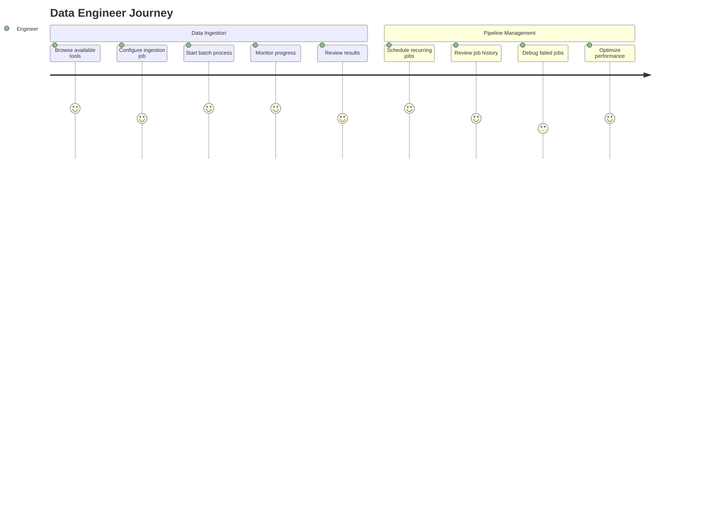
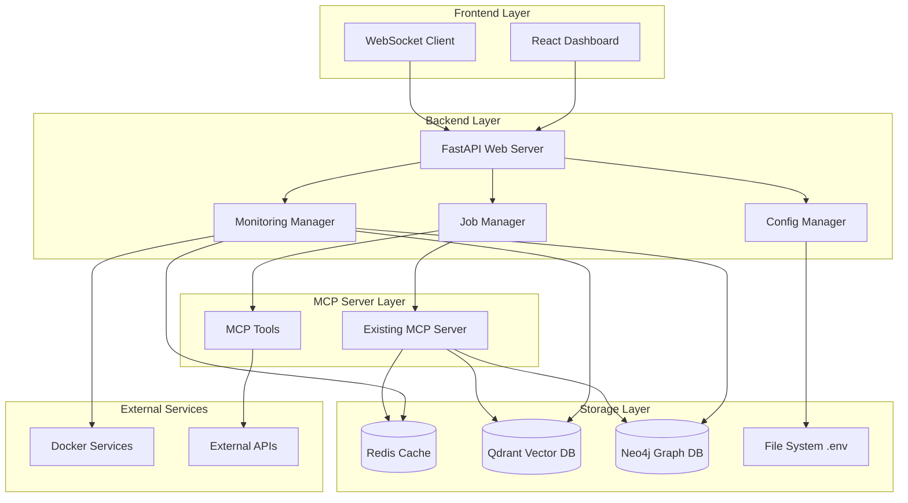
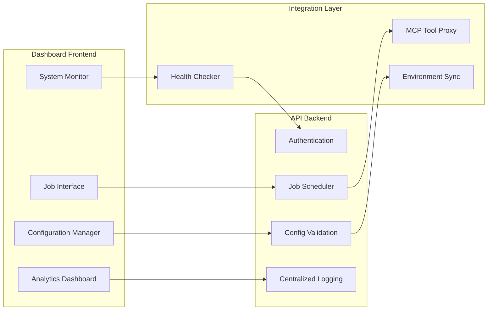
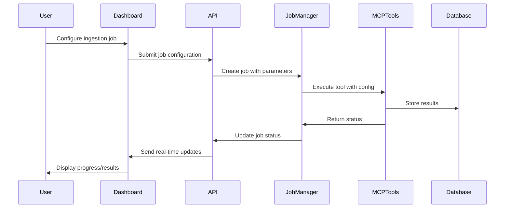
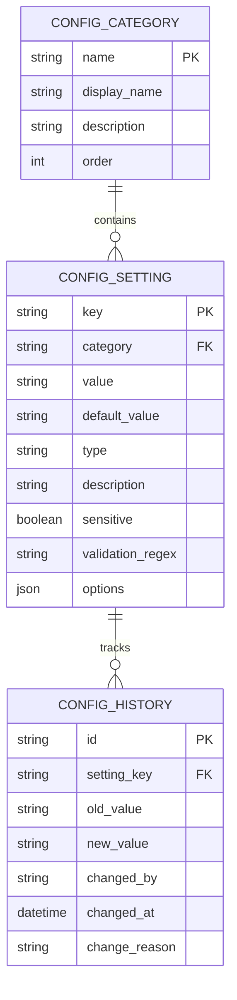
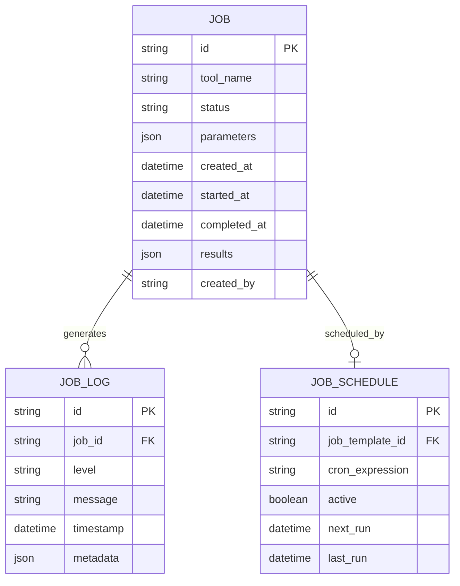
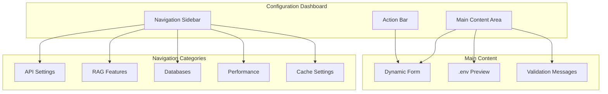
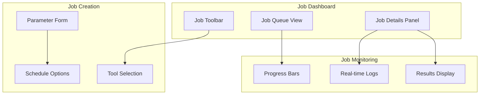

# MCP Server Management Dashboard - Product Requirements Document

## 1. Executive Summary

### Vision
Create a comprehensive web dashboard that eliminates the complexity of .env file management and provides intuitive data ingestion capabilities for the MCP (Model Context Protocol) server, enabling developers to configure and operate their AI-powered crawling and RAG systems through a modern web interface.

### Problem Statement
Developers currently face significant friction when setting up and operating MCP servers:
- **Configuration Complexity**: 156+ environment variables across 10 categories require manual .env editing
- **Data Ingestion Blindness**: No visibility into crawling jobs, batch operations, or pipeline status
- **Operational Overhead**: No centralized monitoring, logging, or system health visibility
- **Error Resolution**: Difficult troubleshooting without proper dashboards and metrics

### Solution Overview
A React-based dashboard that provides:
1. **Intuitive Configuration Management**: Web UI for all .env settings with validation and presets
2. **Standalone Data Ingestion**: Execute MCP tools without LLM agent dependency  
3. **Real-time Monitoring**: Job tracking, system health, and performance metrics
4. **Developer Experience**: Guided setup, error diagnostics, and operational insights

### Success Metrics
- **Setup Time Reduction**: 80% faster initial configuration (from hours to minutes)
- **Job Visibility**: 100% transparency into data ingestion pipeline status
- **Error Resolution**: 60% faster troubleshooting with centralized logging and metrics
- **Adoption**: Dashboard becomes primary interface for 90% of server operations

## 2. User Stories & Journey Maps

### Primary User: Setup Developer


#### Epic 1: Configuration Management
**As a** setup developer  
**I want** to manage all MCP server configurations through a web interface  
**So that** I can avoid manual .env editing and configuration errors  

**Acceptance Criteria:**
- [ ] Visual form interface for all 156 configuration variables
- [ ] Real-time validation and error highlighting
- [ ] Configuration presets for common deployment scenarios
- [ ] Export/import .env files
- [ ] Change tracking and rollback capabilities

#### Epic 2: System Health Monitoring
**As a** setup developer  
**I want** to monitor server health and service dependencies  
**So that** I can quickly identify and resolve infrastructure issues  

**Acceptance Criteria:**
- [ ] Dashboard showing Docker services status (Qdrant, Neo4j, Redis)
- [ ] Database connection health checks
- [ ] API endpoint availability monitoring
- [ ] Resource usage metrics (CPU, memory, disk)
- [ ] Alert system for critical failures

### Secondary User: Data Engineer



#### Epic 3: Data Ingestion Interface
**As a** data engineer  
**I want** to execute and monitor data ingestion jobs through the dashboard  
**So that** I can manage data pipelines without LLM agent dependency  

**Acceptance Criteria:**
- [ ] Web forms for all 12 MCP tools with parameter validation
- [ ] Real-time job progress tracking with logs
- [ ] Batch job queue management
- [ ] Job scheduling and automation
- [ ] Results visualization and export

#### Epic 4: Pipeline Analytics
**As a** data engineer  
**I want** to analyze ingestion performance and results  
**So that** I can optimize data processing workflows  

**Acceptance Criteria:**
- [ ] Job success/failure metrics and trends
- [ ] Performance analytics (throughput, latency, resource usage)
- [ ] Data quality metrics (chunk counts, embedding dimensions)
- [ ] Source management and statistics
- [ ] Historical trending and reporting

## 3. Technical Architecture

### System Architecture Diagram



### Component Architecture



### Data Flow Architecture



## 4. API Specifications

### Configuration Management API

```typescript
// GET /api/config - Get current configuration
interface ConfigResponse {
  categories: {
    [category: string]: {
      [key: string]: {
        value: string;
        description: string;
        type: 'string' | 'number' | 'boolean' | 'select';
        options?: string[];
        validation?: string;
        sensitive?: boolean;
      }
    }
  }
}

// PUT /api/config - Update configuration
interface ConfigUpdateRequest {
  changes: {
    [key: string]: string;
  };
  restart_required?: boolean;
}

// POST /api/config/validate - Validate configuration
interface ValidationRequest {
  config: { [key: string]: string };
}

interface ValidationResponse {
  valid: boolean;
  errors: {
    [key: string]: string[];
  };
  warnings: {
    [key: string]: string[];
  };
}
```

### Job Management API

```typescript
// POST /api/jobs - Create new ingestion job
interface JobCreateRequest {
  tool_name: string;
  parameters: { [key: string]: any };
  schedule?: {
    type: 'once' | 'recurring';
    cron?: string;
    interval?: number;
  };
}

// GET /api/jobs - List jobs with filters
interface JobListResponse {
  jobs: Job[];
  pagination: {
    page: number;
    per_page: number;
    total: number;
  };
}

interface Job {
  id: string;
  tool_name: string;
  status: 'pending' | 'running' | 'completed' | 'failed';
  created_at: string;
  started_at?: string;
  completed_at?: string;
  parameters: { [key: string]: any };
  progress?: {
    current: number;
    total: number;
    message?: string;
  };
  results?: {
    success: boolean;
    chunks_stored?: number;
    error?: string;
    [key: string]: any;
  };
}

// WebSocket /ws/jobs/{job_id} - Real-time job updates
interface JobUpdateMessage {
  type: 'progress' | 'status' | 'log';
  data: {
    progress?: { current: number; total: number; message?: string };
    status?: Job['status'];
    log?: { level: string; message: string; timestamp: string };
  };
}
```

### Monitoring API

```typescript
// GET /api/health - System health status
interface HealthResponse {
  status: 'healthy' | 'degraded' | 'unhealthy';
  services: {
    [service: string]: {
      status: 'up' | 'down' | 'unknown';
      latency?: number;
      error?: string;
    }
  };
  metrics: {
    cpu_usage: number;
    memory_usage: number;
    disk_usage: number;
    active_jobs: number;
  };
}

// GET /api/metrics - Performance metrics
interface MetricsResponse {
  timerange: { start: string; end: string };
  data: {
    [metric: string]: {
      timestamp: string;
      value: number;
    }[];
  };
}
```

## 5. Data Models

### Configuration Schema



### Job Management Schema



## 6. Implementation Phases

### Phase 1: Core Dashboard Infrastructure (MVP)
**Duration**: 3-4 weeks
**Priority**: High

#### Features:
- React frontend with TypeScript and Material-UI
- FastAPI backend with WebSocket support
- Configuration management interface for all .env variables
- Basic system health monitoring
- Docker service status checking

#### Technical Tasks:
- Set up React project with routing and state management
- Implement FastAPI server with configuration endpoints
- Create configuration validation system
- Build Docker health checking service
- Implement real-time WebSocket connection

#### Acceptance Criteria:
- [ ] Users can view and edit all configuration categories
- [ ] Configuration changes are validated before saving
- [ ] System shows Docker service status in real-time
- [ ] Configuration exports to valid .env format
- [ ] Basic error handling and user feedback

### Phase 2: Data Ingestion Interface
**Duration**: 2-3 weeks  
**Priority**: High

#### Features:
- Web forms for all 12 MCP tools
- Real-time job execution and monitoring
- Job queue management
- Basic logging and results display

#### Technical Tasks:
- Create dynamic form generator for MCP tool parameters
- Implement job execution service with progress tracking
- Build WebSocket job status updates
- Create job results visualization
- Add basic job history and filtering

#### Acceptance Criteria:
- [ ] Users can execute any MCP tool through web interface
- [ ] Real-time progress updates during job execution
- [ ] Job results are clearly displayed with success/error states
- [ ] Job history shows past executions with filters
- [ ] Basic error handling for failed jobs

### Phase 3: Advanced Job Management & Scheduling
**Duration**: 2-3 weeks
**Priority**: Medium

#### Features:
- Job scheduling and automation
- Batch job processing
- Advanced job monitoring and analytics
- Job templates and presets

#### Technical Tasks:
- Implement cron-based job scheduling
- Create batch processing queue system
- Build job analytics dashboard
- Add job template system
- Implement job dependency management

#### Acceptance Criteria:
- [ ] Users can schedule recurring ingestion jobs
- [ ] Batch jobs can be queued and processed sequentially
- [ ] Analytics show job performance trends
- [ ] Job templates reduce setup time for common tasks
- [ ] Job dependencies ensure proper execution order

### Phase 4: Advanced Monitoring & Analytics
**Duration**: 2-3 weeks
**Priority**: Medium

#### Features:
- Comprehensive system metrics
- Performance analytics and trending
- Advanced alerting and notifications
- Data quality monitoring

#### Technical Tasks:
- Implement metrics collection and storage
- Create analytics dashboard with charts
- Build alerting system with multiple channels
- Add data quality validation and reporting
- Implement performance optimization recommendations

#### Acceptance Criteria:
- [ ] Comprehensive metrics dashboard with historical data
- [ ] Automated alerts for system issues and job failures
- [ ] Data quality metrics and validation reports
- [ ] Performance recommendations and optimization tips
- [ ] Export capabilities for metrics and reports

## 7. User Interface Design

### Configuration Management Interface



### Job Management Interface



## 8. Risks & Mitigations

### Technical Risks

| Risk | Impact | Probability | Mitigation |
|------|---------|-------------|------------|
| WebSocket connection instability | High | Medium | Implement reconnection logic, fallback to polling |
| Configuration validation complexity | Medium | High | Comprehensive test suite, staged validation |
| Job execution failures | High | Medium | Robust error handling, job retry mechanisms |
| Performance with large job queues | Medium | Medium | Pagination, lazy loading, background processing |

### Operational Risks

| Risk | Impact | Probability | Mitigation |
|------|---------|-------------|------------|
| User adoption resistance | Medium | Low | Gradual migration, training materials |
| Configuration corruption | High | Low | Backup/restore, change tracking, validation |
| Resource consumption | Medium | Medium | Monitoring, resource limits, optimization |

## 9. Success Metrics & KPIs

### User Experience Metrics
- **Setup Time**: Time from dashboard access to working MCP server
  - Target: < 10 minutes (vs 30+ minutes manual)
- **Configuration Accuracy**: Percentage of valid configurations on first attempt
  - Target: > 95% (vs ~70% manual editing)
- **Job Success Rate**: Percentage of ingestion jobs completing successfully
  - Target: > 90%

### Operational Metrics
- **Dashboard Adoption**: Percentage of configurations made via dashboard vs .env
  - Target: > 80% within 3 months
- **Error Resolution Time**: Average time to identify and fix configuration issues
  - Target: < 5 minutes (vs 20+ minutes manual debugging)
- **Job Visibility**: Percentage of jobs with complete tracking and logging
  - Target: 100%

### Technical Metrics
- **System Uptime**: Dashboard availability and responsiveness
  - Target: > 99.5%
- **Real-time Update Latency**: Time for job status updates to appear
  - Target: < 2 seconds
- **Performance Impact**: Resource overhead of dashboard vs direct MCP server
  - Target: < 5% additional resource usage

## 10. Future Enhancements

### Phase 5: Advanced Features (Future)
- **Multi-tenant Support**: Multiple MCP server instances
- **User Management**: Role-based access control
- **API Integration**: Third-party tool integrations
- **Advanced Analytics**: ML-powered optimization recommendations
- **Mobile Interface**: Responsive design for mobile monitoring

### Phase 6: Enterprise Features (Future)
- **High Availability**: Clustered dashboard deployment
- **Audit Logging**: Comprehensive change tracking
- **Integration Ecosystem**: Plugin architecture for extensions
- **Advanced Security**: SSO, encryption, compliance features

## Appendices

### A. Configuration Categories Mapping

| Category | Variables | Priority | Complexity |
|----------|-----------|----------|------------|
| MCP Server | 4 variables | High | Low |
| AI Models | 12 variables | High | Medium |
| Redis Cache | 7 variables | Medium | Low |
| RAG Features | 6 variables | High | Medium |
| Databases | 5 variables | High | Low |
| Performance | 10 variables | Medium | High |

### B. MCP Tools Reference

| Tool | Purpose | Parameters | Output |
|------|---------|------------|---------|
| crawl_single_page | Web page crawling | url | Chunks stored count |
| smart_crawl_url | Intelligent crawling | url, strategy | Processing summary |
| smart_crawl_github | Repository indexing | repo_url, options | File processing stats |
| perform_rag_query | Vector search | query, filters | Search results |
| get_available_sources | Source discovery | None | Source list |
| search_code_examples | Code search | query | Code examples |
| parse_github_repository | Knowledge graph | repo_url | Parsing results |
| check_ai_script_hallucinations | Validation | script_path | Validation report |
| query_knowledge_graph | Graph queries | cypher_query | Query results |

### C. Technology Stack

**Frontend**
- React 18+ with TypeScript
- Material-UI v5 for components
- React Query for state management
- WebSocket client for real-time updates
- React Hook Form for form management

**Backend**
- FastAPI with async support
- WebSocket for real-time communication
- Pydantic for data validation
- SQLAlchemy for job persistence
- Celery for background job processing

**Infrastructure**
- Docker containers for deployment
- Redis for job queue and caching
- PostgreSQL for job/config history
- Nginx for reverse proxy

---

This PRD provides the foundation for implementing a comprehensive dashboard that addresses the core needs of MCP server configuration management and data ingestion operations while maintaining flexibility for future enhancements.