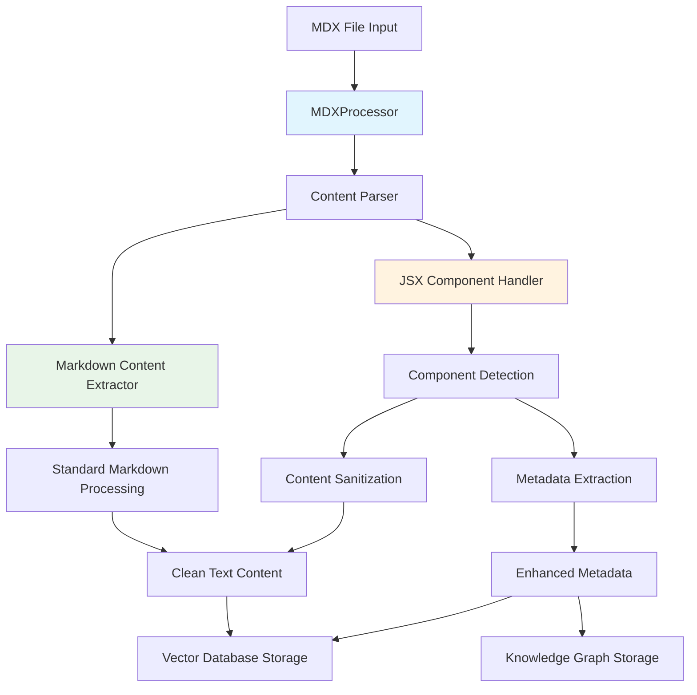
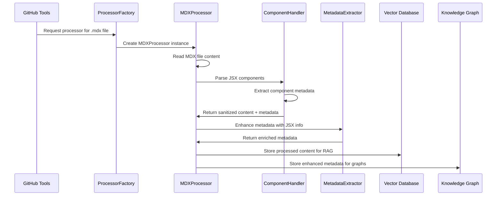

# MDX File Support Implementation PRD

## Executive Summary

This PRD outlines the implementation of MDX file format support in the existing GitHub crawling and indexing tools (`smart_crawl_github` and `index_github_repository`). MDX is an enhanced Markdown format that allows embedding JSX components directly within content, making it increasingly popular in modern documentation sites, React-based applications, and developer tools.

**Success Metrics**: 
- MDX files are processed with the same efficiency as existing Markdown files
- JSX components are either preserved or gracefully stripped while maintaining content integrity
- Implementation requires minimal changes to existing architecture
- Zero breaking changes to current .md file processing

## Problem Statement & Solution

### Current State
The system currently supports standard Markdown files (`.md`, `.markdown`, `.mdown`, `.mkd`) through a dedicated `MarkdownProcessor` that:
- Extracts pure text content for vector embedding
- Maintains file metadata and structure
- Integrates with both RAG (Qdrant) and Knowledge Graph (Neo4j) systems

### Problem
MDX files (`.mdx`) are increasingly common in:
- **React-based documentation** (Docusaurus, Nextra, Storybook)
- **Component libraries** (documentation with live examples) 
- **Modern dev tools** (README files with interactive elements)
- **Technical blogs** (combining content with interactive demos)

Currently, these files are ignored during repository indexing, causing incomplete content coverage.

### Solution Overview
Implement MDX support by:
1. **Extending file type recognition** to include `.mdx` extensions
2. **Creating an MDX processor** that handles JSX components appropriately
3. **Maintaining content integrity** while extracting searchable text
4. **Preserving metadata** about JSX components for enhanced search context

## Technical Architecture

### Component Overview



### Processing Flow



### Data Models

#### Enhanced Metadata Structure
```json
{
  "base_metadata": {
    "file_path": "components/Button.mdx",
    "type": "mdx_content", 
    "language": "mdx",
    "content_type": "documentation"
  },
  "mdx_specific": {
    "jsx_components_count": 3,
    "jsx_components": [
      {
        "name": "Button",
        "type": "component_usage",
        "props": ["variant", "size", "onClick"],
        "line_number": 15
      },
      {
        "name": "CodeBlock", 
        "type": "component_usage",
        "props": ["language", "code"],
        "line_number": 32
      }
    ],
    "imports": [
      {
        "source": "react",
        "imports": ["useState", "useEffect"],
        "line_number": 1
      },
      {
        "source": "../components/Button",
        "imports": ["Button"],
        "line_number": 2
      }
    ],
    "exports": ["default", "metadata"],
    "has_frontmatter": true,
    "interactive_elements": true
  }
}
```

## Implementation Strategy

### Phase 1: Core MDX Processing (MVP)
**Timeline**: 1-2 weeks

**Objectives**:
- Basic MDX file recognition and processing
- Content extraction with JSX component removal
- Integration with existing processor pipeline

**Tasks**:
1. **Create MDXProcessor class** - Extend `BaseFileProcessor`
2. **Implement content parsing** - Extract markdown content, strip JSX
3. **Update processor registry** - Add `.mdx` extension mapping  
4. **Add tests** - Unit tests for MDX processing scenarios

**Acceptance Criteria**:
- [ ] `.mdx` files are recognized during repository scanning
- [ ] JSX components are stripped, markdown content is preserved
- [ ] MDX files are indexed in both Qdrant and Neo4j
- [ ] No breaking changes to existing `.md` processing
- [ ] Content quality maintained (>95% text preservation)

### Phase 2: Enhanced Component Awareness (Optional)
**Timeline**: 2-3 weeks

**Objectives**:
- Preserve component information in metadata
- Enhanced search capabilities for component-based content
- Better cross-reference linking

**Tasks**:
1. **JSX Component Parser** - Regex-based component detection
2. **Import/Export Detection** - Track module dependencies
3. **Enhanced Metadata** - Store component information
4. **Search Enhancement** - Component-aware search queries

**Acceptance Criteria**:
- [ ] JSX components are detected and cataloged
- [ ] Import/export statements are tracked
- [ ] Component metadata enables enhanced search
- [ ] Cross-component relationships are discoverable

### Phase 3: Advanced Features (Future Enhancement)
**Timeline**: 3-4 weeks

**Objectives**:
- Frontmatter processing for enhanced metadata
- Interactive element detection
- Cross-file component relationship mapping

## Technical Implementation Details

### MDXProcessor Implementation

```python
class MDXProcessor(BaseFileProcessor):
    """Process MDX files with JSX component awareness."""
    
    def __init__(self):
        super().__init__(
            name="mdx",
            supported_extensions=[".mdx"],
            max_file_size=2_000_000,  # 2MB limit for MDX files
        )
        self.jsx_component_pattern = re.compile(
            r'<([A-Z][a-zA-Z0-9]*)[^>]*(?:/>|>.*?</\1>)', 
            re.DOTALL
        )
        self.import_pattern = re.compile(
            r'import\s+(?:{[^}]+}|\w+)\s+from\s+[\'"]([^\'"]+)[\'"]'
        )
        self.export_pattern = re.compile(
            r'export\s+(?:default\s+)?(?:const\s+|function\s+)?(\w+)'
        )

    def _process_file_impl(self, file_path: str, relative_path: str, **kwargs) -> List[ProcessedContent]:
        content = self.read_file_content(file_path)
        
        # Extract frontmatter if present
        frontmatter, main_content = self._extract_frontmatter(content)
        
        # Parse JSX components
        jsx_metadata = self._parse_jsx_components(main_content)
        
        # Extract imports/exports
        imports = self._extract_imports(main_content)
        exports = self._extract_exports(main_content)
        
        # Clean content for vector storage
        clean_content = self._remove_jsx_components(main_content)
        clean_content = self._clean_markdown_content(clean_content)
        
        # Build enhanced metadata
        enhanced_metadata = self._build_enhanced_metadata(
            relative_path, jsx_metadata, imports, exports, frontmatter
        )
        
        processed_content = self.create_processed_content(
            content=clean_content.strip(),
            content_type="mdx_content",
            name=os.path.basename(file_path),
            signature=None,
            line_number=1,
            language="mdx",
            enhanced_metadata=enhanced_metadata
        )
        
        return [processed_content]

    def _parse_jsx_components(self, content: str) -> List[Dict]:
        """Extract JSX component usage information."""
        components = []
        matches = self.jsx_component_pattern.finditer(content)
        
        for match in matches:
            component_name = match.group(1)
            component_content = match.group(0)
            line_number = content[:match.start()].count('\n') + 1
            
            # Extract props (simplified)
            props = self._extract_component_props(component_content)
            
            components.append({
                "name": component_name,
                "type": "component_usage",
                "props": props,
                "line_number": line_number,
                "full_content": component_content[:200] + "..." if len(component_content) > 200 else component_content
            })
            
        return components

    def _remove_jsx_components(self, content: str) -> str:
        """Remove JSX components but preserve any text content inside them."""
        # Replace self-closing components
        content = re.sub(r'<[A-Z][a-zA-Z0-9]*[^>]*?/>', '', content)
        
        # Replace component pairs, preserving inner text
        def replace_component(match):
            tag_name = match.group(1)
            inner_content = match.group(2) if match.group(2) else ""
            # Return just the inner text content
            return inner_content
        
        content = re.sub(
            r'<([A-Z][a-zA-Z0-9]*)[^>]*?>(.*?)</\1>', 
            replace_component, 
            content, 
            flags=re.DOTALL
        )
        
        return content
```

### Processor Registration Updates

```python
# In processor_factory.py
def _create_default_registry(self) -> ProcessorRegistry:
    registry = ProcessorRegistry()
    
    # Existing processors
    registry.register("markdown", MarkdownProcessor)
    registry.register("mdx", MDXProcessor)  # New MDX processor
    registry.register("python", PythonProcessor)
    registry.register("typescript", TypeScriptProcessor)
    registry.register("config", ConfigProcessor)
    
    return registry
```

### GitHub Tools Integration

```python
# In github_tools.py - Update processor mapping
processor_map = {
    ".md": MarkdownProcessor,
    ".markdown": MarkdownProcessor,
    ".mdown": MarkdownProcessor,
    ".mkd": MarkdownProcessor,
    ".mdx": MDXProcessor,  # Add MDX support
    ".py": PythonProcessor,
    ".ts": TypeScriptProcessor,
    ".tsx": TypeScriptProcessor,
    # ... existing mappings
}
```

## Risk Assessment & Mitigation

### Technical Risks

| Risk | Impact | Probability | Mitigation Strategy |
|------|--------|-------------|-------------------|
| **Regex parsing complexity** | Medium | Medium | Start with simple regex patterns, iterate based on real-world files |
| **Performance degradation** | Low | Low | Implement efficient parsing with size limits, optimize regex patterns |
| **Content extraction accuracy** | Medium | Low | Comprehensive testing with diverse MDX files, validation algorithms |
| **Memory usage with large MDX files** | Medium | Low | File size limits (2MB), streaming processing for large files |

### Integration Risks

| Risk | Impact | Probability | Mitigation Strategy |
|------|--------|-------------|-------------------|
| **Breaking existing .md processing** | High | Very Low | Separate processor classes, thorough testing, feature flags |
| **Metadata schema conflicts** | Medium | Low | Backward-compatible metadata extensions, versioned schemas |
| **Performance impact on existing flows** | Low | Low | Lazy loading of MDX processor, conditional feature activation |

### Business Risks

| Risk | Impact | Probability | Mitigation Strategy |
|------|--------|-------------|-------------------|
| **Limited MDX adoption** | Low | Medium | Research shows growing adoption in React ecosystem, dev tools |
| **Maintenance overhead** | Medium | Medium | Comprehensive documentation, automated testing, clear code structure |

## Success Metrics & Monitoring

### Functional Metrics
- **File Processing Success Rate**: >95% of MDX files processed without errors
- **Content Preservation Quality**: >90% of original markdown content preserved
- **Component Detection Accuracy**: >85% of JSX components correctly identified
- **Processing Time**: MDX processing ≤ 2x standard markdown processing time

### Usage Metrics
- **MDX File Coverage**: Track percentage of repositories with MDX files that get indexed
- **Search Quality**: Measure search relevance for MDX-sourced content
- **Error Rate**: Monitor MDX-specific processing errors

### Performance Metrics
- **Memory Usage**: MDX processing should not exceed 150% of standard markdown memory usage
- **Processing Throughput**: Maintain overall repository indexing speed within 20% of baseline

## Dependencies & Prerequisites

### Required Dependencies
- **Python regex library** (built-in `re` module) - For JSX component parsing
- **Existing processor framework** - Extends current `BaseFileProcessor` architecture
- **No new external dependencies** - Implementation uses only existing project dependencies

### Optional Dependencies (Phase 2+)
- **python-frontmatter** library - For robust frontmatter parsing
- **yaml** library - For frontmatter metadata extraction

### System Requirements
- **No additional infrastructure** - Uses existing Qdrant and Neo4j storage
- **Backward compatibility** - Must not break existing `.md` file processing
- **File size limits** - MDX files limited to 2MB (configurable)

## Testing Strategy

### Unit Tests
- **Content Parsing Tests**: Various MDX syntax combinations
- **JSX Component Detection**: Self-closing tags, nested components, props
- **Import/Export Extraction**: Different import styles, default exports
- **Content Cleaning**: Verify JSX removal preserves markdown content
- **Metadata Generation**: Ensure accurate component metadata extraction

### Integration Tests
- **Processor Factory Integration**: Verify MDX processor registration
- **GitHub Tools Integration**: End-to-end repository processing with MDX files
- **Storage Integration**: Confirm Qdrant and Neo4j storage with MDX metadata
- **Search Quality**: Validate search results for MDX-sourced content

### Performance Tests
- **Large File Processing**: 2MB MDX files with extensive JSX content
- **Component-Heavy Files**: Files with 20+ JSX components
- **Repository Scale**: Repositories with 100+ MDX files
- **Memory Usage**: Monitor memory consumption during processing

### Real-World Testing
- **Popular MDX Repositories**: Test with real repositories using MDX (Docusaurus, Nextra projects)
- **Component Library Documentation**: Test with design system repositories
- **React Project Documentation**: Test with React app documentation

## Implementation Phases - Detailed Breakdown

### Phase 1: MVP Implementation (1-2 weeks)

#### Week 1: Core Infrastructure
**Day 1-2**: MDXProcessor class creation and basic structure
**Day 3-4**: Content parsing and JSX stripping logic  
**Day 5**: Integration with processor factory and registration

#### Week 2: Testing and Integration
**Day 1-2**: Unit tests for core functionality
**Day 3-4**: Integration with GitHub tools and end-to-end testing
**Day 5**: Documentation and code review

### Phase 2: Enhanced Features (2-3 weeks)

#### Week 1: Component Detection
**Day 1-3**: JSX component parsing with regex patterns
**Day 4-5**: Import/export statement detection

#### Week 2: Metadata Enhancement
**Day 1-2**: Enhanced metadata structure design
**Day 3-4**: Metadata integration with storage systems
**Day 5**: Search enhancement for component-aware queries

#### Week 3: Testing and Optimization
**Day 1-3**: Comprehensive testing with real-world MDX files
**Day 4-5**: Performance optimization and documentation

## API Specifications

### Updated MCP Tool Parameters

The existing tools will automatically support MDX files once implementation is complete:

#### smart_crawl_github
```json
{
  "file_types_to_index": [".md", ".mdx", ".py"],
  "description": "Now supports MDX files with JSX component processing"
}
```

#### index_github_repository  
```json
{
  "file_types": [".md", ".mdx", ".py", ".js", ".ts"],
  "description": "Unified indexing now includes MDX file support"
}
```

### Enhanced Response Schema

```json
{
  "success": true,
  "file_type_stats": {
    ".md": {"files": 15, "items": 45},
    ".mdx": {"files": 8, "items": 12, "jsx_components": 34},
    ".py": {"files": 25, "items": 156}
  },
  "mdx_processing_summary": {
    "files_processed": 8,
    "jsx_components_detected": 34,
    "imports_tracked": 12,
    "exports_tracked": 8,
    "content_preservation_rate": 0.94
  }
}
```

## Future Enhancements & Roadmap

### Short-term (3-6 months)
- **Frontmatter Processing**: Enhanced metadata extraction from YAML frontmatter
- **Component Relationship Mapping**: Track component dependencies across files
- **Interactive Element Detection**: Identify and catalog interactive components

### Medium-term (6-12 months)
- **Component Search**: Specialized search queries for finding component usage
- **Documentation Generation**: Auto-generate component documentation from MDX files
- **Cross-Reference Analysis**: Link components to their implementation files

### Long-term (12+ months)
- **Live Component Preview**: Integration with component preview systems
- **Version Tracking**: Track component API changes across repository versions
- **AI-Powered Documentation**: Generate component descriptions using AI analysis

## Conclusion

This implementation provides a robust foundation for MDX file support that:

1. **Integrates seamlessly** with existing architecture
2. **Maintains backward compatibility** with current markdown processing  
3. **Enables future enhancements** for component-aware features
4. **Delivers immediate value** through improved content coverage
5. **Scales efficiently** with repository size and complexity

The phased approach allows for iterative development and validation, ensuring each enhancement builds upon a solid foundation while maintaining system stability and performance.

**Next Steps**: 
1. Review and approve this PRD
2. Begin Phase 1 implementation
3. Establish testing framework with real-world MDX repositories
4. Monitor success metrics and user feedback for Phase 2 planning

---

*This PRD represents a comprehensive approach to adding MDX support while preserving the robust architecture and performance characteristics of the existing system.*