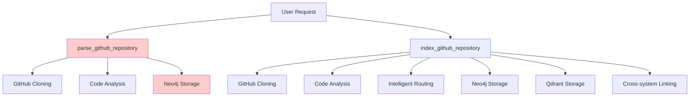

# Product Requirements Document: Deprecation of `parse_github_repository` Tool

## Executive Summary

This PRD outlines the complete deprecation and removal of the `parse_github_repository` MCP tool from the mcp-crawl4ai-rag codebase. The tool has been superseded by the more comprehensive `index_github_repository` tool, which provides all the same functionality plus additional enterprise-scale features. This removal will eliminate code duplication, reduce maintenance overhead, and simplify the tool interface for users.

## Problem Statement

### Current Issues
1. **Functional Redundancy**: Both `parse_github_repository` and `index_github_repository` provide GitHub repository indexing for Neo4j knowledge graphs
2. **User Confusion**: Having two similar tools with overlapping functionality creates decision paralysis for users
3. **Maintenance Overhead**: Maintaining two tools that serve similar purposes increases development complexity
4. **Code Duplication**: Similar validation logic, error handling, and processing patterns exist in both tools
5. **Documentation Complexity**: Multiple tools require more comprehensive documentation and examples

### Technical Analysis

#### `parse_github_repository` (Legacy Tool)
- **Primary Function**: GitHub repository parsing for Neo4j knowledge graph
- **Scope**: Neo4j-only indexing
- **Parameters**: Simple (repo_url only)
- **Output**: Basic statistics and parsing results
- **Processing Scale**: Basic repository analysis

#### `index_github_repository` (Modern Unified Tool)
- **Primary Function**: Unified GitHub repository indexing for both Qdrant (RAG) and Neo4j (KG)
- **Scope**: Dual-system processing with intelligent routing
- **Parameters**: Comprehensive (destination, file_types, max_files, etc.)
- **Output**: Detailed statistics, performance metrics, and cross-system linking
- **Processing Scale**: Enterprise-scale (up to 10,000 files)

### Functional Overlap Analysis

| Feature | `parse_github_repository` | `index_github_repository` |
|---------|---------------------------|----------------------------|
| Neo4j Knowledge Graph Indexing | ✅ | ✅ |
| GitHub Repository Cloning | ✅ | ✅ |
| Code Structure Analysis | ✅ | ✅ |
| Multi-language Support | ✅ | ✅ |
| Error Handling | ✅ | ✅ |
| Statistics Reporting | Basic | Comprehensive |
| Qdrant Vector Indexing | ❌ | ✅ |
| Intelligent File Routing | ❌ | ✅ |
| Configurable Processing | ❌ | ✅ |
| Enterprise Scale | ❌ | ✅ |
| Cross-system Linking | ❌ | ✅ |

**Conclusion**: `index_github_repository` is a complete superset of `parse_github_repository` functionality.

## Solution Overview

### Proposed Solution
Complete removal of `parse_github_repository` tool while ensuring all existing functionality remains available through `index_github_repository` with appropriate parameter configuration.

### Migration Strategy
Users can achieve identical functionality by using `index_github_repository` with the following parameter mapping:

```python
# OLD: parse_github_repository(repo_url)
# NEW: index_github_repository(repo_url, destination="neo4j")
```

## User Stories & Acceptance Criteria

### Epic: Tool Deprecation and Removal

#### Story 1: Developer Experience - No Functional Loss
**As a** developer using the MCP server  
**I want** to continue indexing GitHub repositories for knowledge graphs  
**So that** my existing workflows are not disrupted  

**Acceptance Criteria:**
- [ ] All `parse_github_repository` functionality is available via `index_github_repository`
- [ ] Neo4j-only indexing is possible with `destination="neo4j"` parameter
- [ ] Output format maintains essential information structure
- [ ] Performance characteristics are equivalent or better

#### Story 2: Developer Experience - Clean Tool Interface
**As a** developer discovering MCP tools  
**I want** a single, clear tool for GitHub repository indexing  
**So that** I can easily understand and use the available functionality  

**Acceptance Criteria:**
- [ ] Only `index_github_repository` appears in tool listings
- [ ] Documentation clearly explains unified indexing approach
- [ ] Examples demonstrate both RAG and KG use cases
- [ ] Migration guide is available for existing users

#### Story 3: Maintainer Experience - Reduced Complexity
**As a** codebase maintainer  
**I want** to eliminate redundant tools  
**So that** I can focus on improving core functionality  

**Acceptance Criteria:**
- [ ] All `parse_github_repository` code is removed
- [ ] No dead code remains in the codebase
- [ ] Test coverage is maintained for unified functionality
- [ ] Documentation reflects current tool set

## Technical Architecture

### Current State Architecture



### Target State Architecture

```mermaid
graph TD
    A[User Request] --> C[index_github_repository]
    
    C --> G[GitHub Cloning]
    C --> H[Code Analysis]
    C --> I[Intelligent Routing]
    
    I --> J[Neo4j Storage]
    I --> K[Qdrant Storage]
    I --> L[Cross-system Linking]
    
    M[destination="neo4j"] --> I
    N[destination="qdrant"] --> I
    O[destination="both"] --> I
    
    style C fill:#ccffcc
    style I fill:#ccffcc
```

### Code Removal Impact Analysis

#### Files to Modify

1. **`src/tools/kg_tools.py`**
   - Remove `parse_github_repository` function
   - Remove tool registration
   - Update imports if necessary

2. **`src/core/app.py`**
   - Remove `parse_github_repository` tool registration
   - Clean up conditional registrations

3. **Documentation Files**
   - `CLAUDE.md` - Update tool listings
   - `README.md` - Update examples and tool descriptions
   - `PRPs/mcp-tools-timeout-configuration-spec.md` - Update timeout mappings

4. **Test Files**
   - `tests/unit/tools/test_kg_tools.py` - Remove related tests
   - `tests/unit/core/test_core_app.py` - Update app registration tests
   - `tests/integration/test_timeout_behavior.py` - Update timeout tests

#### Dependencies Analysis

No external dependencies are exclusively used by `parse_github_repository`. All functionality relies on shared services:
- Neo4j client (shared)
- Repository extraction service (shared)
- GitHub URL validation (shared)

### Migration Guide for Users

#### Before (parse_github_repository)
```python
# Basic repository parsing
result = await parse_github_repository(
    ctx=context,
    repo_url="https://github.com/user/repo"
)
```

#### After (index_github_repository)
```python
# Equivalent functionality with unified tool
result = await index_github_repository(
    ctx=context,
    repo_url="https://github.com/user/repo",
    destination="neo4j",  # Neo4j-only indexing
    file_types=[".py"],   # Optional: specify file types
    max_files=1000        # Optional: control processing scale
)
```

#### Enhanced Capabilities Available
```python
# Enhanced functionality with dual indexing
result = await index_github_repository(
    ctx=context,
    repo_url="https://github.com/user/repo",
    destination="both",           # Both Qdrant and Neo4j
    file_types=[".py", ".md"],    # Multiple file types
    max_files=5000,               # Enterprise scale
    enable_intelligent_routing=True  # Smart file classification
)
```

## Implementation Phases

### Phase 1: Pre-Removal Validation ⏱️ 1-2 days
**Objective**: Ensure complete functional parity

**Tasks:**
- [ ] Create comprehensive test comparing both tools on same repository
- [ ] Validate output format compatibility
- [ ] Performance benchmark comparison
- [ ] Document parameter mapping

**Success Criteria:**
- [ ] `index_github_repository` with `destination="neo4j"` produces equivalent results
- [ ] Performance is equal or better
- [ ] All test cases pass

### Phase 2: Code Removal ⏱️ 1 day
**Objective**: Remove all `parse_github_repository` code

**Tasks:**
- [ ] Remove function from `src/tools/kg_tools.py`
- [ ] Remove tool registration from `src/core/app.py`
- [ ] Remove related test cases
- [ ] Update import statements

**Success Criteria:**
- [ ] All references to `parse_github_repository` are removed
- [ ] Code compiles without errors
- [ ] Existing functionality tests pass

### Phase 3: Documentation Update ⏱️ 1 day
**Objective**: Update all documentation and examples

**Tasks:**
- [ ] Update `CLAUDE.md` tool listings
- [ ] Update `README.md` examples
- [ ] Update timeout configuration specs
- [ ] Create migration guide section

**Success Criteria:**
- [ ] No references to deprecated tool in documentation
- [ ] Clear migration examples provided
- [ ] Tool listings are accurate

### Phase 4: Final Validation ⏱️ 1 day
**Objective**: Comprehensive testing and cleanup verification

**Tasks:**
- [ ] Run full test suite
- [ ] Search for any remaining references
- [ ] Validate MCP tool registration
- [ ] Performance testing

**Success Criteria:**
- [ ] All tests pass
- [ ] No dead code detected
- [ ] MCP server starts successfully
- [ ] Tool listing is clean

## Data Models & API Specifications

### Tool Registration Changes

#### Current Registration (Before)
```python
# In kg_tools.py
app.tool()(parse_github_repository)
app.tool()(check_ai_script_hallucinations)
app.tool()(query_knowledge_graph)

# In github_tools.py  
app.tool()(index_github_repository)
```

#### Target Registration (After)
```python
# In kg_tools.py
app.tool()(check_ai_script_hallucinations)
app.tool()(query_knowledge_graph)

# In github_tools.py
app.tool()(index_github_repository)
```

### Output Format Compatibility

Both tools return JSON responses with similar structure. Key fields mapping:

| `parse_github_repository` | `index_github_repository` | Notes |
|---------------------------|---------------------------|-------|
| `success` | `success` | Direct mapping |
| `repo_url` | `repo_url` | Direct mapping |
| `repo_name` | `repo_name` | Direct mapping |
| `statistics` | `storage_summary.neo4j_nodes` | Restructured but equivalent data |
| `message` | `processing_summary` | Enhanced detail level |

## Risk Assessment & Mitigations

### High-Risk Areas

#### Risk 1: User Workflow Disruption
**Impact**: High - Users relying on `parse_github_repository` may experience workflow breakage  
**Probability**: Medium - Some users may be using the tool in production  
**Mitigation**: 
- Provide clear migration guide with exact parameter mappings
- Ensure `index_github_repository` maintains backward compatibility in output format
- Comprehensive testing of equivalent functionality

#### Risk 2: Hidden Dependencies
**Impact**: Medium - Unidentified code dependencies could cause runtime errors  
**Probability**: Low - Code search shows all explicit references  
**Mitigation**:
- Comprehensive codebase search for string references
- Testing with actual tool removal before deployment
- Gradual rollout with monitoring

#### Risk 3: Test Coverage Gaps
**Impact**: Medium - Reduced test coverage after test removal  
**Probability**: Low - `index_github_repository` has comprehensive test coverage  
**Mitigation**:
- Ensure `index_github_repository` tests cover Neo4j-only scenarios
- Add specific test cases for deprecated functionality equivalence
- Maintain or improve overall coverage percentage

### Low-Risk Areas

#### Documentation Inconsistency
**Impact**: Low - Users may reference outdated documentation  
**Probability**: Medium - Documentation updates may be incomplete  
**Mitigation**: 
- Systematic documentation review
- Search and replace for all references
- Documentation testing as part of CI/CD

## Success Metrics

### Quantitative Metrics

1. **Code Complexity Reduction**
   - **Target**: 25% reduction in kg_tools.py file size
   - **Measurement**: Lines of code before vs after

2. **Test Execution Time**
   - **Target**: 15% reduction in test suite execution time
   - **Measurement**: Total test runtime before vs after

3. **Functional Equivalence**
   - **Target**: 100% functional parity for Neo4j indexing
   - **Measurement**: Comparative output analysis

### Qualitative Metrics

1. **Developer Experience**
   - **Target**: Simplified tool discovery and usage
   - **Measurement**: Tool listing clarity and documentation quality

2. **Maintenance Overhead**
   - **Target**: Reduced cognitive load for maintainers
   - **Measurement**: Single tool to maintain instead of two

3. **User Confusion**
   - **Target**: Eliminated decision paralysis between similar tools
   - **Measurement**: Clear single-tool approach

## Appendices

### Appendix A: Complete Reference Analysis

#### Direct Function References
- `src/tools/kg_tools.py:376` - Tool registration
- `src/tools/kg_tools.py:381` - Function definition
- `src/core/app.py:647` - App tool registration (production)
- `src/core/app.py:655` - App tool registration (development)

#### Test References
- `tests/unit/tools/test_kg_tools.py:10` - Import statement
- `tests/unit/tools/test_kg_tools.py:59-131` - Multiple test methods
- `tests/unit/core/test_core_app.py:277,309,416` - App registration tests
- `tests/integration/test_timeout_behavior.py:195` - Timeout behavior test

#### Documentation References
- `CLAUDE.md:109,177` - Tool description and timeout mapping
- `README.md:88,265,478,759` - Tool description, examples, and usage
- `PRPs/mcp-tools-timeout-configuration-spec.md:48,185,186` - Timeout configuration

### Appendix B: Functional Equivalence Validation

#### Test Scenario: Basic Repository Parsing
```python
# Scenario: Parse a Python repository for Neo4j knowledge graph
repo_url = "https://github.com/psf/requests"

# Legacy approach
legacy_result = await parse_github_repository(ctx, repo_url)

# New approach
unified_result = await index_github_repository(
    ctx, repo_url, destination="neo4j", file_types=[".py"]
)

# Validation points:
# 1. Same Neo4j nodes created
# 2. Same classes/methods/functions extracted
# 3. Similar processing statistics
# 4. Equivalent error handling
```

#### Output Format Mapping
```python
# Legacy output structure
{
    "success": True,
    "repo_url": "...",
    "repo_name": "...",
    "statistics": {
        "files_processed": 45,
        "classes_created": 12,
        "methods_created": 89
    }
}

# Unified output structure (relevant fields)
{
    "success": True,
    "repo_url": "...",
    "repo_name": "...",
    "storage_summary": {
        "neo4j_nodes": 146  # Includes classes + methods + functions
    },
    "processing_summary": {
        "files_processed": 45,
        "files_successful": 45
    }
}
```

### Appendix C: Implementation Checklist

#### Code Changes
- [ ] Remove `parse_github_repository` function from `kg_tools.py`
- [ ] Remove tool registration from `kg_tools.py`
- [ ] Remove conditional tool registration from `app.py`
- [ ] Update imports in affected files
- [ ] Remove related test functions from `test_kg_tools.py`
- [ ] Update app registration tests in `test_core_app.py`
- [ ] Update timeout behavior tests

#### Documentation Changes
- [ ] Update `CLAUDE.md` tool listings (2 locations)
- [ ] Update `README.md` tool descriptions and examples (4 locations)
- [ ] Update timeout configuration spec (3 locations)
- [ ] Add migration section to documentation

#### Validation Changes
- [ ] Add equivalence test comparing both approaches
- [ ] Verify `index_github_repository` covers all Neo4j scenarios
- [ ] Run full test suite after removal
- [ ] Validate MCP server startup and tool listing

#### Quality Assurance
- [ ] Search entire codebase for remaining references
- [ ] Test actual tool functionality with removed code
- [ ] Verify no import errors or undefined references
- [ ] Confirm documentation consistency

---

**Document Status**: Draft for Review  
**Last Updated**: 2025-01-17  
**Next Review**: Implementation Phase 1 Completion  
**Stakeholders**: Development Team, Tool Users, Documentation Maintainers  

This PRD provides a comprehensive roadmap for the safe and complete removal of the `parse_github_repository` tool while maintaining all functionality through the superior `index_github_repository` tool.