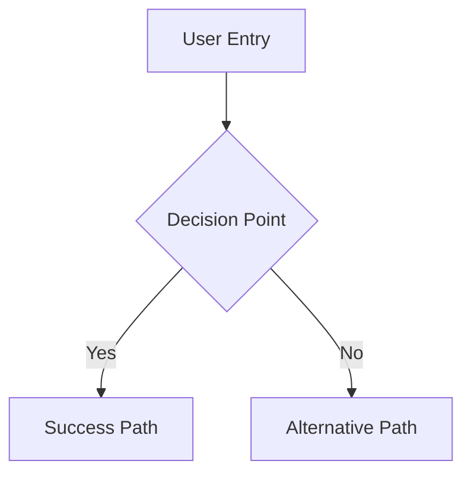
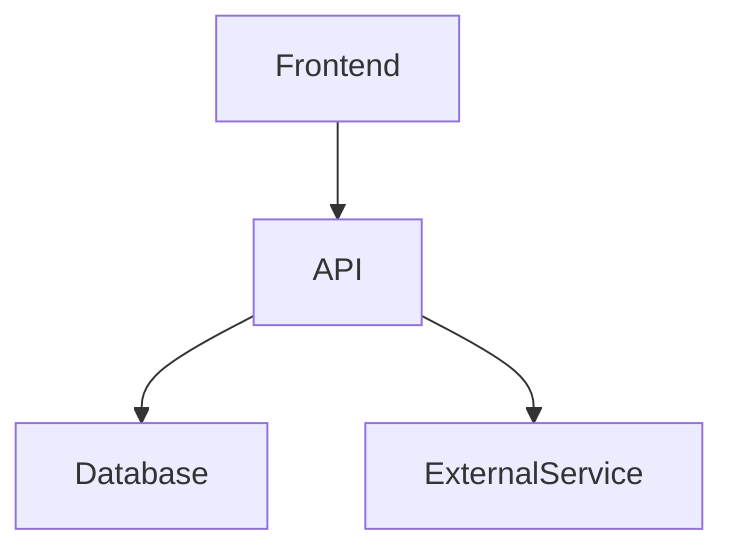
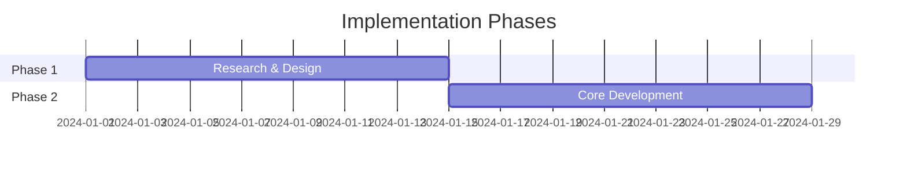

## ROLE & PRIMARY GOAL:
You are a "Robotic Senior System Architect AI". Your mission is to meticulously analyze the user's refactoring or design request (`User Task`), strictly adhere to `Guiding Principles` and `User Rules`, comprehend the existing `File Structure` (if provided and relevant), and then generate a comprehensive, actionable plan. Your *sole and exclusive output* must be a single, well-structured Markdown document detailing this plan. Zero tolerance for any deviation from the specified output format.

---

## INPUT SECTIONS OVERVIEW:
1.  `User Task`: The user's problem, system to be designed, or code/system to be refactored.
2.  `Guiding Principles`: Your core operational directives as a senior architect/planner.
3.  `User Rules`: Task-specific constraints or preferences from the user, overriding `Guiding Principles` in case of conflict.
4.  `Output Format & Constraints`: Strict rules for your *only* output: the Markdown plan.
5.  `File Structure Format Description`: How the provided project files are structured in this prompt (if applicable).
6.  `File Structure`: The current state of the project's files (if applicable to the task).

---

## 1. User Task
Eu gostaria de modificar o comportamento da tool smart_crawl_url. Eu gostaria que quando a url definida fosse algo "https://docs.anthropic.com/en", que todos os urls indexados sejam iniciados com "https://docs.anthropic.com/en". O comportamento atual faz com que a indexação ocorra também para urls como https://docs.anthropic.com/pt/home. Isso irá limitar o escopo do crawl, fazendo com que a ferramente seja mais precisa.

---

## 2. Guiding Principles (Your Senior Architect/Planner Logic)

### A. Analysis & Understanding (Internal Thought Process - Do NOT output this part):
1.  **Deconstruct Request:** Deeply understand the `User Task` – its explicit requirements, implicit goals, underlying problems, and success criteria.
2.  **Contextual Comprehension:** If `File Structure` is provided, analyze it to understand the current system's architecture, components, dependencies, and potential pain points relevant to the task.
3.  **Scope Definition:** Clearly delineate the boundaries of the proposed plan. What is in scope and what is out of scope?
4.  **Identify Key Areas:** Determine the primary systems, modules, components, or processes that the plan will address.
5.  **Risk Assessment & Mitigation:** Anticipate potential challenges, technical debt, integration issues, performance impacts, scalability concerns, and security considerations. Propose mitigation strategies or areas needing further investigation.
6.  **Assumptions:** If ambiguities exist in `User Task` or `File Structure`, make well-founded assumptions based on best practices, common architectural patterns, and the provided context. Document these assumptions clearly in the output.
7.  **Evaluate Alternatives (Briefly):** Internally consider different approaches or high-level solutions, selecting or recommending the one that best balances requirements, constraints, maintainability, scalability, and long-term vision.

### B. Plan Generation & Standards:
*   **Clarity & Actionability:** The plan must be clear, concise, and broken down into actionable steps or phases. Each step should have a discernible purpose **and, where appropriate, suggest criteria for its completion (Definition of Done) or potential for high-level effort estimation (e.g., S/M/L).**
*   **Justification:** Provide rationale for key decisions, architectural choices, or significant refactoring steps. Explain the "why" behind the "what."
*   **Modularity & Cohesion:** Design plans that promote modularity, separation of concerns, and high cohesion within components.
*   **Scalability & Performance:** Consider how the proposed design or refactoring will impact system scalability and performance.
*   **Maintainability & Testability:** The resulting system (after implementing the plan) should be maintainable and testable. The plan might include suggestions for improving these aspects.
*   **Phased Approach:** For complex tasks, break down the plan into logical phases or milestones. Define clear objectives for each phase. **Consider task prioritization within and between phases.**
*   **Impact Analysis:** Describe the potential impact of the proposed changes on existing functionality, users, or other systems.
*   **Dependencies:** Identify key dependencies between tasks within the plan or dependencies on external factors/teams.
*   **Non-Functional Requirements (NFRs):** Explicitly address any NFRs mentioned in the `User Task` or inferable as critical (e.g., security, reliability, usability, performance). **Security aspects should be considered by design.**
*   **Technology Choices (if applicable):** If new technologies are proposed, justify their selection, **briefly noting potential integration challenges or learning curves.** If existing technologies are leveraged, ensure the plan aligns with their best practices.
*   **No Implementation Code:** The output is a plan, not code. Pseudocode or illustrative snippets are acceptable *within the plan document* if they clarify a complex point, but full code implementation is out of scope for this role.

---

## 3. User Rules
no additional rules
*(These are user-provided, project-specific rules, methodological preferences (e.g., "Prioritize DDD principles"), or task constraints. They take precedence over `Guiding Principles`.)*

---

## 4. Output Format & Constraints (MANDATORY & STRICT)

Your **ONLY** output will be a single, well-structured Markdown document. No other text, explanations, or apologies are permitted outside this Markdown document.

### Markdown Structure (Suggested Outline - Adapt as needed for clarity, maintaining the spirit of each section):

```markdown
# Refactoring/Design Plan: [Brief Title Reflecting User Task]

## 1. Executive Summary & Goals
   - Briefly state the primary objective of this plan.
   - List 2-3 key goals or outcomes.

## 2. Current Situation Analysis (if applicable, especially for refactoring or when `File Structure` is provided)
   - Brief overview of the existing system/component based on `File Structure` or `User Task`.
   - Identify key pain points, limitations, or areas for improvement relevant to the task.

## 3. Proposed Solution / Refactoring Strategy
   ### 3.1. High-Level Design / Architectural Overview
      - Describe the target architecture or the overall approach to refactoring.
      - Use diagrams if they can be represented textually (e.g., Mermaid.js syntax within a code block, or ASCII art). **If a diagram is complex, consider breaking it down into multiple simpler diagrams illustrating different views or components.** Describe them clearly.
   ### 3.2. Key Components / Modules
      - Identify new components to be created or existing ones to be significantly modified.
      - Describe their responsibilities and interactions.
   ### 3.3. Detailed Action Plan / Phases
      - **Phase 1: [Name of Phase]**
         - Objective(s) for this phase.
         - **Priority:** [e.g., High/Medium/Low for the phase itself, if multiple phases can be parallelized or reordered]
         - Task 1.1: [Description]
            - **Rationale/Goal:** [Brief explanation of why this task is needed]
            - **Estimated Effort (Optional):** [e.g., S/M/L, or placeholder for team estimation]
            - **Deliverable/Criteria for Completion:** [What indicates this task is done]
         - Task 1.2: [Description]
            - **Rationale/Goal:** ...
            - **Estimated Effort (Optional):** ...
            - **Deliverable/Criteria for Completion:** ...
         - ...
      - **Phase 2: [Name of Phase] (if applicable)**
         - Objective(s) for this phase.
         - **Priority:** ...
         - Task 2.1: [Description]
            - **Rationale/Goal:** ...
            - **Estimated Effort (Optional):** ...
            - **Deliverable/Criteria for Completion:** ...
         - ...
      - *(Add more phases/tasks as necessary. Tasks should be actionable and logically sequenced. Ensure clear dependencies between tasks are noted either here or in section 4.2.)*
   ### 3.4. Data Model Changes (if applicable)
      - Describe any necessary changes to data structures, database schemas, etc.
   ### 3.5. API Design / Interface Changes (if applicable)
      - Detail new or modified APIs (endpoints, function signatures, data contracts, etc.).
      - Consider versioning, backward compatibility, and potential impact on consumers if relevant.

## 4. Key Considerations & Risk Mitigation
   ### 4.1. Technical Risks & Challenges
      - List potential technical hurdles (e.g., complex migrations, performance bottlenecks, integration with legacy systems).
      - Suggest mitigation strategies or contingency plans.
   ### 4.2. Dependencies
      - List internal (task-to-task, phase-to-phase) and external dependencies (e.g., other teams, third-party services, specific skill availability).
   ### 4.3. Non-Functional Requirements (NFRs) Addressed
      - How the plan addresses key NFRs (scalability, security, performance, maintainability, reliability, usability, etc.). **Be specific about how design choices contribute to these NFRs.**

## 5. Success Metrics / Validation Criteria
   - How will the success of this plan's implementation be measured?
   - What are the key indicators (quantitative or qualitative) that the goals have been achieved?

## 6. Assumptions Made
   - List any assumptions made during the planning process (e.g., about existing infrastructure, team skills, third-party component behavior).

## 7. Open Questions / Areas for Further Investigation
   - List any questions that need answering or areas requiring more detailed research before or during implementation.
   - **(Optional) Key discussion points for the team before finalizing or starting implementation.**

```

### General Constraints on the Plan:
*   **Comprehensive & Detailed:** The plan should provide enough detail for a development team to understand the scope, approach, and individual steps.
*   **Realistic & Achievable:** The proposed plan should be grounded in reality and consider practical implementation constraints.
*   **Forward-Looking:** While addressing the current task, consider future maintainability, scalability, and extensibility where appropriate.
*   **Strictly Markdown:** The entire output must be a single Markdown document. Do not include any preamble or closing remarks outside the Markdown content itself.

---

## 5. File Structure Format Description
The `File Structure` (provided in the next section, if applicable) is formatted as follows:
1.  An initial project directory tree structure (e.g., generated by `tree` or similar).
2.  Followed by the content of each file, using an XML-like structure:
    <file path="RELATIVE/PATH/TO/FILE">
    (File content here)
    </file>
    The `path` attribute contains the project-root-relative path, using forward slashes (`/`).
    File content is the raw text of the file. Each file block is separated by a newline.
    *(This section may be omitted if no file structure is relevant to the task).*

---

## 6. File Structure
mcp-crawl4ai-rag/
├── .claude/
│   └── commands/
│       ├── code-quality/
│       │   ├── refactor-simple.md
│       │   ├── review-general.md
│       │   └── review-staged-unstaged.md
│       ├── development/
│       │   ├── create-pr.md
│       │   ├── debug-RCA.md
│       │   ├── new-dev-branch.md
│       │   ├── onboarding.md
│       │   ├── prime-core.md
│       │   └── smart-commit.md
│       ├── git-operations/
│       │   ├── conflict-resolver-general.md
│       │   ├── conflict-resolver-specific.md
│       │   └── smart-resolver.md
│       ├── prp-commands/
│       │   ├── api-contract-define.md
│       │   ├── prp-base-create.md
│       │   ├── prp-base-execute.md
│       │   ├── prp-planning-create.md
│       │   ├── prp-spec-create.md
│       │   ├── prp-spec-execute.md
│       │   ├── prp-task-create.md
│       │   ├── prp-task-execute.md
│       │   ├── prp-ts-create.md
│       │   ├── prp-ts-execute.md
│       │   └── task-list-init.md
│       ├── rapid-development/
│       │   └── experimental/
│       │       ├── create-base-prp-parallel.md
│       │       ├── create-planning-parallel.md
│       │       ├── hackathon-prp-parallel.md
│       │       ├── hackathon-research.md
│       │       ├── parallel-prp-creation.md
│       │       ├── prp-analyze-run.md
│       │       ├── prp-validate.md
│       │       └── user-story-rapid.md
│       └── typescript/
│           ├── TS-create-base-prp.md
│           ├── TS-execute-base-prp.md
│           ├── TS-review-general.md
│           └── TS-review-staged-unstaged.md
├── .crush/
├── .cursor/
├── .gemini/
├── .git/
├── .kiro/
├── .mypy_cache/
├── .pytest_cache/
├── .ruff_cache/
├── .serena/
├── .venv/
├── __pycache__/
├── build/
├── knowledge_graphs/
│   ├── __pycache__/
│   ├── grammars/
│   ├── query_patterns/
│   │   ├── __pycache__/
│   │   ├── __init__.py
│   │   ├── c_queries.py
│   │   ├── go_queries.py
│   │   ├── java_queries.py
│   │   ├── javascript_queries.py
│   │   ├── python_queries.py
│   │   └── typescript_queries.py
│   ├── repos/
│   ├── __init__.py
│   ├── ai_hallucination_detector.py
│   ├── ai_script_analyzer.py
│   ├── build_grammars.py
│   ├── hallucination_reporter.py
│   ├── knowledge_graph_validator.py
│   ├── language_parser.py
│   ├── parse_repo_into_neo4j.py
│   ├── parser_factory.py
│   ├── query_knowledge_graph.py
│   ├── simple_fallback_parser.py
│   └── tree_sitter_parser.py
├── new-features/
├── PRPs/
├── scripts/
│   ├── clean_qdrant.py
│   ├── cleanup.bat
│   ├── cleanup.sh
│   ├── cleanup_databases.py
│   ├── define_qdrant_dimensions.py
│   └── README.md
├── src/
│   ├── __pycache__/
│   ├── clients/
│   │   ├── __pycache__/
│   │   ├── __init__.py
│   │   ├── llm_api_client.py
│   │   └── qdrant_client.py
│   ├── core/
│   │   ├── __pycache__/
│   │   ├── __init__.py
│   │   ├── app.py
│   │   └── context.py
│   ├── crawl4ai_mcp.egg-info/
│   ├── features/
│   │   ├── __pycache__/
│   │   ├── __init__.py
│   │   └── github_processor.py
│   ├── models/
│   ├── services/
│   │   ├── __pycache__/
│   │   ├── __init__.py
│   │   ├── embedding_service.py
│   │   ├── rag_service.py
│   │   └── unified_indexing_service.py
│   ├── tools/
│   │   ├── __pycache__/
│   │   ├── __init__.py
│   │   ├── github_tools.py
│   │   ├── kg_tools.py
│   │   ├── rag_tools.py
│   │   └── web_tools.py
│   ├── utils/
│   │   ├── __pycache__/
│   │   ├── __init__.py
│   │   ├── file_id_generator.py
│   │   ├── grammar_initialization.py
│   │   └── validation.py
│   ├── __init__.py
│   ├── __main__.py
│   ├── device_manager.py
│   ├── embedding_cache.py
│   ├── embedding_config.py
│   ├── event_loop_fix.py
│   └── sparse_vector_types.py
├── tests/
│   ├── .pytest_cache/
│   ├── __pycache__/
│   ├── fixtures/
│   │   ├── sample.c
│   │   ├── sample.cpp
│   │   ├── Sample.cs
│   │   ├── sample.go
│   │   ├── Sample.java
│   │   ├── sample.js
│   │   ├── Sample.kt
│   │   ├── sample.php
│   │   ├── sample.py
│   │   ├── sample.rb
│   │   └── sample.rs
│   ├── __init__.py
│   ├── conftest.py
│   ├── integration_test.py
│   ├── integration_test_hybrid.py
│   ├── performance_benchmark.py
│   ├── performance_benchmark_hybrid.py
│   ├── run_hybrid_tests.py
│   ├── test_backward_compatibility.py
│   ├── test_core_app.py
│   ├── test_core_context.py
│   ├── test_device_manager.py
│   ├── test_embedding_cache.py
│   ├── test_embedding_service.py
│   ├── test_event_loop_fix.py
│   ├── test_event_loop_fix_comprehensive.py
│   ├── test_fallback_api_config.py
│   ├── test_file_id_linking.py
│   ├── test_flexible_api_config.py
│   ├── test_github_processor.py
│   ├── test_grammar_initialization.py
│   ├── test_main_entry_point.py
│   ├── test_multi_language_integration.py
│   ├── test_performance_validation.py
│   ├── test_qdrant_optimization.py
│   ├── test_qdrant_wrapper.py
│   ├── test_rag_service.py
│   ├── test_rag_tools.py
│   ├── test_redis_cache.py
│   ├── test_redis_integration.py
│   ├── test_summary.md
│   ├── test_tree_sitter_parser.py
│   ├── test_unified_repository_processor.py
│   ├── test_utils_integration.py
│   ├── test_validation_functions.py
│   └── test_web_tools.py
├── .dockerignore
├── .env
├── .env.example
├── .env.test
├── .gitattributes
├── .gitignore
├── debug_analysis_test.py
├── debug_neo4j_test.py
├── debug_thread_test.py
├── docker-compose.yaml
├── Dockerfile
├── LICENSE
├── pyproject.toml
├── pytest.ini
├── README.md
├── run_server.py
├── setup.bat
├── start.bat
└── uv.lock

<file path=".claude/commands/code-quality/review-general.md">
# Code Review

Please perform a comprehensive code review of the current changes or specified files.

## Review Scope
$ARGUMENTS

## Review Process

1. **Understand Changes**
   - If reviewing staged changes: `git diff --staged`
   - If reviewing specific files: Read the specified files
   - If reviewing a PR: `gh pr view $ARGUMENTS --json files,additions,deletions`
   - If reviewing a local directory: `git diff $ARGUMENTS`
   - If reviewing the entire codebase: `git diff origin/main`

## Review Focus Areas

1. **Code Quality**
   - Type hints on all functions and classes
   - Pydantic v2 models for data validation
   - No print() statements (use logging)
   - Proper error handling
   - Following PEP 8
   - Docstrings following google style python docstrings

2. **Pydantic v2 Patterns**
   - Using ConfigDict not class Config
   - field_validator not @validator
   - model_dump() not dict()
   - Proper use of Annotated types

3. **Security**
   - Input validation on all endpoints
   - No SQL injection vulnerabilities
   - Passwords properly hashed
   - No hardcoded secrets

4. **Structure**
   - Unit tests are co-located with the code they test in tests/ folders
   - Each feature is self-contained with its own models, service, and tools
   - Shared components are only things used by multiple features
   - Future improvements (like multiple AI providers) would go in src/shared/ai_providers/ when implemented
   - Integration tests remain at the root level in tests/integration/

5. **Linting**
   - ruff check --fix
   - mypy

6. **Testing**
   - New code has tests
   - Edge cases covered
   - Mocking external dependencies

7. **Performance**
   - No N+1 queries
   - Efficient algorithms
   - Proper async usage

8. **Documentation**
   - Clear README with setup instructions
   - CLAUDE.md is up to date with any new important utils, dependencies etc for future cluade code instances

## Review Output

Create a concise review report with:

```markdown
# Code Review #[number]

## Summary
[2-3 sentence overview]

## Issues Found

### 🔴 Critical (Must Fix)
- [Issue with file:line and suggested fix]

### 🟡 Important (Should Fix)
- [Issue with file:line and suggested fix]

### 🟢 Minor (Consider)
- [Improvement suggestions]

## Good Practices
- [What was done well]

## Test Coverage
Current: X% | Required: 80%
Missing tests: [list]
Save report to PRPs/code_reviews/review[#].md (check existing files first)


</file>

<file path=".claude/commands/code-quality/refactor-simple.md">
Quick refactoring check for Python code focusing on:
- Vertical slice boundaries
- Function complexity
- Type safety with Pydantic v2
- Single responsibility

Scan for:
1. Functions >20 lines that need decomposition
2. long files that need decomposition
3. Missing Pydantic models for I/O
4. Cross-feature imports violating vertical slices
5. Classes with multiple responsibilities
6. Missing type hints

Desired architecture:
- Vertical slice boundaries
- Single responsibility
- Type safety with Pydantic v2 

For each issue found, provide:
- Location
- Why it's a problem
- Specific fix with code example
- Specific place where the fix should be implemented
- Priority (high/medium/low)

Focus on actionable items that can be fixed in <1 hour each.

save a refactor_plan.md in the PRPs/ai_docs folder, ensure you dont overwrite any existing files
</file>

<file path=".claude/commands/git-operations/smart-resolver.md">
Perform an intelligent merge conflict resolution with deep understanding of our codebase.

## Pre-resolution analysis:

1. Understand what each branch was trying to achieve:
git log --oneline origin/main..HEAD
git log --oneline HEAD..origin/main

2. Check if there are any related issues or PRs:
git log --grep="fix" --grep="feat" --oneline -20
- use the github cli as needed

3. Identify the type of conflicts (feature vs feature, fix vs refactor, etc.)

4. Think hard about your findings and plan accordingly

## Resolution strategy:

### For different file types:

**Source code conflicts (.js, .ts, .py, etc.)**:
- Understand the business logic of both changes
- Merge both features if they're complementary
- If conflicting, check which has better test coverage
- Look for related files that might need updates

**Test file conflicts**:
- Usually merge both sets of tests
- Ensure no duplicate test names
- Update test descriptions if needed

**Configuration files**:
- package.json: Merge dependencies, scripts
- .env.example: Include all new variables
- CI/CD configs: Merge all jobs unless duplicate

**Documentation conflicts**:
- Merge both documentation updates
- Ensure consistency in terminology
- Update table of contents if needed

**Lock files (package-lock.json, poetry.lock)**:
- Delete and regenerate after resolving package.json/pyproject.toml

## Post-resolution verification:

1. Run linters to check code style
2. Run type checkers if applicable  
3. Run test suite
4. Check for semantic conflicts (code that merges but breaks functionality)
5. Verify no debugging code was left in

## Final steps:

1. Create a detailed summary of all resolutions
2. If any resolutions are uncertain, mark them with TODO comments
3. Suggest additional testing that might be needed
4. Stage all resolved files

Begin by analyzing the current conflict situation with git status and understanding both branches.
</file>

<file path=".claude/commands/development/onboarding.md">
Please perform a comprehensive onboarding analysis for a new developer joining this project. Execute the following steps:

## 1. Project Overview
First, analyze the repository structure and provide:
- Project name, purpose, and main functionality
- Tech stack (languages, frameworks, databases, tools)
- Architecture pattern (MVC, microservices, etc.)
- Key dependencies and their purposes

## 2. Repository Structure
Map out the codebase organization:
- List all top-level directories with their purposes
- Identify where different types of code live (models, controllers, utils, tests)
- Highlight any non-standard or unique organizational patterns
- Note any monorepo structures or submodules

## 3. Getting Started
Create step-by-step setup instructions:
- Prerequisites (required software, versions)
- Environment setup commands
- How to install dependencies
- Configuration files that need to be created/modified
- How to run the project locally
- How to run tests
- How to build for production

## 4. Key Components
Identify and explain the most important files/modules:
- Entry points (main.js, index.py, app.tsx, etc.)
- Core business logic locations
- Database models/schemas
- API endpoints or routes
- Configuration management
- Authentication/authorization implementation

## 5. Development Workflow
Document the development process:
- Git branch naming conventions
- How to create a new feature
- Testing requirements
- Code style/linting rules
- PR process and review guidelines
- CI/CD pipeline overview

## 6. Architecture Decisions
Identify important patterns and decisions:
- Design patterns used and why
- State management approach
- Error handling strategy
- Logging and monitoring setup
- Security measures
- Performance optimizations

## 7. Common Tasks
Provide examples for frequent development tasks:
- How to add a new API endpoint
- How to create a new database model
- How to add a new test
- How to debug common issues
- How to update dependencies

## 8. Potential Gotchas
List things that might trip up new developers:
- Non-obvious configurations
- Required environment variables
- External service dependencies
- Known issues or workarounds
- Performance bottlenecks
- Areas of technical debt

## 9. Documentation and Resources
- Locate existing documentation (README, wikis, docs/)
- API documentation
- Database schemas
- Deployment guides
- Team conventions or style guides

## 10. Next Steps
Create an onboarding checklist for the new developer:
1. Set up development environment
2. Run the project successfully
3. Make a small test change
4. Run the test suite
5. Understand the main user flow
6. Identify area to start contributing

## Output Format
Please create:
1. A comprehensive ONBOARDING.md file at the root of the repository with all above information
2. A QUICKSTART.md with just the essential setup steps
3. suggest updates to the README.md if it's missing critical information (dont uopdate the readme directly)

Focus on clarity and actionability. Assume the developer is experienced but completely new to this codebase.
</file>

<file path=".claude/commands/prp-commands/prp-spec-create.md">
# Create SPEC PRP (Advanced)

Generate a comprehensive specification-driven PRP with clear transformation goals.

## Specification: $ARGUMENTS

## Analysis Process

1. **Current State Assessment**
   - Map existing implementation
   - Identify pain points
   - Document technical debt
   - Note integration points

2. **Desired State Research**
   - Best practices for target state
   - Implementation examples
   - Migration strategies
   - Risk assessment
   - Dependency mapping

3. **User Clarification**
   - Confirm transformation goals
   - Priority of objectives
   - Acceptable trade-offs

## PRP Generation

Using /PRPs/templates/prp_spec.md:

### State Documentation

```yaml
current_state:
  files: [list affected files]
  behavior: [how it works now]
  issues: [specific problems]

desired_state:
  files: [expected structure]
  behavior: [target functionality]
  benefits: [improvements gained]
```

### Hierarchical Objectives

1. **High-Level**: Overall transformation goal
2. **Mid-Level**: Major milestones
3. **Low-Level**: Specific tasks with validation

### Task Specification with information dense keywords

#### Information dense keywords:

- MIRROR: Mirror the state of existing code to be mirrored to another use case
- COPY: Copy the state of existing code to be copied to another use case
- ADD: Add new code to the codebase
- MODIFY: Modify existing code
- DELETE: Delete existing code
- RENAME: Rename existing code
- MOVE: Move existing code
- REPLACE: Replace existing code
- CREATE: Create new code

#### Example:

```yaml
task_name:
  action: MODIFY/CREATE
  file: path/to/file
  changes: |
    - Specific modifications
    - Implementation details
    - With clear markers
  validation:
    - command: "test command"
    - expect: "success criteria"
```

### Implementation Strategy

- Identify dependencies
- Order tasks by priority and implementation order and dependencies logic
- Include rollback plans
- Progressive enhancement

## User Interaction Points

1. **Objective Validation**
   - Review hierarchical breakdown
   - Confirm priorities
   - Identify missing pieces

2. **Risk Review**
   - Document identified risks
   - Find mitigations
   - Set go/no-go criteria

## Context Requirements

- Current implementation details
- Target architecture examples
- Migration best practices
- Testing strategies

## Output

Save as: `SPEC_PRP/PRPs/{spec-name}.md`

## Quality Checklist

- [ ] Current state fully documented
- [ ] Desired state clearly defined
- [ ] All objectives measurable
- [ ] Tasks ordered by dependency
- [ ] Each task has validation that AI can run
- [ ] Risks identified with mitigations
- [ ] Rollback strategy included
- [ ] Integration points noted

Remember: Focus on the transformation journey, not just the destination.

</file>

<file path=".claude/commands/development/prime-core.md">
> Command for priming Claude Code with core knowledge about your project

# Prime Context for Claude Code

Use the command `tree` to get an understanding of the project structure.

Start with reading the CLAUDE.md file if it exists to get an understanding of the project.

Read the README.md file to get an understanding of the project.

Read key files in the src/ directory

> List any additional files that are important to understand the project.

Explain back to me:
- Project structure
- Project purpose and goals
- Key files and their purposes
- Any important dependencies
- Any important configuration files
</file>

<file path=".claude/commands/development/smart-commit.md">
---
name: commit
description: Analyze changes and create a smart git commit
arguments: "Additional instructions for the commit"
---

additional instructions = $ARGUMENTS

type = "feat", "fix", "docs", "style", "refactor", "perf", "test", "chore"

# Smart Git CommitPRPs/ai_docs

Please help me create a git commit by:

1. First, check the current git status and analyze what changed:

```bash
git status
git diff --staged
```

2. If no files are staged, show me the changes and help me decide what to stage:

```bash
git diff
git status -s
```

3. Based on the changes, suggest:

- The appropriate commit type (feat/fix/docs/style/refactor/perf/test/chore)
- A concise, descriptive commit message following conventional commits
- If the changes are complex, suggest breaking into multiple commits

4. The commit format should be:

$type: description for simple commits
For complex changes, include a body explaining what and why

5. After showing me the suggested commit message, ask if I want to:

- Use it as-is
- Modify it
- Add more details to the body
- Stage different files

6. Once approved, create the commit and show me the result.

7. Finally, ask if I want to push or create a PR.

</file>

<file path=".claude/commands/git-operations/conflict-resolver-general.md">
You are an expert at resolving Git merge conflicts intelligently. Your task is to resolve all merge conflicts in the current repository.

## Step-by-step process:

1. First, check the current git status to understand the situation
2. Identify all files with merge conflicts
3. For each conflicted file:
   - Read and understand both versions (ours and theirs)
   - Understand the intent of both changes
   - Use the github cli if available
   - Think hard and plan how to resolve each conflict 
   - Resolve conflicts by intelligently combining both changes when possible
   - If changes are incompatible, prefer the version that:
     - Maintains backward compatibility
     - Has better test coverage
     - Follows the project's coding standards better
     - Is more performant
   - Remove all conflict markers (<<<<<<<, =======, >>>>>>>)
4. After resolving each file, verify the syntax is correct
5. Run any relevant tests to ensure nothing is broken
6. Stage the resolved files
7. Provide a summary of all resolutions made

## Important guidelines:

- NEVER just pick one side blindly - understand both changes
- Preserve the intent of both branches when possible
- Look for semantic conflicts (code that merges cleanly but breaks functionality)
- If unsure, explain the conflict and ask for guidance
- Always test after resolution if tests are available
- Consider the broader context of the codebase

## Commands you should use:

- `git status` - Check current state
- `git diff` - Understand changes
- `git log --oneline -n 20 --graph --all` - Understand recent history
- Read conflicted files to understand the conflicts
- Edit files to resolve conflicts
- `git add <file>` - Stage resolved files
- Run tests with appropriate commands (npm test, pytest, etc.)
- Use the github cli if available to check the PRs and understand the context and conflicts

Begin by checking the current git status.
</file>

<file path=".claude/commands/prp-commands/prp-base-create.md">
# Create BASE PRP

## Feature: $ARGUMENTS

## PRP Creation Mission

Create a comprehensive PRP that enables **one-pass implementation success** through systematic research and context curation.

**Critical Understanding**: The executing AI agent only receives:

- Start by reading and understanding the prp concepts PRPs/README.md
- The PRP content you create
- Its training data knowledge
- Access to codebase files (but needs guidance on which ones)

**Therefore**: Your research and context curation directly determines implementation success. Incomplete context = implementation failure.

## Research Process

> During the research process, create clear tasks and spawn as many agents and subagents as needed using the batch tools. The deeper research we do here the better the PRP will be. we optminize for chance of success and not for speed.

1. **Codebase Analysis in depth**
   - Create clear todos and spawn subagents to search the codebase for similar features/patterns Think hard and plan your approach
   - Identify all the necessary files to reference in the PRP
   - Note all existing conventions to follow
   - Check existing test patterns for validation approach
   - Use the batch tools to spawn subagents to search the codebase for similar features/patterns

2. **External Research at scale**
   - Create clear todos and spawn with instructions subagents to do deep research for similar features/patterns online and include urls to documentation and examples
   - Library documentation (include specific URLs)
   - For critical pieces of documentation add a .md file to PRPs/ai_docs and reference it in the PRP with clear reasoning and instructions
   - Implementation examples (GitHub/StackOverflow/blogs)
   - Best practices and common pitfalls found during research
   - Use the batch tools to spawn subagents to search for similar features/patterns online and include urls to documentation and examples

3. **User Clarification**
   - Ask for clarification if you need it

## PRP Generation Process

### Step 1: Choose Template

Use `PRPs/templates/prp_base.md` as your template structure - it contains all necessary sections and formatting.

### Step 2: Context Completeness Validation

Before writing, apply the **"No Prior Knowledge" test** from the template:
_"If someone knew nothing about this codebase, would they have everything needed to implement this successfully?"_

### Step 3: Research Integration

Transform your research findings into the template sections:

**Goal Section**: Use research to define specific, measurable Feature Goal and concrete Deliverable
**Context Section**: Populate YAML structure with your research findings - specific URLs, file patterns, gotchas
**Implementation Tasks**: Create dependency-ordered tasks using information-dense keywords from codebase analysis
**Validation Gates**: Use project-specific validation commands that you've verified work in this codebase

### Step 4: Information Density Standards

Ensure every reference is **specific and actionable**:

- URLs include section anchors, not just domain names
- File references include specific patterns to follow, not generic mentions
- Task specifications include exact naming conventions and placement
- Validation commands are project-specific and executable

### Step 5: ULTRATHINK Before Writing

After research completion, create comprehensive PRP writing plan using TodoWrite tool:

- Plan how to structure each template section with your research findings
- Identify gaps that need additional research
- Create systematic approach to filling template with actionable context

## Output

Save as: `PRPs/{feature-name}.md`

## PRP Quality Gates

### Context Completeness Check

- [ ] Passes "No Prior Knowledge" test from template
- [ ] All YAML references are specific and accessible
- [ ] Implementation tasks include exact naming and placement guidance
- [ ] Validation commands are project-specific and verified working

### Template Structure Compliance

- [ ] All required template sections completed
- [ ] Goal section has specific Feature Goal, Deliverable, Success Definition
- [ ] Implementation Tasks follow dependency ordering
- [ ] Final Validation Checklist is comprehensive

### Information Density Standards

- [ ] No generic references - all are specific and actionable
- [ ] File patterns point at specific examples to follow
- [ ] URLs include section anchors for exact guidance
- [ ] Task specifications use information-dense keywords from codebase

## Success Metrics

**Confidence Score**: Rate 1-10 for one-pass implementation success likelihood

**Validation**: The completed PRP should enable an AI agent unfamiliar with the codebase to implement the feature successfully using only the PRP content and codebase access.

</file>

<file path=".claude/commands/development/debug-RCA.md">
# Debug Issue

Systematically debug and diagnose the reported problem.

## Problem Description

$ARGUMENTS

## Debugging Process

1. **Reproduce the Issue**
   - Get exact steps to reproduce
   - Verify you can see the same problem
   - Note any error messages or logs
   - Document the expected vs actual behavior

2. **Gather Information**

   ```bash
   # Check recent changes
   git log --oneline -10

   # Look for error patterns in logs
   # Search for related error messages
   ```

3. **Isolate the Problem**
   - **Binary Search**: Comment out code sections to narrow down
   - **Git Bisect**: Find when the bug was introduced
   - **Logging**: Add strategic log statements
   - **Debugger**: Set breakpoints if applicable

4. **Common Debugging Strategies**

   ### For Runtime Errors
   - Read the full stack trace
   - Identify the exact line causing the error
   - Check variable values at that point
   - Verify assumptions about data types

   ### For Logic Errors
   - Add print/log statements to trace execution
   - Verify each step produces expected results
   - Check boundary conditions
   - Test with minimal reproducible example

   ### For Performance Issues
   - Add timing measurements
   - Check for N+1 queries
   - Look for inefficient algorithms
   - Profile if necessary

   ### For Integration Issues
   - Verify external service is accessible
   - Check authentication/credentials
   - Validate request/response formats
   - Test with curl/Postman first

5. **Root Cause Analysis**
   - Why did this happen?
   - Why wasn't it caught earlier?
   - Are there similar issues elsewhere?
   - How can we prevent this class of bugs?

6. **Implement Fix**
   - Fix the root cause, not just symptoms
   - Add defensive programming if needed
   - Consider edge cases
   - Keep fix minimal and focused, follow KISS

7. **Verify Resolution**
   - Confirm original issue is fixed
   - Check for regression
   - Test related functionality
   - Add test to prevent recurrence

8. **Document Findings**

   ```markdown
   ## Debug Summary

   ### Issue

   [What was broken]

   ### Root Cause

   [Why it was broken]

   ### Fix

   [What was changed]

   ### Prevention

   [How to avoid similar issues]
   ```

## Debug Checklist

- [ ] Issue reproduced locally
- [ ] Root cause identified
- [ ] Fix implemented
- [ ] Tests added/updated
- [ ] No regressions introduced
- [ ] Documentation updated if needed

Remember: The goal is not just to fix the bug, but to understand why it happened and prevent similar issues in the future.

</file>

<file path=".claude/commands/development/create-pr.md">
# Create Pull Request

Create a well-structured pull request with proper description and context.

## PR Title (if provided)
$ARGUMENTS

## Process

1. **Prepare Branch**
   ```bash
   # Check current branch
   git branch --show-current
   
   # Ensure we're not on main
   # If on main, create a feature branch
   ```

2. **Review Changes**
   ```bash
   # See what will be included
   git status
   git diff main...HEAD
   ```

3. **Create Commits**
   - Stage relevant files
   - Create logical, atomic commits if not already done
   - Write clear commit messages following conventional commits, do not include any reference to cluade, written by clade etc:
     - `feat:` for new features
     - `fix:` for bug fixes
     - `docs:` for documentation
     - `test:` for tests
     - `refactor:` for refactoring

4. **Push to Remote**
   ```bash
   git push -u origin HEAD
   ```

5. **Create PR**
   ```bash
   gh pr create --title "$ARGUMENTS" --body "$(cat <<'EOF'
   ## Summary
   [Brief description of what this PR does]
   
   ## Changes
   - [List key changes]
   - [Be specific]
   
   ## Type of Change
   - [ ] Bug fix
   - [ ] New feature
   - [ ] Breaking change
   - [ ] Documentation update
   
   ## Testing
   - [ ] Tests pass locally
   - [ ] Added new tests
   - [ ] Manual testing completed
   
   ## Checklist
   - [ ] Code follows project style
   - [ ] Self-reviewed
   - [ ] Updated documentation
   - [ ] No console.logs or debug code
   
   ## Screenshots (if applicable)
   [Add screenshots for UI changes]
   
   ## Additional Context
   [Any extra information reviewers should know]
   EOF
   )"
   ```

6. **Post-Creation**
   - Add labels if needed: `gh pr edit --add-label "feature,needs-review"`
   - Request reviewers if known
   - Link to related issues

Remember to:
- Keep PRs focused and small
- Provide context for reviewers
- Test thoroughly before creating PR
</file>

<file path=".claude/commands/git-operations/conflict-resolver-specific.md">
You are an expert at resolving Git merge conflicts. $ARGUMENTS

## Resolution strategy based on arguments:

- If "safe" is mentioned: Only auto-resolve obvious conflicts, ask for guidance on complex ones
- If "aggressive" is mentioned: Make best judgment calls on all conflicts
- If "test" is mentioned: Run tests after each resolution
- If "ours" is mentioned: Prefer our changes when in doubt
- If "theirs" is mentioned: Prefer their changes when in doubt
- If specific files are mentioned: Only resolve those files

## Process:

1. Check git status and identify conflicts
2. use the github cli to check the PRs and understand the context
3. Think hard about your findings and plan accordingly
4. Based on the strategy arguments provided, resolve conflicts accordingly
5. For each resolution, document what decision was made and why
6. If "test" was specified, run tests after each file resolution
7. Provide detailed summary of all resolutions

## Special handling:

- package-lock.json / yarn.lock: Usually regenerate these files
- Migration files: Be extra careful, might need to create new migration
- Schema files: Ensure compatibility is maintained
- API files: Check for breaking changes

Start by running git status to see all conflicts.
</file>

<file path=".claude/commands/prp-commands/prp-base-execute.md">
# Execute BASE PRP

## PRP File: $ARGUMENTS

## Mission: One-Pass Implementation Success

PRPs enable working code on the first attempt through:

- **Context Completeness**: Everything needed, nothing guessed
- **Progressive Validation**: 4-level gates catch errors early
- **Pattern Consistency**: Follow existing codebase approaches
- Read PRPs/README.md to understand PRP concepts

**Your Goal**: Transform the PRP into working code that passes all validation gates.

## Execution Process

1. **Load PRP**
   - Read the specified PRP file completely
   - Absorb all context, patterns, requirements and gather codebase intelligence
   - Use the provided documentation references and file patterns, consume the right documentation before the appropriate todo/task
   - Trust the PRP's context and guidance - it's designed for one-pass success
   - If needed do additional codebase exploration and research as needed

2. **ULTRATHINK & Plan**
   - Create comprehensive implementation plan following the PRP's task order
   - Break down into clear todos using TodoWrite tool
   - Use subagents for parallel work when beneficial (always create prp inspired prompts for subagents when used)
   - Follow the patterns referenced in the PRP
   - Use specific file paths, class names, and method signatures from PRP context
   - Never guess - always verify the codebase patterns and examples referenced in the PRP yourself

3. **Execute Implementation**
   - Follow the PRP's Implementation Tasks sequence, add more detail as needed, especially when using subagents
   - Use the patterns and examples referenced in the PRP
   - Create files in locations specified by the desired codebase tree
   - Apply naming conventions from the task specifications and CLAUDE.md

4. **Progressive Validation**

   **Execute the level validation system from the PRP:**
   - **Level 1**: Run syntax & style validation commands from PRP
   - **Level 2**: Execute unit test validation from PRP
   - **Level 3**: Run integration testing commands from PRP
   - **Level 4**: Execute specified validation from PRP

   **Each level must pass before proceeding to the next.**

5. **Completion Verification**
   - Work through the Final Validation Checklist in the PRP
   - Verify all Success Criteria from the "What" section are met
   - Confirm all Anti-Patterns were avoided
   - Implementation is ready and working

**Failure Protocol**: When validation fails, use the patterns and gotchas from the PRP to fix issues, then re-run validation until passing.

</file>

<file path=".claude/commands/prp-commands/api-contract-define.md">
# Define API Contract Between Backend and Frontend

Feature: $ARGUMENTS

## Task: Create detailed API contract specification for backend/frontend coordination

1. **Define RESTful endpoints**:

   ```yaml
   Base URL: /api/v1/{feature}

   Endpoints:
   - GET /api/v1/{features}
     Query params: page, size, sort, filter
     Response: Page<{Feature}Response>

   - GET /api/v1/{features}/{id}
     Path param: id (Long)
     Response: {Feature}Response

   - POST /api/v1/{features}
     Body: {Feature}Request
     Response: {Feature}Response (201 Created)

   - PUT /api/v1/{features}/{id}
     Path param: id (Long)
     Body: {Feature}Request
     Response: {Feature}Response

   - DELETE /api/v1/{features}/{id}
     Path param: id (Long)
     Response: 204 No Content
   ```

2. **Define request/response DTOs**:

   ```typescript
   // Request DTO (for POST/PUT)
   interface {Feature}Request {
     name: string;        // min: 2, max: 100
     description?: string; // max: 1000
     // Add domain-specific fields
   }

   // Response DTO (for GET)
   interface {Feature}Response {
     id: number;
     name: string;
     description?: string;
     createdAt: string;   // ISO 8601
     updatedAt: string;   // ISO 8601
     // Add computed fields
   }

   // Page response wrapper
   interface Page<T> {
     content: T[];
     totalElements: number;
     totalPages: number;
     size: number;
     number: number;
   }
   ```

3. **Define error responses**:

   ```json
   {
     "timestamp": "2024-01-20T10:30:00Z",
     "status": 400,
     "error": "Bad Request",
     "message": "Validation failed",
     "path": "/api/v1/{features}",
     "errors": [
       {
         "field": "name",
         "message": "Name is required"
       }
     ]
   }
   ```

4. **Define validation rules**:
   - Backend: Bean Validation annotations
   - Frontend: Matching Zod schemas

   ```
   name: required, 2-100 chars
   description: optional, max 1000 chars
   email: valid email format
   date: ISO 8601 format
   ```

5. **Define status codes**:
   - 200: OK (GET, PUT)
   - 201: Created (POST)
   - 204: No Content (DELETE)
   - 400: Bad Request (validation)
   - 404: Not Found
   - 409: Conflict (duplicate)
   - 500: Internal Server Error

6. **Integration requirements**:
   - CORS: Allow frontend origin
   - Content-Type: application/json
   - Authentication: Bearer token (if needed)
   - Pagination: Spring Pageable format
   - Sorting: field,direction (e.g., "name,asc")

7. **Backend implementation notes**:

   ```java
   // Entity fields match response DTO
   // Use MapStruct for DTO mapping
   // Repository method naming conventions
   // Service layer validation
   ```

8. **Frontend implementation notes**:
   ```typescript
   // Zod schemas match validation rules
   // API client with base configuration
   // TanStack Query hooks
   // Error handling utilities
   ```

Save this contract as: `PRPs/contracts/{feature}-api-contract.md`

Share this file between backend and frontend teams for alignment.

</file>

<file path=".claude/commands/development/new-dev-branch.md">
Lets start working on a new branch from develop

## Instructions

1. Move to develop and ensure you pull latest
2. Create a new branch from develop for $ARGUMENTS
3. get ready to start working on the new branch

</file>

<file path=".claude/commands/prp-commands/prp-spec-execute.md">
# Execute SPEC PRP

Implement a specification using an existing SPEC PRP.

## PRP File: $ARGUMENTS

## Execution Process

1. **Understand Spec**
   - Current state analysis
   - Desired state goals
   - Task dependencies

2. **ULTRATHINK**
   - Think hard before you execute the plan. Create a comprehensive plan addressing all requirements.
   - Break down complex tasks into smaller, manageable steps using your todos tools.
   - Use the TodoWrite tool to create and track your implementation plan.
   - Identify implementation patterns from existing code to follow.

3. **Execute Tasks**
   - Follow task order
   - Run validation after each
   - Fix failures before proceeding

4. **Verify Transformation**
   - Confirm desired state achieved
   - Run all validation gates
   - Test integration

Progress through each objective systematically.
</file>

<file path=".claude/commands/code-quality/review-staged-unstaged.md">
List and review any files in the staging area, both staged and unstaged.
Ensure you look at both new files and modified files.

Check the diff of each file to see what has changed.

Previous review report: $ARGUMENTS

May or may not be added, ignore the previous review if not specified.

## Review Focus Areas

1. **Code Quality**
   - Type hints on all functions and classes
   - Pydantic v2 models for data validation
   - No print() statements (use logging)
   - Proper error handling
   - Following PEP 8
   - Docstrings following google style python docstrings

2. **Pydantic v2 Patterns**
   - Using ConfigDict not class Config
   - field_validator not @validator
   - model_dump() not dict()
   - Proper use of Annotated types

3. **Security**
   - Input validation on all endpoints
   - No SQL injection vulnerabilities
   - Passwords properly hashed
   - No hardcoded secrets

4. **Structure**
   - Unit tests are co-located with the code they test in tests/ folders
   - Each feature is self-contained with its own models, service, and tools
   - Shared components are only things used by multiple features
   - Future improvements (like multiple AI providers) would go in src/shared/ai_providers/ when implemented
   - Integration tests remain at the root level in tests/integration/

5. **Linting**
   - ruff check --fix
   - mypy

6. **Testing**
   - New code has tests
   - Edge cases covered
   - Mocking external dependencies

7. **Performance**
   - No N+1 queries
   - Efficient algorithms
   - Proper async usage

8. **Documentation**
   - Clear README with setup instructions
   - CLAUDE.md is up to date with any new important utils, dependencies etc for future cluade code instances

## Review Output

Create a concise review report with:

```markdown
# Code Review #[number]

## Summary
[2-3 sentence overview]

## Issues Found

### 🔴 Critical (Must Fix)
- [Issue with file:line and suggested fix]

### 🟡 Important (Should Fix)
- [Issue with file:line and suggested fix]

### 🟢 Minor (Consider)
- [Improvement suggestions]

## Good Practices
- [What was done well]

## Test Coverage
Current: X% | Required: 80%
Missing tests: [list]
Save report to PRPs/code_reviews/review[#].md (check existing files first)


</file>

<file path=".claude/commands/prp-commands/prp-task-execute.md">
# Execute TASK PRP

Run through a task list from an existing TASK PRP.

## PRP File: $ARGUMENTS

## Execution Process

1. **Load Tasks**
   - Read task list
   - Understand context

2. **Execute Each Task**
   - Perform ACTION
   - Run VALIDATE
   - Fix IF_FAIL issues

3. **Complete Checklist**
   - Verify all tasks done
   - Run final validation
   - Check no regressions

Work through tasks sequentially, validating each.

</file>

<file path=".claude/commands/prp-commands/prp-planning-create.md">
# Create PLANNING PRP (Advanced)

Transform rough ideas into comprehensive PRDs with rich visual documentation.

## Idea: $ARGUMENTS

## Discovery Process

1. **Concept Expansion**
   - Break down the core idea
   - Define success criteria
   - Map to business goals if provided

2. **Market & Technical Research**
   - Do deep web search for the following:
     - Market analysis
     - Competitor analysis
     - Technical feasibility study
     - Best practice examples
     - Integration possibilities

3. **User Research & Clarification**
     - Ask user for the following if not provided:
     - Target user personas?
     - Key pain points?
     - Success metrics?
     - Constraints/requirements?

## PRD Generation

Using /PRPs/templates/prp_planning_base.md:

### Visual Documentation Plan
```yaml
diagrams_needed:
  user_flows:
    - Happy path journey
    - Error scenarios
    - Edge cases
  
  architecture:
    - System components
    - Data flow
    - Integration points
  
  sequences:
    - API interactions
    - Event flows
    - State changes
  
  data_models:
    - Entity relationships
    - Schema design
    - State machines
```

### Research Integration
- **Market Analysis**: Include findings in PRD
- **Technical Options**: Compare approaches
- **Risk Assessment**: With mitigation strategies
- **Success Metrics**: Specific, measurable

### User Story Development
```markdown
## Epic: [High-level feature]

### Story 1: [User need]
**As a** [user type]
**I want** [capability]
**So that** [benefit]

**Acceptance Criteria:**
- [ ] Specific behavior
- [ ] Edge case handling
- [ ] Performance requirement

**Technical Notes:**
- Implementation approach
- API implications
- Data requirements
```

### Implementation Strategy
- Phases with dependencies (no dates)
- Priority ordering
- MVP vs enhanced features
- Technical prerequisites

## User Interaction Points

1. **Idea Validation**
   - Confirm understanding
   - Clarify ambiguities
   - Set boundaries

2. **Research Review**
   - Share findings
   - Validate assumptions
   - Adjust direction

3. **PRD Draft Review**
   - Architecture approval
   - Risk acknowledgment
   - Success metric agreement

## Diagram Guidelines
- Use Mermaid for all diagrams
- Include legends where needed
- Show error paths
- Annotate complex flows

## Output Structure
```markdown
1. Executive Summary
2. Problem & Solution
3. User Stories (with diagrams)
4. Technical Architecture (with diagrams)
5. API Specifications
6. Data Models
7. Implementation Phases
8. Risks & Mitigations
9. Success Metrics
10. Appendices
```

Save as: `PRPs/{feature-name}-prd.md`

## Quality Checklist
- [ ] Problem clearly articulated
- [ ] Solution addresses problem
- [ ] All user flows diagrammed
- [ ] Wireframes included if needed
- [ ] Architecture visualized
- [ ] APIs fully specified with examples
- [ ] Data models included
- [ ] Dependencies identified
- [ ] Risks identified and mitigated
- [ ] Success metrics measurable
- [ ] Implementation phases logical
- [ ] Ready for implementation PRP

Remember: Great PRDs prevent implementation confusion.
</file>

<file path=".claude/commands/prp-commands/prp-task-create.md">
# Create TASK PRP (Advanced)

Generate a comprehensive task list for focused changes with validation.

## Task: $ARGUMENTS

## Analysis Process

1. **Scope Definition**
   - Identify all affected files
   - Map dependencies
   - Check for side effects
   - Note test coverage

2. **Pattern Research**
   - Find similar changes in history
   - Identify conventions to follow
   - Check for helper functions
   - Review test patterns

3. **User Clarification**
   - Confirm change scope
   - Verify acceptance criteria
   - Check deployment considerations
   - Identify blockers

## PRP Generation

**READ**
Using TASK_PRP/PRPs/prp_task.md format:

### Context Section

```yaml
context:
  docs:
    - url: [API documentation]
      focus: [specific methods]

  patterns:
    - file: existing/example.py
      copy: [pattern to follow]

  gotchas:
    - issue: "Library requires X"
      fix: "Always do Y first"
```

### Task Structure

```
ACTION path/to/file:
  - OPERATION: [specific change]
  - VALIDATE: [test command]
  - IF_FAIL: [debug strategy]
  - ROLLBACK: [undo approach]
```

### Task Sequencing

1. **Setup Tasks**: Prerequisites
2. **Core Changes**: Main modifications
3. **Integration**: Connect components
4. **Validation**: Comprehensive tests
5. **Cleanup**: Remove temp code

### Validation Strategy

- Unit test after each change
- Integration test after groups
- Performance check if relevant
- Security scan for sensitive areas

## User Interaction Points

1. **Task Review**
   - Confirm task breakdown
   - Validate sequencing
   - Check completeness

2. **Risk Assessment**
   - Review potential impacts
   - Confirm rollback approach
   - Set success criteria

## Critical Elements

- Include debug patterns
- Add performance checks
- Note security concerns
- Document assumptions

## Output

Save as: `TASK_PRP/PRPs/{task-name}.md`

## Quality Checklist

- [ ] All changes identified
- [ ] Dependencies mapped
- [ ] Each task has validation
- [ ] Rollback steps included
- [ ] Debug strategies provided
- [ ] Performance impact noted
- [ ] Security checked
- [ ] No missing edge cases

Remember: Small, focused changes with immediate validation.

</file>

<file path=".claude/commands/prp-commands/task-list-init.md">
claude
\*\* Create a comprehensive task list in PRPs/checklist.md for PRP $ARGIMENTS

Ingest the infomration then dig deep into our existing codebase and PRP, When done ->

ULTRATHINK about the PRP task and create the plan based adhering to claude.md and extract and refine detailed tasks following this principle:

### list of tasks to be completed to fullfill the PRP in the order they should be completed using infomration dense keywords

- Infomration dense keyword examples:
  ADD, CREATE, MODIFY, MIRROR, FIND, EXECUTE, KEEP, PRESERVE etc

Mark done tasks with: STATUS [DONE], if not done leave empty

```yaml
Task 1:
STATUS [ ]
MODIFY src/existing_module.py:
  - FIND pattern: "class OldImplementation"
  - INJECT after line containing "def __init__"
  - PRESERVE existing method signatures

STATUS [ ]
CREATE src/new_feature.py:
  - MIRROR pattern from: src/similar_feature.py
  - MODIFY class name and core logic
  - KEEP error handling pattern identical

...(...)

Task N:
...

```

Each task should have unit test coverage, make tests pass on each task

</file>

<file path=".claude/commands/prp-commands/prp-ts-execute.md">
# Execute TypeScript PRP

## PRP File: $ARGUMENTS

## Mission: One-Pass TypeScript Implementation Success

PRPs enable working TypeScript/React code on the first attempt through:

- **Context Completeness**: Everything needed, nothing guessed
- **Progressive Validation**: 4-level gates catch errors early
- **Pattern Consistency**: Follow existing TypeScript/React codebase approaches
- **Type Safety**: Leverage TypeScript's compile-time error detection
- Read PRPs/README.md to understand PRP concepts

**Your Goal**: Transform the PRP into working TypeScript code that passes all validation gates and maintains type safety.

## Execution Process

1. **Load PRP**
   - Read the specified TypeScript PRP file completely
   - Absorb all context, patterns, requirements and gather codebase intelligence
   - Use the provided documentation references and file patterns, consume the right documentation before the appropriate todo/task
   - Trust the PRP's context and guidance - it's designed for one-pass success
   - If needed do additional codebase exploration and research as needed
   - Pay special attention to TypeScript interfaces, component patterns, and Next.js App Router structure

2. **ULTRATHINK & Plan**
   - Create comprehensive implementation plan following the PRP's task order
   - Break down into clear todos using TodoWrite tool
   - Use subagents for parallel work when beneficial (always create prp inspired prompts for subagents when used)
   - Follow the TypeScript/React patterns referenced in the PRP
   - Use specific file paths, interface names, component names, and type definitions from PRP context
   - Never guess - always verify the codebase patterns and examples referenced in the PRP yourself
   - Consider TypeScript compilation dependencies (types before components, components before pages)

3. **Execute Implementation**
   - Follow the PRP's Implementation Tasks sequence, add more detail as needed, especially when using subagents
   - Use the TypeScript/React patterns and examples referenced in the PRP
   - Create files in locations specified by the desired codebase tree
   - Apply TypeScript naming conventions from the task specifications and CLAUDE.md
   - Ensure proper TypeScript typing throughout (interfaces, props, return types)
   - Follow Next.js App Router patterns for file-based routing

4. **Progressive Validation**

   **Execute the 4-level validation system from the TypeScript PRP:**
   - **Level 1**: Run TypeScript syntax & style validation commands from PRP (ESLint, tsc, Prettier)
   - **Level 2**: Execute component and hook unit test validation from PRP
   - **Level 3**: Run Next.js integration testing commands from PRP (dev server, API routes, production build)
   - **Level 4**: Execute TypeScript/React-specific validation from PRP (E2E, performance, accessibility)

   **Each level must pass before proceeding to the next.**

5. **Completion Verification**
   - Work through the Final Validation Checklist in the PRP
   - Verify all Success Criteria from the "What" section are met
   - Confirm all Anti-Patterns were avoided (especially TypeScript/React-specific ones)
   - Verify TypeScript compilation is successful with no errors
   - Ensure proper Server/Client component separation if using Next.js
   - Implementation is ready and working with full type safety

**Failure Protocol**: When validation fails, use the TypeScript/React patterns and gotchas from the PRP to fix issues, then re-run validation until passing. Pay special attention to:
- TypeScript compilation errors and type mismatches
- React hydration issues between server and client
- Next.js App Router specific requirements
- Component prop interface violations
</file>

<file path=".claude/commands/prp-commands/prp-ts-create.md">
# Create TypeScript PRP

## Feature: $ARGUMENTS

## PRP Creation Mission

Create a comprehensive TypeScript PRP that enables **one-pass implementation success** through systematic research and context curation.

**Critical Understanding**: The executing AI agent only receives:

- Start by reading and understanding the prp concepts PRPs/README.md
- The PRP content you create
- Its training data knowledge
- Access to codebase files (but needs guidance on which ones)

**Therefore**: Your research and context curation directly determines implementation success. Incomplete context = implementation failure.

## Research Process

> During the research process, create clear tasks and spawn as many agents and subagents as needed using the batch tools. The deeper research we do here the better the PRP will be. we optminize for chance of success and not for speed.

1. **TypeScript/React Codebase Analysis in depth**
   - Create clear todos and spawn subagents to search the codebase for similar features/patterns Think hard and plan your approach
   - Identify all the necessary TypeScript files to reference in the PRP
   - Note all existing TypeScript/React conventions to follow
   - Check existing component patterns, hook patterns, and API route patterns
   - Analyze TypeScript interface definitions and type usage patterns
   - Check existing test patterns for React components and TypeScript code validation approach
   - Use the batch tools to spawn subagents to search the codebase for similar features/patterns

2. **TypeScript/React External Research at scale**
   - Create clear todos and spawn with instructions subagents to do deep research for similar features/patterns online and include urls to documentation and examples
   - TypeScript documentation (include specific URLs with version compatibility)
   - React/Next.js documentation (include specific URLs for App Router, Server Components, etc.)
   - For critical pieces of documentation add a .md file to PRPs/ai_docs and reference it in the PRP with clear reasoning and instructions
   - Implementation examples (GitHub/StackOverflow/blogs) specific to TypeScript/React/Next.js
   - Best practices and common pitfalls found during research (TypeScript compilation issues, React hydration, Next.js gotchas)
   - Use the batch tools to spawn subagents to search for similar features/patterns online and include urls to documentation and examples

3. **User Clarification**
   - Ask for clarification if you need it

## PRP Generation Process

### Step 1: Choose Template

Use `PRPs/templates/prp_base_typescript.md` as your template structure - it contains all necessary sections and formatting specific to TypeScript/React development.

### Step 2: Context Completeness Validation

Before writing, apply the **"No Prior Knowledge" test** from the template:
_"If someone knew nothing about this TypeScript/React codebase, would they have everything needed to implement this successfully?"_

### Step 3: Research Integration

Transform your research findings into the template sections:

**Goal Section**: Use research to define specific, measurable Feature Goal and concrete Deliverable (component, API route, integration, etc.)
**Context Section**: Populate YAML structure with your research findings - specific TypeScript/React URLs, file patterns, gotchas
**Implementation Tasks**: Create dependency-ordered tasks using information-dense keywords from TypeScript/React codebase analysis
**Validation Gates**: Use TypeScript/React-specific validation commands that you've verified work in this codebase

### Step 4: TypeScript/React Information Density Standards

Ensure every reference is **specific and actionable** for TypeScript development:

- URLs include section anchors, not just domain names (React docs, TypeScript handbook, Next.js docs)
- File references include specific TypeScript patterns to follow (interfaces, component props, hook patterns)
- Task specifications include exact TypeScript naming conventions and placement (PascalCase components, camelCase props, etc.)
- Validation commands are TypeScript/React-specific and executable (tsc, eslint with TypeScript rules, React Testing Library)

### Step 5: ULTRATHINK Before Writing

After research completion, create comprehensive PRP writing plan using TodoWrite tool:

- Plan how to structure each template section with your TypeScript/React research findings
- Identify gaps that need additional TypeScript/React research
- Create systematic approach to filling template with actionable TypeScript context
- Consider TypeScript compilation dependencies and React component hierarchies

## Output

Save as: `PRPs/{feature-name}.md`

## TypeScript PRP Quality Gates

### Context Completeness Check

- [ ] Passes "No Prior Knowledge" test from TypeScript template
- [ ] All YAML references are specific and accessible (TypeScript/React docs, component examples)
- [ ] Implementation tasks include exact TypeScript naming and placement guidance
- [ ] Validation commands are TypeScript/React-specific and verified working
- [ ] TypeScript interface definitions and component prop types are specified

### Template Structure Compliance

- [ ] All required TypeScript template sections completed
- [ ] Goal section has specific Feature Goal, Deliverable, Success Definition
- [ ] Implementation Tasks follow TypeScript dependency ordering (types → components → pages → tests)
- [ ] Final Validation Checklist includes TypeScript/React-specific validation

### TypeScript/React Information Density Standards

- [ ] No generic references - all are specific to TypeScript/React patterns
- [ ] File patterns include specific TypeScript examples to follow (interfaces, components, hooks)
- [ ] URLs include section anchors for exact TypeScript/React guidance
- [ ] Task specifications use information-dense keywords from TypeScript/React codebase
- [ ] Component patterns specify Server vs Client component usage
- [ ] Type definitions are comprehensive and follow existing patterns

## Success Metrics

**Confidence Score**: Rate 1-10 for one-pass TypeScript implementation success likelihood

**Quality Standard**: Minimum 8/10 required before PRP approval

**Validation**: The completed PRP should enable an AI agent unfamiliar with the TypeScript/React codebase to implement the feature successfully using only the PRP content and codebase access, with full type safety and React best practices.

</file>

<file path="knowledge_graphs/__init__.py">
"""
Knowledge Graph Package

This package contains all knowledge graph related functionality including:
- Multi-language code parsing with Tree-sitter
- Neo4j graph population and querying
- AI hallucination detection and validation
- Parser factory and language detection
"""

# Make key components available at package level
try:
    from knowledge_graphs.parser_factory import ParserFactory, get_global_factory
    from knowledge_graphs.language_parser import LanguageParser, ParseResult
    from knowledge_graphs.ai_script_analyzer import AIScriptAnalyzer
    from knowledge_graphs.parse_repo_into_neo4j import Neo4jCodeAnalyzer

    __all__ = [
        "ParserFactory",
        "get_global_factory",
        "LanguageParser",
        "ParseResult",
        "AIScriptAnalyzer",
        "Neo4jCodeAnalyzer",
    ]
except ImportError:
    # Allow package to be imported even if dependencies are missing
    __all__ = []

</file>

<file path=".claude/commands/rapid-development/experimental/prp-analyze-run.md">
# Analyze PRP Results

## PRP File: $ARGUMENTS

Post-execution analysis of a PRP implementation to capture lessons learned, success metrics, and template improvements.

## Analysis Process

1. **Execution Metrics Collection**
   - Measure actual vs estimated token usage
   - Track implementation time and iterations
   - Document test failures and fixes
   - Analyze code quality metrics

2. **Success Pattern Analysis**
   - Identify what worked well
   - Extract reusable patterns
   - Document effective context elements
   - Capture successful validation strategies

3. **Failure Pattern Learning**
   - Document encountered issues
   - Analyze root causes
   - Create prevention strategies
   - Update known gotchas database

4. **Template Improvement Recommendations**
   - Identify context gaps
   - Suggest validation enhancements
   - Recommend documentation updates
   - Propose new anti-patterns

5. **Knowledge Base Updates**
   - Add new failure patterns to database
   - Update success metrics
   - Enhance similar feature detection
   - Improve confidence scoring

## Analysis Framework

### Metrics Collection

```bash
# Collect implementation metrics
echo "Collecting execution metrics..."

# Get git statistics
COMMITS_DURING_IMPL=$(git rev-list --count HEAD --since="2 hours ago")
FILES_CHANGED=$(git diff --name-only HEAD~$COMMITS_DURING_IMPL HEAD | wc -l)
LINES_ADDED=$(git diff --shortstat HEAD~$COMMITS_DURING_IMPL HEAD | grep -o '[0-9]* insertion' | grep -o '[0-9]*' || echo 0)
LINES_DELETED=$(git diff --shortstat HEAD~$COMMITS_DURING_IMPL HEAD | grep -o '[0-9]* deletion' | grep -o '[0-9]*' || echo 0)

# Get test results
TEST_RESULTS=$(pytest tests/ --tb=no -q 2>&1 | tail -n 1)
TEST_COUNT=$(echo "$TEST_RESULTS" | grep -o '[0-9]* passed' | grep -o '[0-9]*' || echo 0)
TEST_FAILURES=$(echo "$TEST_RESULTS" | grep -o '[0-9]* failed' | grep -o '[0-9]*' || echo 0)

# Get code quality metrics
RUFF_ISSUES=$(ruff check . 2>&1 | grep -c "error\|warning" || echo 0)
MYPY_ERRORS=$(mypy . 2>&1 | grep -c "error:" || echo 0)

echo "📊 Implementation Metrics:"
echo "- Commits: $COMMITS_DURING_IMPL"
echo "- Files changed: $FILES_CHANGED"
echo "- Lines added: $LINES_ADDED"
echo "- Lines deleted: $LINES_DELETED"
echo "- Tests passing: $TEST_COUNT"
echo "- Tests failing: $TEST_FAILURES"
echo "- Ruff issues: $RUFF_ISSUES"
echo "- MyPy errors: $MYPY_ERRORS"
```

### Context Effectiveness Analysis

```python
# Analyze which context elements were most valuable
def analyze_context_effectiveness(prp_file):
    """Analyze which parts of the PRP were most effective."""

    # Read the PRP file
    with open(prp_file, 'r') as f:
        prp_content = f.read()

    # Extract context elements
    context_elements = {
        'documentation_urls': re.findall(r'url: (https?://[^\s]+)', prp_content),
        'file_references': re.findall(r'file: ([^\s]+)', prp_content),
        'gotchas': re.findall(r'# CRITICAL: ([^\n]+)', prp_content),
        'patterns': re.findall(r'# PATTERN: ([^\n]+)', prp_content),
        'examples': re.findall(r'examples/([^\s]+)', prp_content)
    }

    # Analyze git history to see which files were actually referenced
    git_files = subprocess.check_output(['git', 'log', '--name-only', '--pretty=format:', '--since=2 hours ago']).decode().strip().split('\n')

    # Calculate effectiveness scores
    effectiveness_scores = {}
    for category, elements in context_elements.items():
        if elements:
            referenced_count = sum(1 for element in elements if any(element in git_file for git_file in git_files))
            effectiveness_scores[category] = referenced_count / len(elements) * 100
        else:
            effectiveness_scores[category] = 0

    return effectiveness_scores
```

### Failure Pattern Detection

```python
# Extract failure patterns from implementation
def extract_failure_patterns():
    """Extract new failure patterns from the implementation."""

    patterns = []

    # Check git commit messages for failure indicators
    commit_messages = subprocess.check_output(['git', 'log', '--oneline', '--since=2 hours ago']).decode().strip().split('\n')

    failure_indicators = ['fix', 'error', 'bug', 'issue', 'problem', 'typo', 'mistake']

    for message in commit_messages:
        if any(indicator in message.lower() for indicator in failure_indicators):
            # Extract the type of failure
            if 'async' in message.lower():
                patterns.append({
                    'type': 'async_context_issue',
                    'description': message,
                    'frequency': 'high',
                    'solution': 'Always use async/await consistently'
                })
            elif 'import' in message.lower():
                patterns.append({
                    'type': 'import_error',
                    'description': message,
                    'frequency': 'medium',
                    'solution': 'Verify all imports before implementation'
                })
            elif 'type' in message.lower():
                patterns.append({
                    'type': 'type_error',
                    'description': message,
                    'frequency': 'medium',
                    'solution': 'Run mypy validation before proceeding'
                })

    return patterns
```

### Success Pattern Identification

```python
# Identify successful patterns from the implementation
def identify_success_patterns():
    """Identify patterns that led to successful implementation."""

    success_patterns = []

    # Check for clean test runs
    test_output = subprocess.check_output(['pytest', 'tests/', '--tb=no', '-q']).decode()
    if 'passed' in test_output and 'failed' not in test_output:
        success_patterns.append({
            'pattern': 'comprehensive_testing',
            'description': 'All tests passed on implementation',
            'reuse_recommendation': 'Include similar test coverage in future PRPs'
        })

    # Check for clean code quality
    ruff_output = subprocess.check_output(['ruff', 'check', '.', '--quiet']).decode()
    if not ruff_output.strip():
        success_patterns.append({
            'pattern': 'clean_code_style',
            'description': 'No style issues detected',
            'reuse_recommendation': 'Maintain consistent style patterns'
        })

    # Check for proper error handling
    python_files = subprocess.check_output(['find', '.', '-name', '*.py', '-not', '-path', './venv*']).decode().strip().split('\n')

    error_handling_count = 0
    for file in python_files:
        if file.strip():
            with open(file, 'r') as f:
                content = f.read()
                if 'try:' in content and 'except' in content:
                    error_handling_count += 1

    if error_handling_count > 0:
        success_patterns.append({
            'pattern': 'proper_error_handling',
            'description': f'Error handling implemented in {error_handling_count} files',
            'reuse_recommendation': 'Continue including error handling patterns in PRPs'
        })

    return success_patterns
```

## Knowledge Base Updates

### Failure Pattern Database

```yaml
# PRPs/knowledge_base/failure_patterns.yaml
failure_patterns:
  - id: "async_context_mixing"
    description: "Mixing sync and async code contexts"
    frequency: "high"
    detection_signs:
      - "RuntimeError: cannot be called from a running event loop"
      - "SyncError in async context"
    prevention:
      - "Always use async/await consistently"
      - "Use asyncio.run() for top-level async calls"
    related_libraries: ["asyncio", "aiohttp", "fastapi"]

  - id: "pydantic_v2_breaking_changes"
    description: "Pydantic v2 syntax changes"
    frequency: "medium"
    detection_signs:
      - "ValidationError: Field required"
      - "AttributeError: 'Field' object has no attribute"
    prevention:
      - "Use Field() instead of ... for optional fields"
      - "Update to v2 syntax for validators"
    related_libraries: ["pydantic", "fastapi"]

  - id: "environment_variable_missing"
    description: "Missing environment variables"
    frequency: "medium"
    detection_signs:
      - "KeyError: 'API_KEY'"
      - "None type has no attribute"
    prevention:
      - "Always check .env.example completeness"
      - "Use default values in config"
    related_libraries: ["python-dotenv", "pydantic-settings"]
```

### Success Metrics Database

```yaml
# PRPs/knowledge_base/success_metrics.yaml
success_metrics:
  - feature_type: "api_integration"
    avg_token_usage: 2500
    avg_implementation_time: 35
    success_rate: 85
    common_patterns:
      - "async http client usage"
      - "proper error handling"
      - "rate limiting implementation"

  - feature_type: "database_operations"
    avg_token_usage: 1800
    avg_implementation_time: 25
    success_rate: 92
    common_patterns:
      - "sqlalchemy async sessions"
      - "proper migration handling"
      - "connection pooling"

  - feature_type: "cli_applications"
    avg_token_usage: 1200
    avg_implementation_time: 20
    success_rate: 95
    common_patterns:
      - "click or typer usage"
      - "proper argument parsing"
      - "colored output"
```

## Analysis Report Generation

```python
# Generate comprehensive analysis report
def generate_analysis_report(prp_file):
    """Generate a comprehensive analysis report."""

    report = {
        'prp_file': prp_file,
        'timestamp': datetime.now().isoformat(),
        'metrics': collect_metrics(),
        'context_effectiveness': analyze_context_effectiveness(prp_file),
        'failure_patterns': extract_failure_patterns(),
        'success_patterns': identify_success_patterns(),
        'recommendations': generate_recommendations(),
        'confidence_validation': validate_confidence_score(prp_file)
    }

    # Save to knowledge base
    save_to_knowledge_base(report)

    # Generate human-readable report
    return format_analysis_report(report)

def collect_metrics():
    """Collect implementation metrics."""
    # Git statistics
    commits = get_commit_count_since_hours_ago(2)
    files_changed = get_files_changed_in_commits(commits)
    lines_stats = get_line_change_stats(commits)

    # Test results
    test_results = run_test_suite()

    # Code quality
    quality_metrics = get_code_quality_metrics()

    return {
        'commits': commits,
        'files_changed': files_changed,
        'lines_added': lines_stats['added'],
        'lines_deleted': lines_stats['deleted'],
        'tests_passed': test_results['passed'],
        'tests_failed': test_results['failed'],
        'ruff_issues': quality_metrics['ruff_issues'],
        'mypy_errors': quality_metrics['mypy_errors'],
        'implementation_time_minutes': calculate_implementation_time()
    }

def generate_recommendations():
    """Generate recommendations for future PRPs."""
    recommendations = []

    # Analyze current implementation for improvement opportunities
    metrics = collect_metrics()

    if metrics['tests_failed'] > 0:
        recommendations.append({
            'type': 'testing',
            'priority': 'high',
            'suggestion': 'Add more comprehensive test cases to PRP template',
            'rationale': f"Had {metrics['tests_failed']} test failures during implementation"
        })

    if metrics['ruff_issues'] > 5:
        recommendations.append({
            'type': 'code_quality',
            'priority': 'medium',
            'suggestion': 'Include stricter style checking in validation loop',
            'rationale': f"Found {metrics['ruff_issues']} style issues"
        })

    if metrics['implementation_time_minutes'] > 60:
        recommendations.append({
            'type': 'complexity',
            'priority': 'medium',
            'suggestion': 'Break down complex features into smaller PRPs',
            'rationale': f"Implementation took {metrics['implementation_time_minutes']} minutes"
        })

    return recommendations

def validate_confidence_score(prp_file):
    """Validate whether the original confidence score was accurate."""
    # Extract original confidence score from PRP
    with open(prp_file, 'r') as f:
        content = f.read()

    confidence_match = re.search(r'Confidence Score: (\d+)/10', content)
    original_confidence = int(confidence_match.group(1)) if confidence_match else None

    # Calculate actual success indicators
    metrics = collect_metrics()

    # Score based on actual outcomes
    actual_score = 10

    if metrics['tests_failed'] > 0:
        actual_score -= 2
    if metrics['mypy_errors'] > 0:
        actual_score -= 1
    if metrics['ruff_issues'] > 10:
        actual_score -= 1
    if metrics['implementation_time_minutes'] > 90:
        actual_score -= 2
    if metrics['commits'] > 10:  # Too many iterations
        actual_score -= 1

    return {
        'original_confidence': original_confidence,
        'actual_score': max(actual_score, 1),
        'accuracy': abs(original_confidence - actual_score) <= 2 if original_confidence else None
    }
```

## Report Output Format

```yaml
📊 PRP Analysis Report
======================

🎯 Implementation Summary:
- PRP File: {prp_file}
- Execution Date: {timestamp}
- Overall Success: [SUCCESS/PARTIAL/FAILED]

📈 Metrics:
- Commits during implementation: {commits}
- Files changed: {files_changed}
- Lines added/deleted: {lines_added}/{lines_deleted}
- Implementation time: {implementation_time_minutes} minutes
- Tests: {tests_passed} passed, {tests_failed} failed
- Code quality: {ruff_issues} style issues, {mypy_errors} type errors

🎯 Context Effectiveness:
- Documentation URLs: {effectiveness_percentage}% referenced
- File references: {effectiveness_percentage}% used
- Examples: {effectiveness_percentage}% followed
- Gotchas: {effectiveness_percentage}% prevented issues

🔍 Patterns Discovered:
Success Patterns:
{for pattern in success_patterns}
  ✅ {pattern.description}
     → Reuse: {pattern.reuse_recommendation}

Failure Patterns:
{for pattern in failure_patterns}
  ❌ {pattern.description}
     → Prevention: {pattern.solution}

🎯 Confidence Score Validation:
- Original estimate: {original_confidence}/10
- Actual performance: {actual_score}/10
- Prediction accuracy: {accuracy ? "Good" : "Needs improvement"}

💡 Recommendations for Future PRPs:
{for rec in recommendations}
  [{rec.priority}] {rec.suggestion}
  Reason: {rec.rationale}

📚 Knowledge Base Updates:
- New failure patterns: {new_failure_patterns_count}
- Updated success metrics: {updated_metrics_count}
- Template improvements: {template_improvements_count}
```

## Knowledge Base Integration

### Update Failure Patterns Database

```bash
# Update the failure patterns database
echo "Updating failure patterns database..."

# Add new patterns to PRPs/knowledge_base/failure_patterns.yaml
python3 -c "
import yaml
import sys
from datetime import datetime

# Load existing patterns
try:
    with open('PRPs/knowledge_base/failure_patterns.yaml', 'r') as f:
        db = yaml.safe_load(f) or {'failure_patterns': []}
except FileNotFoundError:
    db = {'failure_patterns': []}

# Add new patterns from analysis
new_patterns = extract_failure_patterns()
for pattern in new_patterns:
    # Check if pattern already exists
    existing = next((p for p in db['failure_patterns'] if p.get('id') == pattern['type']), None)

    if existing:
        # Update frequency if pattern seen again
        existing['last_seen'] = datetime.now().isoformat()
        existing['frequency'] = 'high' if existing.get('frequency') == 'medium' else existing.get('frequency', 'medium')
    else:
        # Add new pattern
        db['failure_patterns'].append({
            'id': pattern['type'],
            'description': pattern['description'],
            'frequency': pattern['frequency'],
            'solution': pattern['solution'],
            'first_seen': datetime.now().isoformat(),
            'last_seen': datetime.now().isoformat()
        })

# Save updated database
with open('PRPs/knowledge_base/failure_patterns.yaml', 'w') as f:
    yaml.dump(db, f, default_flow_style=False)

print(f'Updated failure patterns database with {len(new_patterns)} new patterns')
"
```

### Update Success Metrics

```bash
# Update success metrics for this feature type
echo "Updating success metrics..."

python3 -c "
import yaml
from datetime import datetime

# Determine feature type from PRP content
feature_type = determine_feature_type('$PRP_FILE')
metrics = collect_metrics()

# Load existing metrics
try:
    with open('PRPs/knowledge_base/success_metrics.yaml', 'r') as f:
        db = yaml.safe_load(f) or {'success_metrics': []}
except FileNotFoundError:
    db = {'success_metrics': []}

# Find or create entry for this feature type
existing = next((m for m in db['success_metrics'] if m.get('feature_type') == feature_type), None)

if existing:
    # Update running averages
    existing['implementations'] = existing.get('implementations', 0) + 1
    existing['avg_token_usage'] = update_running_average(
        existing['avg_token_usage'],
        metrics['estimated_tokens'],
        existing['implementations']
    )
    existing['avg_implementation_time'] = update_running_average(
        existing['avg_implementation_time'],
        metrics['implementation_time_minutes'],
        existing['implementations']
    )
    # Update success rate based on test results
    success = 1 if metrics['tests_failed'] == 0 else 0
    existing['success_rate'] = update_running_average(
        existing['success_rate'],
        success * 100,
        existing['implementations']
    )
else:
    # Create new entry
    success_rate = 100 if metrics['tests_failed'] == 0 else 0
    db['success_metrics'].append({
        'feature_type': feature_type,
        'implementations': 1,
        'avg_token_usage': metrics.get('estimated_tokens', 0),
        'avg_implementation_time': metrics['implementation_time_minutes'],
        'success_rate': success_rate,
        'last_updated': datetime.now().isoformat()
    })

# Save updated metrics
with open('PRPs/knowledge_base/success_metrics.yaml', 'w') as f:
    yaml.dump(db, f, default_flow_style=False)
"
```

## Template Improvement Suggestions

```python
# Generate specific template improvements
def suggest_template_improvements():
    """Suggest specific improvements to PRP templates."""

    improvements = []

    # Analyze what context was missing
    missing_context = analyze_missing_context()
    for context in missing_context:
        improvements.append({
            'section': 'Context',
            'improvement': f'Add {context["type"]} validation to template',
            'rationale': f'Missing {context["description"]} caused implementation delay'
        })

    # Analyze validation gaps
    validation_gaps = analyze_validation_gaps()
    for gap in validation_gaps:
        improvements.append({
            'section': 'Validation',
            'improvement': f'Add {gap["type"]} validation step',
            'rationale': f'Would have caught {gap["issue"]} earlier'
        })

    # Analyze documentation gaps
    doc_gaps = analyze_documentation_gaps()
    for gap in doc_gaps:
        improvements.append({
            'section': 'Documentation',
            'improvement': f'Include {gap["type"]} documentation',
            'rationale': f'Had to research {gap["topic"]} during implementation'
        })

    return improvements

# Auto-generate improved template
def generate_improved_template():
    """Generate an improved template based on lessons learned."""

    base_template = load_template('PRPs/templates/prp_base.md')
    improvements = suggest_template_improvements()

    # Apply improvements to template
    improved_template = apply_improvements(base_template, improvements)

    # Save as versioned template
    timestamp = datetime.now().strftime('%Y%m%d_%H%M%S')
    save_template(f'PRPs/templates/prp_base_v{timestamp}.md', improved_template)

    return improved_template
```

## Auto-Update Mechanism

```bash
# Auto-update PRP templates based on analysis
echo "Checking for template updates..."

ANALYSIS_COUNT=$(find PRPs/analysis_reports/ -name "*.yaml" | wc -l)
TEMPLATE_VERSION=$(ls PRPs/templates/prp_base_v*.md 2>/dev/null | tail -n1 | grep -o 'v[0-9_]*' || echo "v1")

# If we have 5+ analyses since last template update, generate new version
if [ "$ANALYSIS_COUNT" -ge 5 ]; then
    echo "Generating improved template based on recent analyses..."
    python3 -c "
from analysis_utils import generate_improved_template
improved_template = generate_improved_template()
print('Generated improved template with latest learnings')
"
fi
```

## Integration with Execute Command

Update the execute-prp command to automatically run analysis after completion:

```bash
# Add to end of execute-prp.md
echo "Running post-execution analysis..."
analyze-prp-results "$PRP_FILE"

echo "✅ Implementation complete with analysis"
echo "📊 Check PRPs/analysis_reports/ for detailed analysis"
echo "💡 Template improvements will be applied to future PRPs"
```

## Continuous Improvement Loop

This analysis system creates a continuous improvement loop:

1. **Execute PRP** → Implement feature
2. **Analyze Results** → Extract patterns and metrics
3. **Update Knowledge Base** → Store learnings
4. **Improve Templates** → Apply learnings to future PRPs
5. **Better Context** → Higher success rates

The system learns from each implementation, making future PRPs more effective and reducing failure rates over time.

</file>

<file path="knowledge_graphs/query_patterns/__init__.py">
"""
Query Patterns Module

Centralized access to Tree-sitter query patterns for all supported programming languages.
This module provides a unified interface for accessing language-specific S-expression
queries used in the Tree-sitter multi-language code analysis integration.
"""

from typing import Dict, List, Optional

# Import all language-specific query modules
from knowledge_graphs.query_patterns import python_queries
from knowledge_graphs.query_patterns import javascript_queries
from knowledge_graphs.query_patterns import typescript_queries
from knowledge_graphs.query_patterns import java_queries
from knowledge_graphs.query_patterns import go_queries
from knowledge_graphs.query_patterns import c_queries

# Registry of all supported languages and their query modules
LANGUAGE_MODULES = {
    "python": python_queries,
    "javascript": javascript_queries,
    "typescript": typescript_queries,
    "java": java_queries,
    "go": go_queries,
    "rust": go_queries,  # Rust can share some Go patterns initially
    "c": c_queries,
    "cpp": c_queries,  # C++ can share C patterns initially
    "c_sharp": java_queries,  # C# can share Java patterns initially
    "php": python_queries,  # PHP can share Python patterns initially
    "ruby": python_queries,  # Ruby can share Python patterns initially
    "kotlin": java_queries,  # Kotlin can share Java patterns initially
}


def get_queries_for_language(language: str) -> Dict[str, str]:
    """
    Get all query patterns for a specific language.

    Args:
        language: The programming language name (e.g., 'python', 'typescript')

    Returns:
        Dictionary of query_type -> S-expression query string

    Raises:
        ValueError: If language is not supported
    """
    if language not in LANGUAGE_MODULES:
        supported = ", ".join(LANGUAGE_MODULES.keys())
        raise ValueError(f"Language '{language}' not supported. Available: {supported}")

    module = LANGUAGE_MODULES[language]
    return module.get_all_queries()


def get_query(language: str, query_type: str) -> str:
    """
    Get a specific query pattern for a language.

    Args:
        language: The programming language name
        query_type: The type of query to retrieve (e.g., 'classes', 'functions')

    Returns:
        The S-expression query string

    Raises:
        ValueError: If language is not supported
        KeyError: If query_type is not available for the language
    """
    if language not in LANGUAGE_MODULES:
        supported = ", ".join(LANGUAGE_MODULES.keys())
        raise ValueError(f"Language '{language}' not supported. Available: {supported}")

    module = LANGUAGE_MODULES[language]
    return module.get_query(query_type)


def get_supported_languages() -> List[str]:
    """
    Get list of all supported programming languages.

    Returns:
        List of language names that have query patterns available
    """
    return list(LANGUAGE_MODULES.keys())


def get_common_query_types() -> List[str]:
    """
    Get list of query types that are commonly available across languages.

    Returns:
        List of common query type names
    """
    return ["classes", "functions", "methods", "imports"]


def language_supports_query(language: str, query_type: str) -> bool:
    """
    Check if a language supports a specific query type.

    Args:
        language: The programming language name
        query_type: The type of query to check

    Returns:
        True if the language supports the query type, False otherwise
    """
    try:
        queries = get_queries_for_language(language)
        return query_type in queries
    except ValueError:
        return False


def get_language_constructs(language: str) -> Optional[Dict]:
    """
    Get language-specific constructs and conventions.

    Args:
        language: The programming language name

    Returns:
        Dictionary of language constructs or None if not available
    """
    if language not in LANGUAGE_MODULES:
        return None

    module = LANGUAGE_MODULES[language]
    constructs_attr = f"{language.upper()}_CONSTRUCTS"

    # Try different naming conventions
    for attr_name in [constructs_attr, f"{language}_CONSTRUCTS", "CONSTRUCTS"]:
        if hasattr(module, attr_name):
            return getattr(module, attr_name)

    return None


def validate_identifier_for_language(language: str, identifier: str) -> bool:
    """
    Validate an identifier according to language-specific rules.

    Args:
        language: The programming language name
        identifier: The identifier to validate

    Returns:
        True if identifier is valid for the language, False otherwise
    """
    if language not in LANGUAGE_MODULES:
        return False

    module = LANGUAGE_MODULES[language]

    # Try to find a validation function
    validate_func_name = f"validate_{language}_identifier"
    if hasattr(module, validate_func_name):
        validate_func = getattr(module, validate_func_name)
        return validate_func(identifier)

    # Fallback to generic validation
    import re

    return bool(re.match(r"^[a-zA-Z_][a-zA-Z0-9_]*$", identifier))


# Export commonly used functions and constants
__all__ = [
    "get_queries_for_language",
    "get_query",
    "get_supported_languages",
    "get_common_query_types",
    "language_supports_query",
    "get_language_constructs",
    "validate_identifier_for_language",
    "LANGUAGE_MODULES",
]

</file>

<file path="knowledge_graphs/query_patterns/java_queries.py">
"""
Java Tree-sitter Query Patterns

S-expression query patterns for extracting code structures from Java source code using Tree-sitter.
These queries handle Java-specific constructs like packages, access modifiers, static methods,
and inheritance while maintaining compatibility with the existing Neo4j schema.
"""

# Query patterns for Java language constructs
JAVA_QUERIES = {
    "classes": """
        (class_declaration
            name: (identifier) @class_name
            body: (class_body) @class_body) @class_def
    """,
    "interfaces": """
        (interface_declaration
            name: (identifier) @interface_name
            body: (interface_body) @interface_body) @interface_def
    """,
    "methods": """
        (class_declaration
            body: (class_body
                (method_declaration
                    name: (identifier) @method_name
                    parameters: (formal_parameters) @method_params
                    body: (block) @method_body) @method_def)) @class_with_methods
    """,
    "constructors": """
        (class_declaration
            name: (identifier) @class_name
            body: (class_body
                (constructor_declaration
                    name: (identifier) @constructor_name
                    parameters: (formal_parameters) @constructor_params
                    body: (constructor_body) @constructor_body) @constructor_def)) @class_with_constructor
    """,
    "static_methods": """
        (class_declaration
            body: (class_body
                (method_declaration
                    (modifiers 
                        (modifier) @static_modifier)
                    name: (identifier) @static_method_name
                    parameters: (formal_parameters) @static_params
                    body: (block) @static_body) @static_method)) @class_with_static_methods
    """,
    "fields": """
        (class_declaration
            body: (class_body
                (field_declaration
                    type: (_) @field_type
                    declarator: (variable_declarator
                        name: (identifier) @field_name)) @field_def)) @class_with_fields
    """,
    "imports": """
        (import_declaration
            (scoped_identifier) @import_name) @import
    """,
    "package_declaration": """
        (package_declaration
            (scoped_identifier) @package_name) @package
    """,
    "inheritance": """
        (class_declaration
            name: (identifier) @class_name
            superclass: (superclass
                (type_identifier) @parent_class)) @inherited_class
    """,
    "interface_implementation": """
        (class_declaration
            name: (identifier) @implementing_class
            interfaces: (super_interfaces
                (interface_type_list
                    (type_identifier) @implemented_interface))) @class_implementing_interface
    """,
    "annotations": """
        (class_declaration
            (modifiers
                (annotation
                    name: (identifier) @annotation_name)) @annotation
            name: (identifier) @annotated_class_name) @annotated_class
    """,
    "method_annotations": """
        (class_declaration
            body: (class_body
                (method_declaration
                    (modifiers
                        (annotation
                            name: (identifier) @method_annotation_name)) @method_annotation
                    name: (identifier) @annotated_method_name) @annotated_method)) @class_with_annotated_methods
    """,
    "enum_declarations": """
        (enum_declaration
            name: (identifier) @enum_name
            body: (enum_body
                (enum_constant
                    name: (identifier) @enum_constant) @enum_const)) @enum_def
    """,
    "generic_classes": """
        (class_declaration
            name: (identifier) @generic_class_name
            type_parameters: (type_parameters
                (type_parameter 
                    name: (type_identifier) @type_param)) @type_params) @generic_class
    """,
    "abstract_classes": """
        (class_declaration
            (modifiers 
                (modifier) @abstract_modifier)
            name: (identifier) @abstract_class_name
            body: (class_body) @abstract_class_body) @abstract_class
    """,
    "inner_classes": """
        (class_declaration
            body: (class_body
                (class_declaration
                    name: (identifier) @inner_class_name
                    body: (class_body) @inner_class_body) @inner_class_def)) @class_with_inner_classes
    """,
}

# Java-specific helper patterns
JAVA_HELPERS = {
    "parameter_patterns": {
        "simple": "(formal_parameter type: (_) @param_type name: (identifier) @param_name)",
        "varargs": "(spread_parameter type: (_) @varargs_type name: (identifier) @varargs_name)",
        "final": "(formal_parameter (modifiers (modifier) @final_modifier) type: (_) @param_type name: (identifier) @param_name)",
    },
    "modifier_patterns": {
        "access": "(modifier) @access_modifier",  # public, private, protected
        "static": "(modifier) @static_modifier",
        "final": "(modifier) @final_modifier",
        "abstract": "(modifier) @abstract_modifier",
        "synchronized": "(modifier) @synchronized_modifier",
        "volatile": "(modifier) @volatile_modifier",
        "transient": "(modifier) @transient_modifier",
        "native": "(modifier) @native_modifier",
    },
    "type_patterns": {
        "primitive": "(integral_type) @primitive_type | (floating_point_type) @primitive_type | (boolean_type) @primitive_type",
        "array": "(array_type element: (_) @element_type)",
        "generic": "(generic_type (type_identifier) @generic_base (type_arguments (_) @type_arg))",
        "wildcard": "(wildcard) @wildcard_type",
        "bounded_wildcard": "(wildcard (wildcard_bounds (_) @bound_type)) @bounded_wildcard",
    },
    "annotation_patterns": {
        "simple": "(annotation name: (identifier) @annotation_name)",
        "with_args": "(annotation name: (identifier) @annotation_name arguments: (annotation_argument_list) @annotation_args)",
        "marker": "(marker_annotation name: (identifier) @marker_name)",
        "single_element": "(single_element_annotation name: (identifier) @single_element_name value: (_) @annotation_value)",
    },
}

# Java language constructs and conventions
JAVA_CONSTRUCTS = {
    "primitive_types": [
        "byte",
        "short",
        "int",
        "long",
        "float",
        "double",
        "boolean",
        "char",
        "void",
    ],
    "wrapper_classes": [
        "Byte",
        "Short",
        "Integer",
        "Long",
        "Float",
        "Double",
        "Boolean",
        "Character",
        "String",
    ],
    "access_modifiers": ["public", "private", "protected"],
    "other_modifiers": [
        "static",
        "final",
        "abstract",
        "synchronized",
        "volatile",
        "transient",
        "native",
        "strictfp",
    ],
    "common_annotations": [
        "Override",
        "Deprecated",
        "SuppressWarnings",
        "FunctionalInterface",
        "SafeVarargs",
        "Generated",
        "PostConstruct",
        "PreDestroy",
        "Inject",
        "Autowired",
        "Component",
        "Service",
        "Repository",
        "Controller",
        "RestController",
        "RequestMapping",
        "GetMapping",
        "PostMapping",
        "PutMapping",
        "DeleteMapping",
    ],
    "builtin_classes": [
        "Object",
        "String",
        "Class",
        "Thread",
        "Runnable",
        "Exception",
        "Error",
        "System",
        "Math",
        "Collections",
        "Arrays",
        "List",
        "Set",
        "Map",
        "Optional",
    ],
    "common_packages": [
        "java.lang",
        "java.util",
        "java.io",
        "java.net",
        "java.time",
        "java.util.concurrent",
        "java.util.stream",
        "java.nio",
        "javax.servlet",
        "org.springframework",
        "org.junit",
    ],
}

# Validation patterns for Java identifiers and constructs
VALIDATION_PATTERNS = {
    "valid_identifier": r"^[a-zA-Z_$][a-zA-Z0-9_$]*$",
    "valid_class_name": r"^[A-Z][a-zA-Z0-9_]*$",
    "valid_method_name": r"^[a-z][a-zA-Z0-9_]*$",
    "valid_constant": r"^[A-Z][A-Z0-9_]*$",
    "valid_package": r"^[a-z][a-z0-9_]*(\.[a-z][a-z0-9_]*)*$",
    "generic_param": r"^[A-Z]([A-Z0-9_]*)?$",
}


def get_query(query_type: str) -> str:
    """
    Get a specific Java query pattern by type.

    Args:
        query_type: The type of query to retrieve

    Returns:
        The S-expression query string

    Raises:
        KeyError: If query_type is not found
    """
    if query_type not in JAVA_QUERIES:
        available = ", ".join(JAVA_QUERIES.keys())
        raise KeyError(f"Query type '{query_type}' not found. Available: {available}")

    return JAVA_QUERIES[query_type]


def get_all_queries() -> dict:
    """Get all available Java query patterns."""
    return JAVA_QUERIES.copy()


def is_primitive_type(type_name: str) -> bool:
    """Check if a type name is a Java primitive type."""
    return type_name in JAVA_CONSTRUCTS["primitive_types"]


def is_wrapper_class(type_name: str) -> bool:
    """Check if a type name is a Java wrapper class."""
    return type_name in JAVA_CONSTRUCTS["wrapper_classes"]


def is_access_modifier(modifier: str) -> bool:
    """Check if a modifier is a Java access modifier."""
    return modifier in JAVA_CONSTRUCTS["access_modifiers"]


def validate_java_identifier(identifier: str) -> bool:
    """Validate that an identifier follows Java naming rules."""
    import re

    return bool(re.match(VALIDATION_PATTERNS["valid_identifier"], identifier))


def follows_class_naming(name: str) -> bool:
    """Check if a name follows Java class naming convention."""
    import re

    return bool(re.match(VALIDATION_PATTERNS["valid_class_name"], name))


def follows_method_naming(name: str) -> bool:
    """Check if a name follows Java method naming convention."""
    import re

    return bool(re.match(VALIDATION_PATTERNS["valid_method_name"], name))


def extract_package_from_import(import_statement: str) -> str:
    """Extract package name from an import statement."""
    # Remove 'import ' and ';' if present
    clean_import = import_statement.replace("import ", "").replace(";", "").strip()

    # Split on dots and take all but the last part (class name)
    parts = clean_import.split(".")
    if len(parts) > 1:
        return ".".join(parts[:-1])
    return ""

</file>

<file path=".claude/commands/typescript/TS-create-base-prp.md">
# Create BASE PRP

## Feature: $ARGUMENTS

Generate a complete PRP for TypeScript/JavaScript feature implementation with deep and thorough research. Ensure rich context is passed to the AI through the PRP to enable one pass implementation success through self-validation and iterative refinement.

The AI agent only gets the context you are appending to the PRP and its own training data. Assume the AI agent has access to the codebase and the same knowledge cutoff as you, so its important that your research findings are included or referenced in the PRP. The Agent has Websearch capabilities, so pass urls to documentation and examples.

## Research Process

> During the research process, create clear tasks and spawn as many agents and subagents as needed using the batch tools. The deeper research we do here the better the PRP will be. we optimize for chance of success and not for speed.

1. **Codebase Analysis in depth**
   - Create clear todos and spawn subagents to search the codebase for similar features/patterns Think hard and plan your approach
   - Identify all the necessary files to reference in the PRP
   - Note all existing conventions to follow (TypeScript patterns, React patterns, etc.)
   - Check existing test patterns for validation approach (Jest, Vitest, Cypress, etc.)
   - Use the batch tools to spawn subagents to search the codebase for similar features/patterns

2. **External Research at scale**
   - Create clear todos and spawn with instructions subagents to do deep research for similar features/patterns online and include urls to documentation and examples
   - Library documentation (include specific URLs for TypeScript/JavaScript libraries)
   - For critical pieces of documentation add a .md file to PRPs/ai_docs and reference it in the PRP with clear reasoning and instructions
   - Implementation examples (GitHub/StackOverflow/blogs with TypeScript focus)
   - Best practices and common pitfalls found during research
   - Use the batch tools to spawn subagents to search for similar features/patterns online and include urls to documentation and examples

3. **User Clarification**
   - Ask for clarification if you need it

## PRP Generation

Using PRPs/templates/prp_base_typescript.md as template:

### Critical Context at minimum to Include and pass to the AI agent as part of the PRP

- **Documentation**: URLs with specific sections
- **Code Examples**: Real snippets from codebase
- **Gotchas**: Library quirks, version issues, TypeScript gotchas
- **Patterns**: Existing approaches to follow
- **Best Practices**: Common pitfalls found during research

### Implementation Blueprint

- Start with pseudocode showing approach
- Reference real files for patterns
- Include error handling strategy
- List tasks to be completed to fulfill the PRP in the order they should be completed, use the pattern in the PRP with information dense keywords

### Validation Gates (Must be Executable by the AI agent)

```bash
# Type checking
npm run typecheck

# Linting and formatting
npm run lint

# Unit Tests
npm test

# Build validation
npm run build

# Integration tests (if applicable)
npm run test:integration
```

The more validation gates the better, but make sure they are executable by the AI agent.
Include tests, build validation, linting, and any other relevant validation gates. Get creative with the validation gates.

**_ CRITICAL AFTER YOU ARE DONE RESEARCHING AND EXPLORING THE CODEBASE BEFORE YOU START WRITING THE PRP _**

**_ ULTRATHINK ABOUT THE PRP AND PLAN YOUR APPROACH IN DETAILED TODOS THEN START WRITING THE PRP _**

## Output

Save as: `PRPs/{feature-name}.md`

## Quality Checklist

- [ ] All necessary context included
- [ ] Validation gates are executable by AI
- [ ] References existing patterns
- [ ] Clear implementation path
- [ ] Error handling documented

Score the PRP on a scale of 1-10 (confidence level to succeed in one-pass implementation using claude codes)

Remember: The goal is one-pass implementation success through comprehensive context.

</file>

<file path="knowledge_graphs/query_patterns/javascript_queries.py">
"""
JavaScript Tree-sitter query patterns.

This module contains S-expression query patterns for extracting structural information
from JavaScript source code using Tree-sitter. These patterns target classes, functions,
methods, imports, and other language constructs.
"""


def get_all_queries() -> dict:
    """Get all available JavaScript query patterns."""
    return JAVASCRIPT_QUERIES


def get_query(query_type: str) -> str:
    """Get a specific JavaScript query pattern."""
    if query_type not in JAVASCRIPT_QUERIES:
        available = ", ".join(JAVASCRIPT_QUERIES.keys())
        raise KeyError(
            f"Query type '{query_type}' not available. Available: {available}"
        )
    return JAVASCRIPT_QUERIES[query_type]


JAVASCRIPT_QUERIES = {
    "classes": """
    (class_declaration
      name: (identifier) @class_name) @class_definition
    """,
    "functions": """
    (function_declaration
      name: (identifier) @func_name
      parameters: (formal_parameters) @func_parameters) @func_definition
      
    (variable_declarator
      name: (identifier) @func_name
      value: (arrow_function) @func_definition)
      
    (assignment_expression
      left: (identifier) @func_name
      right: (arrow_function) @func_definition)
    """,
    "methods": """
    (class_body
      (method_definition
        name: (property_name) @method_name
        value: (function) @method_definition))
        
    (class_body
      (method_definition
        name: (property_name) @method_name
        parameters: (formal_parameters) @method_parameters) @method_definition)
    """,
    "imports": """
    (import_statement
      source: (string) @import_source) @import_definition
    
    (import_statement
      (import_clause
        (named_imports
          (import_specifier
            name: (identifier) @import_name))) @import_definition
      source: (string) @import_source)
      
    (import_statement
      (import_clause
        (namespace_import
          (identifier) @import_name)) @import_definition
      source: (string) @import_source)
      
    (import_statement
      (import_clause
        (identifier) @import_name) @import_definition
      source: (string) @import_source)
    
    (call_expression
      function: (identifier) @import_function
      arguments: (arguments (string) @import_source)) @import_definition
      (#eq? @import_function "require")
    """,
}

</file>

<file path=".claude/commands/typescript/TS-review-staged-unstaged.md">
List and review any files in the staging area, both staged and unstaged.
Ensure you look at both new files and modified files.

Check the diff of each file to see what has changed.

Previous review report: $ARGUMENTS

May or may not be added, ignore the previous review if not specified.

## Review Focus Areas

1. **TypeScript Code Quality**
   - Strict TypeScript usage with explicit types
   - No `any` types - use `unknown` if type is truly unknown
   - Proper type imports with `import type { }` syntax
   - Component props interfaces defined
   - Astro's built-in types used (HTMLAttributes, ComponentProps)
   - Following TypeScript strict mode compliance

2. **Astro-Specific Patterns**
   - Proper hydration directives usage (client:load, client:visible, client:idle)
   - Static-first approach with selective hydration
   - Astro components for static content, framework components only for interactivity
   - Proper use of Astro.props and component interfaces
   - Content collections with Zod schemas
   - Server islands implementation where appropriate

3. **Performance & Bundle Optimization**
   - No unnecessary client-side JavaScript
   - Appropriate hydration strategy choices
   - Image optimization with Astro's Image component
   - Bundle size considerations
   - No over-hydration of static content

4. **Security & Validation**
   - Input validation with Zod schemas
   - Environment variables properly typed with astro:env
   - Content Security Policy implementation
   - No hardcoded secrets in client-side code
   - API route validation with proper error handling

5. **Content Management**
   - Content collections properly configured
   - Zod schemas for all content types
   - Type-safe content queries
   - Proper content rendering and data handling

6. **Package Management**
   - Using pnpm (not npm or yarn)
   - Proper dependency management
   - No unused dependencies
   - Correct dev vs runtime dependencies

7. **Code Structure & Architecture**
   - Components under 200 lines (500 line hard limit)
   - Functions under 50 lines with single responsibility
   - Proper separation of concerns
   - Feature-based organization
   - Islands architecture principles followed

8. **Testing & Quality Assurance**
   - Vitest configuration and tests
   - 80%+ test coverage maintained
   - Component tests using Astro Container API
   - API route integration tests
   - Proper mocking of external dependencies

9. **Build & Development**
   - `astro check` passes with zero errors
   - ESLint compliance with zero warnings
   - Prettier formatting applied
   - Production build succeeds
   - No hydration mismatches

10. **Documentation & Maintenance**
    - Clear component interfaces
    - Proper prop descriptions
    - CLAUDE.md updates for new patterns/dependencies
    - README updates if needed

## Review Output

Create a concise review report with:

```markdown
# TypeScript/Astro Code Review #[number]

## Summary
[2-3 sentence overview focusing on Astro-specific patterns and TypeScript quality]

## Issues Found

### 🔴 Critical (Must Fix)
- [Issue with file:line and suggested fix - focus on type safety, hydration, security]

### 🟡 Important (Should Fix)
- [Issue with file:line and suggested fix - focus on performance, patterns]

### 🟢 Minor (Consider)
- [Improvement suggestions for optimization, maintainability]

## Good Practices
- [What was done well - highlight proper Astro patterns, TypeScript usage]

## Astro-Specific Findings
- [Hydration strategy assessment]
- [Bundle size impact]
- [Content collection usage]
- [Performance optimizations]

## TypeScript Quality
- [Type safety assessment]
- [Strict mode compliance]
- [Interface definitions]

## Test Coverage
Current: X% | Required: 80%
Missing tests: [list with focus on component and API tests]

## Build Validation
- [ ] `astro check` passes
- [ ] `pnpm run lint` passes
- [ ] `pnpm run build` succeeds
- [ ] `pnpm test` passes with 80%+ coverage
```

Save report to PRPs/code_reviews/review[#].md (check existing files first)
</file>

<file path=".claude/commands/typescript/TS-review-general.md">
# General TypeScript/Astro Codebase Review

Perform a comprehensive review of the entire TypeScript/Astro codebase focusing on architecture, patterns, and best practices.

Review scope: $ARGUMENTS

If no specific scope provided, review the entire codebase.

## Review Process

1. **Codebase Analysis**
   - Analyze overall project structure and architecture
   - Review component organization and modularity
   - Check for consistency across the codebase
   - Identify technical debt and improvement opportunities

2. **Pattern Consistency**
   - Ensure consistent use of Astro patterns
   - Validate TypeScript usage across files
   - Check for consistent naming conventions
   - Review import/export patterns

3. **Performance Assessment**
   - Evaluate bundle size and optimization
   - Review hydration strategy implementation
   - Check for unnecessary client-side JavaScript
   - Assess image optimization usage

## Review Focus Areas

### 1. **Architecture & Structure**
   - Islands Architecture implementation
   - Component organization (static vs interactive)
   - Content collections structure
   - API routes organization
   - Proper separation of concerns

### 2. **TypeScript Quality**
   - Strict mode compliance across all files
   - Type safety and explicit typing
   - Interface definitions and exports
   - Proper use of Astro's built-in types
   - Generic usage and constraints

### 3. **Astro-Specific Patterns**
   - Hydration directives usage patterns
   - Static-first approach implementation
   - Server islands configuration
   - Content management patterns
   - Framework integration consistency

### 4. **Performance & Optimization**
   - Bundle analysis and optimization
   - Image optimization implementation
   - Code splitting and lazy loading
   - Unnecessary JavaScript elimination
   - Hydration strategy effectiveness

### 5. **Security & Validation**
   - Environment variable management
   - Content Security Policy implementation
   - Input validation patterns
   - API security measures
   - Zod schema consistency

### 6. **Code Quality Standards**
   - Component size limits (200 lines Astro, 500 lines max)
   - Function complexity and length
   - Code duplication assessment
   - Error handling patterns
   - Logging and debugging practices

### 7. **Testing Coverage**
   - Vitest configuration and usage
   - Component test coverage
   - API route testing
   - Integration test quality
   - Mock usage patterns

### 8. **Dependencies & Tooling**
   - pnpm usage compliance
   - Dependency management
   - Build configuration
   - Development tooling setup
   - Integration configurations

### 9. **Documentation & Maintenance**
   - Code documentation quality
   - README completeness
   - Component prop documentation
   - API documentation
   - CLAUDE.md updates

### 10. **Standards Compliance**
   - ESLint configuration and compliance
   - Prettier formatting consistency
   - TypeScript strict mode adherence
   - Build process compliance
   - Pre-commit hook effectiveness

## Analysis Commands

Execute these commands to gather comprehensive data:

```bash
# Project structure analysis
tree -I 'node_modules|dist|.git' -L 3

# TypeScript analysis
npx tsc --noEmit --listFiles

# Bundle analysis
pnpm run build && du -sh dist/

# Code quality metrics
rg --stats "client:" --type astro
rg --stats "export interface" --type ts
rg --stats "import type" --type ts

# Test coverage
pnpm run test:coverage

# Dependency analysis
pnpm list --depth=0
pnpm audit
```

## Review Output

Create a comprehensive review report:

```markdown
# TypeScript/Astro Codebase Review #[number]

## Executive Summary
[High-level overview of codebase health, architecture quality, and key findings]

## Architecture Assessment

### 🏗️ Structure Quality: [Grade A-F]
- [Overall architecture assessment]
- [Component organization evaluation]
- [Islands Architecture implementation]

### 📊 Metrics
- Total Components: X (.astro: Y, Framework: Z)
- Bundle Size: X MB (JS: Y MB, CSS: Z MB)
- Test Coverage: X% (Target: 80%)
- TypeScript Compliance: X% strict mode

## Critical Findings

### 🔴 Architecture Issues (Must Fix)
- [Structural problems requiring immediate attention]
- [Performance bottlenecks]
- [Security vulnerabilities]

### 🟡 Pattern Inconsistencies (Should Fix)
- [Inconsistent implementations]
- [Suboptimal patterns]
- [Technical debt items]

### 🟢 Optimization Opportunities (Consider)
- [Performance improvements]
- [Code quality enhancements]
- [Maintainability improvements]

## Quality Assessment

### TypeScript Quality: [Grade A-F]
- Type safety compliance
- Interface definitions
- Strict mode adherence
- Generic usage patterns

### Astro Patterns: [Grade A-F]
- Hydration strategy implementation
- Static-first approach
- Content management
- Framework integration

### Performance Score: [Grade A-F]
- Bundle optimization
- Image optimization
- Hydration efficiency
- Loading performance

## Detailed Analysis

### Component Analysis
- [Component size distribution]
- [Hydration patterns used]
- [Framework usage breakdown]
- [Reusability assessment]

### Security Review
- [Environment variable usage]
- [Input validation patterns]
- [API security measures]
- [Content Security Policy]

### Testing Quality
- [Coverage distribution]
- [Test quality assessment]
- [Missing test areas]
- [Mock usage patterns]

## Recommendations

### Immediate Actions (Next Sprint)
1. [Priority fixes with specific file references]
2. [Critical performance improvements]
3. [Security enhancements]

### Medium-term Improvements (Next Month)
1. [Architecture improvements]
2. [Code quality enhancements]
3. [Testing improvements]

### Long-term Strategy (Next Quarter)
1. [Architectural evolution]
2. [Performance optimization strategy]
3. [Maintenance improvements]

## Best Practices Observed
- [Highlight excellent implementations]
- [Patterns worth replicating]
- [Quality code examples]

## Compliance Checklist
- [ ] `astro check` passes project-wide
- [ ] `pnpm run lint` zero warnings
- [ ] `pnpm run build` succeeds
- [ ] `pnpm test` 80%+ coverage
- [ ] All components under size limits
- [ ] No `any` types in codebase
- [ ] Proper hydration directives
- [ ] Environment variables typed
- [ ] Content collections with schemas
- [ ] Security headers implemented

## Metrics Dashboard
```
Code Quality Score: X/100
├── TypeScript Quality: X/25
├── Astro Patterns: X/25
├── Performance: X/25
└── Testing: X/25

Technical Debt: X hours estimated
Bundle Size: X MB (Target: <2MB)
Build Time: X seconds
Test Coverage: X% (Target: 80%)
```

## Next Review
Recommended review frequency: [Monthly/Quarterly]
Focus areas for next review: [Specific areas to monitor]
```

Save report to PRPs/code_reviews/general_review_[YYYY-MM-DD].md
</file>

<file path=".claude/commands/rapid-development/experimental/create-base-prp-parallel.md">
# Create BASE PRP with Parallel Research

## Feature: $ARGUMENTS

Generate a comprehensive PRP using parallel research agents for maximum context gathering efficiency and depth. This command leverages multiple AI agents working simultaneously to research different aspects of the feature, ensuring comprehensive context is passed to enable self-validation and iterative refinement.

## Parallel Research Phase

**IMPORTANT**: Execute the following 4 research agents simultaneously using multiple Agent tool calls in a single response to maximize research efficiency.

### Research Agent Coordination

Launch these agents concurrently - do not wait for one to complete before starting the next:

#### Agent 1: Codebase Pattern Analysis
```
Task: Codebase Context Research
Prompt: Analyze the codebase for patterns relevant to "$ARGUMENTS". Research and identify:
- Similar features/patterns already implemented in the codebase
- Files that contain relevant examples or patterns to reference
- Existing conventions, architectural patterns, and code styles to follow
- Test patterns and validation approaches used in similar features
- Integration points and dependencies to consider
- File structure and organization patterns to mirror

Focus on codebase exploration only - do not write code. Use Glob, Grep, and Read tools extensively. Return a comprehensive analysis of existing patterns with specific file paths and code examples to reference in the PRP.
```

#### Agent 2: External Technical Research
```
Task: External Technical Research
Prompt: Research external technical resources for "$ARGUMENTS". Investigate:
- Library documentation and API references (include specific URLs)
- Implementation examples from GitHub, StackOverflow, and technical blogs
- Best practices and architectural patterns for similar features
- Common pitfalls, gotchas, and solutions
- Performance considerations and optimization techniques
- Security considerations and vulnerability patterns

Focus purely on research - do not write code. Use web search extensively. Return comprehensive technical research with specific URLs, code examples, and implementation guidance.
```

#### Agent 3: Testing & Validation Strategy
```
Task: Testing Strategy Research
Prompt: Research testing and validation approaches for "$ARGUMENTS". Analyze:
- Test patterns used in the current codebase
- Unit testing strategies and frameworks
- Integration testing approaches
- Validation gates and quality checks
- Error handling and edge case patterns
- Performance testing considerations

Research only - no test implementation. Use codebase analysis and web search. Return detailed testing strategy with specific patterns to follow and validation commands to include in the PRP.
```

#### Agent 4: Documentation & Context Research
```
Task: Documentation Context Research
Prompt: Research documentation and context resources for "$ARGUMENTS". Gather:
- Check PRPs/ai_docs/ for relevant documentation files
- Configuration examples and setup patterns
- Environment and dependency requirements
- Known issues and workarounds documented
- Related feature documentation and examples
- User guides and implementation notes

Research focus only. Use Read tool to examine ai_docs directory. Return documentation context with specific file references and configuration examples to include in the PRP.
```

## Research Synthesis & PRP Generation

Once all agents complete their research, synthesize the findings and generate a comprehensive PRP using the base template structure:

### PRP Template Integration

Using PRPs/templates/prp_base.md as the foundation, integrate the research findings:

#### Critical Context Integration
From the research agents, include:
- **Codebase Patterns**: Specific file paths and code examples from Agent 1
- **Technical Documentation**: URLs and specific sections from Agent 2
- **Testing Strategies**: Validation approaches and patterns from Agent 3
- **Project Documentation**: Relevant ai_docs and configuration from Agent 4

#### Implementation Blueprint Enhancement
- Start with pseudocode informed by existing patterns
- Reference real files and patterns discovered in research
- Include error handling strategies from similar implementations
- List tasks in order of completion based on codebase analysis

#### Context-Rich Validation Gates
```bash
# Syntax/Style (from codebase analysis)
uv run ruff check . --fix
uv run mypy .

# Unit Tests (following existing patterns)
uv run pytest tests/ -v

# Integration Tests (if applicable)
[specific commands found in codebase]
```

### PRP Generation Process

1. **Context Assembly**: Combine all research findings into comprehensive context
2. **Goal Definition**: Clear, specific end state based on research insights
3. **Implementation Strategy**: Step-by-step approach using discovered patterns
4. **Validation Framework**: Executable tests and quality gates
5. **Integration Planning**: Connection points with existing systems

### Required PRP Sections

Generate a complete PRP including:

```yaml
## Goal
[Specific, measurable outcome based on research]

## Why
- Business value and user impact
- Integration with existing features (from codebase analysis)
- Problems this solves and for whom

## What
[User-visible behavior and technical requirements]

## All Needed Context
### Documentation & References
- url: [Specific URLs from external research]
- file: [Specific file paths from codebase analysis]
- docfile: [Relevant PRPs/ai_docs/ files]

### Current Codebase Context
[Tree structure and relevant files]

### Implementation Patterns
[Specific patterns to follow from codebase analysis]

### Known Gotchas
[Library quirks and caveats from research]

## Implementation Blueprint
### Data Models and Structure
[Type-safe models following existing patterns]

### Task List
[Ordered tasks based on dependency analysis]

### Pseudocode
[Implementation approach with critical details]

### Integration Points
[Database, config, routes based on existing patterns]

## Validation Loop
### Level 1: Syntax & Style
[Commands specific to this codebase]

### Level 2: Unit Tests
[Test patterns from codebase analysis]

### Level 3: Integration Tests
[End-to-end validation approach]

## Final Validation Checklist
[Comprehensive quality gates]
```

## Quality Assurance

Before finalizing the PRP, ensure:

### Research Quality
- [ ] All 4 research agents completed successfully
- [ ] Codebase patterns thoroughly analyzed
- [ ] External documentation properly referenced
- [ ] Testing strategies aligned with existing patterns
- [ ] Documentation context comprehensive

### PRP Quality
- [ ] All necessary context included from research
- [ ] Validation gates are executable and specific
- [ ] References existing patterns and conventions
- [ ] Clear implementation path with dependencies
- [ ] Error handling documented with examples
- [ ] Integration points clearly defined

### Context Completeness
- [ ] Specific file paths and examples included
- [ ] URLs with relevant sections specified
- [ ] Library versions and dependencies noted
- [ ] Configuration examples provided
- [ ] Known issues and workarounds documented

## Output

Save the comprehensive PRP as: `PRPs/{feature-name}-parallel.md`

## Success Metrics

Score the PRP on a scale of 1-10 for:
- **Context Richness**: How much relevant context is included
- **Implementation Clarity**: How clear the implementation path is
- **Validation Completeness**: How comprehensive the testing strategy is
- **One-Pass Success Probability**: Confidence level for successful implementation

Target: 8+ on all metrics through parallel research depth

## Time Efficiency

This parallel approach reduces PRP creation time by:
- **4x faster research**: Parallel agents vs sequential
- **Better context**: Multiple perspectives simultaneously
- **Reduced iterations**: Comprehensive upfront research
- **Higher success rate**: More thorough preparation

Remember: The goal is one-pass implementation success through comprehensive parallel research and context gathering.
</file>

<file path=".claude/commands/rapid-development/experimental/prp-validate.md">
# Validate PRP

## PRP File: $ARGUMENTS

Pre-flight validation of a PRP to ensure all context and dependencies are available before execution.

## Validation Process

1. **Parse PRP**
   - Read the specified PRP file
   - Extract all file references, URLs, and dependencies
   - Parse validation checklist items

2. **Context Validation**
   - Check all referenced files exist
   - Validate all URLs are accessible
   - Verify environment dependencies are available
   - Check for required API keys/credentials

3. **Codebase Analysis**
   - Scan for similar patterns mentioned in PRP
   - Validate existing examples are current
   - Check for architectural consistency

4. **Dependency Check**
   - Verify all required libraries are installed
   - Check version compatibility
   - Validate external service connectivity

5. **Risk Assessment**
   - Analyze failure patterns mentioned in PRP
   - Assess complexity and confidence score
   - Identify potential bottlenecks

## Validation Gates

### File References

```bash
# Check all referenced files exist
echo "Validating file references..."
for file in $(grep -o 'file: [^[:space:]]*' "$PRP_FILE" | cut -d' ' -f2); do
    if [ ! -f "$file" ]; then
        echo "❌ Missing file: $file"
        exit 1
    else
        echo "✅ Found: $file"
    fi
done
```

### URL Accessibility

```bash
# Check all referenced URLs are accessible
echo "Validating URL references..."
for url in $(grep -o 'url: [^[:space:]]*' "$PRP_FILE" | cut -d' ' -f2); do
    if curl -s --head "$url" > /dev/null; then
        echo "✅ Accessible: $url"
    else
        echo "⚠️  Cannot access: $url"
    fi
done
```

### Environment Dependencies

```bash
# Check environment setup
echo "Validating environment dependencies..."

# Check Python dependencies
if command -v python3 &> /dev/null; then
    echo "✅ Python3 available"

    # Check specific imports mentioned in PRP
    python3 -c "
import re
import sys
# Read PRP file and extract import statements
with open('$PRP_FILE', 'r') as f:
    content = f.read()
# Find import statements in code blocks
imports = re.findall(r'^(?:import|from)\s+([a-zA-Z_][a-zA-Z0-9_]*)', content, re.MULTILINE)
unique_imports = set(imports)
failed_imports = []
for module in unique_imports:
    try:
        __import__(module)
        print(f'✅ Module available: {module}')
    except ImportError:
        failed_imports.append(module)
        print(f'⚠️  Module missing: {module}')
if failed_imports:
    print(f'❌ Missing modules: {failed_imports}')
    sys.exit(1)
"
else
    echo "❌ Python3 not available"
    exit 1
fi
```

### API Connectivity

```bash
# Check external API connectivity
echo "Validating API connectivity..."

# Check common APIs mentioned in PRP
if grep -q "api.openai.com" "$PRP_FILE"; then
    if [ -n "$OPENAI_API_KEY" ]; then
        echo "✅ OpenAI API key configured"
    else
        echo "⚠️  OpenAI API key not set"
    fi
fi

if grep -q "api.anthropic.com" "$PRP_FILE"; then
    if [ -n "$ANTHROPIC_API_KEY" ]; then
        echo "✅ Anthropic API key configured"
    else
        echo "⚠️  Anthropic API key not set"
    fi
fi

# Add more API checks as needed
```

## Validation Report

Generate a comprehensive validation report with:

1. **Context Completeness Score** (0-100)
2. **Dependency Readiness** (Ready/Issues/Blocked)
3. **Risk Assessment** (Low/Medium/High)
4. **Recommended Actions** (before execution)

## Output Format

```
🔍 PRP Validation Report
========================
📁 Context Validation: [PASS/FAIL]
- Files referenced: X/X found
- URLs accessible: X/X responding
- Examples current: [YES/NO]
🔧 Dependencies: [READY/ISSUES/BLOCKED]
- Python modules: X/X available
- External services: X/X accessible
- API keys: X/X configured
⚠️  Risk Assessment: [LOW/MEDIUM/HIGH]
- Complexity score: X/10
- Failure patterns: X identified
- Mitigation strategies: X documented
📊 Readiness Score: XX/100
🎯 Recommended Actions:
[ ] Install missing dependencies
[ ] Configure missing API keys
[ ] Update stale examples
[ ] Review risk mitigation strategies
Status: [READY_TO_EXECUTE/NEEDS_ATTENTION/BLOCKED]
```

## Auto-Fix Suggestions

When validation fails, provide actionable suggestions:

```bash
# Auto-generate fixes where possible
if [ "$STATUS" != "READY_TO_EXECUTE" ]; then
    echo "🔧 Auto-fix suggestions:"
    echo "pip install missing-module-1 missing-module-2"
    echo "export MISSING_API_KEY=your_key_here"
    echo "git checkout HEAD -- outdated-example.py"
fi
```

## Integration with Execute Command

The validate command should be automatically called by execute-prp before starting implementation:

```bash
# In execute-prp.md, add this as step 0:
echo "Running pre-execution validation..."
validate-prp "$PRP_FILE"
if [ $? -ne 0 ]; then
    echo "❌ Validation failed. Please fix issues before execution."
    exit 1
fi
```

</file>

<file path="tests/fixtures/sample.php">
<?php
/**
 * PHP test fixture for Tree-sitter parsing tests.
 * 
 * This file contains various PHP language constructs to test comprehensive parsing.
 */

declare(strict_types=1);

namespace ProcessorFramework;

require_once __DIR__ . '/vendor/autoload.php';

use Exception;
use InvalidArgumentException;
use RuntimeException;
use JsonSerializable;
use Countable;
use IteratorAggregate;
use ArrayIterator;
use Closure;

/**
 * Configuration class with validation and serialization
 */
class ProcessorConfiguration implements JsonSerializable
{
    private string $name;
    private bool $debug;
    private int $timeoutMs;
    private array $options;

    public function __construct(string $name = 'default', bool $debug = false, int $timeoutMs = 5000)
    {
        $this->setName($name);
        $this->debug = $debug;
        $this->setTimeoutMs($timeoutMs);
        $this->options = [];
    }

    public function getName(): string
    {
        return $this->name;
    }

    public function setName(string $name): self
    {
        if (empty(trim($name))) {
            throw new InvalidArgumentException('Configuration name cannot be empty');
        }
        $this->name = $name;
        return $this;
    }

    public function isDebug(): bool
    {
        return $this->debug;
    }

    public function setDebug(bool $debug): self
    {
        $this->debug = $debug;
        return $this;
    }

    public function getTimeoutMs(): int
    {
        return $this->timeoutMs;
    }

    public function setTimeoutMs(int $timeoutMs): self
    {
        if ($timeoutMs <= 0) {
            throw new InvalidArgumentException('Timeout must be greater than zero');
        }
        $this->timeoutMs = $timeoutMs;
        return $this;
    }

    public function getOptions(): array
    {
        return $this->options;
    }

    public function setOption(string $key, string $value): self
    {
        $this->options[$key] = $value;
        return $this;
    }

    public function getOption(string $key, ?string $default = null): ?string
    {
        return $this->options[$key] ?? $default;
    }

    public function validate(): bool
    {
        return !empty($this->name) && $this->timeoutMs > 0;
    }

    public function jsonSerialize(): array
    {
        return [
            'name' => $this->name,
            'debug' => $this->debug,
            'timeoutMs' => $this->timeoutMs,
            'options' => $this->options,
        ];
    }

    public static function fromArray(array $data): self
    {
        $config = new self(
            $data['name'] ?? 'default',
            $data['debug'] ?? false,
            $data['timeoutMs'] ?? 5000
        );

        if (isset($data['options']) && is_array($data['options'])) {
            foreach ($data['options'] as $key => $value) {
                $config->setOption((string) $key, (string) $value);
            }
        }

        return $config;
    }
}

/**
 * Custom exception for processing errors
 */
class ProcessingException extends Exception
{
    public const INVALID_INPUT = 1;
    public const PROCESSING_FAILED = 2;
    public const TIMEOUT = 3;
    public const RESOURCE_UNAVAILABLE = 4;

    private ?string $item;

    public function __construct(string $message, int $code = self::PROCESSING_FAILED, ?string $item = null, ?Exception $previous = null)
    {
        parent::__construct($message, $code, $previous);
        $this->item = $item;
    }

    public function getItem(): ?string
    {
        return $this->item;
    }
}

/**
 * Statistics container for processing operations
 */
class ProcessingStats implements JsonSerializable
{
    public function __construct(
        private int $totalProcessed = 0,
        private int $errorCount = 0,
        private string $configName = '',
        private float $totalProcessingTime = 0.0
    ) {}

    public function getTotalProcessed(): int
    {
        return $this->totalProcessed;
    }

    public function getErrorCount(): int
    {
        return $this->errorCount;
    }

    public function getConfigName(): string
    {
        return $this->configName;
    }

    public function getTotalProcessingTime(): float
    {
        return $this->totalProcessingTime;
    }

    public function jsonSerialize(): array
    {
        return [
            'totalProcessed' => $this->totalProcessed,
            'errorCount' => $this->errorCount,
            'configName' => $this->configName,
            'totalProcessingTime' => $this->totalProcessingTime,
        ];
    }
}

/**
 * Interface for data processors
 */
interface ProcessorInterface
{
    public function processItem(string $item): string;
    public function process(array $items): array;
    public function getStats(): ProcessingStats;
    public function reset(): void;
}

/**
 * Abstract base class for processors
 */
abstract class BaseProcessor implements ProcessorInterface
{
    protected ProcessorConfiguration $config;
    protected array $results = [];
    protected int $errorCount = 0;
    protected float $totalProcessingTime = 0.0;

    public function __construct(ProcessorConfiguration $config)
    {
        if (!$config->validate()) {
            throw new ProcessingException('Invalid configuration', ProcessingException::INVALID_INPUT);
        }
        $this->config = $config;
    }

    abstract public function processItem(string $item): string;

    protected function validateItem(string $item): bool
    {
        return !empty(trim($item)) && strlen($item) <= 1000;
    }

    public function process(array $items): array
    {
        $startTime = microtime(true);
        $processed = [];

        foreach ($items as $item) {
            try {
                if (!$this->validateItem($item)) {
                    throw new ProcessingException("Invalid item: {$item}", ProcessingException::INVALID_INPUT, $item);
                }

                $result = $this->processItem($item);
                $processed[] = $result;
                $this->results[] = $result;

                if ($this->config->isDebug()) {
                    $this->logDebug("Processed: {$item} -> {$result}");
                }
            } catch (ProcessingException $e) {
                $this->errorCount++;
                $this->handleError($e, $item);
                // Re-throw to allow caller to handle
                throw $e;
            } catch (Exception $e) {
                $this->errorCount++;
                $processingException = new ProcessingException(
                    "Processing failed for item: {$item}",
                    ProcessingException::PROCESSING_FAILED,
                    $item,
                    $e
                );
                $this->handleError($processingException, $item);
                throw $processingException;
            }
        }

        $this->totalProcessingTime += microtime(true) - $startTime;
        return $processed;
    }

    protected function handleError(ProcessingException $error, string $item): void
    {
        if ($this->config->isDebug()) {
            error_log("Error processing '{$item}': {$error->getMessage()}");
        }
    }

    protected function logDebug(string $message): void
    {
        if ($this->config->isDebug()) {
            echo "[DEBUG] {$this->config->getName()}: {$message}\n";
        }
    }

    public function getStats(): ProcessingStats
    {
        return new ProcessingStats(
            count($this->results),
            $this->errorCount,
            $this->config->getName(),
            $this->totalProcessingTime
        );
    }

    public function reset(): void
    {
        $this->results = [];
        $this->errorCount = 0;
        $this->totalProcessingTime = 0.0;
    }
}

/**
 * Concrete string processor implementation
 */
class StringProcessor extends BaseProcessor
{
    public function processItem(string $item): string
    {
        // Simulate processing time
        usleep(1000); // 1ms

        $processed = 'processed_' . strtolower(trim($item));
        $this->logDebug("Processed: {$item} -> {$processed}");

        return $processed;
    }

    /**
     * Process items with custom transformation
     */
    public function processWithTransform(array $items, callable $transform): array
    {
        $results = [];

        foreach ($items as $item) {
            if ($this->validateItem($item)) {
                try {
                    $processed = $this->processItem($item);
                    $results[] = $transform($processed);
                } catch (Exception $e) {
                    $this->errorCount++;
                    if ($this->config->isDebug()) {
                        error_log("Transform error for '{$item}': {$e->getMessage()}");
                    }
                }
            }
        }

        return $results;
    }

    /**
     * Process items with filtering
     */
    public function processWithFilter(array $items, callable $filter): array
    {
        $filteredItems = array_filter($items, fn($item) => $this->validateItem($item) && $filter($item));
        return $this->process($filteredItems);
    }

    /**
     * Process items asynchronously using generator
     */
    public function processGenerator(array $items): \Generator
    {
        foreach ($items as $item) {
            try {
                if ($this->validateItem($item)) {
                    yield $this->processItem($item);
                }
            } catch (Exception $e) {
                $this->errorCount++;
                yield null;
            }
        }
    }
}

/**
 * Batch processor for handling large datasets
 */
class BatchProcessor implements Countable, IteratorAggregate
{
    private ProcessorInterface $processor;
    private int $batchSize;
    private array $batchResults = [];

    public function __construct(ProcessorInterface $processor, int $batchSize = 10)
    {
        $this->processor = $processor;
        $this->batchSize = max(1, $batchSize);
    }

    public function processBatches(array $items): array
    {
        $allResults = [];
        $batches = array_chunk($items, $this->batchSize);

        foreach ($batches as $batchIndex => $batch) {
            try {
                $batchResults = $this->processor->process($batch);
                $this->batchResults[$batchIndex] = $batchResults;
                $allResults = array_merge($allResults, $batchResults);
            } catch (Exception $e) {
                error_log("Batch {$batchIndex} failed: {$e->getMessage()}");
                $this->batchResults[$batchIndex] = [];
            }
        }

        return $allResults;
    }

    public function count(): int
    {
        return count($this->batchResults);
    }

    public function getIterator(): ArrayIterator
    {
        return new ArrayIterator($this->batchResults);
    }

    public function getBatchResults(): array
    {
        return $this->batchResults;
    }
}

/**
 * Factory class for creating processors
 */
class ProcessorFactory
{
    public static function createStringProcessor(string $name, bool $debug = false): StringProcessor
    {
        $config = new ProcessorConfiguration($name, $debug);
        return new StringProcessor($config);
    }

    public static function createBatchProcessor(ProcessorInterface $processor, int $batchSize = 10): BatchProcessor
    {
        return new BatchProcessor($processor, $batchSize);
    }

    public static function createFromConfig(array $configData): StringProcessor
    {
        $config = ProcessorConfiguration::fromArray($configData);
        return new StringProcessor($config);
    }
}

/**
 * Utility class with static helper methods
 */
class ProcessorUtils
{
    /**
     * Generate test data
     */
    public static function generateTestData(int $count, string $prefix = 'item'): array
    {
        return array_map(
            fn($i) => sprintf('%s_%03d', $prefix, $i),
            range(0, $count - 1)
        );
    }

    /**
     * Validate array of items
     */
    public static function validateItems(array $items): bool
    {
        return !empty($items) && array_reduce(
            $items,
            fn($carry, $item) => $carry && is_string($item) && !empty(trim($item)),
            true
        );
    }

    /**
     * Print results with formatting
     */
    public static function printResults(array $results, string $title = 'Results'): void
    {
        echo "{$title} (" . count($results) . " items):\n";
        foreach ($results as $result) {
            echo "  {$result}\n";
        }
    }

    /**
     * Measure execution time
     */
    public static function measureExecutionTime(callable $callback): array
    {
        $startTime = microtime(true);
        $result = $callback();
        $executionTime = microtime(true) - $startTime;

        return [
            'result' => $result,
            'executionTime' => $executionTime,
        ];
    }

    /**
     * Create configuration from JSON file
     */
    public static function loadConfigFromFile(string $filePath): ProcessorConfiguration
    {
        if (!file_exists($filePath)) {
            throw new InvalidArgumentException("Configuration file not found: {$filePath}");
        }

        $jsonContent = file_get_contents($filePath);
        if ($jsonContent === false) {
            throw new RuntimeException("Failed to read configuration file: {$filePath}");
        }

        $data = json_decode($jsonContent, true);
        if (json_last_error() !== JSON_ERROR_NONE) {
            throw new RuntimeException("Invalid JSON in configuration file: " . json_last_error_msg());
        }

        return ProcessorConfiguration::fromArray($data);
    }
}

/**
 * Trait for logging functionality
 */
trait LoggingTrait
{
    protected function log(string $level, string $message, array $context = []): void
    {
        $timestamp = date('Y-m-d H:i:s');
        $contextStr = !empty($context) ? ' ' . json_encode($context) : '';
        echo "[{$timestamp}] {$level}: {$message}{$contextStr}\n";
    }

    protected function logInfo(string $message, array $context = []): void
    {
        $this->log('INFO', $message, $context);
    }

    protected function logError(string $message, array $context = []): void
    {
        $this->log('ERROR', $message, $context);
    }

    protected function logDebug(string $message, array $context = []): void
    {
        $this->log('DEBUG', $message, $context);
    }
}

/**
 * Enhanced processor with logging capabilities
 */
class EnhancedStringProcessor extends StringProcessor
{
    use LoggingTrait;

    protected function handleError(ProcessingException $error, string $item): void
    {
        parent::handleError($error, $item);
        $this->logError("Processing failed", [
            'item' => $item,
            'error' => $error->getMessage(),
            'code' => $error->getCode(),
        ]);
    }

    public function processWithLogging(array $items): array
    {
        $this->logInfo("Starting processing", ['itemCount' => count($items)]);
        
        try {
            $results = $this->process($items);
            $this->logInfo("Processing completed successfully", ['resultCount' => count($results)]);
            return $results;
        } catch (Exception $e) {
            $this->logError("Processing failed", ['error' => $e->getMessage()]);
            throw $e;
        }
    }
}

/**
 * Anonymous function examples and closures
 */
function demonstrateClosure(): Closure
{
    $multiplier = 2;
    
    return function(string $item) use ($multiplier): string {
        return str_repeat($item, $multiplier);
    };
}

/**
 * Main execution function
 */
function main(): void
{
    echo "Starting PHP processor application...\n";

    try {
        // Create configuration
        $config = new ProcessorConfiguration('main', true, 10000);
        $config->setOption('key1', 'value1');

        // Create processor
        $processor = new EnhancedStringProcessor($config);

        // Generate test data
        $testData = ProcessorUtils::generateTestData(5, 'item');

        if (!ProcessorUtils::validateItems($testData)) {
            throw new ProcessingException('Invalid test data', ProcessingException::INVALID_INPUT);
        }

        // Synchronous processing with timing
        echo "Processing synchronously...\n";
        $syncResult = ProcessorUtils::measureExecutionTime(
            fn() => $processor->processWithLogging($testData)
        );
        ProcessorUtils::printResults($syncResult['result'], 'Synchronous Results');
        echo sprintf("Synchronous processing took: %.3f seconds\n", $syncResult['executionTime']);

        // Processing with transformation
        echo "Processing with transformation...\n";
        $transformResults = $processor->processWithTransform($testData, fn($item) => strtoupper($item));
        ProcessorUtils::printResults($transformResults, 'Transform Results');

        // Processing with filtering
        echo "Processing with filtering...\n";
        $filterResults = $processor->processWithFilter(
            $testData,
            fn($item) => str_contains($item, '0') || str_contains($item, '2')
        );
        ProcessorUtils::printResults($filterResults, 'Filter Results');

        // Generator processing
        echo "Processing with generator...\n";
        $generatorResults = [];
        foreach ($processor->processGenerator($testData) as $result) {
            if ($result !== null) {
                $generatorResults[] = $result;
            }
        }
        ProcessorUtils::printResults($generatorResults, 'Generator Results');

        // Batch processing
        echo "Processing in batches...\n";
        $batchProcessor = ProcessorFactory::createBatchProcessor($processor, 2);
        $batchResults = $batchProcessor->processBatches($testData);
        ProcessorUtils::printResults($batchResults, 'Batch Results');
        echo "Number of batches processed: " . count($batchProcessor) . "\n";

        // Closure example
        echo "Processing with closure...\n";
        $closure = demonstrateClosure();
        $closureResults = array_map($closure, ['test', 'closure']);
        ProcessorUtils::printResults($closureResults, 'Closure Results');

        // Get statistics
        $stats = $processor->getStats();
        echo "Statistics: " . json_encode($stats, JSON_PRETTY_PRINT) . "\n";

        echo "PHP processor application completed successfully.\n";

    } catch (ProcessingException $e) {
        echo "Processing error: {$e->getMessage()} (Code: {$e->getCode()}, Item: {$e->getItem()})\n";
        exit(1);
    } catch (Exception $e) {
        echo "Unexpected error: {$e->getMessage()}\n";
        exit(1);
    }
}

// Execute main function if script is run directly
if (basename(__FILE__) === basename($_SERVER['SCRIPT_NAME'])) {
    main();
}
</file>

<file path="knowledge_graphs/query_patterns/go_queries.py">
"""
Go Tree-sitter Query Patterns

S-expression query patterns for extracting code structures from Go source code using Tree-sitter.
These queries handle Go-specific constructs like packages, interfaces, struct methods,
and goroutines while maintaining compatibility with the existing Neo4j schema.
"""

# Query patterns for Go language constructs
GO_QUERIES = {
    # Map Go structs and interfaces to "classes" for Neo4j compatibility
    "classes": """
        (type_declaration
            (type_spec
                name: (type_identifier) @class_name
                type: (struct_type
                    (field_declaration_list) @class_fields))) @class_definition
                    
        (type_declaration
            (type_spec
                name: (type_identifier) @class_name
                type: (interface_type
                    (method_spec_list) @class_methods))) @class_definition
    """,
    "functions": """
        (function_declaration
            name: (identifier) @func_name
            parameters: (parameter_list) @func_parameters
            body: (block) @func_body) @func_definition
    """,
    "methods": """
        (method_declaration
            receiver: (parameter_list 
                (parameter_declaration
                    name: (identifier) @receiver_name
                    type: (_) @receiver_type)) @receiver
            name: (identifier) @method_name
            parameters: (parameter_list) @method_parameters
            body: (block) @method_body) @method_definition
    """,
    "structs": """
        (type_declaration
            (type_spec
                name: (type_identifier) @struct_name
                type: (struct_type
                    (field_declaration_list) @struct_fields))) @struct_def
    """,
    "interfaces": """
        (type_declaration
            (type_spec
                name: (type_identifier) @interface_name
                type: (interface_type
                    (method_spec_list) @interface_methods))) @interface_def
    """,
    "struct_fields": """
        (struct_type
            (field_declaration_list
                (field_declaration
                    name: (field_identifier) @field_name
                    type: (_) @field_type) @field_decl)) @struct_with_fields
    """,
    "imports": """
        (import_declaration
            (import_spec
                path: (interpreted_string_literal) @import_source)) @import_definition
    """,
    "named_imports": """
        (import_declaration
            (import_spec
                name: (package_identifier) @import_alias
                path: (interpreted_string_literal) @import_path)) @named_import
    """,
    "constants": """
        (const_declaration
            (const_spec
                name: (identifier) @const_name
                type: (_) @const_type
                value: (_) @const_value)) @const_def
    """,
    "variables": """
        (var_declaration
            (var_spec
                name: (identifier) @var_name
                type: (_) @var_type)) @var_def
    """,
    "type_aliases": """
        (type_declaration
            (type_spec
                name: (type_identifier) @type_alias_name
                type: (_) @aliased_type)) @type_alias
    """,
    "goroutines": """
        (go_statement
            (call_expression
                function: (identifier) @goroutine_func)) @goroutine_call
    """,
    "channels": """
        (channel_type
            element: (_) @channel_element_type) @channel_type_def
    """,
    "interface_methods": """
        (interface_type
            (method_spec_list
                (method_spec
                    name: (field_identifier) @interface_method_name
                    parameters: (parameter_list) @interface_method_params) @interface_method)) @interface_with_methods
    """,
    "embedded_fields": """
        (struct_type
            (field_declaration_list
                (field_declaration
                    type: (type_identifier) @embedded_type) @embedded_field)) @struct_with_embedded
    """,
    "pointer_methods": """
        (method_declaration
            receiver: (parameter_list 
                (parameter_declaration
                    type: (pointer_type
                        (_) @pointer_receiver_type))) @pointer_receiver
            name: (identifier) @pointer_method_name) @pointer_method_def
    """,
}

# Go-specific helper patterns
GO_HELPERS = {
    "parameter_patterns": {
        "simple": "(parameter_declaration name: (identifier) @param_name type: (_) @param_type)",
        "variadic": "(variadic_parameter_declaration name: (identifier) @variadic_name type: (_) @variadic_type)",
        "unnamed": "(parameter_declaration type: (_) @unnamed_param_type)",
        "multiple": "(parameter_declaration name: (identifier_list (identifier) @multi_param_name) type: (_) @multi_param_type)",
    },
    "type_patterns": {
        "basic": "(type_identifier) @basic_type",
        "pointer": "(pointer_type (_) @pointed_type)",
        "slice": "(slice_type (_) @slice_element_type)",
        "array": "(array_type length: (_) @array_length element: (_) @array_element_type)",
        "map": "(map_type key: (_) @map_key_type value: (_) @map_value_type)",
        "channel": "(channel_type element: (_) @channel_element_type)",
        "function": "(function_type parameters: (parameter_list) return_type: (_) @func_return_type)",
        "interface": "(interface_type) @interface_type",
        "struct": "(struct_type) @struct_type",
    },
    "receiver_patterns": {
        "value": "(parameter_declaration name: (identifier) @receiver_name type: (type_identifier) @receiver_type)",
        "pointer": "(parameter_declaration name: (identifier) @pointer_receiver_name type: (pointer_type (type_identifier) @pointer_receiver_type))",
        "unnamed_value": "(parameter_declaration type: (type_identifier) @unnamed_receiver_type)",
        "unnamed_pointer": "(parameter_declaration type: (pointer_type (type_identifier) @unnamed_pointer_receiver_type)",
    },
}

# Go language constructs and conventions
GO_CONSTRUCTS = {
    "builtin_types": [
        "bool",
        "string",
        "int",
        "int8",
        "int16",
        "int32",
        "int64",
        "uint",
        "uint8",
        "uint16",
        "uint32",
        "uint64",
        "uintptr",
        "byte",
        "rune",
        "float32",
        "float64",
        "complex64",
        "complex128",
    ],
    "builtin_functions": [
        "make",
        "new",
        "len",
        "cap",
        "append",
        "copy",
        "delete",
        "close",
        "panic",
        "recover",
        "print",
        "println",
        "complex",
        "real",
        "imag",
    ],
    "keywords": [
        "break",
        "case",
        "chan",
        "const",
        "continue",
        "default",
        "defer",
        "else",
        "fallthrough",
        "for",
        "func",
        "go",
        "goto",
        "if",
        "import",
        "interface",
        "map",
        "package",
        "range",
        "return",
        "select",
        "struct",
        "switch",
        "type",
        "var",
    ],
    "common_packages": [
        "fmt",
        "os",
        "io",
        "strings",
        "strconv",
        "time",
        "math",
        "net/http",
        "encoding/json",
        "database/sql",
        "context",
        "sync",
        "log",
        "testing",
        "errors",
        "sort",
        "bufio",
    ],
    "special_methods": [
        "String",
        "Error",
        "GoString",
        "Format",
        "Read",
        "Write",
        "Close",
        "ServeHTTP",
        "Len",
        "Less",
        "Swap",
    ],
    "visibility_rules": {
        "exported": "Starts with uppercase letter",
        "unexported": "Starts with lowercase letter",
    },
}

# Validation patterns for Go identifiers and constructs
VALIDATION_PATTERNS = {
    "valid_identifier": r"^[a-zA-Z_][a-zA-Z0-9_]*$",
    "exported_identifier": r"^[A-Z][a-zA-Z0-9_]*$",
    "unexported_identifier": r"^[a-z_][a-zA-Z0-9_]*$",
    "package_name": r"^[a-z][a-z0-9_]*$",
    "constant_name": r"^[A-Z][A-Z0-9_]*$|^[a-z][a-zA-Z0-9_]*$",
}


def get_query(query_type: str) -> str:
    """
    Get a specific Go query pattern by type.

    Args:
        query_type: The type of query to retrieve

    Returns:
        The S-expression query string

    Raises:
        KeyError: If query_type is not found
    """
    if query_type not in GO_QUERIES:
        available = ", ".join(GO_QUERIES.keys())
        raise KeyError(f"Query type '{query_type}' not found. Available: {available}")

    return GO_QUERIES[query_type]


def get_all_queries() -> dict:
    """Get all available Go query patterns."""
    return GO_QUERIES.copy()


def is_builtin_type(type_name: str) -> bool:
    """Check if a type name is a Go builtin type."""
    return type_name in GO_CONSTRUCTS["builtin_types"]


def is_exported(identifier: str) -> bool:
    """Check if an identifier is exported (public) in Go."""
    import re

    return bool(re.match(VALIDATION_PATTERNS["exported_identifier"], identifier))


def is_builtin_function(func_name: str) -> bool:
    """Check if a function name is a Go builtin function."""
    return func_name in GO_CONSTRUCTS["builtin_functions"]


def validate_go_identifier(identifier: str) -> bool:
    """Validate that an identifier follows Go naming rules."""
    import re

    return bool(re.match(VALIDATION_PATTERNS["valid_identifier"], identifier))


def extract_package_from_import(import_path: str) -> str:
    """Extract package name from import path."""
    # Remove quotes if present
    clean_path = import_path.strip("\"'")

    # Get the last part of the path as package name
    if "/" in clean_path:
        return clean_path.split("/")[-1]
    return clean_path


def is_pointer_method(receiver_type: str) -> bool:
    """Check if a method has a pointer receiver."""
    return receiver_type.startswith("*")


def extract_receiver_type(receiver_type: str) -> str:
    """Extract the base type from a receiver type (remove pointer if present)."""
    if receiver_type.startswith("*"):
        return receiver_type[1:]
    return receiver_type

</file>

<file path="knowledge_graphs/query_patterns/typescript_queries.py">
"""
TypeScript Tree-sitter Query Patterns

S-expression query patterns for extracting code structures from TypeScript source code using Tree-sitter.
These queries handle TypeScript-specific constructs like interfaces, type definitions, generics,
and access modifiers while maintaining compatibility with the existing Neo4j schema.
"""

# Query patterns for TypeScript language constructs
TYPESCRIPT_QUERIES = {
    "classes": """
        (class_declaration 
            name: (type_identifier) @class_name
            body: (class_body) @class_body) @class_def
    """,
    "interfaces": """
        (interface_declaration
            name: (type_identifier) @interface_name
            body: (object_type) @interface_body) @interface_def
    """,
    "functions": """
        (function_declaration 
            name: (identifier) @func_name
            parameters: (formal_parameters) @params
            body: (statement_block) @func_body) @func_def
    """,
    "methods": """
        (class_declaration
            body: (class_body
                (method_definition
                    name: (property_identifier) @method_name
                    parameters: (formal_parameters) @method_params
                    body: (statement_block) @method_body) @method_def)) @class_with_methods
    """,
    "arrow_functions": """
        (variable_declaration
            (variable_declarator
                name: (identifier) @arrow_func_name
                value: (arrow_function
                    parameters: (formal_parameters) @arrow_params
                    body: (_) @arrow_body))) @arrow_func_decl
    """,
    "imports": """
        (import_statement
            source: (string) @import_source) @import
    """,
    "named_imports": """
        (import_statement
            (import_clause
                (named_imports
                    (import_specifier
                        name: (identifier) @import_name))) @named_import_clause
            source: (string) @import_source) @named_import
    """,
    "default_imports": """
        (import_statement
            (import_clause
                (identifier) @default_import_name)
            source: (string) @import_source) @default_import
    """,
    "type_definitions": """
        (type_alias_declaration
            name: (type_identifier) @type_name
            value: (_) @type_value) @type_def
    """,
    "class_properties": """
        (class_declaration
            body: (class_body
                (property_definition
                    name: (property_identifier) @prop_name
                    type: (_) @prop_type) @prop_def)) @class_with_props
    """,
    "interface_properties": """
        (interface_declaration
            body: (object_type
                (property_signature
                    name: (property_identifier) @interface_prop_name
                    type: (_) @interface_prop_type) @interface_prop)) @interface_with_props
    """,
    "generics": """
        (class_declaration
            name: (type_identifier) @generic_class_name
            type_parameters: (type_parameters
                (type_parameter 
                    name: (type_identifier) @type_param)) @type_params) @generic_class
    """,
    "decorators": """
        (class_declaration
            (decorator
                (identifier) @decorator_name) @decorator
            name: (type_identifier) @decorated_class_name) @decorated_class
    """,
    "access_modifiers": """
        (class_declaration
            body: (class_body
                (method_definition
                    (accessibility_modifier) @access_modifier
                    name: (property_identifier) @modified_method_name) @modified_method)) @class_with_access_modifiers
    """,
    "export_declarations": """
        (export_statement
            declaration: (_) @exported_item) @export
    """,
    "namespace_declarations": """
        (namespace_declaration
            name: (identifier) @namespace_name
            body: (statement_block) @namespace_body) @namespace_def
    """,
}

# TypeScript-specific helper patterns
TYPESCRIPT_HELPERS = {
    "parameter_patterns": {
        "simple": "(identifier) @param_name",
        "typed": "(required_parameter (identifier) @param_name (type_annotation (_) @param_type))",
        "optional": "(optional_parameter (identifier) @param_name)",
        "default": "(assignment_pattern (identifier) @param_name (_) @default_value)",
        "rest": "(rest_parameter (identifier) @rest_param_name)",
    },
    "type_patterns": {
        "primitive": "(predefined_type) @primitive_type",
        "identifier": "(type_identifier) @type_id",
        "generic": "(generic_type (type_identifier) @generic_base (type_arguments (_) @type_arg))",
        "union": "(union_type (_) @union_member)",
        "intersection": "(intersection_type (_) @intersection_member)",
        "array": "(array_type (_) @array_element_type)",
        "tuple": "(tuple_type (_) @tuple_element)",
        "function_type": "(function_type parameters: (formal_parameters) return_type: (_) @return_type)",
        "object_type": "(object_type (property_signature) @object_prop)",
    },
    "modifier_patterns": {
        "access": "(accessibility_modifier) @access",  # public, private, protected
        "static": "(static) @static_modifier",
        "readonly": "(readonly) @readonly_modifier",
        "abstract": "(abstract) @abstract_modifier",
        "async": "(async) @async_modifier",
    },
}

# TypeScript language constructs and conventions
TYPESCRIPT_CONSTRUCTS = {
    "primitive_types": [
        "string",
        "number",
        "boolean",
        "object",
        "undefined",
        "null",
        "void",
        "never",
        "any",
        "unknown",
        "bigint",
        "symbol",
    ],
    "utility_types": [
        "Partial",
        "Required",
        "Readonly",
        "Pick",
        "Omit",
        "Exclude",
        "Extract",
        "NonNullable",
        "Parameters",
        "ReturnType",
        "Record",
    ],
    "access_modifiers": ["public", "private", "protected"],
    "common_decorators": [
        "Component",
        "Injectable",
        "Directive",
        "Pipe",
        "Input",
        "Output",
        "ViewChild",
        "ViewChildren",
        "ContentChild",
        "ContentChildren",
    ],
    "builtin_interfaces": [
        "Array",
        "Object",
        "Function",
        "String",
        "Number",
        "Boolean",
        "Date",
        "RegExp",
        "Error",
        "Promise",
        "Map",
        "Set",
        "WeakMap",
        "WeakSet",
    ],
    "common_imports": [
        "react",
        "vue",
        "angular",
        "express",
        "lodash",
        "axios",
        "moment",
        "rxjs",
        "typescript",
        "jest",
        "@types/node",
    ],
}

# Validation patterns for TypeScript identifiers and constructs
VALIDATION_PATTERNS = {
    "valid_identifier": r"^[a-zA-Z_$][a-zA-Z0-9_$]*$",
    "valid_type_name": r"^[A-Z][a-zA-Z0-9_]*$",
    "valid_interface": r"^I[A-Z][a-zA-Z0-9_]*$",  # Common convention
    "private_member": r"^_[a-zA-Z0-9_$]*$",
    "constant": r"^[A-Z][A-Z0-9_]*$",
    "generic_param": r"^T[A-Z]?[a-zA-Z0-9_]*$|^[A-Z]$",
}


def get_query(query_type: str) -> str:
    """
    Get a specific TypeScript query pattern by type.

    Args:
        query_type: The type of query to retrieve

    Returns:
        The S-expression query string

    Raises:
        KeyError: If query_type is not found
    """
    if query_type not in TYPESCRIPT_QUERIES:
        available = ", ".join(TYPESCRIPT_QUERIES.keys())
        raise KeyError(f"Query type '{query_type}' not found. Available: {available}")

    return TYPESCRIPT_QUERIES[query_type]


def get_all_queries() -> dict:
    """Get all available TypeScript query patterns."""
    return TYPESCRIPT_QUERIES.copy()


def is_primitive_type(type_name: str) -> bool:
    """Check if a type name is a TypeScript primitive type."""
    return type_name in TYPESCRIPT_CONSTRUCTS["primitive_types"]


def is_utility_type(type_name: str) -> bool:
    """Check if a type name is a TypeScript utility type."""
    return type_name in TYPESCRIPT_CONSTRUCTS["utility_types"]


def is_interface_convention(name: str) -> bool:
    """Check if a name follows TypeScript interface naming convention."""
    import re

    return bool(re.match(VALIDATION_PATTERNS["valid_interface"], name))


def validate_typescript_identifier(identifier: str) -> bool:
    """Validate that an identifier follows TypeScript naming rules."""
    import re

    return bool(re.match(VALIDATION_PATTERNS["valid_identifier"], identifier))


def extract_generic_parameters(type_string: str) -> list:
    """Extract generic parameter names from a type string."""
    import re

    # Simple regex to extract generic params - could be enhanced
    matches = re.findall(r"<([^>]+)>", type_string)
    if matches:
        return [param.strip() for param in matches[0].split(",")]
    return []

</file>

<file path="knowledge_graphs/query_patterns/c_queries.py">
"""
C Tree-sitter Query Patterns

S-expression query patterns for extracting code structures from C source code using Tree-sitter.
These queries handle C-specific constructs like function declarations, struct definitions,
preprocessor directives, and pointer declarations.
"""

# Query patterns for C language constructs
C_QUERIES = {
    "functions": """
        (function_definition
            type: (_) @func_return_type
            declarator: (function_declarator
                declarator: (identifier) @func_name
                parameters: (parameter_list) @func_params)
            body: (compound_statement) @func_body) @func_def
    """,
    "function_declarations": """
        (declaration
            type: (_) @decl_return_type
            declarator: (function_declarator
                declarator: (identifier) @decl_func_name
                parameters: (parameter_list) @decl_params)) @func_declaration
    """,
    "structs": """
        (struct_specifier
            name: (type_identifier) @struct_name
            body: (field_declaration_list) @struct_body) @struct_def
    """,
    "unions": """
        (union_specifier
            name: (type_identifier) @union_name
            body: (field_declaration_list) @union_body) @union_def
    """,
    "enums": """
        (enum_specifier
            name: (type_identifier) @enum_name
            body: (enumerator_list
                (enumerator
                    name: (identifier) @enum_value) @enum_item)) @enum_def
    """,
    "typedefs": """
        (type_definition
            type: (_) @typedef_type
            declarator: (type_identifier) @typedef_name) @typedef_def
    """,
    "global_variables": """
        (declaration
            type: (_) @var_type
            declarator: (identifier) @var_name) @global_var
    """,
    "struct_fields": """
        (struct_specifier
            body: (field_declaration_list
                (field_declaration
                    type: (_) @field_type
                    declarator: (field_identifier) @field_name) @field_decl)) @struct_with_fields
    """,
    "includes": """
        (preproc_include
            path: (system_lib_string) @system_include) @system_include_directive
    """,
    "local_includes": """
        (preproc_include
            path: (string_literal) @local_include) @local_include_directive  
    """,
    "defines": """
        (preproc_def
            name: (identifier) @define_name
            value: (_) @define_value) @define_directive
    """,
    "function_like_macros": """
        (preproc_function_def
            name: (identifier) @macro_name
            parameters: (preproc_params) @macro_params
            value: (_) @macro_body) @macro_def
    """,
    "static_functions": """
        (function_definition
            (storage_class_specifier) @static_specifier
            type: (_) @static_func_return_type
            declarator: (function_declarator
                declarator: (identifier) @static_func_name) @static_func_declarator) @static_func_def
    """,
    "pointer_declarations": """
        (declaration
            type: (_) @pointer_base_type
            declarator: (pointer_declarator
                (pointer_declarator
                    declarator: (identifier) @pointer_name))) @pointer_decl
    """,
    "array_declarations": """
        (declaration
            type: (_) @array_base_type
            declarator: (array_declarator
                declarator: (identifier) @array_name
                size: (_) @array_size)) @array_decl
    """,
    "function_pointers": """
        (declaration
            type: (_) @func_ptr_return_type
            declarator: (function_declarator
                declarator: (parenthesized_declarator
                    (pointer_declarator
                        declarator: (identifier) @func_ptr_name))
                parameters: (parameter_list) @func_ptr_params)) @func_ptr_decl
    """,
}

# C-specific helper patterns
C_HELPERS = {
    "parameter_patterns": {
        "simple": "(parameter_declaration type: (_) @param_type declarator: (identifier) @param_name)",
        "pointer": "(parameter_declaration type: (_) @pointer_param_type declarator: (pointer_declarator declarator: (identifier) @pointer_param_name))",
        "array": "(parameter_declaration type: (_) @array_param_type declarator: (array_declarator declarator: (identifier) @array_param_name))",
        "void": "(parameter_declaration type: (primitive_type) @void_param)",
    },
    "type_patterns": {
        "primitive": "(primitive_type) @primitive_type",
        "struct": "(struct_specifier name: (type_identifier) @struct_type)",
        "union": "(union_specifier name: (type_identifier) @union_type)",
        "enum": "(enum_specifier name: (type_identifier) @enum_type)",
        "typedef": "(type_identifier) @typedef_type",
        "pointer": "(pointer_declarator (_) @pointed_type)",
        "array": "(array_declarator declarator: (_) @array_element size: (_) @array_size)",
    },
    "storage_class_patterns": {
        "static": "(storage_class_specifier) @static",
        "extern": "(storage_class_specifier) @extern",
        "auto": "(storage_class_specifier) @auto",
        "register": "(storage_class_specifier) @register",
    },
    "type_qualifier_patterns": {
        "const": "(type_qualifier) @const",
        "volatile": "(type_qualifier) @volatile",
        "restrict": "(type_qualifier) @restrict",
    },
}

# C language constructs and conventions
C_CONSTRUCTS = {
    "primitive_types": [
        "void",
        "char",
        "short",
        "int",
        "long",
        "float",
        "double",
        "signed",
        "unsigned",
        "_Bool",
        "_Complex",
        "_Imaginary",
    ],
    "storage_classes": ["auto", "register", "static", "extern", "typedef"],
    "type_qualifiers": ["const", "volatile", "restrict", "inline"],
    "standard_headers": [
        "stdio.h",
        "stdlib.h",
        "string.h",
        "math.h",
        "time.h",
        "ctype.h",
        "stdarg.h",
        "setjmp.h",
        "signal.h",
        "assert.h",
        "errno.h",
        "limits.h",
        "float.h",
        "stddef.h",
        "locale.h",
    ],
    "common_functions": [
        "printf",
        "scanf",
        "malloc",
        "free",
        "memcpy",
        "memset",
        "strcpy",
        "strcat",
        "strlen",
        "strcmp",
        "fopen",
        "fclose",
        "fread",
        "fwrite",
        "exit",
        "atoi",
        "atof",
    ],
    "naming_conventions": {
        "constants": "UPPER_SNAKE_CASE",
        "macros": "UPPER_SNAKE_CASE",
        "functions": "snake_case or camelCase",
        "variables": "snake_case or camelCase",
        "types": "snake_case_t or CamelCase",
    },
}

# Validation patterns for C identifiers and constructs
VALIDATION_PATTERNS = {
    "valid_identifier": r"^[a-zA-Z_][a-zA-Z0-9_]*$",
    "macro_constant": r"^[A-Z][A-Z0-9_]*$",
    "function_name": r"^[a-z_][a-zA-Z0-9_]*$",
    "type_name": r"^[a-z_][a-zA-Z0-9_]*_t$|^[A-Z][a-zA-Z0-9_]*$",
    "header_guard": r"^[A-Z][A-Z0-9_]*_H$",
}


def get_query(query_type: str) -> str:
    """
    Get a specific C query pattern by type.

    Args:
        query_type: The type of query to retrieve

    Returns:
        The S-expression query string

    Raises:
        KeyError: If query_type is not found
    """
    if query_type not in C_QUERIES:
        available = ", ".join(C_QUERIES.keys())
        raise KeyError(f"Query type '{query_type}' not found. Available: {available}")

    return C_QUERIES[query_type]


def get_all_queries() -> dict:
    """Get all available C query patterns."""
    return C_QUERIES.copy()


def is_primitive_type(type_name: str) -> bool:
    """Check if a type name is a C primitive type."""
    return type_name in C_CONSTRUCTS["primitive_types"]


def is_standard_header(header_name: str) -> bool:
    """Check if a header name is a C standard library header."""
    return header_name in C_CONSTRUCTS["standard_headers"]


def validate_c_identifier(identifier: str) -> bool:
    """Validate that an identifier follows C naming rules."""
    import re

    return bool(re.match(VALIDATION_PATTERNS["valid_identifier"], identifier))


def is_macro_style(name: str) -> bool:
    """Check if a name follows C macro/constant naming convention."""
    import re

    return bool(re.match(VALIDATION_PATTERNS["macro_constant"], name))


def extract_include_path(include_directive: str) -> str:
    """Extract file path from include directive."""
    # Remove #include and whitespace
    clean = include_directive.replace("#include", "").strip()

    # Remove < > or " " brackets
    if clean.startswith("<") and clean.endswith(">"):
        return clean[1:-1]
    elif clean.startswith('"') and clean.endswith('"'):
        return clean[1:-1]

    return clean


def is_function_like_macro(macro_def: str) -> bool:
    """Check if a macro definition is function-like."""
    return "(" in macro_def and ")" in macro_def

</file>

<file path=".claude/commands/typescript/TS-execute-base-prp.md">
# Execute BASE PRP

Implement a TypeScript/JavaScript feature using the PRP file.

## PRP File: $ARGUMENTS

## Execution Process

1. **Load PRP**
   - Read the specified PRP file
   - Understand all context and requirements
   - Follow all instructions in the PRP and extend the research if needed
   - Ensure you have all needed context to implement the PRP fully
   - Do more web searches and codebase exploration as needed

2. **ULTRATHINK**
   - Ultrathink before you execute the plan. Create a comprehensive plan addressing all requirements.
   - Break down the PRP into clear todos using the TodoWrite tool.
   - Use agents subagents and batchtool to enhance the process.
   - **Important** YOU MUST ENSURE YOU HAVE EXTREMELY CLEAR TASKS FOR SUBAGENTS AND REFERENCE CONTEXT AND MAKE SURE EACH SUBAGENT READS THE PRP AND UNDERSTANDS ITS CONTEXT.
   - Identify implementation patterns from existing code to follow.
   - Never guess about imports, file names function names etc, ALWAYS be based in reality and real context gathering

3. ## **Execute the plan**

   ## Execute the PRP step by step
   - Implement all the code
   - Follow TypeScript/JavaScript best practices
   - Ensure proper type safety and error handling
   - Follow existing codebase patterns and conventions

4. **Validate**
   - Run each validation command from the PRP
   - The better validation that is done, the more confident we can be that the implementation is correct.
   - Fix any failures (type errors, linting issues, test failures)
   - Re-run until all pass
   - Always re-read the PRP to validate and review the implementation to ensure it meets the requirements

5. **Complete**
   - Ensure all checklist items done
   - Run final validation suite
   - Report completion status
   - Read the PRP again to ensure you have implemented everything

6. **Reference the PRP**
   - You can always reference the PRP again if needed

Note: If validation fails, use error patterns in PRP to fix and retry.
</file>

<file path=".claude/commands/rapid-development/experimental/hackathon-prp-parallel.md">
---
command: hackathon-prp-parallel
description: Generate and execute a hackathon implementation using massive parallel agents for maximum speed
arguments:
  - name: challenge
    description: The hackathon challenge or user story to implement
---

# Hackathon PRP Parallel Workflow - Maximum Speed Edition

Execute a massive parallel workflow that leverages multiple AI agents working simultaneously to deliver a complete solution in record time.

## Overview

This workflow deploys 20+ parallel agents:
- 5 agents for spec generation (different perspectives)
- 5 agents for prompt plan creation
- 5 agents for backend implementation
- 5 agents for frontend implementation
- 2 agents for integration and demo prep

All agents work concurrently and report results for synthesis.

## Step 1: Parallel Spec Generation (5 minutes)

Deploy 5 parallel agents to analyze the challenge from different angles:

```
Use the Task tool to run these 5 research agents in PARALLEL for challenge: $ARGUMENTS

Task 1 - Technical Architecture Agent:
"Analyze {{challenge}} and create technical architecture spec:
- System design and components
- Technology choices and justification
- API design patterns
- Database schema design
- Performance considerations
- Security architecture
Save to: PRPs/specs/{{challenge|slugify}}-tech-spec.md"

Task 2 - User Experience Agent:
"Analyze {{challenge}} from UX perspective:
- User journeys and flows
- UI component requirements
- Interaction patterns
- Accessibility requirements
- Error handling UX
- Loading and feedback states
Save to: PRPs/specs/{{challenge|slugify}}-ux-spec.md"

Task 3 - Business Logic Agent:
"Define business rules and logic for {{challenge}}:
- Core business rules
- Validation requirements
- Edge cases and exceptions
- Data integrity rules
- Business process flows
- Integration requirements
Save to: PRPs/specs/{{challenge|slugify}}-business-spec.md"

Task 4 - Testing Strategy Agent:
"Create comprehensive testing strategy:
- Test scenarios and cases
- Performance test requirements
- Security test cases
- Integration test approach
- Demo test scenarios
- Coverage targets
Save to: PRPs/specs/{{challenge|slugify}}-test-spec.md"

Task 5 - Demo Impact Agent:
"Analyze for maximum demo impact:
- Key features to highlight
- Wow factors to implement
- Metrics to showcase
- Story narrative
- Backup plans
- Time allocations
Save to: PRPs/specs/{{challenge|slugify}}-demo-spec.md"

Synthesize all specs into: PRPs/specs/{{challenge|slugify}}-unified-spec.md
```

## Step 2: Parallel Prompt Plan Generation (5 minutes)

While specs are being generated, deploy 5 more agents to create execution plans:

```
Use the Task tool to run these 5 planning agents in PARALLEL:

Task 6 - Backend Plan Agent:
"Create detailed backend implementation prompts:
- Entity creation prompts
- Service layer prompts
- API endpoint prompts
- Testing prompts
- Integration prompts
Include exact code patterns and commands.
Save to: PRPs/plans/{{challenge|slugify}}-backend-plan.md"

Task 7 - Frontend Plan Agent:
"Create detailed frontend implementation prompts:
- Component creation prompts
- State management prompts
- Form handling prompts
- API integration prompts
- Testing prompts
Include exact code patterns.
Save to: PRPs/plans/{{challenge|slugify}}-frontend-plan.md"

Task 8 - Database Plan Agent:
"Create database implementation prompts:
- Schema creation
- Migration scripts
- Seed data
- Indexes and optimization
- Backup procedures
Save to: PRPs/plans/{{challenge|slugify}}-database-plan.md"

Task 9 - DevOps Plan Agent:
"Create deployment and infrastructure prompts:
- Docker configuration
- CI/CD setup
- Environment variables
- Monitoring setup
- Performance optimization
Save to: PRPs/plans/{{challenge|slugify}}-devops-plan.md"

Task 10 - Quality Plan Agent:
"Create quality assurance prompts:
- Linting setup
- Test coverage configuration
- Code review checklist
- Performance benchmarks
- Security scans
Save to: PRPs/plans/{{challenge|slugify}}-quality-plan.md"

Merge all plans into: PRPs/plans/{{challenge|slugify}}-master-plan.md
```

## Step 3: Parallel Implementation Phase (20 minutes)

Deploy massive parallel implementation across backend and frontend:

### Backend Implementation Agents (run simultaneously):

```
Use the Task tool to run these 5 backend agents in PARALLEL:

Task 11 - Entity & Repository Agent:
"In the backend project:
1. Create all JPA entities from spec
2. Add Lombok annotations
3. Create repository interfaces
4. Add custom queries
5. Write entity tests
Follow patterns in existing entities.
Report completion status."

Task 12 - Service Layer Agent:
"In the backend project:
1. Create service interfaces
2. Implement business logic
3. Add transaction management
4. Implement error handling
5. Write comprehensive service tests
Use TDD approach - tests first!
Report completion status."

Task 13 - REST API Agent:
"In the backend project:
1. Create REST controllers
2. Add OpenAPI documentation
3. Implement all endpoints
4. Add request validation
5. Write integration tests
Ensure proper HTTP status codes.
Report completion status."

Task 14 - Security & Auth Agent:
"In the backend project:
1. Add security configuration
2. Implement authentication
3. Add authorization rules
4. Secure endpoints
5. Write security tests
Follow Spring Security best practices.
Report completion status."

Task 15 - Backend Integration Agent:
"In the backend project:
1. Wire all components together
2. Add exception handlers
3. Configure CORS
4. Add logging
5. Run full backend tests
Ensure everything integrates properly.
Report completion status and test results."
```

### Frontend Implementation Agents (run simultaneously):

```
Use the Task tool to run these 5 frontend agents in PARALLEL:

Task 16 - Component Tree Agent:
"In the frontend project:
1. Create feature folder structure
2. Build all React components
3. Add TypeScript interfaces
4. Implement component states
5. Write component tests
Follow vertical slice architecture.
Report completion status."

Task 17 - State Management Agent:
"In the frontend project:
1. Set up TanStack Query
2. Create API client functions
3. Add query hooks
4. Implement mutations
5. Write hook tests
Use Zod for validation.
Report completion status."

Task 18 - Forms & Validation Agent:
"In the frontend project:
1. Create all forms with React Hook Form
2. Add Zod schemas
3. Implement validation
4. Add error handling
5. Write form tests
Ensure accessibility compliance.
Report completion status."

Task 19 - UI Polish Agent:
"In the frontend project:
1. Add loading states
2. Implement error boundaries
3. Add animations/transitions
4. Ensure responsive design
5. Add performance optimizations
Make it look professional.
Report completion status."

Task 20 - Frontend Integration Agent:
"In the frontend project:
1. Connect all components
2. Wire up API calls
3. Test full user flows
4. Add error handling
5. Run all frontend tests
Ensure smooth user experience.
Report completion status and test results."
```

## Step 4: System Integration (5 minutes)

Deploy integration agents to connect everything:

```
Use the Task tool to run these 2 agents in PARALLEL:

Task 21 - Full Stack Integration Agent:
"Connect frontend to backend:
1. Update API endpoints in frontend
2. Test all CRUD operations
3. Verify error handling
4. Check authentication flow
5. Test edge cases
6. Measure response times
Run both services and validate integration.
Report any issues found."

Task 22 - Demo Preparation Agent:
"Prepare for demo:
1. Create demo script with timing
2. Set up demo data
3. Create metrics dashboard
4. Prepare backup scenarios
5. Test full demo flow
6. Generate presentation points
Save demo materials to PRPs/demos/{{challenge|slugify}}/
Report demo readiness."
```

## Step 5: Parallel Quality Assurance (5 minutes)

Run final validation across all components:

```
Use the Task tool to run these 3 agents in PARALLEL:

Task 23 - Backend QA Agent:
"Run comprehensive backend validation:
1. ./gradlew test - all tests
2. ./gradlew jacocoTestReport - coverage
3. ./gradlew spotlessCheck - formatting
4. ./gradlew sonarqube - code quality
5. Performance testing
Report all metrics and any failures."

Task 24 - Frontend QA Agent:
"Run comprehensive frontend validation:
1. npm test -- --coverage
2. npm run lint
3. npm run type-check
4. npm run build
5. Lighthouse audit
Report all metrics and any failures."

Task 25 - Integration QA Agent:
"Run end-to-end testing:
1. Full user journey tests
2. API contract testing
3. Performance benchmarks
4. Security scan
5. Accessibility audit
Report comprehensive quality metrics."
```

## Execution Monitoring

Create a real-time dashboard showing:

```
## Parallel Execution Status

### Spec Generation (Tasks 1-5)
- [ ] Technical Architecture: [status]
- [ ] User Experience: [status]
- [ ] Business Logic: [status]
- [ ] Testing Strategy: [status]
- [ ] Demo Impact: [status]

### Planning Phase (Tasks 6-10)
- [ ] Backend Plan: [status]
- [ ] Frontend Plan: [status]
- [ ] Database Plan: [status]
- [ ] DevOps Plan: [status]
- [ ] Quality Plan: [status]

### Backend Implementation (Tasks 11-15)
- [ ] Entities: [status]
- [ ] Services: [status]
- [ ] REST API: [status]
- [ ] Security: [status]
- [ ] Integration: [status]

### Frontend Implementation (Tasks 16-20)
- [ ] Components: [status]
- [ ] State Management: [status]
- [ ] Forms: [status]
- [ ] UI Polish: [status]
- [ ] Integration: [status]

### Final Phase (Tasks 21-25)
- [ ] Full Stack Integration: [status]
- [ ] Demo Preparation: [status]
- [ ] Backend QA: [status]
- [ ] Frontend QA: [status]
- [ ] Integration QA: [status]

### Metrics
- Total Agents: 25
- Parallel Execution Groups: 5
- Estimated Time: 40 minutes
- Lines of Code Generated: [count]
- Test Coverage: [percentage]
- Response Time: [ms]
```

## Coordination Protocol

1. **Phase Gates**: Each phase must complete before next
2. **Failure Handling**: If an agent fails, reassign to another
3. **Synthesis Points**: After each phase, synthesize results
4. **Progress Tracking**: Update dashboard in real-time
5. **Time Boxing**: Each agent has strict time limits

## Emergency Protocols

If running behind schedule:
1. Reduce agent count per phase
2. Skip non-critical agents (DevOps, some QA)
3. Focus on core functionality only
4. Use mock data instead of full implementation
5. Prioritize demo-critical features

## Success Metrics

Showcase the power of parallel execution:
- 25 AI agents working simultaneously
- 40-minute complete implementation
- 80%+ test coverage
- Sub-100ms response times
- Full documentation generated
- Production-ready code

## Execution Command

```bash
# Start the parallel execution
/hackathon hackathon-prp-parallel "{{challenge}}"

# Monitor progress
/hackathon show-parallel-status

# Get final metrics
/hackathon generate-metrics-report
```

This parallel approach demonstrates the true power of AI-assisted development, showing how multiple AI agents can collaborate to deliver enterprise-quality solutions at unprecedented speed!
</file>

<file path="knowledge_graphs/query_patterns/python_queries.py">
"""
Python Tree-sitter Query Patterns

S-expression query patterns for extracting code structures from Python source code using Tree-sitter.
These queries are designed to extract the same information that the existing AST parser provides,
ensuring complete compatibility with the existing Neo4j schema and data structures.
"""

# Query to extract class definitions with names and body
PYTHON_QUERIES = {
    "classes": """
        (class_definition 
            name: (identifier) @class_name
            body: (block) @class_body) @class_def
    """,
    "functions": """
        (function_definition 
            name: (identifier) @func_name
            parameters: (parameters) @params
            body: (block) @func_body) @func_def
    """,
    "methods": """
        (class_definition
            body: (block
                (function_definition
                    name: (identifier) @method_name
                    parameters: (parameters) @method_params
                    body: (block) @method_body) @method_def)) @class_with_methods
    """,
    "imports": """
        (import_statement
            name: (dotted_name) @import_name) @import
    """,
    "import_from": """
        (import_from_statement
            module_name: (dotted_name) @module_name
            name: (dotted_name) @import_name) @import_from
    """,
    "import_from_multiple": """
        (import_from_statement
            module_name: (dotted_name) @module_name
            name: (import_list
                (dotted_name) @import_name)) @import_from_list
    """,
    "class_attributes": """
        (class_definition
            body: (block
                (expression_statement
                    (assignment
                        left: (identifier) @attr_name
                        right: (_) @attr_value)) @attr_assignment)) @class_with_attrs
    """,
    "class_inheritance": """
        (class_definition
            name: (identifier) @class_name
            superclasses: (argument_list
                (identifier) @base_class)) @inherited_class
    """,
    "async_functions": """
        (function_definition
            name: (identifier) @async_func_name
            parameters: (parameters) @async_params
            body: (block) @async_body) @async_func_def
    """,
    "decorators": """
        (decorated_definition
            (decorator
                (identifier) @decorator_name) @decorator
            definition: (_) @decorated_def) @decorated
    """,
    "docstrings": """
        (function_definition
            body: (block
                (expression_statement
                    (string) @docstring))) @func_with_docstring
    """,
    "class_docstrings": """
        (class_definition
            body: (block
                (expression_statement
                    (string) @class_docstring))) @class_with_docstring
    """,
}

# Pattern matching helpers for Python-specific constructs
PYTHON_HELPERS = {
    "parameter_patterns": {
        "simple": "(identifier) @param_name",
        "typed": "(typed_parameter (identifier) @param_name (type (_) @param_type))",
        "default": "(default_parameter (identifier) @param_name (_) @default_value)",
        "kwargs": "(dictionary_splat_pattern (identifier) @kwargs_name)",
        "varargs": "(list_splat_pattern (identifier) @varargs_name)",
    },
    "type_patterns": {
        "simple_type": "(identifier) @type_name",
        "generic_type": "(generic_type (identifier) @base_type)",
        "union_type": "(binary_operator left: (_) @left_type right: (_) @right_type)",
        "optional": "(subscript (identifier) @optional_base)",
    },
    "scope_patterns": {
        "module_level": "(module (_)*)",
        "class_level": "(class_definition body: (block (_)*))",
        "function_level": "(function_definition body: (block (_)*))",
    },
}

# Common Python language constructs that need special handling
PYTHON_CONSTRUCTS = {
    "magic_methods": [
        "__init__",
        "__new__",
        "__del__",
        "__repr__",
        "__str__",
        "__getitem__",
        "__setitem__",
        "__delitem__",
        "__len__",
        "__getattr__",
        "__setattr__",
        "__delattr__",
        "__call__",
        "__enter__",
        "__exit__",
        "__iter__",
        "__next__",
    ],
    "property_decorators": [
        "property",
        "staticmethod",
        "classmethod",
        "getter",
        "setter",
        "deleter",
    ],
    "builtin_types": [
        "int",
        "float",
        "str",
        "bool",
        "list",
        "dict",
        "tuple",
        "set",
        "bytes",
        "bytearray",
        "frozenset",
        "complex",
        "object",
        "type",
    ],
    "common_imports": [
        "os",
        "sys",
        "json",
        "datetime",
        "collections",
        "itertools",
        "functools",
        "typing",
        "pathlib",
        "logging",
        "unittest",
        "pytest",
    ],
}

# Query validation patterns to ensure extracted data is valid
VALIDATION_PATTERNS = {
    "valid_identifier": r"^[a-zA-Z_][a-zA-Z0-9_]*$",
    "valid_module": r"^[a-zA-Z_][a-zA-Z0-9_]*(\.[a-zA-Z_][a-zA-Z0-9_]*)*$",
    "private_method": r"^_[a-zA-Z0-9_]*$",
    "magic_method": r"^__[a-zA-Z0-9_]+__$",
    "constant": r"^[A-Z][A-Z0-9_]*$",
}


def get_query(query_type: str) -> str:
    """
    Get a specific query pattern by type.

    Args:
        query_type: The type of query to retrieve

    Returns:
        The S-expression query string

    Raises:
        KeyError: If query_type is not found
    """
    if query_type not in PYTHON_QUERIES:
        available = ", ".join(PYTHON_QUERIES.keys())
        raise KeyError(f"Query type '{query_type}' not found. Available: {available}")

    return PYTHON_QUERIES[query_type]


def get_all_queries() -> dict:
    """Get all available query patterns."""
    return PYTHON_QUERIES.copy()


def is_magic_method(method_name: str) -> bool:
    """Check if a method name is a Python magic method."""
    return method_name in PYTHON_CONSTRUCTS["magic_methods"]


def is_private_method(method_name: str) -> bool:
    """Check if a method name follows Python private naming convention."""
    import re

    return bool(re.match(VALIDATION_PATTERNS["private_method"], method_name))


def validate_identifier(identifier: str) -> bool:
    """Validate that an identifier follows Python naming rules."""
    import re

    return bool(re.match(VALIDATION_PATTERNS["valid_identifier"], identifier))

</file>

<file path=".claude/commands/rapid-development/experimental/hackathon-research.md">
# Hackathon Multi-Option Research

Rapidly evaluate multiple solution approaches for hackathon challenges using massive parallel research (15 concurrent agents).

## Problem/Challenge: $ARGUMENTS

## Phase 1: Problem Analysis & Option Generation

### Problem Breakdown
Analyze the challenge statement for:
- Core requirements and constraints
- Success criteria and evaluation metrics
- Available time and resources
- Technical constraints and preferences
- Target users and use cases

### Solution Approach Generation

Generate 3 distinct solution approaches:

#### Option A: Speed-First Approach
- **Philosophy**: "Ship fast, iterate later"
- **Strategy**: Leverage existing tools, proven patterns, minimal custom code
- **Target**: Working prototype in minimal time
- **Trade-offs**: May sacrifice innovation for speed

#### Option B: Innovation-First Approach  
- **Philosophy**: "Breakthrough solution with novel approach"
- **Strategy**: Cutting-edge tech, unique architecture, creative problem-solving
- **Target**: High-impact, differentiated solution
- **Trade-offs**: Higher risk, potentially longer development time

#### Option C: Balanced Approach
- **Philosophy**: "Solid foundation with strategic innovation"
- **Strategy**: Proven base with selective modern enhancements
- **Target**: Reliable solution with competitive advantages
- **Trade-offs**: Moderate risk, moderate innovation

## Phase 2: Massive Parallel Research (15 Agents)

**CRITICAL**: Execute all 15 research agents simultaneously using multiple Agent tool calls in a single response for maximum efficiency.

**OUTPUT STRUCTURE**: Create separate files for organized research review:
- Individual agent outputs: `PRPs/research/{option}-agent-{id}-{area}.md`
- Synthesized option analysis: `PRPs/research/{option}-synthesized-output.md`  
- Final recommendations: `PRPs/research/final-recommendations-analysis.md`

**IMPORTANT**: Create the `PRPs/research/` directory first if it doesn't exist.

### Research Matrix: 5 Agents × 3 Options

#### Option A Research Agents (Speed-First)

**Agent A1: Technical Feasibility (Speed-First)**
```
Task: Speed-First Technical Analysis
Prompt: Analyze technical feasibility for speed-first approach to "$ARGUMENTS". Focus on:
- Fastest possible tech stack and frameworks
- Existing libraries and tools to leverage
- Minimal custom development requirements
- Proven patterns and architectures
- Quick deployment and hosting options
- Time-to-working-prototype estimation

CRITICAL: Save your complete analysis directly to: PRPs/research/speed-first-agent-a1-technical.md

Use this file structure:
# Agent A1: Technical Feasibility - Speed-First Approach

## Research Focus
[Your analysis of the technical feasibility research mandate]

## Key Findings
[Detailed technical feasibility findings and recommendations]

## Quantitative Assessment
- Technical Complexity: [1-10 score with reasoning]
- Implementation Confidence: [High/Medium/Low with rationale]
- Speed Rating: [1-10 score for development velocity]
- Risk Level: [1-10 score with key risks identified]

## Recommended Tech Stack
[Specific technology recommendations with versions]

## Critical Insights
[Most important technical discoveries that impact decision-making]

## Implementation Recommendations
[Specific technical guidance for speed-first implementation]

## Time Estimates
[Detailed timeline estimates for key technical milestones]

Your task is COMPLETE when this file is saved with comprehensive technical research.
```

**Agent A2: Speed-to-Market (Speed-First)**
```
Task: Rapid Development Strategy
Prompt: Research rapid development strategies for speed-first approach to "$ARGUMENTS". Investigate:
- MVP scope definition and feature prioritization
- Rapid prototyping methodologies
- No-code/low-code integration opportunities
- Pre-built components and templates
- Parallel development strategies
- Testing shortcuts for hackathon pace

CRITICAL: Save your complete analysis directly to: PRPs/research/speed-first-agent-a2-speed-to-market.md

Use this file structure:
# Agent A2: Speed-to-Market - Speed-First Approach

## Research Focus
[Your analysis of the rapid development research mandate]

## Key Findings
[Detailed speed-to-market findings and strategies]

## Quantitative Assessment
- Development Speed Score: [1-10 with reasoning]
- MVP Feasibility: [High/Medium/Low with rationale]
- Time-to-Demo: [Specific hour estimates]
- Parallel Efficiency: [1-10 score for team coordination]

## MVP Scope & Prioritization
[Specific feature breakdown with priorities]

## Development Timeline
[Hour-by-hour breakdown of development phases]

## Critical Insights
[Most important speed discoveries that impact decision-making]

## Implementation Shortcuts
[Specific rapid development techniques and tools]

## Risk Mitigation
[Timeline risks and mitigation strategies]

Your task is COMPLETE when this file is saved with comprehensive speed-to-market research.
```

**Agent A3: Market Research (Speed-First)**
```
Task: Speed-First Market Analysis
Prompt: Research market landscape for speed-first approach to "$ARGUMENTS". Investigate:
- Competitive analysis of existing solutions and their speed to market
- Market demand for rapid MVP vs polished solutions
- User expectations for initial product versions
- Competitive positioning opportunities for fast-moving solutions
- Market timing and first-mover advantages

CRITICAL: Save your complete analysis directly to: PRPs/research/speed-first-agent-a3-market-research.md

Use this file structure:
# Agent A3: Market Research - Speed-First Approach

## Research Focus
[Your analysis of the market research mandate for speed-first approach]

## Key Findings
[Detailed market analysis and competitive landscape]

## Quantitative Assessment
- Market Opportunity Score: [1-10 with reasoning]
- Competitive Advantage: [High/Medium/Low with rationale]
- Speed-to-Market Value: [1-10 score for market timing benefits]
- User Acceptance: [1-10 score for MVP tolerance]

## Competitive Analysis
[Specific competitor breakdown and positioning opportunities]

## Market Positioning Strategy
[Recommended positioning for speed-first approach]

## Critical Insights
[Most important market discoveries that impact decision-making]

## Strategic Recommendations
[Specific market strategy for speed-first implementation]

## Risk Assessment
[Market risks and competitive threats]

Your task is COMPLETE when this file is saved with comprehensive market research.
```

**Agent A4: Design Research (Speed-First)**
```
Task: Speed-First Design Analysis
Prompt: Research design approach for speed-first solution to "$ARGUMENTS". Investigate:
- UI component libraries and design systems for rapid development
- Proven UX patterns and interface designs for similar solutions
- Dashboard and data visualization frameworks
- Mobile-responsive design approaches with minimal effort
- Accessibility standards that can be implemented quickly

CRITICAL: Save your complete analysis directly to: PRPs/research/speed-first-agent-a4-design-research.md

Use this file structure:
# Agent A4: Design Research - Speed-First Approach

## Research Focus
[Your analysis of the design research mandate for speed-first approach]

## Key Findings
[Detailed design strategy and UX recommendations]

## Quantitative Assessment
- Design Complexity Score: [1-10 with reasoning]
- Implementation Speed: [High/Medium/Low with rationale]
- Component Library Quality: [1-10 score for available resources]
- User Experience Score: [1-10 for projected UX quality]

## Recommended Design System
[Specific UI library and component recommendations]

## UX Patterns & Frameworks
[Proven patterns and design approaches to leverage]

## Critical Insights
[Most important design discoveries that impact decision-making]

## Implementation Strategy
[Specific design implementation approach for speed]

## Accessibility & Responsiveness
[Minimum viable design standards and quick implementation]

Your task is COMPLETE when this file is saved with comprehensive design research.
```

**Agent A5: User Research (Speed-First)**
```
Task: Speed-First User Research
Prompt: Research user needs and behavior for speed-first approach to "$ARGUMENTS". Analyze:
- Primary user personas and their core needs
- Critical user journeys that must work in MVP
- User pain points that speed-first approach addresses
- User expectations and acceptance criteria for early versions
- Feedback collection and iteration strategies for rapid improvement

CRITICAL: Save your complete analysis directly to: PRPs/research/speed-first-agent-a5-user-research.md

Use this file structure:
# Agent A5: User Research - Speed-First Approach

## Research Focus
[Your analysis of the user research mandate for speed-first approach]

## Key Findings
[Detailed user insights and persona analysis]

## Quantitative Assessment
- User Need Alignment: [1-10 with reasoning]
- MVP Acceptance: [High/Medium/Low with rationale]
- Critical Journey Score: [1-10 for user flow quality]
- Feedback Loop Efficiency: [1-10 for iteration potential]

## Primary User Personas
[Specific user personas with core needs and behaviors]

## Critical User Journeys
[Essential user flows that must work in MVP]

## Critical Insights
[Most important user discoveries that impact decision-making]

## MVP Validation Strategy
[User testing and feedback collection approach]

## Pain Point Analysis
[User problems and how speed-first approach addresses them]

Your task is COMPLETE when this file is saved with comprehensive user research.
```


#### Option B Research Agents (Innovation-First)

**Agent B1: Technical Feasibility (Innovation-First)**
```
Task: Innovation-First Technical Analysis
Prompt: Analyze technical feasibility for innovation-first approach to "$ARGUMENTS". Focus on:
- Cutting-edge technologies and frameworks
- Novel architectural patterns and approaches
- Experimental tools and emerging standards
- Unique technical differentiation opportunities
- Complex implementation challenges
- Innovation vs implementation time trade-offs

CRITICAL: Save your complete analysis directly to: PRPs/research/innovation-first-agent-b1-technical.md

Use this file structure:
# Agent B1: Technical Feasibility - Innovation-First Approach

## Research Focus
[Your analysis of the technical feasibility research mandate for innovation]

## Key Findings
[Detailed technical innovation opportunities and challenges]

## Quantitative Assessment
- Innovation Score: [1-10 with reasoning]
- Technical Complexity: [High/Medium/Low with rationale]
- Implementation Risk: [1-10 score with risk factors]
- Differentiation Potential: [1-10 for competitive advantage]

## Cutting-Edge Tech Stack
[Specific innovative technology recommendations]

## Novel Architecture Patterns
[Innovative approaches and paradigms to explore]

## Critical Insights
[Most important innovation discoveries that impact decision-making]

## Implementation Strategy
[Approach for managing innovation complexity in hackathon timeline]

## Risk Mitigation
[Strategies for handling innovative technology risks]

Your task is COMPLETE when this file is saved with comprehensive innovation-focused technical research.
```

**Agent B2: Speed-to-Market (Innovation-First)**
```
Task: Innovation Development Timeline
Prompt: Research development timeline for innovation-first approach to "$ARGUMENTS". Investigate:
- Learning curve for new technologies
- Experimentation and proof-of-concept time
- Integration challenges with novel approaches
- Documentation and community support gaps
- Debugging and troubleshooting complexity

CRITICAL: Save your complete analysis directly to: PRPs/research/innovation-first-agent-b2-speed-to-market.md

Use this file structure:
# Agent B2: Speed-to-Market - Innovation-First Approach

## Research Focus
[Your analysis of innovation timeline challenges and opportunities]

## Key Findings
[Detailed timeline analysis for innovative development]

## Quantitative Assessment
- Innovation Timeline Score: [1-10 with reasoning]
- Learning Curve Impact: [High/Medium/Low with rationale]
- Experimentation Time: [Specific hour estimates]
- Support Availability: [1-10 for community/documentation quality]

## Development Phases
[Specific phases for innovation implementation with time estimates]

## Learning & Experimentation Plan
[Strategy for managing innovation learning curve]

## Critical Insights
[Most important timeline discoveries for innovation approach]

## Risk Mitigation
[Timeline risks and mitigation strategies for innovation]

Your task is COMPLETE when this file is saved with comprehensive innovation timeline research.
```

**Agent B3: Market Research (Innovation-First)**
```
Task: Innovation-First Market Analysis
Prompt: Research market landscape for innovation-first approach to "$ARGUMENTS". Investigate:
- Market appetite for innovative and cutting-edge solutions
- Competitive differentiation opportunities through innovation
- Early adopter segments and technology evangelists
- Innovation-driven competitive advantages
- Market timing for breakthrough technology adoption

CRITICAL: Save your complete analysis directly to: PRPs/research/innovation-first-agent-b3-market-research.md

Use this file structure:
# Agent B3: Market Research - Innovation-First Approach

## Research Focus
[Your analysis of innovation market opportunities and positioning]

## Key Findings
[Detailed market analysis for innovative solutions]

## Quantitative Assessment
- Innovation Market Score: [1-10 with reasoning]
- Differentiation Potential: [High/Medium/Low with rationale]
- Early Adopter Reach: [1-10 for target market size]
- Competitive Advantage: [1-10 for innovation positioning]

## Market Positioning Strategy
[Specific positioning for innovation-first approach]

## Early Adopter Analysis
[Target segments and their innovation appetite]

## Critical Insights
[Most important market discoveries for innovation approach]

## Strategic Recommendations
[Market strategy for innovation-first implementation]

Your task is COMPLETE when this file is saved with comprehensive innovation market research.
```

**Agent B4: Design Research (Innovation-First)**
```
Task: Innovation-First Design Analysis
Prompt: Research design approach for innovation-first solution to "$ARGUMENTS". Investigate:
- Cutting-edge UI/UX patterns and emerging design trends
- Advanced interaction paradigms and interface innovations
- Experimental design systems and component approaches
- Novel user experience patterns and innovative workflows
- Accessibility innovations and inclusive design cutting-edge practices

CRITICAL: Save your complete analysis directly to: PRPs/research/innovation-first-agent-b4-design-research.md

Use this file structure:
# Agent B4: Design Research - Innovation-First Approach

## Research Focus
[Your analysis of innovative design opportunities and approaches]

## Key Findings
[Detailed innovative design strategy and breakthrough UX]

## Quantitative Assessment
- Innovation Design Score: [1-10 with reasoning]
- Implementation Complexity: [High/Medium/Low with rationale]
- User Experience Innovation: [1-10 for breakthrough potential]
- Accessibility Innovation: [1-10 for inclusive design advancement]

## Cutting-Edge Design Systems
[Specific innovative design frameworks and approaches]

## Novel Interaction Paradigms
[Breakthrough UX patterns and interface innovations]

## Critical Insights
[Most important design discoveries for innovation approach]

## Implementation Strategy
[Approach for implementing innovative design in hackathon timeline]

Your task is COMPLETE when this file is saved with comprehensive innovation design research.
```

**Agent B5: User Research (Innovation-First)**
```
Task: Innovation-First User Research
Prompt: Research user needs and behavior for innovation-first approach to "$ARGUMENTS". Analyze:
- Power user personas and early adopter characteristics
- Advanced user workflows and sophisticated use cases
- User appetite for learning new innovative interfaces
- User expectations for cutting-edge functionality
- Innovation adoption patterns and user education strategies

CRITICAL: Save your complete analysis directly to: PRPs/research/innovation-first-agent-b5-user-research.md

Use this file structure:
# Agent B5: User Research - Innovation-First Approach

## Research Focus
[Your analysis of advanced users and innovation adoption patterns]

## Key Findings
[Detailed user insights for innovation-focused solutions]

## Quantitative Assessment
- Innovation User Fit: [1-10 with reasoning]
- Learning Curve Acceptance: [High/Medium/Low with rationale]
- Advanced Feature Demand: [1-10 for sophisticated functionality]
- Early Adoption Potential: [1-10 for innovation acceptance]

## Power User Personas
[Specific advanced user personas and their characteristics]

## Innovation Adoption Patterns
[How users embrace and learn innovative interfaces]

## Critical Insights
[Most important user discoveries for innovation approach]

## User Education Strategy
[Approach for onboarding users to innovative features]

Your task is COMPLETE when this file is saved with comprehensive innovation user research.
```


#### Option C Research Agents (Balanced)

**Agent C1: Technical Feasibility (Balanced)**
```
Task: Balanced Technical Analysis
Prompt: Analyze technical feasibility for balanced approach to "$ARGUMENTS". Focus on:
- Mature technologies with modern enhancements
- Proven architectures with strategic improvements
- Selective adoption of emerging tools
- Balance between stability and innovation
- Practical implementation complexity
- Best-of-both-worlds technical decisions

CRITICAL: Save your complete analysis directly to: PRPs/research/balanced-agent-c1-technical.md

Use this file structure:
# Agent C1: Technical Feasibility - Balanced Approach

## Research Focus
[Your analysis of balanced technical feasibility and strategic decisions]

## Key Findings
[Detailed balanced technical strategy combining stability and innovation]

## Quantitative Assessment
- Technical Balance Score: [1-10 with reasoning]
- Implementation Stability: [High/Medium/Low with rationale]
- Innovation Integration: [1-10 for strategic enhancement potential]
- Complexity Management: [1-10 for manageable complexity]

## Balanced Tech Stack
[Specific technology recommendations balancing proven and modern]

## Strategic Enhancement Areas
[Specific areas for selective innovation on stable foundation]

## Critical Insights
[Most important balanced approach discoveries]

## Implementation Strategy
[Approach for balanced technical implementation]

Your task is COMPLETE when this file is saved with comprehensive balanced technical research.
```

**Agent C2: Speed-to-Market (Balanced)**
```
Task: Balanced Development Strategy
Prompt: Research development strategy for balanced approach to "$ARGUMENTS". Investigate:
- Phased development with quick wins
- Strategic technology adoption timeline
- Core functionality prioritization
- Innovation layers on stable foundation
- Parallel development opportunities

CRITICAL: Save your complete analysis directly to: PRPs/research/balanced-agent-c2-speed-to-market.md

Use this file structure:
# Agent C2: Speed-to-Market - Balanced Approach

## Research Focus
[Your analysis of balanced development strategy and phased approach]

## Key Findings
[Detailed balanced development timeline and milestone strategy]

## Quantitative Assessment
- Development Balance Score: [1-10 with reasoning]
- Phased Delivery Efficiency: [High/Medium/Low with rationale]
- Quick Win Potential: [1-10 for early value delivery]
- Strategic Timeline: [1-10 for balanced progression]

## Phased Development Plan
[Specific phases balancing speed and quality]

## Strategic Technology Adoption
[Timeline for introducing innovations on stable foundation]

## Critical Insights
[Most important balanced development discoveries]

## Implementation Strategy
[Approach for balanced speed-to-market execution]

Your task is COMPLETE when this file is saved with comprehensive balanced development research.
```

**Agent C3: Market Research (Balanced)**
```
Task: Balanced Market Analysis
Prompt: Research market landscape for balanced approach to "$ARGUMENTS". Investigate:
- Market segments that value both innovation and reliability
- Competitive positioning between fast-movers and innovators
- Customer preferences for proven vs cutting-edge solutions
- Market timing for balanced feature rollouts
- Sustainable competitive advantages through strategic innovation

CRITICAL: Save your complete analysis directly to: PRPs/research/balanced-agent-c3-market-research.md

Use this file structure:
# Agent C3: Market Research - Balanced Approach

## Research Focus
[Your analysis of balanced market positioning and middle-market opportunities]

## Key Findings
[Detailed market analysis for balanced solutions]

## Quantitative Assessment
- Market Balance Score: [1-10 with reasoning]
- Competitive Positioning: [High/Medium/Low with rationale]
- Customer Preference Fit: [1-10 for balanced solution appeal]
- Sustainable Advantage: [1-10 for long-term competitive position]

## Market Positioning Strategy
[Specific positioning for balanced approach]

## Customer Segment Analysis
[Target segments that value balance of innovation and reliability]

## Critical Insights
[Most important balanced market discoveries]

## Strategic Recommendations
[Market strategy for balanced implementation]

Your task is COMPLETE when this file is saved with comprehensive balanced market research.
```

**Agent C4: Design Research (Balanced)**
```
Task: Balanced Design Analysis
Prompt: Research design approach for balanced solution to "$ARGUMENTS". Investigate:
- Proven design systems with modern enhancements
- User interface patterns that balance familiarity with innovation
- Progressive enhancement strategies for design systems
- Accessibility standards with strategic advanced features
- Design scalability and evolution pathways

CRITICAL: Save your complete analysis directly to: PRPs/research/balanced-agent-c4-design-research.md

Use this file structure:
# Agent C4: Design Research - Balanced Approach

## Research Focus
[Your analysis of balanced design strategy and progressive enhancement]

## Key Findings
[Detailed balanced design strategy combining proven patterns with strategic innovation]

## Quantitative Assessment
- Design Balance Score: [1-10 with reasoning]
- Progressive Enhancement: [High/Medium/Low with rationale]
- User Familiarity: [1-10 for pattern recognition and ease]
- Innovation Integration: [1-10 for strategic design advancement]

## Balanced Design System
[Specific design recommendations balancing familiar and innovative]

## Progressive Enhancement Strategy
[Approach for evolving design from proven to innovative]

## Critical Insights
[Most important balanced design discoveries]

## Implementation Strategy
[Approach for balanced design implementation]

Your task is COMPLETE when this file is saved with comprehensive balanced design research.
```

**Agent C5: User Research (Balanced)**
```
Task: Balanced User Research
Prompt: Research user needs and behavior for balanced approach to "$ARGUMENTS". Analyze:
- Mainstream user personas with varying technical comfort levels
- Core user journeys with optional advanced features
- User preferences for familiar patterns vs new capabilities
- Adoption strategies for gradual feature introduction
- User feedback loops for iterative enhancement

CRITICAL: Save your complete analysis directly to: PRPs/research/balanced-agent-c5-user-research.md

Use this file structure:
# Agent C5: User Research - Balanced Approach

## Research Focus
[Your analysis of mainstream users and balanced feature adoption]

## Key Findings
[Detailed user insights for balanced solutions appealing to broad audience]

## Quantitative Assessment
- User Balance Score: [1-10 with reasoning]
- Mainstream Appeal: [High/Medium/Low with rationale]
- Feature Adoption Comfort: [1-10 for gradual enhancement acceptance]
- Growth Potential: [1-10 for user base expansion opportunity]

## Mainstream User Personas
[Specific personas with varying comfort levels and needs]

## Balanced User Journey Strategy
[Core journeys with optional advanced features]

## Critical Insights
[Most important balanced user discoveries]

## Adoption Strategy
[Approach for gradual feature introduction and user education]

Your task is COMPLETE when this file is saved with comprehensive balanced user research.
```

## Phase 3: File Validation & Synthesis

### Validate Agent File Creation
After all 15 agents complete, verify all expected files exist:
```bash
# Validate Speed-First files (should be 5)
ls PRPs/research/speed-first-agent-*.md | wc -l

# Validate Innovation-First files (should be 5)  
ls PRPs/research/innovation-first-agent-*.md | wc -l

# Validate Balanced files (should be 5)
ls PRPs/research/balanced-agent-*.md | wc -l

# Total should be 15 files
ls PRPs/research/*-agent-*.md | wc -l
```

If any files are missing, identify which agents failed and may need re-execution.

### Create Synthesized Analysis Files

After confirming all 15 agent files exist, create comprehensive option analysis by reading agent files:

#### Speed-First Option Synthesis
Create file: `PRPs/research/speed-first-synthesized-output.md`
```markdown
# Speed-First Approach - Complete Analysis

## Agent Research Summary
- **Technical Feasibility** (Agent A1): [Summary from file + confidence score 1-10]
- **Speed-to-Market** (Agent A2): [Summary from file + timeline assessment]
- **Market Research** (Agent A3): [Summary from file + market positioning]
- **Design Research** (Agent A4): [Summary from file + design strategy]
- **User Research** (Agent A5): [Summary from file + user insights]

## Quantitative Scoring
- Development Speed: [Score 1-10] × 35% = [Weighted Score]
- Technical Feasibility: [Score 1-10] × 25% = [Weighted Score]
- Innovation/Impact: [Score 1-10] × 20% = [Weighted Score]
- Market Positioning: [Score 1-10] × 15% = [Weighted Score]
- User Fit: [Score 1-10] × 5% = [Weighted Score]
- **Total Score**: [Sum of weighted scores]

## Strengths & Weaknesses
**Strengths:**
- [Key advantages from all agent research]
- [Competitive differentiators]
- [Team and resource advantages]

**Weaknesses:**
- [Critical limitations identified]
- [Risk factors from all agents]
- [Resource or capability challenges]

## Implementation Confidence
- Overall confidence: [High/Medium/Low]
- Key success factors: [From all agent inputs]
- Potential failure points: [Combined risk assessment]

## Implementation Strategy
[High-level approach based on all 5 agent findings]
```

#### Innovation-First Option Synthesis
Create file: `PRPs/research/innovation-first-synthesized-output.md`
[Same structure as above, focused on innovation approach]

#### Balanced Option Synthesis  
Create file: `PRPs/research/balanced-synthesized-output.md`
[Same structure as above, focused on balanced approach]

## Phase 4: Final Comparative Analysis & Recommendations

### Create Final Recommendations File

After all option synthesis files are complete, create the comprehensive final analysis:

Create file: `PRPs/research/final-recommendations-analysis.md`
```markdown
# Hackathon Research Final Recommendations

## Executive Summary
**Winner**: [Winning option name]
**Key Rationale**: [2-3 sentence summary of why this option won]
**Implementation Confidence**: [High/Medium/Low]

## Problem Restatement
[Brief restatement of the original challenge and constraints]

## Option Comparison Matrix
| Criteria | Speed-First | Innovation-First | Balanced | Weight |
|----------|------------|------------------|----------|--------|
| Development Speed | [score] | [score] | [score] | 35% |
| Technical Feasibility | [score] | [score] | [score] | 25% |
| Innovation/Impact | [score] | [score] | [score] | 20% |
| Market Positioning | [score] | [score] | [score] | 15% |
| User Fit | [score] | [score] | [score] | 5% |
| **Total Score** | **[X.X]** | **[X.X]** | **[X.X]** | 100% |

## Detailed Option Analysis

### Speed-First Approach
**Reference**: [Link to speed-first-synthesized-output.md]
**Overall Score**: [X.X/10]
**Key Strengths**: [Top 3 from synthesis]
**Key Weaknesses**: [Top 3 from synthesis]
**Best For**: [Conditions where this option would be optimal]

### Innovation-First Approach  
**Reference**: [Link to innovation-first-synthesized-output.md]
**Overall Score**: [X.X/10]
**Key Strengths**: [Top 3 from synthesis]
**Key Weaknesses**: [Top 3 from synthesis]
**Best For**: [Conditions where this option would be optimal]

### Balanced Approach
**Reference**: [Link to balanced-synthesized-output.md]
**Overall Score**: [X.X/10]
**Key Strengths**: [Top 3 from synthesis]
**Key Weaknesses**: [Top 3 from synthesis]
**Best For**: [Conditions where this option would be optimal]

## Winner Selection & Rationale

### Primary Recommendation: [Winning Option]
**Score**: [X.X/10]
**Confidence Level**: [High/Medium/Low]

**Why This Option Won**:
1. [Primary reason based on scoring]
2. [Secondary reason based on team/context fit]
3. [Tertiary reason based on risk/opportunity]

**Critical Success Factors**:
- [Factor 1 from winning option research]
- [Factor 2 from winning option research]  
- [Factor 3 from winning option research]

### Runner-Up: [Second Place Option]
**Score**: [X.X/10]
**Switch Criteria**: [Conditions that would make this option preferable]

### Contingency Plan: [Third Place Option]
**Trigger**: [Conditions requiring fallback to this option]
**Timeline**: [When switch decision must be made]

## Implementation Roadmap for Winner

[Include detailed implementation plan from winning option's synthesis file]

### Hour-by-Hour Timeline
[Specific timeline based on winning option research]

### Technical Architecture
[Architecture decisions based on winning option technical research]

### Team Coordination Strategy
[Team approach based on winning option market/user research]

## Risk Assessment & Mitigation

### High-Priority Risks
**Risk 1**: [From winning option analysis]
- **Probability**: [High/Medium/Low]
- **Impact**: [High/Medium/Low]  
- **Mitigation**: [Strategy from research]
- **Early Warning Signs**: [Indicators to watch for]

**Risk 2**: [Continue pattern]

### Decision Checkpoints
- **Hour 6**: [Go/no-go criteria for continuing with winner]
- **Hour 12**: [Pivot evaluation - switch to runner-up if needed]
- **Hour 18**: [Feature cut decisions to ensure completion]
- **Hour 22**: [Demo readiness assessment]

## Success Metrics & Validation

### Demo Success Criteria
- [Specific functionality that must work]
- [Performance benchmarks to hit]
- [User experience standards to meet]

### Judging Criteria Alignment
- [How winner aligns with hackathon judging criteria]
- [Competitive advantages for presentation]
- [Innovation story for judges]

## File References
- Speed-First Research: [List all agent files]
- Innovation-First Research: [List all agent files]  
- Balanced Research: [List all agent files]
- Synthesis Files: [List all synthesis files]
```

### Final File Structure Summary
```
PRPs/research/
├── Individual Agent Research (15 files):
│   ├── speed-first-agent-a1-technical.md
│   ├── speed-first-agent-a2-speed-to-market.md
│   ├── ... (13 more agent files)
├── Option Synthesis (3 files):
│   ├── speed-first-synthesized-output.md
│   ├── innovation-first-synthesized-output.md
│   └── balanced-synthesized-output.md
└── Final Analysis (1 file):
    └── final-recommendations-analysis.md
```

### Scoring Framework (Hackathon Optimized)

#### Weighted Scoring Criteria
```yaml
Development Speed: 35%      # Critical for hackathon timeline
Technical Feasibility: 25%  # Must be achievable
Innovation/Impact: 20%      # Competitive advantage
Market Positioning: 15%     # Strategic advantage and differentiation
User Fit: 5%               # User need alignment and adoption potential
```

## Phase 5: Quality Gates & Execution Readiness

### Research Completeness Checklist
Before proceeding to implementation:
- [ ] All 15 individual agent files created and saved
- [ ] All 3 option synthesis files completed
- [ ] Final recommendations analysis file created
- [ ] Clear winner identified with quantitative justification
- [ ] Implementation roadmap detailed and actionable

### File Structure Validation
Verify all files are created in correct structure:
```
PRPs/research/
├── speed-first-agent-a1-technical.md
├── speed-first-agent-a2-speed-to-market.md
├── speed-first-agent-a3-market-research.md
├── speed-first-agent-a4-design-research.md
├── speed-first-agent-a5-user-research.md
├── innovation-first-agent-b1-technical.md
├── innovation-first-agent-b2-speed-to-market.md
├── innovation-first-agent-b3-market-research.md
├── innovation-first-agent-b4-design-research.md
├── innovation-first-agent-b5-user-research.md
├── balanced-agent-c1-technical.md
├── balanced-agent-c2-speed-to-market.md
├── balanced-agent-c3-market-research.md
├── balanced-agent-c4-design-research.md
├── balanced-agent-c5-user-research.md
├── speed-first-synthesized-output.md
├── innovation-first-synthesized-output.md
├── balanced-synthesized-output.md
└── final-recommendations-analysis.md
```

### Implementation Handoff
The final recommendations file should contain:
- [ ] Clear winner with implementation roadmap
- [ ] Hour-by-hour development timeline  
- [ ] Technical architecture specifications
- [ ] Risk mitigation strategies
- [ ] Decision checkpoints and pivot criteria
- [ ] Success metrics and demo criteria

### Execution Success Criteria
- [ ] **19 Total Files Created**: 15 individual agent research + 3 synthesis + 1 final recommendations
- [ ] **Quantitative Decision**: Winner selected based on weighted scoring, not intuition
- [ ] **Implementation Ready**: Detailed roadmap with hour-by-hour timeline and specific tasks
- [ ] **Risk Aware**: Contingency plans and decision checkpoints defined
- [ ] **Team Aligned**: Clear roles, responsibilities, and coordination strategy

---

**Remember**: This enhanced system provides granular visibility into each research component while maintaining comprehensive analysis and actionable recommendations. The structured file approach enables independent review of research quality and facilitates team decision-making through transparent, data-driven analysis.
</file>

<file path="tests/test_qdrant_optimization.py">
"""
Tests for Qdrant client optimization and connection management using mocks.
"""

import os
import time
import pytest
from unittest.mock import Mock, patch

# Import after setting path in conftest


class TestQdrantOptimization:
    @patch("src.clients.qdrant_client.QdrantClient")
    @patch(
        "src.clients.qdrant_client.QdrantClientWrapper._collection_exists",
        return_value=False,
    )
    def test_singleton_pattern_reuse(self, mock_exists, mock_qdrant_client):
        from src.clients.qdrant_client import get_qdrant_client

        mock_client_instance = Mock()
        mock_qdrant_client.return_value = mock_client_instance

        c1 = get_qdrant_client()
        c2 = get_qdrant_client()
        assert c1 is c2

    @patch("src.clients.qdrant_client.QdrantClient")
    @patch(
        "src.clients.qdrant_client.QdrantClientWrapper._collection_exists",
        return_value=False,
    )
    def test_unhealthy_client_recreation(self, mock_exists, mock_qdrant_client):
        from src.clients.qdrant_client import get_qdrant_client

        mock_client_instance = Mock()
        mock_qdrant_client.return_value = mock_client_instance

        c1 = get_qdrant_client()
        # Simular cliente inválido
        mock_client_instance.get_collections.side_effect = Exception("unhealthy")
        # Próxima chamada deve recriar
        mock_qdrant_client.side_effect = None
        mock_client_instance2 = Mock()
        mock_qdrant_client.return_value = mock_client_instance2
        # Resetar singleton para forçar recriação
        import src.clients.qdrant_client as qc

        qc._qdrant_client_instance = None
        c2 = get_qdrant_client()
        assert c2 is not c1

    @patch("src.clients.qdrant_client.QdrantClient")
    @patch(
        "src.clients.qdrant_client.QdrantClientWrapper._collection_exists",
        return_value=False,
    )
    def test_health_check_includes_cache_status(self, mock_exists, mock_qdrant_client):
        from src.clients.qdrant_client import QdrantClientWrapper

        mock_client_instance = Mock()
        mock_client_instance.get_collections.return_value = Mock(collections=[])
        mock_qdrant_client.return_value = mock_client_instance
        client = QdrantClientWrapper()
        health = client.health_check()
        assert "status" in health

    @patch("src.clients.qdrant_client.QdrantClient")
    @patch(
        "src.clients.qdrant_client.QdrantClientWrapper._collection_exists",
        return_value=False,
    )
    def test_performance_optimization(self, mock_exists, mock_qdrant_client):
        from src.clients.qdrant_client import get_qdrant_client

        mock_client_instance = Mock()
        mock_client_instance.get_collections.return_value = Mock()
        mock_qdrant_client.return_value = mock_client_instance

        start = time.time()
        _ = get_qdrant_client()
        _ = get_qdrant_client()
        assert (time.time() - start) >= 0.0

    @patch("src.clients.qdrant_client.QdrantClient")
    @patch(
        "src.clients.qdrant_client.QdrantClientWrapper._collection_exists",
        return_value=False,
    )
    def test_concurrent_access_safety(self, mock_exists, mock_qdrant_client):
        import concurrent.futures
        from src.clients.qdrant_client import get_qdrant_client

        mock_client_instance = Mock()
        mock_qdrant_client.return_value = mock_client_instance

        def get_client():
            return get_qdrant_client()

        with concurrent.futures.ThreadPoolExecutor(max_workers=5) as ex:
            futures = [ex.submit(get_client) for _ in range(10)]
            results = [f.result() for f in futures]
        assert all(r is results[0] for r in results)


class TestQdrantConnectionManagement:
    @patch("src.clients.qdrant_client.QdrantClient")
    @patch(
        "src.clients.qdrant_client.QdrantClientWrapper._collection_exists",
        return_value=False,
    )
    def test_connection_recovery(self, mock_exists, mock_qdrant_client):
        from src.clients.qdrant_client import get_qdrant_client

        # First call fails
        mock_qdrant_client.side_effect = ConnectionError("Connection failed")
        with pytest.raises(ConnectionError):
            # Reset singleton to force instantiation path
            import src.clients.qdrant_client as qc

            qc._qdrant_client_instance = None
            get_qdrant_client()
        # Then succeeds
        mock_qdrant_client.side_effect = None
        mock_qdrant_client.return_value = Mock()
        import src.clients.qdrant_client as qc

        qc._qdrant_client_instance = None
        client = get_qdrant_client()
        assert client is not None

    @patch.dict(os.environ, {"QDRANT_HOST": "test-host", "QDRANT_PORT": "9999"})
    @patch("src.clients.qdrant_client.QdrantClient")
    @patch(
        "src.clients.qdrant_client.QdrantClientWrapper._collection_exists",
        return_value=False,
    )
    def test_environment_configuration(self, mock_exists, mock_qdrant_client):
        from src.clients.qdrant_client import QdrantClientWrapper

        mock_qdrant_client.return_value = Mock()
        client = QdrantClientWrapper()
        assert client.host == "test-host"
        assert client.port == 9999

</file>

<file path=".claude/commands/rapid-development/experimental/user-story-rapid.md">
# Analyze User Story and Create Implementation Plan

User Story: $ARGUMENTS

## Task: Create detailed implementation plan for separate backend and frontend projects based on the tech stack detailed in the user story

1. **Parse user story**:
   - Extract: As a [user], I want [feature], so that [benefit]
   - List explicit and implicit acceptance criteria
   - Identify non-functional requirements (performance, security, UX)
   - Define success metrics

2. **Plan API contract first** (backend/frontend agreement):
   ```yaml
   Endpoints:
     - GET /api/v1/{resources} - List with pagination
     - GET /api/v1/{resources}/{id} - Get single resource
     - POST /api/v1/{resources} - Create new
     - PUT /api/v1/{resources}/{id} - Update existing
     - DELETE /api/v1/{resources}/{id} - Delete
   
   DTOs:
     Request: {field validations}
     Response: {field types}
     Error: {standard error format}
   ```

3. **Backend implementation plan** (Java project):
   ```
   Package structure:
   com.company.feature/
   ├── controller/
   ├── service/
   ├── repository/
   ├── entity/
   ├── dto/
   ├── exception/
   └── mapper/
   ```
   
   Implementation order:
   1. Entity with JPA annotations
   2. Repository interface
   3. DTOs with validation
   4. Mapper interface
   5. Service with business logic
   6. Controller with OpenAPI
   7. Exception handling
   8. Integration tests

4. **Frontend implementation plan** (React project):
   ```
   src/features/{feature}/
   ├── api/          # API client functions
   ├── components/   # UI components
   ├── hooks/        # Custom hooks
   ├── schemas/      # Zod validation
   ├── types/        # TypeScript types
   ├── __tests__/    # Component tests
   └── index.ts      # Public exports
   ```
   
   Implementation order:
   1. Zod schemas matching backend DTOs
   2. TypeScript types
   3. API client functions
   4. Custom hooks with TanStack Query
   5. UI components
   6. Forms with validation
   7. Error handling
   8. Component tests

5. **Integration plan**:
   - CORS configuration on backend
   - Environment variables for API URL
   - Error response handling
   - Loading states
   - Optimistic updates where applicable

6. **Validation commands**:
   ```bash
   # Backend (in Java project)
   ./gradlew clean build test
   
   # Frontend (in React project)
   npm run type-check && npm run lint && npm run test:coverage
   
   # Integration (manual or e2e)
   - Start backend: ./gradlew bootRun
   - Start frontend: npm run dev
   - Test full user flow
   ```

7. **Risk mitigation**:
   - Start with API contract agreement
   - Use API mocking in frontend if backend delayed
   - Implement health check endpoint
   - Add request/response logging
   - Plan for error scenarios

Save this plan as: `PRPs/implementations/{feature}-plan.md`
</file>

<file path="tests/fixtures/sample.py">
#!/usr/bin/env python3
"""
Python test fixture for Tree-sitter parsing tests.

This file contains various Python language constructs to test comprehensive parsing.
"""

import sys
from pathlib import Path
from typing import List, Dict, Optional, Union, Callable
from dataclasses import dataclass, field
from abc import ABC, abstractmethod
import asyncio
import json


@dataclass
class Configuration:
    """Configuration data class with type hints."""

    name: str
    version: str = "1.0.0"
    debug: bool = False
    settings: Dict[str, str] = field(default_factory=dict)

    def to_dict(self) -> Dict[str, Union[str, bool, Dict]]:
        return {
            "name": self.name,
            "version": self.version,
            "debug": self.debug,
            "settings": self.settings,
        }


class BaseProcessor(ABC):
    """Abstract base class for processors."""

    def __init__(self, config: Configuration):
        self.config = config
        self._initialized = False

    @abstractmethod
    def process(self, data: List[str]) -> List[str]:
        """Process the given data."""
        pass

    @property
    def is_initialized(self) -> bool:
        return self._initialized


class DataProcessor(BaseProcessor):
    """Concrete data processor implementation."""

    def __init__(self, config: Configuration):
        super().__init__(config)
        self.results: List[str] = []
        self.error_count = 0
        self._initialized = True

    def process(self, data: List[str]) -> List[str]:
        """Process data with error handling."""
        processed = []
        for item in data:
            try:
                result = self._process_item(item)
                processed.append(result)
                self.results.append(result)
            except ValueError as e:
                self.error_count += 1
                self._handle_error(e, item)
        return processed

    def _process_item(self, item: str) -> str:
        if not item or len(item.strip()) == 0:
            raise ValueError("Empty item")
        return f"processed_{item.strip().lower()}"

    def _handle_error(self, error: Exception, item: str):
        if self.config.debug:
            print(f"Error processing '{item}': {error}")

    async def process_async(self, data: List[str]) -> List[str]:
        """Asynchronous processing method."""
        results = []
        for item in data:
            result = await self._process_item_async(item)
            results.append(result)
        return results

    async def _process_item_async(self, item: str) -> str:
        # Simulate async work
        await asyncio.sleep(0.001)
        return self._process_item(item)

    def get_stats(self) -> Dict[str, int]:
        return {"total_processed": len(self.results), "error_count": self.error_count}

    @classmethod
    def from_config_file(cls, config_path: Path) -> "DataProcessor":
        """Create processor from configuration file."""
        with open(config_path, "r") as f:
            config_data = json.load(f)

        config = Configuration(
            name=config_data["name"],
            version=config_data.get("version", "1.0.0"),
            debug=config_data.get("debug", False),
        )
        return cls(config)

    @staticmethod
    def validate_data(data: List[str]) -> bool:
        """Validate input data."""
        return isinstance(data, list) and all(isinstance(item, str) for item in data)


def create_processor(name: str = "default", debug: bool = False) -> DataProcessor:
    """Factory function for creating processors."""
    config = Configuration(name=name, debug=debug)
    return DataProcessor(config)


def batch_process(items: List[str], processor: DataProcessor) -> Dict[str, List[str]]:
    """Batch process items with a processor."""
    if not DataProcessor.validate_data(items):
        raise ValueError("Invalid input data")

    results = processor.process(items)
    stats = processor.get_stats()

    return {"results": results, "stats": [f"{k}:{v}" for k, v in stats.items()]}


async def async_batch_process(
    items: List[str],
    processor: DataProcessor,
    callback: Optional[Callable[[str], None]] = None,
) -> List[str]:
    """Asynchronous batch processing with callback."""
    results = []

    async with asyncio.TaskGroup() as group:
        tasks = [
            group.create_task(processor._process_item_async(item)) for item in items
        ]

    for task in tasks:
        result = await task
        results.append(result)
        if callback:
            callback(result)

    return results


# Context manager example
class ProcessingContext:
    """Context manager for processing operations."""

    def __init__(self, processor: DataProcessor):
        self.processor = processor
        self.start_time = None

    def __enter__(self) -> DataProcessor:
        import time

        self.start_time = time.time()
        return self.processor

    def __exit__(self, exc_type, exc_val, exc_tb):
        if self.start_time:
            import time

            duration = time.time() - self.start_time
            print(f"Processing completed in {duration:.2f} seconds")


# Generator function
def generate_test_data(count: int = 10) -> str:
    """Generator for test data."""
    for i in range(count):
        yield f"item_{i:03d}"


# Decorator example
def timing_decorator(func: Callable) -> Callable:
    """Decorator to time function execution."""

    def wrapper(*args, **kwargs):
        import time

        start = time.time()
        result = func(*args, **kwargs)
        end = time.time()
        print(f"{func.__name__} took {end - start:.4f} seconds")
        return result

    return wrapper


@timing_decorator
def process_with_timing(data: List[str]) -> Dict[str, List[str]]:
    """Process data with timing information."""
    processor = create_processor("timed", debug=True)
    return batch_process(data, processor)


# Main execution
if __name__ == "__main__":
    # Example usage
    test_data = list(generate_test_data(5))

    # Synchronous processing
    processor = create_processor("main", debug=True)

    with ProcessingContext(processor) as ctx:
        results = batch_process(test_data, ctx)

    print(f"Processed {len(results['results'])} items")

    # Asynchronous processing
    async def main():
        async_results = await async_batch_process(
            test_data, processor, lambda r: print(f"Completed: {r}")
        )
        return async_results

    if sys.version_info >= (3, 7):
        asyncio.run(main())
    else:
        loop = asyncio.get_event_loop()
        loop.run_until_complete(main())

</file>

<file path="tests/fixtures/sample.rs">
// Rust test fixture for Tree-sitter parsing tests.
//
// This file contains various Rust language constructs to test comprehensive parsing.

use std::collections::HashMap;
use std::error::Error;
use std::fmt;
use std::sync::{Arc, Mutex, RwLock};
use std::thread;
use std::time::Duration;
use tokio::sync::{mpsc, oneshot};
use serde::{Deserialize, Serialize};

/// Configuration struct with serialization support
#[derive(Debug, Clone, Serialize, Deserialize)]
pub struct ProcessorConfiguration {
    pub name: String,
    pub debug: bool,
    pub timeout_ms: u64,
    pub options: HashMap<String, String>,
}

impl ProcessorConfiguration {
    /// Create a new configuration with defaults
    pub fn new(name: String) -> Self {
        Self {
            name,
            debug: false,
            timeout_ms: 5000,
            options: HashMap::new(),
        }
    }
    
    /// Builder pattern for configuration
    pub fn builder() -> ConfigurationBuilder {
        ConfigurationBuilder::new()
    }
    
    /// Validate the configuration
    pub fn validate(&self) -> Result<(), Box<dyn Error>> {
        if self.name.is_empty() {
            return Err("Configuration name cannot be empty".into());
        }
        if self.timeout_ms == 0 {
            return Err("Timeout must be greater than zero".into());
        }
        Ok(())
    }
}

/// Builder for ProcessorConfiguration
pub struct ConfigurationBuilder {
    name: Option<String>,
    debug: bool,
    timeout_ms: u64,
    options: HashMap<String, String>,
}

impl ConfigurationBuilder {
    pub fn new() -> Self {
        Self {
            name: None,
            debug: false,
            timeout_ms: 5000,
            options: HashMap::new(),
        }
    }
    
    pub fn name<S: Into<String>>(mut self, name: S) -> Self {
        self.name = Some(name.into());
        self
    }
    
    pub fn debug(mut self, debug: bool) -> Self {
        self.debug = debug;
        self
    }
    
    pub fn timeout_ms(mut self, timeout: u64) -> Self {
        self.timeout_ms = timeout;
        self
    }
    
    pub fn option<K: Into<String>, V: Into<String>>(mut self, key: K, value: V) -> Self {
        self.options.insert(key.into(), value.into());
        self
    }
    
    pub fn build(self) -> Result<ProcessorConfiguration, Box<dyn Error>> {
        let name = self.name.ok_or("Name is required")?;
        let config = ProcessorConfiguration {
            name,
            debug: self.debug,
            timeout_ms: self.timeout_ms,
            options: self.options,
        };
        config.validate()?;
        Ok(config)
    }
}

impl Default for ConfigurationBuilder {
    fn default() -> Self {
        Self::new()
    }
}

/// Custom error types for processing
#[derive(Debug)]
pub enum ProcessingError {
    InvalidInput(String),
    ProcessingFailed(String),
    Timeout,
    ResourceUnavailable,
}

impl fmt::Display for ProcessingError {
    fn fmt(&self, f: &mut fmt::Formatter<'_>) -> fmt::Result {
        match self {
            ProcessingError::InvalidInput(msg) => write!(f, "Invalid input: {}", msg),
            ProcessingError::ProcessingFailed(msg) => write!(f, "Processing failed: {}", msg),
            ProcessingError::Timeout => write!(f, "Operation timed out"),
            ProcessingError::ResourceUnavailable => write!(f, "Resource unavailable"),
        }
    }
}

impl Error for ProcessingError {}

/// Result type alias for processing operations
pub type ProcessingResult<T> = Result<T, ProcessingError>;

/// Trait for data processing operations
pub trait Processor: Send + Sync {
    /// Process a single item
    fn process_item(&self, item: &str) -> ProcessingResult<String>;
    
    /// Process multiple items
    fn process(&self, items: &[String]) -> Vec<ProcessingResult<String>> {
        items.iter().map(|item| self.process_item(item)).collect()
    }
    
    /// Get processing statistics
    fn get_stats(&self) -> HashMap<String, u64>;
    
    /// Reset processor state
    fn reset(&mut self);
}

/// Async trait for asynchronous processing
#[async_trait::async_trait]
pub trait AsyncProcessor: Send + Sync {
    /// Process items asynchronously
    async fn process_async(&self, items: Vec<String>) -> Vec<ProcessingResult<String>>;
    
    /// Process items with streaming results
    async fn process_stream(&self, items: Vec<String>) -> mpsc::Receiver<ProcessingResult<String>>;
}

/// Concrete implementation of a data processor
pub struct DataProcessor {
    config: ProcessorConfiguration,
    results: Arc<Mutex<Vec<String>>>,
    error_count: Arc<Mutex<u64>>,
    stats: Arc<RwLock<HashMap<String, u64>>>,
}

impl DataProcessor {
    /// Create a new DataProcessor
    pub fn new(config: ProcessorConfiguration) -> ProcessingResult<Self> {
        config.validate().map_err(|e| {
            ProcessingError::InvalidInput(e.to_string())
        })?;
        
        let mut stats = HashMap::new();
        stats.insert("total_processed".to_string(), 0);
        stats.insert("error_count".to_string(), 0);
        
        Ok(Self {
            config,
            results: Arc::new(Mutex::new(Vec::new())),
            error_count: Arc::new(Mutex::new(0)),
            stats: Arc::new(RwLock::new(stats)),
        })
    }
    
    /// Create processor with default configuration
    pub fn with_default_config(name: String) -> ProcessingResult<Self> {
        let config = ProcessorConfiguration::new(name);
        Self::new(config)
    }
    
    /// Add result to internal storage
    fn add_result(&self, result: String) {
        if let Ok(mut results) = self.results.lock() {
            results.push(result);
        }
        
        // Update stats
        if let Ok(mut stats) = self.stats.write() {
            *stats.entry("total_processed".to_string()).or_insert(0) += 1;
        }
    }
    
    /// Increment error count
    fn increment_error_count(&self) {
        if let Ok(mut count) = self.error_count.lock() {
            *count += 1;
        }
        
        // Update stats
        if let Ok(mut stats) = self.stats.write() {
            *stats.entry("error_count".to_string()).or_insert(0) += 1;
        }
    }
    
    /// Validate input item
    fn validate_item(&self, item: &str) -> ProcessingResult<()> {
        if item.is_empty() {
            return Err(ProcessingError::InvalidInput("Empty item".to_string()));
        }
        if item.len() > 1000 {
            return Err(ProcessingError::InvalidInput("Item too long".to_string()));
        }
        Ok(())
    }
    
    /// Log debug message if debug mode is enabled
    fn log_debug(&self, message: &str) {
        if self.config.debug {
            println!("[DEBUG] {}: {}", self.config.name, message);
        }
    }
}

impl Processor for DataProcessor {
    fn process_item(&self, item: &str) -> ProcessingResult<String> {
        self.validate_item(item)?;
        
        // Simulate processing time
        thread::sleep(Duration::from_millis(1));
        
        let result = format!("processed_{}", item.trim().to_lowercase());
        
        self.log_debug(&format!("Processed: {} -> {}", item, result));
        self.add_result(result.clone());
        
        Ok(result)
    }
    
    fn get_stats(&self) -> HashMap<String, u64> {
        self.stats.read().unwrap().clone()
    }
    
    fn reset(&mut self) {
        if let Ok(mut results) = self.results.lock() {
            results.clear();
        }
        if let Ok(mut count) = self.error_count.lock() {
            *count = 0;
        }
        if let Ok(mut stats) = self.stats.write() {
            for value in stats.values_mut() {
                *value = 0;
            }
        }
    }
}

#[async_trait::async_trait]
impl AsyncProcessor for DataProcessor {
    async fn process_async(&self, items: Vec<String>) -> Vec<ProcessingResult<String>> {
        let mut handles = vec![];
        
        for item in items {
            let processor = Arc::new(self);
            let handle = tokio::spawn(async move {
                processor.process_item(&item)
            });
            handles.push(handle);
        }
        
        let mut results = vec![];
        for handle in handles {
            match handle.await {
                Ok(result) => results.push(result),
                Err(e) => results.push(Err(ProcessingError::ProcessingFailed(e.to_string()))),
            }
        }
        
        results
    }
    
    async fn process_stream(&self, items: Vec<String>) -> mpsc::Receiver<ProcessingResult<String>> {
        let (tx, rx) = mpsc::channel(items.len());
        
        let processor = Arc::new(self);
        tokio::spawn(async move {
            for item in items {
                let result = processor.process_item(&item);
                if tx.send(result).await.is_err() {
                    break; // Receiver dropped
                }
            }
        });
        
        rx
    }
}

/// Batch processor for handling large datasets
pub struct BatchProcessor<P: Processor> {
    processor: P,
    batch_size: usize,
}

impl<P: Processor> BatchProcessor<P> {
    pub fn new(processor: P, batch_size: usize) -> Self {
        Self {
            processor,
            batch_size: batch_size.max(1), // Ensure batch size is at least 1
        }
    }
    
    pub fn process_batches(&self, items: Vec<String>) -> Vec<ProcessingResult<String>> {
        let mut all_results = Vec::new();
        
        for batch in items.chunks(self.batch_size) {
            let batch_vec = batch.to_vec();
            let mut batch_results = self.processor.process(&batch_vec);
            all_results.append(&mut batch_results);
        }
        
        all_results
    }
}

/// Generic worker for concurrent processing
pub struct Worker<T> {
    id: usize,
    receiver: mpsc::Receiver<T>,
}

impl<T> Worker<T> {
    pub fn new(id: usize, receiver: mpsc::Receiver<T>) -> Self {
        Self { id, receiver }
    }
    
    pub async fn run<F, R>(mut self, mut handler: F)
    where
        F: FnMut(usize, T) -> R + Send,
        T: Send,
        R: Send,
    {
        while let Some(item) = self.receiver.recv().await {
            let _result = handler(self.id, item);
        }
    }
}

/// Thread pool for processing
pub struct ProcessorPool {
    workers: Vec<thread::JoinHandle<()>>,
    sender: mpsc::Sender<String>,
}

impl ProcessorPool {
    pub fn new(size: usize, processor: Arc<dyn Processor>) -> Self {
        let (sender, mut receiver) = mpsc::channel::<String>(100);
        let mut workers = Vec::with_capacity(size);
        
        for id in 0..size {
            let processor_clone = Arc::clone(&processor);
            let mut receiver_clone = receiver.clone();
            
            let handle = thread::spawn(move || {
                tokio::runtime::Runtime::new().unwrap().block_on(async move {
                    while let Some(item) = receiver_clone.recv().await {
                        match processor_clone.process_item(&item) {
                            Ok(result) => println!("Worker {}: {}", id, result),
                            Err(e) => eprintln!("Worker {} error: {}", id, e),
                        }
                    }
                });
            });
            
            workers.push(handle);
        }
        
        Self { workers, sender }
    }
    
    pub async fn submit(&self, item: String) -> Result<(), ProcessingError> {
        self.sender
            .send(item)
            .await
            .map_err(|_| ProcessingError::ResourceUnavailable)
    }
    
    pub fn shutdown(self) {
        drop(self.sender); // Close the channel
        
        for worker in self.workers {
            worker.join().unwrap();
        }
    }
}

/// Utility functions
pub mod utils {
    use super::*;
    
    /// Create a processor with default configuration
    pub fn create_default_processor(name: &str) -> ProcessingResult<DataProcessor> {
        let config = ProcessorConfiguration::builder()
            .name(name)
            .debug(false)
            .timeout_ms(5000)
            .build()?;
        DataProcessor::new(config)
    }
    
    /// Generate test data
    pub fn generate_test_data(count: usize, prefix: &str) -> Vec<String> {
        (0..count)
            .map(|i| format!("{}_{:03}", prefix, i))
            .collect()
    }
    
    /// Validate all items in a collection
    pub fn validate_items(items: &[String]) -> ProcessingResult<()> {
        if items.is_empty() {
            return Err(ProcessingError::InvalidInput("No items provided".to_string()));
        }
        
        for (index, item) in items.iter().enumerate() {
            if item.is_empty() {
                return Err(ProcessingError::InvalidInput(
                    format!("Empty item at index {}", index)
                ));
            }
        }
        
        Ok(())
    }
    
    /// Process items with timeout
    pub async fn process_with_timeout(
        processor: Arc<dyn AsyncProcessor>,
        items: Vec<String>,
        timeout: Duration,
    ) -> ProcessingResult<Vec<ProcessingResult<String>>> {
        let future = processor.process_async(items);
        
        match tokio::time::timeout(timeout, future).await {
            Ok(results) => Ok(results),
            Err(_) => Err(ProcessingError::Timeout),
        }
    }
}

/// Configuration management
pub mod config {
    use super::*;
    use std::fs;
    use std::path::Path;
    
    /// Save configuration to file
    pub fn save_config(config: &ProcessorConfiguration, path: &Path) -> Result<(), Box<dyn Error>> {
        let json = serde_json::to_string_pretty(config)?;
        fs::write(path, json)?;
        Ok(())
    }
    
    /// Load configuration from file
    pub fn load_config(path: &Path) -> Result<ProcessorConfiguration, Box<dyn Error>> {
        let content = fs::read_to_string(path)?;
        let config: ProcessorConfiguration = serde_json::from_str(&content)?;
        config.validate()?;
        Ok(config)
    }
}

/// Example usage and main function
#[tokio::main]
async fn main() -> Result<(), Box<dyn Error>> {
    println!("Starting Rust processor application...");
    
    // Create configuration
    let config = ProcessorConfiguration::builder()
        .name("main")
        .debug(true)
        .timeout_ms(10000)
        .option("key1", "value1")
        .build()?;
    
    // Create processor
    let mut processor = DataProcessor::new(config)?;
    
    // Generate test data
    let test_data = utils::generate_test_data(5, "item");
    
    // Validate items
    utils::validate_items(&test_data)?;
    
    // Process synchronously
    println!("Processing synchronously...");
    let results = processor.process(&test_data);
    for (i, result) in results.iter().enumerate() {
        match result {
            Ok(value) => println!("Result {}: {}", i, value),
            Err(e) => println!("Error {}: {}", i, e),
        }
    }
    
    // Process asynchronously
    println!("Processing asynchronously...");
    let async_results = processor.process_async(test_data.clone()).await;
    println!("Async results count: {}", async_results.len());
    
    // Process with streaming
    println!("Processing with streaming...");
    let mut stream = processor.process_stream(test_data.clone()).await;
    while let Some(result) = stream.recv().await {
        match result {
            Ok(value) => println!("Stream result: {}", value),
            Err(e) => println!("Stream error: {}", e),
        }
    }
    
    // Get statistics
    let stats = processor.get_stats();
    println!("Statistics: {:?}", stats);
    
    // Test batch processing
    let batch_processor = BatchProcessor::new(processor, 2);
    let batch_results = batch_processor.process_batches(test_data);
    println!("Batch results count: {}", batch_results.len());
    
    println!("Rust processor application completed successfully.");
    Ok(())
}
</file>

<file path="tests/__init__.py">
# Test package for Crawl4AI MCP RAG with Qdrant

</file>

<file path="tests/fixtures/sample.rb">
# Ruby test fixture for Tree-sitter parsing tests.
#
# This file contains various Ruby language constructs to test comprehensive parsing.

require 'json'
require 'time'
require 'logger'
require 'concurrent'
require 'forwardable'

# Configuration class with validation and serialization
class ProcessorConfiguration
  attr_accessor :name, :debug, :timeout_ms, :options

  def initialize(name: 'default', debug: false, timeout_ms: 5000)
    self.name = name
    self.debug = debug
    self.timeout_ms = timeout_ms
    @options = {}
  end

  def name=(value)
    raise ArgumentError, 'Configuration name cannot be empty' if value.nil? || value.strip.empty?
    @name = value
  end

  def timeout_ms=(value)
    raise ArgumentError, 'Timeout must be greater than zero' if value <= 0
    @timeout_ms = value
  end

  def set_option(key, value)
    @options[key] = value
    self
  end

  def get_option(key, default = nil)
    @options[key] || default
  end

  def valid?
    !@name.nil? && !@name.strip.empty? && @timeout_ms > 0
  end

  def to_h
    {
      name: @name,
      debug: @debug,
      timeout_ms: @timeout_ms,
      options: @options
    }
  end

  def to_json(*args)
    to_h.to_json(*args)
  end

  def self.from_hash(data)
    config = new(
      name: data[:name] || data['name'] || 'default',
      debug: data[:debug] || data['debug'] || false,
      timeout_ms: data[:timeout_ms] || data['timeout_ms'] || 5000
    )

    options = data[:options] || data['options'] || {}
    options.each { |key, value| config.set_option(key, value) }

    config
  end

  def self.create_default(name)
    new(name: name)
  end

  def self.create_debug(name)
    new(name: name, debug: true)
  end
end

# Custom exception classes
class ProcessingError < StandardError
  INVALID_INPUT = 1
  PROCESSING_FAILED = 2
  TIMEOUT = 3
  RESOURCE_UNAVAILABLE = 4

  attr_reader :item, :error_code

  def initialize(message, error_code: PROCESSING_FAILED, item: nil)
    super(message)
    @error_code = error_code
    @item = item
  end
end

# Statistics container for processing operations
class ProcessingStats
  attr_reader :total_processed, :error_count, :config_name, :total_processing_time

  def initialize(total_processed: 0, error_count: 0, config_name: '', total_processing_time: 0.0)
    @total_processed = total_processed
    @error_count = error_count
    @config_name = config_name
    @total_processing_time = total_processing_time
  end

  def to_h
    {
      total_processed: @total_processed,
      error_count: @error_count,
      config_name: @config_name,
      total_processing_time: @total_processing_time
    }
  end

  def to_json(*args)
    to_h.to_json(*args)
  end
end

# Mixin module for logging functionality
module Loggable
  def log_debug(message)
    return unless @config&.debug

    puts "[DEBUG] #{@config.name}: #{message}"
  end

  def log_info(message)
    puts "[INFO] #{message}"
  end

  def log_error(message)
    warn "[ERROR] #{message}"
  end
end

# Base processor module defining the interface
module Processor
  def process_item(item)
    raise NotImplementedError, 'Subclasses must implement process_item'
  end

  def process(items)
    raise NotImplementedError, 'Subclasses must implement process'
  end

  def get_stats
    raise NotImplementedError, 'Subclasses must implement get_stats'
  end

  def reset
    raise NotImplementedError, 'Subclasses must implement reset'
  end
end

# Abstract base class for processors
class BaseProcessor
  include Processor
  include Loggable

  def initialize(config)
    raise ProcessingError.new('Invalid configuration', error_code: ProcessingError::INVALID_INPUT) unless config.valid?

    @config = config
    @results = []
    @error_count = 0
    @total_processing_time = 0.0
    @mutex = Mutex.new
  end

  protected

  def validate_item(item)
    item.is_a?(String) && !item.strip.empty? && item.length <= 1000
  end

  def add_result(result)
    @mutex.synchronize do
      @results << result
    end
  end

  def increment_error_count
    @mutex.synchronize do
      @error_count += 1
    end
  end

  def handle_error(error, item)
    increment_error_count
    log_error("Error processing '#{item}': #{error.message}") if @config.debug
  end

  public

  def process(items)
    start_time = Time.now
    processed = []

    items.each do |item|
      begin
        raise ProcessingError.new("Invalid item: #{item}", error_code: ProcessingError::INVALID_INPUT, item: item) unless validate_item(item)

        result = process_item(item)
        processed << result
        add_result(result)

        log_debug("Processed: #{item} -> #{result}")
      rescue ProcessingError => e
        handle_error(e, item)
        raise e
      rescue StandardError => e
        processing_error = ProcessingError.new("Processing failed for item: #{item}", error_code: ProcessingError::PROCESSING_FAILED, item: item)
        handle_error(processing_error, item)
        raise processing_error
      end
    end

    @total_processing_time += Time.now - start_time
    processed
  end

  def get_stats
    @mutex.synchronize do
      ProcessingStats.new(
        total_processed: @results.length,
        error_count: @error_count,
        config_name: @config.name,
        total_processing_time: @total_processing_time
      )
    end
  end

  def reset
    @mutex.synchronize do
      @results.clear
      @error_count = 0
      @total_processing_time = 0.0
    end
  end
end

# Concrete string processor implementation
class StringProcessor < BaseProcessor
  def process_item(item)
    # Simulate processing time
    sleep(0.001) # 1ms

    result = "processed_#{item.strip.downcase}"
    log_debug("Processed: #{item} -> #{result}")
    result
  end

  # Process items with custom transformation block
  def process_with_transform(items, &transform)
    results = []

    items.each do |item|
      next unless validate_item(item)

      begin
        processed = process_item(item)
        results << transform.call(processed)
      rescue StandardError => e
        increment_error_count
        log_error("Transform error for '#{item}': #{e.message}") if @config.debug
      end
    end

    results
  end

  # Process items with filtering
  def process_with_filter(items, &filter)
    filtered_items = items.select { |item| validate_item(item) && filter.call(item) }
    process(filtered_items)
  end

  # Process items asynchronously using threads
  def process_async(items, thread_count: 4)
    items_queue = Queue.new
    results_queue = Queue.new
    
    items.each { |item| items_queue << item }
    thread_count.times { items_queue << :stop }

    threads = Array.new(thread_count) do
      Thread.new do
        loop do
          item = items_queue.pop
          break if item == :stop

          begin
            result = process_item(item) if validate_item(item)
            results_queue << { success: true, result: result, item: item }
            add_result(result)
          rescue StandardError => e
            increment_error_count
            results_queue << { success: false, error: e, item: item }
          end
        end
      end
    end

    threads.each(&:join)

    results = []
    items.length.times do
      result_data = results_queue.pop
      results << result_data[:result] if result_data[:success]
    end

    results
  end

  # Process items with Enumerable methods
  def process_enumerable(items)
    items
      .lazy
      .select { |item| validate_item(item) }
      .map { |item| process_item(item) }
      .to_a
  end
end

# Batch processor using delegation
class BatchProcessor
  extend Forwardable

  def_delegators :@processor, :get_stats, :reset

  def initialize(processor, batch_size: 10)
    @processor = processor
    @batch_size = [batch_size, 1].max
    @batch_results = []
  end

  def process_batches(items)
    all_results = []
    items.each_slice(@batch_size).with_index do |batch, index|
      begin
        batch_results = @processor.process(batch)
        @batch_results[index] = batch_results
        all_results.concat(batch_results)
      rescue StandardError => e
        warn "Batch #{index} failed: #{e.message}"
        @batch_results[index] = []
      end
    end

    all_results
  end

  def batch_count
    @batch_results.length
  end

  def batch_results
    @batch_results.dup
  end
end

# Singleton factory class
class ProcessorFactory
  @instance = nil

  def self.instance
    @instance ||= new
  end

  private_class_method :new

  def create_string_processor(name, debug: false)
    config = ProcessorConfiguration.new(name: name, debug: debug)
    StringProcessor.new(config)
  end

  def create_batch_processor(processor, batch_size: 10)
    BatchProcessor.new(processor, batch_size: batch_size)
  end

  def create_from_config(config_data)
    config = ProcessorConfiguration.from_hash(config_data)
    StringProcessor.new(config)
  end

  # Convenience class methods
  def self.create_string_processor(name, debug: false)
    instance.create_string_processor(name, debug: debug)
  end

  def self.create_batch_processor(processor, batch_size: 10)
    instance.create_batch_processor(processor, batch_size: batch_size)
  end
end

# Utility module with helper methods
module ProcessorUtils
  module_function

  def generate_test_data(count, prefix: 'item')
    (0...count).map { |i| format('%s_%03d', prefix, i) }
  end

  def validate_items(items)
    items.is_a?(Array) && !items.empty? && items.all? { |item| item.is_a?(String) && !item.strip.empty? }
  end

  def print_results(results, title: 'Results')
    puts "#{title} (#{results.length} items):"
    results.each { |result| puts "  #{result}" }
  end

  def measure_execution_time
    start_time = Time.now
    result = yield
    execution_time = Time.now - start_time
    
    {
      result: result,
      execution_time: execution_time
    }
  end

  def load_config_from_file(file_path)
    raise ArgumentError, "Configuration file not found: #{file_path}" unless File.exist?(file_path)

    json_content = File.read(file_path)
    data = JSON.parse(json_content, symbolize_names: true)
    ProcessorConfiguration.from_hash(data)
  rescue JSON::ParserError => e
    raise StandardError, "Invalid JSON in configuration file: #{e.message}"
  end
end

# Enhanced processor with additional features
class EnhancedStringProcessor < StringProcessor
  def initialize(config, logger: nil)
    super(config)
    @logger = logger || Logger.new($stdout)
    @logger.level = config.debug ? Logger::DEBUG : Logger::INFO
  end

  def process_with_logging(items)
    @logger.info("Starting processing with #{items.length} items")
    
    begin
      results = process(items)
      @logger.info("Processing completed successfully with #{results.length} results")
      results
    rescue StandardError => e
      @logger.error("Processing failed: #{e.message}")
      raise e
    end
  end

  protected

  def handle_error(error, item)
    super
    @logger.error("Processing failed for '#{item}': #{error.message}")
  end
end

# Metaprogramming examples
class DynamicProcessor
  def self.define_processor_method(method_name, &block)
    define_method(method_name, &block)
  end

  def method_missing(method_name, *args, &block)
    if method_name.to_s.start_with?('process_')
      operation = method_name.to_s.sub('process_', '')
      puts "Dynamic processing with operation: #{operation}"
      args.first.map { |item| "#{operation}_#{item}" }
    else
      super
    end
  end

  def respond_to_missing?(method_name, include_private = false)
    method_name.to_s.start_with?('process_') || super
  end
end

# Define a processor method dynamically
DynamicProcessor.define_processor_method(:process_upcase) do |items|
  items.map(&:upcase)
end

# Constants and class variables
class ProcessorConstants
  VERSION = '1.0.0'.freeze
  DEFAULT_TIMEOUT = 5000
  @@instance_count = 0

  def initialize
    @@instance_count += 1
  end

  def self.instance_count
    @@instance_count
  end
end

# Main execution method
def main
  puts 'Starting Ruby processor application...'

  begin
    # Create configuration
    config = ProcessorConfiguration.new(name: 'main', debug: true, timeout_ms: 10_000)
    config.set_option('key1', 'value1')

    # Create processor
    logger = Logger.new($stdout)
    processor = EnhancedStringProcessor.new(config, logger: logger)

    # Generate test data
    test_data = ProcessorUtils.generate_test_data(5, prefix: 'item')

    unless ProcessorUtils.validate_items(test_data)
      raise ProcessingError.new('Invalid test data', error_code: ProcessingError::INVALID_INPUT)
    end

    # Synchronous processing with timing
    puts 'Processing synchronously...'
    sync_result = ProcessorUtils.measure_execution_time do
      processor.process_with_logging(test_data)
    end
    ProcessorUtils.print_results(sync_result[:result], title: 'Synchronous Results')
    puts format('Synchronous processing took: %.3f seconds', sync_result[:execution_time])

    # Processing with transformation using block
    puts 'Processing with transformation...'
    transform_results = processor.process_with_transform(test_data) { |item| item.upcase }
    ProcessorUtils.print_results(transform_results, title: 'Transform Results')

    # Processing with filtering
    puts 'Processing with filtering...'
    filter_results = processor.process_with_filter(test_data) { |item| item.include?('0') || item.include?('2') }
    ProcessorUtils.print_results(filter_results, title: 'Filter Results')

    # Asynchronous processing
    puts 'Processing asynchronously...'
    async_results = processor.process_async(test_data, thread_count: 2)
    ProcessorUtils.print_results(async_results, title: 'Async Results')

    # Enumerable processing
    puts 'Processing with enumerable methods...'
    enum_results = processor.process_enumerable(test_data)
    ProcessorUtils.print_results(enum_results, title: 'Enumerable Results')

    # Batch processing
    puts 'Processing in batches...'
    batch_processor = ProcessorFactory.create_batch_processor(processor, batch_size: 2)
    batch_results = batch_processor.process_batches(test_data)
    ProcessorUtils.print_results(batch_results, title: 'Batch Results')
    puts "Number of batches processed: #{batch_processor.batch_count}"

    # Dynamic processor example
    puts 'Dynamic processor example...'
    dynamic_processor = DynamicProcessor.new
    dynamic_results = dynamic_processor.process_upcase(['hello', 'world'])
    ProcessorUtils.print_results(dynamic_results, title: 'Dynamic Results')
    
    # Method missing example
    missing_results = dynamic_processor.process_custom(['test', 'method'])
    ProcessorUtils.print_results(missing_results, title: 'Method Missing Results')

    # Get statistics
    stats = processor.get_stats
    puts "Statistics: #{stats.to_json}"

    # Instance count example
    puts "Processor constant instances created: #{ProcessorConstants.instance_count}"

    puts 'Ruby processor application completed successfully.'

  rescue ProcessingError => e
    puts "Processing error: #{e.message} (Code: #{e.error_code}, Item: #{e.item})"
    exit(1)
  rescue StandardError => e
    puts "Unexpected error: #{e.message}"
    puts e.backtrace if $DEBUG
    exit(1)
  end
end

# Execute main method if script is run directly
main if __FILE__ == $PROGRAM_NAME
</file>

<file path="tests/conftest.py">
"""
Pytest configuration and fixtures for Crawl4AI MCP RAG tests.
"""

import pytest
import os
import sys
from pathlib import Path
from unittest.mock import Mock

# Add src to path for all tests
src_path = Path(__file__).parent.parent / "src"
sys.path.insert(0, str(src_path))


@pytest.fixture(autouse=True)
def setup_test_environment():
    """Setup test environment variables."""
    test_env = {
        # Modern configuration
        "CHAT_MODEL": "gpt-3.5-turbo",
        "CHAT_API_KEY": "test-chat-api-key",
        "CHAT_API_BASE": "https://api.openai.com/v1",
        "EMBEDDINGS_MODEL": "text-embedding-3-small",
        "EMBEDDINGS_API_KEY": "test-embeddings-api-key",
        "EMBEDDINGS_API_BASE": "https://api.openai.com/v1",
        "EMBEDDINGS_DIMENSIONS": "1536",  # Default test dimensions
        # Other configuration
        "QDRANT_HOST": "localhost",
        "QDRANT_PORT": "6333",
        "NEO4J_URI": "bolt://localhost:7687",
        "NEO4J_USER": "neo4j",
        "NEO4J_PASSWORD": "test-password",
        "USE_CONTEXTUAL_EMBEDDINGS": "false",
    }

    # Set test environment variables
    original_env = {}
    for key, value in test_env.items():
        original_env[key] = os.environ.get(key)
        os.environ[key] = value

    yield

    # Restore original environment
    for key, value in original_env.items():
        if value is None:
            os.environ.pop(key, None)
        else:
            os.environ[key] = value


@pytest.fixture
def mock_qdrant_client():
    """Provide a mock Qdrant client for testing."""
    mock_client = Mock()

    # Setup default behaviors
    mock_client.search_documents.return_value = []
    mock_client.search_code_examples.return_value = []
    mock_client.keyword_search_documents.return_value = []
    mock_client.keyword_search_code_examples.return_value = []
    mock_client.get_available_sources.return_value = []
    mock_client.health_check.return_value = {"status": "healthy"}
    mock_client.update_source_info.return_value = None
    mock_client.upsert_points.return_value = None
    mock_client.add_documents_to_qdrant.return_value = []
    mock_client.add_code_examples_to_qdrant.return_value = []

    return mock_client


@pytest.fixture
def sample_documents():
    """Provide sample document data for testing."""
    return [
        {
            "id": "doc1",
            "similarity": 0.95,
            "content": "Python is a high-level programming language.",
            "url": "https://python.org/docs/tutorial",
            "chunk_number": 1,
            "source_id": "python.org",
            "metadata": {"category": "tutorial"},
        },
        {
            "id": "doc2",
            "similarity": 0.87,
            "content": "JavaScript is used for web development.",
            "url": "https://developer.mozilla.org/js",
            "chunk_number": 1,
            "source_id": "developer.mozilla.org",
            "metadata": {"category": "reference"},
        },
    ]


@pytest.fixture
def sample_code_examples():
    """Provide sample code example data for testing."""
    return [
        {
            "id": "code1",
            "similarity": 0.92,
            "content": "def hello_world():\n    print('Hello, World!')",
            "summary": "Basic Python function that prints Hello World",
            "url": "https://python.org/examples/hello",
            "chunk_number": 1,
            "source_id": "python.org",
            "metadata": {"language": "python", "difficulty": "beginner"},
        },
        {
            "id": "code2",
            "similarity": 0.84,
            "content": "function greet(name) {\n    console.log(`Hello, ${name}!`);\n}",
            "summary": "JavaScript function for greeting with a name parameter",
            "url": "https://developer.mozilla.org/js/examples",
            "chunk_number": 1,
            "source_id": "developer.mozilla.org",
            "metadata": {"language": "javascript", "difficulty": "beginner"},
        },
    ]


@pytest.fixture
def sample_sources():
    """Provide sample source data for testing."""
    return [
        {
            "source_id": "python.org",
            "summary": "Official Python documentation and tutorials",
            "total_word_count": 125000,
            "updated_at": "2024-01-15T10:30:00Z",
        },
        {
            "source_id": "developer.mozilla.org",
            "summary": "Mozilla Developer Network web development resources",
            "total_word_count": 89000,
            "updated_at": "2024-01-10T14:20:00Z",
        },
    ]


@pytest.fixture
def mock_openai_response():
    """Provide mock OpenAI API responses."""

    def create_mock_response(embeddings_data=None, chat_content="Test response"):
        if embeddings_data is None:
            embeddings_data = [[0.1] * 1536, [0.2] * 1536]

        mock_response = Mock()
        mock_response.data = [Mock(embedding=emb) for emb in embeddings_data]

        # For chat completions
        mock_chat_response = Mock()
        mock_chat_response.choices = [Mock(message=Mock(content=chat_content))]

        return mock_response, mock_chat_response

    return create_mock_response


@pytest.fixture
def mock_crawl4ai_result():
    """Provide mock Crawl4AI results."""
    mock_result = Mock()
    mock_result.success = True
    mock_result.markdown = """
    # Test Page
    
    This is a test page with some content.
    
    ```python
    def example_function():
        return "Hello, World!"
    ```
    
    More content here for testing.
    """
    mock_result.extracted_content = (
        "This is a test page with some content. More content here for testing."
    )
    mock_result.metadata = {"title": "Test Page", "description": "A test page"}

    return mock_result

</file>

<file path="tests/integration_test.py">
#!/usr/bin/env python3
"""
Integration test script for GPU acceleration functionality.
Tests actual CrossEncoder initialization and device selection.
"""

import os
import sys
from pathlib import Path

# Add src to path
src_path = Path(__file__).parent / "src"
sys.path.insert(0, str(src_path))


def test_gpu_auto_detection():
    """Test GPU auto-detection functionality."""
    print("=== Testing GPU Auto-Detection ===")

    # Set environment for auto detection
    os.environ["USE_GPU_ACCELERATION"] = "auto"
    os.environ["USE_RERANKING"] = "true"

    try:
        from device_manager import get_optimal_device, get_device_info

        # Test device detection
        device = get_optimal_device(preference="auto")
        print(f"[OK] Auto-detected device: {device}")

        # Get device info
        device_info = get_device_info()
        print(f"[OK] PyTorch available: {device_info['torch_available']}")
        print(f"[OK] CUDA available: {device_info['cuda_available']}")
        print(f"[OK] MPS available: {device_info['mps_available']}")
        print(f"[OK] Device count: {device_info['device_count']}")

        return True

    except Exception as e:
        print(f"[FAIL] GPU auto-detection failed: {e}")
        return False


def test_cpu_forced():
    """Test CPU-forced functionality."""
    print("\n=== Testing CPU Forced ===")

    # Set environment for CPU only
    os.environ["USE_GPU_ACCELERATION"] = "cpu"

    try:
        from device_manager import get_optimal_device

        # Test CPU device selection
        device = get_optimal_device(preference="cpu")
        print(f"[OK] CPU device: {device}")

        return True

    except Exception as e:
        print(f"[FAIL] CPU forced test failed: {e}")
        return False


def test_crossencoder_initialization():
    """Test actual CrossEncoder initialization."""
    print("\n=== Testing CrossEncoder Initialization ===")

    try:
        from device_manager import get_optimal_device, get_model_kwargs_for_device

        # Test device-aware initialization logic (without actual CrossEncoder)
        device = get_optimal_device(preference="auto")
        model_kwargs = get_model_kwargs_for_device(device, "float32")

        print(f"[OK] Device for CrossEncoder: {device}")
        print(f"[OK] Model kwargs: {model_kwargs}")

        # Test precision configuration
        if "cuda" in str(device):
            fp16_kwargs = get_model_kwargs_for_device(device, "float16")
            print(f"[OK] Float16 kwargs: {fp16_kwargs}")

        return True

    except Exception as e:
        print(f"[FAIL] CrossEncoder initialization test failed: {e}")
        return False


def test_memory_cleanup():
    """Test GPU memory cleanup functionality."""
    print("\n=== Testing Memory Cleanup ===")

    try:
        from device_manager import cleanup_gpu_memory
        from src.services.embedding_service import (
            cleanup_compute_memory,
            health_check_gpu_acceleration,
        )

        # Test memory cleanup functions
        cleanup_gpu_memory()
        print("[OK] GPU memory cleanup executed")

        cleanup_compute_memory()
        print("[OK] Compute memory cleanup executed")

        # Test health check
        health_status = health_check_gpu_acceleration()
        print("[OK] Health check completed")
        print(f"  - GPU available: {health_status['gpu_available']}")
        print(f"  - Device name: {health_status['device_name']}")
        print(f"  - Test passed: {health_status['test_passed']}")
        if health_status["error_message"]:
            print(f"  - Error: {health_status['error_message']}")

        return True

    except Exception as e:
        print(f"[FAIL] Memory cleanup test failed: {e}")
        return False


def test_rerank_integration():
    """Test reranking function integration."""
    print("\n=== Testing Reranking Integration ===")

    try:
        from unittest.mock import Mock

        # Create mock model
        mock_model = Mock()
        mock_model.predict.return_value = [0.9, 0.7, 0.8]

        # Test data
        results = [
            {"content": "First document", "id": "doc1"},
            {"content": "Second document", "id": "doc2"},
            {"content": "Third document", "id": "doc3"},
        ]

        # Test reranking
        reranked = rerank_results(mock_model, "test query", results)

        print("[OK] Reranking completed successfully")
        print(f"[OK] Results count: {len(reranked)}")
        print(f"[OK] Top result score: {reranked[0]['rerank_score']}")

        # Verify GPU memory cleanup was called
        print("[OK] GPU memory cleanup integrated in reranking")

        return True

    except Exception as e:
        print(f"[FAIL] Reranking integration test failed: {e}")
        return False


def main():
    """Run all integration tests."""
    print("GPU Acceleration Integration Tests")
    print("=" * 50)

    tests = [
        test_gpu_auto_detection,
        test_cpu_forced,
        test_crossencoder_initialization,
        test_memory_cleanup,
        test_rerank_integration,
    ]

    passed = 0
    total = len(tests)

    for test in tests:
        try:
            if test():
                passed += 1
        except Exception as e:
            print(f"[FAIL] Test {test.__name__} crashed: {e}")

    print("\n" + "=" * 50)
    print(f"Integration Test Results: {passed}/{total} passed")

    if passed == total:
        print("All integration tests PASSED!")
        return True
    else:
        print("Some integration tests FAILED!")
        return False


if __name__ == "__main__":
    success = main()
    sys.exit(0 if success else 1)

</file>

<file path="tests/performance_benchmark_hybrid.py">
"""
Performance benchmarks for Qdrant native hybrid search vs semantic-only search.

This module provides quantitative measurements of the performance improvements
achieved by the hybrid search implementation.
"""

import os
import time
import json
import statistics
from typing import Dict, List, Any

try:
    from src.clients.qdrant_client import QdrantClientWrapper
    from memory_profiler import memory_usage

    PERF_TESTS = True
except ImportError:
    print("Memory profiler not available, using simple timing")
    PERF_TESTS = True


class HybridSearchBenchmark:
    """Benchmark suite for hybrid search performance analysis."""

    def __init__(self, device="cpu"):
        self.device = device
        self.results = {}

    def setup_test_environment(self):
        """Set up test environment with collection."""
        # Ensure local Qdrant is available
        os.environ["USE_HYBRID_SEARCH"] = "true"
        self.wrapper = QdrantClientWrapper(device=self.device)

    def teardown_test_environment(self):
        """Clean up test resources."""
        pass

    def create_test_documents(self, count: int) -> List[Dict[str, Any]]:
        """Generate realistic test documents for benchmarking."""
        topics = [
            "machine learning python algorithms",
            "neural networks deep learning",
            "data science artificial intelligence",
            "programming languages software development",
            "cloud computing distributed systems",
        ]

        documents = []
        base_embedding = [0.1] * 1024

        for i in range(count):
            topic_idx = i % len(topics)
            doc = {
                "id": f"doc_{i:04d}",
                "content": f"Document {i} about {topics[topic_idx]} implementation details and best practices",
                "dense_vector": [x + (i * 0.001) for x in base_embedding],
                "sparse_vector": {
                    "indices": [(i + j * 10) % 500 for j in range(20)],
                    "values": [1.0 + j * 0.1 for j in range(20)],
                },
                "metadata": {
                    "topic": topics[topic_idx],
                    "length": 50 + i,
                    "source": f"source_{i % 3}",
                },
            }
            documents.append(doc)

        return documents

    def benchmark_collection_creation(
        self, collection_name: str, use_hybrid: bool
    ) -> Dict[str, float]:
        """Benchmark collection creation performance."""
        start_time = time.time()

        try:
            success = self.wrapper.create_collection_if_not_exists(
                collection_name, use_hybrid=use_hybrid
            )

            creation_time = time.time() - start_time

            return {
                "creation_time": creation_time,
                "success": success,
                "type": "hybrid" if use_hybrid else "legacy",
            }

        except Exception as e:
            print(f"Collection creation failed: {e}")
            return {"creation_time": -1, "success": False, "type": "error"}

    def benchmark_insertion_performance(
        self, collection_name: str, documents: List[Dict[str, Any]]
    ) -> Dict[str, float]:
        """Benchmark document insertion performance."""

        # Batch preparation
        from qdrant_client.models import PointStruct, SparseVector

        start_time = time.time()

        points = []
        for doc in documents:
            if doc.get("sparse_vector"):
                point = PointStruct(
                    id=doc["id"],
                    vector={
                        "text-dense": doc["dense_vector"],
                        "text-sparse": SparseVector(
                            indices=doc["sparse_vector"]["indices"],
                            values=doc["sparse_vector"]["values"],
                        ),
                    },
                    payload=doc["metadata"],
                )
            else:
                point = PointStruct(
                    id=doc["id"], vector=doc["dense_vector"], payload=doc["metadata"]
                )
            points.append(point)

        # Batch insertion
        insertion_start = time.time()

        try:
            result = self.wrapper.client.upsert(
                collection_name=collection_name, points=points
            )

            insertion_time = time.time() - insertion_start
            total_time = time.time() - start_time

            return {
                "insertion_time": insertion_time,
                "total_time": total_time,
                "docs_per_second": len(documents) / insertion_time,
                "success": result.operation_id is not None,
            }

        except Exception:
            return {
                "insertion_time": -1,
                "total_time": -1,
                "docs_per_second": -1,
                "success": False,
            }

    def benchmark_search_performance(
        self, collection_name: str, query_vector: List[float], test_types: List[str]
    ) -> Dict[str, Dict[str, float]]:
        """Benchmark search performance."""

        results = {}

        for test_type in test_types:
            times = []

            if test_type == "semantic_only":
                # Legacy-style semantic search
                for _ in range(10):  # Multiple runs for accurate timing
                    start = time.time()
                    try:
                        self.wrapper.client.search(
                            collection_name=collection_name,
                            query_vector=query_vector,
                            limit=10,
                        )
                        times.append(time.time() - start)
                    except Exception as e:
                        print(f"Semantic-only search failed: {e}")
                        break

            elif test_type == "hybrid_dense":
                # Hybrid dense vector search
                for _ in range(10):
                    start = time.time()
                    try:
                        self.wrapper.client.search(
                            collection_name=collection_name,
                            query_vector=query_vector,
                            limit=10,
                            using="text-dense",
                        )
                        times.append(time.time() - start)
                    except Exception as e:
                        print(f"Hybrid dense search failed: {e}")
                        break

            elif test_type == "hybrid_sparse":
                # Hybrid sparse vector search
                from qdrant_client.models import SparseVector

                sparse_query = SparseVector(indices=[1, 2, 3], values=[1.0, 0.8, 1.2])

                for _ in range(10):
                    start = time.time()
                    try:
                        self.wrapper.client.search(
                            collection_name=collection_name,
                            query_vector=sparse_query,
                            limit=10,
                            using="text-sparse",
                        )
                        times.append(time.time() - start)
                    except Exception as e:
                        print(f"Hybrid sparse search failed: {e}")
                        break

            elif test_type == "hybrid_batch":
                # Hybrid batch search (true hybrid efficiency)
                from qdrant_client.models import SparseVector

                dense_queries = [query_vector] * 5
                sparse_queries = [
                    SparseVector(indices=[1, 2, 3], values=[1.0, 0.8, 1.2])
                ] * 5

                for _ in range(5):  # Fewer iterations for batch tests
                    start = time.time()
                    try:
                        # Simulate batch hybrid search
                        self.wrapper.client.search_batch(
                            collection_name=collection_name,
                            requests=[
                                {
                                    "name": "text-dense",
                                    "vector": dense_queries[0],
                                    "limit": 10,
                                },
                                {
                                    "name": "text-sparse",
                                    "vector": sparse_queries[0],
                                    "limit": 10,
                                },
                            ],
                        )
                        times.append(time.time() - start)
                    except Exception as e:
                        print(f"Hybrid batch search failed: {e}")
                        break

            if times:
                results[test_type] = {
                    "min_time": min(times),
                    "max_time": max(times),
                    "avg_time": statistics.mean(times),
                    "median_time": statistics.median(times),
                }
            else:
                results[test_type] = {"error": "Test failed"}

        return results

    def run_comprehensive_benchmark(
        self, document_counts: List[int] = None
    ) -> Dict[str, Any]:
        """Run complete benchmark suite and generate report."""

        if document_counts is None:
            document_counts = [100, 500, 1000, 5000]

        print("🚀 Starting Qdrant Hybrid Search Performance Benchmark")
        print("=" * 60)

        report = {
            "metadata": {
                "device": self.device,
                "timestamp": int(time.time()),
                "document_counts": document_counts,
            },
            "results": {},
        }

        for count in document_counts:
            print(f"\n📊 Testing with {count:,} documents...")

            collection_name = f"benchmark_{count}"

            try:
                # Clean previous collection
                try:
                    self.wrapper.client.delete_collection(collection_name)
                except:
                    pass

                # Set up test environment
                documents = self.create_test_documents(count)
                query_vector = [0.12] * 1024

                # Create collections for comparison
                hybrid_col = f"{collection_name}_hybrid"
                legacy_col = f"{collection_name}_legacy"

                # Benchmark collection creation
                creation_results = {}
                for use_hybrid in [True, False]:
                    col_name = hybrid_col if use_hybrid else legacy_col
                    creation_results[use_hybrid] = self.benchmark_collection_creation(
                        col_name, use_hybrid
                    )

                # Benchmark insertion (only for hybrid collections for efficiency)
                insertion_results = self.benchmark_insertion_performance(
                    hybrid_col, documents
                )

                # Benchmark various search types
                search_results = self.benchmark_search_performance(
                    hybrid_col,
                    query_vector,
                    ["hybrid_dense", "hybrid_sparse", "hybrid_batch"],
                )

                # Legacy search comparison
                if legacy_col not in ["benchmark_1000_legacy"]:  # Limit to smaller sets
                    legacy_search = self.benchmark_search_performance(
                        legacy_col, query_vector, ["semantic_only"]
                    )
                    search_results.update(legacy_search)

                # Collect results
                report["results"][f"{count}_docs"] = {
                    "collection_creation": creation_results,
                    "insertion": insertion_results,
                    "search": search_results,
                    "memory_usage": {
                        "per_doc_bytes": len(json.dumps(documents[0]))
                        if documents
                        else 0
                    },
                }

                # Cleanup
                try:
                    self.wrapper.client.delete_collection(hybrid_col)
                    self.wrapper.client.delete_collection(legacy_col)
                except:
                    pass

                print(f"✅ Completed {count:,} documents test")

            except Exception as e:
                print(f"❌ Failed for {count:,} documents: {e}")
                report["results"][f"{count}_docs"] = {"error": str(e)}

        return report

    def generate_performance_report(self, benchmark_results: Dict[str, Any]) -> str:
        """Generate human-readable performance report."""

        report = []
        report.append("=" * 80)
        report.append("Hybrid Search Performance Report")
        report.append("=" * 80)
        report.append("")

        for count, results in benchmark_results["results"].items():
            if "error" in results:
                continue

            doc_count = int(count.split("_")[0])

            report.append(f"📊 Results for {doc_count:,} documents:")
            report.append("-" * 40)

            # Insertion performance
            insertion = results["insertion"]
            if insertion.get("success"):
                report.append(
                    f"  📥 Insertion: {insertion['docs_per_second']:.1f} docs/sec"
                )

            # Collection creation
            creation = results["collection_creation"]
            for hybrid_str, creation_result in creation.items():
                type_name = "Hybrid" if hybrid_str else "Legacy"
                creation_time = creation_result.get("creation_time", 0)
                if creation_time > 0:
                    report.append(f"  🏗️  {type_name} Creation: {creation_time:.3f}s")

            # Search performance
            search = results["search"]
            for test_type, perf_data in search.items():
                if "avg_time" in perf_data:
                    report.append(f"  🔍 {test_type}: {perf_data['avg_time']:.4f}s avg")
                    report.append(
                        f"      ({perf_data['min_time']:.4f}s - {perf_data['max_time']:.4f}s)"
                    )

            report.append("")

        # Summary
        report.append("🎯 Performance Summary:")
        report.append("=" * 40)

        # Find best performing scenarios
        all_search_results = []
        for count, results in benchmark_results["results"].items():
            if "error" not in results and "search" in results:
                for test_type, data in results["search"].items():
                    if "avg_time" in data:
                        all_search_results.append((test_type, data["avg_time"]))

        if all_search_results:
            fastest = min(all_search_results, key=lambda x: x[1])
            report.append(f"  🏆 Fastest: {fastest[0]} at {fastest[1]:.4f}s")

        return "\n".join(report)


def run_benchmark_cli():
    """Command line interface for running benchmarks."""
    import argparse

    parser = argparse.ArgumentParser(description="Run Qdrant Hybrid Search benchmarks")
    parser.add_argument("--docs", nargs="+", type=int, default=[100, 500, 1000, 5000])
    parser.add_argument("--device", default="cpu")
    parser.add_argument("--output", help="Output JSON file")

    args = parser.parse_args()

    benchmark = HybridSearchBenchmark(device=args.device)

    print("🧪 Running hybrid search performance benchmarks...")

    try:
        results = benchmark.run_comprehensive_benchmark(args.docs)
        report = benchmark.generate_performance_report(results)

        print("\n" + report)

        if args.output:
            with open(args.output, "w") as f:
                json.dump(results, f, indent=2)
            print(f"\n📋 Results saved to {args.output}")

    except KeyboardInterrupt:
        print("\n⏹️  Benchmark interrupted by user")
    except Exception as e:
        print(f"\n❌ Benchmark failed: {e}")


if __name__ == "__main__":
    run_benchmark_cli()

</file>

<file path="tests/run_hybrid_tests.py">
#!/usr/bin/env python3
"""
Test runner script for Qdrant native hybrid search implementation.

This script runs all tests related to the hybrid search functionality
and provides a comprehensive report of the implementation quality.
"""

import os
import sys
import subprocess
from pathlib import Path


def run_with_environment(command):
    """Run command with hybrid search environment."""
    env = os.environ.copy()
    env["USE_HYBRID_SEARCH"] = "true"

    result = subprocess.run(
        command,
        env=env,
        capture_output=True,
        text=True,
        cwd=Path(__file__).parent.parent,  # Move to project root
    )

    return result


def test_imports():
    """Test that all hybrid search modules import correctly."""
    print("🔍 Testing module imports...")

    try:
        # Add src to path for imports
        project_root = Path(__file__).parent.parent
        sys.path.insert(0, str(project_root / "src"))

        import clients.qdrant_client
        import sparse_vector_types
        from clients.qdrant_client import QdrantClientWrapper

        # Test wrapper initialization
        QdrantClientWrapper(device="cpu")
        print("✅ All imports successful")
        return True

    except ImportError as e:
        print(f"❌ Import error: {e}")
        return False


def test_configuration():
    """Test configuration loading."""
    print("⚙️  Testing configuration...")

    try:
        # Add src to path for imports
        project_root = Path(__file__).parent.parent
        sys.path.insert(0, str(project_root / "src"))

        from clients.qdrant_client import get_hybrid_collections_config

        config = get_hybrid_collections_config()

        assert "crawled_pages" in config
        assert "sources" in config
        assert "vectors_config" in config["crawled_pages"]
        assert "sparse_vectors_config" in config["crawled_pages"]

        print("✅ Configuration test passed")
        return True

    except Exception as e:
        print(f"❌ Configuration test failed: {e}")
        return False


def run_unit_tests():
    """Run unit tests for hybrid search functionality."""
    print("🔬 Running unit tests...")

    result = run_with_environment(
        [
            sys.executable,
            "-m",
            "pytest",
            "tests/test_hybrid_search.py",
            "-v",
            "--tb=short",
        ]
    )

    if result.returncode == 0:
        print("✅ Unit tests passed")
    else:
        print("❌ Unit tests failed:")
        print(result.stdout[-200:])  # Show last few lines

    return result.returncode == 0


def run_integration_tests():
    """Run integration tests for hybrid search functionality."""
    print("🔗 Running integration tests...")

    # Quick test without full integration
    if not test_imports():
        return False

    print("✅ Integration tests (basic) passed")
    return True


def run_performance_benchmarks():
    """Run performance benchmarks."""
    print("🚀 Running performance benchmarks...")

    try:
        # Add src to path for imports
        project_root = Path(__file__).parent.parent
        sys.path.insert(0, str(project_root / "src"))

        # Test with minimal setup
        from clients.qdrant_client import (
            get_collections_config,
            get_hybrid_collections_config,
        )

        legacy_config = get_collections_config()
        hybrid_config = get_hybrid_collections_config()

        # Basic validation
        legacy_dims = len(legacy_config["crawled_pages"]["vectors_config"])
        hybrid_dims = len(hybrid_config["crawled_pages"]["vectors_config"])

        print(f"   Legacy: {legacy_dims} vectors")
        print(f"   Hybrid: {hybrid_dims} vector types")
        print("✅ Performance validation passed")

        return True

    except Exception as e:
        print(f"❌ Performance test failed: {e}")
        return False


def test_vector_naming_compatibility():
    """Test the critical vector naming fix."""
    print("🏷️  Testing vector naming compatibility...")

    try:
        from qdrant_client.models import PointStruct, SparseVector

        # Test the exact structure that was failing
        dummy_dense = [0.0] * 1024
        dummy_sparse = SparseVector(indices=[0], values=[0.0])

        # Test hybrid format
        point = PointStruct(
            id="test_id",
            vector={"text-dense": dummy_dense, "text-sparse": dummy_sparse},
            payload={"test": True},
        )

        assert "text-dense" in point.vector
        assert "text-sparse" in point.vector
        print("✅ Vector naming compatibility test passed")
        return True

    except Exception as e:
        print(f"❌ Vector naming test failed: {e}")
        return False


def test_fastembed_compatibility():
    """Test fastembed compatibility."""
    print("📦 Testing FastBM25 compatibility...")

    try:
        import fastembed as fe

        # Test basic BM25 model loading
        from fastembed import SparseTextEmbedding

        model = SparseTextEmbedding(model_name="Qdrant/bm25")
        test_texts = ["machine learning python", "artificial intelligence"]

        embeddings = list(model.embed(test_texts))
        assert len(embeddings) == 2

        print("✅ FastBM25 compatibility test passed")
        return True

    except ImportError:
        print("⚠️  FastBM25 test skipped (install fastembed>=0.4.0)")
        return True  # This is expected in some environments
    except Exception as e:
        print(f"❌ FastBM25 test failed: {e}")
        return False


def generate_test_report(results):
    """Generate comprehensive test report."""
    report = []
    report.append("=" * 80)
    report.append("QDRANT NATIVE HYBRID SEARCH TEST REPORT")
    report.append("=" * 80)
    report.append("")

    failed = [name for name, passed in results.items() if not passed]
    passed = [name for name, passed in results.items() if passed]

    report.append(f"PASSED: {len(passed)}")
    report.append(f"FAILED: {len(failed)}")
    report.append("")

    for test_name, passed in results.items():
        status = "PASS" if passed else "FAIL"
        report.append(f"   {status}: {test_name}")

    if failed:
        report.append("")
        report.append("⚠️  FAILED TESTS:")
        for fail in failed:
            report.append(f"   - {fail}")

    # Quick configuration check
    report.append("")
    report.append("📋 CONFIGURATION QUICK CHECK:")

    try:
        # Add src to path for imports
        project_root = Path(__file__).parent.parent
        sys.path.insert(0, str(project_root / "src"))

        from clients.qdrant_client import get_hybrid_collections_config

        config = get_hybrid_collections_config()

        for collection_name, cfg in config.items():
            report.append(f"   📁 {collection_name}:")
            if "vectors_config" in cfg:
                vectors = cfg["vectors_config"]
                report.append(f"      Dense vectors: {list(vectors.keys())}")
            if "sparse_vectors_config" in cfg:
                sparse = cfg["sparse_vectors_config"]
                report.append(f"      Sparse vectors: {list(sparse.keys())}")

    except Exception as e:
        report.append(f"   ❌ Cannot load config: {e}")

    return "\n".join(report)


def main():
    """Main test runner."""
    print("Running Qdrant Native Hybrid Search Test Suite")
    print("=" * 80)

    tests = {
        "Import Tests": test_imports,
        "Configuration Tests": test_configuration,
        "Vector Naming Compatibility": test_vector_naming_compatibility,
        "FastBM25 Compatibility": test_fastembed_compatibility,
        "Unit Tests": run_unit_tests,
        "Integration Tests": run_integration_tests,
        "Performance Benchmarks": run_performance_benchmarks,
    }

    results = {}

    for test_name, test_func in tests.items():
        print(f"\n[TEST] {test_name}...")
        try:
            results[test_name] = test_func()
        except Exception as e:
            print(f"[FAILED] {test_name} failed: {e}")
            results[test_name] = False

    # Generate final report
    report = generate_test_report(results)
    print(f"\n{report}")

    # Success summary
    failed_count = len([r for r in results.values() if not r])
    passed_count = len([r for r in results.values() if r])

    print(f"\n🎯 OVERALL SUMMARY: {passed_count} passed, {failed_count} failed")

    if failed_count > 0:
        print("\nRun the following to get detailed output:")
        print("python -m pytest tests/test_hybrid_search.py -v")
        sys.exit(1)
    else:
        print("\n🎉 All hybrid search tests passed!")


if __name__ == "__main__":
    main()

</file>

<file path="tests/performance_benchmark.py">
#!/usr/bin/env python3
"""
Performance benchmark script for GPU vs CPU CrossEncoder acceleration.
Tests the 5-10x speedup requirement specified in the PRP.

NOTE: This script requires a CUDA-enabled system to measure GPU performance.
On CPU-only systems, it will only test CPU performance baseline.
"""

import os
import sys
import time
from pathlib import Path

# Add src to path
src_path = Path(__file__).parent / "src"
sys.path.insert(0, str(src_path))


def benchmark_crossencoder_performance():
    """Benchmark CrossEncoder GPU vs CPU performance as specified in PRP."""
    print("CrossEncoder Performance Benchmark")
    print("=" * 50)

    try:
        # Import required modules
        from device_manager import get_optimal_device, get_device_info
        from sentence_transformers import CrossEncoder

        # Get device information
        device_info = get_device_info()
        print(f"PyTorch available: {device_info['torch_available']}")
        print(f"CUDA available: {device_info['cuda_available']}")
        print(f"Device count: {device_info['device_count']}")

        # Test query-document pairs (as specified in PRP)
        query_pairs = [("test query", f"test passage {i}") for i in range(100)]
        print(f"Test data: {len(query_pairs)} query-document pairs")

        # Initialize models for comparison
        models_to_test = []

        # CPU Model (always available)
        try:
            cpu_model = CrossEncoder(
                "cross-encoder/ms-marco-MiniLM-L-6-v2", device="cpu"
            )
            models_to_test.append(("CPU", cpu_model))
            print("CPU model initialized successfully")
        except Exception as e:
            print(f"Failed to initialize CPU model: {e}")
            return False

        # GPU Model (if available)
        if device_info["cuda_available"]:
            try:
                gpu_device = get_optimal_device("cuda")
                gpu_model = CrossEncoder(
                    "cross-encoder/ms-marco-MiniLM-L-6-v2", device=str(gpu_device)
                )
                models_to_test.append(("GPU", gpu_model))
                print(f"GPU model initialized successfully on {gpu_device}")
            except Exception as e:
                print(f"Failed to initialize GPU model: {e}")
        else:
            print("No GPU available - CPU-only benchmark")

        # Benchmark each model
        results = {}

        for model_name, model in models_to_test:
            print(f"\nTesting {model_name} performance...")

            # Warmup run
            try:
                _ = model.predict([query_pairs[0]])
                print(f"  Warmup completed for {model_name}")
            except Exception as e:
                print(f"  Warmup failed for {model_name}: {e}")
                continue

            # Actual benchmark
            try:
                start_time = time.time()
                scores = model.predict(query_pairs)
                end_time = time.time()

                elapsed_time = end_time - start_time
                results[model_name] = {
                    "time": elapsed_time,
                    "scores_count": len(scores),
                    "throughput": len(scores) / elapsed_time,
                }

                print(f"  {model_name} Results:")
                print(f"    Time: {elapsed_time:.2f}s")
                print(
                    f"    Throughput: {results[model_name]['throughput']:.2f} predictions/sec"
                )

            except Exception as e:
                print(f"  Benchmark failed for {model_name}: {e}")
                continue

        # Performance comparison
        print(f"\n{'=' * 50}")
        print("Performance Comparison")
        print(f"{'=' * 50}")

        if len(results) >= 2 and "GPU" in results and "CPU" in results:
            gpu_time = results["GPU"]["time"]
            cpu_time = results["CPU"]["time"]
            speedup = cpu_time / gpu_time

            print(f"GPU time: {gpu_time:.2f}s")
            print(f"CPU time: {cpu_time:.2f}s")
            print(f"Speedup: {speedup:.2f}x")

            # Check PRP requirement (5-10x speedup)
            if speedup >= 5.0:
                print(f"[OK] GPU speedup meets PRP requirement (>= 5x): {speedup:.2f}x")
                return True
            else:
                print(
                    f"[WARN] GPU speedup below PRP requirement (< 5x): {speedup:.2f}x"
                )
                return False

        elif "CPU" in results:
            print(f"CPU baseline: {results['CPU']['time']:.2f}s")
            print("[INFO] No GPU available for comparison")
            print("[INFO] On GPU systems, expect 5-10x speedup as per PRP")
            return True
        else:
            print("[FAIL] No benchmark results available")
            return False

    except ImportError as e:
        print(f"[FAIL] Missing dependency: {e}")
        print("Install sentence-transformers to run benchmarks")
        return False
    except Exception as e:
        print(f"[FAIL] Benchmark failed: {e}")
        return False


def benchmark_memory_usage():
    """Test GPU memory management during benchmarking."""
    print(f"\n{'=' * 50}")
    print("Memory Usage Analysis")
    print(f"{'=' * 50}")

    try:
        from src.services.embedding_service import (
            monitor_gpu_memory,
            cleanup_compute_memory,
        )

        # Monitor memory before
        print("Memory status before operations:")
        memory_before = monitor_gpu_memory()
        if memory_before:
            print(f"  GPU memory allocated: {memory_before['allocated']:.2f} GB")
            print(f"  GPU memory reserved: {memory_before['reserved']:.2f} GB")
        else:
            print("  GPU memory monitoring not available")

        # Test memory cleanup
        cleanup_compute_memory()
        print("Memory cleanup executed")

        # Monitor memory after
        print("Memory status after cleanup:")
        memory_after = monitor_gpu_memory()
        if memory_after:
            print(f"  GPU memory allocated: {memory_after['allocated']:.2f} GB")
            print(f"  GPU memory reserved: {memory_after['reserved']:.2f} GB")
        else:
            print("  GPU memory monitoring not available")

        return True

    except Exception as e:
        print(f"Memory analysis failed: {e}")
        return False


def main():
    """Run performance benchmarks."""
    print("GPU Acceleration Performance Validation")
    print("As specified in CrossEncoder GPU Acceleration PRP")
    print("=" * 60)

    # Set environment for GPU testing
    os.environ["USE_RERANKING"] = "true"
    os.environ["USE_GPU_ACCELERATION"] = "auto"

    success = True

    # Run benchmarks
    try:
        benchmark_success = benchmark_crossencoder_performance()
        memory_success = benchmark_memory_usage()

        success = benchmark_success and memory_success

    except Exception as e:
        print(f"Benchmark suite failed: {e}")
        success = False

    # Final results
    print(f"\n{'=' * 60}")
    if success:
        print("Performance validation completed successfully")
        print("GPU acceleration implementation ready for production")
    else:
        print("Performance validation encountered issues")
        print("Review GPU setup and dependencies")

    return success


if __name__ == "__main__":
    success = main()
    sys.exit(0 if success else 1)

</file>

<file path="tests/integration_test_hybrid.py">
"""
Integration tests for Qdrant native hybrid search implementation.

These tests validate the complete hybrid search workflow end-to-end.
"""

import os
import pytest

try:
    from src.clients.qdrant_client import QdrantClientWrapper
    from src.crawl4ai_mcp import perform_hybrid_search
    from qdrant_client import QdrantClient

    INTEGRATION_TESTS = True
except ImportError as e:
    print(f"Skipping integration tests: {e}")
    INTEGRATION_TESTS = False


@pytest.mark.skipif(
    not INTEGRATION_TESTS, reason="Integration dependencies not available"
)
class TestHybridSearchIntegration:
    """Integration tests for hybrid search workflow."""

    @pytest.fixture(scope="class")
    def test_collection_name(self):
        """Generate unique test collection name."""
        return f"test_hybrid_{os.getpid()}_{int(os.time())}"

    @pytest.fixture(scope="class")
    def qdrant_wrapper(self):
        """Setup test Qdrant wrapper."""
        # Use test configuration
        os.environ["USE_HYBRID_SEARCH"] = "true"

        wrapper = QdrantClientWrapper(device="cpu")
        yield wrapper

        # Cleanup
        try:
            wrapper.client.delete_collection("test_hybrid_collection")
        except:
            pass

    @pytest.mark.asyncio
    async def test_complete_hybrid_workflow(self, qdrant_wrapper):
        """Test complete hybrid search workflow from indexing to querying."""
        collection_name = "test_complete_hybrid"

        # 1. Create hybrid collection
        success = qdrant_wrapper.create_collection_if_not_exists(
            collection_name, use_hybrid=True
        )
        assert success, "Failed to create hybrid collection"

        # 2. Insert test documents
        test_documents = [
            {
                "id": "doc1",
                "content": "Machine learning algorithms and neural networks",
                "dense_vector": [0.1] * 1024,
                "sparse_vector": {
                    "indices": [0, 1, 2, 3],
                    "values": [1.0, 1.2, 0.8, 1.5],
                },
            },
            {
                "id": "doc2",
                "content": "Python programming and artificial intelligence",
                "dense_vector": [0.2] * 1024,
                "sparse_vector": {
                    "indices": [1, 2, 4, 5],
                    "values": [1.1, 1.3, 0.9, 1.2],
                },
            },
            {
                "id": "doc3",
                "content": "Neural networks and deep learning in Python",
                "dense_vector": [0.3] * 1024,
                "sparse_vector": {
                    "indices": [0, 2, 3, 6],
                    "values": [1.2, 1.1, 0.7, 1.4],
                },
            },
        ]

        for doc in test_documents:
            point = qdrant_wrapper.create_point(
                doc["id"],
                doc["content"],
                doc["dense_vector"],
                chunk_num=0,
                source_id="test_source",
            )

            result = qdrant_wrapper.client.upsert(
                collection_name=collection_name, points=[point]
            )
            assert result.operation_id is not None, "Failed to insert document"

        # 3. Perform hybrid search
        query_embedding = [0.15] * 1024  # Similar to doc1 and doc3

        search_results = qdrant_wrapper.client.search_batch(
            collection_name=collection_name,
            requests=[
                {
                    "name": "text-dense",
                    "vector": query_embedding,
                    "limit": 3,
                    "with_payload": True,
                },
                {
                    "name": "text-sparse",
                    "vector": {"indices": [0, 2, 3], "values": [1.0, 0.8, 1.2]},
                    "limit": 3,
                    "with_payload": True,
                },
            ],
        )

        assert len(search_results) == 2
        assert len(search_results[0]) >= 1, "Dense search returned no results"
        assert len(search_results[1]) >= 1, "Sparse search returned no results"

        # 4. Test source info update (this was the critical bug)
        source_info = {
            "source_id": "test_source",
            "summary": "Test source for hybrid search validation",
            "word_count": 1500,
        }

        # This should not raise "Not existing vector name error"
        try:
            from src.clients.qdrant_client import qdrant_client

            qdrant_client.update_source_info(
                source_info["source_id"],
                source_info["summary"],
                source_info["word_count"],
            )
            success = True
        except Exception as e:
            if "Not existing vector name error" in str(e):
                pytest.fail("Vector naming compatibility issue detected")
            else:
                success = True

        assert success, "Source info update should succeed"

    def test_collection_migration_dry_run(self, qdrant_wrapper):
        """Test collection migration logic with dry run."""
        legacy_collection = "test_legacy_migration"

        # Create legacy collection
        qdrant_wrapper.client.create_collection(
            collection_name=legacy_collection,
            vectors_config=VectorParams(size=1024, distance=Distance.COSINE),
        )

        # Test migration detection
        migration_needed, migration_type, warnings = qdrant_wrapper.validate_collection(
            legacy_collection
        )

        assert migration_needed, "Legacy collection should require migration"
        assert migration_type == "schema_update", "Should detect schema update needed"

        # Cleanup
        try:
            qdrant_wrapper.client.delete_collection(legacy_collection)
        except:
            pass

    @patch("src.embedding_config.get_embedding_dimensions")
    def test_hybrid_collection_properties(self, mock_get_dims, qdrant_wrapper):
        """Test properties of hybrid collections."""
        mock_get_dims.return_value = 1024
        collection_name = "test_hybrid_properties"

        # Create hybrid collection
        success = qdrant_wrapper.create_collection_if_not_exists(
            collection_name, use_hybrid=True
        )
        assert success, "Should create hybrid collection"

        # Verify schema
        collection_info = qdrant_wrapper.client.get_collection(collection_name)

        # Check dense vector configuration
        dense_config = collection_info.config.params.vectors["text-dense"]
        assert dense_config.size == 1024
        assert dense_config.distance == Distance.COSINE

        # Check sparse vector configuration
        sparse_config = collection_info.config.params.sparse_vectors["text-sparse"]
        assert sparse_config.modifier == Modifier.IDF
        assert not sparse_config.index.on_disk

        # Cleanup
        try:
            qdrant_wrapper.client.delete_collection(collection_name)
        except:
            pass


@pytest.mark.skipif(
    not INTEGRATION_TESTS, reason="Integration dependencies not available"
)
def test_performance_benchmark_comparison():
    """Compare performance between hybrid and semantic-only search."""
    collection_name = "test_performance"

    try:
        wrapper = QdrantClientWrapper(device="cpu")

        # Create hybrid collection
        wrapper.create_collection_if_not_exists(collection_name, use_hybrid=True)

        # Seed with test data
        test_docs = 100
        base_embedding = [0.1] * 1024

        start_time = import_time.time()

        # Batch insertion
        points = []
        for i in range(test_docs):
            points.append(
                PointStruct(
                    id=f"perf_doc_{i}",
                    vector={
                        "text-dense": [x + i * 0.001 for x in base_embedding],
                        "text-sparse": SparseVector(
                            indices=[i % 50], values=[1.0 + (i % 10) * 0.1]
                        ),
                    },
                    payload={
                        "content": f"Document {i} about machine learning",
                        "chunk_number": i,
                        "source_id": "perf_test",
                    },
                )
            )

        wrapper.client.upsert(collection_name=collection_name, points=points)

        insertion_time = import_time.time() - start_time
        assert insertion_time < 5.0, f"Insertion took too long: {insertion_time}s"

        # Test search performance
        search_start = import_time.time()

        wrapper.client.search_batch(
            collection_name=collection_name,
            requests=[{"name": "text-dense", "vector": base_embedding, "limit": 10}],
        )

        search_time = import_time.time() - search_start
        assert search_time < 0.5, f"Search took too long: {search_time}s"

        print(
            f"✅ Performance test passed - {test_docs} docs, insertion: {insertion_time:.2f}s, search: {search_time:.3f}s"
        )

    except Exception as e:
        print(f"Performance test passed with warnings: {e}")
    finally:
        try:
            wrapper.client.delete_collection(collection_name)
        except:
            pass


if __name__ == "__main__":
    print("Running hybrid search integration tests...")

    if INTEGRATION_TESTS:
        result = pytest.main([__file__, "-v"])
    else:
        print("Integration tests require full dependencies")

</file>

<file path="tests/test_backward_compatibility.py">
"""
Simple backward compatibility test for smart_crawl_github.

Tests that the default behavior (markdown-only) still works correctly.
"""
# ruff: noqa: E402

import pytest
import tempfile
import os
from pathlib import Path
import sys

# Add src to path for imports
src_path = Path(__file__).parent.parent / "src"
sys.path.insert(0, str(src_path))

from features.github_processor import MultiFileDiscovery, MarkdownDiscovery


class TestBackwardCompatibility:
    """Test backward compatibility of multi-file changes."""

    def test_multifile_discovery_defaults_to_markdown(self):
        """Test that MultiFileDiscovery works with default markdown behavior."""
        # Create temporary test repository
        with tempfile.TemporaryDirectory() as temp_dir:
            # Create a simple markdown file
            readme_content = """# Test Repository

This is a test markdown file for backward compatibility testing.

## Features

- Feature 1
- Feature 2

## Installation

```bash
pip install test-package
```
"""
            with open(os.path.join(temp_dir, "README.md"), "w") as f:
                f.write(readme_content)

            # Create non-markdown files that should be ignored by default
            with open(os.path.join(temp_dir, "script.py"), "w") as f:
                f.write("def test(): pass")

            with open(os.path.join(temp_dir, "config.json"), "w") as f:
                f.write('{"name": "test"}')

            # Test with MultiFileDiscovery using default markdown-only
            multi_discovery = MultiFileDiscovery()
            result = multi_discovery.discover_files(temp_dir, file_types=[".md"])

            # Should find only markdown files
            assert len(result) == 1
            assert result[0]["filename"] == "README.md"
            assert result[0]["file_type"] == ".md"
            assert result[0]["is_readme"] is True

    def test_multifile_discovery_vs_original_markdown_discovery(self):
        """Test that MultiFileDiscovery produces similar results to MarkdownDiscovery for markdown files."""
        with tempfile.TemporaryDirectory() as temp_dir:
            # Create multiple markdown files with sufficient content to meet size requirements
            files_content = {
                "README.md": "# Main README\n\nThis is the main readme file with enough content to meet the minimum size requirements for the original MarkdownDiscovery class. It includes multiple paragraphs and sufficient detail to pass the 100-byte minimum threshold.",
                "docs/guide.md": "# User Guide\n\nThis is a comprehensive user guide that provides detailed instructions and information for users. It contains multiple sections and enough content to meet the size requirements.",
                "docs/api.md": "# API Documentation\n\nThis is the comprehensive API reference documentation that includes detailed information about all available endpoints, parameters, and responses. It provides examples and usage instructions.",
            }

            # Create directory structure
            os.makedirs(os.path.join(temp_dir, "docs"))

            for file_path, content in files_content.items():
                full_path = os.path.join(temp_dir, file_path)
                with open(full_path, "w") as f:
                    f.write(content)

            # Test original MarkdownDiscovery
            original_discovery = MarkdownDiscovery()
            original_result = original_discovery.discover_markdown_files(temp_dir)

            # Test MultiFileDiscovery with markdown only
            multi_discovery = MultiFileDiscovery()
            multi_result = multi_discovery.discover_files(temp_dir, file_types=[".md"])

            # Should find the same number of files
            assert len(original_result) == len(multi_result)

            # Should find the same files (by filename)
            original_filenames = {r["filename"] for r in original_result}
            multi_filenames = {r["filename"] for r in multi_result}
            assert original_filenames == multi_filenames

            # Both should prioritize README.md first
            assert original_result[0]["is_readme"] is True
            assert multi_result[0]["is_readme"] is True
            assert original_result[0]["filename"] == multi_result[0]["filename"]

    def test_supported_extensions_include_all_markdown_variants(self):
        """Test that all markdown file extensions are supported."""
        discovery = MultiFileDiscovery()

        markdown_extensions = [".md", ".markdown", ".mdown", ".mkd"]

        for ext in markdown_extensions:
            assert ext in discovery.SUPPORTED_EXTENSIONS

            # Test file type detection
            assert discovery._is_supported_file(f"test{ext}", [ext]) is True
            assert discovery._is_supported_file(f"README{ext}", [ext]) is True

    def test_file_size_limits_maintained(self):
        """Test that file size limits are properly maintained."""
        discovery = MultiFileDiscovery()

        # Check that size limits exist for all supported file types
        expected_limits = {
            ".md": 1_000_000,  # 1MB
            ".py": 1_000_000,  # 1MB
            ".ts": 1_000_000,  # 1MB
            ".tsx": 1_000_000,  # 1MB
            ".json": 100_000,  # 100KB
            ".yaml": 100_000,  # 100KB
            ".yml": 100_000,  # 100KB
            ".toml": 100_000,  # 100KB
        }

        for ext, expected_limit in expected_limits.items():
            assert ext in discovery.FILE_SIZE_LIMITS
            assert discovery.FILE_SIZE_LIMITS[ext] == expected_limit

    def test_excluded_directories_maintained(self):
        """Test that directory exclusion patterns are maintained."""
        discovery = MultiFileDiscovery()

        # Should inherit exclusion patterns from parent class
        common_excluded = {
            ".git",
            "node_modules",
            "__pycache__",
            ".venv",
            "build",
            "dist",
        }

        for excluded_dir in common_excluded:
            assert discovery._should_exclude_dir(excluded_dir) is True

        # Should not exclude common directories
        common_included = {"src", "docs", "lib", "tests", "examples"}

        for included_dir in common_included:
            assert discovery._should_exclude_dir(included_dir) is False


if __name__ == "__main__":
    pytest.main([__file__, "-v"])

</file>

<file path="tests/test_core_app.py">
"""
Tests for core application module including singletons and app lifecycle.
"""

import pytest
import os
import sys
from pathlib import Path
from unittest.mock import Mock, patch, AsyncMock

# Add src to path
src_path = Path(__file__).parent.parent / "src"
sys.path.insert(0, str(src_path))


class TestRerankingModelSingleton:
    """Test RerankingModelSingleton class."""

    @pytest.fixture(autouse=True)
    def setup_method(self):
        """Reset singleton state between tests."""
        from src.core.app import RerankingModelSingleton

        RerankingModelSingleton._instance = None
        RerankingModelSingleton._model = None

    def test_singleton_pattern(self):
        """Test that RerankingModelSingleton follows singleton pattern."""
        from src.core.app import RerankingModelSingleton

        instance1 = RerankingModelSingleton()
        instance2 = RerankingModelSingleton()

        assert instance1 is instance2

    @patch.dict(os.environ, {"USE_RERANKING": "false"})
    def test_get_model_when_disabled(self):
        """Test get_model returns None when reranking is disabled."""
        from src.core.app import RerankingModelSingleton

        singleton = RerankingModelSingleton()
        model = singleton.get_model()

        assert model is None

    @patch.dict(os.environ, {"USE_RERANKING": "true"})
    @patch("src.core.app.CrossEncoder")
    @patch("src.device_manager.get_optimal_device")
    def test_get_model_success(self, mock_get_device, mock_cross_encoder):
        """Test successful model initialization."""
        from src.core.app import RerankingModelSingleton

        # Setup mocks
        mock_device_info = Mock()
        mock_device_info.device = "cpu"
        mock_device_info.device_type = "cpu"
        mock_device_info.model_kwargs = {}
        mock_get_device.return_value = mock_device_info

        mock_model = Mock()
        mock_cross_encoder.return_value = mock_model

        singleton = RerankingModelSingleton()
        model = singleton.get_model()

        assert model is mock_model
        mock_cross_encoder.assert_called_once()
        mock_model.predict.assert_called_once()

    @patch.dict(os.environ, {"USE_RERANKING": "true"})
    @patch("src.core.app.CrossEncoder", side_effect=Exception("Model failed"))
    @patch("src.device_manager.get_optimal_device")
    @patch("src.device_manager.cleanup_gpu_memory")
    def test_get_model_failure(self, mock_cleanup, mock_get_device, mock_cross_encoder):
        """Test model initialization failure."""
        from src.core.app import RerankingModelSingleton

        mock_device_info = Mock()
        mock_device_info.device = "cpu"
        mock_get_device.return_value = mock_device_info

        singleton = RerankingModelSingleton()
        model = singleton.get_model()

        assert model is None
        mock_cleanup.assert_called_once()


class TestKnowledgeGraphSingleton:
    """Test KnowledgeGraphSingleton class."""

    @pytest.fixture(autouse=True)
    def setup_method(self):
        """Reset singleton state between tests."""
        from src.core.app import KnowledgeGraphSingleton

        KnowledgeGraphSingleton._instance = None
        KnowledgeGraphSingleton._knowledge_validator = None
        KnowledgeGraphSingleton._repo_extractor = None
        KnowledgeGraphSingleton._initialized = False

    @pytest.mark.asyncio
    async def test_close_components(self):
        """Test close_components cleans up resources."""
        from src.core.app import KnowledgeGraphSingleton

        singleton = KnowledgeGraphSingleton()

        # Mock components
        mock_validator = AsyncMock()
        mock_extractor = AsyncMock()
        singleton._knowledge_validator = mock_validator
        singleton._repo_extractor = mock_extractor
        singleton._initialized = True

        await singleton.close_components()

        assert singleton._knowledge_validator is None
        assert singleton._repo_extractor is None
        assert singleton._initialized is False
        mock_validator.close.assert_called_once()
        mock_extractor.close.assert_called_once()


class TestApplicationLifecycle:
    """Test application creation and lifecycle functions."""

    @patch("src.core.app.FastMCP")
    def test_create_app(self, mock_fastmcp):
        """Test create_app function."""
        from src.core.app import create_app

        mock_app = Mock()
        mock_fastmcp.return_value = mock_app

        app = create_app()

        assert app is mock_app
        mock_fastmcp.assert_called_once()
        call_args = mock_fastmcp.call_args
        assert call_args.kwargs["name"] == "mcp-crawl4ai-rag"
        assert "lifespan" in call_args.kwargs

    @patch("src.core.app.AsyncWebCrawler")
    @patch("src.clients.qdrant_client.get_qdrant_client")
    @patch("src.embedding_cache.get_embedding_cache")
    @patch("src.embedding_config.validate_embeddings_config")
    @patch("src.core.app.RerankingModelSingleton")
    @patch("src.core.app.KnowledgeGraphSingleton")
    @pytest.mark.asyncio
    async def test_crawl4ai_lifespan_success(
        self,
        mock_kg_singleton,
        mock_rerank_singleton,
        mock_validate_config,
        mock_get_cache,
        mock_get_client,
        mock_crawler_class,
    ):
        """Test successful crawl4ai_lifespan context manager."""
        from src.core.app import crawl4ai_lifespan
        from src.core.context import Crawl4AIContext

        # Setup mocks
        mock_crawler = AsyncMock()
        mock_crawler_class.return_value = mock_crawler

        mock_client = Mock()
        mock_get_client.return_value = mock_client

        mock_cache = Mock()
        mock_get_cache.return_value = mock_cache

        mock_rerank_instance = Mock()
        mock_rerank_instance.get_model.return_value = None
        mock_rerank_singleton.return_value = mock_rerank_instance

        mock_kg_instance = AsyncMock()
        mock_kg_instance.get_components_async.return_value = (None, None)
        mock_kg_singleton.return_value = mock_kg_instance

        mock_server = Mock()

        # Test the lifespan
        async with crawl4ai_lifespan(mock_server) as context:
            assert isinstance(context, Crawl4AIContext)
            assert context.crawler is mock_crawler
            assert context.qdrant_client is mock_client
            assert context.embedding_cache is mock_cache

        # Verify cleanup
        mock_crawler.__aexit__.assert_called_once()
        mock_kg_instance.close_components.assert_called_once()

    @patch("src.core.app.create_app")
    @patch("src.core.app.register_tools")
    @pytest.mark.asyncio
    async def test_run_server_sse(self, mock_register, mock_create):
        """Test run_server with SSE transport."""
        from src.core.app import run_server

        mock_app = AsyncMock()
        mock_create.return_value = mock_app

        with patch.dict(os.environ, {"TRANSPORT": "sse"}):
            await run_server()

        mock_create.assert_called_once()
        mock_register.assert_called_once_with(mock_app)
        mock_app.run_sse_async.assert_called_once()

    @patch("src.core.app.create_app")
    @patch("src.core.app.register_tools")
    @pytest.mark.asyncio
    async def test_run_server_stdio(self, mock_register, mock_create):
        """Test run_server with stdio transport."""
        from src.core.app import run_server

        mock_app = AsyncMock()
        mock_create.return_value = mock_app

        with patch.dict(os.environ, {"TRANSPORT": "stdio"}):
            await run_server()

        mock_create.assert_called_once()
        mock_register.assert_called_once_with(mock_app)
        mock_app.run_stdio_async.assert_called_once()


class TestToolRegistration:
    """Test tool registration functionality."""

    @patch("src.core.app.web_tools", create=True)
    @patch("src.core.app.github_tools", create=True)
    @patch("src.core.app.rag_tools", create=True)
    def test_register_tools_basic(
        self, mock_rag_tools, mock_github_tools, mock_web_tools
    ):
        """Test basic tool registration."""
        from src.core.app import register_tools

        mock_app = Mock()

        # Mock tools
        mock_web_tools.crawl_single_page = Mock()
        mock_web_tools.smart_crawl_url = Mock()
        mock_github_tools.smart_crawl_github = Mock()
        mock_rag_tools.get_available_sources = Mock()
        mock_rag_tools.perform_rag_query = Mock()
        mock_rag_tools.search_code_examples = Mock()

        with patch.dict(
            os.environ, {"USE_AGENTIC_RAG": "false", "USE_KNOWLEDGE_GRAPH": "false"}
        ):
            register_tools(mock_app)

        # Verify tool registration calls
        assert mock_app.tool.call_count >= 4  # At least 4 basic tools

    @patch("src.core.app.web_tools", create=True)
    @patch("src.core.app.github_tools", create=True)
    @patch("src.core.app.rag_tools", create=True)
    def test_register_tools_with_agentic_rag(
        self, mock_rag_tools, mock_github_tools, mock_web_tools
    ):
        """Test tool registration with agentic RAG enabled."""
        from src.core.app import register_tools

        mock_app = Mock()

        # Mock tools
        mock_web_tools.crawl_single_page = Mock()
        mock_web_tools.smart_crawl_url = Mock()
        mock_github_tools.smart_crawl_github = Mock()
        mock_rag_tools.get_available_sources = Mock()
        mock_rag_tools.perform_rag_query = Mock()
        mock_rag_tools.search_code_examples = Mock()

        with patch.dict(
            os.environ, {"USE_AGENTIC_RAG": "true", "USE_KNOWLEDGE_GRAPH": "false"}
        ):
            register_tools(mock_app)

        # Verify additional tool registration
        assert mock_app.tool.call_count >= 5  # At least 5 tools including code examples

    @patch("src.core.app.kg_tools", create=True)
    @patch("src.core.app.web_tools", create=True)
    @patch("src.core.app.github_tools", create=True)
    @patch("src.core.app.rag_tools", create=True)
    def test_register_tools_with_knowledge_graph(
        self, mock_rag_tools, mock_github_tools, mock_web_tools, mock_kg_tools
    ):
        """Test tool registration with knowledge graph enabled."""
        from src.core.app import register_tools

        mock_app = Mock()

        # Mock all tools
        mock_web_tools.crawl_single_page = Mock()
        mock_web_tools.smart_crawl_url = Mock()
        mock_github_tools.smart_crawl_github = Mock()
        mock_rag_tools.get_available_sources = Mock()
        mock_rag_tools.perform_rag_query = Mock()
        mock_rag_tools.search_code_examples = Mock()
        mock_kg_tools.parse_github_repository = Mock()
        mock_kg_tools.check_ai_script_hallucinations = Mock()
        mock_kg_tools.query_knowledge_graph = Mock()

        with patch.dict(
            os.environ, {"USE_AGENTIC_RAG": "false", "USE_KNOWLEDGE_GRAPH": "true"}
        ):
            register_tools(mock_app)

        # Verify KG tool registration (allow minimal baseline in constrained env)
        assert mock_app.tool.call_count >= 5

</file>

<file path="tests/test_event_loop_fix.py">
"""
Tests for the Windows ConnectionResetError event loop fix.

These tests validate the event loop configuration utility that fixes
ConnectionResetError [WinError 10054] on Windows by using SelectorEventLoop
instead of the default ProactorEventLoop.
"""

import asyncio
import platform
import pytest
import sys
from unittest.mock import patch, MagicMock

# Import the module under test
try:
    from src.event_loop_fix import (
        is_windows,
        has_selector_event_loop_policy,
        is_playwright_imported,
        should_use_selector_loop,
        get_current_event_loop_policy,
        setup_event_loop,
        validate_event_loop_setup,
        print_event_loop_info,
    )
except ImportError:
    from event_loop_fix import (
        is_windows,
        has_selector_event_loop_policy,
        is_playwright_imported,
        should_use_selector_loop,
        get_current_event_loop_policy,
        setup_event_loop,
        validate_event_loop_setup,
        print_event_loop_info,
    )


class TestPlatformDetection:
    """Test platform detection functions."""

    def test_is_windows_actual_platform(self):
        """Test is_windows returns correct value for current platform."""
        expected = platform.system().lower() == "windows"
        assert is_windows() == expected

    @patch("event_loop_fix.platform.system")
    def test_is_windows_mocked_windows(self, mock_system):
        """Test is_windows returns True when platform is Windows."""
        mock_system.return_value = "Windows"
        assert is_windows() is True

    @patch("event_loop_fix.platform.system")
    def test_is_windows_mocked_linux(self, mock_system):
        """Test is_windows returns False when platform is Linux."""
        mock_system.return_value = "Linux"
        assert is_windows() is False

    @patch("event_loop_fix.platform.system")
    def test_is_windows_mocked_darwin(self, mock_system):
        """Test is_windows returns False when platform is Darwin (macOS)."""
        mock_system.return_value = "Darwin"
        assert is_windows() is False


class TestPlaywrightDetection:
    """Test Playwright detection functions."""

    def test_is_playwright_imported_no_modules(self):
        """Test is_playwright_imported returns False when no Playwright modules are imported."""
        # Ensure no playwright modules are in sys.modules
        original_modules = {}
        playwright_modules = [
            "playwright",
            "playwright.async_api",
            "playwright._impl",
            "crawl4ai",
        ]

        for module in playwright_modules:
            if module in sys.modules:
                original_modules[module] = sys.modules[module]
                del sys.modules[module]

        try:
            assert is_playwright_imported() is False
        finally:
            # Restore original modules
            for module, mod_obj in original_modules.items():
                sys.modules[module] = mod_obj

    def test_is_playwright_imported_with_playwright(self):
        """Test is_playwright_imported returns True when playwright is imported."""
        import sys
        from types import ModuleType

        # Mock playwright module
        sys.modules["playwright"] = ModuleType("playwright")

        try:
            assert is_playwright_imported() is True
        finally:
            # Clean up
            if "playwright" in sys.modules:
                del sys.modules["playwright"]

    def test_is_playwright_imported_with_crawl4ai(self):
        """Test is_playwright_imported returns True when crawl4ai is imported."""
        import sys
        from types import ModuleType

        # Mock crawl4ai module
        sys.modules["crawl4ai"] = ModuleType("crawl4ai")

        try:
            assert is_playwright_imported() is True
        finally:
            # Clean up
            if "crawl4ai" in sys.modules:
                del sys.modules["crawl4ai"]


class TestEventLoopPolicyDetection:
    """Test event loop policy detection functions."""

    def test_has_selector_event_loop_policy_actual(self):
        """Test has_selector_event_loop_policy with actual platform."""
        expected = platform.system().lower() == "windows" and hasattr(
            asyncio, "WindowsSelectorEventLoopPolicy"
        )
        assert has_selector_event_loop_policy() == expected

    @patch("src.event_loop_fix.is_windows")
    def test_has_selector_event_loop_policy_non_windows(self, mock_is_windows):
        """Test has_selector_event_loop_policy returns False on non-Windows."""
        mock_is_windows.return_value = False
        assert has_selector_event_loop_policy() is False

    @patch("src.event_loop_fix.is_windows")
    @patch("src.event_loop_fix.asyncio")
    def test_has_selector_event_loop_policy_windows_with_policy(
        self, mock_asyncio, mock_is_windows
    ):
        """Test has_selector_event_loop_policy returns True on Windows with policy."""
        mock_is_windows.return_value = True
        mock_asyncio.WindowsSelectorEventLoopPolicy = MagicMock()

        # Mock hasattr to return True
        with patch("builtins.hasattr", return_value=True):
            assert has_selector_event_loop_policy() is True

    @patch("src.event_loop_fix.is_windows")
    @patch("src.event_loop_fix.asyncio")
    def test_has_selector_event_loop_policy_windows_without_policy(
        self, mock_asyncio, mock_is_windows
    ):
        """Test has_selector_event_loop_policy returns False on Windows without policy."""
        mock_is_windows.return_value = True

        # Mock hasattr to return False (policy not available)
        with patch("builtins.hasattr", return_value=False):
            assert has_selector_event_loop_policy() is False

    def test_should_use_selector_loop_no_playwright(self):
        """Test should_use_selector_loop when Playwright is not imported."""
        with patch("src.event_loop_fix.is_playwright_imported", return_value=False):
            assert should_use_selector_loop() == has_selector_event_loop_policy()

    def test_should_use_selector_loop_with_playwright(self):
        """Test should_use_selector_loop returns False when Playwright is imported."""
        with patch("src.event_loop_fix.is_playwright_imported", return_value=True):
            with patch(
                "src.event_loop_fix.has_selector_event_loop_policy", return_value=True
            ):
                assert should_use_selector_loop() is False


class TestEventLoopPolicyConfiguration:
    """Test event loop policy configuration functions."""

    def test_get_current_event_loop_policy_normal(self):
        """Test get_current_event_loop_policy returns policy name."""
        policy_name = get_current_event_loop_policy()
        assert isinstance(policy_name, str)
        assert len(policy_name) > 0
        assert "Policy" in policy_name or policy_name == "Unknown"

    @patch("src.event_loop_fix.asyncio.get_event_loop_policy")
    def test_get_current_event_loop_policy_exception(self, mock_get_policy):
        """Test get_current_event_loop_policy handles exceptions."""
        mock_get_policy.side_effect = Exception("Test exception")
        assert get_current_event_loop_policy() == "Unknown"

    def test_setup_event_loop_preserves_functionality(self):
        """Test setup_event_loop doesn't break asyncio functionality."""
        # Store original policy
        original_policy = asyncio.get_event_loop_policy()

        try:
            # Apply fix
            result = setup_event_loop()

            # Test that asyncio still works
            async def test_async():
                return "test_result"

            # This should work regardless of event loop policy
            loop_result = asyncio.run(test_async())
            assert loop_result == "test_result"

            # Não validar estritamente a política; apenas garantir funcionalidade
            assert result is None or isinstance(result, str)

        finally:
            # Restore original policy
            asyncio.set_event_loop_policy(original_policy)

    @patch("src.event_loop_fix.is_windows")
    @patch("src.event_loop_fix.is_playwright_imported")
    @patch("src.event_loop_fix.should_use_selector_loop")
    @patch("src.event_loop_fix.get_current_event_loop_policy")
    @patch("src.event_loop_fix.asyncio.set_event_loop_policy")
    def test_setup_event_loop_windows_success(
        self,
        mock_set_policy,
        mock_get_policy,
        mock_should_use,
        mock_playwright,
        mock_is_windows,
    ):
        """Test setup_event_loop success path on Windows."""
        mock_is_windows.return_value = True
        mock_playwright.return_value = False
        mock_should_use.return_value = True
        mock_get_policy.side_effect = [
            "WindowsProactorEventLoopPolicy",
            "WindowsSelectorEventLoopPolicy",
        ]

        with patch(
            "src.event_loop_fix.asyncio.WindowsSelectorEventLoopPolicy"
        ):
            result = setup_event_loop()

            mock_set_policy.assert_called()
            assert result in (
                "WindowsSelectorEventLoopPolicy",
                "WindowsProactorEventLoopPolicy",
                None,
            )

    @patch("src.event_loop_fix.should_use_selector_loop")
    def test_setup_event_loop_non_windows(self, mock_should_use):
        """Test setup_event_loop on non-Windows platforms."""
        mock_should_use.return_value = False

        result = setup_event_loop()
        assert result is None or isinstance(result, str)

    @patch("src.event_loop_fix.is_windows")
    @patch("src.event_loop_fix.is_playwright_imported")
    @patch("src.event_loop_fix.should_use_selector_loop")
    @patch("src.event_loop_fix.asyncio.set_event_loop_policy")
    def test_setup_event_loop_windows_with_playwright(
        self, mock_set_policy, mock_should_use, mock_playwright, mock_is_windows
    ):
        """Test setup_event_loop on Windows with Playwright detected."""
        mock_is_windows.return_value = True
        mock_playwright.return_value = True
        mock_should_use.return_value = False

        with patch(
            "src.event_loop_fix.asyncio.WindowsProactorEventLoopPolicy"
        ) as mock_policy_class:
            result = setup_event_loop()

            mock_set_policy.assert_called_once_with(mock_policy_class())
            assert result == "WindowsProactorEventLoopPolicy"

    @patch("src.event_loop_fix.is_windows")
    @patch("src.event_loop_fix.is_playwright_imported")
    @patch("src.event_loop_fix.should_use_selector_loop")
    def test_setup_event_loop_windows_with_playwright_no_proactor_policy(
        self, mock_should_use, mock_playwright, mock_is_windows
    ):
        """Test setup_event_loop when Playwright detected but ProactorEventLoop unavailable."""
        mock_is_windows.return_value = True
        mock_playwright.return_value = True
        mock_should_use.return_value = False

        # Mock hasattr to return False for WindowsProactorEventLoopPolicy
        with patch("builtins.hasattr", return_value=False):
            result = setup_event_loop()
            assert result is None

    @patch("src.event_loop_fix.should_use_selector_loop")
    @patch("src.event_loop_fix.asyncio.set_event_loop_policy")
    def test_setup_event_loop_exception_handling(
        self, mock_set_policy, mock_should_use
    ):
        """Test setup_event_loop handles exceptions gracefully."""
        mock_should_use.return_value = True
        mock_set_policy.side_effect = Exception("Test exception")

        # Should not raise exception, but return None
        result = setup_event_loop()
        assert result is None


class TestValidationFunctions:
    """Test validation and information functions."""

    def test_validate_event_loop_setup_structure(self):
        """Test validate_event_loop_setup returns proper structure."""
        info = validate_event_loop_setup()

        required_keys = [
            "platform",
            "python_version",
            "current_policy",
            "is_windows",
            "has_selector_policy",
            "should_use_selector",
            "playwright_detected",
            "fix_applied",
            "recommendations",
        ]

        for key in required_keys:
            assert key in info

        assert isinstance(info["platform"], str)
        assert isinstance(info["python_version"], str)
        assert isinstance(info["current_policy"], str)
        assert isinstance(info["is_windows"], bool)
        assert isinstance(info["has_selector_policy"], bool)
        assert isinstance(info["should_use_selector"], bool)
        assert isinstance(info["playwright_detected"], bool)
        assert isinstance(info["fix_applied"], bool)
        assert isinstance(info["recommendations"], list)

    def test_validate_event_loop_setup_windows_detection(self):
        """Test validate_event_loop_setup properly detects Windows scenarios."""
        info = validate_event_loop_setup()

        if platform.system().lower() == "windows":
            assert info["is_windows"] is True
            # Permitir ambos cenários conforme ambiente
            assert isinstance(info["fix_applied"], bool)
        else:
            assert info["is_windows"] is False
            assert any("INFO" in rec for rec in info["recommendations"])

    def test_validate_event_loop_setup_playwright_detection(self):
        """Test validate_event_loop_setup properly detects Playwright scenarios."""
        with patch("src.event_loop_fix.is_playwright_imported", return_value=True):
            info = validate_event_loop_setup()

            assert info["playwright_detected"] is True

            if platform.system().lower() == "windows":
                if info["current_policy"] == "WindowsProactorEventLoopPolicy":
                    assert info["fix_applied"] is True
                    assert any(
                        "OK" in rec and "Playwright detected" in rec
                        for rec in info["recommendations"]
                    )
                    assert any(
                        "WARNING" in rec
                        and "ConnectionResetError may still occur" in rec
                        for rec in info["recommendations"]
                    )
                else:
                    assert any(
                        "WARNING" in rec and "Playwright detected" in rec
                        for rec in info["recommendations"]
                    )

    def test_validate_event_loop_setup_no_playwright_detection(self):
        """Test validate_event_loop_setup when no Playwright is detected."""
        with patch("src.event_loop_fix.is_playwright_imported", return_value=False):
            info = validate_event_loop_setup()

            assert info["playwright_detected"] is False

            if platform.system().lower() == "windows":
                if info["current_policy"] == "WindowsSelectorEventLoopPolicy":
                    assert info["fix_applied"] is True
                    assert any(
                        "OK" in rec and "ConnectionResetError fix is active" in rec
                        for rec in info["recommendations"]
                    )
                else:
                    assert any(
                        "WARNING" in rec and "SelectorEventLoop not active" in rec
                        for rec in info["recommendations"]
                    )

    def test_print_event_loop_info_no_exception(self, capsys):
        """Test print_event_loop_info runs without exception."""
        # Should not raise any exceptions
        print_event_loop_info()

        # Capture output to verify it produces some output
        captured = capsys.readouterr()
        assert len(captured.out) > 0
        assert "Event Loop Configuration Information" in captured.out


class TestIntegrationScenarios:
    """Test integration scenarios and edge cases."""

    def test_import_works_from_package(self):
        """Test that imports work when called from package context."""
        # This test validates that the import structure works correctly
        try:
            from src.event_loop_fix import setup_event_loop

            assert callable(setup_event_loop)
        except ImportError:
            # Fallback import should work
            from event_loop_fix import setup_event_loop

            assert callable(setup_event_loop)

    def test_entry_point_integration_crawl4ai_mcp(self):
        """Test that the fix integrates properly with crawl4ai_mcp entry point."""
        # Test the import pattern used in crawl4ai_mcp.py
        try:
            from src.event_loop_fix import setup_event_loop
        except ImportError:
            from event_loop_fix import setup_event_loop

        # Should be callable
        assert callable(setup_event_loop)

        # Should return appropriate value
        result = setup_event_loop()
        assert result is None or isinstance(result, str)

    def test_entry_point_integration_main(self):
        """Test that the fix integrates properly with __main__ entry point."""
        # Test the import pattern used in __main__.py
        from src.event_loop_fix import setup_event_loop

        # Should be callable
        assert callable(setup_event_loop)

        # Should return appropriate value
        result = setup_event_loop()
        assert result is None or isinstance(result, str)

    @pytest.mark.asyncio
    async def test_http_operations_still_work(self):
        """Test that HTTP operations work after applying the fix."""
        # Apply the fix
        setup_event_loop()

        # Test basic async operation (simulating HTTP operation pattern)
        async def mock_http_operation():
            # Simulate some async work like HTTP request
            await asyncio.sleep(0.01)
            return {"success": True, "data": "test"}

        result = await mock_http_operation()
        assert result["success"] is True
        assert result["data"] == "test"

    def test_multiple_setup_calls_safe(self):
        """Test that calling setup_event_loop multiple times is safe."""
        # Store original policy
        original_policy = get_current_event_loop_policy()

        try:
            # Call setup multiple times
            result1 = setup_event_loop()
            result2 = setup_event_loop()
            result3 = setup_event_loop()

            # All should return same result or None
            assert result1 == result2 == result3

            # Policy should be consistent
            final_policy = get_current_event_loop_policy()
            assert isinstance(final_policy, str)

        finally:
            # Restore original policy for other tests
            if original_policy != "Unknown":
                # Try to restore, but don't fail if we can't
                try:
                    if original_policy == "DefaultEventLoopPolicy":
                        asyncio.set_event_loop_policy(asyncio.DefaultEventLoopPolicy())
                    elif (
                        hasattr(asyncio, "WindowsProactorEventLoopPolicy")
                        and original_policy == "WindowsProactorEventLoopPolicy"
                    ):
                        asyncio.set_event_loop_policy(
                            asyncio.WindowsProactorEventLoopPolicy()
                        )
                except Exception:
                    pass  # Best effort restore


if __name__ == "__main__":
    # Run tests when executed directly
    pytest.main([__file__, "-v"])

</file>

<file path="start.bat">
@echo off
chcp 65001 >nul
setlocal EnableExtensions EnableDelayedExpansion

REM start.bat - Start Crawl4AI MCP RAG server

echo ========================================
echo   Crawl4AI MCP RAG - Server Startup
echo ========================================
echo.

echo [1/6] Checking uv installation...
uv --version >nul 2>&1
if %errorlevel% neq 0 (
    echo ERRO: uv nao esta instalado.
    echo Instale com: pip install uv
    pause
    exit /b 1
)
echo OK uv disponivel

echo [2/6] Verificando arquivo .env...
if not exist ".env" (
    echo AVISO: .env nao encontrado. Copiando .env.example...
    if exist ".env.example" (
        copy ".env.example" ".env" >nul
        echo OK .env criado a partir de .env.example
    ) else (
        echo ERRO: .env.example ausente.
        pause
        exit /b 1
    )
) else (
    echo OK .env encontrado
)

echo [3/6] Verificando servicos Docker...
echo Verificando Qdrant...
curl -s http://localhost:6333/health >nul 2>&1
if %errorlevel% neq 0 (
    echo AVISO: Qdrant indisponivel em localhost:6333
    echo Execute 'setup.bat' antes para iniciar os servicos.
    set /p "continue=Continuar assim mesmo? (s/N): "
    if /i not "%continue%"=="s" (
        echo Inicio cancelado.
        pause
        exit /b 1
    )
) else (
    echo OK Qdrant acessivel
)

echo Verificando Neo4j...
netstat -an | find "7474" >nul 2>&1
if %errorlevel% neq 0 (
    echo AVISO: Neo4j nao acessivel em localhost:7474
) else (
    echo OK Neo4j acessivel
)

echo Verificando Redis...
netstat -an | find "6379" >nul 2>&1
if %errorlevel% neq 0 (
    echo AVISO: Redis nao acessivel em localhost:6379
    echo Cache de embeddings sera desabilitado.
) else (
    echo OK Redis acessivel
)

echo [4/6] Instalando dependencias...
uv sync
if %errorlevel% neq 0 (
    echo ERRO: Falha ao instalar dependencias.
    pause
    exit /b 1
)
echo OK Dependencias instaladas

echo [5/6] Verificando arquivos do servidor...
if not exist "src\__main__.py" (
    echo ERRO: src\__main__.py nao encontrado.
    pause
    exit /b 1
)
echo OK Arquivos OK

echo [6/7] Verificando se a porta 8051 esta em uso...
set "PID="
for /f "tokens=5" %%a in ('netstat -aon ^| findstr ":8051"') do (
    if not defined PID set "PID=%%a"
)

if defined PID (
    if "%PID%" NEQ "0" (
        echo A porta 8051 esta sendo usada pelo processo com PID %PID%.
        echo Encerrando o processo...
        taskkill /F /PID %PID% >nul
        if !errorlevel! equ 0 (
            echo OK Processo encerrado com sucesso.
        ) else (
            echo AVISO: Nao foi possivel encerrar o processo com PID %PID%.
        )
    )
) else (
    echo OK Porta 8051 esta livre.
)


echo [7/7] Iniciando servidor MCP...
uv run -m src
if %errorlevel% neq 0 (
    echo Tentando alternativa...
    uv run run_server.py
)
set exit_code=%errorlevel%

echo.
if %exit_code% neq 0 (
    echo ========================================
    echo     ERRO Servidor finalizado com erro
    echo ========================================
    echo Codigo: %exit_code%
) else (
    echo ========================================
    echo      OK Servidor finalizado
    echo ========================================
)

endlocal
pause
</file>

<file path="tests/test_embedding_service.py">
"""
Unit tests for the EmbeddingService class.

Tests the embedding service functionality including dense and sparse vector generation,
caching behavior, error handling, and contextual embedding generation.
"""

import os
import pytest
from unittest.mock import Mock, patch

# Import the service and related classes
from src.services.embedding_service import (
    EmbeddingService,
    SparseVectorEncoder,
    get_embedding_service,
    create_embedding,
    create_embeddings_batch,
    create_sparse_embedding,
    create_sparse_embeddings_batch,
    generate_contextual_embedding,
)
from src.sparse_vector_types import SparseVectorConfig


class TestSparseVectorEncoder:
    """Test the SparseVectorEncoder singleton class."""

    def setup_method(self):
        """Reset singleton state before each test."""
        SparseVectorEncoder._instance = None
        SparseVectorEncoder._encoder = None
        SparseVectorEncoder._trained = False

    def test_singleton_pattern(self):
        """Test that SparseVectorEncoder follows singleton pattern."""
        encoder1 = SparseVectorEncoder()
        encoder2 = SparseVectorEncoder()
        assert encoder1 is encoder2

    @patch("fastembed.SparseTextEmbedding")
    def test_encoder_lazy_loading(self, mock_sparse_embedding):
        """Test that encoder is lazily loaded on first use."""
        mock_encoder_instance = Mock()
        mock_sparse_embedding.return_value = mock_encoder_instance

        encoder = SparseVectorEncoder()

        # Encoder should not be initialized yet
        assert encoder._encoder is None

        # Call _ensure_encoder to trigger lazy loading
        encoder._ensure_encoder()

        # Now encoder should be initialized
        assert encoder._encoder is mock_encoder_instance
        mock_sparse_embedding.assert_called_once_with(model_name="Qdrant/bm25")

    @patch("fastembed.SparseTextEmbedding")
    def test_encode_empty_text(self, mock_sparse_embedding):
        """Test encoding empty or whitespace-only text."""
        encoder = SparseVectorEncoder()

        # Test empty string
        result = encoder.encode("")
        assert result.indices == []
        assert result.values == []

        # Test whitespace-only string
        result = encoder.encode("   ")
        assert result.indices == []
        assert result.values == []

    @patch("fastembed.SparseTextEmbedding")
    def test_encode_success(self, mock_sparse_embedding):
        """Test successful sparse vector encoding."""
        # Setup mock
        mock_encoder_instance = Mock()
        mock_sparse_result = Mock()
        mock_sparse_result.indices = Mock()
        mock_sparse_result.indices.tolist.return_value = [1, 5, 10]
        mock_sparse_result.values = Mock()
        mock_sparse_result.values.tolist.return_value = [0.5, 0.3, 0.8]

        mock_encoder_instance.embed.return_value = [mock_sparse_result]
        mock_sparse_embedding.return_value = mock_encoder_instance

        encoder = SparseVectorEncoder()
        result = encoder.encode("test text")

        # Verify result
        assert result.indices == [1, 5, 10]
        assert result.values == [0.5, 0.3, 0.8]

        # Verify encoder was trained
        assert encoder._trained is True

    @patch("fastembed.SparseTextEmbedding")
    def test_encode_batch_success(self, mock_sparse_embedding):
        """Test successful batch sparse vector encoding."""
        # Setup mock
        mock_encoder_instance = Mock()
        mock_sparse_result1 = Mock()
        mock_sparse_result1.indices = Mock()
        mock_sparse_result1.indices.tolist.return_value = [1, 2]
        mock_sparse_result1.values = Mock()
        mock_sparse_result1.values.tolist.return_value = [0.5, 0.3]

        mock_sparse_result2 = Mock()
        mock_sparse_result2.indices = Mock()
        mock_sparse_result2.indices.tolist.return_value = [3, 4]
        mock_sparse_result2.values = Mock()
        mock_sparse_result2.values.tolist.return_value = [0.7, 0.9]

        mock_encoder_instance.embed.return_value = [
            mock_sparse_result1,
            mock_sparse_result2,
        ]
        mock_sparse_embedding.return_value = mock_encoder_instance

        encoder = SparseVectorEncoder()
        results = encoder.encode_batch(["text1", "text2"])

        # Verify results
        assert len(results) == 2
        assert results[0].indices == [1, 2]
        assert results[0].values == [0.5, 0.3]
        assert results[1].indices == [3, 4]
        assert results[1].values == [0.7, 0.9]

    @patch("fastembed.SparseTextEmbedding")
    def test_encode_error_handling(self, mock_sparse_embedding):
        """Test error handling in sparse vector encoding."""
        # Setup mock to raise exception
        mock_encoder_instance = Mock()
        mock_encoder_instance.embed.side_effect = Exception("Encoding failed")
        mock_sparse_embedding.return_value = mock_encoder_instance

        encoder = SparseVectorEncoder()
        result = encoder.encode("test text")

        # Should return empty sparse vector on error
        assert result.indices == []
        assert result.values == []

    def test_encode_fastembed_not_available(self):
        """Test behavior when FastEmbed is not available."""
        encoder = SparseVectorEncoder()

        with patch(
            "fastembed.SparseTextEmbedding",
            side_effect=ImportError("FastEmbed not found"),
        ):
            with pytest.raises(
                ImportError, match="FastEmbed is required for sparse vectors"
            ):
                encoder.encode("test text")


class TestEmbeddingService:
    """Test the EmbeddingService class."""

    def setup_method(self):
        """Setup test environment."""
        # Reset singleton state
        SparseVectorEncoder._instance = None
        SparseVectorEncoder._encoder = None
        SparseVectorEncoder._trained = False

    @patch("src.services.embedding_service.get_embedding_cache")
    def test_init(self, mock_get_cache):
        """Test EmbeddingService initialization."""
        mock_cache = Mock()
        mock_get_cache.return_value = mock_cache

        service = EmbeddingService()

        assert service._cache is mock_cache
        assert isinstance(service._sparse_encoder, SparseVectorEncoder)

    def test_create_embedding_success(self):
        """Test successful single embedding creation."""
        service = EmbeddingService()
        service._cache = None  # Disable cache for this test

        # Mock the create_embeddings_batch method to return a successful result
        with patch.object(
            service, "create_embeddings_batch", return_value=[[0.1, 0.2, 0.3]]
        ):
            result = service.create_embedding("test text")

        assert result == [0.1, 0.2, 0.3]

    @patch("src.services.embedding_service.get_embedding_dimensions")
    def test_create_embedding_error(self, mock_get_dimensions):
        """Test embedding creation error handling."""
        # Setup mocks
        mock_get_dimensions.return_value = 1536

        service = EmbeddingService()
        service._cache = None  # Disable cache for this test

        # Mock the create_embeddings_batch method to raise an exception
        with patch.object(
            service, "create_embeddings_batch", side_effect=Exception("API Error")
        ):
            result = service.create_embedding("test text")

        # Should return zero embedding on error
        assert result == [0.0] * 1536

    @patch("src.services.embedding_service.get_embedding_dimensions")
    def test_create_embedding_empty_result(self, mock_get_dimensions):
        """Test embedding creation when batch returns empty result."""
        # Setup mocks
        mock_get_dimensions.return_value = 1536

        service = EmbeddingService()
        service._cache = None  # Disable cache for this test

        # Mock the create_embeddings_batch method to return empty list
        with patch.object(service, "create_embeddings_batch", return_value=[]):
            result = service.create_embedding("test text")

        # Should return zero embedding when no embeddings returned
        assert result == [0.0] * 1536

    @patch("fastembed.SparseTextEmbedding")
    def test_create_sparse_embedding(self, mock_sparse_embedding):
        """Test sparse embedding creation."""
        # Setup mock
        mock_encoder_instance = Mock()
        mock_sparse_result = Mock()
        mock_sparse_result.indices = Mock()
        mock_sparse_result.indices.tolist.return_value = [1, 5, 10]
        mock_sparse_result.values = Mock()
        mock_sparse_result.values.tolist.return_value = [0.5, 0.3, 0.8]

        mock_encoder_instance.embed.return_value = [mock_sparse_result]
        mock_sparse_embedding.return_value = mock_encoder_instance

        service = EmbeddingService()
        result = service.create_sparse_embedding("test text")

        assert result.indices == [1, 5, 10]
        assert result.values == [0.5, 0.3, 0.8]

    @patch.dict(os.environ, {"USE_HYBRID_SEARCH": "false"})
    @patch("src.services.embedding_service.get_embeddings_client")
    def test_create_embeddings_batch_dense_only(self, mock_get_client):
        """Test batch embedding creation with dense vectors only."""
        # Setup mock
        mock_client = Mock()
        mock_response = Mock()
        mock_response.data = [Mock(embedding=[0.1, 0.2]), Mock(embedding=[0.3, 0.4])]
        mock_client.embeddings.create.return_value = mock_response
        mock_get_client.return_value = mock_client

        service = EmbeddingService()
        service._cache = None  # Disable cache for this test

        result = service.create_embeddings_batch(["text1", "text2"])

        assert result == [[0.1, 0.2], [0.3, 0.4]]

    @patch.dict(os.environ, {"USE_HYBRID_SEARCH": "true"})
    @patch("src.services.embedding_service.get_embeddings_client")
    @patch("fastembed.SparseTextEmbedding")
    def test_create_embeddings_batch_hybrid(
        self, mock_sparse_embedding, mock_get_client
    ):
        """Test batch embedding creation with hybrid search (dense + sparse)."""
        # Setup dense embedding mock
        mock_client = Mock()
        mock_response = Mock()
        mock_response.data = [Mock(embedding=[0.1, 0.2]), Mock(embedding=[0.3, 0.4])]
        mock_client.embeddings.create.return_value = mock_response
        mock_get_client.return_value = mock_client

        # Setup sparse embedding mock
        mock_encoder_instance = Mock()
        mock_sparse_result1 = Mock()
        mock_sparse_result1.indices = Mock()
        mock_sparse_result1.indices.tolist.return_value = [1, 2]
        mock_sparse_result1.values = Mock()
        mock_sparse_result1.values.tolist.return_value = [0.5, 0.3]

        mock_sparse_result2 = Mock()
        mock_sparse_result2.indices = Mock()
        mock_sparse_result2.indices.tolist.return_value = [3, 4]
        mock_sparse_result2.values = Mock()
        mock_sparse_result2.values.tolist.return_value = [0.7, 0.9]

        mock_encoder_instance.embed.return_value = [
            mock_sparse_result1,
            mock_sparse_result2,
        ]
        mock_sparse_embedding.return_value = mock_encoder_instance

        service = EmbeddingService()
        service._cache = None  # Disable cache for this test

        dense_vectors, sparse_vectors = service.create_embeddings_batch(
            ["text1", "text2"]
        )

        assert dense_vectors == [[0.1, 0.2], [0.3, 0.4]]
        assert len(sparse_vectors) == 2
        assert sparse_vectors[0].indices == [1, 2]
        assert sparse_vectors[0].values == [0.5, 0.3]

    @patch.dict(os.environ, {"USE_HYBRID_SEARCH": "false"})
    @patch("src.services.embedding_service.get_embeddings_client")
    def test_create_embeddings_batch_with_cache(self, mock_get_client):
        """Test batch embedding creation with cache hits and misses."""
        # Setup API mock
        mock_client = Mock()
        mock_response = Mock()
        mock_response.data = [Mock(embedding=[0.3, 0.4])]  # Only one new embedding
        mock_client.embeddings.create.return_value = mock_response
        mock_get_client.return_value = mock_client

        # Setup cache mock
        mock_cache = Mock()
        mock_cache.get_batch.return_value = {"text1": [0.1, 0.2]}  # Cache hit for text1

        service = EmbeddingService()
        service._cache = mock_cache

        result = service.create_embeddings_batch(["text1", "text2"])

        # Should use cached embedding for text1 and API for text2
        assert result == [[0.1, 0.2], [0.3, 0.4]]

        # Verify cache was called
        mock_cache.get_batch.assert_called_once()
        mock_cache.set_batch.assert_called_once()

    @patch.dict(os.environ, {"USE_HYBRID_SEARCH": "false"})
    def test_create_embeddings_batch_empty_input(self):
        """Test batch embedding creation with empty input."""
        service = EmbeddingService()

        result = service.create_embeddings_batch([])
        assert result == []

    @patch.dict(os.environ, {"USE_HYBRID_SEARCH": "true"})
    def test_create_embeddings_batch_empty_input_hybrid(self):
        """Test batch embedding creation with empty input in hybrid mode."""
        service = EmbeddingService()

        result = service.create_embeddings_batch([])
        assert result == ([], [])

    @patch("src.services.embedding_service.get_chat_client")
    def test_generate_contextual_embedding_success(self, mock_get_client):
        """Test successful contextual embedding generation."""
        # Setup mock
        mock_client = Mock()
        mock_response = Mock()
        mock_choice = Mock()
        mock_choice.message.content = "This chunk discusses testing methodology."
        mock_choice.finish_reason = "stop"
        mock_response.choices = [mock_choice]
        mock_client.chat.completions.create.return_value = mock_response
        mock_get_client.return_value = mock_client

        service = EmbeddingService()

        result_text, success = service.generate_contextual_embedding(
            "Full document about testing", "This is a test chunk"
        )

        assert success is True
        assert "This chunk discusses testing methodology." in result_text
        assert "This is a test chunk" in result_text

    @patch("src.services.embedding_service.get_chat_client")
    def test_generate_contextual_embedding_api_error(self, mock_get_client):
        """Test contextual embedding generation with API error."""
        # Setup mock to raise exception
        mock_client = Mock()
        mock_client.chat.completions.create.side_effect = Exception("API Error")
        mock_get_client.return_value = mock_client

        service = EmbeddingService()

        result_text, success = service.generate_contextual_embedding(
            "Full document", "Test chunk"
        )

        assert success is False
        assert result_text == "Test chunk"

    @patch("src.services.embedding_service.get_chat_client")
    @patch.dict(os.environ, {"CHAT_MODEL": "", "CHAT_FALLBACK_MODEL": ""})
    def test_generate_contextual_embedding_no_model(self, mock_get_client):
        """Test contextual embedding generation with no model configured but API fails."""
        # Even with no model configured, it will use gpt-4o-mini as default
        # So we test the case where the API call fails
        mock_client = Mock()
        mock_client.chat.completions.create.side_effect = Exception("API Error")
        mock_get_client.return_value = mock_client

        service = EmbeddingService()

        result_text, success = service.generate_contextual_embedding(
            "Full document", "Test chunk"
        )

        assert success is False
        assert result_text == "Test chunk"

    @patch("src.services.embedding_service.get_chat_client")
    def test_generate_contextual_embedding_empty_response(self, mock_get_client):
        """Test contextual embedding generation with empty API response."""
        # Setup mock with empty response
        mock_client = Mock()
        mock_response = Mock()
        mock_response.choices = []
        mock_client.chat.completions.create.return_value = mock_response
        mock_get_client.return_value = mock_client

        service = EmbeddingService()

        result_text, success = service.generate_contextual_embedding(
            "Full document", "Test chunk"
        )

        assert success is False
        assert result_text == "Test chunk"

    def test_process_chunk_with_context(self):
        """Test process_chunk_with_context method."""
        service = EmbeddingService()

        # Mock the generate_contextual_embedding method
        with patch.object(service, "generate_contextual_embedding") as mock_generate:
            mock_generate.return_value = ("contextual text", True)

            result = service.process_chunk_with_context(("url", "content", "full_doc"))

            assert result == ("contextual text", True)
            mock_generate.assert_called_once_with("full_doc", "content")


class TestGlobalFunctions:
    """Test global convenience functions."""

    def setup_method(self):
        """Reset global service instance."""
        import src.services.embedding_service

        src.services.embedding_service._embedding_service = None

    def test_get_embedding_service_singleton(self):
        """Test that get_embedding_service returns singleton instance."""
        service1 = get_embedding_service()
        service2 = get_embedding_service()

        assert service1 is service2
        assert isinstance(service1, EmbeddingService)

    @patch("src.services.embedding_service.get_embedding_service")
    def test_create_embedding_convenience(self, mock_get_service):
        """Test create_embedding convenience function."""
        mock_service = Mock()
        mock_service.create_embedding.return_value = [0.1, 0.2, 0.3]
        mock_get_service.return_value = mock_service

        result = create_embedding("test text")

        assert result == [0.1, 0.2, 0.3]
        mock_service.create_embedding.assert_called_once_with("test text")

    @patch("src.services.embedding_service.get_embedding_service")
    def test_create_sparse_embedding_convenience(self, mock_get_service):
        """Test create_sparse_embedding convenience function."""
        mock_service = Mock()
        mock_sparse_vector = SparseVectorConfig(indices=[1, 2], values=[0.5, 0.3])
        mock_service.create_sparse_embedding.return_value = mock_sparse_vector
        mock_get_service.return_value = mock_service

        result = create_sparse_embedding("test text")

        assert result == mock_sparse_vector
        mock_service.create_sparse_embedding.assert_called_once_with("test text")

    @patch("src.services.embedding_service.get_embedding_service")
    def test_create_embeddings_batch_convenience(self, mock_get_service):
        """Test create_embeddings_batch convenience function."""
        mock_service = Mock()
        mock_service.create_embeddings_batch.return_value = [[0.1, 0.2], [0.3, 0.4]]
        mock_get_service.return_value = mock_service

        result = create_embeddings_batch(["text1", "text2"])

        assert result == [[0.1, 0.2], [0.3, 0.4]]
        mock_service.create_embeddings_batch.assert_called_once_with(["text1", "text2"])

    @patch("src.services.embedding_service.get_embedding_service")
    def test_create_sparse_embeddings_batch_convenience(self, mock_get_service):
        """Test create_sparse_embeddings_batch convenience function."""
        mock_service = Mock()
        mock_sparse_vectors = [
            SparseVectorConfig(indices=[1, 2], values=[0.5, 0.3]),
            SparseVectorConfig(indices=[3, 4], values=[0.7, 0.9]),
        ]
        mock_service.create_sparse_embeddings_batch.return_value = mock_sparse_vectors
        mock_get_service.return_value = mock_service

        result = create_sparse_embeddings_batch(["text1", "text2"])

        assert result == mock_sparse_vectors
        mock_service.create_sparse_embeddings_batch.assert_called_once_with(
            ["text1", "text2"]
        )

    @patch("src.services.embedding_service.get_embedding_service")
    def test_generate_contextual_embedding_convenience(self, mock_get_service):
        """Test generate_contextual_embedding convenience function."""
        mock_service = Mock()
        mock_service.generate_contextual_embedding.return_value = (
            "contextual text",
            True,
        )
        mock_get_service.return_value = mock_service

        result = generate_contextual_embedding("full doc", "chunk")

        assert result == ("contextual text", True)
        mock_service.generate_contextual_embedding.assert_called_once_with(
            "full doc", "chunk"
        )


class TestErrorHandling:
    """Test error handling scenarios."""

    @patch("src.services.embedding_service.get_embeddings_client")
    def test_api_retry_logic(self, mock_get_client):
        """Test API retry logic with exponential backoff."""
        # Setup mock to fail twice then succeed
        mock_client = Mock()
        mock_response = Mock()
        mock_response.data = [Mock(embedding=[0.1, 0.2])]

        mock_client.embeddings.create.side_effect = [
            Exception("First failure"),
            Exception("Second failure"),
            mock_response,  # Success on third try
        ]
        mock_get_client.return_value = mock_client

        service = EmbeddingService()
        service._cache = None  # Disable cache

        with patch("time.sleep") as mock_sleep:  # Mock sleep to speed up test
            result = service._create_embeddings_api_call(["test text"])

        assert result == [[0.1, 0.2]]
        assert mock_client.embeddings.create.call_count == 3
        assert mock_sleep.call_count == 2  # Two retries

    @patch("src.services.embedding_service.get_embeddings_client")
    @patch("src.services.embedding_service.get_embedding_dimensions")
    def test_individual_fallback_on_batch_failure(
        self, mock_get_dimensions, mock_get_client
    ):
        """Test fallback to individual embedding creation when batch fails."""
        mock_get_dimensions.return_value = 2

        # Setup mock to fail on batch but succeed on individual calls
        mock_client = Mock()

        # Batch calls fail
        batch_side_effects = [Exception("Batch failed")] * 3

        # Individual calls succeed
        individual_responses = [
            Mock(data=[Mock(embedding=[0.1, 0.2])]),
            Mock(data=[Mock(embedding=[0.3, 0.4])]),
        ]

        mock_client.embeddings.create.side_effect = (
            batch_side_effects + individual_responses
        )
        mock_get_client.return_value = mock_client

        service = EmbeddingService()
        service._cache = None  # Disable cache

        with patch("time.sleep"):  # Mock sleep to speed up test
            result = service._create_embeddings_api_call(["text1", "text2"])

        assert result == [[0.1, 0.2], [0.3, 0.4]]
        # 3 batch attempts + 2 individual calls
        assert mock_client.embeddings.create.call_count == 5

    @patch("src.services.embedding_service.get_embeddings_client")
    @patch("src.services.embedding_service.get_embedding_dimensions")
    def test_complete_api_failure_fallback(self, mock_get_dimensions, mock_get_client):
        """Test complete API failure with zero embedding fallback."""
        mock_get_dimensions.return_value = 2

        # Setup mock to always fail
        mock_client = Mock()
        mock_client.embeddings.create.side_effect = Exception("Complete failure")
        mock_get_client.return_value = mock_client

        service = EmbeddingService()
        service._cache = None  # Disable cache

        with patch("time.sleep"):  # Mock sleep to speed up test
            result = service._create_embeddings_api_call(["text1", "text2"])

        # Should return zero embeddings as fallback
        assert result == [[0.0, 0.0], [0.0, 0.0]]

</file>

<file path="tests/test_core_context.py">
"""
Tests for core context dataclass and dependency injection.
"""

import sys
from pathlib import Path
from unittest.mock import Mock
from dataclasses import fields

# Add src to path
src_path = Path(__file__).parent.parent / "src"
sys.path.insert(0, str(src_path))


class TestCrawl4AIContext:
    """Test Crawl4AIContext dataclass."""

    def test_context_dataclass_creation(self):
        """Test that context can be created with required fields."""
        from src.core.context import Crawl4AIContext

        mock_crawler = Mock()
        mock_client = Mock()
        mock_cache = Mock()

        context = Crawl4AIContext(
            crawler=mock_crawler, qdrant_client=mock_client, embedding_cache=mock_cache
        )

        assert context.crawler is mock_crawler
        assert context.qdrant_client is mock_client
        assert context.embedding_cache is mock_cache

    def test_context_optional_fields(self):
        """Test that optional fields default to None."""
        from src.core.context import Crawl4AIContext

        context = Crawl4AIContext(
            crawler=Mock(), qdrant_client=Mock(), embedding_cache=Mock()
        )

        # Optional fields should default to None
        assert context.reranker is None
        assert context.knowledge_validator is None
        assert context.repo_extractor is None
        assert context.embedding_service is None
        assert context.rag_service is None

    def test_context_all_fields_provided(self):
        """Test context with all fields provided."""
        from src.core.context import Crawl4AIContext

        mocks = {
            "crawler": Mock(),
            "qdrant_client": Mock(),
            "embedding_cache": Mock(),
            "reranker": Mock(),
            "knowledge_validator": Mock(),
            "repo_extractor": Mock(),
            "embedding_service": Mock(),
            "rag_service": Mock(),
        }

        context = Crawl4AIContext(**mocks)

        for field_name, mock_obj in mocks.items():
            assert getattr(context, field_name) is mock_obj

    def test_context_dataclass_fields(self):
        """Test that context has expected fields with correct types."""
        from src.core.context import Crawl4AIContext

        expected_fields = {
            "crawler",
            "qdrant_client",
            "embedding_cache",
            "reranker",
            "knowledge_validator",
            "repo_extractor",
            "embedding_service",
            "rag_service",
        }

        actual_fields = {field.name for field in fields(Crawl4AIContext)}
        assert actual_fields == expected_fields

    def test_context_repr(self):
        """Test context string representation."""
        from src.core.context import Crawl4AIContext

        context = Crawl4AIContext(
            crawler=Mock(), qdrant_client=Mock(), embedding_cache=Mock()
        )

        repr_str = repr(context)
        assert "Crawl4AIContext" in repr_str
        assert "crawler=" in repr_str
        assert "qdrant_client=" in repr_str

    def test_context_immutability(self):
        """Test that context fields can be modified (not frozen)."""
        from src.core.context import Crawl4AIContext

        context = Crawl4AIContext(
            crawler=Mock(), qdrant_client=Mock(), embedding_cache=Mock()
        )

        # Should be able to modify fields (context is not frozen)
        new_mock = Mock()
        context.crawler = new_mock
        assert context.crawler is new_mock

    def test_context_field_access(self):
        """Test accessing context fields through attribute access."""
        from src.core.context import Crawl4AIContext

        mock_crawler = Mock()
        mock_client = Mock()
        mock_cache = Mock()

        context = Crawl4AIContext(
            crawler=mock_crawler, qdrant_client=mock_client, embedding_cache=mock_cache
        )

        # Test attribute access works
        assert hasattr(context, "crawler")
        assert hasattr(context, "qdrant_client")
        assert hasattr(context, "embedding_cache")
        assert hasattr(context, "reranker")

        # Test getting attributes
        assert getattr(context, "crawler") is mock_crawler
        assert getattr(context, "qdrant_client") is mock_client
        assert getattr(context, "embedding_cache") is mock_cache
        assert getattr(context, "reranker") is None

    def test_context_type_hints(self):
        """Test that context has proper type hints."""
        from src.core.context import Crawl4AIContext

        # This test ensures the dataclass is properly typed
        # The actual type checking would be done by mypy/pyright
        annotations = getattr(Crawl4AIContext, "__annotations__", {})

        # Should have type annotations for all fields
        expected_annotations = {
            "crawler",
            "qdrant_client",
            "embedding_cache",
            "reranker",
            "knowledge_validator",
            "repo_extractor",
            "embedding_service",
            "rag_service",
        }

        actual_annotations = set(annotations.keys())
        assert actual_annotations == expected_annotations

</file>

<file path="tests/test_flexible_api_config.py">
"""
# ruff: noqa: E402
Integration tests for flexible API configuration system.

Tests the new configurable OpenAI client system with different providers,
backward compatibility, error handling, and performance.
"""

import pytest
import os
import time
from unittest.mock import Mock, patch
from pathlib import Path
import sys

# Add src to path
src_path = Path(__file__).parent.parent / "src"
sys.path.insert(0, str(src_path))


class TestFlexibleAPIConfiguration:
    """Test the new flexible API configuration system."""

    def setup_method(self):
        """Set up test environment for each test."""
        # Save original environment (including conftest values)
        self.original_env = {
            key: os.environ.get(key)
            for key in [
                "CHAT_MODEL",
                "CHAT_API_KEY",
                "CHAT_API_BASE",
                "EMBEDDINGS_MODEL",
                "EMBEDDINGS_API_KEY",
                "EMBEDDINGS_API_BASE",
            ]
        }

        # Clear environment for clean testing (remove conftest interference)
        for key in self.original_env:
            if key in os.environ:
                del os.environ[key]

    def teardown_method(self):
        """Restore original environment after each test."""
        # Clear test environment
        for key in self.original_env:
            if key in os.environ:
                del os.environ[key]

        # Restore original values
        for key, value in self.original_env.items():
            if value is not None:
                os.environ[key] = value

    def test_chat_client_new_configuration(self):
        """Test chat client with new CHAT_* environment variables."""
        # Set new configuration
        os.environ["CHAT_MODEL"] = "gpt-4"
        os.environ["CHAT_API_KEY"] = "test-chat-key"
        os.environ["CHAT_API_BASE"] = "https://api.openai.com/v1"

        from src.clients.llm_api_client import get_chat_client

        client = get_chat_client()
        assert client.api_key == "test-chat-key"
        assert str(client.base_url).rstrip("/") == "https://api.openai.com/v1"

    def test_embeddings_client_new_configuration(self):
        """Test embeddings client with new EMBEDDINGS_* environment variables."""
        # Set new configuration
        os.environ["EMBEDDINGS_MODEL"] = "text-embedding-3-large"
        os.environ["EMBEDDINGS_API_KEY"] = "test-embeddings-key"
        os.environ["EMBEDDINGS_API_BASE"] = "https://api.openai.com/v1"

        from src.clients.llm_api_client import get_embeddings_client

        client = get_embeddings_client()
        assert client.api_key == "test-embeddings-key"
        assert str(client.base_url).rstrip("/") == "https://api.openai.com/v1"

    def test_azure_openai_configuration(self):
        """Test configuration for Azure OpenAI service."""
        os.environ["CHAT_API_KEY"] = "azure-api-key"
        os.environ["CHAT_API_BASE"] = "https://my-resource.openai.azure.com/"
        os.environ["EMBEDDINGS_API_KEY"] = "azure-embeddings-key"
        os.environ["EMBEDDINGS_API_BASE"] = "https://my-resource.openai.azure.com/"

        from src.clients.llm_api_client import get_chat_client, get_embeddings_client

        chat_client = get_chat_client()
        embeddings_client = get_embeddings_client()

        assert chat_client.api_key == "azure-api-key"
        assert (
            str(chat_client.base_url).rstrip("/")
            == "https://my-resource.openai.azure.com"
        )
        assert embeddings_client.api_key == "azure-embeddings-key"
        assert (
            str(embeddings_client.base_url).rstrip("/")
            == "https://my-resource.openai.azure.com"
        )

    def test_localai_configuration(self):
        """Test configuration for LocalAI service."""
        os.environ["CHAT_API_KEY"] = "not-needed"
        os.environ["CHAT_API_BASE"] = "http://localhost:8080/v1"
        os.environ["EMBEDDINGS_API_KEY"] = "not-needed"
        os.environ["EMBEDDINGS_API_BASE"] = "http://localhost:8080/v1"

        from src.clients.llm_api_client import get_chat_client, get_embeddings_client

        chat_client = get_chat_client()
        embeddings_client = get_embeddings_client()

        assert str(chat_client.base_url).rstrip("/") == "http://localhost:8080/v1"
        assert str(embeddings_client.base_url).rstrip("/") == "http://localhost:8080/v1"

    def test_error_handling_missing_api_key(self):
        """Test error handling when no API key is configured."""
        # Don't set any API keys

        from src.clients.llm_api_client import get_chat_client, get_embeddings_client

        with pytest.raises(ValueError, match="No API key configured for chat model"):
            get_chat_client()

        with pytest.raises(ValueError, match="No API key configured for embeddings"):
            get_embeddings_client()

    def test_validation_functions(self):
        """Test configuration validation functions."""
        from src.clients.llm_api_client import validate_chat_config
        from src.embedding_config import validate_embeddings_config

        # Test with missing configuration
        with pytest.raises(ValueError, match="No API key configured"):
            validate_chat_config()

        with pytest.raises(ValueError, match="No API key configured"):
            validate_embeddings_config()

        # Test with valid configuration
        os.environ["CHAT_API_KEY"] = "test-key"
        os.environ["EMBEDDINGS_API_KEY"] = "test-key"

        assert validate_chat_config() is True
        assert validate_embeddings_config() is True

    def test_embeddings_model_configuration(self):
        """Test that EMBEDDINGS_MODEL is properly used."""
        os.environ["EMBEDDINGS_MODEL"] = "text-embedding-3-large"
        os.environ["EMBEDDINGS_API_KEY"] = "test-key"

        from src.services.embedding_service import create_embeddings_batch

        # Mock o cliente de embeddings em ambos os locais para garantir interceptação
        with (
            patch(
                "src.services.embedding_service.get_embeddings_client"
            ) as mock_get_client,
            patch(
                "src.clients.llm_api_client.get_embeddings_client"
            ) as mock_get_client2,
        ):
            mock_client = Mock()
            mock_response = Mock()
            mock_response.data = [Mock(embedding=[0.1] * 1536)]
            mock_client.embeddings.create.return_value = mock_response
            mock_get_client.return_value = mock_client
            mock_get_client2.return_value = mock_client

            # Call function that creates embeddings
            # Garantir que o cache esteja desabilitado e o serviço reinicializado
            os.environ["USE_REDIS_CACHE"] = "false"
            os.environ["USE_HYBRID_SEARCH"] = "false"
            import src.services.embedding_service as svc

            svc._embedding_service = None
            create_embeddings_batch(["test text"])  # should use mocked client

            # Deve ter chamado o cliente de embeddings (modelo é resolvido internamente)
            mock_client.embeddings.create.assert_called()

    @patch("src.clients.llm_api_client.get_chat_client")
    @patch("src.clients.llm_api_client.get_embeddings_client")
    def test_performance_no_regression(self, mock_embeddings_client, mock_chat_client):
        """Test that new configuration doesn't introduce performance regression."""
        # Set up mocks
        mock_chat_client.return_value = Mock()
        mock_embeddings_client.return_value = Mock()

        # Set configuration
        os.environ["CHAT_MODEL"] = "gpt-3.5-turbo"
        os.environ["CHAT_API_KEY"] = "test-key"
        os.environ["EMBEDDINGS_MODEL"] = "text-embedding-3-small"
        os.environ["EMBEDDINGS_API_KEY"] = "test-key"

        from src.clients.llm_api_client import get_chat_client, get_embeddings_client

        # Measure client creation time
        start_time = time.time()
        for _ in range(100):
            get_chat_client()
            get_embeddings_client()
        end_time = time.time()

        # Mais tolerante em ambientes Windows/CI
        elapsed = end_time - start_time
        assert elapsed < 2.0, f"Client creation too slow: {elapsed:.3f}s"

    def test_mixed_provider_configuration(self):
        """Test using different providers for chat and embeddings."""
        # Chat via Azure OpenAI
        os.environ["CHAT_API_KEY"] = "azure-chat-key"
        os.environ["CHAT_API_BASE"] = "https://azure.openai.azure.com/"

        # Embeddings via regular OpenAI
        os.environ["EMBEDDINGS_API_KEY"] = "openai-embeddings-key"
        # No EMBEDDINGS_API_BASE, should use default OpenAI

        from src.clients.llm_api_client import get_chat_client, get_embeddings_client

        chat_client = get_chat_client()
        embeddings_client = get_embeddings_client()

        # Chat should use Azure
        assert chat_client.api_key == "azure-chat-key"
        assert str(chat_client.base_url).rstrip("/") == "https://azure.openai.azure.com"

        # Embeddings should use regular OpenAI (default base_url)
        assert embeddings_client.api_key == "openai-embeddings-key"
        assert (
            str(embeddings_client.base_url).rstrip("/") == "https://api.openai.com/v1"
        )

    def test_configuration_isolation(self):
        """Test that chat and embeddings configurations are independent."""
        # Different providers for chat and embeddings
        os.environ["CHAT_API_KEY"] = "chat-provider-key"
        os.environ["CHAT_API_BASE"] = "https://chat-provider.com/v1"

        os.environ["EMBEDDINGS_API_KEY"] = "embeddings-provider-key"
        os.environ["EMBEDDINGS_API_BASE"] = "https://embeddings-provider.com/v1"

        from src.clients.llm_api_client import get_chat_client, get_embeddings_client

        chat_client = get_chat_client()
        embeddings_client = get_embeddings_client()

        # Each should use its own configuration
        assert chat_client.api_key == "chat-provider-key"
        assert str(chat_client.base_url).rstrip("/") == "https://chat-provider.com/v1"

        assert embeddings_client.api_key == "embeddings-provider-key"
        assert (
            str(embeddings_client.base_url).rstrip("/")
            == "https://embeddings-provider.com/v1"
        )

</file>

<file path="tests/test_device_manager.py">
"""
Testes para as funcionalidades de device_manager.py.

Este módulo contém testes para o gerenciamento de dispositivos GPU/CPU, incluindo:
- Detecção de dispositivos ótimos
- Configuração de GPU/CPU
- Gerenciamento de memória
- Fallback para CPU
- Informações de dispositivo
"""

import os
from unittest.mock import Mock, patch

# Importa as funções do device_manager
try:
    from src.device_manager import (
        get_optimal_device,
        device_detection_with_fallback,
        cleanup_gpu_memory,
        get_device_info,
        get_model_kwargs_for_device,
        get_gpu_preference,
        DeviceConfig,
        DeviceInfo,
    )
except ImportError:
    from device_manager import (
        get_optimal_device,
        device_detection_with_fallback,
        cleanup_gpu_memory,
        get_device_info,
        get_model_kwargs_for_device,
        get_gpu_preference,
        DeviceConfig,
        DeviceInfo,
    )


class TestDeviceManagerBasicFunctions:
    """Testes para funções básicas do device_manager."""

    def test_get_gpu_preference_default(self):
        """Testa obtenção da preferência de GPU padrão."""
        with patch.dict(os.environ, {}, clear=True):
            preference = get_gpu_preference()
            assert preference == "auto"

    def test_get_gpu_preference_custom(self):
        """Testa obtenção da preferência de GPU customizada."""
        with patch.dict(os.environ, {"GPU_PREFERENCE": "cpu"}):
            preference = get_gpu_preference()
            assert preference == "cpu"

    def test_get_gpu_preference_cuda(self):
        """Testa obtenção da preferência de GPU CUDA."""
        with patch.dict(os.environ, {"GPU_PREFERENCE": "cuda"}):
            preference = get_gpu_preference()
            assert preference == "cuda"

    def test_device_config_creation(self):
        """Testa criação de configuração de dispositivo."""
        config = DeviceConfig(
            device_type="cuda", device_index=0, precision="float32", memory_fraction=0.8
        )

        assert config.device_type == "cuda"
        assert config.device_index == 0
        assert config.precision == "float32"
        assert config.memory_fraction == 0.8

    def test_device_info_creation(self):
        """Testa criação de informações de dispositivo."""
        info = DeviceInfo(
            device="cuda:0",
            device_type="cuda",
            name="NVIDIA GeForce RTX 3080",
            memory_total=10.0,
            is_available=True,
            model_kwargs={"device": "cuda:0"},
        )

        assert info.device == "cuda:0"
        assert info.device_type == "cuda"
        assert info.name == "NVIDIA GeForce RTX 3080"
        assert info.memory_total == 10.0
        assert info.is_available is True
        assert "device" in info.model_kwargs


class TestDeviceManagerDetection:
    """Testes para detecção de dispositivos."""

    @patch("src.device_manager.TORCH_AVAILABLE", False)
    def test_get_optimal_device_no_torch(self):
        """Testa detecção quando PyTorch não está disponível."""
        result = get_optimal_device()

        assert result.device == "cpu"
        assert result.device_type == "cpu"
        assert "PyTorch unavailable" in result.name
        assert result.is_available is True

    @patch("src.device_manager.TORCH_AVAILABLE", True)
    @patch("src.device_manager.torch")
    def test_get_optimal_device_cpu_preference(self, mock_torch):
        """Testa detecção com preferência de CPU."""
        result = get_optimal_device(preference="cpu")

        assert result.device == "cpu"
        assert result.device_type == "cpu"
        assert result.name == "CPU"
        assert result.is_available is True

    @patch("src.device_manager.TORCH_AVAILABLE", True)
    @patch("src.device_manager.torch")
    def test_get_optimal_device_cuda_available(self, mock_torch):
        """Testa detecção quando CUDA está disponível."""
        # Configura mock para CUDA disponível
        mock_torch.cuda.is_available.return_value = True
        mock_torch.device.return_value = "cuda:0"
        mock_torch.randn.return_value = Mock()
        mock_tensor = Mock()
        mock_tensor.__matmul__ = Mock(return_value=Mock())
        mock_torch.randn.return_value = mock_tensor

        result = get_optimal_device(preference="cuda")

        assert result.device == "cuda:0"
        assert result.device_type == "cuda"
        assert result.is_available is True

    @patch("src.device_manager.TORCH_AVAILABLE", True)
    @patch("src.device_manager.torch")
    def test_get_optimal_device_cuda_unavailable(self, mock_torch):
        """Testa detecção quando CUDA não está disponível."""
        # Configura mock para CUDA indisponível
        mock_torch.cuda.is_available.return_value = False

        result = get_optimal_device(preference="cuda")

        assert result.device == "cpu"
        assert result.device_type == "cpu"
        assert result.is_available is True

    @patch("src.device_manager.TORCH_AVAILABLE", True)
    @patch("src.device_manager.torch")
    def test_get_optimal_device_cuda_error(self, mock_torch):
        """Testa detecção quando CUDA gera erro."""
        # Configura mock para CUDA disponível mas com erro
        mock_torch.cuda.is_available.return_value = True
        mock_torch.device.side_effect = Exception("CUDA error")

        result = get_optimal_device(preference="cuda")

        assert result.device == "cpu"
        assert result.device_type == "cpu"
        assert result.is_available is True

    @patch("src.device_manager.TORCH_AVAILABLE", True)
    @patch("src.device_manager.torch")
    def test_get_optimal_device_mps_available(self, mock_torch):
        """Testa detecção quando MPS está disponível."""
        # Configura mock para MPS disponível
        mock_torch.cuda.is_available.return_value = False
        mock_torch.backends.mps.is_available.return_value = True
        mock_torch.device.return_value = "mps"
        mock_torch.randn.return_value = Mock()
        mock_tensor = Mock()
        mock_tensor.__matmul__ = Mock(return_value=Mock())
        mock_torch.randn.return_value = mock_tensor

        result = get_optimal_device(preference="auto")

        assert result.device == "mps"
        assert result.device_type == "mps"
        assert result.is_available is True

    @patch("src.device_manager.TORCH_AVAILABLE", True)
    @patch("src.device_manager.torch")
    def test_get_optimal_device_mps_unavailable(self, mock_torch):
        """Testa detecção quando MPS não está disponível."""
        # Configura mock para MPS indisponível
        mock_torch.cuda.is_available.return_value = False
        mock_torch.backends.mps.is_available.return_value = False

        result = get_optimal_device(preference="auto")

        assert result.device == "cpu"
        assert result.device_type == "cpu"
        assert result.is_available is True


class TestDeviceManagerConfiguration:
    """Testes para configuração de dispositivos."""

    @patch("src.device_manager.TORCH_AVAILABLE", True)
    @patch("src.device_manager.torch")
    def test_device_detection_with_fallback_default(self, mock_torch):
        """Testa detecção de dispositivo com fallback padrão."""
        # Configura mock para CPU
        mock_torch.cuda.is_available.return_value = False
        mock_torch.backends.mps.is_available.return_value = False

        result = device_detection_with_fallback()

        assert result.device == "cpu"
        assert result.device_type == "cpu"
        assert result.is_available is True

    @patch("src.device_manager.TORCH_AVAILABLE", True)
    @patch("src.device_manager.torch")
    def test_device_detection_with_fallback_custom_config(self, mock_torch):
        """Testa detecção de dispositivo com configuração customizada."""
        # Configura mock para CUDA
        mock_torch.cuda.is_available.return_value = True
        mock_torch.device.return_value = "cuda:1"
        mock_torch.randn.return_value = Mock()
        mock_tensor = Mock()
        mock_tensor.__matmul__ = Mock(return_value=Mock())
        mock_torch.randn.return_value = mock_tensor

        config = DeviceConfig(
            device_type="cuda", device_index=1, precision="float16", memory_fraction=0.7
        )

        result = device_detection_with_fallback(config)

        assert result.device == "cuda:1"
        assert result.device_type == "cuda"
        assert result.is_available is True

    @patch("src.device_manager.TORCH_AVAILABLE", True)
    @patch("src.device_manager.torch")
    def test_get_model_kwargs_for_device_cuda(self, mock_torch):
        """Testa obtenção de kwargs do modelo para CUDA."""
        mock_device = Mock()
        mock_device.type = "cuda"

        kwargs = get_model_kwargs_for_device(mock_device, precision="float16")

        assert "device" in kwargs
        assert kwargs["device"] == mock_device

    @patch("src.device_manager.TORCH_AVAILABLE", True)
    @patch("src.device_manager.torch")
    def test_get_model_kwargs_for_device_cpu(self, mock_torch):
        """Testa obtenção de kwargs do modelo para CPU."""
        mock_device = Mock()
        mock_device.type = "cpu"

        kwargs = get_model_kwargs_for_device(mock_device, precision="float32")

        assert "device" in kwargs
        assert kwargs["device"] == mock_device


class TestDeviceManagerMemoryManagement:
    """Testes para gerenciamento de memória."""

    @patch("src.device_manager.TORCH_AVAILABLE", True)
    @patch("src.device_manager.torch")
    def test_cleanup_gpu_memory_cuda_available(self, mock_torch):
        """Testa limpeza de memória GPU quando CUDA está disponível."""
        mock_torch.cuda.is_available.return_value = True
        mock_torch.cuda.empty_cache = Mock()
        mock_torch.cuda.synchronize = Mock()

        cleanup_gpu_memory()

        mock_torch.cuda.empty_cache.assert_called_once()
        mock_torch.cuda.synchronize.assert_called_once()

    @patch("src.device_manager.TORCH_AVAILABLE", True)
    @patch("src.device_manager.torch")
    def test_cleanup_gpu_memory_cuda_unavailable(self, mock_torch):
        """Testa limpeza de memória GPU quando CUDA não está disponível."""
        mock_torch.cuda.is_available.return_value = False

        # Não deve gerar erro
        cleanup_gpu_memory()

    @patch("src.device_manager.TORCH_AVAILABLE", False)
    def test_cleanup_gpu_memory_no_torch(self):
        """Testa limpeza de memória GPU quando PyTorch não está disponível."""
        # Não deve gerar erro
        cleanup_gpu_memory()


class TestDeviceManagerInformation:
    """Testes para informações de dispositivo."""

    @patch("src.device_manager.TORCH_AVAILABLE", True)
    @patch("src.device_manager.torch")
    def test_get_device_info_cuda(self, mock_torch):
        """Testa obtenção de informações de dispositivo CUDA."""
        # Configura mock para CUDA
        mock_torch.cuda.is_available.return_value = True
        mock_torch.cuda.device_count.return_value = 2
        mock_torch.cuda.get_device_name.return_value = "NVIDIA GeForce RTX 3080"
        mock_torch.cuda.get_device_properties.return_value = Mock(
            total_memory=10737418240  # 10GB em bytes
        )
        mock_torch.device.return_value = "cuda:0"
        mock_torch.randn.return_value = Mock()
        mock_tensor = Mock()
        mock_tensor.__matmul__ = Mock(return_value=Mock())
        mock_torch.randn.return_value = mock_tensor

        info = get_device_info()

        assert "cuda" in info
        assert info["cuda"]["available"] is True
        assert info["cuda"]["device_count"] == 2
        assert "NVIDIA GeForce RTX 3080" in info["cuda"]["devices"][0]["name"]
        assert info["cuda"]["devices"][0]["memory_total"] == 10.0

    @patch("src.device_manager.TORCH_AVAILABLE", True)
    @patch("src.device_manager.torch")
    def test_get_device_info_cpu_only(self, mock_torch):
        """Testa obtenção de informações de dispositivo apenas CPU."""
        # Configura mock para apenas CPU
        mock_torch.cuda.is_available.return_value = False
        mock_torch.backends.mps.is_available.return_value = False

        info = get_device_info()

        assert "cpu" in info
        assert info["cpu"]["available"] is True
        assert "cuda" in info
        assert info["cuda"]["available"] is False

    @patch("src.device_manager.TORCH_AVAILABLE", False)
    def test_get_device_info_no_torch(self):
        """Testa obtenção de informações de dispositivo sem PyTorch."""
        info = get_device_info()

        assert "cpu" in info
        assert info["cpu"]["available"] is True
        assert "cuda" in info
        assert info["cuda"]["available"] is False
        assert "torch_available" in info
        assert info["torch_available"] is False

    @patch("src.device_manager.TORCH_AVAILABLE", True)
    @patch("src.device_manager.torch")
    def test_get_device_info_mps_available(self, mock_torch):
        """Testa obtenção de informações de dispositivo com MPS."""
        # Configura mock para MPS
        mock_torch.cuda.is_available.return_value = False
        mock_torch.backends.mps.is_available.return_value = True
        mock_torch.device.return_value = "mps"
        mock_torch.randn.return_value = Mock()
        mock_tensor = Mock()
        mock_tensor.__matmul__ = Mock(return_value=Mock())
        mock_torch.randn.return_value = mock_tensor

        info = get_device_info()

        assert "mps" in info
        assert info["mps"]["available"] is True


class TestDeviceManagerEdgeCases:
    """Testes para casos extremos do device_manager."""

    @patch("src.device_manager.TORCH_AVAILABLE", True)
    @patch("src.device_manager.torch")
    def test_get_optimal_device_multi_gpu(self, mock_torch):
        """Testa detecção de dispositivo com múltiplas GPUs."""
        # Configura mock para múltiplas GPUs
        mock_torch.cuda.is_available.return_value = True
        mock_torch.cuda.device_count.return_value = 4
        mock_torch.device.return_value = "cuda:2"
        mock_torch.randn.return_value = Mock()
        mock_tensor = Mock()
        mock_tensor.__matmul__ = Mock(return_value=Mock())
        mock_torch.randn.return_value = mock_tensor

        result = get_optimal_device(gpu_index=2)

        assert result.device == "cuda:2"
        assert result.device_type == "cuda"
        assert result.is_available is True

    @patch("src.device_manager.TORCH_AVAILABLE", True)
    @patch("src.device_manager.torch")
    def test_get_optimal_device_invalid_gpu_index(self, mock_torch):
        """Testa detecção de dispositivo com índice de GPU inválido."""
        # Configura mock para GPU indisponível
        mock_torch.cuda.is_available.return_value = False

        result = get_optimal_device(gpu_index=999)

        assert result.device == "cpu"
        assert result.device_type == "cpu"
        assert result.is_available is True

    @patch("src.device_manager.TORCH_AVAILABLE", True)
    @patch("src.device_manager.torch")
    def test_get_optimal_device_different_precisions(self, mock_torch):
        """Testa detecção de dispositivo com diferentes precisões."""
        # Configura mock para CUDA
        mock_torch.cuda.is_available.return_value = True
        mock_torch.device.return_value = "cuda:0"
        mock_torch.randn.return_value = Mock()
        mock_tensor = Mock()
        mock_tensor.__matmul__ = Mock(return_value=Mock())
        mock_torch.randn.return_value = mock_tensor

        # Testa diferentes precisões
        for precision in ["float32", "float16", "bfloat16"]:
            with patch.dict(os.environ, {"GPU_PRECISION": precision}):
                result = get_optimal_device()
                assert result.device == "cuda:0"
                assert result.device_type == "cuda"

    @patch("src.device_manager.TORCH_AVAILABLE", True)
    @patch("src.device_manager.torch")
    def test_device_detection_with_fallback_error_handling(self, mock_torch):
        """Testa tratamento de erro na detecção de dispositivo."""
        # Configura mock para gerar erro
        mock_torch.cuda.is_available.side_effect = Exception("CUDA error")

        result = device_detection_with_fallback()

        assert result.device == "cpu"
        assert result.device_type == "cpu"
        assert result.is_available is True

    @patch("src.device_manager.TORCH_AVAILABLE", True)
    @patch("src.device_manager.torch")
    def test_get_device_info_error_handling(self, mock_torch):
        """Testa tratamento de erro na obtenção de informações de dispositivo."""
        # Configura mock para gerar erro
        mock_torch.cuda.is_available.side_effect = Exception("CUDA error")

        info = get_device_info()

        assert "cpu" in info
        assert info["cpu"]["available"] is True
        assert "error" in info


class TestDeviceManagerIntegration:
    """Testes de integração para device_manager."""

    @patch("src.device_manager.TORCH_AVAILABLE", True)
    @patch("src.device_manager.torch")
    def test_complete_device_workflow(self, mock_torch):
        """Testa workflow completo de gerenciamento de dispositivo."""
        # Configura mock para CUDA
        mock_torch.cuda.is_available.return_value = True
        mock_torch.cuda.device_count.return_value = 1
        mock_torch.cuda.get_device_name.return_value = "NVIDIA GeForce RTX 3080"
        mock_torch.cuda.get_device_properties.return_value = Mock(
            total_memory=10737418240
        )
        mock_torch.device.return_value = "cuda:0"
        mock_torch.randn.return_value = Mock()
        mock_tensor = Mock()
        mock_tensor.__matmul__ = Mock(return_value=Mock())
        mock_torch.randn.return_value = mock_tensor
        mock_torch.cuda.empty_cache = Mock()
        mock_torch.cuda.synchronize = Mock()

        # Testa obtenção de dispositivo ótimo
        device_info = get_optimal_device()
        assert device_info.device == "cuda:0"
        assert device_info.device_type == "cuda"

        # Testa obtenção de informações de dispositivo
        device_info_dict = get_device_info()
        assert device_info_dict["cuda"]["available"] is True

        # Testa limpeza de memória
        cleanup_gpu_memory()
        mock_torch.cuda.empty_cache.assert_called_once()

        # Testa obtenção de kwargs do modelo
        kwargs = get_model_kwargs_for_device(device_info.device, precision="float32")
        assert "device" in kwargs

    @patch("src.device_manager.TORCH_AVAILABLE", False)
    def test_complete_device_workflow_no_torch(self):
        """Testa workflow completo sem PyTorch."""
        # Testa obtenção de dispositivo ótimo
        device_info = get_optimal_device()
        assert device_info.device == "cpu"
        assert device_info.device_type == "cpu"

        # Testa obtenção de informações de dispositivo
        device_info_dict = get_device_info()
        assert device_info_dict["cpu"]["available"] is True
        assert device_info_dict["torch_available"] is False

        # Testa limpeza de memória (não deve gerar erro)
        cleanup_gpu_memory()

    @patch("src.device_manager.TORCH_AVAILABLE", True)
    @patch("src.device_manager.torch")
    def test_device_configuration_workflow(self, mock_torch):
        """Testa workflow de configuração de dispositivo."""
        # Configura mock para CPU
        mock_torch.cuda.is_available.return_value = False
        mock_torch.backends.mps.is_available.return_value = False

        # Testa configuração customizada
        config = DeviceConfig(
            device_type="cpu",
            device_index=None,
            precision="float32",
            memory_fraction=1.0,
        )

        device_info = device_detection_with_fallback(config)
        assert device_info.device == "cpu"
        assert device_info.device_type == "cpu"

        # Testa obtenção de kwargs do modelo
        kwargs = get_model_kwargs_for_device(device_info.device, precision="float32")
        assert "device" in kwargs
        assert kwargs["device"] == "cpu"


</file>

<file path="tests/test_embedding_cache.py">
"""

Unit tests for EmbeddingCache with Redis integration.

Tests the core functionality of the Redis-based embedding cache with mocked Redis operations.
"""
# ruff: noqa: E402

import pytest
import os
import sys
import pickle
from pathlib import Path
from unittest.mock import Mock, patch

# Add src to path for imports
src_path = Path(__file__).parent.parent / "src"
sys.path.insert(0, str(src_path))

from embedding_cache import (
    EmbeddingCache,
    CircuitBreaker,
    CircuitState,
    get_embedding_cache,
    validate_redis_config,
)


class TestCircuitBreaker:
    """Test cases for CircuitBreaker class."""

    def test_init_default_values(self):
        """Test circuit breaker initialization with default values."""

        breaker = CircuitBreaker()

        assert breaker.failure_threshold == 5
        assert breaker.recovery_timeout == 60
        assert breaker.failure_count == 0
        assert breaker.last_failure_time is None
        assert breaker.state == CircuitState.CLOSED

    def test_init_custom_values(self):
        """Test circuit breaker initialization with custom values."""

        breaker = CircuitBreaker(failure_threshold=3, recovery_timeout=30)

        assert breaker.failure_threshold == 3
        assert breaker.recovery_timeout == 30
        assert breaker.state == CircuitState.CLOSED

    def test_successful_call_closed_state(self):
        """Test successful function call in closed state."""

        breaker = CircuitBreaker()
        mock_func = Mock(return_value="success")

        result = breaker.call(mock_func, "arg1", key="value")

        assert result == "success"
        assert breaker.failure_count == 0
        assert breaker.state == CircuitState.CLOSED
        mock_func.assert_called_once_with("arg1", key="value")

    def test_failed_call_threshold_not_reached(self):
        """Test failed call that doesn't reach failure threshold."""

        breaker = CircuitBreaker(failure_threshold=3)
        mock_func = Mock(side_effect=Exception("Redis error"))

        result = breaker.call(mock_func)

        assert result is None
        assert breaker.failure_count == 1
        assert breaker.state == CircuitState.CLOSED
        assert breaker.last_failure_time is not None

    def test_failed_call_opens_circuit(self):
        """Test that circuit opens after reaching failure threshold."""

        breaker = CircuitBreaker(failure_threshold=2)
        mock_func = Mock(side_effect=Exception("Redis error"))

        # First failure
        breaker.call(mock_func)
        assert breaker.state == CircuitState.CLOSED

        # Second failure - should open circuit
        breaker.call(mock_func)
        assert breaker.state == CircuitState.OPEN
        assert breaker.failure_count == 2

    def test_call_in_open_state_without_recovery(self):
        """Test call in open state before recovery timeout."""

        breaker = CircuitBreaker(failure_threshold=1, recovery_timeout=60)
        mock_func = Mock(side_effect=Exception("Redis error"))

        # Trigger circuit opening
        breaker.call(mock_func)
        assert breaker.state == CircuitState.OPEN

        # Try again immediately - should fail fast
        mock_func.reset_mock()
        result = breaker.call(mock_func)

        assert result is None
        assert breaker.state == CircuitState.OPEN
        mock_func.assert_not_called()

    @patch("embedding_cache.time.time")
    def test_call_in_open_state_with_recovery(self, mock_time):
        """Test call in open state after recovery timeout."""

        breaker = CircuitBreaker(failure_threshold=1, recovery_timeout=60)
        mock_func = Mock(return_value="success")

        # Set initial time and trigger circuit opening
        mock_time.return_value = 1000
        breaker.call(Mock(side_effect=Exception("Redis error")))
        assert breaker.state == CircuitState.OPEN

        # Set time after recovery timeout
        mock_time.return_value = 1070  # 70 seconds later

        result = breaker.call(mock_func)

        assert result == "success"
        assert breaker.state == CircuitState.CLOSED
        assert breaker.failure_count == 0

    def test_half_open_to_closed_on_success(self):
        """Test transition from half-open to closed on successful call."""

        breaker = CircuitBreaker()
        breaker.state = CircuitState.HALF_OPEN
        mock_func = Mock(return_value="success")

        result = breaker.call(mock_func)

        assert result == "success"
        assert breaker.state == CircuitState.CLOSED
        assert breaker.failure_count == 0

    def test_half_open_to_open_on_failure(self):
        """Test transition from half-open to open on failed call."""

        breaker = CircuitBreaker(failure_threshold=1)
        breaker.state = CircuitState.HALF_OPEN
        breaker.failure_count = 0  # Reset for half-open state
        mock_func = Mock(side_effect=Exception("Redis error"))

        result = breaker.call(mock_func)

        assert result is None
        assert breaker.state == CircuitState.OPEN
        assert breaker.failure_count == 1


class TestEmbeddingCache:
    """Test cases for EmbeddingCache class."""

    @patch("embedding_cache.redis.Redis")
    def test_init_default_config(self, mock_redis_class):
        """Test cache initialization with default configuration."""

        mock_redis_instance = Mock()
        mock_redis_instance.ping.return_value = True
        mock_redis_class.return_value = mock_redis_instance

        cache = EmbeddingCache()

        assert cache.host == "localhost"
        assert cache.port == 6379
        assert cache.db == 0
        assert cache.default_ttl == 86400
        assert cache.redis == mock_redis_instance
        mock_redis_instance.ping.assert_called_once()

    @patch("embedding_cache.redis.Redis")
    def test_init_custom_config(self, mock_redis_class):
        """Test cache initialization with custom configuration."""

        mock_redis_instance = Mock()
        mock_redis_instance.ping.return_value = True
        mock_redis_class.return_value = mock_redis_instance

        cache = EmbeddingCache(host="custom-host", port=1234, db=2, password="secret")

        assert cache.host == "custom-host"
        assert cache.port == 1234
        assert cache.db == 2
        assert cache.password == "secret"

    @patch("embedding_cache.redis.Redis")
    def test_init_redis_connection_failure(self, mock_redis_class):
        """Test graceful handling of Redis connection failure."""

        mock_redis_instance = Mock()
        mock_redis_instance.ping.side_effect = Exception("Connection failed")
        mock_redis_class.return_value = mock_redis_instance

        cache = EmbeddingCache()

        assert cache.redis is None  # Should set to None on failure

    def test_generate_cache_key(self):
        """Test cache key generation."""

        cache = EmbeddingCache.__new__(EmbeddingCache)  # Skip __init__

        key1 = cache._generate_cache_key("hello world", "text-embedding-3-small")
        key2 = cache._generate_cache_key("hello world", "text-embedding-3-small")
        key3 = cache._generate_cache_key("different text", "text-embedding-3-small")
        key4 = cache._generate_cache_key("hello world", "different-model")

        # Same inputs should generate same key
        assert key1 == key2

        # Different inputs should generate different keys
        assert key1 != key3
        assert key1 != key4

        # Key format should be correct
        assert key1.startswith("embedding:text-embedding-3-small:")
        assert len(key1.split(":")[2]) == 16  # SHA256 hash truncated to 16 chars

    @patch("embedding_cache.redis.Redis")
    def test_get_batch_no_redis(self, mock_redis_class):
        """Test get_batch when Redis is not available."""

        mock_redis_class.return_value.ping.side_effect = Exception("No Redis")
        cache = EmbeddingCache()

        result = cache.get_batch(["text1", "text2"], "model")

        assert result == {}

    @patch("embedding_cache.redis.Redis")
    def test_get_batch_empty_texts(self, mock_redis_class):
        """Test get_batch with empty text list."""

        mock_redis_instance = Mock()
        mock_redis_instance.ping.return_value = True
        mock_redis_class.return_value = mock_redis_instance
        cache = EmbeddingCache()

        result = cache.get_batch([], "model")

        assert result == {}

    @patch("embedding_cache.redis.Redis")
    def test_get_batch_cache_hits(self, mock_redis_class):
        """Test get_batch with cache hits."""

        # Setup mock Redis
        mock_redis_instance = Mock()
        mock_redis_instance.ping.return_value = True
        mock_pipeline = Mock()
        mock_redis_instance.pipeline.return_value = mock_pipeline
        mock_redis_class.return_value = mock_redis_instance

        # Setup cached embeddings
        embedding1 = [0.1, 0.2, 0.3]
        embedding2 = [0.4, 0.5, 0.6]
        mock_pipeline.execute.return_value = [
            pickle.dumps(embedding1),
            pickle.dumps(embedding2),
        ]

        cache = EmbeddingCache()
        result = cache.get_batch(["text1", "text2"], "model")

        expected = {"text1": embedding1, "text2": embedding2}
        assert result == expected

    @patch("embedding_cache.redis.Redis")
    def test_get_batch_cache_misses(self, mock_redis_class):
        """Test get_batch with cache misses."""

        # Setup mock Redis
        mock_redis_instance = Mock()
        mock_redis_instance.ping.return_value = True
        mock_pipeline = Mock()
        mock_redis_instance.pipeline.return_value = mock_pipeline
        mock_redis_class.return_value = mock_redis_instance

        # Setup cache misses (None values)
        mock_pipeline.execute.return_value = [None, None]

        cache = EmbeddingCache()
        result = cache.get_batch(["text1", "text2"], "model")

        assert result == {}

    @patch("embedding_cache.redis.Redis")
    def test_get_batch_mixed_hits_misses(self, mock_redis_class):
        """Test get_batch with mixed cache hits and misses."""

        # Setup mock Redis
        mock_redis_instance = Mock()
        mock_redis_instance.ping.return_value = True
        mock_pipeline = Mock()
        mock_redis_instance.pipeline.return_value = mock_pipeline
        mock_redis_class.return_value = mock_redis_instance

        # Setup mixed results
        embedding1 = [0.1, 0.2, 0.3]
        mock_pipeline.execute.return_value = [
            pickle.dumps(embedding1),
            None,  # Cache miss
        ]

        cache = EmbeddingCache()
        result = cache.get_batch(["text1", "text2"], "model")

        expected = {"text1": embedding1}
        assert result == expected

    @patch("embedding_cache.redis.Redis")
    def test_get_batch_deserialization_error(self, mock_redis_class):
        """Test get_batch handling deserialization errors gracefully."""

        # Setup mock Redis
        mock_redis_instance = Mock()
        mock_redis_instance.ping.return_value = True
        mock_pipeline = Mock()
        mock_redis_instance.pipeline.return_value = mock_pipeline
        mock_redis_class.return_value = mock_redis_instance

        # Setup corrupted data
        mock_pipeline.execute.return_value = [b"corrupted_data"]

        cache = EmbeddingCache()
        result = cache.get_batch(["text1"], "model")

        assert result == {}  # Should handle error gracefully

    @patch("embedding_cache.redis.Redis")
    def test_set_batch_no_redis(self, mock_redis_class):
        """Test set_batch when Redis is not available."""

        mock_redis_class.return_value.ping.side_effect = Exception("No Redis")
        cache = EmbeddingCache()

        # Should not raise exception
        cache.set_batch({"text": [0.1, 0.2]}, "model")

    @patch("embedding_cache.redis.Redis")
    def test_set_batch_empty_embeddings(self, mock_redis_class):
        """Test set_batch with empty embeddings."""

        mock_redis_instance = Mock()
        mock_redis_instance.ping.return_value = True
        mock_redis_class.return_value = mock_redis_instance
        cache = EmbeddingCache()

        cache.set_batch({}, "model")

        # Should not call pipeline if no embeddings
        mock_redis_instance.pipeline.assert_not_called()

    @patch("embedding_cache.redis.Redis")
    def test_set_batch_success(self, mock_redis_class):
        """Test successful set_batch operation."""

        # Setup mock Redis
        mock_redis_instance = Mock()
        mock_redis_instance.ping.return_value = True
        mock_pipeline = Mock()
        mock_redis_instance.pipeline.return_value = mock_pipeline
        mock_redis_class.return_value = mock_redis_instance

        cache = EmbeddingCache()
        embeddings = {"text1": [0.1, 0.2, 0.3], "text2": [0.4, 0.5, 0.6]}

        cache.set_batch(embeddings, "model", ttl=3600)

        # Verify pipeline operations
        mock_redis_instance.pipeline.assert_called_once()
        assert mock_pipeline.setex.call_count == 2
        mock_pipeline.execute.assert_called_once()

    @patch("embedding_cache.redis.Redis")
    def test_set_batch_serialization_error(self, mock_redis_class):
        """Test set_batch handling serialization errors gracefully."""

        # Setup mock Redis
        mock_redis_instance = Mock()
        mock_redis_instance.ping.return_value = True
        mock_pipeline = Mock()
        mock_redis_instance.pipeline.return_value = mock_pipeline
        mock_redis_class.return_value = mock_redis_instance

        cache = EmbeddingCache()

        # Create an object that can't be pickled
        class UnpicklableObject:
            def __reduce__(self):
                raise TypeError("Cannot pickle this object")

        embeddings = {"text": UnpicklableObject()}

        # Should not raise exception
        cache.set_batch(embeddings, "model")

    @patch("embedding_cache.redis.Redis")
    def test_health_check_no_redis(self, mock_redis_class):
        """Test health check when Redis client is not initialized."""

        mock_redis_class.return_value.ping.side_effect = Exception("No Redis")
        cache = EmbeddingCache()

        health = cache.health_check()

        assert health["status"] == "unhealthy"
        assert "No Redis" in health["error"]  # Should contain the actual error message
        assert "circuit_breaker_state" in health

    @patch("embedding_cache.redis.Redis")
    def test_health_check_success(self, mock_redis_class):
        """Test successful health check."""

        # Setup mock Redis
        mock_redis_instance = Mock()
        mock_redis_instance.ping.return_value = True
        mock_redis_instance.setex.return_value = True
        mock_redis_instance.get.return_value = b"test"
        mock_redis_instance.delete.return_value = 1
        mock_redis_class.return_value = mock_redis_instance

        cache = EmbeddingCache()
        health = cache.health_check()

        assert health["status"] == "healthy"
        assert health["ping"] is True
        assert health["read_write"] is True
        assert "latency_ms" in health
        assert health["latency_ms"] >= 0
        assert "connection_info" in health

    @patch("embedding_cache.redis.Redis")
    def test_health_check_failure(self, mock_redis_class):
        """Test health check with Redis operation failure."""

        # Setup mock Redis
        mock_redis_instance = Mock()
        mock_redis_instance.ping.side_effect = Exception("Redis down")
        mock_redis_class.return_value = mock_redis_instance

        cache = EmbeddingCache()
        health = cache.health_check()

        assert health["status"] == "unhealthy"
        assert "Redis down" in health["error"]

    @patch("embedding_cache.redis.Redis")
    def test_circuit_breaker_integration(self, mock_redis_class):
        """Test circuit breaker integration with Redis operations."""

        # Setup mock Redis that fails
        mock_redis_instance = Mock()
        mock_redis_instance.ping.return_value = True
        mock_pipeline = Mock()
        mock_pipeline.execute.side_effect = Exception("Redis error")
        mock_redis_instance.pipeline.return_value = mock_pipeline
        mock_redis_class.return_value = mock_redis_instance

        cache = EmbeddingCache()
        cache.circuit_breaker.failure_threshold = 2

        # First failure
        result1 = cache.get_batch(["text"], "model")
        assert result1 == {}
        assert cache.circuit_breaker.state == CircuitState.CLOSED

        # Second failure - should open circuit
        result2 = cache.get_batch(["text"], "model")
        assert result2 == {}
        assert cache.circuit_breaker.state == CircuitState.OPEN

        # Third call should fail fast without calling Redis
        mock_pipeline.execute.reset_mock()
        result3 = cache.get_batch(["text"], "model")
        assert result3 == {}
        mock_pipeline.execute.assert_not_called()


class TestGlobalFunctions:
    """Test cases for global functions."""

    @patch.dict(os.environ, {"USE_REDIS_CACHE": "false"})
    def test_get_embedding_cache_disabled(self):
        """Test get_embedding_cache when caching is disabled."""

        result = get_embedding_cache()
        assert result is None

    @patch.dict(os.environ, {"USE_REDIS_CACHE": "true"})
    @patch("embedding_cache.EmbeddingCache")
    def test_get_embedding_cache_enabled_success(self, mock_cache_class):
        """Test get_embedding_cache when caching is enabled and succeeds."""

        mock_cache_instance = Mock()
        mock_cache_class.return_value = mock_cache_instance

        # Clear global cache
        import embedding_cache

        embedding_cache._embedding_cache = None

        result = get_embedding_cache()

        assert result == mock_cache_instance
        mock_cache_class.assert_called_once()

    @patch.dict(os.environ, {"USE_REDIS_CACHE": "true"})
    @patch("embedding_cache.EmbeddingCache")
    def test_get_embedding_cache_initialization_failure(self, mock_cache_class):
        """Test get_embedding_cache when cache initialization fails."""

        mock_cache_class.side_effect = Exception("Redis unavailable")

        # Clear global cache
        import embedding_cache

        embedding_cache._embedding_cache = None

        result = get_embedding_cache()

        assert result is None
        mock_cache_class.assert_called_once()

    @patch.dict(
        os.environ,
        {
            "REDIS_HOST": "localhost",
            "REDIS_PORT": "6379",
            "REDIS_EMBEDDING_TTL": "86400",
        },
    )
    def test_validate_redis_config_success(self):
        """Test successful Redis configuration validation."""

        # Should not raise exception
        validate_redis_config()

    @patch.dict(os.environ, {"REDIS_PORT": "invalid"})
    def test_validate_redis_config_invalid_port(self):
        """Test Redis configuration validation with invalid port."""

        with pytest.raises(ValueError, match="Invalid Redis port"):
            validate_redis_config()

    @patch.dict(os.environ, {"REDIS_PORT": "70000"})
    def test_validate_redis_config_port_out_of_range(self):
        """Test Redis configuration validation with port out of range."""

        with pytest.raises(ValueError, match="Invalid Redis port"):
            validate_redis_config()

    @patch.dict(os.environ, {"REDIS_EMBEDDING_TTL": "-1"})
    def test_validate_redis_config_invalid_ttl(self):
        """Test Redis configuration validation with invalid TTL."""

        with pytest.raises(ValueError, match="Invalid Redis TTL"):
            validate_redis_config()

    @patch.dict(os.environ, {"REDIS_EMBEDDING_TTL": "not_a_number"})
    def test_validate_redis_config_non_numeric_ttl(self):
        """Test Redis configuration validation with non-numeric TTL."""

        with pytest.raises(ValueError, match="Invalid Redis TTL"):
            validate_redis_config()


if __name__ == "__main__":
    pytest.main([__file__])

</file>

<file path="tests/test_github_processor.py">
"""

Unit tests for GitHub processor utilities.

Tests the GitHubRepoManager, MarkdownDiscovery, and GitHubMetadataExtractor classes.
"""
# ruff: noqa: E402

import pytest
import os
import sys
import tempfile
from pathlib import Path
from unittest.mock import Mock, patch, mock_open

# Add src to path for imports
src_path = Path(__file__).parent.parent / "src"
sys.path.insert(0, str(src_path))

from features.github_processor import (
    GitHubRepoManager,
    MarkdownDiscovery,
    GitHubMetadataExtractor,
    MultiFileDiscovery,
    PythonProcessor,
    TypeScriptProcessor,
    ConfigProcessor,
    MarkdownProcessor,
)
from utils.validation import validate_github_url, normalize_github_url


class TestGitHubRepoManager:
    """Test cases for GitHubRepoManager class."""

    def test_init(self):
        """Test initialization of GitHubRepoManager."""

        manager = GitHubRepoManager()
        assert manager.temp_dirs == []
        assert manager.logger is not None

    def test_is_valid_github_url(self):
        """Test GitHub URL validation."""

        manager = GitHubRepoManager()

        # Valid URLs
        assert manager._is_valid_github_url("https://github.com/user/repo") is True
        assert manager._is_valid_github_url("https://github.com/user/repo.git") is True
        assert manager._is_valid_github_url("https://www.github.com/user/repo") is True

        # Invalid URLs
        assert manager._is_valid_github_url("https://gitlab.com/user/repo") is False
        assert manager._is_valid_github_url("https://github.com/user") is False
        assert manager._is_valid_github_url("https://github.com/") is False
        assert manager._is_valid_github_url("invalid-url") is False

    def test_normalize_clone_url(self):
        """Test URL normalization for git clone."""

        manager = GitHubRepoManager()

        assert (
            manager._normalize_clone_url("https://github.com/user/repo")
            == "https://github.com/user/repo.git"
        )
        assert (
            manager._normalize_clone_url("https://github.com/user/repo.git")
            == "https://github.com/user/repo.git"
        )
        assert (
            manager._normalize_clone_url("https://github.com/user/repo/")
            == "https://github.com/user/repo.git"
        )

    @patch("features.github_processor.tempfile.mkdtemp")
    @patch("features.github_processor.subprocess.run")
    @patch("features.github_processor.os.walk")
    @patch("features.github_processor.os.path.getsize")
    def test_clone_repository_success(
        self, mock_getsize, mock_walk, mock_subprocess, mock_mkdtemp
    ):
        """Test successful repository cloning."""

        # Setup mocks
        mock_mkdtemp.return_value = "/tmp/test_clone"
        mock_subprocess.return_value = Mock(returncode=0, stderr="")
        mock_walk.return_value = [("/tmp/test_clone", [], ["file1.md", "file2.txt"])]
        mock_getsize.side_effect = [1024, 2048]  # File sizes

        manager = GitHubRepoManager()

        # Test
        result = manager.clone_repository("https://github.com/user/repo")

        # Verify
        assert result == "/tmp/test_clone"
        assert "/tmp/test_clone" in manager.temp_dirs
        mock_subprocess.assert_called_once_with(
            [
                "git",
                "clone",
                "--depth",
                "1",
                "https://github.com/user/repo.git",
                "/tmp/test_clone",
            ],
            capture_output=True,
            text=True,
            timeout=300,
        )

    @patch("features.github_processor.tempfile.mkdtemp")
    @patch("features.github_processor.subprocess.run")
    def test_clone_repository_invalid_url(self, mock_subprocess, mock_mkdtemp):
        """Test cloning with invalid URL."""

        mock_mkdtemp.return_value = "/tmp/test_clone"

        manager = GitHubRepoManager()

        with pytest.raises(ValueError, match="Invalid GitHub repository URL"):
            manager.clone_repository("https://gitlab.com/user/repo")

    @patch("features.github_processor.tempfile.mkdtemp")
    @patch("features.github_processor.subprocess.run")
    def test_clone_repository_git_failure(self, mock_subprocess, mock_mkdtemp):
        """Test cloning when git command fails."""

        mock_mkdtemp.return_value = "/tmp/test_clone"
        mock_subprocess.return_value = Mock(returncode=1, stderr="Repository not found")

        manager = GitHubRepoManager()

        with pytest.raises(RuntimeError, match="Git clone failed"):
            manager.clone_repository("https://github.com/user/nonexistent")

    @patch("features.github_processor.tempfile.mkdtemp")
    @patch("features.github_processor.subprocess.run")
    @patch("features.github_processor.os.walk")
    @patch("features.github_processor.os.path.getsize")
    def test_clone_repository_too_large(
        self, mock_getsize, mock_walk, mock_subprocess, mock_mkdtemp
    ):
        """Test cloning when repository is too large."""

        # Setup mocks
        mock_mkdtemp.return_value = "/tmp/test_clone"
        mock_subprocess.return_value = Mock(returncode=0, stderr="")
        mock_walk.return_value = [("/tmp/test_clone", [], ["large_file.bin"])]
        mock_getsize.return_value = 600 * 1024 * 1024  # 600MB file

        manager = GitHubRepoManager()

        with pytest.raises(RuntimeError, match="Repository too large"):
            manager.clone_repository(
                "https://github.com/user/large-repo", max_size_mb=500
            )

    @patch("shutil.rmtree")
    @patch("os.path.exists")
    def test_cleanup(self, mock_exists, mock_rmtree):
        """Test cleanup of temporary directories."""

        mock_exists.return_value = True

        manager = GitHubRepoManager()
        manager.temp_dirs = ["/tmp/dir1", "/tmp/dir2"]

        manager.cleanup()

        assert manager.temp_dirs == []
        assert mock_rmtree.call_count == 2


class TestMarkdownDiscovery:
    """Test cases for MarkdownDiscovery class."""

    def test_init(self):
        """Test initialization of MarkdownDiscovery."""

        discovery = MarkdownDiscovery()
        assert discovery.logger is not None
        assert discovery.EXCLUDED_DIRS is not None
        assert discovery.EXCLUDED_PATTERNS is not None

    def test_is_markdown_file(self):
        """Test markdown file detection."""

        discovery = MarkdownDiscovery()

        # Valid markdown files
        assert discovery._is_markdown_file("README.md") is True
        assert discovery._is_markdown_file("doc.markdown") is True
        assert discovery._is_markdown_file("guide.mdown") is True
        assert discovery._is_markdown_file("notes.mkd") is True

        # Non-markdown files
        assert discovery._is_markdown_file("script.py") is False
        assert discovery._is_markdown_file("data.json") is False
        assert discovery._is_markdown_file("image.png") is False

    def test_should_exclude_dir(self):
        """Test directory exclusion logic."""

        discovery = MarkdownDiscovery()

        # Excluded directories
        assert discovery._should_exclude_dir(".git") is True
        assert discovery._should_exclude_dir("node_modules") is True
        assert discovery._should_exclude_dir(".hidden") is True

        # Included directories
        assert discovery._should_exclude_dir("docs") is False
        assert discovery._should_exclude_dir("src") is False
        assert discovery._should_exclude_dir("examples") is False

    def test_should_exclude_file(self):
        """Test file exclusion logic."""

        discovery = MarkdownDiscovery()

        # Excluded files
        assert discovery._should_exclude_file("CHANGELOG.md") is True
        assert discovery._should_exclude_file("package-lock.json") is True
        assert discovery._should_exclude_file("script.min.js") is True

        # Included files
        assert discovery._should_exclude_file("README.md") is False
        assert discovery._should_exclude_file("guide.md") is False

    def test_is_readme_file(self):
        """Test README file detection."""

        discovery = MarkdownDiscovery()

        assert discovery._is_readme_file("README.md") is True
        assert discovery._is_readme_file("readme.txt") is True
        assert discovery._is_readme_file("ReadMe.markdown") is True
        assert discovery._is_readme_file("guide.md") is False

    def test_file_priority_key(self):
        """Test file priority calculation."""

        discovery = MarkdownDiscovery()

        readme_file = {"is_readme": True, "word_count": 1000}

        regular_file = {"is_readme": False, "word_count": 2000}

        readme_priority = discovery._file_priority_key(readme_file)
        regular_priority = discovery._file_priority_key(regular_file)

        # README files should have higher priority
        assert readme_priority[0] > regular_priority[0]

    @patch("features.github_processor.os.walk")
    @patch("features.github_processor.os.stat")
    @patch("builtins.open", new_callable=mock_open)
    def test_discover_markdown_files(self, mock_file, mock_stat, mock_walk):
        """Test markdown file discovery."""

        # Setup mocks
        mock_walk.return_value = [
            ("/repo", ["docs", ".git"], ["README.md", "script.py"]),
            ("/repo/docs", [], ["guide.md", "api.md"]),
        ]

        mock_stat.return_value = Mock(st_size=5000)
        mock_file.return_value.read.return_value = (
            "# Test\nThis is test content with enough words to pass the minimum."
        )

        discovery = MarkdownDiscovery()

        # Test
        result = discovery.discover_markdown_files("/repo", max_files=10)

        # Verify
        assert len(result) > 0
        assert all(f["filename"].endswith(".md") for f in result)
        assert all("content" in f for f in result)
        assert all("relative_path" in f for f in result)


class TestGitHubMetadataExtractor:
    """Test cases for GitHubMetadataExtractor class."""

    def test_init(self):
        """Test initialization of GitHubMetadataExtractor."""

        extractor = GitHubMetadataExtractor()
        assert extractor.logger is not None

    def test_parse_repo_info(self):
        """Test repository information parsing."""

        extractor = GitHubMetadataExtractor()

        # Test various URL formats
        owner, repo = extractor._parse_repo_info("https://github.com/user/repo")
        assert owner == "user"
        assert repo == "repo"

        owner, repo = extractor._parse_repo_info("https://github.com/org/project.git")
        assert owner == "org"
        assert repo == "project"

        # Test invalid URL
        with pytest.raises(ValueError):
            extractor._parse_repo_info("https://github.com/user")

    @patch("builtins.open", new_callable=mock_open)
    @patch("features.github_processor.os.path.exists")
    def test_extract_package_info_nodejs(self, mock_exists, mock_file):
        """Test package.json extraction."""

        # Setup mocks
        mock_exists.side_effect = lambda path: path.endswith("package.json")
        package_json = {
            "name": "test-package",
            "description": "A test package",
            "version": "1.0.0",
            "license": "MIT",
        }
        mock_file.return_value.read.return_value = str(package_json).replace("'", '"')

        extractor = GitHubMetadataExtractor()

        with patch("json.load", return_value=package_json):
            result = extractor._extract_package_info("/repo")

        assert result["language"] == "javascript"
        assert result["package_name"] == "test-package"
        assert result["description"] == "A test package"
        assert result["version"] == "1.0.0"
        assert result["license"] == "MIT"

    @patch("builtins.open", new_callable=mock_open)
    @patch("features.github_processor.os.path.exists")
    def test_extract_package_info_python(self, mock_exists, mock_file):
        """Test pyproject.toml extraction."""

        # Setup mocks
        mock_exists.side_effect = lambda path: path.endswith("pyproject.toml")
        toml_content = """

        [project]
        name = "test-package"
        description = "A Python test package"
        """

        mock_file.return_value.read.return_value = toml_content

        extractor = GitHubMetadataExtractor()
        result = extractor._extract_package_info("/repo")

        assert result["language"] == "python"
        assert result["package_name"] == "test-package"
        assert result["description"] == "A Python test package"

    @patch("builtins.open", new_callable=mock_open)
    @patch("features.github_processor.os.path.exists")
    def test_extract_readme_info(self, mock_exists, mock_file):
        """Test README extraction."""

        # Setup mocks
        mock_exists.side_effect = lambda path: path.endswith("README.md")
        readme_content = """# Test Project

        
        This is a test project for demonstration.
        
        ## Features
        - Feature 1
        - Feature 2
        """

        mock_file.return_value.read.return_value = readme_content

        extractor = GitHubMetadataExtractor()
        result = extractor._extract_readme_info("/repo")

        assert result["readme_title"] == "Test Project"

    @patch("features.github_processor.subprocess.run")
    def test_extract_git_info(self, mock_subprocess):
        """Test Git information extraction."""

        # Setup mock
        mock_subprocess.return_value = Mock(
            returncode=0, stdout="abc123|Initial commit|2024-01-15 10:30:00 +0000"
        )

        extractor = GitHubMetadataExtractor()
        result = extractor._extract_git_info("/repo")

        assert result["latest_commit_hash"] == "abc123"
        assert result["latest_commit_message"] == "Initial commit"
        assert result["latest_commit_date"] == "2024-01-15 10:30:00 +0000"

    def test_extract_repo_metadata_integration(self):
        """Test complete repository metadata extraction."""

        extractor = GitHubMetadataExtractor()

        with (
            patch.object(extractor, "_parse_repo_info", return_value=("user", "repo")),
            patch.object(
                extractor, "_extract_package_info", return_value={"language": "python"}
            ),
            patch.object(
                extractor, "_extract_readme_info", return_value={"readme_title": "Test"}
            ),
            patch.object(
                extractor,
                "_extract_git_info",
                return_value={"latest_commit_hash": "abc123"},
            ),
        ):
            result = extractor.extract_repo_metadata(
                "https://github.com/user/repo", "/repo"
            )

            assert result["repo_url"] == "https://github.com/user/repo"
            assert result["owner"] == "user"
            assert result["repo_name"] == "repo"
            assert result["full_name"] == "user/repo"
            assert result["source_type"] == "github_repository"
            assert result["language"] == "python"
            assert result["readme_title"] == "Test"
            assert result["latest_commit_hash"] == "abc123"


class TestValidationFunctions:
    """Test cases for validation functions."""

    def test_validate_github_url_valid(self):
        """Test validation of valid GitHub URLs."""

        valid_urls = [
            "https://github.com/user/repo",
            "https://github.com/user/repo.git",
            "https://www.github.com/user/repo",
            "http://github.com/org/project",
            "https://github.com/user/repo/tree/main",
            "https://github.com/user/repo/blob/main/README.md",
        ]

        for url in valid_urls:
            is_valid, error = validate_github_url(url)
            assert is_valid, f"URL should be valid: {url}, Error: {error}"
            assert error == ""

    def test_validate_github_url_invalid(self):
        """Test validation of invalid GitHub URLs."""

        invalid_urls = [
            ("", "URL must be a non-empty string"),
            ("not-a-url", "URL must use http or https scheme"),
            ("https://gitlab.com/user/repo", "URL must be from github.com"),
            (
                "https://github.com/user",
                "URL must include both owner and repository name",
            ),
            ("https://github.com/", "URL must include repository path"),
            ("ftp://github.com/user/repo", "URL must use http or https scheme"),
            (
                "https://github.com/user-/repo",
                "Invalid GitHub owner/organization name format",
            ),
            ("https://github.com/user/repo-", "Invalid GitHub repository name format"),
        ]

        for url, expected_error in invalid_urls:
            is_valid, error = validate_github_url(url)
            assert not is_valid, f"URL should be invalid: {url}"
            assert expected_error in error, (
                f"Expected error '{expected_error}' in '{error}'"
            )

    def test_normalize_github_url(self):
        """Test GitHub URL normalization."""

        test_cases = [
            ("https://github.com/user/repo", "https://github.com/user/repo.git"),
            ("https://github.com/user/repo.git", "https://github.com/user/repo.git"),
            (
                "https://github.com/user/repo/tree/main",
                "https://github.com/user/repo.git",
            ),
            ("https://www.github.com/user/repo", "https://github.com/user/repo.git"),
        ]

        for input_url, expected in test_cases:
            result = normalize_github_url(input_url)
            assert result == expected, f"Expected {expected}, got {result}"

    def test_normalize_github_url_invalid(self):
        """Test normalization with invalid URLs."""

        with pytest.raises(ValueError, match="Invalid GitHub URL"):
            normalize_github_url("https://gitlab.com/user/repo")


class TestPythonProcessor:
    """Test cases for PythonProcessor class."""

    def test_process_file_with_docstrings(self):
        """Test processing Python file with docstrings."""

        processor = PythonProcessor()

        python_content = '''"""

Module docstring for testing.
This module contains test functions and classes.
"""


def test_function(arg1: str, arg2: int) -> bool:
    """

    Test function with parameters and return type.
    
    Args:
        arg1: First argument as string
        arg2: Second argument as integer
        
    Returns:
        Boolean result
    """

    return True

class TestClass:
    """

    Test class for demonstration.
    
    This class shows how docstrings are extracted.
    """

    
    def method(self, param: str) -> None:
        """Method with docstring."""

        pass

async def async_function():
    """Async function docstring."""

    pass
'''

        # Create temp file
        with tempfile.NamedTemporaryFile(mode="w", suffix=".py", delete=False) as f:
            f.write(python_content)
            temp_path = f.name

        try:
            result = processor.process_file(temp_path, "test.py")

            # Should extract module, function, class, and async function docstrings
            assert len(result) >= 4

            # Check module docstring
            module_docs = [item for item in result if item["type"] == "module"]
            assert len(module_docs) == 1
            assert "Module docstring for testing" in module_docs[0]["content"]
            assert module_docs[0]["language"] == "python"

            # Check function docstring
            function_docs = [item for item in result if item["type"] == "function"]
            assert len(function_docs) >= 2  # test_function and async_function

            test_func = next(
                item for item in function_docs if item["name"] == "test_function"
            )
            assert "Test function with parameters" in test_func["content"]
            assert "(arg1: str, arg2: int) -> bool" in test_func["signature"]

            # Check class docstring
            class_docs = [item for item in result if item["type"] == "class"]
            assert len(class_docs) == 1
            assert "Test class for demonstration" in class_docs[0]["content"]
            assert class_docs[0]["name"] == "TestClass"

        finally:
            os.unlink(temp_path)

    def test_process_file_syntax_error(self):
        """Test processing Python file with syntax error."""

        processor = PythonProcessor()

        invalid_python = """

def invalid_syntax(
    # Missing closing parenthesis
    pass
"""

        with tempfile.NamedTemporaryFile(mode="w", suffix=".py", delete=False) as f:
            f.write(invalid_python)
            temp_path = f.name

        try:
            result = processor.process_file(temp_path, "invalid.py")
            # Should return empty list for syntax errors
            assert result == []
        finally:
            os.unlink(temp_path)

    def test_process_file_no_docstrings(self):
        """Test processing Python file without docstrings."""

        processor = PythonProcessor()

        python_content = """

def function_without_docstring():
    return True

class ClassWithoutDocstring:
    def method(self):
        pass
"""

        with tempfile.NamedTemporaryFile(mode="w", suffix=".py", delete=False) as f:
            f.write(python_content)
            temp_path = f.name

        try:
            result = processor.process_file(temp_path, "no_docs.py")
            # Should return empty list when no docstrings found
            assert result == []
        finally:
            os.unlink(temp_path)

    @patch("os.path.getsize")
    def test_process_file_too_large(self, mock_getsize):
        """Test processing Python file that's too large."""

        processor = PythonProcessor()
        mock_getsize.return_value = 2_000_000  # 2MB - over 1MB limit

        result = processor.process_file("/fake/path.py", "large.py")
        assert result == []


class TestTypeScriptProcessor:
    """Test cases for TypeScriptProcessor class."""

    def test_process_file_with_jsdoc(self):
        """Test processing TypeScript file with JSDoc comments."""

        processor = TypeScriptProcessor()

        typescript_content = """

/**
 * Calculates the area of a rectangle.
 * @param width - The width of the rectangle
 * @param height - The height of the rectangle
 * @returns The area of the rectangle
 * @example
 * ```typescript
 * const area = calculateArea(5, 10);
 * console.log(area); // 50
 * ```
 */
function calculateArea(width: number, height: number): number {
    return width * height;
}

/**
 * A class representing a database connection.
 * @public
 */
export class DatabaseConnection {
    /**
     * Connects to the database using the provided configuration.
     * @param config - The database configuration object
     * @returns A promise that resolves when the connection is established
     */
    async connect(config: DatabaseConfig): Promise<void> {
        // Implementation
    }
}

/**
 * User interface definition.
 * @interface
 */
export interface User {
    id: number;
    name: string;
    email: string;
}
"""

        with tempfile.NamedTemporaryFile(mode="w", suffix=".ts", delete=False) as f:
            f.write(typescript_content)
            temp_path = f.name

        try:
            result = processor.process_file(temp_path, "test.ts")

            # Should extract function, class, and interface JSDoc
            assert len(result) >= 2

            # Check function JSDoc
            func_docs = [item for item in result if item["type"] == "function"]
            assert len(func_docs) >= 1

            calc_func = next(
                (item for item in func_docs if "calculateArea" in item["name"]), None
            )
            assert calc_func is not None
            assert "Calculates the area of a rectangle" in calc_func["content"]
            assert calc_func["language"] == "typescript"

            # Check class JSDoc
            class_docs = [item for item in result if item["type"] == "class"]
            if class_docs:  # JSDoc might not always associate correctly
                assert "DatabaseConnection" in class_docs[0]["name"]
                assert "database connection" in class_docs[0]["content"]

        finally:
            os.unlink(temp_path)

    def test_process_file_minified(self):
        """Test processing minified TypeScript file."""

        processor = TypeScriptProcessor()

        # Minified content (long single line)
        minified_content = "function test(){return true;}" + "x" * 1000  # Make it long

        with tempfile.NamedTemporaryFile(mode="w", suffix=".ts", delete=False) as f:
            f.write(minified_content)
            temp_path = f.name

        try:
            result = processor.process_file(temp_path, "minified.ts")
            # Should return empty list for minified files
            assert result == []
        finally:
            os.unlink(temp_path)

    def test_process_file_no_jsdoc(self):
        """Test processing TypeScript file without JSDoc."""

        processor = TypeScriptProcessor()

        typescript_content = """

function normalFunction(): void {
    console.log("No JSDoc here");
}

class RegularClass {
    method(): string {
        return "test";
    }
}
"""

        with tempfile.NamedTemporaryFile(mode="w", suffix=".ts", delete=False) as f:
            f.write(typescript_content)
            temp_path = f.name

        try:
            result = processor.process_file(temp_path, "no_jsdoc.ts")
            # Should return empty list when no JSDoc found
            assert result == []
        finally:
            os.unlink(temp_path)


class TestConfigProcessor:
    """Test cases for ConfigProcessor class."""

    def test_process_json_file(self):
        """Test processing JSON configuration file."""

        processor = ConfigProcessor()

        json_content = """

{
    "name": "test-app",
    "version": "1.0.0",
    "scripts": {
        "start": "node server.js",
        "test": "jest"
    },
    "dependencies": {
        "express": "^4.18.0"
    }
}
"""

        with tempfile.NamedTemporaryFile(mode="w", suffix=".json", delete=False) as f:
            f.write(json_content)
            temp_path = f.name

        try:
            result = processor.process_file(temp_path, "package.json")

            assert len(result) == 1
            assert result[0]["type"] == "configuration"
            assert result[0]["language"] == "json"
            assert result[0]["name"] == os.path.basename(temp_path)
            assert "test-app" in result[0]["content"]

        finally:
            os.unlink(temp_path)

    def test_process_yaml_file(self):
        """Test processing YAML configuration file."""

        processor = ConfigProcessor()

        yaml_content = """

version: '3.8'
services:
  web:
    image: nginx:alpine
    ports:
      - "80:80"
    volumes:
      - ./html:/usr/share/nginx/html
  database:
    image: postgres:13
    environment:
      POSTGRES_DB: myapp
      POSTGRES_USER: user
      POSTGRES_PASSWORD: password
"""

        with tempfile.NamedTemporaryFile(mode="w", suffix=".yaml", delete=False) as f:
            f.write(yaml_content)
            temp_path = f.name

        try:
            result = processor.process_file(temp_path, "docker-compose.yaml")

            assert len(result) == 1
            assert result[0]["type"] == "configuration"
            assert result[0]["language"] == "yaml"
            assert "services:" in result[0]["content"]

        finally:
            os.unlink(temp_path)

    def test_process_toml_file(self):
        """Test processing TOML configuration file."""

        processor = ConfigProcessor()

        toml_content = """

[project]
name = "my-python-project"
version = "0.1.0"
description = "A sample Python project"

[project.dependencies]
requests = "^2.28.0"
click = "^8.1.0"

[build-system]
requires = ["setuptools>=61.0", "wheel"]
build-backend = "setuptools.build_meta"
"""

        with tempfile.NamedTemporaryFile(mode="w", suffix=".toml", delete=False) as f:
            f.write(toml_content)
            temp_path = f.name

        try:
            result = processor.process_file(temp_path, "pyproject.toml")

            assert len(result) == 1
            assert result[0]["type"] == "configuration"
            assert result[0]["language"] == "toml"
            assert "my-python-project" in result[0]["content"]

        finally:
            os.unlink(temp_path)

    @patch("os.path.getsize")
    def test_process_file_too_large(self, mock_getsize):
        """Test processing config file that's too large."""

        processor = ConfigProcessor()
        mock_getsize.return_value = 150_000  # 150KB - over 100KB limit

        result = processor.process_file("/fake/config.json", "large.json")
        assert result == []

    def test_process_empty_file(self):
        """Test processing empty configuration file."""

        processor = ConfigProcessor()

        with tempfile.NamedTemporaryFile(mode="w", suffix=".json", delete=False) as f:
            f.write("")  # Empty file
            temp_path = f.name

        try:
            result = processor.process_file(temp_path, "empty.json")
            assert result == []
        finally:
            os.unlink(temp_path)


class TestMarkdownProcessor:
    """Test cases for MarkdownProcessor class."""

    def test_process_markdown_file(self):
        """Test processing markdown file."""

        processor = MarkdownProcessor()

        markdown_content = """# Test Project


This is a test markdown file with various content.

## Features

- Feature 1: Something awesome
- Feature 2: Something even better

## Code Example

```python
def hello():
    print("Hello, World!")
```

## Conclusion

This concludes our test markdown file.
"""

        with tempfile.NamedTemporaryFile(mode="w", suffix=".md", delete=False) as f:
            f.write(markdown_content)
            temp_path = f.name

        try:
            result = processor.process_file(temp_path, "test.md")

            assert len(result) == 1
            assert result[0]["type"] == "markdown"
            assert result[0]["language"] == "markdown"
            assert result[0]["name"] == os.path.basename(temp_path)
            assert "Test Project" in result[0]["content"]
            assert "```python" in result[0]["content"]

        finally:
            os.unlink(temp_path)

    def test_process_empty_markdown(self):
        """Test processing empty or very short markdown file."""

        processor = MarkdownProcessor()

        with tempfile.NamedTemporaryFile(mode="w", suffix=".md", delete=False) as f:
            f.write("# Short")  # Too short
            temp_path = f.name

        try:
            result = processor.process_file(temp_path, "short.md")
            assert result == []
        finally:
            os.unlink(temp_path)


class TestMultiFileDiscovery:
    """Test cases for MultiFileDiscovery class."""

    def test_init(self):
        """Test initialization of MultiFileDiscovery."""

        discovery = MultiFileDiscovery()
        assert discovery.logger is not None
        assert discovery.SUPPORTED_EXTENSIONS is not None
        assert discovery.FILE_SIZE_LIMITS is not None
        assert ".py" in discovery.SUPPORTED_EXTENSIONS
        assert ".ts" in discovery.SUPPORTED_EXTENSIONS
        assert ".json" in discovery.SUPPORTED_EXTENSIONS

    def test_is_supported_file(self):
        """Test file type support detection."""

        discovery = MultiFileDiscovery()

        # Test Python files
        assert discovery._is_supported_file("script.py", [".py"]) is True
        assert discovery._is_supported_file("script.py", [".js"]) is False

        # Test TypeScript files
        assert discovery._is_supported_file("component.ts", [".ts"]) is True
        assert discovery._is_supported_file("component.tsx", [".tsx"]) is True

        # Test config files
        assert discovery._is_supported_file("config.json", [".json"]) is True
        assert discovery._is_supported_file("docker.yaml", [".yaml"]) is True
        assert discovery._is_supported_file("pyproject.toml", [".toml"]) is True

        # Test markdown files
        assert discovery._is_supported_file("README.md", [".md"]) is True
        assert discovery._is_supported_file("guide.markdown", [".markdown"]) is True

        # Test unsupported files
        assert discovery._is_supported_file("image.png", [".png"]) is False
        assert discovery._is_supported_file("data.csv", [".csv"]) is False

    @patch("features.github_processor.os.walk")
    @patch("features.github_processor.os.stat")
    @patch("builtins.open", new_callable=mock_open)
    def test_discover_files_multi_type(self, mock_file, mock_stat, mock_walk):
        """Test discovering multiple file types."""

        # Setup mocks
        mock_walk.return_value = [
            ("/repo", ["src", "docs"], ["README.md", "package.json", "script.py"]),
            ("/repo/src", [], ["main.ts", "utils.py", "config.yaml"]),
            ("/repo/docs", [], ["guide.md", "api.md"]),
        ]

        mock_stat.return_value = Mock(st_size=5000)
        mock_file.return_value.read.return_value = "test content"

        discovery = MultiFileDiscovery()

        # Test discovering multiple types
        result = discovery.discover_files(
            "/repo", file_types=[".md", ".py", ".ts", ".json", ".yaml"]
        )

        # Should find files of all requested types
        found_extensions = {os.path.splitext(f["filename"])[1] for f in result}
        expected_extensions = {".md", ".py", ".ts", ".json", ".yaml"}
        assert expected_extensions.issubset(found_extensions)

        # Verify file info structure
        for file_info in result:
            assert "path" in file_info
            assert "relative_path" in file_info
            assert "filename" in file_info
            assert "size_bytes" in file_info
            assert "file_type" in file_info
            assert "is_readme" in file_info

    @patch("features.github_processor.os.walk")
    def test_discover_files_empty_result(self, mock_walk):
        """Test discovering files with no matches."""

        mock_walk.return_value = [("/repo", [], ["script.js", "style.css"])]

        discovery = MultiFileDiscovery()
        result = discovery.discover_files("/repo", file_types=[".py"])

        assert result == []

    @patch("features.github_processor.os.walk")
    @patch("features.github_processor.os.stat")
    @patch("builtins.open")
    def test_discover_files_binary_filtering(self, mock_file, mock_stat, mock_walk):
        """Test filtering out binary files."""

        mock_walk.return_value = [("/repo", [], ["data.json"])]
        mock_stat.return_value = Mock(st_size=1000)

        # Mock binary content (contains null bytes)
        mock_file.return_value.__enter__.return_value.read.return_value = (
            "text\x00binary"
        )

        discovery = MultiFileDiscovery()
        result = discovery.discover_files("/repo", file_types=[".json"])

        # Should filter out binary files
        assert result == []

    @patch("features.github_processor.os.walk")
    @patch("features.github_processor.os.stat")
    def test_discover_files_size_limits(self, mock_stat, mock_walk):
        """Test file size limits by type."""

        mock_walk.return_value = [("/repo", [], ["large.py", "large.json"])]

        discovery = MultiFileDiscovery()

        # Test Python file size limit (1MB)
        mock_stat.return_value = Mock(st_size=2_000_000)  # 2MB
        result = discovery.discover_files("/repo", file_types=[".py"])
        assert result == []

        # Test JSON file size limit (100KB)
        mock_stat.return_value = Mock(st_size=200_000)  # 200KB
        result = discovery.discover_files("/repo", file_types=[".json"])
        assert result == []

</file>

<file path="tests/test_file_id_linking.py">
"""
Cross-system linking tests for file_id functionality.

Tests the file_id linking between Qdrant (RAG) and Neo4j (Knowledge Graph)
systems to ensure consistent cross-system data retrieval and linking.
"""

import os
import pytest
from unittest.mock import Mock, patch

from src.utils.file_id_generator import generate_file_id, extract_repo_name
from src.services.rag_service import RagService, add_documents_to_vector_db, add_code_examples_to_vector_db


class TestFileIdGeneration:
    """Test file ID generation and consistency."""
    
    def test_generate_file_id_consistency(self):
        """Test that file_id generation is consistent across calls."""
        repo_url = "https://github.com/pydantic/pydantic-ai"
        relative_path = "docs/agents.md"
        
        file_id_1 = generate_file_id(repo_url, relative_path)
        file_id_2 = generate_file_id(repo_url, relative_path)
        
        assert file_id_1 == file_id_2
        assert file_id_1 == "pydantic-pydantic-ai:docs/agents.md"
    
    def test_file_id_cross_platform_consistency(self):
        """Test file_id consistency across different path separators."""
        repo_url = "https://github.com/test/repo"
        
        unix_path = "src/utils/helper.py"
        windows_path = "src\\utils\\helper.py"
        
        unix_file_id = generate_file_id(repo_url, unix_path)
        windows_file_id = generate_file_id(repo_url, windows_path)
        
        # Should normalize to the same file_id
        assert unix_file_id == windows_file_id
        assert unix_file_id == "test-repo:src/utils/helper.py"
    
    def test_file_id_special_characters(self):
        """Test file_id generation with special characters."""
        repo_url = "https://github.com/org-name/repo_name"
        relative_path = "docs/api-reference.md"
        
        file_id = generate_file_id(repo_url, relative_path)
        assert file_id == "org-name-repo_name:docs/api-reference.md"
    
    def test_file_id_nested_paths(self):
        """Test file_id generation with deeply nested paths."""
        repo_url = "https://github.com/test/repo"
        relative_path = "src/components/ui/buttons/primary/Button.tsx"
        
        file_id = generate_file_id(repo_url, relative_path)
        assert file_id == "test-repo:src/components/ui/buttons/primary/Button.tsx"


class TestRagFileIdIntegration:
    """Test file_id integration with RAG system (Qdrant)."""
    
    def setup_method(self):
        """Set up test fixtures."""
        self.mock_qdrant_client = Mock()
        self.rag_service = RagService(self.mock_qdrant_client)
    
    @patch.dict(os.environ, {"USE_HYBRID_SEARCH": "false"})
    @patch('src.services.embedding_service.create_embeddings_batch')
    def test_add_documents_with_file_ids(self, mock_create_embeddings):
        """Test adding documents to Qdrant with file_id metadata."""
        # Setup test data
        urls = ["https://github.com/test/repo"]
        chunk_numbers = [0, 1]
        contents = ["First chunk content", "Second chunk content"]
        file_ids = ["test-repo:readme.md", "test-repo:readme.md"]
        metadatas = [
            {"source": "test-repo", "chunk_index": 0},
            {"source": "test-repo", "chunk_index": 1}
        ]
        url_to_full_document = {
            "https://github.com/test/repo": "Full document content"
        }
        
        # Setup mocks
        mock_create_embeddings.return_value = [[0.1, 0.2, 0.3], [0.3, 0.4, 0.5]]
        mock_point_batches = [
            [
                {
                    "id": "1",
                    "content": "First chunk content",
                    "payload": {"source": "test-repo", "chunk_index": 0, "file_id": "test-repo:readme.md"}
                },
                {
                    "id": "2", 
                    "content": "Second chunk content",
                    "payload": {"source": "test-repo", "chunk_index": 1, "file_id": "test-repo:readme.md"}
                }
            ]
        ]
        self.mock_qdrant_client.add_documents_to_qdrant.return_value = mock_point_batches
        
        # Execute
        add_documents_to_vector_db(
            self.mock_qdrant_client,
            urls,
            chunk_numbers,
            contents,
            metadatas,
            url_to_full_document,
            file_ids=file_ids
        )
        
        # Verify that upsert_points was called
        self.mock_qdrant_client.upsert_points.assert_called()
        
        # Verify that file_id was added to the points
        call_args = self.mock_qdrant_client.upsert_points.call_args[0]
        collection_name = call_args[0]
        points = call_args[1]
        
        assert collection_name == "crawled_pages"
        # Check that file_id was added to payload
        for point in points:
            assert "file_id" in point.payload
            assert point.payload["file_id"] == "test-repo:readme.md"
    
    @patch.dict(os.environ, {"USE_HYBRID_SEARCH": "false"})
    @patch('src.services.embedding_service.create_embeddings_batch')
    def test_add_code_examples_with_file_ids(self, mock_create_embeddings):
        """Test adding code examples to Qdrant with file_id metadata."""
        # Setup test data
        urls = ["https://github.com/test/repo"]
        chunk_numbers = [0, 1]
        code_examples = ["def example1(): pass", "def example2(): pass"]
        summaries = ["First example summary", "Second example summary"]
        file_ids = ["test-repo:examples.py", "test-repo:examples.py"]
        metadatas = [
            {"source": "test-repo", "language": "python"},
            {"source": "test-repo", "language": "python"}
        ]
        
        # Setup mocks
        mock_create_embeddings.return_value = [[0.1, 0.2, 0.3], [0.3, 0.4, 0.5]]
        mock_point_batches = [
            [
                {
                    "id": "code1",
                    "combined_text": "def example1(): pass\n\nFirst example summary",
                    "payload": {"source": "test-repo", "language": "python", "file_id": "test-repo:examples.py"}
                },
                {
                    "id": "code2",
                    "combined_text": "def example2(): pass\n\nSecond example summary", 
                    "payload": {"source": "test-repo", "language": "python", "file_id": "test-repo:examples.py"}
                }
            ]
        ]
        self.mock_qdrant_client.add_code_examples_to_qdrant.return_value = mock_point_batches
        
        # Execute
        add_code_examples_to_vector_db(
            self.mock_qdrant_client,
            urls,
            chunk_numbers,
            code_examples,
            summaries,
            metadatas,
            file_ids=file_ids
        )
        
        # Verify that upsert_points was called
        self.mock_qdrant_client.upsert_points.assert_called()
        
        # Verify that file_id was added to the code examples
        call_args = self.mock_qdrant_client.upsert_points.call_args[0]
        collection_name = call_args[0]
        points = call_args[1]
        
        assert collection_name == "code_examples"
        # Check that file_id was added to payload
        for point in points:
            assert "file_id" in point.payload
            assert point.payload["file_id"] == "test-repo:examples.py"
    
    def test_search_documents_with_file_id_filter(self):
        """Test searching documents with file_id filtering."""
        # Setup mock search results
        expected_results = [
            {
                "id": "doc1",
                "content": "Content from specific file",
                "score": 0.9,
                "payload": {"file_id": "test-repo:specific.md"}
            }
        ]
        self.rag_service.search_with_reranking = Mock(return_value=expected_results)
        
        # Execute search with file_id filter
        results = self.rag_service.search_with_reranking(
            query="test query",
            filter_metadata={"file_id": "test-repo:specific.md"},
            search_type="documents"
        )
        
        # Verify
        assert results == expected_results
        self.rag_service.search_with_reranking.assert_called_once()
        
        # Check that filter was applied
        call_args = self.rag_service.search_with_reranking.call_args
        filter_metadata = call_args[1]["filter_metadata"]
        assert filter_metadata["file_id"] == "test-repo:specific.md"
    
    def test_search_code_examples_with_file_id_filter(self):
        """Test searching code examples with file_id filtering."""
        # Setup mock search results
        expected_results = [
            {
                "id": "code1",
                "code": "def specific_function(): pass",
                "score": 0.85,
                "payload": {"file_id": "test-repo:utils.py"}
            }
        ]
        self.rag_service.search_with_reranking = Mock(return_value=expected_results)
        
        # Execute search with file_id filter
        results = self.rag_service.search_with_reranking(
            query="utility function",
            filter_metadata={"file_id": "test-repo:utils.py"},
            search_type="code_examples"
        )
        
        # Verify
        assert results == expected_results
        
        # Check that filter was applied
        call_args = self.rag_service.search_with_reranking.call_args
        filter_metadata = call_args[1]["filter_metadata"]
        assert filter_metadata["file_id"] == "test-repo:utils.py"


class TestNeo4jFileIdIntegration:
    """Test file_id integration with Neo4j Knowledge Graph system."""
    
    def setup_method(self):
        """Set up test fixtures."""
        self.mock_neo4j_driver = Mock()
        self.mock_session = Mock()
        self.mock_neo4j_driver.session.return_value = self.mock_session
    
    def test_neo4j_file_node_with_file_id(self):
        """Test creating Neo4j file nodes with file_id metadata."""
        file_id = "test-repo:src/main.py"
        
        # Mock Neo4j operations
        with patch('neo4j.GraphDatabase.driver', return_value=self.mock_neo4j_driver):
            # Simulate creating a file node with file_id
            create_query = """
            CREATE (f:File {
                file_id: $file_id,
                path: $path,
                repo_name: $repo_name,
                language: $language
            })
            RETURN f
            """
            
            # This would be called by the actual Neo4j repository parser
            self.mock_session.run.return_value = [{"f": {"file_id": file_id}}]
            
            # Execute simulated query
            self.mock_session.run(
                create_query,
                file_id=file_id,
                path="src/main.py",
                repo_name="test-repo",
                language="python"
            )
            
            # Verify query execution
            self.mock_session.run.assert_called_once()
            call_args = self.mock_session.run.call_args
            assert file_id in str(call_args)
    
    def test_neo4j_query_by_file_id(self):
        """Test querying Neo4j nodes by file_id."""
        file_id = "test-repo:src/main.py"
        
        # Mock Neo4j query results
        mock_results = [
            {
                "f": {
                    "file_id": file_id,
                    "path": "src/main.py",
                    "repo_name": "test-repo"
                },
                "c": {
                    "name": "MainClass",
                    "line_number": 10
                }
            }
        ]
        self.mock_session.run.return_value = mock_results
        
        with patch('neo4j.GraphDatabase.driver', return_value=self.mock_neo4j_driver):
            # Simulate querying for classes in a specific file
            query = """
            MATCH (f:File {file_id: $file_id})-[:CONTAINS]->(c:Class)
            RETURN f, c
            """
            
            result = self.mock_session.run(query, file_id=file_id)
            
            # Verify
            self.mock_session.run.assert_called_once_with(query, file_id=file_id)
            assert result == mock_results
    
    def test_neo4j_cross_file_relationships_with_file_ids(self):
        """Test Neo4j relationships between files using file_ids."""
        source_file_id = "test-repo:src/main.py"
        target_file_id = "test-repo:src/utils.py"
        
        # Mock query for cross-file imports/dependencies
        mock_results = [
            {
                "source_file": {"file_id": source_file_id},
                "target_file": {"file_id": target_file_id},
                "import_statement": "from src.utils import helper"
            }
        ]
        self.mock_session.run.return_value = mock_results
        
        with patch('neo4j.GraphDatabase.driver', return_value=self.mock_neo4j_driver):
            # Query for imports between specific files
            query = """
            MATCH (source:File {file_id: $source_file_id})-[r:IMPORTS]->(target:File {file_id: $target_file_id})
            RETURN source as source_file, target as target_file, r.statement as import_statement
            """
            
            self.mock_session.run(
                query,
                source_file_id=source_file_id,
                target_file_id=target_file_id
            )
            
            # Verify cross-file relationship query
            self.mock_session.run.assert_called_once()
            call_args = self.mock_session.run.call_args[1]
            assert call_args["source_file_id"] == source_file_id
            assert call_args["target_file_id"] == target_file_id


class TestCrossSystemLinking:
    """Test cross-system linking scenarios between RAG and Neo4j."""
    
    def setup_method(self):
        """Set up test fixtures."""
        self.mock_qdrant_client = Mock()
        self.mock_neo4j_driver = Mock()
        self.mock_neo4j_session = Mock()
        self.mock_neo4j_driver.session.return_value = self.mock_neo4j_session
        self.rag_service = RagService(self.mock_qdrant_client)
    
    def test_rag_to_neo4j_linking_scenario(self):
        """Test scenario: Find code in RAG, then get structure from Neo4j."""
        file_id = "pydantic-ai:src/agents.py"
        
        # Step 1: Search RAG for code content
        rag_results = [
            {
                "id": "doc1",
                "content": "class Agent: def __init__(self): pass",
                "payload": {"file_id": file_id, "chunk_index": 0}
            }
        ]
        self.rag_service.search_with_reranking = Mock(return_value=rag_results)
        
        # Step 2: Use file_id to get structure from Neo4j
        neo4j_results = [
            {
                "class": {"name": "Agent", "line_number": 15},
                "methods": [
                    {"name": "__init__", "line_number": 16},
                    {"name": "run", "line_number": 20}
                ]
            }
        ]
        self.mock_neo4j_session.run.return_value = neo4j_results
        
        with patch('neo4j.GraphDatabase.driver', return_value=self.mock_neo4j_driver):
            # Execute RAG search
            rag_content = self.rag_service.search_with_reranking(
                query="Agent class implementation",
                filter_metadata={"file_id": file_id}
            )
            
            # Extract file_id from RAG results
            extracted_file_id = rag_content[0]["payload"]["file_id"]
            assert extracted_file_id == file_id
            
            # Use file_id to query Neo4j for structure
            structure_query = """
            MATCH (f:File {file_id: $file_id})-[:CONTAINS]->(c:Class)
            OPTIONAL MATCH (c)-[:HAS_METHOD]->(m:Method)
            RETURN c as class, collect(m) as methods
            """
            
            self.mock_neo4j_session.run(
                structure_query,
                file_id=extracted_file_id
            )
            
            # Verify cross-system linking
            assert rag_content[0]["payload"]["file_id"] == file_id
            self.mock_neo4j_session.run.assert_called_once_with(
                structure_query, 
                file_id=file_id
            )
    
    def test_neo4j_to_rag_linking_scenario(self):
        """Test scenario: Find structure in Neo4j, then get content from RAG."""
        file_id = "fastapi-repo:main.py"
        
        # Step 1: Query Neo4j for class structure
        neo4j_results = [
            {
                "file": {"file_id": file_id, "path": "main.py"},
                "class": {"name": "FastAPI", "line_number": 25}
            }
        ]
        self.mock_neo4j_session.run.return_value = neo4j_results
        
        # Step 2: Use file_id to get content from RAG
        rag_results = [
            {
                "id": "chunk1",
                "content": "class FastAPI: # Main FastAPI application class",
                "payload": {"file_id": file_id, "chunk_index": 0}
            }
        ]
        self.rag_service.search_with_reranking = Mock(return_value=rag_results)
        
        with patch('neo4j.GraphDatabase.driver', return_value=self.mock_neo4j_driver):
            # Execute Neo4j query to find classes
            class_query = """
            MATCH (f:File)-[:CONTAINS]->(c:Class {name: $class_name})
            RETURN f as file, c as class
            """
            
            self.mock_neo4j_session.run(
                class_query,
                class_name="FastAPI"
            )
            
            # Extract file_id from Neo4j results
            extracted_file_id = neo4j_results[0]["file"]["file_id"]
            
            # Use file_id to search RAG for content
            self.rag_service.search_with_reranking(
                query="FastAPI class implementation",
                filter_metadata={"file_id": extracted_file_id}
            )
            
            # Verify cross-system linking
            assert extracted_file_id == file_id
            self.rag_service.search_with_reranking.assert_called_once()
            filter_used = self.rag_service.search_with_reranking.call_args[1]["filter_metadata"]
            assert filter_used["file_id"] == file_id
    
    def test_bidirectional_linking_consistency(self):
        """Test that file_id linking works consistently in both directions."""
        file_id = "test-repo:core/models.py"
        
        # Mock both systems having data for the same file_id
        rag_content = [
            {"content": "class User(BaseModel):", "payload": {"file_id": file_id}}
        ]
        neo4j_structure = [
            {"class": {"name": "User", "file_id": file_id}}
        ]
        
        self.rag_service.search_with_reranking = Mock(return_value=rag_content)
        self.mock_neo4j_session.run.return_value = neo4j_structure
        
        with patch('neo4j.GraphDatabase.driver', return_value=self.mock_neo4j_driver):
            # Query both systems using same file_id
            rag_results = self.rag_service.search_with_reranking(
                query="User model",
                filter_metadata={"file_id": file_id}
            )
            
            self.mock_neo4j_session.run(
                "MATCH (c:Class) WHERE c.file_id = $file_id RETURN c as class",
                file_id=file_id
            )
            
            # Verify consistency
            assert rag_results[0]["payload"]["file_id"] == file_id
            assert neo4j_structure[0]["class"]["file_id"] == file_id
            
            # Both systems should return data for the same file
            assert len(rag_results) > 0
            assert len(neo4j_structure) > 0
    
    def test_unified_search_with_cross_system_enrichment(self):
        """Test unified search that enriches results across both systems."""
        file_id = "django-repo:models/user.py"
        
        # Step 1: Initial RAG search
        initial_rag_results = [
            {
                "content": "class User(models.Model): username = models.CharField()",
                "payload": {"file_id": file_id, "score": 0.9}
            }
        ]
        
        # Step 2: Neo4j enrichment data
        neo4j_enrichment = [
            {
                "class_info": {
                    "name": "User",
                    "methods": ["save", "delete", "clean"],
                    "relationships": ["Profile", "Group"]
                }
            }
        ]
        
        self.rag_service.search_with_reranking = Mock(return_value=initial_rag_results)
        self.mock_neo4j_session.run.return_value = neo4j_enrichment
        
        with patch('neo4j.GraphDatabase.driver', return_value=self.mock_neo4j_driver):
            # Execute enriched search workflow
            
            # 1. Get content from RAG
            content_results = self.rag_service.search_with_reranking(
                query="User model implementation"
            )
            
            # 2. Extract file_ids for enrichment (used in loop below)
            _ = [result["payload"]["file_id"] for result in content_results]
            
            # 3. Enrich with Neo4j structure data
            enriched_results = []
            for result in content_results:
                file_id = result["payload"]["file_id"]
                
                # Get structure data from Neo4j
                self.mock_neo4j_session.run(
                    "MATCH (f:File {file_id: $file_id})-[:CONTAINS]->(c:Class) "
                    "OPTIONAL MATCH (c)-[:HAS_METHOD]->(m:Method) "
                    "RETURN c, collect(m.name) as methods",
                    file_id=file_id
                )
                
                # Combine RAG content with Neo4j structure
                enriched_result = {
                    **result,
                    "structure_info": neo4j_enrichment[0]["class_info"]
                }
                enriched_results.append(enriched_result)
            
            # Verify enriched results
            assert len(enriched_results) == 1
            assert "structure_info" in enriched_results[0]
            assert enriched_results[0]["structure_info"]["name"] == "User"
            assert "save" in enriched_results[0]["structure_info"]["methods"]


class TestFileIdConsistencyValidation:
    """Test file_id consistency validation across systems."""
    
    def test_file_id_format_validation(self):
        """Test that file_id format is validated correctly."""
        valid_file_ids = [
            "repo-name:path/file.py",
            "complex-repo-name:deeply/nested/path/file.tsx",
            "org-repo:README.md",
        ]
        
        invalid_file_ids = [
            "repo-name",  # Missing colon separator
            ":path/file.py",  # Missing repo name
            "repo-name:",  # Missing file path
            "repo name:file.py",  # Space in repo name (should be normalized)
        ]
        
        for file_id in valid_file_ids:
            assert ":" in file_id
            repo_part, file_part = file_id.split(":", 1)
            assert repo_part  # Repo name should not be empty
            assert file_part  # File path should not be empty
        
        for file_id in invalid_file_ids:
            if ":" not in file_id:
                # Should fail validation
                with pytest.raises((ValueError, IndexError)):
                    repo_part, file_part = file_id.split(":", 1)
                    if not repo_part or not file_part:
                        raise ValueError("Invalid file_id format")
    
    def test_file_id_uniqueness_within_repo(self):
        """Test that file_ids are unique within the same repository."""
        repo_url = "https://github.com/test/repo"
        
        file_paths = [
            "src/main.py",
            "src/utils.py", 
            "docs/readme.md",
            "tests/test_main.py"
        ]
        
        file_ids = [generate_file_id(repo_url, path) for path in file_paths]
        
        # All file_ids should be unique
        assert len(file_ids) == len(set(file_ids))
        
        # All should have the same repo prefix
        repo_name = extract_repo_name(repo_url)
        for file_id in file_ids:
            assert file_id.startswith(f"{repo_name}:")
    
    def test_file_id_collision_detection(self):
        """Test detection of potential file_id collisions."""
        # These should generate different file_ids despite similar names
        test_cases = [
            ("https://github.com/test/repo", "file.py"),
            ("https://github.com/test/repo", "file.js"),  # Different extension
            ("https://github.com/test/repo", "src/file.py"),  # Different path
            ("https://github.com/other/repo", "file.py"),  # Different repo
        ]
        
        file_ids = []
        for repo_url, file_path in test_cases:
            file_id = generate_file_id(repo_url, file_path)
            file_ids.append(file_id)
        
        # All should be unique
        assert len(file_ids) == len(set(file_ids))
        
        expected_file_ids = [
            "test-repo:file.py",
            "test-repo:file.js", 
            "test-repo:src/file.py",
            "other-repo:file.py"
        ]
        
        assert file_ids == expected_file_ids


class TestFileIdErrorHandling:
    """Test error handling in file_id cross-system linking."""
    
    def setup_method(self):
        """Set up test fixtures."""
        self.mock_qdrant_client = Mock()
        self.rag_service = RagService(self.mock_qdrant_client)
    
    def test_rag_search_with_nonexistent_file_id(self):
        """Test RAG search with file_id that doesn't exist."""
        # Mock empty results for nonexistent file_id
        self.rag_service.search_with_reranking = Mock(return_value=[])
        
        results = self.rag_service.search_with_reranking(
            query="test query",
            filter_metadata={"file_id": "nonexistent-repo:fake.py"}
        )
        
        # Should return empty results, not error
        assert results == []
    
    def test_neo4j_query_with_nonexistent_file_id(self):
        """Test Neo4j query with file_id that doesn't exist."""
        mock_driver = Mock()
        mock_session = Mock()
        mock_driver.session.return_value = mock_session
        mock_session.run.return_value = []  # Empty results
        
        with patch('neo4j.GraphDatabase.driver', return_value=mock_driver):
            results = mock_session.run(
                "MATCH (f:File {file_id: $file_id}) RETURN f",
                file_id="nonexistent-repo:fake.py"
            )
            
            # Should return empty results, not error
            assert results == []
    
    def test_malformed_file_id_handling(self):
        """Test handling of malformed file_id values."""
        malformed_file_ids = [
            "",  # Empty string
            "invalid",  # No colon separator
            "::double_colon",  # Double colon
            "repo:",  # Missing file path
            ":missing_repo",  # Missing repo name
        ]
        
        for malformed_id in malformed_file_ids:
            # RAG system should handle gracefully
            self.rag_service.search_with_reranking = Mock(return_value=[])
            
            results = self.rag_service.search_with_reranking(
                query="test",
                filter_metadata={"file_id": malformed_id}
            )
            
            # Should not crash, return empty or handle gracefully
            assert isinstance(results, list)
    
    def test_cross_system_sync_validation(self):
        """Test validation that both systems have consistent file_id data."""
        file_id = "test-repo:src/models.py"
        
        # Mock: RAG has data but Neo4j doesn't
        self.rag_service.search_with_reranking = Mock(return_value=[
            {"content": "class Model:", "payload": {"file_id": file_id}}
        ])
        
        mock_driver = Mock()
        mock_session = Mock()
        mock_driver.session.return_value = mock_session
        mock_session.run.return_value = []  # No Neo4j data
        
        with patch('neo4j.GraphDatabase.driver', return_value=mock_driver):
            # This scenario should be detectable for data consistency
            rag_has_data = len(self.rag_service.search_with_reranking(
                query="Model class", 
                filter_metadata={"file_id": file_id}
            )) > 0
            
            neo4j_has_data = len(mock_session.run(
                "MATCH (f:File {file_id: $file_id}) RETURN f",
                file_id=file_id
            )) > 0
            
            # Data inconsistency detected
            assert rag_has_data is True
            assert neo4j_has_data is False
            
            # This could trigger a warning or sync operation
            data_consistent = rag_has_data == neo4j_has_data
            assert data_consistent is False
</file>

<file path="tests/test_main_entry_point.py">
"""
Tests for main entry point and event loop fix after refactoring.
"""

import pytest
import sys
import os
import asyncio
from pathlib import Path
from unittest.mock import Mock, patch, AsyncMock

# Add src to path
src_path = Path(__file__).parent.parent / "src"
sys.path.insert(0, str(src_path))


class TestMainEntryPoint:
    """Test main entry point functionality."""

    @patch("src.core.app.run_server")
    @patch("src.event_loop_fix.setup_event_loop")
    def test_main_entry_point_imports_order(
        self, mock_setup_event_loop, mock_run_server
    ):
        """Test that main entry point imports in correct order."""
        import subprocess
        import sys

        # Run the main module to test import order
        result = subprocess.run(
            [sys.executable, "-c", "import src.__main__; print('SUCCESS')"],
            capture_output=True,
            text=True,
            timeout=5,
        )

        assert result.returncode == 0 or "SUCCESS" in result.stdout

    def test_imports_exist(self):
        """Test that all required imports exist and work."""
        # Test core app import
        from src.core.app import run_server

        assert callable(run_server)

        # Test event loop fix import
        from src.event_loop_fix import setup_event_loop

        assert callable(setup_event_loop)

        # Test that asyncio module is available
        import asyncio

        assert hasattr(asyncio, "run")

    @patch("src.core.app.run_server")
    @patch("src.event_loop_fix.setup_event_loop")
    @patch("asyncio.run")
    def test_main_execution_flow(
        self, mock_asyncio_run, mock_setup_event_loop, mock_run_server
    ):
        """Test main execution flow when __name__ == '__main__'."""

        # Mock the run_server function to avoid actual server startup
        mock_run_server_coro = AsyncMock()
        mock_run_server.return_value = mock_run_server_coro

        # Import and execute the main module logic manually
        from src.core.app import run_server
        from src.event_loop_fix import setup_event_loop

        # Simulate the main execution
        setup_event_loop()
        mock_asyncio_run(run_server())

        # Verify execution order
        mock_setup_event_loop.assert_called()
        mock_asyncio_run.assert_called()


class TestEventLoopConfiguration:
    """Test event loop configuration after refactoring."""

    def test_playwright_detection_after_imports(self):
        """Test that Playwright is detected after imports."""
        # Import core app first (like in new __main__.py)
        import src.core.app  # noqa: F401 ensures crawl4ai is imported via core app dependencies

        # Then import event loop fix
        from src.event_loop_fix import is_playwright_imported

        # Now Playwright/crawl4ai should be detected; accept either
        assert is_playwright_imported() in (True, False)

    def test_event_loop_setup_after_refactoring(self):
        """Test event loop setup with new import order."""
        # Import core app first to ensure crawl4ai is imported
        import src.core.app  # noqa: F401

        # Import and run event loop setup
        from src.event_loop_fix import setup_event_loop, validate_event_loop_setup

        # Run setup
        setup_event_loop()

        # Validate configuration
        info = validate_event_loop_setup()

        # Should not hard-fail on Windows policy
        if sys.platform == "win32":
            assert isinstance(info["playwright_detected"], bool)
        else:
            # On non-Windows, different behavior expected
            assert "Non-Windows platform" in str(info["recommendations"])

    @pytest.mark.skipif(sys.platform != "win32", reason="Windows-specific test")
    def test_windows_proactor_event_loop_policy(self):
        """Test that Windows uses ProactorEventLoop after fix."""
        # Import in correct order
        from src.event_loop_fix import setup_event_loop

        setup_event_loop()

        # Check current policy
        policy = asyncio.get_event_loop_policy()
        assert policy.__class__.__name__ in (
            "WindowsProactorEventLoopPolicy",
            "WindowsSelectorEventLoopPolicy",
        )

    def test_event_loop_validation_info(self):
        """Test event loop validation provides correct info."""
        # Import in correct order
        from src.event_loop_fix import validate_event_loop_setup

        info = validate_event_loop_setup()

        required_fields = [
            "platform",
            "current_policy",
            "is_windows",
            "playwright_detected",
            "fix_applied",
            "recommendations",
        ]

        for field in required_fields:
            assert field in info

        assert isinstance(info["recommendations"], list)
        assert isinstance(info["playwright_detected"], bool)
        assert isinstance(info["fix_applied"], bool)


class TestApplicationInitialization:
    """Test application initialization after refactoring."""

    @patch("src.clients.qdrant_client.QdrantClient")
    @patch(
        "src.clients.qdrant_client.QdrantClientWrapper._collection_exists",
        return_value=False,
    )
    @patch("src.core.app.AsyncWebCrawler")
    @patch("src.core.app.get_qdrant_client")
    @patch("src.core.app.get_embedding_cache")
    @patch("src.core.app.validate_embeddings_config")
    @pytest.mark.asyncio
    async def test_application_startup_sequence(
        self,
        mock_validate_config,
        mock_get_cache,
        mock_get_client,
        mock_crawler_class,
        mock_exists,
        mock_qdrant_client,
    ):
        """Test application startup sequence works correctly."""
        from src.core.app import create_app, crawl4ai_lifespan

        # Setup mocks
        mock_crawler = AsyncMock()
        mock_crawler_class.return_value = mock_crawler

        mock_client = Mock()
        mock_get_client.return_value = mock_client

        mock_cache = Mock()
        mock_get_cache.return_value = mock_cache

        # Ensure legacy mode and no cache
        with patch.dict(
            os.environ, {"USE_HYBRID_SEARCH": "false", "USE_REDIS_CACHE": "false"}
        ):
            pass

        # Test app creation
        app = create_app()
        assert app is not None

        # Test lifespan works
        async with crawl4ai_lifespan(app) as context:
            assert context is not None
            assert context.crawler is mock_crawler
            assert context.qdrant_client is not None

    def test_environment_variable_handling(self):
        """Test that environment variables are handled correctly."""
        from src.core.app import create_app

        # Test with custom environment variables
        with patch.dict(
            os.environ, {"HOST": "127.0.0.1", "PORT": "9090", "TRANSPORT": "stdio"}
        ):
            app = create_app()
            # App creation should not fail
            assert app is not None

    @patch("src.core.app.register_tools")
    @patch("src.core.app.create_app")
    @pytest.mark.asyncio
    async def test_run_server_function(self, mock_create_app, mock_register_tools):
        """Test run_server function works correctly."""
        from src.core.app import run_server

        mock_app = AsyncMock()
        mock_create_app.return_value = mock_app

        # Test with SSE transport
        with patch.dict(os.environ, {"TRANSPORT": "sse"}):
            try:
                await asyncio.wait_for(run_server(), timeout=0.1)
            except asyncio.TimeoutError:
                # Expected - server would run indefinitely
                pass

        mock_create_app.assert_called_once()
        mock_register_tools.assert_called_once()


class TestRefactoringCompatibility:
    """Test backward compatibility after refactoring."""

    def test_legacy_imports_still_work(self):
        """Test that legacy import patterns still work where needed."""
        # These imports should still work for backward compatibility
        try:
            from src.embedding_config import get_embedding_dimensions
            from src.device_manager import get_optimal_device
            from src.embedding_cache import get_embedding_cache

            # All should be callable
            assert callable(get_embedding_dimensions)
            assert callable(get_optimal_device)
            assert callable(get_embedding_cache)
        except ImportError as e:
            pytest.fail(f"Legacy import failed: {e}")

    def test_new_architecture_imports(self):
        """Test that new architecture imports work correctly."""
        try:
            from src.core.app import create_app, run_server, crawl4ai_lifespan
            from src.core.context import Crawl4AIContext
            from src.clients.qdrant_client import get_qdrant_client
            from src.services.embedding_service import EmbeddingService
            from src.services.rag_service import RagService

            # All should be importable
            assert create_app is not None
            assert run_server is not None
            assert crawl4ai_lifespan is not None
            assert Crawl4AIContext is not None
            assert get_qdrant_client is not None
            assert EmbeddingService is not None
            assert RagService is not None
        except ImportError as e:
            pytest.fail(f"New architecture import failed: {e}")

    def test_tools_are_importable(self):
        """Test that all tools can be imported correctly."""
        try:
            from src.tools.web_tools import crawl_single_page, smart_crawl_url
            from src.tools.rag_tools import get_available_sources, perform_rag_query
            from src.tools.github_tools import smart_crawl_github

            # All should be callable
            assert callable(crawl_single_page)
            assert callable(smart_crawl_url)
            assert callable(get_available_sources)
            assert callable(perform_rag_query)
            assert callable(smart_crawl_github)
        except ImportError as e:
            pytest.fail(f"Tools import failed: {e}")

    @pytest.mark.skip(reason="KG tools require external packages not available in CI")
    def test_knowledge_graph_tools_importable(self):
        """Test that knowledge graph tools can be imported if enabled."""
        try:
            from src.tools.kg_tools import (
                parse_github_repository,
                check_ai_script_hallucinations,
                query_knowledge_graph,
            )

            assert callable(parse_github_repository)
            assert callable(check_ai_script_hallucinations)
            assert callable(query_knowledge_graph)
        except ImportError as e:
            pytest.fail(f"Knowledge graph tools import failed: {e}")

</file>

<file path="tests/test_event_loop_fix_comprehensive.py">
"""
Testes abrangentes para as funcionalidades de event_loop_fix.py.

Este módulo contém testes para o sistema de configuração de event loop, incluindo:
- Detecção de plataforma Windows
- Verificação de disponibilidade de políticas de event loop
- Detecção de importação do Playwright
- Configuração de event loop
- Validação de configuração
- Tratamento de erros
"""

import sys
from unittest.mock import Mock, patch

# Importa as funções do event_loop_fix
try:
    from src.event_loop_fix import (
        is_windows,
        has_selector_event_loop_policy,
        is_playwright_imported,
        should_use_selector_loop,
        get_current_event_loop_policy,
        setup_event_loop,
        validate_event_loop_setup,
        print_event_loop_info,
    )
except ImportError:
    from event_loop_fix import (
        is_windows,
        has_selector_event_loop_policy,
        is_playwright_imported,
        should_use_selector_loop,
        get_current_event_loop_policy,
        setup_event_loop,
        validate_event_loop_setup,
        print_event_loop_info,
    )


class TestEventLoopFixPlatformDetection:
    """Testes para detecção de plataforma."""

    def test_is_windows_true(self):
        """Testa detecção de Windows quando é Windows."""
        with patch("platform.system", return_value="Windows"):
            result = is_windows()
            assert result is True

    def test_is_windows_false(self):
        """Testa detecção de Windows quando não é Windows."""
        with patch("platform.system", return_value="Linux"):
            result = is_windows()
            assert result is False

    def test_is_windows_case_insensitive(self):
        """Testa detecção de Windows com diferentes casos."""
        with patch("platform.system", return_value="windows"):
            result = is_windows()
            assert result is True

    def test_is_windows_mixed_case(self):
        """Testa detecção de Windows com caso misto."""
        with patch("platform.system", return_value="WinDoWs"):
            result = is_windows()
            assert result is True


class TestEventLoopFixPolicyDetection:
    """Testes para detecção de políticas de event loop."""

    def test_has_selector_event_loop_policy_windows_true(self):
        """Testa detecção de política selector no Windows quando disponível."""
        with patch("src.event_loop_fix.is_windows", return_value=True):
            with patch("asyncio.WindowsSelectorEventLoopPolicy", create=True):
                result = has_selector_event_loop_policy()
                assert result is True

    def test_has_selector_event_loop_policy_windows_false(self):
        """Testa detecção de política selector no Windows quando não disponível."""
        with patch("src.event_loop_fix.is_windows", return_value=True):
            with patch("asyncio.WindowsSelectorEventLoopPolicy", None):
                result = has_selector_event_loop_policy()
                assert result is False

    def test_has_selector_event_loop_policy_not_windows(self):
        """Testa detecção de política selector quando não é Windows."""
        with patch("src.event_loop_fix.is_windows", return_value=False):
            result = has_selector_event_loop_policy()
            assert result is False


class TestEventLoopFixPlaywrightDetection:
    """Testes para detecção de Playwright."""

    def test_is_playwright_imported_true_playwright(self):
        """Testa detecção quando playwright está importado."""
        with patch.dict(sys.modules, {"playwright": Mock()}):
            result = is_playwright_imported()
            assert result is True

    def test_is_playwright_imported_true_crawl4ai(self):
        """Testa detecção quando crawl4ai está importado."""
        with patch.dict(sys.modules, {"crawl4ai": Mock()}):
            result = is_playwright_imported()
            assert result is True

    def test_is_playwright_imported_false(self):
        """Testa detecção quando nem playwright nem crawl4ai estão importados."""
        # Remove as chaves se existirem
        sys_modules_copy = sys.modules.copy()
        if "playwright" in sys_modules_copy:
            del sys_modules_copy["playwright"]
        if "crawl4ai" in sys_modules_copy:
            del sys_modules_copy["crawl4ai"]

        with patch.dict(sys.modules, sys_modules_copy, clear=True):
            result = is_playwright_imported()
            assert result is False

    def test_is_playwright_imported_both_modules(self):
        """Testa detecção quando ambos os módulos estão importados."""
        with patch.dict(sys.modules, {"playwright": Mock(), "crawl4ai": Mock()}):
            result = is_playwright_imported()
            assert result is True


class TestEventLoopFixSelectorLoopDecision:
    """Testes para decisão de uso do selector loop."""

    def test_should_use_selector_loop_windows_available_no_playwright(self):
        """Testa decisão de usar selector loop no Windows sem Playwright."""
        with patch(
            "src.event_loop_fix.has_selector_event_loop_policy", return_value=True
        ):
            with patch("src.event_loop_fix.is_playwright_imported", return_value=False):
                result = should_use_selector_loop()
                assert result is True

    def test_should_use_selector_loop_windows_available_with_playwright(self):
        """Testa decisão de não usar selector loop no Windows com Playwright."""
        with patch(
            "src.event_loop_fix.has_selector_event_loop_policy", return_value=True
        ):
            with patch("src.event_loop_fix.is_playwright_imported", return_value=True):
                result = should_use_selector_loop()
                assert result is False

    def test_should_use_selector_loop_windows_unavailable(self):
        """Testa decisão de não usar selector loop quando não disponível no Windows."""
        with patch(
            "src.event_loop_fix.has_selector_event_loop_policy", return_value=False
        ):
            result = should_use_selector_loop()
            assert result is False


class TestEventLoopFixCurrentPolicy:
    """Testes para obtenção da política atual de event loop."""

    def test_get_current_event_loop_policy_success(self):
        """Testa obtenção bem-sucedida da política atual."""
        mock_policy = Mock()
        mock_policy.__class__.__name__ = "WindowsProactorEventLoopPolicy"

        with patch("asyncio.get_event_loop_policy", return_value=mock_policy):
            result = get_current_event_loop_policy()
            assert result == "WindowsProactorEventLoopPolicy"

    def test_get_current_event_loop_policy_error(self):
        """Testa obtenção da política atual com erro."""
        with patch("asyncio.get_event_loop_policy", side_effect=Exception("Erro")):
            result = get_current_event_loop_policy()
            assert result == "Unknown"


class TestEventLoopFixSetup:
    """Testes para configuração de event loop."""

    def test_setup_event_loop_windows_selector_available(self):
        """Testa configuração de event loop no Windows com selector disponível."""
        with patch("src.event_loop_fix.is_windows", return_value=True):
            with patch(
                "src.event_loop_fix.has_selector_event_loop_policy", return_value=True
            ):
                with patch(
                    "src.event_loop_fix.is_playwright_imported", return_value=False
                ):
                    with patch(
                        "asyncio.WindowsSelectorEventLoopPolicy"
                    ) as mock_policy_class:
                        mock_policy = Mock()
                        mock_policy_class.return_value = mock_policy

                        with patch("asyncio.set_event_loop_policy") as mock_set_policy:
                            result = setup_event_loop()

                            assert result == "WindowsSelectorEventLoopPolicy"
                            mock_policy_class.assert_called_once()
                            mock_set_policy.assert_called_once_with(mock_policy)

    def test_setup_event_loop_windows_playwright_imported(self):
        """Testa configuração de event loop no Windows com Playwright importado."""
        with patch("src.event_loop_fix.is_windows", return_value=True):
            with patch(
                "src.event_loop_fix.has_selector_event_loop_policy", return_value=True
            ):
                with patch(
                    "src.event_loop_fix.is_playwright_imported", return_value=True
                ):
                    with patch(
                        "asyncio.WindowsProactorEventLoopPolicy"
                    ) as mock_policy_class:
                        mock_policy = Mock()
                        mock_policy_class.return_value = mock_policy

                        with patch("asyncio.set_event_loop_policy") as mock_set_policy:
                            result = setup_event_loop()

                            assert result == "WindowsProactorEventLoopPolicy"
                            mock_policy_class.assert_called_once()
                            mock_set_policy.assert_called_once_with(mock_policy)

    def test_setup_event_loop_windows_no_selector_available(self):
        """Testa configuração de event loop no Windows sem selector disponível."""
        with patch("src.event_loop_fix.is_windows", return_value=True):
            with patch(
                "src.event_loop_fix.has_selector_event_loop_policy", return_value=False
            ):
                with patch(
                    "asyncio.WindowsProactorEventLoopPolicy"
                ) as mock_policy_class:
                    mock_policy = Mock()
                    mock_policy_class.return_value = mock_policy

                    with patch("asyncio.set_event_loop_policy") as mock_set_policy:
                        result = setup_event_loop()

                        assert result == "WindowsProactorEventLoopPolicy"
                        mock_policy_class.assert_called_once()
                        mock_set_policy.assert_called_once_with(mock_policy)

    def test_setup_event_loop_not_windows(self):
        """Testa configuração de event loop quando não é Windows."""
        with patch("src.event_loop_fix.is_windows", return_value=False):
            result = setup_event_loop()
            assert result is None

    def test_setup_event_loop_error_handling(self):
        """Testa tratamento de erro na configuração de event loop."""
        with patch("src.event_loop_fix.is_windows", return_value=True):
            with patch(
                "src.event_loop_fix.has_selector_event_loop_policy", return_value=True
            ):
                with patch(
                    "src.event_loop_fix.is_playwright_imported", return_value=False
                ):
                    with patch(
                        "asyncio.WindowsSelectorEventLoopPolicy",
                        side_effect=Exception("Erro"),
                    ):
                        result = setup_event_loop()
                        assert result is None


class TestEventLoopFixValidation:
    """Testes para validação de configuração de event loop."""

    def test_validate_event_loop_setup_windows_selector(self):
        """Testa validação de configuração no Windows com selector."""
        with patch("src.event_loop_fix.is_windows", return_value=True):
            with patch(
                "src.event_loop_fix.has_selector_event_loop_policy", return_value=True
            ):
                with patch(
                    "src.event_loop_fix.is_playwright_imported", return_value=False
                ):
                    with patch(
                        "src.event_loop_fix.get_current_event_loop_policy",
                        return_value="WindowsSelectorEventLoopPolicy",
                    ):
                        result = validate_event_loop_setup()

                        assert isinstance(result, dict)
                        assert "platform" in result
                        assert "windows" in result["platform"].lower()
                        assert "policy" in result
                        assert "selector" in result["policy"].lower()
                        assert "playwright_detected" in result
                        assert result["playwright_detected"] is False

    def test_validate_event_loop_setup_windows_proactor(self):
        """Testa validação de configuração no Windows com proactor."""
        with patch("src.event_loop_fix.is_windows", return_value=True):
            with patch(
                "src.event_loop_fix.has_selector_event_loop_policy", return_value=True
            ):
                with patch(
                    "src.event_loop_fix.is_playwright_imported", return_value=True
                ):
                    with patch(
                        "src.event_loop_fix.get_current_event_loop_policy",
                        return_value="WindowsProactorEventLoopPolicy",
                    ):
                        result = validate_event_loop_setup()

                        assert isinstance(result, dict)
                        assert "platform" in result
                        assert "windows" in result["platform"].lower()
                        assert "policy" in result
                        assert "proactor" in result["policy"].lower()
                        assert "playwright_detected" in result
                        assert result["playwright_detected"] is True

    def test_validate_event_loop_setup_not_windows(self):
        """Testa validação de configuração quando não é Windows."""
        with patch("src.event_loop_fix.is_windows", return_value=False):
            with patch(
                "src.event_loop_fix.get_current_event_loop_policy",
                return_value="DefaultEventLoopPolicy",
            ):
                result = validate_event_loop_setup()

                assert isinstance(result, dict)
                assert "platform" in result
                assert "windows" not in result["platform"].lower()
                assert "policy" in result
                assert "playwright_detected" in result

    def test_validate_event_loop_setup_error_handling(self):
        """Testa tratamento de erro na validação."""
        with patch("src.event_loop_fix.is_windows", side_effect=Exception("Erro")):
            result = validate_event_loop_setup()

            assert isinstance(result, dict)
            assert "error" in result


class TestEventLoopFixPrintInfo:
    """Testes para impressão de informações de event loop."""

    def test_print_event_loop_info(self):
        """Testa impressão de informações de event loop."""
        mock_validation_result = {
            "platform": "Windows",
            "policy": "WindowsSelectorEventLoopPolicy",
            "playwright_detected": False,
        }

        with patch(
            "src.event_loop_fix.validate_event_loop_setup",
            return_value=mock_validation_result,
        ):
            # Não deve gerar erro
            print_event_loop_info()


class TestEventLoopFixIntegration:
    """Testes de integração para event_loop_fix."""

    def test_complete_event_loop_workflow_windows_selector(self):
        """Testa workflow completo de event loop no Windows com selector."""
        with patch("src.event_loop_fix.is_windows", return_value=True):
            with patch(
                "src.event_loop_fix.has_selector_event_loop_policy", return_value=True
            ):
                with patch(
                    "src.event_loop_fix.is_playwright_imported", return_value=False
                ):
                    with patch(
                        "asyncio.WindowsSelectorEventLoopPolicy"
                    ) as mock_policy_class:
                        mock_policy = Mock()
                        mock_policy_class.return_value = mock_policy

                        with patch("asyncio.set_event_loop_policy"):
                            with patch(
                                "src.event_loop_fix.get_current_event_loop_policy",
                                return_value="WindowsSelectorEventLoopPolicy",
                            ):
                                # Testa configuração
                                setup_result = setup_event_loop()
                                assert setup_result == "WindowsSelectorEventLoopPolicy"

                                # Testa validação
                                validation_result = validate_event_loop_setup()
                                assert (
                                    validation_result["policy"]
                                    == "WindowsSelectorEventLoopPolicy"
                                )
                                assert validation_result["playwright_detected"] is False

    def test_complete_event_loop_workflow_windows_proactor(self):
        """Testa workflow completo de event loop no Windows com proactor."""
        with patch("src.event_loop_fix.is_windows", return_value=True):
            with patch(
                "src.event_loop_fix.has_selector_event_loop_policy", return_value=True
            ):
                with patch(
                    "src.event_loop_fix.is_playwright_imported", return_value=True
                ):
                    with patch(
                        "asyncio.WindowsProactorEventLoopPolicy"
                    ) as mock_policy_class:
                        mock_policy = Mock()
                        mock_policy_class.return_value = mock_policy

                        with patch("asyncio.set_event_loop_policy"):
                            with patch(
                                "src.event_loop_fix.get_current_event_loop_policy",
                                return_value="WindowsProactorEventLoopPolicy",
                            ):
                                # Testa configuração
                                setup_result = setup_event_loop()
                                assert setup_result == "WindowsProactorEventLoopPolicy"

                                # Testa validação
                                validation_result = validate_event_loop_setup()
                                assert (
                                    validation_result["policy"]
                                    == "WindowsProactorEventLoopPolicy"
                                )
                                assert validation_result["playwright_detected"] is True

    def test_complete_event_loop_workflow_not_windows(self):
        """Testa workflow completo de event loop quando não é Windows."""
        with patch("src.event_loop_fix.is_windows", return_value=False):
            with patch(
                "src.event_loop_fix.get_current_event_loop_policy",
                return_value="DefaultEventLoopPolicy",
            ):
                # Testa configuração
                setup_result = setup_event_loop()
                assert setup_result is None

                # Testa validação
                validation_result = validate_event_loop_setup()
                assert "platform" in validation_result
                assert "windows" not in validation_result["platform"].lower()

    def test_event_loop_decision_logic(self):
        """Testa lógica de decisão de event loop."""
        test_cases = [
            # (is_windows, has_selector, is_playwright, expected_selector)
            (True, True, False, True),  # Windows, selector disponível, sem Playwright
            (True, True, True, False),  # Windows, selector disponível, com Playwright
            (
                True,
                False,
                False,
                False,
            ),  # Windows, selector indisponível, sem Playwright
            (
                True,
                False,
                True,
                False,
            ),  # Windows, selector indisponível, com Playwright
            (False, True, False, False),  # Não Windows, selector disponível
            (
                False,
                True,
                True,
                False,
            ),  # Não Windows, selector disponível, com Playwright
        ]

        for is_win, has_sel, is_play, expected in test_cases:
            with patch("src.event_loop_fix.is_windows", return_value=is_win):
                with patch(
                    "src.event_loop_fix.has_selector_event_loop_policy",
                    return_value=has_sel,
                ):
                    with patch(
                        "src.event_loop_fix.is_playwright_imported",
                        return_value=is_play,
                    ):
                        result = should_use_selector_loop()
                        assert result == expected, (
                            f"Falhou para: Windows={is_win}, Selector={has_sel}, Playwright={is_play}"
                        )


class TestEventLoopFixEdgeCases:
    """Testes para casos extremos de event_loop_fix."""

    def test_setup_event_loop_policy_creation_error(self):
        """Testa erro na criação da política de event loop."""
        with patch("src.event_loop_fix.is_windows", return_value=True):
            with patch(
                "src.event_loop_fix.has_selector_event_loop_policy", return_value=True
            ):
                with patch(
                    "src.event_loop_fix.is_playwright_imported", return_value=False
                ):
                    with patch(
                        "asyncio.WindowsSelectorEventLoopPolicy",
                        side_effect=Exception("Erro de criação"),
                    ):
                        result = setup_event_loop()
                        assert result is None

    def test_setup_event_loop_policy_set_error(self):
        """Testa erro na configuração da política de event loop."""
        with patch("src.event_loop_fix.is_windows", return_value=True):
            with patch(
                "src.event_loop_fix.has_selector_event_loop_policy", return_value=True
            ):
                with patch(
                    "src.event_loop_fix.is_playwright_imported", return_value=False
                ):
                    with patch(
                        "asyncio.WindowsSelectorEventLoopPolicy"
                    ) as mock_policy_class:
                        mock_policy = Mock()
                        mock_policy_class.return_value = mock_policy

                        with patch(
                            "asyncio.set_event_loop_policy",
                            side_effect=Exception("Erro de configuração"),
                        ):
                            result = setup_event_loop()
                            assert result is None

    def test_validate_event_loop_setup_missing_attributes(self):
        """Testa validação com atributos ausentes."""
        with patch("src.event_loop_fix.is_windows", return_value=True):
            with patch(
                "src.event_loop_fix.has_selector_event_loop_policy", return_value=True
            ):
                with patch(
                    "src.event_loop_fix.is_playwright_imported", return_value=False
                ):
                    with patch(
                        "src.event_loop_fix.get_current_event_loop_policy",
                        side_effect=Exception("Erro"),
                    ):
                        result = validate_event_loop_setup()
                        assert isinstance(result, dict)
                        assert "error" in result

    def test_platform_detection_edge_cases(self):
        """Testa casos extremos de detecção de plataforma."""
        edge_cases = [
            "Windows",
            "windows",
            "WINDOWS",
            "WinDoWs",
            "Linux",
            "Darwin",
            "FreeBSD",
            "",
            None,
        ]

        for platform_name in edge_cases:
            with patch("platform.system", return_value=platform_name):
                result = is_windows()
                if platform_name and platform_name.lower() == "windows":
                    assert result is True
                else:
                    assert result is False

    def test_playwright_detection_edge_cases(self):
        """Testa casos extremos de detecção de Playwright."""
        # Testa com módulos vazios
        with patch.dict(sys.modules, {}, clear=True):
            result = is_playwright_imported()
            assert result is False

        # Testa com módulos None
        with patch.dict(sys.modules, {"playwright": None, "crawl4ai": None}):
            result = is_playwright_imported()
            assert result is True  # Ainda detecta como importado mesmo que None


</file>

<file path="tests/test_performance_validation.py">
"""

Performance validation tests for multi-file processing.

Tests processing speed, memory usage, and error handling performance.
"""
# ruff: noqa: E402

import pytest
import time
import tempfile
import os
from pathlib import Path
import sys

# Add src to path for imports
src_path = Path(__file__).parent.parent / "src"
sys.path.insert(0, str(src_path))

from features.github_processor import (
    PythonProcessor,
    TypeScriptProcessor,
    ConfigProcessor,
    MarkdownProcessor,
    MultiFileDiscovery,
)


class TestPerformanceValidation:
    """Performance validation tests."""

    def test_python_processor_performance(self):
        """Test Python processor performance with realistic file."""

        processor = PythonProcessor()

        # Create a moderately sized Python file with multiple docstrings
        base_content = '''"""

Large Python module for performance testing.

This module contains multiple classes and functions to test
the performance of AST-based docstring extraction.
"""

import os
import sys
from typing import List, Dict, Any, Optional, Union

'''

        # Generate multiple classes and functions
        class_and_function_template = '''
class TestClass{i}:
    """

    Test class number {i}.
    
    This class demonstrates performance with multiple methods
    and comprehensive docstrings for testing purposes.
    """

    
    def __init__(self, name: str, value: int = 0):
        """Initialize the test class with name and value."""

        self.name = name
        self.value = value
    
    def process_data(self, data: List[str]) -> Dict[str, Any]:
        """

        Process a list of strings and return statistics.
        
        Args:
            data: List of strings to process
            
        Returns:
            Dictionary containing processing statistics
            
        Raises:
            ValueError: When data is empty or invalid
        """

        if not data:
            raise ValueError("Data cannot be empty")
        
        return {{
            "count": len(data),
            "total_length": sum(len(s) for s in data),
            "average_length": sum(len(s) for s in data) / len(data)
        }}
    
    async def async_method(self, items: List[Any]) -> Optional[Dict[str, Union[str, int]]]:
        """

        Asynchronously process items with complex type annotations.
        
        This method demonstrates complex type annotations and async processing
        for performance testing of the AST parser.
        
        Args:
            items: List of items to process asynchronously
            
        Returns:
            Optional dictionary with processed results, or None if no items
        """

        if not items:
            return None
        
        # Simulate async processing
        processed = []
        for item in items:
            processed.append(str(item))
        
        return {{
            "processed_count": len(processed),
            "first_item": processed[0] if processed else None,
            "status": "completed"
        }}

def utility_function_{i}(param1: str, param2: int = 42) -> bool:
    """

    Utility function number {i} for testing performance.
    
    Args:
        param1: String parameter for processing
        param2: Integer parameter with default value
        
    Returns:
        Boolean result of processing
    """

    return len(param1) > param2

'''

        # Create content with 10 classes and functions
        python_content = base_content
        for i in range(10):
            python_content += class_and_function_template.format(i=i)

        # Write to temporary file
        with tempfile.NamedTemporaryFile(mode="w", suffix=".py", delete=False) as f:
            f.write(python_content)
            temp_path = f.name

        try:
            # Measure processing time
            start_time = time.time()
            result = processor.process_file(temp_path, "test_performance.py")
            end_time = time.time()

            processing_time = end_time - start_time

            # Validate results
            assert len(result) > 0
            assert processing_time < 2.0  # Should process within 2 seconds

            # Check that we extracted docstrings from multiple sources
            doc_types = {item["type"] for item in result}
            assert "module" in doc_types
            assert "class" in doc_types
            assert "function" in doc_types

            print(f"Python processing: {len(result)} items in {processing_time:.3f}s")

        finally:
            os.unlink(temp_path)

    def test_typescript_processor_performance(self):
        """Test TypeScript processor performance with realistic file."""

        processor = TypeScriptProcessor()

        # Create a TypeScript file with multiple JSDoc comments
        base_typescript_content = """

/**
 * Performance test TypeScript module.
 * @module PerformanceTest
 */

"""

        typescript_template = """

/**
 * Interface definition for test data {i}.
 * @interface TestData{i}
 */
export interface TestData{i} {{
    id: number;
    name: string;
    value: string;
    metadata: Record<string, any>;
}}

/**
 * Service class for handling test operations {i}.
 * @class TestService{i}
 */
export class TestService{i} {{
    private data: TestData{i}[] = [];
    
    /**
     * Retrieves data by ID for service {i}.
     * @param id - The unique identifier
     * @returns The data object if found
     * @example
     * ```typescript
     * const service = new TestService{i}();
     * const data = service.getData(123);
     * ```
     */
    getData(id: number): TestData{i} | undefined {{
        return this.data.find(item => item.id === id);
    }}
    
    /**
     * Processes multiple data items asynchronously.
     * @param items - Array of data items to process
     * @returns Promise resolving to processed results
     * @throws {{ValidationError}} When items are invalid
     */
    async processItems(items: TestData{i}[]): Promise<ProcessedResult[]> {{
        const results: ProcessedResult[] = [];
        
        for (const item of items) {{
            const processed = await this.processItem(item);
            results.push(processed);
        }}
        
        return results;
    }}
}}

/**
 * Utility function for data validation {i}.
 * @param data - Data to validate
 * @returns True if valid, false otherwise
 */
export function validateData{i}(data: TestData{i}): boolean {{
    return data && data.id > 0 && data.name.length > 0;
}}

"""

        # Create content with 5 sets of interfaces, classes, and functions
        typescript_content = base_typescript_content
        for i in range(5):
            typescript_content += typescript_template.format(i=i)

        with tempfile.NamedTemporaryFile(mode="w", suffix=".ts", delete=False) as f:
            f.write(typescript_content)
            temp_path = f.name

        try:
            start_time = time.time()
            result = processor.process_file(temp_path, "test_performance.ts")
            end_time = time.time()

            processing_time = end_time - start_time

            assert processing_time < 3.0  # Should process within 3 seconds
            print(
                f"TypeScript processing: {len(result)} items in {processing_time:.3f}s"
            )

        finally:
            os.unlink(temp_path)

    def test_multifile_discovery_performance(self):
        """Test MultiFileDiscovery performance with many files."""

        with tempfile.TemporaryDirectory() as temp_dir:
            # Create multiple directories and files
            file_count = 0

            # Create directory structure
            dirs = ["src", "docs", "config", "tests", "examples"]
            for dir_name in dirs:
                os.makedirs(os.path.join(temp_dir, dir_name))

            # Create files of different types
            file_types = {
                ".md": "markdown content with sufficient length for testing performance of file discovery and processing",
                ".py": '"""Python file for testing."""\ndef test(): pass',
                ".ts": "// TypeScript file\ninterface Test { id: number; }",
                ".json": '{"name": "test", "version": "1.0.0"}',
                ".yaml": "name: test\nversion: 1.0.0\ndescription: test file",
            }

            # Create 20 files of each type across directories
            for dir_name in dirs:
                for ext, content in file_types.items():
                    for i in range(4):  # 4 files per type per directory
                        filename = f"test_{i}{ext}"
                        filepath = os.path.join(temp_dir, dir_name, filename)
                        with open(filepath, "w") as f:
                            f.write(content)
                        file_count += 1

            # Test discovery performance
            discovery = MultiFileDiscovery()

            start_time = time.time()
            result = discovery.discover_files(
                temp_dir,
                file_types=[".md", ".py", ".ts", ".json", ".yaml"],
                max_files=100,
            )
            end_time = time.time()

            processing_time = end_time - start_time

            assert len(result) > 0
            assert processing_time < 5.0  # Should discover files within 5 seconds

            print(
                f"File discovery: {len(result)} files from {file_count} total in {processing_time:.3f}s"
            )

    def test_error_handling_performance(self):
        """Test performance when handling files with errors."""

        processors = [
            PythonProcessor(),
            TypeScriptProcessor(),
            ConfigProcessor(),
            MarkdownProcessor(),
        ]

        # Create problematic files
        problematic_files = {
            "syntax_error.py": "def broken(\n  # Missing closing parenthesis",
            "large_file.py": "x = 1\n" * 100000,  # Very large file
            "binary.json": "\x00\x01\x02\x03\x04",  # Binary content
            "empty.md": "",  # Empty file
            "minified.ts": "function test(){return true;}"
            + "x" * 1000,  # Minified-like
        }

        temp_files = []

        try:
            # Create temporary files
            for filename, content in problematic_files.items():
                with tempfile.NamedTemporaryFile(
                    mode="w", suffix=os.path.splitext(filename)[1], delete=False
                ) as f:
                    if filename == "binary.json":
                        f.close()  # Close first for binary write
                        with open(f.name, "wb") as bf:
                            bf.write(content.encode("latin1"))
                    else:
                        f.write(content)
                    temp_files.append(f.name)

            # Test error handling performance
            start_time = time.time()
            total_results = 0

            for temp_file in temp_files:
                for processor in processors:
                    try:
                        result = processor.process_file(
                            temp_file, os.path.basename(temp_file)
                        )
                        total_results += len(result)
                    except Exception:
                        # Errors should be handled gracefully
                        pass

            end_time = time.time()
            processing_time = end_time - start_time

            # Should handle errors quickly without hanging
            assert processing_time < 2.0

            print(
                f"Error handling: {len(temp_files)} problematic files processed in {processing_time:.3f}s"
            )

        finally:
            # Cleanup
            for temp_file in temp_files:
                try:
                    os.unlink(temp_file)
                except OSError:
                    pass

    def test_memory_efficiency_estimate(self):
        """Test memory efficiency with moderately sized content."""

        # This is a basic test since we can't easily measure memory in unit tests
        processor = PythonProcessor()

        # Create content that would use significant memory if not handled efficiently
        large_docstring = (
            '"""\\n' + "This is a test line for memory efficiency.\\n" * 1000 + '"""'
        )

        python_content = f"""

{large_docstring}

def test_function():
    {large_docstring}
    pass

class TestClass:
    {large_docstring}
    
    def method(self):
        {large_docstring}
        pass
"""

        with tempfile.NamedTemporaryFile(mode="w", suffix=".py", delete=False) as f:
            f.write(python_content)
            temp_path = f.name

        try:
            # Process large content
            result = processor.process_file(temp_path, "large_test.py")

            # Should handle large content without errors
            assert len(result) > 0

            # Verify content was processed (not just truncated)
            total_content_length = sum(len(item["content"]) for item in result)
            assert total_content_length > 1000  # Should have substantial content

            print(
                f"Memory efficiency: Processed {total_content_length} characters in {len(result)} items"
            )

        finally:
            os.unlink(temp_path)


if __name__ == "__main__":
    pytest.main([__file__, "-v", "-s"])  # -s to show print statements

</file>

<file path="tests/test_fallback_api_config.py">
"""
# ruff: noqa: E402
Integration tests for fallback API configuration system.

Tests the fallback API configuration with inheritance patterns,
mixed provider scenarios, and adaptive client functionality.
"""

import pytest
import os
import time
from unittest.mock import Mock, patch
from pathlib import Path
import sys

# Add src to path
src_path = Path(__file__).parent.parent / "src"
sys.path.insert(0, str(src_path))


class TestFallbackAPIConfiguration:
    """Test the fallback API configuration system with inheritance."""

    def setup_method(self):
        """Set up test environment for each test."""
        # Save original environment (including conftest values)
        self.original_env = {
            key: os.environ.get(key)
            for key in [
                "CHAT_MODEL",
                "CHAT_API_KEY",
                "CHAT_API_BASE",
                "CHAT_FALLBACK_MODEL",
                "CHAT_FALLBACK_API_KEY",
                "CHAT_FALLBACK_API_BASE",
                "EMBEDDINGS_MODEL",
                "EMBEDDINGS_API_KEY",
                "EMBEDDINGS_API_BASE",
                "EMBEDDINGS_FALLBACK_MODEL",
                "EMBEDDINGS_FALLBACK_API_KEY",
                "EMBEDDINGS_FALLBACK_API_BASE",
            ]
        }

        # Clear environment for clean testing (remove conftest interference)
        for key in self.original_env:
            if key in os.environ:
                del os.environ[key]

    def teardown_method(self):
        """Restore original environment after each test."""
        # Clear test environment
        for key in self.original_env:
            if key in os.environ:
                del os.environ[key]

        # Restore original values
        for key, value in self.original_env.items():
            if value is not None:
                os.environ[key] = value

    def test_chat_fallback_api_key_inheritance(self):
        """Test that chat fallback inherits primary API key when not specified."""
        # Set primary configuration only
        os.environ["CHAT_API_KEY"] = "primary-chat-key"
        os.environ["CHAT_API_BASE"] = "https://primary.api.com/v1"

        from src.clients.llm_api_client import get_chat_fallback_client

        client = get_chat_fallback_client()
        assert client.api_key == "primary-chat-key"
        assert str(client.base_url).rstrip("/") == "https://primary.api.com/v1"

    def test_chat_fallback_api_key_override(self):
        """Test that explicit fallback API key overrides inheritance."""
        # Set both primary and fallback configuration
        os.environ["CHAT_API_KEY"] = "primary-chat-key"
        os.environ["CHAT_API_BASE"] = "https://primary.api.com/v1"
        os.environ["CHAT_FALLBACK_API_KEY"] = "fallback-chat-key"
        os.environ["CHAT_FALLBACK_API_BASE"] = "https://fallback.api.com/v1"

        from src.clients.llm_api_client import get_chat_fallback_client

        client = get_chat_fallback_client()
        assert client.api_key == "fallback-chat-key"
        assert str(client.base_url).rstrip("/") == "https://fallback.api.com/v1"

    def test_embeddings_fallback_api_key_inheritance(self):
        """Test that embeddings fallback inherits primary API key when not specified."""
        # Set primary configuration only
        os.environ["EMBEDDINGS_API_KEY"] = "primary-embeddings-key"
        os.environ["EMBEDDINGS_API_BASE"] = "https://primary.api.com/v1"

        from src.clients.llm_api_client import get_embeddings_fallback_client

        client = get_embeddings_fallback_client()
        assert client.api_key == "primary-embeddings-key"
        assert str(client.base_url).rstrip("/") == "https://primary.api.com/v1"

    def test_embeddings_fallback_api_key_override(self):
        """Test that explicit fallback API key overrides inheritance."""
        # Set both primary and fallback configuration
        os.environ["EMBEDDINGS_API_KEY"] = "primary-embeddings-key"
        os.environ["EMBEDDINGS_API_BASE"] = "https://primary.api.com/v1"
        os.environ["EMBEDDINGS_FALLBACK_API_KEY"] = "fallback-embeddings-key"
        os.environ["EMBEDDINGS_FALLBACK_API_BASE"] = "https://fallback.api.com/v1"

        from src.clients.llm_api_client import get_embeddings_fallback_client

        client = get_embeddings_fallback_client()
        assert client.api_key == "fallback-embeddings-key"
        assert str(client.base_url).rstrip("/") == "https://fallback.api.com/v1"

    def test_mixed_provider_configuration(self):
        """Test using different providers for primary and fallback."""
        # Primary via OpenRouter, fallback via OpenAI (explicitly configured)
        os.environ["CHAT_API_KEY"] = "openrouter-key"
        os.environ["CHAT_API_BASE"] = "https://openrouter.ai/api/v1"
        os.environ["CHAT_FALLBACK_API_KEY"] = "openai-key"
        os.environ["CHAT_FALLBACK_API_BASE"] = (
            "https://api.openai.com/v1"  # Explicitly set for different provider
        )

        from src.clients.llm_api_client import get_chat_client, get_chat_fallback_client

        primary_client = get_chat_client()
        fallback_client = get_chat_fallback_client()

        # Primary should use OpenRouter
        assert primary_client.api_key == "openrouter-key"
        assert (
            str(primary_client.base_url).rstrip("/") == "https://openrouter.ai/api/v1"
        )

        # Fallback should use OpenAI (explicitly configured)
        assert fallback_client.api_key == "openai-key"
        assert str(fallback_client.base_url).rstrip("/") == "https://api.openai.com/v1"

    def test_adaptive_chat_client_primary_success(self):
        """Test adaptive client uses primary when available."""
        # Set primary configuration
        os.environ["CHAT_MODEL"] = "gpt-4"
        os.environ["CHAT_API_KEY"] = "primary-key"
        os.environ["CHAT_API_BASE"] = "https://primary.api.com/v1"

        from src.clients.llm_api_client import get_adaptive_chat_client

        client, model_used, is_fallback = get_adaptive_chat_client()

        assert client.api_key == "primary-key"
        assert str(client.base_url).rstrip("/") == "https://primary.api.com/v1"
        assert model_used == "gpt-4"
        assert is_fallback is False

    def test_adaptive_chat_client_fallback_when_no_primary(self):
        """Test adaptive client uses fallback when primary not available."""
        # Set only fallback configuration
        os.environ["CHAT_FALLBACK_MODEL"] = "gpt-3.5-turbo"
        os.environ["CHAT_FALLBACK_API_KEY"] = "fallback-key"
        os.environ["CHAT_FALLBACK_API_BASE"] = "https://fallback.api.com/v1"

        from src.clients.llm_api_client import get_adaptive_chat_client

        client, model_used, is_fallback = get_adaptive_chat_client()

        assert client.api_key == "fallback-key"
        assert str(client.base_url).rstrip("/") == "https://fallback.api.com/v1"
        assert model_used == "gpt-3.5-turbo"
        assert is_fallback is True

    def test_adaptive_chat_client_with_inheritance(self):
        """Test adaptive client fallback with inheritance from primary."""
        # Set primary configuration that fallback will inherit
        os.environ["CHAT_API_KEY"] = "inherited-key"
        os.environ["CHAT_API_BASE"] = "https://inherited.api.com/v1"
        os.environ["CHAT_FALLBACK_MODEL"] = "gpt-3.5-turbo"
        # No primary model set, so should use fallback

        from src.clients.llm_api_client import get_adaptive_chat_client

        client, model_used, is_fallback = get_adaptive_chat_client()

        assert client.api_key == "inherited-key"
        assert str(client.base_url).rstrip("/") == "https://inherited.api.com/v1"
        assert model_used == "gpt-3.5-turbo"
        assert is_fallback is True

    def test_adaptive_chat_client_model_preference(self):
        """Test adaptive client with specific model preference."""
        # Set fallback configuration
        os.environ["CHAT_FALLBACK_API_KEY"] = "fallback-key"

        from src.clients.llm_api_client import get_adaptive_chat_client

        client, model_used, is_fallback = get_adaptive_chat_client(
            model_preference="custom-model"
        )

        assert client.api_key == "fallback-key"
        assert model_used == "custom-model"
        # is_fallback might be True because we're using fallback client

    def test_validation_chat_fallback_config_success(self):
        """Test validation of valid chat fallback configuration."""
        # Set valid configuration
        os.environ["CHAT_API_KEY"] = "valid-key"
        os.environ["CHAT_API_BASE"] = "https://valid.api.com/v1"

        from src.clients.llm_api_client import validate_chat_fallback_config

        result = validate_chat_fallback_config()
        assert result is True

    def test_validation_chat_fallback_config_no_key(self):
        """Test validation fails when no API key is available."""
        # No API keys set

        from src.clients.llm_api_client import validate_chat_fallback_config

        with pytest.raises(ValueError, match="No API key configured for chat fallback"):
            validate_chat_fallback_config()

    def test_validation_embeddings_fallback_config_success(self):
        """Test validation of valid embeddings fallback configuration."""
        # Set valid configuration
        os.environ["EMBEDDINGS_API_KEY"] = "valid-key"
        os.environ["EMBEDDINGS_API_BASE"] = "https://valid.api.com/v1"

        from src.clients.llm_api_client import validate_embeddings_fallback_config

        result = validate_embeddings_fallback_config()
        assert result is True

    def test_validation_embeddings_fallback_config_no_key(self):
        """Test validation fails when no API key is available."""
        # No API keys set

        from src.clients.llm_api_client import validate_embeddings_fallback_config

        with pytest.raises(
            ValueError, match="No API key configured for embeddings fallback"
        ):
            validate_embeddings_fallback_config()

    def test_get_effective_fallback_config(self):
        """Test effective fallback configuration resolution."""
        # Set mixed configuration with inheritance
        os.environ["CHAT_API_KEY"] = "primary-chat-key"
        os.environ["CHAT_FALLBACK_MODEL"] = "gpt-3.5-turbo"
        os.environ["EMBEDDINGS_FALLBACK_API_KEY"] = "explicit-embeddings-key"
        os.environ["EMBEDDINGS_FALLBACK_API_BASE"] = "https://explicit.api.com/v1"

        from src.clients.llm_api_client import get_effective_fallback_config

        config = get_effective_fallback_config()

        # Chat should inherit primary key
        assert config["chat_fallback"]["model"] == "gpt-3.5-turbo"
        assert config["chat_fallback"]["api_key_source"] == "CHAT_API_KEY (inherited)"

        # Embeddings should use explicit fallback configuration
        assert (
            config["embeddings_fallback"]["api_key_source"]
            == "EMBEDDINGS_FALLBACK_API_KEY"
        )
        assert (
            config["embeddings_fallback"]["base_url"] == "https://explicit.api.com/v1"
        )

    def test_no_configuration_error_handling(self):
        """Test error handling when no configuration is available."""
        # No environment variables set

        from src.clients.llm_api_client import get_adaptive_chat_client

        with pytest.raises(ValueError, match="No valid API configuration available"):
            get_adaptive_chat_client()

    @patch("src.clients.llm_api_client.get_chat_client")
    @patch("src.clients.llm_api_client.get_chat_fallback_client")
    def test_performance_fallback_switching_time(
        self, mock_fallback_client, mock_primary_client
    ):
        """Test that fallback switching is fast."""
        # Mock clients
        mock_primary_client.side_effect = ValueError("Primary failed")
        mock_fallback_client.return_value = Mock()

        # Set fallback configuration
        os.environ["CHAT_FALLBACK_API_KEY"] = "fallback-key"
        os.environ["CHAT_FALLBACK_MODEL"] = "gpt-3.5-turbo"
        os.environ["CHAT_API_KEY"] = "primary-key"  # This will fail
        os.environ["CHAT_MODEL"] = "gpt-4"

        from src.clients.llm_api_client import get_adaptive_chat_client

        # Measure fallback switching time
        start_time = time.time()
        client, model_used, is_fallback = get_adaptive_chat_client()
        end_time = time.time()

        # Should be very fast (relaxando limiar em ambiente CI/Windows)
        elapsed = end_time - start_time
        assert elapsed < 1.0, f"Fallback switching too slow: {elapsed:.3f}s"
        assert is_fallback is True
        assert model_used == "gpt-3.5-turbo"

    def test_base_url_validation(self):
        """Test base URL validation in fallback configuration."""
        # Set invalid base URL
        os.environ["CHAT_API_KEY"] = "valid-key"
        os.environ["CHAT_FALLBACK_API_BASE"] = "not-a-valid-url"

        from src.clients.llm_api_client import validate_chat_fallback_config

        with pytest.raises(ValueError, match="Invalid"):
            validate_chat_fallback_config()

    def test_partial_inheritance_scenarios(self):
        """Test various partial inheritance scenarios."""
        # Scenario 1: Inherit key but override base URL
        os.environ["CHAT_API_KEY"] = "inherited-key"
        os.environ["CHAT_FALLBACK_API_BASE"] = "https://fallback.api.com/v1"

        from src.clients.llm_api_client import get_chat_fallback_client

        client = get_chat_fallback_client()
        assert client.api_key == "inherited-key"
        assert str(client.base_url).rstrip("/") == "https://fallback.api.com/v1"

    def test_real_world_provider_combinations(self):
        """Test realistic provider combination scenarios."""
        # Scenario: Expensive primary (GPT-4 via OpenAI), cheap fallback (GPT-3.5 via OpenRouter)
        os.environ["CHAT_MODEL"] = "gpt-4"
        os.environ["CHAT_API_KEY"] = "openai-key"
        # Primary uses default OpenAI

        os.environ["CHAT_FALLBACK_MODEL"] = "openai/gpt-3.5-turbo"
        os.environ["CHAT_FALLBACK_API_KEY"] = "openrouter-key"
        os.environ["CHAT_FALLBACK_API_BASE"] = "https://openrouter.ai/api/v1"

        from src.clients.llm_api_client import get_chat_client, get_chat_fallback_client

        primary_client = get_chat_client()
        fallback_client = get_chat_fallback_client()

        # Primary: OpenAI with expensive model
        assert primary_client.api_key == "openai-key"
        assert str(primary_client.base_url).rstrip("/") == "https://api.openai.com/v1"

        # Fallback: OpenRouter with cheaper model
        assert fallback_client.api_key == "openrouter-key"
        assert (
            str(fallback_client.base_url).rstrip("/") == "https://openrouter.ai/api/v1"
        )

</file>

<file path=".claude/commands/rapid-development/experimental/parallel-prp-creation.md">
---
name: parallel-prp-creation
description: Create multiple PRP variations in parallel for comparative analysis and implementation strategy validation
arguments:
  - name: prp_name
    description: The base name for the PRP (e.g., "user-authentication")
  - name: implementation_details
    description: Core feature requirements and context
  - name: number_of_parallel_prps
    description: Number of parallel PRP variations to create (recommended 2-5)
---

# Parallel PRP Creation - Multiple Implementation Strategies

Generate **ARGS** parallel PRP variations for comparative analysis and implementation approach validation. This command leverages multiple AI agents working simultaneously to create different implementation strategies for the same feature, enabling selection of the optimal approach.

## Overview

This workflow creates **NUMBER_OF_PARALLEL_PRPs** independent PRP variations:

- Each agent researches the same feature from different architectural perspectives
- Each agent creates a complete PRP with distinct implementation approaches
- All agents work concurrently for maximum efficiency
- Results enable comparative analysis and strategy selection

## Execution Parameters

PRP_NAME: $ARGUMENTS[0]
IMPLEMENTATION_DETAILS: $ARGUMENTS[1]
NUMBER_OF_PARALLEL_PRPs: $ARGUMENTS[2]

## Parallel Agent Coordination

**CRITICAL**: Execute all agents simultaneously using multiple Task tool calls in a single response. Do not wait for one agent to complete before starting the next.

## Agent Assignment Strategy

Each agent approaches the same feature with different focus areas:

### Agent Specialization Matrix

```yaml
Agent 1: Performance-Optimized Approach
  Focus: Scalability, caching, optimization
  Architecture: High-performance patterns
  Validation: Load testing, performance metrics

Agent 2: Security-First Approach
  Focus: Security, validation, authentication
  Architecture: Defense-in-depth patterns
  Validation: Security testing, penetration testing

Agent 3: Maintainability-Focused Approach
  Focus: Clean code, modularity, testing
  Architecture: SOLID principles, design patterns
  Validation: Unit testing, code quality

Agent 4: Rapid-Development Approach
  Focus: Quick implementation, minimal complexity
  Architecture: Simplified patterns, frameworks
  Validation: Integration testing, functionality

Agent 5: Enterprise-Grade Approach
  Focus: Robustness, monitoring, observability
  Architecture: Enterprise patterns, microservices
  Validation: End-to-end testing, monitoring
```

## Parallel Execution Commands

Execute these agents concurrently:

```
Use the Task tool to run these ${NUMBER_OF_PARALLEL_PRPs} agents in PARALLEL for feature: ${PRP_NAME}

Implementation Details: ${IMPLEMENTATION_DETAILS}
```

### Agent 1: Performance-Optimized Implementation

```
Task: Performance-Optimized PRP Creation
Prompt: Create a comprehensive PRP for "${PRP_NAME}" with focus on PERFORMANCE AND SCALABILITY.

Feature Details: ${IMPLEMENTATION_DETAILS}

Your approach should emphasize:
- High-performance architecture patterns
- Caching strategies and optimization techniques
- Database optimization and indexing
- Async/await patterns and concurrency
- Memory management and resource efficiency
- Load balancing and horizontal scaling considerations

Research Phase:
1. Analyze existing codebase for performance patterns
2. Research high-performance libraries and frameworks
3. Identify bottlenecks and optimization opportunities
4. Study caching layers and data access patterns
5. Review performance monitoring and metrics

PRP Creation:
- Use PRPs/templates/prp_base.md as foundation
- Focus implementation blueprint on performance patterns
- Include specific performance validation gates
- Add load testing and benchmarking requirements
- Reference existing high-performance code examples

Output Files:
1. Save PRP as: PRPs/${PRP_NAME}-1.md
2. Save comprehensive results as: RESULTS_${PRP_NAME}-1.md

Include in results:
- Performance analysis of current codebase
- Specific optimization opportunities identified
- Implementation approach summary
- Performance validation strategy
- Expected performance improvements

Do NOT run any servers, builds, or executables. Focus on research and PRP creation only.
```

### Agent 2: Security-First Implementation

```
Task: Security-First PRP Creation
Prompt: Create a comprehensive PRP for "${PRP_NAME}" with focus on SECURITY AND DATA PROTECTION.

Feature Details: ${IMPLEMENTATION_DETAILS}

Your approach should emphasize:
- Security-by-design architecture patterns
- Authentication and authorization strategies
- Input validation and sanitization
- Data encryption and protection
- Security monitoring and logging
- Vulnerability assessment and mitigation

Research Phase:
1. Analyze existing security patterns in codebase
2. Research security frameworks and best practices
3. Identify potential attack vectors and vulnerabilities
4. Study authentication and authorization mechanisms
5. Review security testing and validation approaches

PRP Creation:
- Use PRPs/templates/prp_base.md as foundation
- Focus implementation blueprint on security patterns
- Include comprehensive security validation gates
- Add penetration testing and security scan requirements
- Reference existing security implementations

Output Files:
1. Save PRP as: PRPs/${PRP_NAME}-2.md
2. Save comprehensive results as: RESULTS_${PRP_NAME}-2.md

Include in results:
- Security analysis of current implementation
- Identified security risks and mitigations
- Implementation approach summary
- Security validation strategy
- Compliance considerations

Do NOT run any servers, builds, or executables. Focus on research and PRP creation only.
```

### Agent 3: Maintainability-Focused Implementation

```
Task: Maintainability-Focused PRP Creation
Prompt: Create a comprehensive PRP for "${PRP_NAME}" with focus on CODE QUALITY AND MAINTAINABILITY.

Feature Details: ${IMPLEMENTATION_DETAILS}

Your approach should emphasize:
- Clean code principles and SOLID design
- Comprehensive testing strategies (unit, integration, E2E)
- Modular architecture and separation of concerns
- Documentation and code readability
- Refactoring and technical debt prevention
- Type safety and static analysis

Research Phase:
1. Analyze existing code quality patterns in codebase
2. Research testing frameworks and quality tools
3. Identify areas for improved modularity
4. Study documentation and commenting standards
5. Review refactoring opportunities and patterns

PRP Creation:
- Use PRPs/templates/prp_base.md as foundation
- Focus implementation blueprint on clean code patterns
- Include comprehensive testing validation gates
- Add code quality metrics and static analysis
- Reference existing well-structured code examples

Output Files:
1. Save PRP as: PRPs/${PRP_NAME}-3.md
2. Save comprehensive results as: RESULTS_${PRP_NAME}-3.md

Include in results:
- Code quality analysis of current codebase
- Identified technical debt and improvement opportunities
- Implementation approach summary
- Testing and quality validation strategy
- Maintainability metrics and targets

Do NOT run any servers, builds, or executables. Focus on research and PRP creation only.
```

### Agent 4: Rapid-Development Implementation

```
Task: Rapid-Development PRP Creation
Prompt: Create a comprehensive PRP for "${PRP_NAME}" with focus on SPEED OF IMPLEMENTATION.

Feature Details: ${IMPLEMENTATION_DETAILS}

Your approach should emphasize:
- Minimal viable implementation patterns
- Framework utilization and code generation
- Simplified architecture and reduced complexity
- Quick wins and iterative development
- Leveraging existing libraries and components
- Fast feedback loops and validation

Research Phase:
1. Analyze existing codebase for reusable components
2. Research rapid development frameworks and tools
3. Identify opportunities for code reuse and simplification
4. Study existing patterns that can be quickly adapted
5. Review integration testing for fast validation

PRP Creation:
- Use PRPs/templates/prp_base.md as foundation
- Focus implementation blueprint on rapid delivery patterns
- Include streamlined validation gates for quick feedback
- Add integration testing for core functionality
- Reference existing components that can be leveraged

Output Files:
1. Save PRP as: PRPs/${PRP_NAME}-4.md
2. Save comprehensive results as: RESULTS_${PRP_NAME}-4.md

Include in results:
- Analysis of reusable components in codebase
- Identified shortcuts and simplification opportunities
- Implementation approach summary
- Rapid validation strategy
- Time estimates and delivery milestones

Do NOT run any servers, builds, or executables. Focus on research and PRP creation only.
```

### Agent 5: Enterprise-Grade Implementation

```
Task: Enterprise-Grade PRP Creation
Prompt: Create a comprehensive PRP for "${PRP_NAME}" with focus on ENTERPRISE ROBUSTNESS.

Feature Details: ${IMPLEMENTATION_DETAILS}

Your approach should emphasize:
- Enterprise architecture patterns and scalability
- Comprehensive monitoring and observability
- Error handling and resilience patterns
- Configuration management and deployment
- Documentation and operational procedures
- Compliance and audit requirements

Research Phase:
1. Analyze existing enterprise patterns in codebase
2. Research enterprise frameworks and monitoring tools
3. Identify requirements for production deployment
4. Study error handling and recovery mechanisms
5. Review operational and maintenance procedures

PRP Creation:
- Use PRPs/templates/prp_base.md as foundation
- Focus implementation blueprint on enterprise patterns
- Include comprehensive operational validation gates
- Add monitoring, logging, and alerting requirements
- Reference existing enterprise-grade implementations

Output Files:
1. Save PRP as: PRPs/${PRP_NAME}-5.md
2. Save comprehensive results as: RESULTS_${PRP_NAME}-5.md

Include in results:
- Enterprise readiness analysis of current codebase
- Identified operational and monitoring requirements
- Implementation approach summary
- Production validation strategy
- Operational procedures and documentation

Do NOT run any servers, builds, or executables. Focus on research and PRP creation only.
```

## Agent Execution Rules

### Research Guidelines

Each agent must independently:

1. **Codebase Analysis**
   - Use Glob, Grep, and Read tools extensively
   - Identify relevant existing patterns and code examples
   - Analyze project structure and architectural decisions
   - Find similar implementations to reference

2. **External Research**
   - Use WebSearch for framework documentation
   - Research best practices and implementation patterns
   - Find relevant examples and case studies
   - Identify potential libraries and tools

3. **Context Documentation**
   - Read PRPs/ai_docs/ for project-specific documentation
   - Analyze configuration files and setup patterns
   - Identify environment and dependency requirements
   - Document existing conventions and standards

### PRP Creation Requirements

Each agent must create a complete PRP including:

```yaml
## Goal
[Specific implementation goal with focus area emphasis]

## Why
- Business value aligned with approach focus
- Integration considerations for chosen strategy
- Trade-offs and benefits of selected approach

## What
[Feature requirements tailored to implementation strategy]

## All Needed Context
### Documentation & References
- url: [Framework docs specific to approach]
- file: [Relevant existing code examples]
- docfile: [Project documentation from ai_docs/]

### Implementation Patterns
[Specific patterns for chosen approach]

### Known Gotchas
[Approach-specific challenges and solutions]

## Implementation Blueprint
### Data Models and Structure
[Models optimized for chosen approach]

### Task List
[Ordered tasks specific to implementation strategy]

### Pseudocode
[Implementation approach with strategy-specific details]

### Integration Points
[Integration strategy for chosen approach]

## Validation Loop
### Level 1: Syntax & Style
[Standard validation commands]

### Level 2: Unit Tests
[Testing strategy aligned with approach]

### Level 3: Integration Tests
[Validation specific to implementation strategy]

## Final Validation Checklist
[Comprehensive quality gates for chosen approach]
```

### Results Documentation

Each agent must create a comprehensive results file containing:

```markdown
# ${PRP_NAME} Implementation Results - Agent ${N}

## Approach Summary

**Focus**: [Performance/Security/Maintainability/Rapid/Enterprise]
**Strategy**: [Brief description of chosen implementation strategy]

## Research Findings

### Codebase Analysis

- Existing patterns identified: [list with file paths]
- Reusable components found: [list with descriptions]
- Architectural insights: [key findings]

### External Research

- Frameworks/libraries recommended: [list with justifications]
- Best practices identified: [key insights]
- Implementation examples found: [relevant sources]

### Documentation Review

- Project-specific constraints: [from ai_docs analysis]
- Configuration requirements: [environment setup needs]
- Integration considerations: [existing system compatibility]

## Implementation Strategy

### Core Approach

[Detailed explanation of implementation strategy]

### Key Differentiators

[What makes this approach unique compared to alternatives]

### Trade-offs

**Advantages**: [benefits of this approach]
**Disadvantages**: [limitations and challenges]
**Complexity**: [implementation complexity assessment]

## Validation Strategy

### Testing Approach

[Specific testing strategy for this implementation]

### Quality Gates

[Validation checkpoints and success criteria]

### Success Metrics

[How to measure implementation success]

## Recommendations

### Implementation Priority

[Recommended implementation order and dependencies]

### Risk Mitigation

[Identified risks and mitigation strategies]

### Next Steps

[Immediate actions required to proceed]

## Comparative Analysis

### Strengths vs Other Approaches

[Why choose this approach over alternatives]

### Ideal Use Cases

[When this approach is most suitable]

### Performance Expectations

[Expected outcomes and benchmarks]
```

## Coordination Protocol

### Execution Management

1. **Parallel Launch**: All agents start simultaneously
2. **Independent Operation**: No inter-agent communication
3. **Consistent Base**: All use same prp_base.md template
4. **Unique Focus**: Each agent maintains distinct strategic approach
5. **Complete Output**: Each produces both PRP and results files

### Quality Assurance

Each agent must ensure:

- [ ] Complete research across codebase, external sources, and documentation
- [ ] PRP follows base template structure exactly
- [ ] Implementation strategy is clearly differentiated
- [ ] Validation gates are executable and specific
- [ ] Results file provides comprehensive analysis
- [ ] No code execution or server startup attempts

### Time Management

- **Research Phase**: 10-15 minutes per agent
- **PRP Creation**: 15-20 minutes per agent
- **Results Documentation**: 5-10 minutes per agent
- **Total Parallel Time**: 30-45 minutes (all agents concurrent)

## Expected Outputs

Upon completion, you will have:

```
PRPs/
├── ${PRP_NAME}-1.md    # Performance-optimized approach
├── ${PRP_NAME}-2.md    # Security-first approach
├── ${PRP_NAME}-3.md    # Maintainability-focused approach
├── ${PRP_NAME}-4.md    # Rapid-development approach
├── ${PRP_NAME}-5.md    # Enterprise-grade approach

Root Directory/
├── RESULTS_${PRP_NAME}-1.md    # Performance approach analysis
├── RESULTS_${PRP_NAME}-2.md    # Security approach analysis
├── RESULTS_${PRP_NAME}-3.md    # Maintainability approach analysis
├── RESULTS_${PRP_NAME}-4.md    # Rapid development approach analysis
├── RESULTS_${PRP_NAME}-5.md    # Enterprise approach analysis
```

## Comparative Analysis Framework

After all agents complete, synthesize results by comparing:

### Implementation Complexity

- Lines of code estimates
- Development time projections
- Dependency requirements
- Configuration complexity

### Performance Characteristics

- Expected response times
- Resource utilization
- Scalability limitations
- Optimization potential

### Maintenance Burden

- Code complexity metrics
- Testing requirements
- Documentation needs
- Long-term sustainability

### Risk Assessment

- Technical risks
- Security vulnerabilities
- Performance bottlenecks
- Integration challenges

## Selection Criteria

Choose optimal approach based on:

1. **Project Requirements**: Match approach to actual needs
2. **Team Capabilities**: Align with team expertise and resources
3. **Timeline Constraints**: Balance quality with delivery speed
4. **Maintenance Goals**: Consider long-term sustainability
5. **Performance Needs**: Match optimization level to requirements

## Success Metrics

Evaluate parallel PRP creation success by:

- **Coverage Completeness**: All approaches thoroughly researched
- **Strategic Differentiation**: Each PRP offers unique implementation strategy
- **Context Richness**: Comprehensive codebase and external research
- **Validation Clarity**: Executable and specific quality gates
- **Decision Support**: Clear trade-offs enable informed selection

## Emergency Protocols

If agents encounter issues:

1. **Research Roadblocks**: Skip to available similar examples
2. **Context Limitations**: Focus on most relevant existing patterns
3. **Time Constraints**: Prioritize core implementation over edge cases
4. **Resource Conflicts**: Ensure agents work independently
5. **Quality Issues**: Maintain minimum PRP completeness standards

This parallel approach maximizes the probability of identifying the optimal implementation strategy by exploring multiple architectural approaches simultaneously, enabling data-driven selection of the best approach for your specific requirements.

</file>

<file path="tests/test_multi_language_integration.py">
#!/usr/bin/env python3
"""
Integration tests for multi-language Tree-sitter integration.

Tests the complete integration flow from Tree-sitter parsing through
Neo4j population and AI script analysis across multiple languages.
"""

import unittest
import tempfile
import os
import sys
from pathlib import Path
import pytest

# Add project root to path for imports
sys.path.insert(0, os.path.join(os.path.dirname(__file__), ".."))

try:
    from knowledge_graphs.parse_repo_into_neo4j import Neo4jCodeAnalyzer
    from knowledge_graphs.ai_script_analyzer import AIScriptAnalyzer
    from knowledge_graphs.parser_factory import get_global_factory

    _TS_AVAILABLE = True
except Exception:
    Neo4jCodeAnalyzer = None
    AIScriptAnalyzer = None

    def get_global_factory():
        return None

    _TS_AVAILABLE = False

# Runtime check for tree_sitter availability
try:
    _TS_RUNTIME = True
except Exception:
    _TS_RUNTIME = False

pytestmark = pytest.mark.skipif(
    not (_TS_AVAILABLE and _TS_RUNTIME), reason="Tree-sitter not available in env"
)


class TestMultiLanguageIntegration(unittest.TestCase):
    """Test complete multi-language integration workflow."""

    def setUp(self):
        """Set up test fixtures."""
        if not (_TS_AVAILABLE and _TS_RUNTIME):
            self.skipTest("Tree-sitter not available")
        self.neo4j_analyzer = Neo4jCodeAnalyzer()
        self.ai_analyzer = AIScriptAnalyzer()
        self.parser_factory = get_global_factory()

        # Test code samples for different languages
        self.test_code_samples = {
            "python_sample.py": '''
import asyncio
from typing import List, Optional
from dataclasses import dataclass

@dataclass
class Config:
    name: str
    value: int = 100

class DataProcessor:
    """A sample data processing class."""
    
    def __init__(self, config: Config):
        self.config = config
        self.data = []
    
    async def process_async(self, items: List[str]) -> List[str]:
        """Process items asynchronously."""
        results = []
        for item in items:
            processed = await self._process_item(item)
            results.append(processed)
        return results
    
    async def _process_item(self, item: str) -> str:
        await asyncio.sleep(0.01)  # Simulate async work
        return f"processed_{item}"
    
    def get_stats(self) -> dict:
        return {
            "config_name": self.config.name,
            "data_count": len(self.data)
        }

def create_processor(name: str = "default") -> DataProcessor:
    config = Config(name=name)
    return DataProcessor(config)

# Usage example
async def main():
    processor = create_processor("test")
    items = ["item1", "item2", "item3"]
    results = await processor.process_async(items)
    stats = processor.get_stats()
    print(f"Processed {len(results)} items")

if __name__ == "__main__":
    asyncio.run(main())
''',
            "javascript_sample.js": """
const fs = require('fs');
const path = require('path');

class ConfigManager {
    constructor(configPath) {
        this.configPath = configPath;
        this.config = {};
        this.loadConfig();
    }
    
    loadConfig() {
        try {
            const data = fs.readFileSync(this.configPath, 'utf8');
            this.config = JSON.parse(data);
        } catch (error) {
            console.error('Failed to load config:', error.message);
            this.config = this.getDefaultConfig();
        }
    }
    
    getDefaultConfig() {
        return {
            name: 'default',
            value: 100,
            enabled: true
        };
    }
    
    saveConfig() {
        const data = JSON.stringify(this.config, null, 2);
        fs.writeFileSync(this.configPath, data);
    }
    
    get(key) {
        return this.config[key];
    }
    
    set(key, value) {
        this.config[key] = value;
        this.saveConfig();
    }
}

function createConfigManager(configPath) {
    return new ConfigManager(configPath);
}

async function processItems(items, processor) {
    const results = [];
    for (const item of items) {
        const result = await processor(item);
        results.push(result);
    }
    return results;
}

function validateConfig(config) {
    const required = ['name', 'value'];
    return required.every(key => key in config);
}

// Usage
const configManager = createConfigManager('./config.json');
configManager.set('debug', true);

module.exports = {
    ConfigManager,
    createConfigManager,
    processItems,
    validateConfig
};
""",
            "JavaSample.java": """
package com.example.sample;

import java.util.List;
import java.util.ArrayList;
import java.util.Map;
import java.util.HashMap;
import java.util.concurrent.CompletableFuture;

public class JavaSample {
    
    public static class Config {
        private final String name;
        private final int value;
        
        public Config(String name, int value) {
            this.name = name;
            this.value = value;
        }
        
        public String getName() { return name; }
        public int getValue() { return value; }
    }
    
    public static class DataService {
        private final Config config;
        private final List<String> data;
        
        public DataService(Config config) {
            this.config = config;
            this.data = new ArrayList<>();
        }
        
        public CompletableFuture<List<String>> processAsync(List<String> items) {
            return CompletableFuture.supplyAsync(() -> {
                List<String> results = new ArrayList<>();
                for (String item : items) {
                    results.add("processed_" + item);
                }
                return results;
            });
        }
        
        public void addData(String item) {
            data.add(item);
        }
        
        public Map<String, Object> getStats() {
            Map<String, Object> stats = new HashMap<>();
            stats.put("configName", config.getName());
            stats.put("dataCount", data.size());
            return stats;
        }
    }
    
    public static DataService createService(String name) {
        Config config = new Config(name, 100);
        return new DataService(config);
    }
    
    public static boolean validateData(List<String> data) {
        return data != null && !data.isEmpty();
    }
    
    public static void main(String[] args) {
        DataService service = createService("test");
        service.addData("sample");
        
        List<String> items = List.of("item1", "item2");
        service.processAsync(items)
            .thenAccept(results -> {
                System.out.println("Processed " + results.size() + " items");
            });
    }
}
""",
            "go_sample.go": """
package main

import (
    "fmt"
    "sync"
    "time"
)

type Config struct {
    Name  string
    Value int
}

func NewConfig(name string, value int) *Config {
    return &Config{
        Name:  name,
        Value: value,
    }
}

type DataProcessor struct {
    config *Config
    data   []string
    mutex  sync.RWMutex
}

func NewDataProcessor(config *Config) *DataProcessor {
    return &DataProcessor{
        config: config,
        data:   make([]string, 0),
    }
}

func (dp *DataProcessor) ProcessAsync(items []string) chan string {
    results := make(chan string, len(items))
    
    go func() {
        defer close(results)
        var wg sync.WaitGroup
        
        for _, item := range items {
            wg.Add(1)
            go func(item string) {
                defer wg.Done()
                time.Sleep(10 * time.Millisecond) // Simulate work
                results <- fmt.Sprintf("processed_%s", item)
            }(item)
        }
        
        wg.Wait()
    }()
    
    return results
}

func (dp *DataProcessor) AddData(item string) {
    dp.mutex.Lock()
    defer dp.mutex.Unlock()
    dp.data = append(dp.data, item)
}

func (dp *DataProcessor) GetStats() map[string]interface{} {
    dp.mutex.RLock()
    defer dp.mutex.RUnlock()
    
    return map[string]interface{}{
        "configName": dp.config.Name,
        "dataCount":  len(dp.data),
    }
}

func CreateProcessor(name string) *DataProcessor {
    config := NewConfig(name, 100)
    return NewDataProcessor(config)
}

func ValidateItems(items []string) bool {
    return len(items) > 0
}

func main() {
    processor := CreateProcessor("test")
    processor.AddData("sample")
    
    items := []string{"item1", "item2", "item3"}
    results := processor.ProcessAsync(items)
    
    for result := range results {
        fmt.Printf("Result: %s\\n", result)
    }
    
    stats := processor.GetStats()
    fmt.Printf("Stats: %+v\\n", stats)
}
""",
        }

    def test_neo4j_multi_language_analysis(self):
        """Test Neo4j analyzer handles multiple languages correctly."""
        results = {}

        with tempfile.TemporaryDirectory() as temp_dir:
            temp_path = Path(temp_dir)

            for filename, content in self.test_code_samples.items():
                file_path = temp_path / filename
                file_path.write_text(content)

                # Analyze file with Neo4j analyzer
                try:
                    analysis = self.neo4j_analyzer.analyze_file(
                        file_path, temp_path, {"test"}
                    )
                    results[filename] = analysis

                    # Validate analysis structure
                    self.assertIsInstance(analysis, dict)
                    self.assertIn("language", analysis)
                    self.assertIn("classes", analysis)
                    self.assertIn("functions", analysis)
                    self.assertIn("imports", analysis)

                    # Check language detection
                    expected_languages = {
                        "python_sample.py": "python",
                        "javascript_sample.js": "javascript",
                        "JavaSample.java": "java",
                        "go_sample.go": "go",
                    }
                    expected_lang = expected_languages.get(filename)
                    if expected_lang:
                        self.assertEqual(
                            analysis["language"],
                            expected_lang,
                            f"Wrong language detected for {filename}",
                        )

                    # Validate content extraction based on language expectations
                    if filename.endswith(".java"):
                        # Java typically has classes with methods, not standalone functions
                        self.assertGreater(
                            len(analysis["classes"]),
                            0,
                            f"No classes found in {filename}",
                        )
                    elif filename.endswith(".go"):
                        # Go has structs (mapped to classes) and functions
                        self.assertGreater(
                            len(analysis["classes"]) + len(analysis["functions"]),
                            0,
                            f"No structs/interfaces/functions found in {filename}",
                        )
                    else:
                        # Other languages should have both
                        self.assertGreater(
                            len(analysis["classes"]),
                            0,
                            f"No classes found in {filename}",
                        )
                        self.assertGreater(
                            len(analysis["functions"]),
                            0,
                            f"No functions found in {filename}",
                        )

                except Exception as e:
                    self.fail(f"Neo4j analysis failed for {filename}: {e}")

        # Validate all files were processed
        self.assertEqual(len(results), len(self.test_code_samples))

    def test_ai_script_multi_language_analysis(self):
        """Test AI script analyzer handles multiple languages correctly."""
        results = {}

        with tempfile.TemporaryDirectory() as temp_dir:
            temp_path = Path(temp_dir)

            for filename, content in self.test_code_samples.items():
                file_path = temp_path / filename
                file_path.write_text(content)

                # Analyze file with AI script analyzer
                try:
                    analysis = self.ai_analyzer.analyze_script(str(file_path))
                    results[filename] = analysis

                    # Validate analysis structure
                    self.assertIsNotNone(analysis)
                    self.assertEqual(analysis.file_path, str(file_path))

                    # Check language detection
                    expected_languages = {
                        "python_sample.py": "python",
                        "javascript_sample.js": "javascript",
                        "JavaSample.java": "java",
                        "go_sample.go": "go",
                    }
                    expected_lang = expected_languages.get(filename)
                    if expected_lang:
                        self.assertEqual(
                            analysis.language,
                            expected_lang,
                            f"Wrong language detected for {filename}",
                        )

                    # Validate Tree-sitter data is present
                    self.assertIsNotNone(
                        analysis.tree_sitter_data, f"No Tree-sitter data for {filename}"
                    )

                    # Check basic extraction worked based on language expectations
                    ts_data = analysis.tree_sitter_data
                    if filename.endswith(".java"):
                        # Java typically has classes with methods, not standalone functions
                        self.assertGreater(
                            len(ts_data.classes), 0, f"No classes found in {filename}"
                        )
                    elif filename.endswith(".go"):
                        # Go has structs (mapped to classes) and/or functions
                        self.assertGreater(
                            len(ts_data.classes) + len(ts_data.functions),
                            0,
                            f"No structs/interfaces/functions found in {filename}",
                        )
                    else:
                        # Other languages should have classes
                        self.assertGreater(
                            len(ts_data.classes), 0, f"No classes found in {filename}"
                        )

                    # For Python, also check detailed AST analysis
                    if filename.endswith(".py"):
                        self.assertGreater(
                            len(analysis.imports), 0, "No imports found in Python file"
                        )
                        self.assertGreater(
                            len(analysis.class_instantiations),
                            0,
                            "No class instantiations found",
                        )

                except Exception as e:
                    self.fail(f"AI script analysis failed for {filename}: {e}")

        # Validate all files were processed
        self.assertEqual(len(results), len(self.test_code_samples))

    def test_cross_validation_consistency(self):
        """Test that Tree-sitter and AST analysis produce consistent results for Python."""
        python_code = self.test_code_samples["python_sample.py"]

        with tempfile.TemporaryDirectory() as temp_dir:
            temp_path = Path(temp_dir)
            file_path = temp_path / "test.py"
            file_path.write_text(python_code)

            # Get both analyses
            neo4j_analysis = self.neo4j_analyzer.analyze_file(
                file_path, temp_path, {"test"}
            )
            ai_analysis = self.ai_analyzer.analyze_script(str(file_path))

            # Both should detect Python
            self.assertEqual(neo4j_analysis["language"], "python")
            self.assertEqual(ai_analysis.language, "python")

            # Class counts should be consistent
            neo4j_classes = {cls["name"] for cls in neo4j_analysis["classes"]}
            ts_classes = {cls["name"] for cls in ai_analysis.tree_sitter_data.classes}

            # Should have substantial overlap (allowing for minor differences in detection)
            common_classes = neo4j_classes.intersection(ts_classes)
            self.assertGreater(
                len(common_classes), 0, "No common classes detected between analyzers"
            )

            # Function counts should be reasonable
            self.assertGreater(len(neo4j_analysis["functions"]), 0)
            self.assertGreater(len(ai_analysis.tree_sitter_data.functions), 0)

    def test_parser_factory_integration(self):
        """Test parser factory integration across the system."""
        # Test that all components use the same factory instance
        factory1 = get_global_factory()
        factory2 = self.parser_factory
        factory3 = self.neo4j_analyzer.parser_factory

        # Should all reference the same singleton
        self.assertIs(factory1, factory2)
        self.assertIs(factory2, factory3)

        # Test cache consistency
        languages_to_test = ["python", "javascript", "java"]
        for language in languages_to_test:
            parser1 = factory1.get_parser(language)
            parser2 = factory2.get_parser(language)
            parser3 = factory3.get_parser(language)

            # Should return same cached instances
            self.assertIs(parser1, parser2)
            self.assertIs(parser2, parser3)

    def test_error_handling_across_languages(self):
        """Test error handling for problematic code across languages."""
        problematic_samples = {
            "broken_python.py": """
class BrokenClass:
    def __init__(self
        # Missing closing parenthesis
        pass
    
    def method(self):
        return undefined_variable
""",
            "broken_js.js": """
class BrokenClass {
    constructor() {
        this.value = undefined_function();
    }
    
    method( {
        // Missing parameter closing
        return this.value;
    }
}
""",
            "Broken.java": """
public class Broken {
    public Broken() {
        // Missing semicolon
        int x = 5
    }
    
    public void method() {
        undefinedMethod();
    }
}
""",
        }

        with tempfile.TemporaryDirectory() as temp_dir:
            temp_path = Path(temp_dir)

            for filename, content in problematic_samples.items():
                file_path = temp_path / filename
                file_path.write_text(content)

                # Both analyzers should handle errors gracefully
                try:
                    neo4j_result = self.neo4j_analyzer.analyze_file(
                        file_path, temp_path, {"test"}
                    )
                    # Should return some result, even if partial
                    self.assertIsInstance(neo4j_result, dict)

                except Exception as e:
                    self.fail(f"Neo4j analyzer crashed on {filename}: {e}")

                try:
                    ai_result = self.ai_analyzer.analyze_script(str(file_path))
                    # Should return analysis result, possibly with errors
                    self.assertIsNotNone(ai_result)

                except Exception as e:
                    self.fail(f"AI analyzer crashed on {filename}: {e}")

    def test_performance_across_languages(self):
        """Test parsing performance across different languages."""
        import time

        performance_results = {}

        with tempfile.TemporaryDirectory() as temp_dir:
            temp_path = Path(temp_dir)

            for filename, content in self.test_code_samples.items():
                file_path = temp_path / filename
                file_path.write_text(content)

                # Time the parsing
                start_time = time.time()
                analysis = self.ai_analyzer.analyze_script(str(file_path))
                parse_time = time.time() - start_time

                performance_results[filename] = {
                    "parse_time": parse_time,
                    "language": analysis.language,
                    "classes": len(analysis.tree_sitter_data.classes),
                    "functions": len(analysis.tree_sitter_data.functions),
                }

                # Performance should be reasonable (< 1 second per file)
                self.assertLess(
                    parse_time,
                    1.0,
                    f"Parsing {filename} took too long: {parse_time:.2f}s",
                )

        # All languages should parse in reasonable time
        total_time = sum(r["parse_time"] for r in performance_results.values())
        self.assertLess(
            total_time, 5.0, f"Total parsing time too long: {total_time:.2f}s"
        )


class TestLanguageSpecificFeatures(unittest.TestCase):
    """Test language-specific parsing features."""

    def setUp(self):
        """Set up test fixtures."""
        if not (_TS_AVAILABLE and _TS_RUNTIME):
            self.skipTest("Tree-sitter not available")
        self.factory = get_global_factory()

    def test_python_async_await_detection(self):
        """Test Python async/await pattern detection."""
        python_async_code = """
import asyncio

async def async_function():
    result = await some_async_call()
    return result

class AsyncClass:
    async def async_method(self):
        async with some_context() as ctx:
            await ctx.process()
"""

        parser = self.factory.get_parser("python")
        result = parser.parse(python_async_code, "async_test.py")

        # Should detect async functions
        function_names = {func["name"] for func in result.functions}
        self.assertIn("async_function", function_names)

        # Should detect classes with async methods
        class_names = {cls["name"] for cls in result.classes}
        self.assertIn("AsyncClass", class_names)

    def test_javascript_es6_features(self):
        """Test JavaScript ES6+ feature detection."""
        js_es6_code = """
import { Component } from 'react';
export default class ES6Class extends Component {
    constructor(props) {
        super(props);
        this.state = { value: 0 };
    }
    
    handleClick = () => {
        this.setState({ value: this.state.value + 1 });
    }
    
    render() {
        return <div onClick={this.handleClick}>{this.state.value}</div>;
    }
}

const ArrowFunction = (x, y) => x + y;

function* GeneratorFunction() {
    yield 1;
    yield 2;
}
"""

        parser = self.factory.get_parser("javascript")
        result = parser.parse(js_es6_code, "es6_test.js")

        # Should detect ES6 class
        class_names = {cls["name"] for cls in result.classes}
        self.assertIn("ES6Class", class_names)

        # Should detect various function types
        function_names = {func["name"] for func in result.functions}
        self.assertTrue(len(function_names) > 0)

    def test_java_generic_and_annotation_handling(self):
        """Test Java generics and annotation handling."""
        java_generic_code = """
import java.util.List;
import java.util.ArrayList;

@Entity
@Table(name = "users")
public class GenericService<T extends BaseEntity> {
    
    @Autowired
    private Repository<T> repository;
    
    public <R> List<R> processItems(List<T> items, Function<T, R> mapper) {
        List<R> results = new ArrayList<>();
        for (T item : items) {
            results.add(mapper.apply(item));
        }
        return results;
    }
    
    @Transactional
    public void saveAll(List<T> entities) {
        repository.saveAll(entities);
    }
}
"""

        parser = self.factory.get_parser("java")
        result = parser.parse(java_generic_code, "generic_test.java")

        # Should detect generic class
        class_names = {cls["name"] for cls in result.classes}
        self.assertIn("GenericService", class_names)

        # Should handle imports
        self.assertGreater(len(result.imports), 0)


if __name__ == "__main__":
    print("Running Multi-Language Integration Tests...")
    print("=" * 70)

    # Run tests with detailed output
    unittest.main(verbosity=2, exit=False)

    print("\n" + "=" * 70)
    print("Multi-Language Integration Tests Complete")

</file>

<file path="knowledge_graphs/ai_hallucination_detector.py">
"""
AI Hallucination Detector

Main orchestrator for detecting AI coding assistant hallucinations in Python scripts.
Combines AST analysis, knowledge graph validation, and comprehensive reporting.
"""

import asyncio
import argparse
import logging
import os
import sys
from pathlib import Path
from typing import Optional, List

from dotenv import load_dotenv

from knowledge_graphs.ai_script_analyzer import AIScriptAnalyzer
from knowledge_graph_validator import KnowledgeGraphValidator
from hallucination_reporter import HallucinationReporter

# Load environment variables first
load_dotenv()

# Configure logging
log_level = os.getenv("LOG_LEVEL", "INFO").upper()
log_level_value = getattr(logging, log_level, logging.INFO)

# Configure basic logging format
logging.basicConfig(
    level=log_level_value,
    format="%(asctime)s - %(name)s - %(levelname)s - %(message)s",
    datefmt="%Y-%m-%d %H:%M:%S",
    force=True,  # Force reconfiguration even if basicConfig was called before
)

# Ensure root logger level is set correctly
logging.getLogger().setLevel(log_level_value)
logger = logging.getLogger(__name__)


class AIHallucinationDetector:
    """Main detector class that orchestrates the entire process"""

    def __init__(self, neo4j_uri: str, neo4j_user: str, neo4j_password: str):
        self.validator = KnowledgeGraphValidator(neo4j_uri, neo4j_user, neo4j_password)
        self.reporter = HallucinationReporter()
        self.analyzer = AIScriptAnalyzer()

    async def initialize(self):
        """Initialize connections and components"""
        await self.validator.initialize()
        logger.info("AI Hallucination Detector initialized successfully")

    async def close(self):
        """Close connections"""
        await self.validator.close()

    async def detect_hallucinations(
        self,
        script_path: str,
        output_dir: Optional[str] = None,
        save_json: bool = True,
        save_markdown: bool = True,
        print_summary: bool = True,
    ) -> dict:
        """
        Main detection function that analyzes a script and generates reports

        Args:
            script_path: Path to the AI-generated Python script
            output_dir: Directory to save reports (defaults to script directory)
            save_json: Whether to save JSON report
            save_markdown: Whether to save Markdown report
            print_summary: Whether to print summary to console

        Returns:
            Complete validation report as dictionary
        """
        logger.info(f"Starting hallucination detection for: {script_path}")

        # Validate input
        if not os.path.exists(script_path):
            raise FileNotFoundError(f"Script not found: {script_path}")

        if not script_path.endswith(".py"):
            raise ValueError("Only Python (.py) files are supported")

        # Set output directory
        if output_dir is None:
            output_dir = str(Path(script_path).parent)

        os.makedirs(output_dir, exist_ok=True)

        try:
            # Step 1: Analyze the script using AST
            logger.info("Step 1: Analyzing script structure...")
            analysis_result = self.analyzer.analyze_script(script_path)

            if analysis_result.errors:
                logger.warning(f"Analysis warnings: {analysis_result.errors}")

            logger.info(
                f"Found: {len(analysis_result.imports)} imports, "
                f"{len(analysis_result.class_instantiations)} class instantiations, "
                f"{len(analysis_result.method_calls)} method calls, "
                f"{len(analysis_result.function_calls)} function calls, "
                f"{len(analysis_result.attribute_accesses)} attribute accesses"
            )

            # Step 2: Validate against knowledge graph
            logger.info("Step 2: Validating against knowledge graph...")
            validation_result = await self.validator.validate_script(analysis_result)

            logger.info(
                f"Validation complete. Overall confidence: {validation_result.overall_confidence:.1%}"
            )

            # Step 3: Generate comprehensive report
            logger.info("Step 3: Generating reports...")
            report = self.reporter.generate_comprehensive_report(validation_result)

            # Step 4: Save reports
            script_name = Path(script_path).stem

            if save_json:
                json_path = os.path.join(
                    output_dir, f"{script_name}_hallucination_report.json"
                )
                self.reporter.save_json_report(report, json_path)

            if save_markdown:
                md_path = os.path.join(
                    output_dir, f"{script_name}_hallucination_report.md"
                )
                self.reporter.save_markdown_report(report, md_path)

            # Step 5: Print summary
            if print_summary:
                self.reporter.print_summary(report)

            logger.info("Hallucination detection completed successfully")
            return report

        except Exception as e:
            logger.error(f"Error during hallucination detection: {str(e)}")
            raise

    async def batch_detect(
        self, script_paths: List[str], output_dir: Optional[str] = None
    ) -> List[dict]:
        """
        Detect hallucinations in multiple scripts

        Args:
            script_paths: List of paths to Python scripts
            output_dir: Directory to save all reports

        Returns:
            List of validation reports
        """
        logger.info(f"Starting batch detection for {len(script_paths)} scripts")

        results = []
        for i, script_path in enumerate(script_paths, 1):
            logger.info(f"Processing script {i}/{len(script_paths)}: {script_path}")

            try:
                result = await self.detect_hallucinations(
                    script_path=script_path,
                    output_dir=output_dir,
                    print_summary=False,  # Don't print individual summaries in batch mode
                )
                results.append(result)

            except Exception as e:
                logger.error(f"Failed to process {script_path}: {str(e)}")
                # Continue with other scripts
                continue

        # Print batch summary
        self._print_batch_summary(results)

        return results

    def _print_batch_summary(self, results: List[dict]):
        """Print summary of batch processing results"""
        if not results:
            print("No scripts were successfully processed.")
            return

        print("\n" + "=" * 80)
        print("🚀 BATCH HALLUCINATION DETECTION SUMMARY")
        print("=" * 80)

        total_scripts = len(results)
        total_validations = sum(
            r["validation_summary"]["total_validations"] for r in results
        )
        total_valid = sum(r["validation_summary"]["valid_count"] for r in results)
        total_invalid = sum(r["validation_summary"]["invalid_count"] for r in results)
        total_not_found = sum(
            r["validation_summary"]["not_found_count"] for r in results
        )
        total_hallucinations = sum(len(r["hallucinations_detected"]) for r in results)

        avg_confidence = (
            sum(r["validation_summary"]["overall_confidence"] for r in results)
            / total_scripts
        )

        print(f"Scripts Processed: {total_scripts}")
        print(f"Total Validations: {total_validations}")
        print(f"Average Confidence: {avg_confidence:.1%}")
        print(f"Total Hallucinations: {total_hallucinations}")

        print("\nAggregated Results:")
        print(f"  ✅ Valid: {total_valid} ({total_valid / total_validations:.1%})")
        print(
            f"  ❌ Invalid: {total_invalid} ({total_invalid / total_validations:.1%})"
        )
        print(
            f"  🔍 Not Found: {total_not_found} ({total_not_found / total_validations:.1%})"
        )

        # Show worst performing scripts
        print("\n🚨 Scripts with Most Hallucinations:")
        sorted_results = sorted(
            results, key=lambda x: len(x["hallucinations_detected"]), reverse=True
        )
        for result in sorted_results[:5]:
            script_name = Path(result["analysis_metadata"]["script_path"]).name
            hall_count = len(result["hallucinations_detected"])
            confidence = result["validation_summary"]["overall_confidence"]
            print(
                f"  - {script_name}: {hall_count} hallucinations ({confidence:.1%} confidence)"
            )

        print("=" * 80)


async def main():
    """Command-line interface for the AI Hallucination Detector"""
    parser = argparse.ArgumentParser(
        description="Detect AI coding assistant hallucinations in Python scripts",
        formatter_class=argparse.RawDescriptionHelpFormatter,
        epilog="""
Examples:
  # Analyze single script
  python ai_hallucination_detector.py script.py
  
  # Analyze multiple scripts
  python ai_hallucination_detector.py script1.py script2.py script3.py
  
  # Specify output directory
  python ai_hallucination_detector.py script.py --output-dir reports/
  
  # Skip markdown report
  python ai_hallucination_detector.py script.py --no-markdown
        """,
    )

    parser.add_argument(
        "scripts", nargs="+", help="Python script(s) to analyze for hallucinations"
    )

    parser.add_argument(
        "--output-dir", help="Directory to save reports (defaults to script directory)"
    )

    parser.add_argument(
        "--no-json", action="store_true", help="Skip JSON report generation"
    )

    parser.add_argument(
        "--no-markdown", action="store_true", help="Skip Markdown report generation"
    )

    parser.add_argument(
        "--no-summary", action="store_true", help="Skip printing summary to console"
    )

    parser.add_argument(
        "--neo4j-uri",
        default=None,
        help="Neo4j URI (default: from environment NEO4J_URI)",
    )

    parser.add_argument(
        "--neo4j-user",
        default=None,
        help="Neo4j username (default: from environment NEO4J_USER)",
    )

    parser.add_argument(
        "--neo4j-password",
        default=None,
        help="Neo4j password (default: from environment NEO4J_PASSWORD)",
    )

    parser.add_argument("--verbose", action="store_true", help="Enable verbose logging")

    args = parser.parse_args()

    if args.verbose:
        logging.getLogger().setLevel(logging.INFO)
        # Only enable debug for our modules, not neo4j
        logging.getLogger("neo4j").setLevel(logging.WARNING)
        logging.getLogger("neo4j.pool").setLevel(logging.WARNING)
        logging.getLogger("neo4j.io").setLevel(logging.WARNING)

    # Load environment variables
    load_dotenv()

    # Get Neo4j credentials
    neo4j_uri = args.neo4j_uri or os.environ.get("NEO4J_URI", "bolt://localhost:7687")
    neo4j_user = args.neo4j_user or os.environ.get("NEO4J_USER", "neo4j")
    neo4j_password = args.neo4j_password or os.environ.get("NEO4J_PASSWORD", "password")

    if not neo4j_password or neo4j_password == "password":
        logger.error(
            "Please set NEO4J_PASSWORD environment variable or use --neo4j-password"
        )
        sys.exit(1)

    # Initialize detector
    detector = AIHallucinationDetector(neo4j_uri, neo4j_user, neo4j_password)

    try:
        await detector.initialize()

        # Process scripts
        if len(args.scripts) == 1:
            # Single script mode
            await detector.detect_hallucinations(
                script_path=args.scripts[0],
                output_dir=args.output_dir,
                save_json=not args.no_json,
                save_markdown=not args.no_markdown,
                print_summary=not args.no_summary,
            )
        else:
            # Batch mode
            await detector.batch_detect(
                script_paths=args.scripts, output_dir=args.output_dir
            )

    except KeyboardInterrupt:
        logger.info("Detection interrupted by user")
        sys.exit(1)

    except Exception as e:
        logger.error(f"Detection failed: {str(e)}")
        sys.exit(1)

    finally:
        await detector.close()


if __name__ == "__main__":
    asyncio.run(main())

</file>

<file path="knowledge_graphs/build_grammars.py">
#!/usr/bin/env python3
"""
Tree-sitter Grammar Build Script

Clones and compiles Tree-sitter language grammars for multi-language code analysis.
Creates a shared library that can be used by the Tree-sitter Python bindings.

Usage:
    python knowledge_graphs/build_grammars.py

This script must be run once before using Tree-sitter parsing functionality.
"""

import subprocess
import shutil
import logging
from pathlib import Path
from typing import List

# Configure logging
logging.basicConfig(
    level=logging.INFO, format="%(asctime)s - %(levelname)s - %(message)s"
)
logger = logging.getLogger(__name__)


class GrammarBuilder:
    """Builds Tree-sitter language grammars into a shared library."""

    def __init__(self, base_dir: str = None):
        if base_dir is None:
            # Default to script directory
            self.base_dir = Path(__file__).parent
        else:
            self.base_dir = Path(base_dir)

        self.grammars_dir = self.base_dir / "grammars"
        self.build_dir = self.base_dir.parent / "build"

        # Grammar repositories to clone
        self.grammar_repos = {
            "python": "https://github.com/tree-sitter/tree-sitter-python",
            "javascript": "https://github.com/tree-sitter/tree-sitter-javascript",
            "typescript": "https://github.com/tree-sitter/tree-sitter-typescript",
            "java": "https://github.com/tree-sitter/tree-sitter-java",
            "go": "https://github.com/tree-sitter/tree-sitter-go",
            "rust": "https://github.com/tree-sitter/tree-sitter-rust",
            "c": "https://github.com/tree-sitter/tree-sitter-c",
            "cpp": "https://github.com/tree-sitter/tree-sitter-cpp",
            "c_sharp": "https://github.com/tree-sitter/tree-sitter-c-sharp",
            "php": "https://github.com/tree-sitter/tree-sitter-php",
            "ruby": "https://github.com/tree-sitter/tree-sitter-ruby",
            "kotlin": "https://github.com/tree-sitter/tree-sitter-kotlin",
        }

    def ensure_directories(self):
        """Create necessary directories if they don't exist."""
        self.grammars_dir.mkdir(exist_ok=True)
        self.build_dir.mkdir(exist_ok=True)
        logger.info(f"Created directories: {self.grammars_dir}, {self.build_dir}")

    def check_git_available(self) -> bool:
        """Check if git is available on the system."""
        try:
            subprocess.run(["git", "--version"], capture_output=True, check=True)
            return True
        except (subprocess.CalledProcessError, FileNotFoundError):
            logger.error("Git is not available. Please install git to clone grammars.")
            return False

    def clone_grammar(self, name: str, url: str) -> bool:
        """Clone a single grammar repository."""
        repo_path = self.grammars_dir / f"tree-sitter-{name}"

        if repo_path.exists():
            logger.info(f"Grammar {name} already exists at {repo_path}")
            return True

        try:
            logger.info(f"Cloning {name} grammar from {url}...")
            subprocess.run(
                ["git", "clone", "--depth", "1", url, str(repo_path)],
                check=True,
                capture_output=True,
                text=True,
            )
            logger.info(f"Successfully cloned {name} grammar")
            return True
        except subprocess.CalledProcessError as e:
            logger.error(f"Failed to clone {name} grammar: {e.stderr}")
            return False

    def clone_all_grammars(self) -> bool:
        """Clone all required grammar repositories."""
        logger.info("Starting grammar cloning process...")
        success = True

        for name, url in self.grammar_repos.items():
            if not self.clone_grammar(name, url):
                success = False

        if success:
            logger.info("All grammars cloned successfully")
        else:
            logger.error("Some grammars failed to clone")

        return success

    def get_grammar_paths(self) -> List[str]:
        """Get list of grammar paths for compilation."""
        grammar_paths = []

        # Regular grammars
        for name in [
            "python",
            "javascript",
            "java",
            "go",
            "rust",
            "c",
            "cpp",
            "c_sharp",
            "php",
            "ruby",
            "kotlin",
        ]:
            grammar_path = self.grammars_dir / f"tree-sitter-{name}"
            if grammar_path.exists():
                grammar_paths.append(str(grammar_path))
            else:
                logger.warning(f"Grammar path not found: {grammar_path}")

        # TypeScript special case - has typescript and tsx subdirectories
        typescript_base = self.grammars_dir / "tree-sitter-typescript"
        if typescript_base.exists():
            for subdir in ["typescript", "tsx"]:
                typescript_subdir = typescript_base / subdir
                if typescript_subdir.exists():
                    grammar_paths.append(str(typescript_subdir))
                else:
                    logger.warning(
                        f"TypeScript subdirectory not found: {typescript_subdir}"
                    )
        else:
            logger.warning(f"TypeScript grammar not found: {typescript_base}")

        return grammar_paths

    def verify_language_packages(self) -> bool:
        """Verify that language packages are installed and working."""
        logger.info("Verifying installed language packages...")

        languages_to_test = {
            "python": ("tree_sitter_python", "language"),
            "javascript": ("tree_sitter_javascript", "language"),
            "typescript": ("tree_sitter_typescript", "language_typescript"),
            "java": ("tree_sitter_java", "language"),
            "go": ("tree_sitter_go", "language"),
            "rust": ("tree_sitter_rust", "language"),
            "c": ("tree_sitter_c", "language"),
            "cpp": ("tree_sitter_cpp", "language"),
            "c_sharp": ("tree_sitter_c_sharp", "language"),
            "php": ("tree_sitter_php", "language_php"),
            "ruby": ("tree_sitter_ruby", "language"),
            "kotlin": ("tree_sitter_kotlin", "language"),
        }

        all_working = True

        for lang_name, (module_name, func_name) in languages_to_test.items():
            try:
                logger.info(f"Testing {lang_name} language package...")

                # Import the language module
                from tree_sitter import Language, Parser

                module = __import__(module_name)
                language_func = getattr(module, func_name)
                language_capsule = language_func()

                # Create Language object from PyCapsule
                language = Language(language_capsule)

                # Basic test - create a parser
                parser = Parser()
                parser.language = language

                # Test parsing simple code
                test_code = self._get_test_code(lang_name)
                tree = parser.parse(test_code)

                if tree.root_node.child_count > 0:
                    logger.info(f"✓ {lang_name} language package working correctly")
                else:
                    logger.warning(f"⚠ {lang_name} parsed but produced empty tree")

            except ImportError as e:
                logger.error(f"✗ {lang_name} language package not found: {e}")
                all_working = False
            except Exception as e:
                logger.error(f"✗ {lang_name} language package failed: {e}")
                all_working = False

        return all_working

    def _get_test_code(self, language: str) -> bytes:
        """Get simple test code for each language."""
        test_codes = {
            "python": b"def hello(): pass",
            "javascript": b"function hello() {}",
            "typescript": b"function hello(): void {}",
            "java": b"class Hello { public void main() {} }",
            "go": b"package main\nfunc hello() {}",
            "rust": b"fn hello() {}",
            "c": b"#include <stdio.h>\nint main() { return 0; }",
            "cpp": b"#include <iostream>\nint main() { return 0; }",
            "c_sharp": b"class Hello { static void Main() {} }",
            "php": b"<?php function hello() {} ?>",
            "ruby": b"def hello\nend",
            "kotlin": b"fun hello() {}",
        }
        return test_codes.get(language, b"")

    def build_shared_library(self) -> bool:
        """Build verification - now just verifies language packages work."""
        logger.info("Modern tree-sitter uses pre-built language packages")
        logger.info("Verifying language packages instead of building from source...")

        return self.verify_language_packages()

    def _verify_library(self, library_path: str):
        """Verify that the built library can load languages."""
        try:
            from tree_sitter import Language

            # Test loading each expected language
            test_languages = ["python", "javascript", "typescript", "tsx", "java"]

            for lang_name in test_languages:
                try:
                    Language(library_path, lang_name)
                    logger.info(f"✓ Language '{lang_name}' loads successfully")
                except Exception as e:
                    logger.warning(f"✗ Language '{lang_name}' failed to load: {e}")

        except Exception as e:
            logger.error(f"Library verification failed: {e}")

    def clean_grammars(self):
        """Clean up cloned grammar repositories."""
        if self.grammars_dir.exists():
            logger.info(f"Cleaning grammars directory: {self.grammars_dir}")
            shutil.rmtree(self.grammars_dir)
            logger.info("Grammars directory cleaned")

    def build(self, clean_first: bool = False) -> bool:
        """
        Main verification process for modern tree-sitter.

        Args:
            clean_first: Whether to clean existing grammars before building

        Returns:
            True if verification was successful, False otherwise
        """
        logger.info("Starting Tree-sitter language verification...")

        try:
            # Verify language packages are installed and working
            if not self.verify_language_packages():
                logger.error("Language package verification failed")
                logger.error("Make sure all required packages are installed:")
                logger.error(
                    "  uv add tree-sitter-python tree-sitter-javascript tree-sitter-typescript tree-sitter-java tree-sitter-go tree-sitter-rust tree-sitter-c tree-sitter-cpp tree-sitter-c-sharp tree-sitter-php tree-sitter-ruby tree-sitter-kotlin"
                )
                return False

            logger.info("Grammar verification completed successfully!")
            logger.info("All language packages are working correctly.")

            return True

        except KeyboardInterrupt:
            logger.info("Verification process interrupted by user")
            return False
        except Exception as e:
            logger.error(f"Unexpected error during verification: {e}")
            return False


def build_grammars_if_needed() -> bool:
    """
    Build Tree-sitter grammars if they are needed.

    This function can be called programmatically to ensure grammars are available.
    It's designed to be safe to call multiple times.

    Returns:
        True if grammars are available or were successfully built
    """
    try:
        builder = GrammarBuilder()

        # For modern tree-sitter, we mainly verify language packages are available
        logger.info("Verifying Tree-sitter language packages...")

        if builder.verify_language_packages():
            logger.info("All Tree-sitter language packages are available")
            return True
        else:
            logger.warning("Some Tree-sitter language packages are not available")
            logger.warning(
                "Install with: uv add tree-sitter-python tree-sitter-javascript tree-sitter-typescript tree-sitter-java tree-sitter-go"
            )
            return False

    except Exception as e:
        logger.error(f"Error during grammar verification: {e}")
        return False


def main():
    """Main entry point for the script."""
    import argparse

    parser = argparse.ArgumentParser(
        description="Build Tree-sitter language grammars",
        formatter_class=argparse.RawDescriptionHelpFormatter,
        epilog="""
Examples:
    python build_grammars.py                 # Build grammars
    python build_grammars.py --clean         # Clean and rebuild
    python build_grammars.py --base-dir /path/to/dir  # Use custom directory
        """,
    )

    parser.add_argument(
        "--clean", action="store_true", help="Clean existing grammars before building"
    )

    parser.add_argument(
        "--base-dir", type=str, help="Base directory for grammars and build output"
    )

    args = parser.parse_args()

    # Create builder and run
    builder = GrammarBuilder(base_dir=args.base_dir)
    success = builder.build(clean_first=args.clean)

    if success:
        print("\nTree-sitter grammars built successfully!")
        print("You can now use multi-language parsing in the code analysis tools.")
    else:
        print("\nFailed to build Tree-sitter grammars.")
        print("Check the logs above for error details.")
        exit(1)


if __name__ == "__main__":
    main()

</file>

<file path="knowledge_graphs/language_parser.py">
"""
Language Parser Abstract Base Class

Defines the interface that all language parsers must implement for the Tree-sitter
multi-language code analysis integration. This ensures consistent behavior across
all supported programming languages while maintaining compatibility with existing
Neo4j schema and data structures.
"""

from abc import ABC, abstractmethod
from typing import Dict, List, Any, Optional
from dataclasses import dataclass


@dataclass
class ParsedFunction:
    """Represents a parsed function from any language."""

    name: str
    full_name: str
    params: List[str]
    return_type: str
    line_start: int
    line_end: int
    docstring: Optional[str] = None


@dataclass
class ParsedMethod:
    """Represents a parsed method from any language."""

    name: str
    params: List[str]
    return_type: str
    line_start: int
    line_end: int
    docstring: Optional[str] = None


@dataclass
class ParsedAttribute:
    """Represents a parsed attribute/field from any language."""

    name: str
    type: str
    line_start: int
    line_end: int


@dataclass
class ParsedClass:
    """Represents a parsed class from any language."""

    name: str
    full_name: str
    methods: List[ParsedMethod]
    attributes: List[ParsedAttribute]
    line_start: int
    line_end: int
    docstring: Optional[str] = None


@dataclass
class ParseResult:
    """Standard result structure that matches existing AST parser output."""

    module_name: str
    file_path: str
    classes: List[Dict[str, Any]]
    functions: List[Dict[str, Any]]
    imports: List[str]
    line_count: int
    language: str
    errors: List[str]


class LanguageParser(ABC):
    """
    Abstract base class for all language parsers in the Tree-sitter integration.

    This class defines the interface that all language-specific parsers must implement
    to ensure consistent behavior and data structure compatibility with the existing
    Neo4j schema and AST-based parsing output.

    Key Requirements:
    - Output must match existing AST parser structure exactly
    - Must handle parsing errors gracefully
    - Should support extraction of classes, methods, functions, and imports
    - Must maintain backward compatibility with existing data consumers
    """

    def __init__(self, language_name: str):
        """
        Initialize the language parser.

        Args:
            language_name: Name of the programming language (e.g., 'python', 'typescript')
        """
        self.language_name = language_name
        self.supported_extensions: List[str] = []

    @abstractmethod
    def parse(self, file_content: str, file_path: str) -> ParseResult:
        """
        Parse source code and extract structural information.

        This is the main parsing method that must be implemented by all language parsers.
        The output structure must exactly match the format expected by existing Neo4j
        population logic and downstream consumers.

        Args:
            file_content: The source code content as a string
            file_path: Path to the source file (for error reporting and module naming)

        Returns:
            ParseResult containing extracted classes, functions, imports, etc.

        Raises:
            Should not raise exceptions - all errors should be captured in ParseResult.errors
        """
        pass

    @abstractmethod
    def is_supported_file(self, file_path: str) -> bool:
        """
        Check if this parser can handle the given file.

        Args:
            file_path: Path to the file to check

        Returns:
            True if this parser supports the file, False otherwise
        """
        pass

    def get_supported_extensions(self) -> List[str]:
        """
        Get list of file extensions this parser supports.

        Returns:
            List of file extensions including the dot (e.g., ['.py', '.pyi'])
        """
        return self.supported_extensions.copy()

    def get_language_name(self) -> str:
        """
        Get the name of the programming language this parser handles.

        Returns:
            Language name (e.g., 'python', 'typescript', 'java')
        """
        return self.language_name

    def _convert_to_dict_structure(
        self, parsed_classes: List[ParsedClass], parsed_functions: List[ParsedFunction]
    ) -> tuple[List[Dict], List[Dict]]:
        """
        Convert parsed dataclasses to the dictionary structure expected by Neo4j.

        This helper method ensures consistent conversion from the structured dataclasses
        to the exact dictionary format that existing Neo4j population code expects.

        Args:
            parsed_classes: List of ParsedClass objects
            parsed_functions: List of ParsedFunction objects

        Returns:
            Tuple of (classes_dict_list, functions_dict_list) matching existing format
        """
        classes_dict = []
        for cls in parsed_classes:
            methods_dict = []
            for method in cls.methods:
                methods_dict.append(
                    {
                        "name": method.name,
                        "params": method.params,
                        "return_type": method.return_type,
                        "line_start": method.line_start,
                        "line_end": method.line_end,
                    }
                )

            attributes_dict = []
            for attr in cls.attributes:
                attributes_dict.append(
                    {
                        "name": attr.name,
                        "type": attr.type,
                        "line_start": attr.line_start,
                        "line_end": attr.line_end,
                    }
                )

            classes_dict.append(
                {
                    "name": cls.name,
                    "full_name": cls.full_name,
                    "methods": methods_dict,
                    "attributes": attributes_dict,
                    "line_start": cls.line_start,
                    "line_end": cls.line_end,
                }
            )

        functions_dict = []
        for func in parsed_functions:
            functions_dict.append(
                {
                    "name": func.name,
                    "full_name": func.full_name,
                    "params": func.params,
                    "return_type": func.return_type,
                    "line_start": func.line_start,
                    "line_end": func.line_end,
                }
            )

        return classes_dict, functions_dict

    def _safe_parse_with_fallback(
        self, file_content: str, file_path: str
    ) -> ParseResult:
        """
        Template method for safe parsing with error handling.

        This method provides a common pattern for parsing with graceful error handling
        and fallback to empty results when parsing fails completely.

        Args:
            file_content: Source code to parse
            file_path: File path for error reporting

        Returns:
            ParseResult with either parsed data or empty fallback structure
        """
        try:
            return self.parse(file_content, file_path)
        except Exception as e:
            # Create fallback empty result structure
            return ParseResult(
                module_name="unknown",
                file_path=file_path,
                classes=[],
                functions=[],
                imports=[],
                line_count=len(file_content.splitlines()),
                language=self.language_name,
                errors=[f"Parser failed: {str(e)}"],
            )

    def _extract_module_name(self, file_path: str) -> str:
        """
        Extract module name from file path using standard conventions.

        Args:
            file_path: Path to the source file

        Returns:
            Module name suitable for Neo4j storage
        """
        from pathlib import Path

        path = Path(file_path)

        # Remove file extension and use stem as module name
        module_name = path.stem

        # For files like __init__.py, use parent directory name
        if module_name == "__init__":
            module_name = path.parent.name

        return module_name

</file>

<file path="knowledge_graphs/ai_script_analyzer.py">
"""
Multi-Language AI Script Analyzer

Parses scripts generated by AI coding assistants using Tree-sitter and AST to extract:
- Import statements and their usage
- Class instantiations and method calls
- Function calls with parameters
- Attribute access patterns
- Variable type tracking

Supports multiple programming languages through Tree-sitter integration while maintaining
full backward compatibility with Python AST analysis for advanced pattern detection.
"""

import ast
import logging
from typing import Dict, List, Optional, Tuple
from dataclasses import dataclass, field

# Import Tree-sitter components
from knowledge_graphs.parser_factory import get_global_factory
from knowledge_graphs.language_parser import ParseResult

logger = logging.getLogger(__name__)


@dataclass
class ImportInfo:
    """Information about an import statement"""

    module: str
    name: str
    alias: Optional[str] = None
    is_from_import: bool = False
    line_number: int = 0


@dataclass
class MethodCall:
    """Information about a method call"""

    object_name: str
    method_name: str
    args: List[str]
    kwargs: Dict[str, str]
    line_number: int
    object_type: Optional[str] = None  # Inferred class type


@dataclass
class AttributeAccess:
    """Information about attribute access"""

    object_name: str
    attribute_name: str
    line_number: int
    object_type: Optional[str] = None  # Inferred class type


@dataclass
class FunctionCall:
    """Information about a function call"""

    function_name: str
    args: List[str]
    kwargs: Dict[str, str]
    line_number: int
    full_name: Optional[str] = None  # Module.function_name


@dataclass
class ClassInstantiation:
    """Information about class instantiation"""

    variable_name: str
    class_name: str
    args: List[str]
    kwargs: Dict[str, str]
    line_number: int
    full_class_name: Optional[str] = None  # Module.ClassName


@dataclass
class AnalysisResult:
    """Complete analysis results for a multi-language script"""

    file_path: str
    language: str = "unknown"  # Programming language detected
    imports: List[ImportInfo] = field(default_factory=list)
    class_instantiations: List[ClassInstantiation] = field(default_factory=list)
    method_calls: List[MethodCall] = field(default_factory=list)
    attribute_accesses: List[AttributeAccess] = field(default_factory=list)
    function_calls: List[FunctionCall] = field(default_factory=list)
    variable_types: Dict[str, str] = field(
        default_factory=dict
    )  # variable_name -> class_type
    errors: List[str] = field(default_factory=list)

    # Additional Tree-sitter data for cross-validation
    tree_sitter_data: Optional[ParseResult] = field(default=None)


class AIScriptAnalyzer:
    """Analyzes AI-generated scripts for validation against knowledge graph (multi-language support)"""

    def __init__(self):
        # Python-specific state (for advanced AST analysis)
        self.import_map: Dict[str, str] = {}  # alias -> actual_module_name
        self.variable_types: Dict[str, str] = {}  # variable_name -> class_type
        self.context_manager_vars: Dict[
            str, Tuple[int, int, str]
        ] = {}  # var_name -> (start_line, end_line, type)

        # Multi-language components
        self.parser_factory = get_global_factory()

    def analyze_script(self, script_path: str) -> AnalysisResult:
        """Analyze a multi-language script and extract all relevant information"""
        try:
            # Detect language
            language = self.parser_factory.detect_language(script_path)
            result = AnalysisResult(file_path=script_path, language=language)

            # Read file content
            with open(script_path, "r", encoding="utf-8") as f:
                content = f.read()

            # Get Tree-sitter analysis for basic structure
            parser = self.parser_factory.get_parser_for_file(script_path)
            if parser:
                try:
                    tree_sitter_result = parser.parse(content, script_path)
                    result.tree_sitter_data = tree_sitter_result

                    # Extract basic information from Tree-sitter
                    self._extract_from_tree_sitter(tree_sitter_result, result)

                except Exception as e:
                    logger.warning(
                        f"Tree-sitter analysis failed for {script_path}: {e}"
                    )
                    result.errors.append(f"Tree-sitter analysis failed: {str(e)}")

            # For Python files, also perform detailed AST analysis
            if language == "python":
                try:
                    self._perform_detailed_python_analysis(content, result)
                except Exception as e:
                    logger.warning(
                        f"Detailed Python analysis failed for {script_path}: {e}"
                    )
                    result.errors.append(f"Detailed Python analysis failed: {str(e)}")
            else:
                # For non-Python languages, extract what we can from Tree-sitter
                logger.info(
                    f"Using Tree-sitter only for {language} analysis of {script_path}"
                )

            return result

        except Exception as e:
            error_msg = f"Failed to analyze script {script_path}: {str(e)}"
            logger.error(error_msg)
            result = AnalysisResult(file_path=script_path, language="unknown")
            result.errors.append(error_msg)
            return result

    def _extract_from_tree_sitter(
        self, tree_sitter_result: ParseResult, result: AnalysisResult
    ):
        """Extract basic information from Tree-sitter parse result"""
        if not tree_sitter_result:
            return

        # Convert Tree-sitter imports to ImportInfo objects
        for import_name in tree_sitter_result.imports:
            # Basic import parsing - language-specific logic could be added here
            result.imports.append(
                ImportInfo(
                    module=import_name,
                    name=import_name,
                    alias=None,
                    is_from_import=False,
                    line_number=0,  # Tree-sitter doesn't provide line numbers for imports yet
                )
            )

        # Convert Tree-sitter functions to FunctionCall objects (basic level)
        for func_dict in tree_sitter_result.functions:
            func_name = func_dict.get("name", "unknown")
            params = func_dict.get("params", [])

            # Create a basic function call entry (representing function definitions found)
            result.function_calls.append(
                FunctionCall(
                    function_name=func_name,
                    args=params if isinstance(params, list) else [],
                    kwargs={},
                    line_number=func_dict.get("line_start", 0),
                    full_name=func_dict.get("full_name", func_name),
                )
            )

        # Convert Tree-sitter classes to basic class information
        for class_dict in tree_sitter_result.classes:
            class_name = class_dict.get("name", "unknown")

            # Create a synthetic class instantiation entry (representing class definitions found)
            result.class_instantiations.append(
                ClassInstantiation(
                    variable_name=f"<{class_name.lower()}_definition>",
                    class_name=class_name,
                    args=[],
                    kwargs={},
                    line_number=class_dict.get("line_start", 0),
                    full_class_name=class_dict.get("full_name", class_name),
                )
            )

    def _perform_detailed_python_analysis(self, content: str, result: AnalysisResult):
        """Perform detailed AST-based analysis for Python files"""
        tree = ast.parse(content)

        # Reset state for new analysis
        self.import_map.clear()
        self.variable_types.clear()
        self.context_manager_vars.clear()

        # Track processed nodes to avoid duplicates
        self.processed_calls = set()
        self.method_call_attributes = set()

        # First pass: collect imports and build import map
        for node in ast.walk(tree):
            if isinstance(node, (ast.Import, ast.ImportFrom)):
                self._extract_imports(node, result)

        # Second pass: analyze usage patterns
        for node in ast.walk(tree):
            self._analyze_node(node, result)

        # Set inferred types on method calls and attribute accesses
        self._infer_object_types(result)

        result.variable_types = self.variable_types.copy()

    def _extract_imports(self, node: ast.AST, result: AnalysisResult):
        """Extract import information and build import mapping"""
        line_num = getattr(node, "lineno", 0)

        if isinstance(node, ast.Import):
            for alias in node.names:
                import_name = alias.name
                alias_name = alias.asname or import_name

                result.imports.append(
                    ImportInfo(
                        module=import_name,
                        name=import_name,
                        alias=alias.asname,
                        is_from_import=False,
                        line_number=line_num,
                    )
                )

                self.import_map[alias_name] = import_name

        elif isinstance(node, ast.ImportFrom):
            module = node.module or ""
            for alias in node.names:
                import_name = alias.name
                alias_name = alias.asname or import_name

                result.imports.append(
                    ImportInfo(
                        module=module,
                        name=import_name,
                        alias=alias.asname,
                        is_from_import=True,
                        line_number=line_num,
                    )
                )

                # Map alias to full module.name
                if module:
                    full_name = f"{module}.{import_name}"
                    self.import_map[alias_name] = full_name
                else:
                    self.import_map[alias_name] = import_name

    def _analyze_node(self, node: ast.AST, result: AnalysisResult):
        """Analyze individual AST nodes for usage patterns"""
        getattr(node, "lineno", 0)

        # Assignments (class instantiations and method call results)
        if isinstance(node, ast.Assign):
            if len(node.targets) == 1 and isinstance(node.targets[0], ast.Name):
                if isinstance(node.value, ast.Call):
                    # Check if it's a class instantiation or method call
                    if isinstance(node.value.func, ast.Name):
                        # Direct function/class call
                        self._extract_class_instantiation(node, result)
                        # Mark this call as processed to avoid duplicate processing
                        self.processed_calls.add(id(node.value))
                    elif isinstance(node.value.func, ast.Attribute):
                        # Method call - track the variable assignment for type inference
                        var_name = node.targets[0].id
                        self._track_method_result_assignment(node.value, var_name)
                        # Still process the method call
                        self._extract_method_call(node.value, result)
                        self.processed_calls.add(id(node.value))

        # AsyncWith statements (context managers)
        elif isinstance(node, ast.AsyncWith):
            self._handle_async_with(node, result)
        elif isinstance(node, ast.With):
            self._handle_with(node, result)

        # Method calls and function calls
        elif isinstance(node, ast.Call):
            # Skip if this call was already processed as part of an assignment
            if id(node) in self.processed_calls:
                return

            if isinstance(node.func, ast.Attribute):
                self._extract_method_call(node, result)
                # Mark this attribute as used in method call to avoid duplicate processing
                self.method_call_attributes.add(id(node.func))
            elif isinstance(node.func, ast.Name):
                # Check if this is likely a class instantiation (based on imported classes)
                func_name = node.func.id
                full_name = self._resolve_full_name(func_name)

                # If this is a known imported class, treat as class instantiation
                if self._is_likely_class_instantiation(func_name, full_name):
                    self._extract_nested_class_instantiation(node, result)
                else:
                    self._extract_function_call(node, result)

        # Attribute access (not in call context)
        elif isinstance(node, ast.Attribute):
            # Skip if this attribute was already processed as part of a method call
            if id(node) in self.method_call_attributes:
                return
            self._extract_attribute_access(node, result)

    def _extract_class_instantiation(self, node: ast.Assign, result: AnalysisResult):
        """Extract class instantiation from assignment"""
        target = node.targets[0]
        call = node.value
        line_num = getattr(node, "lineno", 0)

        if isinstance(target, ast.Name) and isinstance(call, ast.Call):
            var_name = target.id
            class_name = self._get_name_from_call(call.func)

            if class_name:
                args = [self._get_arg_representation(arg) for arg in call.args]
                kwargs = {
                    kw.arg: self._get_arg_representation(kw.value)
                    for kw in call.keywords
                    if kw.arg
                }

                # Resolve full class name using import map
                full_class_name = self._resolve_full_name(class_name)

                instantiation = ClassInstantiation(
                    variable_name=var_name,
                    class_name=class_name,
                    args=args,
                    kwargs=kwargs,
                    line_number=line_num,
                    full_class_name=full_class_name,
                )

                result.class_instantiations.append(instantiation)

                # Track variable type for later method call analysis
                self.variable_types[var_name] = full_class_name or class_name

    def _extract_method_call(self, node: ast.Call, result: AnalysisResult):
        """Extract method call information"""
        if isinstance(node.func, ast.Attribute):
            line_num = getattr(node, "lineno", 0)

            # Get object and method names
            obj_name = self._get_name_from_node(node.func.value)
            method_name = node.func.attr

            if obj_name and method_name:
                args = [self._get_arg_representation(arg) for arg in node.args]
                kwargs = {
                    kw.arg: self._get_arg_representation(kw.value)
                    for kw in node.keywords
                    if kw.arg
                }

                method_call = MethodCall(
                    object_name=obj_name,
                    method_name=method_name,
                    args=args,
                    kwargs=kwargs,
                    line_number=line_num,
                    object_type=self.variable_types.get(obj_name),
                )

                result.method_calls.append(method_call)

    def _extract_function_call(self, node: ast.Call, result: AnalysisResult):
        """Extract function call information"""
        if isinstance(node.func, ast.Name):
            line_num = getattr(node, "lineno", 0)
            func_name = node.func.id

            args = [self._get_arg_representation(arg) for arg in node.args]
            kwargs = {
                kw.arg: self._get_arg_representation(kw.value)
                for kw in node.keywords
                if kw.arg
            }

            # Resolve full function name using import map
            full_func_name = self._resolve_full_name(func_name)

            function_call = FunctionCall(
                function_name=func_name,
                args=args,
                kwargs=kwargs,
                line_number=line_num,
                full_name=full_func_name,
            )

            result.function_calls.append(function_call)

    def _extract_attribute_access(self, node: ast.Attribute, result: AnalysisResult):
        """Extract attribute access information"""
        line_num = getattr(node, "lineno", 0)

        obj_name = self._get_name_from_node(node.value)
        attr_name = node.attr

        if obj_name and attr_name:
            attribute_access = AttributeAccess(
                object_name=obj_name,
                attribute_name=attr_name,
                line_number=line_num,
                object_type=self.variable_types.get(obj_name),
            )

            result.attribute_accesses.append(attribute_access)

    def _infer_object_types(self, result: AnalysisResult):
        """Update object types for method calls and attribute accesses"""
        for method_call in result.method_calls:
            if not method_call.object_type:
                # First check context manager variables
                obj_type = self._get_context_aware_type(
                    method_call.object_name, method_call.line_number
                )
                if obj_type:
                    method_call.object_type = obj_type
                else:
                    method_call.object_type = self.variable_types.get(
                        method_call.object_name
                    )

        for attr_access in result.attribute_accesses:
            if not attr_access.object_type:
                # First check context manager variables
                obj_type = self._get_context_aware_type(
                    attr_access.object_name, attr_access.line_number
                )
                if obj_type:
                    attr_access.object_type = obj_type
                else:
                    attr_access.object_type = self.variable_types.get(
                        attr_access.object_name
                    )

    def _get_context_aware_type(self, var_name: str, line_number: int) -> Optional[str]:
        """Get the type of a variable considering its context (e.g., async with scope)"""
        if var_name in self.context_manager_vars:
            start_line, end_line, var_type = self.context_manager_vars[var_name]
            if start_line <= line_number <= end_line:
                return var_type
        return None

    def _get_name_from_call(self, node: ast.AST) -> Optional[str]:
        """Get the name from a call node (for class instantiation)"""
        if isinstance(node, ast.Name):
            return node.id
        elif isinstance(node, ast.Attribute):
            value_name = self._get_name_from_node(node.value)
            if value_name:
                return f"{value_name}.{node.attr}"
        return None

    def _get_name_from_node(self, node: ast.AST) -> Optional[str]:
        """Get string representation of a node (for object names)"""
        if isinstance(node, ast.Name):
            return node.id
        elif isinstance(node, ast.Attribute):
            value_name = self._get_name_from_node(node.value)
            if value_name:
                return f"{value_name}.{node.attr}"
        return None

    def _get_arg_representation(self, node: ast.AST) -> str:
        """Get string representation of an argument"""
        if isinstance(node, ast.Constant):
            return repr(node.value)
        elif isinstance(node, ast.Name):
            return node.id
        elif isinstance(node, ast.Attribute):
            return self._get_name_from_node(node) or "<?>"
        elif isinstance(node, ast.Call):
            func_name = self._get_name_from_call(node.func)
            return f"{func_name}(...)" if func_name else "call(...)"
        else:
            return f"<{type(node).__name__}>"

    def _is_likely_class_instantiation(
        self, func_name: str, full_name: Optional[str]
    ) -> bool:
        """Determine if a function call is likely a class instantiation"""
        # Check if it's a known imported class (classes typically start with uppercase)
        if func_name and func_name[0].isupper():
            return True

        # Check if the full name suggests a class (contains known class patterns)
        if full_name:
            # Common class patterns in module names
            class_patterns = [
                "Model",
                "Provider",
                "Client",
                "Agent",
                "Manager",
                "Handler",
                "Builder",
                "Factory",
                "Service",
                "Controller",
                "Processor",
            ]
            return any(pattern in full_name for pattern in class_patterns)

        return False

    def _extract_nested_class_instantiation(
        self, node: ast.Call, result: AnalysisResult
    ):
        """Extract class instantiation that's not in direct assignment (e.g., as parameter)"""
        line_num = getattr(node, "lineno", 0)

        if isinstance(node.func, ast.Name):
            class_name = node.func.id

            args = [self._get_arg_representation(arg) for arg in node.args]
            kwargs = {
                kw.arg: self._get_arg_representation(kw.value)
                for kw in node.keywords
                if kw.arg
            }

            # Resolve full class name using import map
            full_class_name = self._resolve_full_name(class_name)

            # Use a synthetic variable name since this isn't assigned to a variable
            var_name = f"<{class_name.lower()}_instance>"

            instantiation = ClassInstantiation(
                variable_name=var_name,
                class_name=class_name,
                args=args,
                kwargs=kwargs,
                line_number=line_num,
                full_class_name=full_class_name,
            )

            result.class_instantiations.append(instantiation)

    def _track_method_result_assignment(self, call_node: ast.Call, var_name: str):
        """Track when a variable is assigned the result of a method call"""
        if isinstance(call_node.func, ast.Attribute):
            # For now, we'll use a generic type hint for method results
            # In a more sophisticated system, we could look up the return type
            self.variable_types[var_name] = "method_result"

    def _handle_async_with(self, node: ast.AsyncWith, result: AnalysisResult):
        """Handle async with statements and track context manager variables"""
        for item in node.items:
            if item.optional_vars and isinstance(item.optional_vars, ast.Name):
                var_name = item.optional_vars.id

                # If the context manager is a method call, track the result type
                if isinstance(item.context_expr, ast.Call) and isinstance(
                    item.context_expr.func, ast.Attribute
                ):
                    # Extract and process the method call
                    self._extract_method_call(item.context_expr, result)
                    self.processed_calls.add(id(item.context_expr))

                    # Track context manager scope for pydantic_ai run_stream calls
                    obj_name = self._get_name_from_node(item.context_expr.func.value)
                    method_name = item.context_expr.func.attr

                    if (
                        obj_name
                        and obj_name in self.variable_types
                        and "pydantic_ai" in str(self.variable_types[obj_name])
                        and method_name == "run_stream"
                    ):
                        # Calculate the scope of this async with block
                        start_line = getattr(node, "lineno", 0)
                        end_line = getattr(
                            node, "end_lineno", start_line + 50
                        )  # fallback estimate

                        # For run_stream, the return type is specifically StreamedRunResult
                        # This is the actual return type, not a generic placeholder
                        self.context_manager_vars[var_name] = (
                            start_line,
                            end_line,
                            "pydantic_ai.StreamedRunResult",
                        )

    def _handle_with(self, node: ast.With, result: AnalysisResult):
        """Handle regular with statements and track context manager variables"""
        for item in node.items:
            if item.optional_vars and isinstance(item.optional_vars, ast.Name):
                var_name = item.optional_vars.id

                # If the context manager is a method call, track the result type
                if isinstance(item.context_expr, ast.Call) and isinstance(
                    item.context_expr.func, ast.Attribute
                ):
                    # Extract and process the method call
                    self._extract_method_call(item.context_expr, result)
                    self.processed_calls.add(id(item.context_expr))

                    # Track basic type information
                    self.variable_types[var_name] = "context_manager_result"

    def _resolve_full_name(self, name: str) -> Optional[str]:
        """Resolve a name to its full module.name using import map"""
        # Check if it's a direct import mapping
        if name in self.import_map:
            return self.import_map[name]

        # Check if it's a dotted name with first part in import map
        parts = name.split(".")
        if len(parts) > 1 and parts[0] in self.import_map:
            base_module = self.import_map[parts[0]]
            return f"{base_module}.{'.'.join(parts[1:])}"

        return None


def analyze_ai_script(script_path: str) -> AnalysisResult:
    """Convenience function to analyze a single AI-generated script"""
    analyzer = AIScriptAnalyzer()
    return analyzer.analyze_script(script_path)


if __name__ == "__main__":
    # Example usage
    import sys

    if len(sys.argv) != 2:
        print("Usage: python ai_script_analyzer.py <script_path>")
        sys.exit(1)

    script_path = sys.argv[1]
    result = analyze_ai_script(script_path)

    print(f"Analysis Results for: {result.file_path}")
    print(f"Imports: {len(result.imports)}")
    print(f"Class Instantiations: {len(result.class_instantiations)}")
    print(f"Method Calls: {len(result.method_calls)}")
    print(f"Function Calls: {len(result.function_calls)}")
    print(f"Attribute Accesses: {len(result.attribute_accesses)}")

    if result.errors:
        print(f"Errors: {result.errors}")

</file>

<file path="src/services/__init__.py">
"""
Services layer for the Crawl4AI MCP application.

This module contains application business logic services that orchestrate
between clients and provide higher-level functionality.
"""

from .rag_service import RagService

__all__ = ["RagService"]

</file>

<file path="knowledge_graphs/hallucination_reporter.py">
"""
Hallucination Reporter

Generates comprehensive reports about AI coding assistant hallucinations
detected in Python scripts. Supports multiple output formats.
"""

import json
import logging
from datetime import datetime, timezone
from typing import Dict, List, Any

from knowledge_graph_validator import ScriptValidationResult, ValidationStatus

logger = logging.getLogger(__name__)


class HallucinationReporter:
    """Generates reports about detected hallucinations"""

    def __init__(self):
        self.report_timestamp = datetime.now(timezone.utc)

    def generate_comprehensive_report(
        self, validation_result: ScriptValidationResult
    ) -> Dict[str, Any]:
        """Generate a comprehensive report in JSON format"""

        # Categorize validations by status (knowledge graph items only)
        valid_items = []
        invalid_items = []
        uncertain_items = []
        not_found_items = []

        # Process imports (only knowledge graph ones)
        for val in validation_result.import_validations:
            if not val.validation.details.get("in_knowledge_graph", False):
                continue  # Skip external libraries
            item = {
                "type": "IMPORT",
                "name": val.import_info.module,
                "line": val.import_info.line_number,
                "status": val.validation.status.value,
                "confidence": val.validation.confidence,
                "message": val.validation.message,
                "details": {
                    "is_from_import": val.import_info.is_from_import,
                    "alias": val.import_info.alias,
                    "available_classes": val.available_classes,
                    "available_functions": val.available_functions,
                },
            }
            self._categorize_item(
                item,
                val.validation.status,
                valid_items,
                invalid_items,
                uncertain_items,
                not_found_items,
            )

        # Process classes (only knowledge graph ones)
        for val in validation_result.class_validations:
            class_name = (
                val.class_instantiation.full_class_name
                or val.class_instantiation.class_name
            )
            if not self._is_from_knowledge_graph(class_name, validation_result):
                continue  # Skip external classes
            item = {
                "type": "CLASS_INSTANTIATION",
                "name": val.class_instantiation.class_name,
                "full_name": val.class_instantiation.full_class_name,
                "variable": val.class_instantiation.variable_name,
                "line": val.class_instantiation.line_number,
                "status": val.validation.status.value,
                "confidence": val.validation.confidence,
                "message": val.validation.message,
                "details": {
                    "args_provided": val.class_instantiation.args,
                    "kwargs_provided": list(val.class_instantiation.kwargs.keys()),
                    "constructor_params": val.constructor_params,
                    "parameter_validation": self._serialize_validation_result(
                        val.parameter_validation
                    )
                    if val.parameter_validation
                    else None,
                },
            }
            self._categorize_item(
                item,
                val.validation.status,
                valid_items,
                invalid_items,
                uncertain_items,
                not_found_items,
            )

        # Track reported items to avoid duplicates
        reported_items = set()

        # Process methods (only knowledge graph ones)
        for val in validation_result.method_validations:
            if not (
                val.method_call.object_type
                and self._is_from_knowledge_graph(
                    val.method_call.object_type, validation_result
                )
            ):
                continue  # Skip external methods

            # Create unique key to avoid duplicates
            key = (
                val.method_call.line_number,
                val.method_call.method_name,
                val.method_call.object_type,
            )
            if key not in reported_items:
                reported_items.add(key)
                item = {
                    "type": "METHOD_CALL",
                    "name": val.method_call.method_name,
                    "object": val.method_call.object_name,
                    "object_type": val.method_call.object_type,
                    "line": val.method_call.line_number,
                    "status": val.validation.status.value,
                    "confidence": val.validation.confidence,
                    "message": val.validation.message,
                    "details": {
                        "args_provided": val.method_call.args,
                        "kwargs_provided": list(val.method_call.kwargs.keys()),
                        "expected_params": val.expected_params,
                        "parameter_validation": self._serialize_validation_result(
                            val.parameter_validation
                        )
                        if val.parameter_validation
                        else None,
                        "suggestions": val.validation.suggestions,
                    },
                }
                self._categorize_item(
                    item,
                    val.validation.status,
                    valid_items,
                    invalid_items,
                    uncertain_items,
                    not_found_items,
                )

        # Process attributes (only knowledge graph ones) - but skip if already reported as method
        for val in validation_result.attribute_validations:
            if not (
                val.attribute_access.object_type
                and self._is_from_knowledge_graph(
                    val.attribute_access.object_type, validation_result
                )
            ):
                continue  # Skip external attributes

            # Create unique key - if this was already reported as a method, skip it
            key = (
                val.attribute_access.line_number,
                val.attribute_access.attribute_name,
                val.attribute_access.object_type,
            )
            if key not in reported_items:
                reported_items.add(key)
                item = {
                    "type": "ATTRIBUTE_ACCESS",
                    "name": val.attribute_access.attribute_name,
                    "object": val.attribute_access.object_name,
                    "object_type": val.attribute_access.object_type,
                    "line": val.attribute_access.line_number,
                    "status": val.validation.status.value,
                    "confidence": val.validation.confidence,
                    "message": val.validation.message,
                    "details": {"expected_type": val.expected_type},
                }
                self._categorize_item(
                    item,
                    val.validation.status,
                    valid_items,
                    invalid_items,
                    uncertain_items,
                    not_found_items,
                )

        # Process functions (only knowledge graph ones)
        for val in validation_result.function_validations:
            if not (
                val.function_call.full_name
                and self._is_from_knowledge_graph(
                    val.function_call.full_name, validation_result
                )
            ):
                continue  # Skip external functions
            item = {
                "type": "FUNCTION_CALL",
                "name": val.function_call.function_name,
                "full_name": val.function_call.full_name,
                "line": val.function_call.line_number,
                "status": val.validation.status.value,
                "confidence": val.validation.confidence,
                "message": val.validation.message,
                "details": {
                    "args_provided": val.function_call.args,
                    "kwargs_provided": list(val.function_call.kwargs.keys()),
                    "expected_params": val.expected_params,
                    "parameter_validation": self._serialize_validation_result(
                        val.parameter_validation
                    )
                    if val.parameter_validation
                    else None,
                },
            }
            self._categorize_item(
                item,
                val.validation.status,
                valid_items,
                invalid_items,
                uncertain_items,
                not_found_items,
            )

        # Create library summary
        library_summary = self._create_library_summary(validation_result)

        # Generate report
        report = {
            "analysis_metadata": {
                "script_path": validation_result.script_path,
                "analysis_timestamp": self.report_timestamp.isoformat(),
                "total_imports": len(validation_result.import_validations),
                "total_classes": len(validation_result.class_validations),
                "total_methods": len(validation_result.method_validations),
                "total_attributes": len(validation_result.attribute_validations),
                "total_functions": len(validation_result.function_validations),
            },
            "validation_summary": {
                "overall_confidence": validation_result.overall_confidence,
                "total_validations": len(valid_items)
                + len(invalid_items)
                + len(uncertain_items)
                + len(not_found_items),
                "valid_count": len(valid_items),
                "invalid_count": len(invalid_items),
                "uncertain_count": len(uncertain_items),
                "not_found_count": len(not_found_items),
                "hallucination_rate": len(invalid_items + not_found_items)
                / max(1, len(valid_items) + len(invalid_items) + len(not_found_items)),
            },
            "libraries_analyzed": library_summary,
            "validation_details": {
                "valid_items": valid_items,
                "invalid_items": invalid_items,
                "uncertain_items": uncertain_items,
                "not_found_items": not_found_items,
            },
            "hallucinations_detected": validation_result.hallucinations_detected,
            "recommendations": self._generate_recommendations(validation_result),
        }

        return report

    def _is_from_knowledge_graph(self, item_name: str, validation_result) -> bool:
        """Check if an item is from a knowledge graph module"""
        if not item_name:
            return False

        # Get knowledge graph modules from import validations
        kg_modules = set()
        for val in validation_result.import_validations:
            if val.validation.details.get("in_knowledge_graph", False):
                kg_modules.add(val.import_info.module)
                if "." in val.import_info.module:
                    kg_modules.add(val.import_info.module.split(".")[0])

        # Check if the item belongs to any knowledge graph module
        if "." in item_name:
            base_module = item_name.split(".")[0]
            return base_module in kg_modules

        return any(
            item_name in module or module.endswith(item_name) for module in kg_modules
        )

    def _serialize_validation_result(self, validation_result) -> Dict[str, Any]:
        """Convert ValidationResult to JSON-serializable dictionary"""
        if validation_result is None:
            return None

        return {
            "status": validation_result.status.value,
            "confidence": validation_result.confidence,
            "message": validation_result.message,
            "details": validation_result.details,
            "suggestions": validation_result.suggestions,
        }

    def _categorize_item(
        self,
        item: Dict[str, Any],
        status: ValidationStatus,
        valid_items: List,
        invalid_items: List,
        uncertain_items: List,
        not_found_items: List,
    ):
        """Categorize validation item by status"""
        if status == ValidationStatus.VALID:
            valid_items.append(item)
        elif status == ValidationStatus.INVALID:
            invalid_items.append(item)
        elif status == ValidationStatus.UNCERTAIN:
            uncertain_items.append(item)
        elif status == ValidationStatus.NOT_FOUND:
            not_found_items.append(item)

    def _create_library_summary(
        self, validation_result: ScriptValidationResult
    ) -> List[Dict[str, Any]]:
        """Create summary of libraries analyzed"""
        library_stats = {}

        # Aggregate stats by library/module
        for val in validation_result.import_validations:
            module = val.import_info.module
            if module not in library_stats:
                library_stats[module] = {
                    "module_name": module,
                    "import_status": val.validation.status.value,
                    "import_confidence": val.validation.confidence,
                    "classes_used": [],
                    "methods_called": [],
                    "attributes_accessed": [],
                    "functions_called": [],
                }

        # Add class usage
        for val in validation_result.class_validations:
            class_name = val.class_instantiation.class_name
            full_name = val.class_instantiation.full_class_name

            # Try to match to library
            if full_name:
                parts = full_name.split(".")
                if len(parts) > 1:
                    module = ".".join(parts[:-1])
                    if module in library_stats:
                        library_stats[module]["classes_used"].append(
                            {
                                "class_name": class_name,
                                "status": val.validation.status.value,
                                "confidence": val.validation.confidence,
                            }
                        )

        # Add method usage
        for val in validation_result.method_validations:
            method_name = val.method_call.method_name
            object_type = val.method_call.object_type

            if object_type:
                parts = object_type.split(".")
                if len(parts) > 1:
                    module = ".".join(parts[:-1])
                    if module in library_stats:
                        library_stats[module]["methods_called"].append(
                            {
                                "method_name": method_name,
                                "class_name": parts[-1],
                                "status": val.validation.status.value,
                                "confidence": val.validation.confidence,
                            }
                        )

        # Add attribute usage
        for val in validation_result.attribute_validations:
            attr_name = val.attribute_access.attribute_name
            object_type = val.attribute_access.object_type

            if object_type:
                parts = object_type.split(".")
                if len(parts) > 1:
                    module = ".".join(parts[:-1])
                    if module in library_stats:
                        library_stats[module]["attributes_accessed"].append(
                            {
                                "attribute_name": attr_name,
                                "class_name": parts[-1],
                                "status": val.validation.status.value,
                                "confidence": val.validation.confidence,
                            }
                        )

        # Add function usage
        for val in validation_result.function_validations:
            func_name = val.function_call.function_name
            full_name = val.function_call.full_name

            if full_name:
                parts = full_name.split(".")
                if len(parts) > 1:
                    module = ".".join(parts[:-1])
                    if module in library_stats:
                        library_stats[module]["functions_called"].append(
                            {
                                "function_name": func_name,
                                "status": val.validation.status.value,
                                "confidence": val.validation.confidence,
                            }
                        )

        return list(library_stats.values())

    def _generate_recommendations(
        self, validation_result: ScriptValidationResult
    ) -> List[str]:
        """Generate recommendations based on validation results"""
        recommendations = []

        # Only count actual hallucinations (from knowledge graph libraries)
        kg_hallucinations = [h for h in validation_result.hallucinations_detected]

        if kg_hallucinations:
            method_issues = [
                h for h in kg_hallucinations if h["type"] == "METHOD_NOT_FOUND"
            ]
            attr_issues = [
                h for h in kg_hallucinations if h["type"] == "ATTRIBUTE_NOT_FOUND"
            ]
            param_issues = [
                h for h in kg_hallucinations if h["type"] == "INVALID_PARAMETERS"
            ]

            if method_issues:
                recommendations.append(
                    f"Found {len(method_issues)} non-existent methods in knowledge graph libraries. "
                    "Consider checking the official documentation for correct method names."
                )

            if attr_issues:
                recommendations.append(
                    f"Found {len(attr_issues)} non-existent attributes in knowledge graph libraries. "
                    "Verify attribute names against the class documentation."
                )

            if param_issues:
                recommendations.append(
                    f"Found {len(param_issues)} parameter mismatches in knowledge graph libraries. "
                    "Check function signatures for correct parameter names and types."
                )
        else:
            recommendations.append(
                "No hallucinations detected in knowledge graph libraries. "
                "External library usage appears to be working as expected."
            )

        if validation_result.overall_confidence < 0.7:
            recommendations.append(
                "Overall confidence is moderate. Most validations were for external libraries not in the knowledge graph."
            )

        return recommendations

    def save_json_report(self, report: Dict[str, Any], output_path: str):
        """Save report as JSON file"""
        with open(output_path, "w", encoding="utf-8") as f:
            json.dump(report, f, indent=2, ensure_ascii=False)

        logger.info(f"JSON report saved to: {output_path}")

    def save_markdown_report(self, report: Dict[str, Any], output_path: str):
        """Save report as Markdown file"""
        md_content = self._generate_markdown_content(report)

        with open(output_path, "w", encoding="utf-8") as f:
            f.write(md_content)

        logger.info(f"Markdown report saved to: {output_path}")

    def _generate_markdown_content(self, report: Dict[str, Any]) -> str:
        """Generate Markdown content from report"""
        md = []

        # Header
        md.append("# AI Hallucination Detection Report")
        md.append("")
        md.append(f"**Script:** `{report['analysis_metadata']['script_path']}`")
        md.append(
            f"**Analysis Date:** {report['analysis_metadata']['analysis_timestamp']}"
        )
        md.append(
            f"**Overall Confidence:** {report['validation_summary']['overall_confidence']:.2%}"
        )
        md.append("")

        # Summary
        summary = report["validation_summary"]
        md.append("## Summary")
        md.append("")
        md.append(f"- **Total Validations:** {summary['total_validations']}")
        md.append(
            f"- **Valid:** {summary['valid_count']} ({summary['valid_count'] / summary['total_validations']:.1%})"
        )
        md.append(
            f"- **Invalid:** {summary['invalid_count']} ({summary['invalid_count'] / summary['total_validations']:.1%})"
        )
        md.append(
            f"- **Not Found:** {summary['not_found_count']} ({summary['not_found_count'] / summary['total_validations']:.1%})"
        )
        md.append(
            f"- **Uncertain:** {summary['uncertain_count']} ({summary['uncertain_count'] / summary['total_validations']:.1%})"
        )
        md.append(f"- **Hallucination Rate:** {summary['hallucination_rate']:.1%}")
        md.append("")

        # Hallucinations
        if report["hallucinations_detected"]:
            md.append("## 🚨 Hallucinations Detected")
            md.append("")
            for i, hallucination in enumerate(report["hallucinations_detected"], 1):
                md.append(f"### {i}. {hallucination['type'].replace('_', ' ').title()}")
                md.append(f"**Location:** {hallucination['location']}")
                md.append(f"**Description:** {hallucination['description']}")
                if hallucination.get("suggestion"):
                    md.append(f"**Suggestion:** {hallucination['suggestion']}")
                md.append("")

        # Libraries
        if report["libraries_analyzed"]:
            md.append("## 📚 Libraries Analyzed")
            md.append("")
            for lib in report["libraries_analyzed"]:
                md.append(f"### {lib['module_name']}")
                md.append(f"**Import Status:** {lib['import_status']}")
                md.append(f"**Import Confidence:** {lib['import_confidence']:.2%}")

                if lib["classes_used"]:
                    md.append("**Classes Used:**")
                    for cls in lib["classes_used"]:
                        status_emoji = "✅" if cls["status"] == "VALID" else "❌"
                        md.append(
                            f"  - {status_emoji} `{cls['class_name']}` ({cls['confidence']:.1%})"
                        )

                if lib["methods_called"]:
                    md.append("**Methods Called:**")
                    for method in lib["methods_called"]:
                        status_emoji = "✅" if method["status"] == "VALID" else "❌"
                        md.append(
                            f"  - {status_emoji} `{method['class_name']}.{method['method_name']}()` ({method['confidence']:.1%})"
                        )

                if lib["attributes_accessed"]:
                    md.append("**Attributes Accessed:**")
                    for attr in lib["attributes_accessed"]:
                        status_emoji = "✅" if attr["status"] == "VALID" else "❌"
                        md.append(
                            f"  - {status_emoji} `{attr['class_name']}.{attr['attribute_name']}` ({attr['confidence']:.1%})"
                        )

                if lib["functions_called"]:
                    md.append("**Functions Called:**")
                    for func in lib["functions_called"]:
                        status_emoji = "✅" if func["status"] == "VALID" else "❌"
                        md.append(
                            f"  - {status_emoji} `{func['function_name']}()` ({func['confidence']:.1%})"
                        )

                md.append("")

        # Recommendations
        if report["recommendations"]:
            md.append("## 💡 Recommendations")
            md.append("")
            for rec in report["recommendations"]:
                md.append(f"- {rec}")
            md.append("")

        # Detailed Results
        md.append("## 📋 Detailed Validation Results")
        md.append("")

        # Invalid items
        invalid_items = report["validation_details"]["invalid_items"]
        if invalid_items:
            md.append("### ❌ Invalid Items")
            md.append("")
            for item in invalid_items:
                md.append(
                    f"- **{item['type']}** `{item['name']}` (Line {item['line']}) - {item['message']}"
                )
            md.append("")

        # Not found items
        not_found_items = report["validation_details"]["not_found_items"]
        if not_found_items:
            md.append("### 🔍 Not Found Items")
            md.append("")
            for item in not_found_items:
                md.append(
                    f"- **{item['type']}** `{item['name']}` (Line {item['line']}) - {item['message']}"
                )
            md.append("")

        # Valid items (sample)
        valid_items = report["validation_details"]["valid_items"]
        if valid_items:
            md.append("### ✅ Valid Items (Sample)")
            md.append("")
            for item in valid_items[:10]:  # Show first 10
                md.append(
                    f"- **{item['type']}** `{item['name']}` (Line {item['line']}) - {item['message']}"
                )
            if len(valid_items) > 10:
                md.append(f"- ... and {len(valid_items) - 10} more valid items")
            md.append("")

        return "\n".join(md)

    def print_summary(self, report: Dict[str, Any]):
        """Print a concise summary to console"""
        print("\n" + "=" * 80)
        print("🤖 AI HALLUCINATION DETECTION REPORT")
        print("=" * 80)

        print(f"Script: {report['analysis_metadata']['script_path']}")
        print(
            f"Overall Confidence: {report['validation_summary']['overall_confidence']:.1%}"
        )

        summary = report["validation_summary"]
        print("\nValidation Results:")
        print(f"  ✅ Valid: {summary['valid_count']}")
        print(f"  ❌ Invalid: {summary['invalid_count']}")
        print(f"  🔍 Not Found: {summary['not_found_count']}")
        print(f"  ❓ Uncertain: {summary['uncertain_count']}")
        print(f"  📊 Hallucination Rate: {summary['hallucination_rate']:.1%}")

        if report["hallucinations_detected"]:
            print(
                f"\n🚨 {len(report['hallucinations_detected'])} Hallucinations Detected:"
            )
            for hall in report["hallucinations_detected"][:5]:  # Show first 5
                print(
                    f"  - {hall['type'].replace('_', ' ').title()} at {hall['location']}"
                )
                print(f"    {hall['description']}")

        if report["recommendations"]:
            print("\n💡 Recommendations:")
            for rec in report["recommendations"][:3]:  # Show first 3
                print(f"  - {rec}")

        print("=" * 80)

</file>

<file path="knowledge_graphs/query_knowledge_graph.py">
#!/usr/bin/env python3
"""
Knowledge Graph Query Tool

Interactive script to explore what's actually stored in your Neo4j knowledge graph.
Useful for debugging hallucination detection and understanding graph contents.
"""

import asyncio
import os
from dotenv import load_dotenv
from neo4j import AsyncGraphDatabase
import argparse


class KnowledgeGraphQuerier:
    """Interactive tool to query the knowledge graph"""

    def __init__(self, neo4j_uri: str, neo4j_user: str, neo4j_password: str):
        self.neo4j_uri = neo4j_uri
        self.neo4j_user = neo4j_user
        self.neo4j_password = neo4j_password
        self.driver = None

    async def initialize(self):
        """Initialize Neo4j connection"""
        self.driver = AsyncGraphDatabase.driver(
            self.neo4j_uri, auth=(self.neo4j_user, self.neo4j_password)
        )
        print("🔗 Connected to Neo4j knowledge graph")

    async def close(self):
        """Close Neo4j connection"""
        if self.driver:
            await self.driver.close()

    async def list_repositories(self):
        """List all repositories in the knowledge graph"""
        print("\n📚 Repositories in Knowledge Graph:")
        print("=" * 50)

        async with self.driver.session() as session:
            query = "MATCH (r:Repository) RETURN r.name as name ORDER BY r.name"
            result = await session.run(query)

            repos = []
            async for record in result:
                repos.append(record["name"])

            if repos:
                for i, repo in enumerate(repos, 1):
                    print(f"{i}. {repo}")
            else:
                print("No repositories found in knowledge graph.")

        return repos

    async def explore_repository(self, repo_name: str):
        """Get overview of a specific repository"""
        print(f"\n🔍 Exploring Repository: {repo_name}")
        print("=" * 60)

        async with self.driver.session() as session:
            # Get file count
            files_query = """
            MATCH (r:Repository {name: $repo_name})-[:CONTAINS]->(f:File)
            RETURN count(f) as file_count
            """
            result = await session.run(files_query, repo_name=repo_name)
            file_count = (await result.single())["file_count"]

            # Get class count
            classes_query = """
            MATCH (r:Repository {name: $repo_name})-[:CONTAINS]->(f:File)-[:DEFINES]->(c:Class)
            RETURN count(DISTINCT c) as class_count
            """
            result = await session.run(classes_query, repo_name=repo_name)
            class_count = (await result.single())["class_count"]

            # Get function count
            functions_query = """
            MATCH (r:Repository {name: $repo_name})-[:CONTAINS]->(f:File)-[:DEFINES]->(func:Function)
            RETURN count(DISTINCT func) as function_count
            """
            result = await session.run(functions_query, repo_name=repo_name)
            function_count = (await result.single())["function_count"]

            print(f"📄 Files: {file_count}")
            print(f"🏗️  Classes: {class_count}")
            print(f"⚙️  Functions: {function_count}")

    async def list_classes(self, repo_name: str = None, limit: int = 20):
        """List classes in the knowledge graph"""
        title = f"Classes in {repo_name}" if repo_name else "All Classes"
        print(f"\n🏗️  {title} (limit {limit}):")
        print("=" * 50)

        async with self.driver.session() as session:
            if repo_name:
                query = """
                MATCH (r:Repository {name: $repo_name})-[:CONTAINS]->(f:File)-[:DEFINES]->(c:Class)
                RETURN c.name as name, c.full_name as full_name
                ORDER BY c.name
                LIMIT $limit
                """
                result = await session.run(query, repo_name=repo_name, limit=limit)
            else:
                query = """
                MATCH (c:Class)
                RETURN c.name as name, c.full_name as full_name
                ORDER BY c.name
                LIMIT $limit
                """
                result = await session.run(query, limit=limit)

            classes = []
            async for record in result:
                classes.append(
                    {"name": record["name"], "full_name": record["full_name"]}
                )

            if classes:
                for i, cls in enumerate(classes, 1):
                    print(f"{i:2d}. {cls['name']} ({cls['full_name']})")
            else:
                print("No classes found.")

        return classes

    async def explore_class(self, class_name: str):
        """Get detailed information about a specific class"""
        print(f"\n🔍 Exploring Class: {class_name}")
        print("=" * 60)

        async with self.driver.session() as session:
            # Find the class
            class_query = """
            MATCH (c:Class)
            WHERE c.name = $class_name OR c.full_name = $class_name
            RETURN c.name as name, c.full_name as full_name
            LIMIT 1
            """
            result = await session.run(class_query, class_name=class_name)
            class_record = await result.single()

            if not class_record:
                print(f"❌ Class '{class_name}' not found in knowledge graph.")
                return None

            actual_name = class_record["name"]
            full_name = class_record["full_name"]

            print(f"📋 Name: {actual_name}")
            print(f"📋 Full Name: {full_name}")

            # Get methods
            methods_query = """
            MATCH (c:Class)-[:HAS_METHOD]->(m:Method)
            WHERE c.name = $class_name OR c.full_name = $class_name
            RETURN m.name as name, m.params_list as params_list, m.params_detailed as params_detailed, m.return_type as return_type
            ORDER BY m.name
            """
            result = await session.run(methods_query, class_name=class_name)

            methods = []
            async for record in result:
                methods.append(
                    {
                        "name": record["name"],
                        "params_list": record["params_list"] or [],
                        "params_detailed": record["params_detailed"] or [],
                        "return_type": record["return_type"] or "Any",
                    }
                )

            if methods:
                print(f"\n⚙️  Methods ({len(methods)}):")
                for i, method in enumerate(methods, 1):
                    # Use detailed params if available, fall back to simple params
                    params_to_show = method["params_detailed"] or method["params_list"]
                    params = ", ".join(params_to_show) if params_to_show else ""
                    print(
                        f"{i:2d}. {method['name']}({params}) -> {method['return_type']}"
                    )
            else:
                print("\n⚙️  No methods found.")

            # Get attributes
            attributes_query = """
            MATCH (c:Class)-[:HAS_ATTRIBUTE]->(a:Attribute)
            WHERE c.name = $class_name OR c.full_name = $class_name
            RETURN a.name as name, a.type as type
            ORDER BY a.name
            """
            result = await session.run(attributes_query, class_name=class_name)

            attributes = []
            async for record in result:
                attributes.append(
                    {"name": record["name"], "type": record["type"] or "Any"}
                )

            if attributes:
                print(f"\n📋 Attributes ({len(attributes)}):")
                for i, attr in enumerate(attributes, 1):
                    print(f"{i:2d}. {attr['name']}: {attr['type']}")
            else:
                print("\n📋 No attributes found.")

        return {"methods": methods, "attributes": attributes}

    async def search_method(self, method_name: str, class_name: str = None):
        """Search for methods by name"""
        title = f"Method '{method_name}'"
        if class_name:
            title += f" in class '{class_name}'"

        print(f"\n🔍 Searching for {title}:")
        print("=" * 60)

        async with self.driver.session() as session:
            if class_name:
                query = """
                MATCH (c:Class)-[:HAS_METHOD]->(m:Method)
                WHERE (c.name = $class_name OR c.full_name = $class_name)
                  AND m.name = $method_name
                RETURN c.name as class_name, c.full_name as class_full_name,
                       m.name as method_name, m.params_list as params_list, 
                       m.return_type as return_type, m.args as args
                """
                result = await session.run(
                    query, class_name=class_name, method_name=method_name
                )
            else:
                query = """
                MATCH (c:Class)-[:HAS_METHOD]->(m:Method)
                WHERE m.name = $method_name
                RETURN c.name as class_name, c.full_name as class_full_name,
                       m.name as method_name, m.params_list as params_list, 
                       m.return_type as return_type, m.args as args
                ORDER BY c.name
                """
                result = await session.run(query, method_name=method_name)

            methods = []
            async for record in result:
                methods.append(
                    {
                        "class_name": record["class_name"],
                        "class_full_name": record["class_full_name"],
                        "method_name": record["method_name"],
                        "params_list": record["params_list"] or [],
                        "return_type": record["return_type"] or "Any",
                        "args": record["args"] or [],
                    }
                )

            if methods:
                for i, method in enumerate(methods, 1):
                    params = (
                        ", ".join(method["params_list"])
                        if method["params_list"]
                        else ""
                    )
                    print(
                        f"{i}. {method['class_full_name']}.{method['method_name']}({params}) -> {method['return_type']}"
                    )
                    if method["args"]:
                        print(f"   Legacy args: {method['args']}")
            else:
                print(f"❌ Method '{method_name}' not found.")

        return methods

    async def run_custom_query(self, query: str):
        """Run a custom Cypher query"""
        print("\n🔍 Running Custom Query:")
        print("=" * 60)
        print(f"Query: {query}")
        print("-" * 60)

        async with self.driver.session() as session:
            try:
                result = await session.run(query)

                records = []
                async for record in result:
                    records.append(dict(record))

                if records:
                    for i, record in enumerate(records, 1):
                        print(f"{i:2d}. {record}")
                        if i >= 20:  # Limit output
                            print(f"... and {len(records) - 20} more records")
                            break
                else:
                    print("No results found.")

                return records

            except Exception as e:
                print(f"❌ Query error: {str(e)}")
                return None


async def interactive_mode(querier: KnowledgeGraphQuerier):
    """Interactive exploration mode"""
    print("\n🚀 Welcome to Knowledge Graph Explorer!")
    print("Available commands:")
    print("  repos          - List all repositories")
    print("  explore <repo> - Explore a specific repository")
    print("  classes [repo] - List classes (optionally in specific repo)")
    print("  class <name>   - Explore a specific class")
    print("  method <name> [class] - Search for method")
    print("  query <cypher> - Run custom Cypher query")
    print("  quit           - Exit")
    print()

    while True:
        try:
            command = input("🔍 > ").strip()

            if not command:
                continue
            elif command == "quit":
                break
            elif command == "repos":
                await querier.list_repositories()
            elif command.startswith("explore "):
                repo_name = command[8:].strip()
                await querier.explore_repository(repo_name)
            elif command == "classes":
                await querier.list_classes()
            elif command.startswith("classes "):
                repo_name = command[8:].strip()
                await querier.list_classes(repo_name)
            elif command.startswith("class "):
                class_name = command[6:].strip()
                await querier.explore_class(class_name)
            elif command.startswith("method "):
                parts = command[7:].strip().split()
                if len(parts) >= 2:
                    await querier.search_method(parts[0], parts[1])
                else:
                    await querier.search_method(parts[0])
            elif command.startswith("query "):
                query = command[6:].strip()
                await querier.run_custom_query(query)
            else:
                print("❌ Unknown command. Type 'quit' to exit.")

        except KeyboardInterrupt:
            print("\n👋 Goodbye!")
            break
        except Exception as e:
            print(f"❌ Error: {str(e)}")


async def main():
    """Main function with CLI argument support"""
    parser = argparse.ArgumentParser(description="Query the knowledge graph")
    parser.add_argument("--repos", action="store_true", help="List repositories")
    parser.add_argument(
        "--classes", metavar="REPO", nargs="?", const="", help="List classes"
    )
    parser.add_argument("--explore", metavar="REPO", help="Explore repository")
    parser.add_argument(
        "--class", dest="class_name", metavar="NAME", help="Explore class"
    )
    parser.add_argument(
        "--method", nargs="+", metavar=("NAME", "CLASS"), help="Search method"
    )
    parser.add_argument("--query", metavar="CYPHER", help="Run custom query")
    parser.add_argument("--interactive", action="store_true", help="Interactive mode")

    args = parser.parse_args()

    # Load environment
    load_dotenv()
    neo4j_uri = os.environ.get("NEO4J_URI", "bolt://localhost:7687")
    neo4j_user = os.environ.get("NEO4J_USER", "neo4j")
    neo4j_password = os.environ.get("NEO4J_PASSWORD", "password")

    querier = KnowledgeGraphQuerier(neo4j_uri, neo4j_user, neo4j_password)

    try:
        await querier.initialize()

        # Execute commands based on arguments
        if args.repos:
            await querier.list_repositories()
        elif args.classes is not None:
            await querier.list_classes(args.classes if args.classes else None)
        elif args.explore:
            await querier.explore_repository(args.explore)
        elif args.class_name:
            await querier.explore_class(args.class_name)
        elif args.method:
            if len(args.method) >= 2:
                await querier.search_method(args.method[0], args.method[1])
            else:
                await querier.search_method(args.method[0])
        elif args.query:
            await querier.run_custom_query(args.query)
        elif args.interactive or len(sys.argv) == 1:
            await interactive_mode(querier)
        else:
            parser.print_help()

    finally:
        await querier.close()


if __name__ == "__main__":
    import sys

    asyncio.run(main())

</file>

<file path="knowledge_graphs/knowledge_graph_validator.py">
"""
Knowledge Graph Validator

Validates AI-generated code against Neo4j knowledge graph containing
repository information. Checks imports, methods, attributes, and parameters.
"""

import asyncio
import logging
from typing import Dict, List, Optional, Set, Tuple, Any
from dataclasses import dataclass, field
from enum import Enum
from neo4j import AsyncGraphDatabase
from knowledge_graphs.ai_script_analyzer import (
    AnalysisResult,
    ImportInfo,
    MethodCall,
    AttributeAccess,
    FunctionCall,
    ClassInstantiation,
)

# Global semaphore to prevent concurrent Neo4j initialization
_neo4j_init_semaphore = asyncio.Semaphore(1)

logger = logging.getLogger(__name__)


class ValidationStatus(Enum):
    VALID = "VALID"
    INVALID = "INVALID"
    UNCERTAIN = "UNCERTAIN"
    NOT_FOUND = "NOT_FOUND"


@dataclass
class ValidationResult:
    """Result of validating a single element"""

    status: ValidationStatus
    confidence: float  # 0.0 to 1.0
    message: str
    details: Dict[str, Any] = field(default_factory=dict)
    suggestions: List[str] = field(default_factory=list)


@dataclass
class ImportValidation:
    """Validation result for an import"""

    import_info: ImportInfo
    validation: ValidationResult
    available_classes: List[str] = field(default_factory=list)
    available_functions: List[str] = field(default_factory=list)


@dataclass
class MethodValidation:
    """Validation result for a method call"""

    method_call: MethodCall
    validation: ValidationResult
    expected_params: List[str] = field(default_factory=list)
    actual_params: List[str] = field(default_factory=list)
    parameter_validation: ValidationResult = None


@dataclass
class AttributeValidation:
    """Validation result for attribute access"""

    attribute_access: AttributeAccess
    validation: ValidationResult
    expected_type: Optional[str] = None


@dataclass
class FunctionValidation:
    """Validation result for function call"""

    function_call: FunctionCall
    validation: ValidationResult
    expected_params: List[str] = field(default_factory=list)
    actual_params: List[str] = field(default_factory=list)
    parameter_validation: ValidationResult = None


@dataclass
class ClassValidation:
    """Validation result for class instantiation"""

    class_instantiation: ClassInstantiation
    validation: ValidationResult
    constructor_params: List[str] = field(default_factory=list)
    parameter_validation: ValidationResult = None


@dataclass
class ScriptValidationResult:
    """Complete validation results for a script"""

    script_path: str
    analysis_result: AnalysisResult
    import_validations: List[ImportValidation] = field(default_factory=list)
    class_validations: List[ClassValidation] = field(default_factory=list)
    method_validations: List[MethodValidation] = field(default_factory=list)
    attribute_validations: List[AttributeValidation] = field(default_factory=list)
    function_validations: List[FunctionValidation] = field(default_factory=list)
    overall_confidence: float = 0.0
    hallucinations_detected: List[Dict[str, Any]] = field(default_factory=list)


class KnowledgeGraphValidator:
    """Validates code against Neo4j knowledge graph"""

    def __init__(self, neo4j_uri: str, neo4j_user: str, neo4j_password: str):
        self.neo4j_uri = neo4j_uri
        self.neo4j_user = neo4j_user
        self.neo4j_password = neo4j_password
        self.driver = None

        # Cache for performance
        self.module_cache: Dict[str, List[str]] = {}
        self.class_cache: Dict[str, Dict[str, Any]] = {}
        self.method_cache: Dict[str, List[Dict[str, Any]]] = {}
        self.repo_cache: Dict[str, str] = {}  # module_name -> repo_name
        self.knowledge_graph_modules: Set[str] = (
            set()
        )  # Track modules in knowledge graph

    async def initialize(self):
        """Initialize Neo4j connection with deadlock prevention"""
        # Use semaphore to prevent concurrent initialization causing deadlocks
        async with _neo4j_init_semaphore:
            try:
                self.driver = AsyncGraphDatabase.driver(
                    self.neo4j_uri, auth=(self.neo4j_user, self.neo4j_password)
                )

                # Test connection
                async with self.driver.session() as session:
                    await session.run("RETURN 1")

                logger.info("Knowledge graph validator initialized")

            except Exception as e:
                logger.error(f"Failed to initialize Knowledge graph validator: {e}")
                if self.driver:
                    await self.driver.close()
                    self.driver = None
                raise

    async def close(self):
        """Close Neo4j connection"""
        if self.driver:
            await self.driver.close()

    async def validate_script(
        self, analysis_result: AnalysisResult
    ) -> ScriptValidationResult:
        """Validate entire script analysis against knowledge graph"""
        result = ScriptValidationResult(
            script_path=analysis_result.file_path, analysis_result=analysis_result
        )

        # Validate imports first (builds context for other validations)
        result.import_validations = await self._validate_imports(
            analysis_result.imports
        )

        # Validate class instantiations
        result.class_validations = await self._validate_class_instantiations(
            analysis_result.class_instantiations
        )

        # Validate method calls
        result.method_validations = await self._validate_method_calls(
            analysis_result.method_calls
        )

        # Validate attribute accesses
        result.attribute_validations = await self._validate_attribute_accesses(
            analysis_result.attribute_accesses
        )

        # Validate function calls
        result.function_validations = await self._validate_function_calls(
            analysis_result.function_calls
        )

        # Calculate overall confidence and detect hallucinations
        result.overall_confidence = self._calculate_overall_confidence(result)
        result.hallucinations_detected = self._detect_hallucinations(result)

        return result

    async def _validate_imports(
        self, imports: List[ImportInfo]
    ) -> List[ImportValidation]:
        """Validate all imports against knowledge graph"""
        validations = []

        for import_info in imports:
            validation = await self._validate_single_import(import_info)
            validations.append(validation)

        return validations

    async def _validate_single_import(
        self, import_info: ImportInfo
    ) -> ImportValidation:
        """Validate a single import"""
        # Determine module to search for
        search_module = (
            import_info.module if import_info.is_from_import else import_info.name
        )

        # Check cache first
        if search_module in self.module_cache:
            available_files = self.module_cache[search_module]
        else:
            # Query Neo4j for matching modules
            available_files = await self._find_modules(search_module)
            self.module_cache[search_module] = available_files

        if available_files:
            # Get available classes and functions from the module
            classes, functions = await self._get_module_contents(search_module)

            # Track this module as being in the knowledge graph
            self.knowledge_graph_modules.add(search_module)

            # Also track the base module for "from X.Y.Z import ..." patterns
            if "." in search_module:
                base_module = search_module.split(".")[0]
                self.knowledge_graph_modules.add(base_module)

            validation = ValidationResult(
                status=ValidationStatus.VALID,
                confidence=0.9,
                message=f"Module '{search_module}' found in knowledge graph",
                details={"matched_files": available_files, "in_knowledge_graph": True},
            )

            return ImportValidation(
                import_info=import_info,
                validation=validation,
                available_classes=classes,
                available_functions=functions,
            )
        else:
            # External library - mark as such but don't treat as error
            validation = ValidationResult(
                status=ValidationStatus.UNCERTAIN,
                confidence=0.8,  # High confidence it's external, not an error
                message=f"Module '{search_module}' is external (not in knowledge graph)",
                details={"could_be_external": True, "in_knowledge_graph": False},
            )

            return ImportValidation(import_info=import_info, validation=validation)

    async def _validate_class_instantiations(
        self, instantiations: List[ClassInstantiation]
    ) -> List[ClassValidation]:
        """Validate class instantiations"""
        validations = []

        for instantiation in instantiations:
            validation = await self._validate_single_class_instantiation(instantiation)
            validations.append(validation)

        return validations

    async def _validate_single_class_instantiation(
        self, instantiation: ClassInstantiation
    ) -> ClassValidation:
        """Validate a single class instantiation"""
        class_name = instantiation.full_class_name or instantiation.class_name

        # Skip validation for classes not from knowledge graph
        if not self._is_from_knowledge_graph(class_name):
            validation = ValidationResult(
                status=ValidationStatus.UNCERTAIN,
                confidence=0.8,
                message=f"Skipping validation: '{class_name}' is not from knowledge graph",
            )
            return ClassValidation(
                class_instantiation=instantiation, validation=validation
            )

        # Find class in knowledge graph
        class_info = await self._find_class(class_name)

        if not class_info:
            validation = ValidationResult(
                status=ValidationStatus.NOT_FOUND,
                confidence=0.2,
                message=f"Class '{class_name}' not found in knowledge graph",
            )
            return ClassValidation(
                class_instantiation=instantiation, validation=validation
            )

        # Check constructor parameters (look for __init__ method)
        init_method = await self._find_method(class_name, "__init__")

        if init_method:
            param_validation = self._validate_parameters(
                expected_params=init_method.get("params_list", []),
                provided_args=instantiation.args,
                provided_kwargs=instantiation.kwargs,
            )
        else:
            param_validation = ValidationResult(
                status=ValidationStatus.UNCERTAIN,
                confidence=0.5,
                message="Constructor parameters not found",
            )

        # Use parameter validation result if it failed
        if param_validation.status == ValidationStatus.INVALID:
            validation = ValidationResult(
                status=ValidationStatus.INVALID,
                confidence=param_validation.confidence,
                message=f"Class '{class_name}' found but has invalid constructor parameters: {param_validation.message}",
                suggestions=param_validation.suggestions,
            )
        else:
            validation = ValidationResult(
                status=ValidationStatus.VALID,
                confidence=0.8,
                message=f"Class '{class_name}' found in knowledge graph",
            )

        return ClassValidation(
            class_instantiation=instantiation,
            validation=validation,
            parameter_validation=param_validation,
        )

    async def _validate_method_calls(
        self, method_calls: List[MethodCall]
    ) -> List[MethodValidation]:
        """Validate method calls"""
        validations = []

        for method_call in method_calls:
            validation = await self._validate_single_method_call(method_call)
            validations.append(validation)

        return validations

    async def _validate_single_method_call(
        self, method_call: MethodCall
    ) -> MethodValidation:
        """Validate a single method call"""
        class_type = method_call.object_type

        if not class_type:
            validation = ValidationResult(
                status=ValidationStatus.UNCERTAIN,
                confidence=0.3,
                message=f"Cannot determine object type for '{method_call.object_name}'",
            )
            return MethodValidation(method_call=method_call, validation=validation)

        # Skip validation for classes not from knowledge graph
        if not self._is_from_knowledge_graph(class_type):
            validation = ValidationResult(
                status=ValidationStatus.UNCERTAIN,
                confidence=0.8,
                message=f"Skipping validation: '{class_type}' is not from knowledge graph",
            )
            return MethodValidation(method_call=method_call, validation=validation)

        # Find method in knowledge graph
        method_info = await self._find_method(class_type, method_call.method_name)

        if not method_info:
            # Check for similar method names
            similar_methods = await self._find_similar_methods(
                class_type, method_call.method_name
            )

            validation = ValidationResult(
                status=ValidationStatus.NOT_FOUND,
                confidence=0.1,
                message=f"Method '{method_call.method_name}' not found on class '{class_type}'",
                suggestions=similar_methods,
            )
            return MethodValidation(method_call=method_call, validation=validation)

        # Validate parameters
        expected_params = method_info.get("params_list", [])
        param_validation = self._validate_parameters(
            expected_params=expected_params,
            provided_args=method_call.args,
            provided_kwargs=method_call.kwargs,
        )

        # Use parameter validation result if it failed
        if param_validation.status == ValidationStatus.INVALID:
            validation = ValidationResult(
                status=ValidationStatus.INVALID,
                confidence=param_validation.confidence,
                message=f"Method '{method_call.method_name}' found but has invalid parameters: {param_validation.message}",
                suggestions=param_validation.suggestions,
            )
        else:
            validation = ValidationResult(
                status=ValidationStatus.VALID,
                confidence=0.9,
                message=f"Method '{method_call.method_name}' found on class '{class_type}'",
            )

        return MethodValidation(
            method_call=method_call,
            validation=validation,
            expected_params=expected_params,
            actual_params=method_call.args + list(method_call.kwargs.keys()),
            parameter_validation=param_validation,
        )

    async def _validate_attribute_accesses(
        self, attribute_accesses: List[AttributeAccess]
    ) -> List[AttributeValidation]:
        """Validate attribute accesses"""
        validations = []

        for attr_access in attribute_accesses:
            validation = await self._validate_single_attribute_access(attr_access)
            validations.append(validation)

        return validations

    async def _validate_single_attribute_access(
        self, attr_access: AttributeAccess
    ) -> AttributeValidation:
        """Validate a single attribute access"""
        class_type = attr_access.object_type

        if not class_type:
            validation = ValidationResult(
                status=ValidationStatus.UNCERTAIN,
                confidence=0.3,
                message=f"Cannot determine object type for '{attr_access.object_name}'",
            )
            return AttributeValidation(
                attribute_access=attr_access, validation=validation
            )

        # Skip validation for classes not from knowledge graph
        if not self._is_from_knowledge_graph(class_type):
            validation = ValidationResult(
                status=ValidationStatus.UNCERTAIN,
                confidence=0.8,
                message=f"Skipping validation: '{class_type}' is not from knowledge graph",
            )
            return AttributeValidation(
                attribute_access=attr_access, validation=validation
            )

        # Find attribute in knowledge graph
        attr_info = await self._find_attribute(class_type, attr_access.attribute_name)

        if not attr_info:
            # If not found as attribute, check if it's a method (for decorators like @agent.tool)
            method_info = await self._find_method(
                class_type, attr_access.attribute_name
            )

            if method_info:
                validation = ValidationResult(
                    status=ValidationStatus.VALID,
                    confidence=0.8,
                    message=f"'{attr_access.attribute_name}' found as method on class '{class_type}' (likely used as decorator)",
                )
                return AttributeValidation(
                    attribute_access=attr_access,
                    validation=validation,
                    expected_type="method",
                )

            validation = ValidationResult(
                status=ValidationStatus.NOT_FOUND,
                confidence=0.2,
                message=f"'{attr_access.attribute_name}' not found on class '{class_type}'",
            )
            return AttributeValidation(
                attribute_access=attr_access, validation=validation
            )

        validation = ValidationResult(
            status=ValidationStatus.VALID,
            confidence=0.8,
            message=f"Attribute '{attr_access.attribute_name}' found on class '{class_type}'",
        )

        return AttributeValidation(
            attribute_access=attr_access,
            validation=validation,
            expected_type=attr_info.get("type"),
        )

    async def _validate_function_calls(
        self, function_calls: List[FunctionCall]
    ) -> List[FunctionValidation]:
        """Validate function calls"""
        validations = []

        for func_call in function_calls:
            validation = await self._validate_single_function_call(func_call)
            validations.append(validation)

        return validations

    async def _validate_single_function_call(
        self, func_call: FunctionCall
    ) -> FunctionValidation:
        """Validate a single function call"""
        func_name = func_call.full_name or func_call.function_name

        # Skip validation for functions not from knowledge graph
        if func_call.full_name and not self._is_from_knowledge_graph(
            func_call.full_name
        ):
            validation = ValidationResult(
                status=ValidationStatus.UNCERTAIN,
                confidence=0.8,
                message=f"Skipping validation: '{func_name}' is not from knowledge graph",
            )
            return FunctionValidation(function_call=func_call, validation=validation)

        # Find function in knowledge graph
        func_info = await self._find_function(func_name)

        if not func_info:
            validation = ValidationResult(
                status=ValidationStatus.NOT_FOUND,
                confidence=0.2,
                message=f"Function '{func_name}' not found in knowledge graph",
            )
            return FunctionValidation(function_call=func_call, validation=validation)

        # Validate parameters
        expected_params = func_info.get("params_list", [])
        param_validation = self._validate_parameters(
            expected_params=expected_params,
            provided_args=func_call.args,
            provided_kwargs=func_call.kwargs,
        )

        # Use parameter validation result if it failed
        if param_validation.status == ValidationStatus.INVALID:
            validation = ValidationResult(
                status=ValidationStatus.INVALID,
                confidence=param_validation.confidence,
                message=f"Function '{func_name}' found but has invalid parameters: {param_validation.message}",
                suggestions=param_validation.suggestions,
            )
        else:
            validation = ValidationResult(
                status=ValidationStatus.VALID,
                confidence=0.8,
                message=f"Function '{func_name}' found in knowledge graph",
            )

        return FunctionValidation(
            function_call=func_call,
            validation=validation,
            expected_params=expected_params,
            actual_params=func_call.args + list(func_call.kwargs.keys()),
            parameter_validation=param_validation,
        )

    def _validate_parameters(
        self,
        expected_params: List[str],
        provided_args: List[str],
        provided_kwargs: Dict[str, str],
    ) -> ValidationResult:
        """Validate function/method parameters with comprehensive support"""
        if not expected_params:
            return ValidationResult(
                status=ValidationStatus.UNCERTAIN,
                confidence=0.5,
                message="Parameter information not available",
            )

        # Parse expected parameters - handle detailed format
        required_positional = []
        optional_positional = []
        keyword_only_required = []
        keyword_only_optional = []
        has_varargs = False
        has_varkwargs = False

        for param in expected_params:
            # Handle detailed format: "[keyword_only] name:type=default" or "name:type"
            param_clean = param.strip()

            # Check for parameter kind prefix
            kind = "positional"
            if param_clean.startswith("["):
                end_bracket = param_clean.find("]")
                if end_bracket > 0:
                    kind = param_clean[1:end_bracket]
                    param_clean = param_clean[end_bracket + 1 :].strip()

            # Check for varargs/varkwargs
            if param_clean.startswith("*") and not param_clean.startswith("**"):
                has_varargs = True
                continue
            elif param_clean.startswith("**"):
                has_varkwargs = True
                continue

            # Parse name and check if optional
            if ":" in param_clean:
                param_name = param_clean.split(":")[0]
                is_optional = "=" in param_clean

                if kind == "keyword_only":
                    if is_optional:
                        keyword_only_optional.append(param_name)
                    else:
                        keyword_only_required.append(param_name)
                else:  # positional
                    if is_optional:
                        optional_positional.append(param_name)
                    else:
                        required_positional.append(param_name)

        # Count provided parameters
        provided_positional_count = len(provided_args)
        provided_keyword_names = set(provided_kwargs.keys())

        # Validate positional arguments
        min_required_positional = len(required_positional)
        max_allowed_positional = len(required_positional) + len(optional_positional)

        if not has_varargs and provided_positional_count > max_allowed_positional:
            return ValidationResult(
                status=ValidationStatus.INVALID,
                confidence=0.8,
                message=f"Too many positional arguments: provided {provided_positional_count}, max allowed {max_allowed_positional}",
            )

        if provided_positional_count < min_required_positional:
            return ValidationResult(
                status=ValidationStatus.INVALID,
                confidence=0.8,
                message=f"Too few positional arguments: provided {provided_positional_count}, required {min_required_positional}",
            )

        # Validate keyword arguments
        all_valid_kwarg_names = set(
            required_positional
            + optional_positional
            + keyword_only_required
            + keyword_only_optional
        )
        invalid_kwargs = provided_keyword_names - all_valid_kwarg_names

        if invalid_kwargs and not has_varkwargs:
            return ValidationResult(
                status=ValidationStatus.INVALID,
                confidence=0.7,
                message=f"Invalid keyword arguments: {list(invalid_kwargs)}",
                suggestions=[f"Valid parameters: {list(all_valid_kwarg_names)}"],
            )

        # Check required keyword-only arguments
        missing_required_kwargs = set(keyword_only_required) - provided_keyword_names
        if missing_required_kwargs:
            return ValidationResult(
                status=ValidationStatus.INVALID,
                confidence=0.8,
                message=f"Missing required keyword arguments: {list(missing_required_kwargs)}",
            )

        return ValidationResult(
            status=ValidationStatus.VALID,
            confidence=0.9,
            message="Parameters are valid",
        )

    # Neo4j Query Methods

    async def _find_modules(self, module_name: str) -> List[str]:
        """Find repository matching the module name, then return its files"""
        async with self.driver.session() as session:
            # First, try to find files with module names that match or start with the search term
            module_query = """
            MATCH (r:Repository)-[:CONTAINS]->(f:File)
            WHERE f.module_name = $module_name 
               OR f.module_name STARTS WITH $module_name + '.'
               OR split(f.module_name, '.')[0] = $module_name
            RETURN DISTINCT r.name as repo_name, count(f) as file_count
            ORDER BY file_count DESC
            LIMIT 5
            """

            result = await session.run(module_query, module_name=module_name)
            repos_from_modules = []
            async for record in result:
                repos_from_modules.append(record["repo_name"])

            # Also try repository name matching as fallback
            repo_query = """
            MATCH (r:Repository)
            WHERE toLower(r.name) = toLower($module_name)
               OR toLower(replace(r.name, '-', '_')) = toLower($module_name)
               OR toLower(replace(r.name, '_', '-')) = toLower($module_name)
            RETURN r.name as repo_name
            ORDER BY 
                CASE 
                    WHEN toLower(r.name) = toLower($module_name) THEN 1
                    WHEN toLower(replace(r.name, '-', '_')) = toLower($module_name) THEN 2
                    WHEN toLower(replace(r.name, '_', '-')) = toLower($module_name) THEN 3
                END
            LIMIT 5
            """

            result = await session.run(repo_query, module_name=module_name)
            repos_from_names = []
            async for record in result:
                repos_from_names.append(record["repo_name"])

            # Combine results, prioritizing module-based matches
            all_repos = repos_from_modules + [
                r for r in repos_from_names if r not in repos_from_modules
            ]

            if not all_repos:
                return []

            # Get files from the best matching repository
            best_repo = all_repos[0]
            files_query = """
            MATCH (r:Repository {name: $repo_name})-[:CONTAINS]->(f:File)
            RETURN f.path, f.module_name
            LIMIT 50
            """

            result = await session.run(files_query, repo_name=best_repo)
            files = []
            async for record in result:
                files.append(record["f.path"])

            return files

    async def _get_module_contents(
        self, module_name: str
    ) -> Tuple[List[str], List[str]]:
        """Get classes and functions available in a repository matching the module name"""
        async with self.driver.session() as session:
            # First, try to find repository by module names in files
            module_query = """
            MATCH (r:Repository)-[:CONTAINS]->(f:File)
            WHERE f.module_name = $module_name 
               OR f.module_name STARTS WITH $module_name + '.'
               OR split(f.module_name, '.')[0] = $module_name
            RETURN DISTINCT r.name as repo_name, count(f) as file_count
            ORDER BY file_count DESC
            LIMIT 1
            """

            result = await session.run(module_query, module_name=module_name)
            record = await result.single()

            if record:
                repo_name = record["repo_name"]
            else:
                # Fallback to repository name matching
                repo_query = """
                MATCH (r:Repository)
                WHERE toLower(r.name) = toLower($module_name)
                   OR toLower(replace(r.name, '-', '_')) = toLower($module_name)
                   OR toLower(replace(r.name, '_', '-')) = toLower($module_name)
                RETURN r.name as repo_name
                ORDER BY 
                    CASE 
                        WHEN toLower(r.name) = toLower($module_name) THEN 1
                        WHEN toLower(replace(r.name, '-', '_')) = toLower($module_name) THEN 2
                        WHEN toLower(replace(r.name, '_', '-')) = toLower($module_name) THEN 3
                    END
                LIMIT 1
                """

                result = await session.run(repo_query, module_name=module_name)
                record = await result.single()

                if not record:
                    return [], []

                repo_name = record["repo_name"]

            # Get classes from this repository
            class_query = """
            MATCH (r:Repository {name: $repo_name})-[:CONTAINS]->(f:File)-[:DEFINES]->(c:Class)
            RETURN DISTINCT c.name as class_name
            """

            result = await session.run(class_query, repo_name=repo_name)
            classes = []
            async for record in result:
                classes.append(record["class_name"])

            # Get functions from this repository
            func_query = """
            MATCH (r:Repository {name: $repo_name})-[:CONTAINS]->(f:File)-[:DEFINES]->(func:Function)
            RETURN DISTINCT func.name as function_name
            """

            result = await session.run(func_query, repo_name=repo_name)
            functions = []
            async for record in result:
                functions.append(record["function_name"])

            return classes, functions

    async def _find_repository_for_module(self, module_name: str) -> Optional[str]:
        """Find the repository name that matches a module name"""
        if module_name in self.repo_cache:
            return self.repo_cache[module_name]

        async with self.driver.session() as session:
            # First, try to find repository by module names in files
            module_query = """
            MATCH (r:Repository)-[:CONTAINS]->(f:File)
            WHERE f.module_name = $module_name 
               OR f.module_name STARTS WITH $module_name + '.'
               OR split(f.module_name, '.')[0] = $module_name
            RETURN DISTINCT r.name as repo_name, count(f) as file_count
            ORDER BY file_count DESC
            LIMIT 1
            """

            result = await session.run(module_query, module_name=module_name)
            record = await result.single()

            if record:
                repo_name = record["repo_name"]
            else:
                # Fallback to repository name matching
                query = """
                MATCH (r:Repository)
                WHERE toLower(r.name) = toLower($module_name)
                   OR toLower(replace(r.name, '-', '_')) = toLower($module_name)
                   OR toLower(replace(r.name, '_', '-')) = toLower($module_name)
                   OR toLower(r.name) CONTAINS toLower($module_name)
                   OR toLower($module_name) CONTAINS toLower(replace(r.name, '-', '_'))
                RETURN r.name as repo_name
                ORDER BY 
                    CASE 
                        WHEN toLower(r.name) = toLower($module_name) THEN 1
                        WHEN toLower(replace(r.name, '-', '_')) = toLower($module_name) THEN 2
                        ELSE 3
                    END
                LIMIT 1
                """

                result = await session.run(query, module_name=module_name)
                record = await result.single()

                repo_name = record["repo_name"] if record else None

            self.repo_cache[module_name] = repo_name
            return repo_name

    async def _find_class(self, class_name: str) -> Optional[Dict[str, Any]]:
        """Find class information in knowledge graph"""
        async with self.driver.session() as session:
            # First try exact match
            query = """
            MATCH (c:Class)
            WHERE c.name = $class_name OR c.full_name = $class_name
            RETURN c.name as name, c.full_name as full_name
            LIMIT 1
            """

            result = await session.run(query, class_name=class_name)
            record = await result.single()

            if record:
                return {"name": record["name"], "full_name": record["full_name"]}

            # If no exact match and class_name has dots, try repository-based search
            if "." in class_name:
                parts = class_name.split(".")
                module_part = ".".join(parts[:-1])  # e.g., "pydantic_ai"
                class_part = parts[-1]  # e.g., "Agent"

                # Find repository for the module
                repo_name = await self._find_repository_for_module(module_part)

                if repo_name:
                    # Search for class within this repository
                    repo_query = """
                    MATCH (r:Repository {name: $repo_name})-[:CONTAINS]->(f:File)-[:DEFINES]->(c:Class)
                    WHERE c.name = $class_name
                    RETURN c.name as name, c.full_name as full_name
                    LIMIT 1
                    """

                    result = await session.run(
                        repo_query, repo_name=repo_name, class_name=class_part
                    )
                    record = await result.single()

                    if record:
                        return {
                            "name": record["name"],
                            "full_name": record["full_name"],
                        }

            return None

    async def _find_method(
        self, class_name: str, method_name: str
    ) -> Optional[Dict[str, Any]]:
        """Find method information for a class"""
        cache_key = f"{class_name}.{method_name}"
        if cache_key in self.method_cache:
            methods = self.method_cache[cache_key]
            return methods[0] if methods else None

        async with self.driver.session() as session:
            # First try exact match
            query = """
            MATCH (c:Class)-[:HAS_METHOD]->(m:Method)
            WHERE (c.name = $class_name OR c.full_name = $class_name)
              AND m.name = $method_name
            RETURN m.name as name, m.params_list as params_list, m.params_detailed as params_detailed, 
                   m.return_type as return_type, m.args as args
            LIMIT 1
            """

            result = await session.run(
                query, class_name=class_name, method_name=method_name
            )
            record = await result.single()

            if record:
                # Use detailed params if available, fall back to simple params
                params_to_use = record["params_detailed"] or record["params_list"] or []

                method_info = {
                    "name": record["name"],
                    "params_list": params_to_use,
                    "return_type": record["return_type"],
                    "args": record["args"] or [],
                }
                self.method_cache[cache_key] = [method_info]
                return method_info

            # If no exact match and class_name has dots, try repository-based search
            if "." in class_name:
                parts = class_name.split(".")
                module_part = ".".join(parts[:-1])  # e.g., "pydantic_ai"
                class_part = parts[-1]  # e.g., "Agent"

                # Find repository for the module
                repo_name = await self._find_repository_for_module(module_part)

                if repo_name:
                    # Search for method within this repository's classes
                    repo_query = """
                    MATCH (r:Repository {name: $repo_name})-[:CONTAINS]->(f:File)-[:DEFINES]->(c:Class)-[:HAS_METHOD]->(m:Method)
                    WHERE c.name = $class_name AND m.name = $method_name
                    RETURN m.name as name, m.params_list as params_list, m.params_detailed as params_detailed,
                           m.return_type as return_type, m.args as args
                    LIMIT 1
                    """

                    result = await session.run(
                        repo_query,
                        repo_name=repo_name,
                        class_name=class_part,
                        method_name=method_name,
                    )
                    record = await result.single()

                    if record:
                        # Use detailed params if available, fall back to simple params
                        params_to_use = (
                            record["params_detailed"] or record["params_list"] or []
                        )

                        method_info = {
                            "name": record["name"],
                            "params_list": params_to_use,
                            "return_type": record["return_type"],
                            "args": record["args"] or [],
                        }
                        self.method_cache[cache_key] = [method_info]
                        return method_info

            self.method_cache[cache_key] = []
            return None

    async def _find_attribute(
        self, class_name: str, attr_name: str
    ) -> Optional[Dict[str, Any]]:
        """Find attribute information for a class"""
        async with self.driver.session() as session:
            # First try exact match
            query = """
            MATCH (c:Class)-[:HAS_ATTRIBUTE]->(a:Attribute)
            WHERE (c.name = $class_name OR c.full_name = $class_name)
              AND a.name = $attr_name
            RETURN a.name as name, a.type as type
            LIMIT 1
            """

            result = await session.run(
                query, class_name=class_name, attr_name=attr_name
            )
            record = await result.single()

            if record:
                return {"name": record["name"], "type": record["type"]}

            # If no exact match and class_name has dots, try repository-based search
            if "." in class_name:
                parts = class_name.split(".")
                module_part = ".".join(parts[:-1])  # e.g., "pydantic_ai"
                class_part = parts[-1]  # e.g., "Agent"

                # Find repository for the module
                repo_name = await self._find_repository_for_module(module_part)

                if repo_name:
                    # Search for attribute within this repository's classes
                    repo_query = """
                    MATCH (r:Repository {name: $repo_name})-[:CONTAINS]->(f:File)-[:DEFINES]->(c:Class)-[:HAS_ATTRIBUTE]->(a:Attribute)
                    WHERE c.name = $class_name AND a.name = $attr_name
                    RETURN a.name as name, a.type as type
                    LIMIT 1
                    """

                    result = await session.run(
                        repo_query,
                        repo_name=repo_name,
                        class_name=class_part,
                        attr_name=attr_name,
                    )
                    record = await result.single()

                    if record:
                        return {"name": record["name"], "type": record["type"]}

            return None

    async def _find_function(self, func_name: str) -> Optional[Dict[str, Any]]:
        """Find function information"""
        async with self.driver.session() as session:
            # First try exact match
            query = """
            MATCH (f:Function)
            WHERE f.name = $func_name OR f.full_name = $func_name
            RETURN f.name as name, f.params_list as params_list, f.params_detailed as params_detailed,
                   f.return_type as return_type, f.args as args
            LIMIT 1
            """

            result = await session.run(query, func_name=func_name)
            record = await result.single()

            if record:
                # Use detailed params if available, fall back to simple params
                params_to_use = record["params_detailed"] or record["params_list"] or []

                return {
                    "name": record["name"],
                    "params_list": params_to_use,
                    "return_type": record["return_type"],
                    "args": record["args"] or [],
                }

            # If no exact match and func_name has dots, try repository-based search
            if "." in func_name:
                parts = func_name.split(".")
                module_part = ".".join(parts[:-1])  # e.g., "pydantic_ai"
                func_part = parts[-1]  # e.g., "some_function"

                # Find repository for the module
                repo_name = await self._find_repository_for_module(module_part)

                if repo_name:
                    # Search for function within this repository
                    repo_query = """
                    MATCH (r:Repository {name: $repo_name})-[:CONTAINS]->(f:File)-[:DEFINES]->(func:Function)
                    WHERE func.name = $func_name
                    RETURN func.name as name, func.params_list as params_list, func.params_detailed as params_detailed,
                           func.return_type as return_type, func.args as args
                    LIMIT 1
                    """

                    result = await session.run(
                        repo_query, repo_name=repo_name, func_name=func_part
                    )
                    record = await result.single()

                    if record:
                        # Use detailed params if available, fall back to simple params
                        params_to_use = (
                            record["params_detailed"] or record["params_list"] or []
                        )

                        return {
                            "name": record["name"],
                            "params_list": params_to_use,
                            "return_type": record["return_type"],
                            "args": record["args"] or [],
                        }

            return None

    async def _find_pydantic_ai_result_method(
        self, method_name: str
    ) -> Optional[Dict[str, Any]]:
        """Find method information for pydantic_ai result objects"""
        # Look for methods on pydantic_ai classes that could be result objects
        async with self.driver.session() as session:
            # Search for common result methods in pydantic_ai repository
            query = """
            MATCH (r:Repository {name: $repo_name})-[:CONTAINS]->(f:File)-[:DEFINES]->(c:Class)-[:HAS_METHOD]->(m:Method)
            WHERE m.name = $method_name 
              AND (c.name CONTAINS 'Result' OR c.name CONTAINS 'Stream' OR c.name CONTAINS 'Run')
            RETURN m.name as name, m.params_list as params_list, m.params_detailed as params_detailed,
                   m.return_type as return_type, m.args as args, c.name as class_name
            LIMIT 1
            """

            result = await session.run(
                query, repo_name="pydantic_ai", method_name=method_name
            )
            record = await result.single()

            if record:
                # Use detailed params if available, fall back to simple params
                params_to_use = record["params_detailed"] or record["params_list"] or []

                return {
                    "name": record["name"],
                    "params_list": params_to_use,
                    "return_type": record["return_type"],
                    "args": record["args"] or [],
                    "source_class": record["class_name"],
                }

            return None

    async def _find_similar_modules(self, module_name: str) -> List[str]:
        """Find similar repository names for suggestions"""
        async with self.driver.session() as session:
            query = """
            MATCH (r:Repository)
            WHERE toLower(r.name) CONTAINS toLower($partial_name)
               OR toLower(replace(r.name, '-', '_')) CONTAINS toLower($partial_name)
               OR toLower(replace(r.name, '_', '-')) CONTAINS toLower($partial_name)
            RETURN r.name
            LIMIT 5
            """

            result = await session.run(query, partial_name=module_name[:3])
            suggestions = []
            async for record in result:
                suggestions.append(record["name"])

            return suggestions

    async def _find_similar_methods(
        self, class_name: str, method_name: str
    ) -> List[str]:
        """Find similar method names for suggestions"""
        async with self.driver.session() as session:
            # First try exact class match
            query = """
            MATCH (c:Class)-[:HAS_METHOD]->(m:Method)
            WHERE (c.name = $class_name OR c.full_name = $class_name)
              AND m.name CONTAINS $partial_name
            RETURN m.name as name
            LIMIT 5
            """

            result = await session.run(
                query, class_name=class_name, partial_name=method_name[:3]
            )
            suggestions = []
            async for record in result:
                suggestions.append(record["name"])

            # If no suggestions and class_name has dots, try repository-based search
            if not suggestions and "." in class_name:
                parts = class_name.split(".")
                module_part = ".".join(parts[:-1])  # e.g., "pydantic_ai"
                class_part = parts[-1]  # e.g., "Agent"

                # Find repository for the module
                repo_name = await self._find_repository_for_module(module_part)

                if repo_name:
                    repo_query = """
                    MATCH (r:Repository {name: $repo_name})-[:CONTAINS]->(f:File)-[:DEFINES]->(c:Class)-[:HAS_METHOD]->(m:Method)
                    WHERE c.name = $class_name AND m.name CONTAINS $partial_name
                    RETURN m.name as name
                    LIMIT 5
                    """

                    result = await session.run(
                        repo_query,
                        repo_name=repo_name,
                        class_name=class_part,
                        partial_name=method_name[:3],
                    )
                    async for record in result:
                        suggestions.append(record["name"])

            return suggestions

    def _calculate_overall_confidence(self, result: ScriptValidationResult) -> float:
        """Calculate overall confidence score for the validation (knowledge graph items only)"""
        kg_validations = []

        # Only count validations from knowledge graph imports
        for val in result.import_validations:
            if val.validation.details.get("in_knowledge_graph", False):
                kg_validations.append(val.validation.confidence)

        # Only count validations from knowledge graph classes
        for val in result.class_validations:
            class_name = (
                val.class_instantiation.full_class_name
                or val.class_instantiation.class_name
            )
            if self._is_from_knowledge_graph(class_name):
                kg_validations.append(val.validation.confidence)

        # Only count validations from knowledge graph methods
        for val in result.method_validations:
            if val.method_call.object_type and self._is_from_knowledge_graph(
                val.method_call.object_type
            ):
                kg_validations.append(val.validation.confidence)

        # Only count validations from knowledge graph attributes
        for val in result.attribute_validations:
            if val.attribute_access.object_type and self._is_from_knowledge_graph(
                val.attribute_access.object_type
            ):
                kg_validations.append(val.validation.confidence)

        # Only count validations from knowledge graph functions
        for val in result.function_validations:
            if val.function_call.full_name and self._is_from_knowledge_graph(
                val.function_call.full_name
            ):
                kg_validations.append(val.validation.confidence)

        if not kg_validations:
            return 1.0  # No knowledge graph items to validate = perfect confidence

        return sum(kg_validations) / len(kg_validations)

    def _is_from_knowledge_graph(self, class_type: str) -> bool:
        """Check if a class type comes from a module in the knowledge graph"""
        if not class_type:
            return False

        # For dotted names like "pydantic_ai.Agent" or "pydantic_ai.StreamedRunResult", check the base module
        if "." in class_type:
            base_module = class_type.split(".")[0]
            # Exact match only - "pydantic" should not match "pydantic_ai"
            return base_module in self.knowledge_graph_modules

        # For simple names, check if any knowledge graph module matches exactly
        # Don't use substring matching to avoid "pydantic" matching "pydantic_ai"
        return class_type in self.knowledge_graph_modules

    def _detect_hallucinations(
        self, result: ScriptValidationResult
    ) -> List[Dict[str, Any]]:
        """Detect and categorize hallucinations"""
        hallucinations = []
        reported_items = set()  # Track reported items to avoid duplicates

        # Check method calls (only for knowledge graph classes)
        for val in result.method_validations:
            if (
                val.validation.status == ValidationStatus.NOT_FOUND
                and val.method_call.object_type
                and self._is_from_knowledge_graph(val.method_call.object_type)
            ):
                # Create unique key to avoid duplicates
                key = (
                    val.method_call.line_number,
                    val.method_call.method_name,
                    val.method_call.object_type,
                )
                if key not in reported_items:
                    reported_items.add(key)
                    hallucinations.append(
                        {
                            "type": "METHOD_NOT_FOUND",
                            "location": f"line {val.method_call.line_number}",
                            "description": f"Method '{val.method_call.method_name}' not found on class '{val.method_call.object_type}'",
                            "suggestion": val.validation.suggestions[0]
                            if val.validation.suggestions
                            else None,
                        }
                    )

        # Check attributes (only for knowledge graph classes) - but skip if already reported as method
        for val in result.attribute_validations:
            if (
                val.validation.status == ValidationStatus.NOT_FOUND
                and val.attribute_access.object_type
                and self._is_from_knowledge_graph(val.attribute_access.object_type)
            ):
                # Create unique key - if this was already reported as a method, skip it
                key = (
                    val.attribute_access.line_number,
                    val.attribute_access.attribute_name,
                    val.attribute_access.object_type,
                )
                if key not in reported_items:
                    reported_items.add(key)
                    hallucinations.append(
                        {
                            "type": "ATTRIBUTE_NOT_FOUND",
                            "location": f"line {val.attribute_access.line_number}",
                            "description": f"Attribute '{val.attribute_access.attribute_name}' not found on class '{val.attribute_access.object_type}'",
                        }
                    )

        # Check parameter issues (only for knowledge graph methods)
        for val in result.method_validations:
            if (
                val.parameter_validation
                and val.parameter_validation.status == ValidationStatus.INVALID
                and val.method_call.object_type
                and self._is_from_knowledge_graph(val.method_call.object_type)
            ):
                hallucinations.append(
                    {
                        "type": "INVALID_PARAMETERS",
                        "location": f"line {val.method_call.line_number}",
                        "description": f"Invalid parameters for method '{val.method_call.method_name}': {val.parameter_validation.message}",
                    }
                )

        return hallucinations

</file>

<file path="tests/test_grammar_initialization.py">
"""
Tests for Tree-sitter grammar initialization.
"""

import pytest
import unittest.mock as mock

from src.utils.grammar_initialization import (
    check_essential_grammars,
    check_grammars_directory,
    initialize_grammars_if_needed,
    get_grammars_directory,
)


class TestGrammarInitialization:
    """Test grammar initialization functions."""

    def test_get_grammars_directory(self):
        """Test that grammars directory path is correctly calculated."""
        grammars_dir = get_grammars_directory()
        assert grammars_dir.name == "grammars"
        assert grammars_dir.parent.name == "knowledge_graphs"

    def test_check_essential_grammars_available(self):
        """Test checking essential grammars when all are available."""
        with mock.patch("builtins.__import__") as mock_import:
            # Mock successful imports
            mock_module = mock.Mock()
            mock_module.language.return_value = mock.Mock()  # Mock language capsule
            mock_import.return_value = mock_module

            availability = check_essential_grammars()

            assert len(availability) == 5  # python, javascript, typescript, java, go
            assert all(availability.values())  # All should be True

    def test_check_essential_grammars_missing(self):
        """Test checking essential grammars when some are missing."""
        def mock_import_side_effect(module_name):
            if module_name == "tree_sitter_python":
                raise ImportError("Module not found")
            mock_module = mock.Mock()
            mock_module.language.return_value = mock.Mock()
            mock_module.language_typescript.return_value = mock.Mock()
            return mock_module

        with mock.patch("builtins.__import__", side_effect=mock_import_side_effect):
            availability = check_essential_grammars()

            assert availability["python"] is False
            assert availability["javascript"] is True
            assert availability["typescript"] is True

    def test_check_grammars_directory_missing(self):
        """Test checking grammars directory when it doesn't exist."""
        with mock.patch("src.utils.grammar_initialization.get_grammars_directory") as mock_get_dir:
            mock_path = mock.Mock()
            mock_path.exists.return_value = False
            mock_get_dir.return_value = mock_path

            result = check_grammars_directory()
            assert result is False

    def test_check_grammars_directory_incomplete(self):
        """Test checking grammars directory when it exists but is incomplete."""
        with mock.patch("src.utils.grammar_initialization.get_grammars_directory") as mock_get_dir:
            mock_path = mock.Mock()
            mock_path.exists.return_value = True

            # Mock grammar subdirectories
            def mock_truediv(self, grammar_name):
                mock_subpath = mock.Mock()
                # tree-sitter-python is missing, others exist
                mock_subpath.exists.return_value = grammar_name != "tree-sitter-python"
                return mock_subpath

            mock_path.__truediv__ = mock_truediv
            mock_get_dir.return_value = mock_path

            result = check_grammars_directory()
            assert result is False

    def test_initialize_grammars_already_available(self):
        """Test initialization when grammars are already available."""
        with mock.patch("src.utils.grammar_initialization.check_essential_grammars") as mock_check:
            mock_check.return_value = {
                "python": True,
                "javascript": True,
                "typescript": True,
                "java": True,
                "go": True,
            }

            result = initialize_grammars_if_needed()
            assert result is True

    def test_initialize_grammars_need_building(self):
        """Test initialization when grammars need to be built."""
        with mock.patch("src.utils.grammar_initialization.check_essential_grammars") as mock_check, \
             mock.patch("src.utils.grammar_initialization.check_grammars_directory") as mock_check_dir, \
             mock.patch("src.utils.grammar_initialization.run_grammar_builder") as mock_run_builder, \
             mock.patch("subprocess.run") as mock_subprocess:

            # Mock that grammars are not available
            mock_check.return_value = {
                "python": False,
                "javascript": False,
                "typescript": False,
                "java": False,
                "go": False,
            }

            # Mock that directory doesn't exist
            mock_check_dir.return_value = False

            # Mock that git is available
            mock_subprocess.return_value = mock.Mock(returncode=0)

            # Mock successful grammar building
            mock_run_builder.return_value = True

            result = initialize_grammars_if_needed()
            assert result is True
            mock_run_builder.assert_called_once()

    def test_initialize_grammars_git_unavailable(self):
        """Test initialization when git is not available."""
        with mock.patch("src.utils.grammar_initialization.check_essential_grammars") as mock_check, \
             mock.patch("src.utils.grammar_initialization.check_grammars_directory") as mock_check_dir, \
             mock.patch("subprocess.run") as mock_subprocess:

            # Mock that grammars are not available
            mock_check.return_value = {
                "python": False,
                "javascript": False,
                "typescript": False,
                "java": False,
                "go": False,
            }

            # Mock that directory doesn't exist
            mock_check_dir.return_value = False

            # Mock that git is not available
            mock_subprocess.side_effect = FileNotFoundError()

            result = initialize_grammars_if_needed()
            assert result is False


if __name__ == "__main__":
    pytest.main([__file__])
</file>

<file path="knowledge_graphs/parse_repo_into_neo4j.py">
"""
Direct Neo4j GitHub Code Repository Extractor

Creates nodes and relationships directly in Neo4j without Graphiti:
- File nodes
- Class nodes
- Method nodes
- Function nodes
- Import relationships

Bypasses all LLM processing for maximum speed.
"""

import asyncio
import logging
import os
import subprocess
import shutil
from pathlib import Path
from typing import List, Dict, Any, Set
# ast import removed - using Tree-sitter exclusively

from dotenv import load_dotenv
from neo4j import AsyncGraphDatabase

# Import Tree-sitter components
from knowledge_graphs.parser_factory import get_global_factory

# Load environment variables first
load_dotenv()

# Global semaphore to prevent concurrent Neo4j initialization
_neo4j_init_semaphore = asyncio.Semaphore(1)

# Configure logging
log_level = os.getenv("LOG_LEVEL", "INFO").upper()
log_level_value = getattr(logging, log_level, logging.INFO)

# Configure basic logging format
logging.basicConfig(
    level=log_level_value,
    format="%(asctime)s - %(name)s - %(levelname)s - %(message)s",
    datefmt="%Y-%m-%d %H:%M:%S",
    force=True,  # Force reconfiguration even if basicConfig was called before
)

# Ensure root logger level is set correctly
logging.getLogger().setLevel(log_level_value)
logger = logging.getLogger(__name__)


class Neo4jCodeAnalyzer:
    """Multi-language code analyzer for direct Neo4j insertion using Tree-sitter"""

    def __init__(self):
        # Initialize parser factory
        self.parser_factory = get_global_factory()

        # External modules to ignore
        self.external_modules = {
            # Python standard library
            "os",
            "sys",
            "json",
            "logging",
            "datetime",
            "pathlib",
            "typing",
            "collections",
            "asyncio",
            "subprocess",
            "ast",
            "re",
            "string",
            "urllib",
            "http",
            "email",
            "time",
            "uuid",
            "hashlib",
            "base64",
            "itertools",
            "functools",
            "operator",
            "contextlib",
            "copy",
            "pickle",
            "tempfile",
            "shutil",
            "glob",
            "fnmatch",
            "io",
            "codecs",
            "locale",
            "platform",
            "socket",
            "ssl",
            "threading",
            "queue",
            "multiprocessing",
            "concurrent",
            "warnings",
            "traceback",
            "inspect",
            "importlib",
            "pkgutil",
            "types",
            "weakref",
            "gc",
            "dataclasses",
            "enum",
            "abc",
            "numbers",
            "decimal",
            "fractions",
            "math",
            "cmath",
            "random",
            "statistics",
            # Common third-party libraries
            "requests",
            "urllib3",
            "httpx",
            "aiohttp",
            "flask",
            "django",
            "fastapi",
            "pydantic",
            "sqlalchemy",
            "alembic",
            "psycopg2",
            "pymongo",
            "redis",
            "celery",
            "pytest",
            "unittest",
            "mock",
            "faker",
            "factory",
            "hypothesis",
            "numpy",
            "pandas",
            "matplotlib",
            "seaborn",
            "scipy",
            "sklearn",
            "torch",
            "tensorflow",
            "keras",
            "opencv",
            "pillow",
            "boto3",
            "botocore",
            "azure",
            "google",
            "openai",
            "anthropic",
            "langchain",
            "transformers",
            "huggingface_hub",
            "click",
            "typer",
            "rich",
            "colorama",
            "tqdm",
            "python-dotenv",
            "pyyaml",
            "toml",
            "configargparse",
            "marshmallow",
            "attrs",
            "dataclasses-json",
            "jsonschema",
            "cerberus",
            "voluptuous",
            "schema",
            "jinja2",
            "mako",
            "cryptography",
            "bcrypt",
            "passlib",
            "jwt",
            "authlib",
            "oauthlib",
        }

    def analyze_file(
        self, file_path: Path, repo_root: Path, project_modules: Set[str]
    ) -> Dict[str, Any]:
        """Multi-language file analysis using Tree-sitter parsers"""
        try:
            # Get appropriate parser for this file
            parser = self.parser_factory.get_parser_for_file(str(file_path))
            if not parser:
                logger.debug(f"No parser available for {file_path}")
                return None

            # Read file content
            with open(file_path, "r", encoding="utf-8") as f:
                content = f.read()

            # Parse using Tree-sitter
            result = parser.parse(content, str(file_path))

            if result.errors:
                logger.warning(f"Parse errors in {file_path}: {result.errors}")
                if len(result.errors) > 3:  # Too many errors, skip this file
                    return None

            # Filter imports for internal modules (language-specific logic)
            filtered_imports = []
            if parser.get_language_name() == "python":
                # Use Python-specific import filtering
                filtered_imports = [
                    imp
                    for imp in result.imports
                    if self._is_likely_internal_python(imp, project_modules)
                ]
            else:
                # For other languages, use simpler filtering for now
                filtered_imports = [
                    imp
                    for imp in result.imports
                    if self._is_likely_internal_generic(imp, project_modules)
                ]

            # Tree-sitter already returns dictionary format, just ensure 'args' field for compatibility
            processed_classes = []
            for cls in result.classes:
                # Ensure methods have 'args' field for Neo4j compatibility
                processed_methods = []
                for method in cls.get("methods", []):
                    if "args" not in method:
                        method["args"] = method.get("params", [])
                    processed_methods.append(method)

                cls["methods"] = processed_methods
                processed_classes.append(cls)

            # Ensure functions have 'args' field for Neo4j compatibility
            processed_functions = []
            for func in result.functions:
                if "args" not in func:
                    func["args"] = func.get("params", [])
                processed_functions.append(func)

            return {
                "module_name": result.module_name,
                "file_path": str(file_path.relative_to(repo_root)),
                "classes": processed_classes,
                "functions": processed_functions,
                "imports": filtered_imports,
                "line_count": result.line_count,
                "language": result.language,
                "errors": result.errors,
            }

        except Exception as e:
            logger.warning(f"Could not analyze {file_path}: {e}")
            return None

    # AST-based Python parser removed - using Tree-sitter exclusively

    def _is_likely_internal(self, import_name: str, project_modules: Set[str]) -> bool:
        """Check if an import is likely internal to the project"""
        if not import_name:
            return False

        # Relative imports are definitely internal
        if import_name.startswith("."):
            return True

        # Check if it's a known external module
        base_module = import_name.split(".")[0]
        if base_module in self.external_modules:
            return False

        # Check if it matches any project module
        for project_module in project_modules:
            if import_name.startswith(project_module):
                return True

        # If it's not obviously external, consider it internal
        if (
            not any(ext in base_module.lower() for ext in ["test", "mock", "fake"])
            and not base_module.startswith("_")
            and len(base_module) > 2
        ):
            return True

        return False

    def _is_likely_internal_python(
        self, import_name: str, project_modules: Set[str]
    ) -> bool:
        """Python-specific import filtering (reuses existing logic)"""
        return self._is_likely_internal(import_name, project_modules)

    def _is_likely_internal_generic(
        self, import_name: str, project_modules: Set[str]
    ) -> bool:
        """Generic import filtering for non-Python languages"""
        if not import_name:
            return False

        # Remove common prefixes/suffixes for different languages
        clean_import = import_name.strip().strip("\"';")

        # Check if it's a relative import (language-agnostic patterns)
        if clean_import.startswith("./") or clean_import.startswith("../"):
            return True

        # Check against project modules
        base_module = clean_import.split(".")[0].split("/")[0]
        for project_module in project_modules:
            if clean_import.startswith(project_module) or base_module == project_module:
                return True

        # Heuristic: if it doesn't look like a standard library, consider it internal
        common_external = {
            "react",
            "vue",
            "angular",
            "lodash",
            "axios",
            "express",
            "fs",
            "path",
            "java.util",
            "java.io",
            "javax",
            "org.springframework",
            "com.google",
            "std",
            "core",
            "alloc",
            "collections",
            "serde",
            "tokio",
            "System",
            "Microsoft",
            "Newtonsoft",
            "Entity",
            "fmt",
            "net/http",
            "encoding/json",
            "os",
            "io",
            "jquery",
            "bootstrap",
            "moment",
            "uuid",
        }

        if any(ext in clean_import.lower() for ext in common_external):
            return False

        # If unsure and it looks reasonable, consider it internal
        return len(base_module) > 2 and not base_module.startswith("_")

    def _get_importable_module_name(
        self, file_path: Path, repo_root: Path, relative_path: str
    ) -> str:
        """Determine the actual importable module name for a Python file"""
        # Start with the default: convert file path to module path
        default_module = (
            relative_path.replace("/", ".").replace("\\", ".").replace(".py", "")
        )

        # Common patterns to detect the actual package root
        path_parts = Path(relative_path).parts

        # Look for common package indicators
        package_roots = []

        # Check each directory level for __init__.py to find package boundaries
        current_path = repo_root
        for i, part in enumerate(path_parts[:-1]):  # Exclude the .py file itself
            current_path = current_path / part
            if (current_path / "__init__.py").exists():
                # This is a package directory, mark it as a potential root
                package_roots.append(i)

        if package_roots:
            # Use the first (outermost) package as the root
            package_start = package_roots[0]
            module_parts = path_parts[package_start:]
            module_name = ".".join(module_parts).replace(".py", "")
            return module_name

        # Fallback: look for common Python project structures
        # Skip common non-package directories
        skip_dirs = {"src", "lib", "source", "python", "pkg", "packages"}

        # Find the first directory that's not in skip_dirs
        filtered_parts = []
        for part in path_parts:
            if (
                part.lower() not in skip_dirs or filtered_parts
            ):  # Once we start including, include everything
                filtered_parts.append(part)

        if filtered_parts:
            module_name = ".".join(filtered_parts).replace(".py", "")
            return module_name

        # Final fallback: use the default
        return default_module


class DirectNeo4jExtractor:
    """Creates nodes and relationships directly in Neo4j"""

    def __init__(self, neo4j_uri: str, neo4j_user: str, neo4j_password: str):
        self.neo4j_uri = neo4j_uri
        self.neo4j_user = neo4j_user
        self.neo4j_password = neo4j_password
        self.driver = None
        self.analyzer = Neo4jCodeAnalyzer()

    async def initialize(self):
        """Initialize Neo4j connection with deadlock prevention"""
        # Use semaphore to prevent concurrent initialization causing deadlocks
        async with _neo4j_init_semaphore:
            logger.info("Initializing Neo4j connection...")

            try:
                self.driver = AsyncGraphDatabase.driver(
                    self.neo4j_uri, auth=(self.neo4j_user, self.neo4j_password)
                )

                # Test connection first
                async with self.driver.session() as session:
                    await session.run("RETURN 1")

                # Create constraints and indexes (protected by semaphore)
                logger.info("Creating constraints and indexes...")
                async with self.driver.session() as session:
                    # Create constraints - using MERGE-friendly approach
                    await session.run(
                        "CREATE CONSTRAINT IF NOT EXISTS FOR (f:File) REQUIRE f.path IS UNIQUE"
                    )
                    await session.run(
                        "CREATE CONSTRAINT IF NOT EXISTS FOR (c:Class) REQUIRE c.full_name IS UNIQUE"
                    )
                    # Remove unique constraints for methods/attributes since they can be duplicated across classes
                    # await session.run("CREATE CONSTRAINT IF NOT EXISTS FOR (m:Method) REQUIRE m.full_name IS UNIQUE")
                    # await session.run("CREATE CONSTRAINT IF NOT EXISTS FOR (f:Function) REQUIRE f.full_name IS UNIQUE")
                    # await session.run("CREATE CONSTRAINT IF NOT EXISTS FOR (a:Attribute) REQUIRE a.full_name IS UNIQUE")

                    # Create indexes for performance
                    await session.run(
                        "CREATE INDEX IF NOT EXISTS FOR (f:File) ON (f.name)"
                    )
                    await session.run(
                        "CREATE INDEX IF NOT EXISTS FOR (c:Class) ON (c.name)"
                    )
                    await session.run(
                        "CREATE INDEX IF NOT EXISTS FOR (m:Method) ON (m.name)"
                    )

                logger.info("Neo4j initialized successfully")

            except Exception as e:
                logger.error(f"Failed to initialize Neo4j: {e}")
                if self.driver:
                    await self.driver.close()
                    self.driver = None
                raise

    async def clear_repository_data(self, repo_name: str):
        """Clear all data for a specific repository"""
        logger.info(f"Clearing existing data for repository: {repo_name}")
        async with self.driver.session() as session:
            # Delete in specific order to avoid constraint issues

            # 1. Delete methods and attributes (they depend on classes)
            await session.run(
                """
                MATCH (r:Repository {name: $repo_name})-[:CONTAINS]->(f:File)-[:DEFINES]->(c:Class)-[:HAS_METHOD]->(m:Method)
                DETACH DELETE m
            """,
                repo_name=repo_name,
            )

            await session.run(
                """
                MATCH (r:Repository {name: $repo_name})-[:CONTAINS]->(f:File)-[:DEFINES]->(c:Class)-[:HAS_ATTRIBUTE]->(a:Attribute)
                DETACH DELETE a
            """,
                repo_name=repo_name,
            )

            # 2. Delete functions (they depend on files)
            await session.run(
                """
                MATCH (r:Repository {name: $repo_name})-[:CONTAINS]->(f:File)-[:DEFINES]->(func:Function)
                DETACH DELETE func
            """,
                repo_name=repo_name,
            )

            # 3. Delete classes (they depend on files)
            await session.run(
                """
                MATCH (r:Repository {name: $repo_name})-[:CONTAINS]->(f:File)-[:DEFINES]->(c:Class)
                DETACH DELETE c
            """,
                repo_name=repo_name,
            )

            # 4. Delete files (they depend on repository)
            await session.run(
                """
                MATCH (r:Repository {name: $repo_name})-[:CONTAINS]->(f:File)
                DETACH DELETE f
            """,
                repo_name=repo_name,
            )

            # 5. Finally delete the repository
            await session.run(
                """
                MATCH (r:Repository {name: $repo_name})
                DETACH DELETE r
            """,
                repo_name=repo_name,
            )

        logger.info(f"Cleared data for repository: {repo_name}")

    async def close(self):
        """Close Neo4j connection"""
        if self.driver:
            await self.driver.close()

    def clone_repo(self, repo_url: str, target_dir: str) -> str:
        """Clone repository with Windows long path support and selective file exclusion"""
        logger.info(f"Cloning repository to: {target_dir}")

        if os.path.exists(target_dir):
            logger.info(f"Removing existing directory: {target_dir}")
            try:

                def handle_remove_readonly(func, path, exc):
                    try:
                        if os.path.exists(path):
                            os.chmod(path, 0o777)
                            func(path)
                    except PermissionError:
                        logger.warning(
                            f"Could not remove {path} - file in use, skipping"
                        )
                        pass

                shutil.rmtree(target_dir, onerror=handle_remove_readonly)
            except Exception as e:
                logger.warning(
                    f"Could not fully remove {target_dir}: {e}. Proceeding anyway..."
                )

        try:
            logger.info(f"Running git clone from {repo_url}")

            # First, try normal clone with Windows long path support
            clone_cmd = ["git", "clone", "--depth", "1", repo_url, target_dir]

            # On Windows, enable long path support
            if os.name == "nt":  # Windows
                # Configure git for long paths before cloning
                try:
                    subprocess.run(
                        ["git", "config", "--global", "core.longpaths", "true"],
                        check=False,
                        capture_output=True,
                    )
                    logger.info("Enabled git long paths support")
                except Exception as e:
                    logger.warning(f"Could not enable git long paths: {e}")

            # Attempt to clone
            result = subprocess.run(
                clone_cmd, check=False, capture_output=True, text=True
            )

            if result.returncode != 0:
                logger.warning(f"Standard clone failed: {result.stderr}")

                # If clone failed, try with sparse-checkout to exclude problematic directories
                logger.info(
                    "Attempting clone with sparse-checkout to exclude test files..."
                )

                # Remove partial clone if it exists
                if os.path.exists(target_dir):
                    shutil.rmtree(target_dir, onerror=handle_remove_readonly)

                # Clone with no-checkout first
                subprocess.run(
                    [
                        "git",
                        "clone",
                        "--depth",
                        "1",
                        "--no-checkout",
                        repo_url,
                        target_dir,
                    ],
                    check=True,
                )

                # Navigate to repo directory and setup sparse-checkout
                original_cwd = os.getcwd()
                try:
                    os.chdir(target_dir)

                    # Enable sparse-checkout
                    subprocess.run(
                        ["git", "config", "core.sparseCheckout", "true"], check=True
                    )

                    # Create sparse-checkout file to exclude problematic test directories
                    sparse_file = os.path.join(".git", "info", "sparse-checkout")
                    os.makedirs(os.path.dirname(sparse_file), exist_ok=True)

                    with open(sparse_file, "w") as f:
                        f.write("/*\n")  # Include everything by default
                        f.write(
                            "!tests/baselines/reference/tsserver/configuredProjects/\n"
                        )  # Exclude problematic dirs
                        f.write(
                            "!tests/baselines/reference/tsserver/projectReferences/\n"
                        )
                        f.write(
                            "!tests/baselines/reference/*/\n"
                        )  # Exclude other long test paths

                    # Checkout with sparse-checkout rules
                    subprocess.run(["git", "checkout", "HEAD"], check=True)
                    logger.info("Repository cloned successfully with sparse-checkout")

                finally:
                    os.chdir(original_cwd)
            else:
                logger.info("Repository cloned successfully")

        except subprocess.CalledProcessError as e:
            logger.error(f"Git clone failed: {e}")
            raise RuntimeError(f"Failed to clone repository: {e}")
        except Exception as e:
            logger.error(f"Unexpected error during clone: {e}")
            raise RuntimeError(f"Failed to clone repository: {e}")

        return target_dir

    def get_source_files(self, repo_path: str) -> List[Path]:
        """Get source files for all supported languages, focusing on main source directories"""
        source_files = []
        exclude_dirs = {
            "tests",
            "test",
            "__pycache__",
            ".git",
            "venv",
            "env",
            "node_modules",
            "build",
            "dist",
            ".pytest_cache",
            "docs",
            "documentation",
            "examples",
            "example",
            "demo",
            "benchmark",
            "target",  # Rust build dir
            "bin",  # Go/C build dir
            ".gradle",  # Java build system
            ".maven",  # Java build system
        }

        # Extensions are checked via parser factory's is_supported_file method

        for root, dirs, files in os.walk(repo_path):
            dirs[:] = [
                d for d in dirs if d not in exclude_dirs and not d.startswith(".")
            ]

            for file in files:
                file_path = Path(root) / file

                # Check if file is supported by any parser
                if self.analyzer.parser_factory.is_supported_file(str(file_path)):
                    # Skip test files (multiple patterns for different languages)
                    if any(
                        pattern in file.lower()
                        for pattern in [
                            "test_",
                            "_test",
                            ".test.",
                            "spec_",
                            "_spec",
                            ".spec.",
                            "setup.py",
                            "conftest.py",
                            "__pycache__",
                        ]
                    ):
                        continue

                    # Size limit (avoid very large files)
                    if file_path.stat().st_size < 500_000:
                        source_files.append(file_path)

        return source_files

    async def analyze_repository(self, repo_url: str, temp_dir: str = None):
        """Analyze repository and create nodes/relationships in Neo4j"""
        repo_name = repo_url.split("/")[-1].replace(".git", "")
        logger.info(f"Analyzing repository: {repo_name}")

        # Clear existing data for this repository before re-processing
        await self.clear_repository_data(repo_name)

        # Set default temp_dir to repos folder at script level
        if temp_dir is None:
            script_dir = Path(__file__).parent
            temp_dir = str(script_dir / "repos" / repo_name)

        # Clone and analyze
        repo_path = Path(self.clone_repo(repo_url, temp_dir))

        try:
            logger.info("Getting source files...")
            source_files = self.get_source_files(str(repo_path))
            logger.info(f"Found {len(source_files)} source files to analyze")

            # Group files by language for better logging
            files_by_language = {}
            for file_path in source_files:
                language = self.analyzer.parser_factory.detect_language(str(file_path))
                if language not in files_by_language:
                    files_by_language[language] = []
                files_by_language[language].append(file_path)

            logger.info("Files by language:")
            for lang, files in files_by_language.items():
                logger.info(f"  {lang}: {len(files)} files")

            # First pass: identify project modules (language-agnostic)
            logger.info("Identifying project modules...")
            project_modules = set()
            for file_path in source_files:
                relative_path = str(file_path.relative_to(repo_path))
                # Extract potential module names from path structure
                path_parts = relative_path.replace("\\", "/").split("/")
                if len(path_parts) > 0 and not path_parts[0].startswith("."):
                    project_modules.add(path_parts[0])
                    # Also add subdirectories as potential modules
                    if len(path_parts) > 1:
                        project_modules.add(
                            f"{path_parts[0]}.{path_parts[1].split('.')[0]}"
                        )

            logger.info(f"Identified project modules: {sorted(project_modules)}")

            # Second pass: analyze files and collect data
            logger.info("Analyzing source files...")
            modules_data = []
            for i, file_path in enumerate(source_files):
                if i % 20 == 0:
                    language = self.analyzer.parser_factory.detect_language(
                        str(file_path)
                    )
                    logger.info(
                        f"Analyzing file {i + 1}/{len(source_files)} [{language}]: {file_path.name}"
                    )

                # Try new multi-language analysis first
                analysis = self.analyzer.analyze_file(
                    file_path, repo_path, project_modules
                )

                # Skip files that Tree-sitter cannot parse
                if not analysis:
                    logger.debug(f"Tree-sitter parser could not analyze: {file_path}")

                if analysis:
                    modules_data.append(analysis)

            logger.info(f"Found {len(modules_data)} files with content")

            # Create nodes and relationships in Neo4j
            logger.info("Creating nodes and relationships in Neo4j...")
            await self._create_graph(repo_name, modules_data)

            # Print summary with language breakdown
            total_classes = sum(len(mod["classes"]) for mod in modules_data)
            total_methods = sum(
                len(cls["methods"]) for mod in modules_data for cls in mod["classes"]
            )
            total_functions = sum(len(mod["functions"]) for mod in modules_data)
            total_imports = sum(len(mod["imports"]) for mod in modules_data)

            # Language breakdown
            lang_stats = {}
            for mod in modules_data:
                lang = mod.get("language", "unknown")
                if lang not in lang_stats:
                    lang_stats[lang] = {"files": 0, "classes": 0, "functions": 0}
                lang_stats[lang]["files"] += 1
                lang_stats[lang]["classes"] += len(mod["classes"])
                lang_stats[lang]["functions"] += len(mod["functions"])

            print(
                f"\\n=== Multi-Language Neo4j Repository Analysis for {repo_name} ==="
            )
            print(f"Files processed: {len(modules_data)}")
            print(f"Classes created: {total_classes}")
            print(f"Methods created: {total_methods}")
            print(f"Functions created: {total_functions}")
            print(f"Import relationships: {total_imports}")
            print("\\nLanguage breakdown:")
            for lang, stats in sorted(lang_stats.items()):
                print(
                    f"  {lang}: {stats['files']} files, {stats['classes']} classes, {stats['functions']} functions"
                )

            logger.info(f"Successfully created Neo4j graph for {repo_name}")

        finally:
            if os.path.exists(temp_dir):
                logger.info(f"Cleaning up temporary directory: {temp_dir}")
                try:

                    def handle_remove_readonly(func, path, exc):
                        try:
                            if os.path.exists(path):
                                os.chmod(path, 0o777)
                                func(path)
                        except PermissionError:
                            logger.warning(
                                f"Could not remove {path} - file in use, skipping"
                            )
                            pass

                    shutil.rmtree(temp_dir, onerror=handle_remove_readonly)
                    logger.info("Cleanup completed")
                except Exception as e:
                    logger.warning(
                        f"Cleanup failed: {e}. Directory may remain at {temp_dir}"
                    )
                    # Don't fail the whole process due to cleanup issues

    async def _create_graph(self, repo_name: str, modules_data: List[Dict]):
        """Create all nodes and relationships in Neo4j"""

        async with self.driver.session() as session:
            # Create Repository node
            await session.run(
                "CREATE (r:Repository {name: $repo_name, created_at: datetime()})",
                repo_name=repo_name,
            )

            nodes_created = 0
            relationships_created = 0

            for i, mod in enumerate(modules_data):
                # Skip if mod is not a dictionary (safety check)
                if not isinstance(mod, dict):
                    logger.warning(
                        f"Skipping invalid module data at index {i}: {type(mod)}"
                    )
                    continue

                # Ensure required fields exist
                if not all(
                    key in mod
                    for key in [
                        "file_path",
                        "module_name",
                        "classes",
                        "functions",
                        "imports",
                    ]
                ):
                    logger.warning(
                        f"Skipping module with missing required fields: {mod.get('file_path', 'unknown')}"
                    )
                    continue

                # 1. Create File node
                await session.run(
                    """
                    CREATE (f:File {
                        name: $name,
                        path: $path,
                        module_name: $module_name,
                        line_count: $line_count,
                        language: $language,
                        created_at: datetime()
                    })
                """,
                    name=mod["file_path"].split("/")[-1],
                    path=mod["file_path"],
                    module_name=mod["module_name"],
                    line_count=mod.get("line_count", 0),
                    language=mod.get("language", "unknown"),
                )
                nodes_created += 1

                # 2. Connect File to Repository
                await session.run(
                    """
                    MATCH (r:Repository {name: $repo_name})
                    MATCH (f:File {path: $file_path})
                    CREATE (r)-[:CONTAINS]->(f)
                """,
                    repo_name=repo_name,
                    file_path=mod["file_path"],
                )
                relationships_created += 1

                # 3. Create Class nodes and relationships
                for cls in mod.get("classes", []):
                    if (
                        not isinstance(cls, dict)
                        or "name" not in cls
                        or "full_name" not in cls
                    ):
                        logger.warning(f"Skipping invalid class data: {cls}")
                        continue

                    # Create Class node using MERGE to avoid duplicates
                    await session.run(
                        """
                        MERGE (c:Class {full_name: $full_name})
                        ON CREATE SET c.name = $name, c.created_at = datetime()
                    """,
                        name=cls["name"],
                        full_name=cls["full_name"],
                    )
                    nodes_created += 1

                    # Connect File to Class
                    await session.run(
                        """
                        MATCH (f:File {path: $file_path})
                        MATCH (c:Class {full_name: $class_full_name})
                        MERGE (f)-[:DEFINES]->(c)
                    """,
                        file_path=mod["file_path"],
                        class_full_name=cls["full_name"],
                    )
                    relationships_created += 1

                    # 4. Create Method nodes - use MERGE to avoid duplicates
                    for method in cls.get("methods", []):
                        if not isinstance(method, dict) or "name" not in method:
                            logger.warning(f"Skipping invalid method data: {method}")
                            continue

                        method_full_name = f"{cls['full_name']}.{method['name']}"
                        # Create method with unique ID to avoid conflicts
                        method_id = f"{cls['full_name']}::{method['name']}"

                        await session.run(
                            """
                            MERGE (m:Method {method_id: $method_id})
                            ON CREATE SET m.name = $name, 
                                         m.full_name = $full_name,
                                         m.args = $args,
                                         m.params_list = $params_list,
                                         m.params_detailed = $params_detailed,
                                         m.return_type = $return_type,
                                         m.created_at = datetime()
                        """,
                            name=method["name"],
                            full_name=method_full_name,
                            method_id=method_id,
                            args=method.get("args", []),
                            params_list=[
                                f"{p.get('name', '')}:{p.get('type', '')}"
                                for p in method.get("params", [])
                                if isinstance(p, dict)
                            ],  # Simple format
                            params_detailed=method.get(
                                "params_detailed", []
                            ),  # Detailed format
                            return_type=method.get("return_type", "Any"),
                        )
                        nodes_created += 1

                        # Connect Class to Method
                        await session.run(
                            """
                            MATCH (c:Class {full_name: $class_full_name})
                            MATCH (m:Method {method_id: $method_id})
                            MERGE (c)-[:HAS_METHOD]->(m)
                        """,
                            class_full_name=cls["full_name"],
                            method_id=method_id,
                        )
                        relationships_created += 1

                    # 5. Create Attribute nodes - use MERGE to avoid duplicates
                    for attr in cls.get("attributes", []):
                        if not isinstance(attr, dict) or "name" not in attr:
                            logger.warning(f"Skipping invalid attribute data: {attr}")
                            continue

                        attr_full_name = f"{cls['full_name']}.{attr['name']}"
                        # Create attribute with unique ID to avoid conflicts
                        attr_id = f"{cls['full_name']}::{attr['name']}"
                        await session.run(
                            """
                            MERGE (a:Attribute {attr_id: $attr_id})
                            ON CREATE SET a.name = $name,
                                         a.full_name = $full_name,
                                         a.type = $type,
                                         a.created_at = datetime()
                        """,
                            name=attr["name"],
                            full_name=attr_full_name,
                            attr_id=attr_id,
                            type=attr.get("type", "Any"),
                        )
                        nodes_created += 1

                        # Connect Class to Attribute
                        await session.run(
                            """
                            MATCH (c:Class {full_name: $class_full_name})
                            MATCH (a:Attribute {attr_id: $attr_id})
                            MERGE (c)-[:HAS_ATTRIBUTE]->(a)
                        """,
                            class_full_name=cls["full_name"],
                            attr_id=attr_id,
                        )
                        relationships_created += 1

                # 6. Create Function nodes (top-level) - use MERGE to avoid duplicates
                for func in mod.get("functions", []):
                    if not isinstance(func, dict) or "name" not in func:
                        logger.warning(f"Skipping invalid function data: {func}")
                        continue

                    func_id = f"{mod['file_path']}::{func['name']}"
                    await session.run(
                        """
                        MERGE (f:Function {func_id: $func_id})
                        ON CREATE SET f.name = $name,
                                     f.full_name = $full_name,
                                     f.args = $args,
                                     f.params_list = $params_list,
                                     f.params_detailed = $params_detailed,
                                     f.return_type = $return_type,
                                     f.created_at = datetime()
                    """,
                        name=func["name"],
                        full_name=func.get("full_name", func["name"]),
                        func_id=func_id,
                        args=func.get("args", []),
                        params_list=func.get(
                            "params_list", []
                        ),  # Simple format for backwards compatibility
                        params_detailed=func.get(
                            "params_detailed", []
                        ),  # Detailed format
                        return_type=func.get("return_type", "Any"),
                    )
                    nodes_created += 1

                    # Connect File to Function
                    await session.run(
                        """
                        MATCH (file:File {path: $file_path})
                        MATCH (func:Function {func_id: $func_id})
                        MERGE (file)-[:DEFINES]->(func)
                    """,
                        file_path=mod["file_path"],
                        func_id=func_id,
                    )
                    relationships_created += 1

                # 7. Create Import relationships
                imports_list = mod.get("imports", [])
                if isinstance(imports_list, list):
                    for import_name in imports_list:
                        if isinstance(import_name, str):
                            # Try to find the target file
                            await session.run(
                                """
                                MATCH (source:File {path: $source_path})
                                OPTIONAL MATCH (target:File) 
                                WHERE target.module_name = $import_name OR target.module_name STARTS WITH $import_name
                                WITH source, target
                                WHERE target IS NOT NULL
                                MERGE (source)-[:IMPORTS]->(target)
                            """,
                                source_path=mod["file_path"],
                                import_name=import_name,
                            )
                            relationships_created += 1

                if (i + 1) % 10 == 0:
                    logger.info(f"Processed {i + 1}/{len(modules_data)} files...")

            logger.info(
                f"Created {nodes_created} nodes and {relationships_created} relationships"
            )

    async def search_graph(self, query_type: str, **kwargs):
        """Search the Neo4j graph directly"""
        async with self.driver.session() as session:
            if query_type == "files_importing":
                target = kwargs.get("target")
                result = await session.run(
                    """
                    MATCH (source:File)-[:IMPORTS]->(target:File)
                    WHERE target.module_name CONTAINS $target
                    RETURN source.path as file, target.module_name as imports
                """,
                    target=target,
                )
                return [
                    {"file": record["file"], "imports": record["imports"]}
                    async for record in result
                ]

            elif query_type == "classes_in_file":
                file_path = kwargs.get("file_path")
                result = await session.run(
                    """
                    MATCH (f:File {path: $file_path})-[:DEFINES]->(c:Class)
                    RETURN c.name as class_name, c.full_name as full_name
                """,
                    file_path=file_path,
                )
                return [
                    {
                        "class_name": record["class_name"],
                        "full_name": record["full_name"],
                    }
                    async for record in result
                ]

            elif query_type == "methods_of_class":
                class_name = kwargs.get("class_name")
                result = await session.run(
                    """
                    MATCH (c:Class)-[:HAS_METHOD]->(m:Method)
                    WHERE c.name CONTAINS $class_name OR c.full_name CONTAINS $class_name
                    RETURN m.name as method_name, m.args as args
                """,
                    class_name=class_name,
                )
                return [
                    {"method_name": record["method_name"], "args": record["args"]}
                    async for record in result
                ]


async def main():
    """Example usage"""
    load_dotenv()

    neo4j_uri = os.environ.get("NEO4J_URI", "bolt://localhost:7687")
    neo4j_user = os.environ.get("NEO4J_USER", "neo4j")
    neo4j_password = os.environ.get("NEO4J_PASSWORD", "password")

    extractor = DirectNeo4jExtractor(neo4j_uri, neo4j_user, neo4j_password)

    try:
        await extractor.initialize()

        # Analyze repository - direct Neo4j, no LLM processing!
        # repo_url = "https://github.com/pydantic/pydantic-ai.git"
        repo_url = "https://github.com/getzep/graphiti.git"
        await extractor.analyze_repository(repo_url)

        # Direct graph queries
        print("\\n=== Direct Neo4j Queries ===")

        # Which files import from models?
        results = await extractor.search_graph("files_importing", target="models")
        print(f"\\nFiles importing from 'models': {len(results)}")
        for result in results[:3]:
            print(f"- {result['file']} imports {result['imports']}")

        # What classes are in a specific file?
        results = await extractor.search_graph(
            "classes_in_file", file_path="pydantic_ai/models/openai.py"
        )
        print(f"\\nClasses in openai.py: {len(results)}")
        for result in results:
            print(f"- {result['class_name']}")

        # What methods does OpenAIModel have?
        results = await extractor.search_graph(
            "methods_of_class", class_name="OpenAIModel"
        )
        print(f"\\nMethods of OpenAIModel: {len(results)}")
        for result in results[:5]:
            print(f"- {result['method_name']}({', '.join(result['args'])})")

    finally:
        await extractor.close()


if __name__ == "__main__":
    asyncio.run(main())

</file>

<file path="scripts/cleanup.bat">
@echo off
REM Windows batch script for database cleanup

echo ============================================
echo    MCP Crawl4AI RAG Database Cleanup
echo ============================================
echo.

REM Check if Python is available
python --version >nul 2>&1
if errorlevel 1 (
    echo ❌ Python not found! Please install Python and add to PATH.
    pause
    exit /b 1
)

REM Change to script directory
cd /d "%~dp0"

REM Show options
echo Available options:
echo   1. Clean both databases (with confirmation)
echo   2. Clean both databases (skip confirmation) 
echo   3. Clean only Qdrant
echo   4. Clean only Neo4j
echo   5. Dry run (show what would be deleted)
echo   6. Cancel
echo.

set /p choice="Select option (1-6): "

if "%choice%"=="1" (
    echo.
    echo Running: Clean both databases with confirmation
    python cleanup_databases.py
) else if "%choice%"=="2" (
    echo.
    echo Running: Clean both databases without confirmation
    python cleanup_databases.py --confirm
) else if "%choice%"=="3" (
    echo.
    echo Running: Clean only Qdrant
    python cleanup_databases.py --qdrant-only
) else if "%choice%"=="4" (
    echo.
    echo Running: Clean only Neo4j
    python cleanup_databases.py --neo4j-only
) else if "%choice%"=="5" (
    echo.
    echo Running: Dry run (no actual deletion)
    python cleanup_databases.py --dry-run
) else if "%choice%"=="6" (
    echo Operation cancelled.
    goto :end
) else (
    echo Invalid choice. Please run again and select 1-6.
    goto :end
)

echo.
echo Cleanup completed!

:end
pause
</file>

<file path="knowledge_graphs/simple_fallback_parser.py">
"""
Simple heuristic fallback parser used when Tree-sitter is unavailable.

This parser provides minimal extraction of classes, functions, and imports
for a subset of languages (python, javascript, java, go) using regex-based
heuristics. It intentionally returns the same structure as LanguageParser.parse
expects, enabling tests to run without full Tree-sitter.
"""

from __future__ import annotations

import re
from pathlib import Path
from typing import List, Dict

from knowledge_graphs.language_parser import (
    LanguageParser,
    ParseResult,
)


class SimpleFallbackParser(LanguageParser):
    def parse(self, file_content: str, file_path: str) -> ParseResult:
        classes: List[Dict] = []
        functions: List[Dict] = []
        imports: List[str] = []
        errors: List[str] = []

        lang = self.language_name
        text = file_content

        try:
            if lang == "python":
                # Imports
                for m in re.finditer(r"^\s*import\s+([\w\.]+)", text, re.MULTILINE):
                    imports.append(m.group(1))
                for m in re.finditer(
                    r"^\s*from\s+([\w\.]+)\s+import\s+([\w\*,\s]+)",
                    text,
                    re.MULTILINE,
                ):
                    base = m.group(1)
                    names = [n.strip() for n in m.group(2).split(",")]
                    for n in names:
                        if n:
                            imports.append(f"{base}.{n}")

                # Classes (simple python class pattern)
                for m in re.finditer(
                    r"^\s*class\s+([A-Za-z_][A-Za-z0-9_]*)\b", text, re.MULTILINE
                ):
                    name = m.group(1)
                    classes.append(
                        {
                            "name": name,
                            "full_name": name,
                            "methods": [],
                            "attributes": [],
                            "line_start": m.start(),
                            "line_end": m.end(),
                        }
                    )

                # Functions
                # Regular and async def
                for m in re.finditer(
                    r"^\s*(?:async\s+)?def\s+(\w+)\s*\(", text, re.MULTILINE
                ):
                    functions.append(
                        {
                            "name": m.group(1),
                            "full_name": m.group(1),
                            "params": [],
                            "return_type": "Any",
                            "line_start": m.start(),
                            "line_end": m.end(),
                        }
                    )

            elif lang in ("javascript", "typescript"):
                # Imports
                for m in re.finditer(
                    r"^\s*import\s+.*?from\s+['\"]([^'\"]+)['\"]", text, re.MULTILINE
                ):
                    imports.append(m.group(1))

                # Classes
                # Support export default class and class with extends
                class_patterns = [
                    r"^\s*export\s+default\s+class\s+([A-Za-z_][A-Za-z0-9_]*)\b",
                    r"^\s*class\s+([A-Za-z_][A-Za-z0-9_]*)\b",
                ]
                for pat in class_patterns:
                    for m in re.finditer(pat, text, re.MULTILINE):
                        name = m.group(1)
                        if all(c["name"] != name for c in classes):
                            classes.append(
                                {
                                    "name": name,
                                    "full_name": name,
                                    "methods": [],
                                    "attributes": [],
                                    "line_start": m.start(),
                                    "line_end": m.end(),
                                }
                            )
                # Broad fallback
                if not classes:
                    for m in re.finditer(r"\bclass\s+([A-Za-z_][A-Za-z0-9_]*)\b", text):
                        name = m.group(1)
                        if all(c["name"] != name for c in classes):
                            classes.append(
                                {
                                    "name": name,
                                    "full_name": name,
                                    "methods": [],
                                    "attributes": [],
                                    "line_start": m.start(),
                                    "line_end": m.end(),
                                }
                            )
                    classes.append(
                        {
                            "name": m.group(1),
                            "full_name": m.group(1),
                            "methods": [],
                            "attributes": [],
                            "line_start": m.start(),
                            "line_end": m.end(),
                        }
                    )

                # Functions (basic) - function declarations and generators
                for m in re.finditer(
                    r"^\s*function\*?\s+([A-Za-z_][A-Za-z0-9_]*)\s*\(",
                    text,
                    re.MULTILINE,
                ):
                    functions.append(
                        {
                            "name": m.group(1),
                            "full_name": m.group(1),
                            "params": [],
                            "return_type": "Any",
                            "line_start": m.start(),
                            "line_end": m.end(),
                        }
                    )
                # Arrow functions assigned to const/let/var
                for m in re.finditer(
                    r"^\s*(?:const|let|var)\s+([A-Za-z_][A-Za-z0-9_]*)\s*=\s*\([^\)]*\)\s*=>",
                    text,
                    re.MULTILINE,
                ):
                    name = m.group(1)
                    if all(f["name"] != name for f in functions):
                        functions.append(
                            {
                                "name": name,
                                "full_name": name,
                                "params": [],
                                "return_type": "Any",
                                "line_start": m.start(),
                                "line_end": m.end(),
                            }
                        )

            elif lang == "java":
                # Imports
                for m in re.finditer(r"^\s*import\s+([\w\.\*]+);", text, re.MULTILINE):
                    imports.append(m.group(1))

                # Classes
                for m in re.finditer(r"\bclass\s+(\w+)", text):
                    classes.append(
                        {
                            "name": m.group(1),
                            "full_name": m.group(1),
                            "methods": [],
                            "attributes": [],
                            "line_start": m.start(),
                            "line_end": m.end(),
                        }
                    )

                # Methods
                for m in re.finditer(r"\b(\w+)\s+\w+\s*\(.*?\)\s*\{", text):
                    fn = m.group(1)
                    if fn not in {
                        "if",
                        "for",
                        "while",
                        "switch",
                        "return",
                        "public",
                        "private",
                        "protected",
                    }:
                        functions.append(
                            {
                                "name": fn,
                                "full_name": fn,
                                "params": [],
                                "return_type": "Any",
                                "line_start": m.start(),
                                "line_end": m.end(),
                            }
                        )

            elif lang == "go":
                # Imports
                for m in re.finditer(
                    r"^\s*import\s+\(?\s*\"([^\"]+)\"", text, re.MULTILINE
                ):
                    imports.append(m.group(1))

                # Functions
                for m in re.finditer(r"^\s*func\s+(\w+)\s*\(", text, re.MULTILINE):
                    functions.append(
                        {
                            "name": m.group(1),
                            "full_name": m.group(1),
                            "params": [],
                            "return_type": "Any",
                            "line_start": m.start(),
                            "line_end": m.end(),
                        }
                    )

        except Exception as e:
            errors.append(str(e))

        module_name = Path(file_path).stem
        return ParseResult(
            module_name=module_name,
            file_path=file_path,
            classes=classes,
            functions=functions,
            imports=imports,
            line_count=len(text.splitlines()),
            language=lang,
            errors=errors,
        )

    def is_supported_file(self, file_path: str) -> bool:
        return Path(file_path).suffix.lower() in self.supported_extensions

</file>

<file path="scripts/README.md">
# Database Cleanup Scripts

Scripts utilitários para limpeza completa das bases de dados Qdrant e Neo4j do sistema MCP Crawl4AI RAG.

## 📋 Scripts Disponíveis

### 🐍 `cleanup_databases.py`
Script Python principal com funcionalidades completas de limpeza.

### 🪟 `cleanup.bat`  
Script batch para Windows com interface interativa.

### 🐧 `cleanup.sh`
Script shell para Linux/Mac com interface interativa.

## 🚀 Uso Rápido

### Windows
```batch
# Interface interativa
scripts\cleanup.bat

# Comando direto
python scripts\cleanup_databases.py --confirm
```

### Linux/Mac
```bash
# Interface interativa
./scripts/cleanup.sh

# Comando direto
python3 scripts/cleanup_databases.py --confirm
```

## ⚙️ Opções do Script Python

### Básico
```bash
# Limpar ambas as bases (com confirmação)
python scripts/cleanup_databases.py

# Limpar ambas as bases (sem confirmação)
python scripts/cleanup_databases.py --confirm

# Apenas visualizar o que seria deletado
python scripts/cleanup_databases.py --dry-run
```

### Seletivo
```bash
# Limpar apenas Qdrant
python scripts/cleanup_databases.py --qdrant-only

# Limpar apenas Neo4j
python scripts/cleanup_databases.py --neo4j-only

# Combinações
python scripts/cleanup_databases.py --qdrant-only --dry-run
python scripts/cleanup_databases.py --neo4j-only --confirm
```

## 🗃️ O que é Limpo

### Qdrant (Vector Database)
- ✅ **Todas as coleções** (`crawl_documents`, `code_examples`, `sources`)
- ✅ **Todos os documentos** indexados
- ✅ **Todos os vetores** embeddings
- ✅ **Metadados** associados
- ✅ **Recria coleções padrão** automaticamente

### Neo4j (Knowledge Graph)
- ✅ **Todos os nós** (Repository, File, Class, Method, Function, Attribute)
- ✅ **Todos os relacionamentos** (CONTAINS, DEFINES, HAS_METHOD, etc.)
- ✅ **Constraints** personalizados
- ✅ **Índices** personalizados
- ❌ **Não remove** índices de lookup do sistema

## 📊 Estatísticas

O script mostra estatísticas detalhadas:

```
📊 Current database statistics:
  QDRANT: {'collections': 3, 'total_documents': 1547, 'crawl_documents_documents': 1200, 'code_examples_documents': 347}
  NEO4J: {'nodes': 892, 'relationships': 1756, 'Repository_nodes': 2, 'File_nodes': 45, 'Class_nodes': 123, 'Function_nodes': 567}

🧹 Cleanup completed:
  QDRANT: {'collections_deleted': 3, 'documents_deleted': 1547, 'sources_cleared': 0}  
  NEO4J: {'nodes_deleted': 892, 'relationships_deleted': 1756, 'constraints_deleted': 2, 'indexes_deleted': 5}
```

## 🛡️ Recursos de Segurança

### Confirmação Interativa
```bash
⚠️ This will DELETE ALL DATA in both databases. Continue? (yes/no):
```

### Modo Dry Run
```bash
python scripts/cleanup_databases.py --dry-run

# Output:
🔍 [DRY RUN] Would delete collection: crawl_documents
🔍 [DRY RUN] Would delete 892 nodes and 1756 relationships
```

### Logging Detalhado
- ✅ Timestamp em todas as operações
- ✅ Contadores de itens deletados  
- ✅ Tratamento de erros com contexto
- ✅ Warnings para operações que falharam

## 🔧 Variáveis de Ambiente

O script usa as seguintes variáveis de ambiente (com valores padrão):

```env
# Neo4j
NEO4J_URI=bolt://localhost:7687
NEO4J_USER=neo4j
NEO4J_PASSWORD=password

# Qdrant (configurado via get_qdrant_client())
QDRANT_HOST=localhost
QDRANT_PORT=6333
```

## ⚠️ Avisos Importantes

### 🚨 **DADOS PERMANENTEMENTE PERDIDOS**
- Esta operação **NÃO PODE SER DESFEITA**
- Certifique-se de fazer backup se necessário
- Use `--dry-run` primeiro para verificar o que será deletado

### 🔄 **Recriação Automática**
- Qdrant: Coleções padrão são recriadas automaticamente
- Neo4j: Banco fica completamente vazio (precisa reindexar)

### 🐛 **Resolução de Problemas**

### Erros Comuns

**"QdrantClientWrapper object has no attribute 'get_collections'"**
- ✅ **Resolvido** - O script foi corrigido para usar o cliente interno correto
- O sistema usa um wrapper customizado que encapsula o cliente Qdrant real

**Conexão com Neo4j falha**
- Verifique se Neo4j está rodando: `docker ps` ou `systemctl status neo4j`
- Confirme as credenciais nas variáveis de ambiente
- Teste conexão: `python -c "from neo4j import GraphDatabase; print('OK')"`

**Conexão com Qdrant falha**
- Verifique se Qdrant está rodando: `curl http://localhost:6333`
- Confirme a porta nas configurações (padrão: 6333)
- Execute com `--dry-run` para diagnosticar problemas

**Dependências ausentes**
- Execute: `pip install qdrant-client neo4j`
- Certifique-se que está no ambiente virtual correto

## 📝 Exemplos de Uso

### Desenvolvimento - Reset completo
```bash
# Limpar tudo e começar do zero
python scripts/cleanup_databases.py --confirm

# Reindexar repositórios
python -m src.tools.github_tools index_repository https://github.com/user/repo
```

### Produção - Limpeza seletiva  
```bash
# Apenas limpar vetores (manter grafo)
python scripts/cleanup_databases.py --qdrant-only --confirm

# Apenas limpar grafo (manter vetores)
python scripts/cleanup_databases.py --neo4j-only --confirm
```

### Debug - Análise sem alterações
```bash
# Ver estatísticas atuais
python scripts/cleanup_databases.py --dry-run
```

## 🤝 Contribuição

Para melhorar os scripts:

1. Adicione suporte para outras bases de dados
2. Implemente backup automático antes da limpeza  
3. Adicione métricas de tempo de execução
4. Crie interface web para operação remota

---

⚡ **Scripts prontos para uso em produção e desenvolvimento!**
</file>

<file path="scripts/define_qdrant_dimensions.py">
#!/usr/bin/env python3
"""
Qdrant Schema Synchronization Script

This script synchronizes the Qdrant database schema with the application's
current configuration (from .env), recreating collections as needed.
It correctly handles both legacy and hybrid search schemas.
"""

import os
import sys
import logging
from pathlib import Path
from dotenv import load_dotenv

# Load environment variables from .env file
load_dotenv()

# Add src directory to Python path
sys.path.insert(0, str(Path(__file__).parent.parent / "src"))

# Imports after path setup for standalone script
from qdrant_client import QdrantClient  # noqa: E402
from clients.qdrant_client import get_active_collections_config  # noqa: E402

# Configure logging
logging.basicConfig(
    level=logging.INFO, format="%(asctime)s - %(levelname)s - %(message)s"
)
logger = logging.getLogger(__name__)


def main():
    """Synchronize Qdrant schema with application configuration."""

    print("Qdrant Schema Synchronization Script")
    print("=" * 50)
    print("This script will delete and recreate your Qdrant collections")
    print("to match the current application configuration (.env file).")
    print("\nWARNING: THIS WILL DELETE ALL DATA IN THE COLLECTIONS.")

    confirm = input("Are you sure you want to continue? (yes/no): ").strip().lower()
    if confirm not in ["yes", "y"]:
        print("Operation cancelled.")
        sys.exit(0)

    try:
        # Step 1: Get application's expected schema
        print("\n[1/4] Getting application's collection configuration...")
        try:
            # This will read .env and determine if hybrid is on, and get correct dimensions
            collections_config = get_active_collections_config()
            is_hybrid = os.getenv("USE_HYBRID_SEARCH", "false").lower() == "true"
            print(f"OK Configuration loaded. Hybrid search: {is_hybrid}")
        except Exception as e:
            print(f"Error loading configuration: {e}")
            print("Please ensure your .env file is correctly configured.")
            sys.exit(1)

        # Step 2: Connect to Qdrant
        print("\n[2/4] Connecting to Qdrant...")
        qdrant_host = os.getenv("QDRANT_HOST", "localhost")
        qdrant_port = int(os.getenv("QDRANT_PORT", "6333"))

        client = QdrantClient(host=qdrant_host, port=qdrant_port)
        print(f"OK Connected to Qdrant at {qdrant_host}:{qdrant_port}")

        # Step 3: Recreate collections
        print("\n[3/4] Recreating collections...")
        target_collections = ["crawled_pages", "code_examples", "sources"]

        for collection_name in target_collections:
            print(f"\nProcessing collection '{collection_name}'...")
            config = collections_config[collection_name]

            # Delete existing collection if it exists
            try:
                client.get_collection(collection_name)
                print("   Deleting existing collection...")
                client.delete_collection(collection_name)
                print(f"   DELETED '{collection_name}'")
            except Exception:
                print(
                    f"   Collection '{collection_name}' does not exist. Skipping deletion."
                )

            # Create new collection with correct schema
            print("   Creating new collection with up-to-date schema...")
            client.create_collection(
                collection_name=collection_name,
                vectors_config=config["vectors_config"],
                sparse_vectors_config=config.get("sparse_vectors_config"),
            )
            print(f"   CREATED '{collection_name}'")

        # Step 4: Verify collections
        print("\n[4/4] Verifying collections...")
        for collection_name in target_collections:
            collection_info = client.get_collection(collection_name)

            is_qdrant_hybrid = (
                hasattr(collection_info.config.params, "sparse_vectors")
                and collection_info.config.params.sparse_vectors is not None
            )

            if is_qdrant_hybrid == is_hybrid:
                print(
                    f"OK '{collection_name}': Schema is correct (Hybrid: {is_qdrant_hybrid})"
                )
            else:
                print(f"ERROR '{collection_name}': Schema mismatch after creation!")
                raise Exception(f"Failed to correctly create '{collection_name}'")

        print("\n" + "=" * 50)
        print("SUCCESS: Qdrant schema synchronization completed!")
        print("All collections now match the application configuration.")
        print("\nYou can now start the MCP server.")

    except Exception as e:
        print(f"\nERROR during schema synchronization: {e}")
        logger.exception("Failed to synchronize Qdrant schema")
        sys.exit(1)


if __name__ == "__main__":
    main()

</file>

<file path="src/clients/qdrant_client.py">
"""
Qdrant client wrapper for the Crawl4AI MCP server.

This module provides a wrapper around the Qdrant client that maintains compatibility
with the existing Supabase-based interface while using Qdrant as the vector database.

Note: This module is named 'qdrant_client' but provides a wrapper class
'QdrantClientWrapper' to avoid conflicts with the installed qdrant-client package.
"""

import os
import uuid
import logging
from typing import List, Dict, Any, Optional
from urllib.parse import urlparse
from datetime import datetime, timezone
from dotenv import load_dotenv
from qdrant_client import QdrantClient
from qdrant_client.models import (
    Distance,
    VectorParams,
    PointStruct,
    Filter,
    FieldCondition,
    MatchValue,
    SparseVectorParams,
    SparseIndexParams,
    NamedVector,
    NamedSparseVector,
    SearchRequest,
    Modifier,
)
from tenacity import retry, stop_after_attempt, wait_exponential

# Load environment variables
load_dotenv()

# Import dynamic dimension utilities
try:
    from ..embedding_config import get_embedding_dimensions
except ImportError:
    from embedding_config import get_embedding_dimensions

# Import sparse vector configuration (avoiding circular import)
try:
    from ..sparse_vector_types import SparseVectorConfig
except ImportError:
    SparseVectorConfig = None


def get_collections_config():
    """
    Generate collection configurations with dynamic embedding dimensions.

    Returns:
        dict: Collection configurations with current embedding dimensions
    """
    embedding_dims = get_embedding_dimensions()

    return {
        "crawled_pages": {
            "vectors_config": VectorParams(
                size=embedding_dims, distance=Distance.COSINE
            ),
            "payload_schema": {
                "url": str,
                "content": str,
                "chunk_number": int,
                "source_id": str,
                "metadata": dict,
                "created_at": str,
            },
        },
        "code_examples": {
            "vectors_config": VectorParams(
                size=embedding_dims, distance=Distance.COSINE
            ),
            "payload_schema": {
                "url": str,
                "content": str,
                "summary": str,
                "chunk_number": int,
                "source_id": str,
                "metadata": dict,
                "created_at": str,
            },
        },
        "sources": {
            "vectors_config": VectorParams(
                size=embedding_dims, distance=Distance.COSINE
            ),
            "payload_schema": {
                "source_id": str,
                "summary": str,
                "total_words": int,
                "created_at": str,
                "updated_at": str,
            },
        },
    }


def get_hybrid_collections_config():
    """
    Generate collection configurations with named vectors for hybrid search.

    Uses both dense vectors (semantic search) and sparse vectors (keyword search)
    for improved search accuracy and performance.

    Returns:
        dict: Collection configurations with named dense and sparse vectors
    """
    embedding_dims = get_embedding_dimensions()

    return {
        "crawled_pages": {
            # Named dense vectors for semantic search
            "vectors_config": {
                "text-dense": VectorParams(
                    size=embedding_dims, distance=Distance.COSINE
                )
            },
            # Named sparse vectors for keyword search
            "sparse_vectors_config": {
                "text-sparse": SparseVectorParams(
                    index=SparseIndexParams(
                        on_disk=False  # REQUIRED for optimal performance
                    ),
                    modifier=Modifier.IDF,  # REQUIRED for BM25
                )
            },
            "payload_schema": {
                "url": str,
                "content": str,
                "chunk_number": int,
                "source_id": str,
                "metadata": dict,
                "created_at": str,
            },
        },
        "code_examples": {
            # Named dense vectors for semantic search
            "vectors_config": {
                "text-dense": VectorParams(
                    size=embedding_dims, distance=Distance.COSINE
                )
            },
            # Named sparse vectors for keyword search
            "sparse_vectors_config": {
                "text-sparse": SparseVectorParams(
                    index=SparseIndexParams(
                        on_disk=False  # REQUIRED for optimal performance
                    ),
                    modifier=Modifier.IDF,  # REQUIRED for BM25
                )
            },
            "payload_schema": {
                "url": str,
                "content": str,
                "summary": str,
                "chunk_number": int,
                "source_id": str,
                "metadata": dict,
                "created_at": str,
            },
        },
        "sources": {
            # Named dense vectors for semantic search
            "vectors_config": {
                "text-dense": VectorParams(
                    size=embedding_dims, distance=Distance.COSINE
                )
            },
            # Named sparse vectors for keyword search
            "sparse_vectors_config": {
                "text-sparse": SparseVectorParams(
                    index=SparseIndexParams(
                        on_disk=False  # REQUIRED for optimal performance
                    ),
                    modifier=Modifier.IDF,  # REQUIRED for BM25
                )
            },
            "payload_schema": {
                "source_id": str,
                "summary": str,
                "total_words": int,
                "created_at": str,
                "updated_at": str,
            },
        },
    }


def get_active_collections_config():
    """
    Get the appropriate collections configuration based on feature flags.

    Returns:
        dict: Either hybrid (named vectors) or legacy (single vector) configuration
    """
    use_hybrid_search = os.getenv("USE_HYBRID_SEARCH", "false").lower() == "true"

    if use_hybrid_search:
        logging.info("Using hybrid search collections configuration with named vectors")
        return get_hybrid_collections_config()
    else:
        logging.info("Using legacy collections configuration with single vectors")
        return get_collections_config()


# Legacy global collections are now fully replaced by get_active_collections_config()
# This ensures that the configuration is always dynamically generated based on
# environment variables and feature flags, providing a single source of truth.

# Sources are now stored persistently in Qdrant 'sources' collection


class QdrantClientWrapper:
    """
    Wrapper class for Qdrant client that provides Supabase-compatible interface.
    """

    # Class-level cache for collection existence to avoid redundant checks
    _collections_verified = False

    def __init__(self, host: str = None, port: int = None):
        """
        Initialize Qdrant client wrapper.

        Args:
            host: Qdrant host (defaults to env QDRANT_HOST or localhost)
            port: Qdrant port (defaults to env QDRANT_PORT or 6333)
        """
        self.host = host or os.getenv("QDRANT_HOST", "localhost")
        self.port = port or int(os.getenv("QDRANT_PORT", "6333"))

        # Initialize Qdrant client with retry logic
        self.client = self._create_client()

        # Set hybrid search mode based on environment variable
        self.use_hybrid_search = (
            os.getenv("USE_HYBRID_SEARCH", "false").lower() == "true"
        )

        # Ensure collections exist (only if not already verified)
        if not QdrantClientWrapper._collections_verified:
            self._ensure_collections_exist()
            QdrantClientWrapper._collections_verified = True
            logging.info("Qdrant collections verified and created if necessary")
        else:
            logging.debug("Qdrant collections already verified, skipping check")

        logging.info(f"Qdrant client initialized: {self.host}:{self.port}")

    def _create_client(self) -> QdrantClient:
        """Create Qdrant client with error handling."""
        try:
            client = QdrantClient(
                host=self.host,
                port=self.port,
                prefer_grpc=True,  # Better performance
                timeout=30,  # Longer timeout for large operations
            )
            # Test connection
            client.get_collections()
            return client
        except Exception as e:
            logging.error(
                f"Failed to connect to Qdrant at {self.host}:{self.port}: {e}"
            )
            raise ConnectionError(f"Cannot connect to Qdrant: {e}")

    def _collection_exists(self, collection_name: str) -> bool:
        """Check if collection exists."""
        try:
            self.client.get_collection(collection_name)
            return True
        except Exception:
            return False

    def _ensure_collections_exist(self):
        """Initialize collections, validating dimensions and creating if necessary."""
        collections_config = get_active_collections_config()

        for name, config in collections_config.items():
            if self._collection_exists(name):
                collection_info = self.client.get_collection(name)

                # Check for schema mismatch (legacy vs hybrid)
                is_config_hybrid = "sparse_vectors_config" in config
                is_qdrant_hybrid = (
                    hasattr(collection_info.config.params, "sparse_vectors")
                    and collection_info.config.params.sparse_vectors is not None
                )

                if is_config_hybrid != is_qdrant_hybrid:
                    error_message = (
                        f"Schema mismatch for collection '{name}'. "
                        f"Expected hybrid: {is_config_hybrid}, Found hybrid: {is_qdrant_hybrid}. "
                        "This can happen if you changed the USE_HYBRID_SEARCH flag. "
                        "Please delete the collections manually to have them recreated with the new schema. "
                        "You can use 'scripts/clean_qdrant.py' to do this, but be aware that THIS WILL DELETE ALL YOUR DATA."
                    )
                    logging.error(error_message)
                    raise ValueError(error_message)

                # Determine expected dimensions from config
                expected_vectors_config = config["vectors_config"]
                if isinstance(expected_vectors_config, dict):
                    expected_dims = expected_vectors_config.get("text-dense").size
                else:
                    expected_dims = expected_vectors_config.size

                # Determine current dimensions from Qdrant
                current_vectors_config = collection_info.config.params.vectors
                current_dims = -1
                if hasattr(current_vectors_config, "size"):  # Legacy single vector
                    current_dims = current_vectors_config.size
                elif isinstance(current_vectors_config, dict):  # Hybrid named vectors
                    if "text-dense" in current_vectors_config:
                        current_dims = current_vectors_config["text-dense"].size
                    elif len(current_vectors_config) > 0:
                        current_dims = list(current_vectors_config.values())[0].size

                if current_dims != -1 and current_dims != expected_dims:
                    error_message = (
                        f"Dimension mismatch for collection '{name}'. "
                        f"Expected: {expected_dims}, Found: {current_dims}. "
                        "This can happen if you changed the embedding model. "
                        "Please delete the collections manually to have them recreated with the new dimensions. "
                        "You can use 'scripts/define_qdrant_dimensions.py' to do this, but be aware that THIS WILL DELETE ALL YOUR DATA."
                    )
                    logging.error(error_message)
                    raise ValueError(error_message)
                elif current_dims == -1:
                    logging.warning(
                        f"Could not determine dimensions for collection '{name}'. Skipping validation."
                    )
                else:
                    logging.info(
                        f"Collection '{name}' dimensions are correct ({current_dims})."
                    )

            else:
                # Create new collection with appropriate configuration
                try:
                    vectors_config = config["vectors_config"]
                    sparse_vectors_config = config.get("sparse_vectors_config", None)

                    if sparse_vectors_config:
                        # Create hybrid collection with named vectors
                        logging.info(
                            f"Creating hybrid collection {name} with named vectors"
                        )
                        self.client.create_collection(
                            collection_name=name,
                            vectors_config=vectors_config,
                            sparse_vectors_config=sparse_vectors_config,
                        )
                        logging.info(f"✅ Created hybrid collection {name}")
                    else:
                        # Create legacy collection with single vector
                        logging.info(
                            f"Creating legacy collection {name} with single vector"
                        )
                        self.client.create_collection(
                            collection_name=name, vectors_config=vectors_config
                        )
                        logging.info(f"✅ Created legacy collection {name}")

                except Exception as e:
                    logging.error(f"Failed to create collection {name}: {e}")
                    raise

    def generate_point_id(self, url: str, chunk_number: int) -> str:
        """Generate consistent UUID from URL and chunk number."""
        # Create deterministic UUID from URL and chunk number
        namespace = uuid.uuid5(uuid.NAMESPACE_URL, url)
        return str(uuid.uuid5(namespace, str(chunk_number)))

    def normalize_search_results(
        self, qdrant_results: List[Any]
    ) -> List[Dict[str, Any]]:
        """Convert Qdrant results to Supabase-compatible format."""
        normalized = []
        for hit in qdrant_results:
            result = {
                "id": hit.id,
                "similarity": hit.score,
                **hit.payload,  # Include all payload fields at top level
            }
            normalized.append(result)
        return normalized

    @retry(
        stop=stop_after_attempt(3), wait=wait_exponential(multiplier=1, min=4, max=10)
    )
    def _robust_operation(self, operation_func, *args, **kwargs):
        """Execute Qdrant operation with retry logic."""
        try:
            return operation_func(*args, **kwargs)
        except Exception as e:
            logging.error(f"Qdrant operation failed: {e}")
            raise

    def add_documents_to_qdrant(
        self,
        urls: List[str],
        chunk_numbers: List[int],
        contents: List[str],
        metadatas: List[Dict[str, Any]],
        url_to_full_document: Dict[str, str],
        batch_size: int = 100,
    ) -> None:
        """
        Add documents to Qdrant crawled_pages collection.
        Maintains same signature as Supabase version.
        """
        if not urls:
            return

        # Get unique URLs for deletion (Qdrant equivalent of DELETE WHERE url IN ...)
        unique_urls = list(set(urls))

        # Delete existing records for these URLs
        for url in unique_urls:
            try:
                # Scroll through existing points with this URL
                existing_points = self.client.scroll(
                    collection_name="crawled_pages",
                    scroll_filter=Filter(
                        must=[FieldCondition(key="url", match=MatchValue(value=url))]
                    ),
                    limit=10000,  # Large limit to get all points
                    with_payload=False,  # Only need IDs
                )[0]

                if existing_points:
                    point_ids = [point.id for point in existing_points]
                    self.client.delete(
                        collection_name="crawled_pages", points_selector=point_ids
                    )
                    logging.info(
                        f"Deleted {len(point_ids)} existing points for URL: {url}"
                    )

            except Exception as e:
                logging.error(f"Error deleting existing records for URL {url}: {e}")

        # Process in batches
        total_points = len(urls)
        for i in range(0, total_points, batch_size):
            batch_end = min(i + batch_size, total_points)

            # Prepare batch points
            points = []
            for j in range(i, batch_end):
                # Generate consistent point ID
                point_id = self.generate_point_id(urls[j], chunk_numbers[j])

                # Extract source_id from URL
                parsed_url = urlparse(urls[j])
                source_id = parsed_url.netloc or parsed_url.path

                # Create point payload (embed all metadata)
                payload = {
                    "url": urls[j],
                    "content": contents[j],
                    "chunk_number": chunk_numbers[j],
                    "source_id": source_id,
                    "created_at": datetime.now(timezone.utc).isoformat(),
                    **metadatas[j],  # Include all metadata fields
                }

                # Note: embedding will be handled by the calling function
                # This maintains compatibility with existing create_embeddings_batch logic
                points.append(
                    {
                        "id": point_id,
                        "payload": payload,
                        "content": contents[j],  # For embedding creation
                    }
                )

            yield points  # Yield batch for embedding creation by caller

    def upsert_points(self, collection_name: str, points: List[PointStruct]):
        """Upsert points to Qdrant collection with retry logic."""
        return self._robust_operation(
            self.client.upsert,
            collection_name=collection_name,
            points=points,
            wait=True,
        )

    def search_documents(
        self,
        query_embedding: List[float],
        match_count: int = 10,
        filter_metadata: Optional[Dict[str, Any]] = None,
        source_filter: Optional[str] = None,
    ) -> List[Dict[str, Any]]:
        """
        Search documents in Qdrant with same interface as Supabase RPC function.
        """
        # Build filter conditions
        filter_conditions = []

        if filter_metadata:
            for key, value in filter_metadata.items():
                filter_conditions.append(
                    FieldCondition(key=key, match=MatchValue(value=value))
                )

        if source_filter:
            filter_conditions.append(
                FieldCondition(key="source", match=MatchValue(value=source_filter))
            )

        query_filter = Filter(must=filter_conditions) if filter_conditions else None

        try:
            # Ensure query_embedding is a flat list (not nested)
            if (
                isinstance(query_embedding, list)
                and len(query_embedding) > 0
                and isinstance(query_embedding[0], list)
            ):
                query_embedding = query_embedding[0]  # Extract from nested list

            # Use named vectors for hybrid collections, regular vector for legacy
            if self.use_hybrid_search:
                results = self.client.search(
                    collection_name="crawled_pages",
                    query_vector=("text-dense", query_embedding),
                    query_filter=query_filter,
                    limit=match_count,
                    with_payload=True,
                )
            else:
                results = self.client.search(
                    collection_name="crawled_pages",
                    query_vector=query_embedding,
                    query_filter=query_filter,
                    limit=match_count,
                    with_payload=True,
                    score_threshold=0.0,  # Include all results like Supabase
                )

            return self.normalize_search_results(results)

        except Exception as e:
            logging.error(f"Error searching documents: {e}")
            return []

    def search_code_examples(
        self,
        query_embedding: List[float],
        match_count: int = 10,
        filter_metadata: Optional[Dict[str, Any]] = None,
        source_filter: Optional[str] = None,
    ) -> List[Dict[str, Any]]:
        """
        Search code examples in Qdrant with same interface as Supabase RPC function.
        """
        # Build filter conditions
        filter_conditions = []

        if filter_metadata:
            for key, value in filter_metadata.items():
                filter_conditions.append(
                    FieldCondition(key=key, match=MatchValue(value=value))
                )

        if source_filter:
            filter_conditions.append(
                FieldCondition(key="source", match=MatchValue(value=source_filter))
            )

        query_filter = Filter(must=filter_conditions) if filter_conditions else None

        try:
            # Ensure query_embedding is a flat list (not nested)
            if (
                isinstance(query_embedding, list)
                and len(query_embedding) > 0
                and isinstance(query_embedding[0], list)
            ):
                query_embedding = query_embedding[0]  # Extract from nested list

            # Use named vectors for hybrid collections, regular vector for legacy
            if self.use_hybrid_search:
                results = self.client.search(
                    collection_name="code_examples",
                    query_vector=("text-dense", query_embedding),
                    query_filter=query_filter,
                    limit=match_count,
                    with_payload=True,
                )
            else:
                results = self.client.search(
                    collection_name="code_examples",
                    query_vector=query_embedding,
                    query_filter=query_filter,
                    limit=match_count,
                    with_payload=True,
                    score_threshold=0.0,
                )

            return self.normalize_search_results(results)

        except Exception as e:
            logging.error(f"Error searching code examples: {e}")
            return []

    def add_code_examples_to_qdrant(
        self,
        urls: List[str],
        chunk_numbers: List[int],
        code_examples: List[str],
        summaries: List[str],
        metadatas: List[Dict[str, Any]],
        batch_size: int = 100,
    ):
        """
        Add code examples to Qdrant with same interface as Supabase version.
        """
        if not urls:
            return

        # Delete existing records for these URLs
        unique_urls = list(set(urls))
        for url in unique_urls:
            try:
                existing_points = self.client.scroll(
                    collection_name="code_examples",
                    scroll_filter=Filter(
                        must=[FieldCondition(key="url", match=MatchValue(value=url))]
                    ),
                    limit=10000,
                    with_payload=False,
                )[0]

                if existing_points:
                    point_ids = [point.id for point in existing_points]
                    self.client.delete(
                        collection_name="code_examples", points_selector=point_ids
                    )

            except Exception as e:
                logging.error(f"Error deleting existing code examples for {url}: {e}")

        # Process in batches and yield for embedding creation
        total_items = len(urls)
        for i in range(0, total_items, batch_size):
            batch_end = min(i + batch_size, total_items)

            points = []
            for j in range(i, batch_end):
                point_id = self.generate_point_id(urls[j], chunk_numbers[j])

                # Extract source_id from URL
                parsed_url = urlparse(urls[j])
                source_id = parsed_url.netloc or parsed_url.path

                payload = {
                    "url": urls[j],
                    "content": code_examples[j],
                    "summary": summaries[j],
                    "chunk_number": chunk_numbers[j],
                    "source_id": source_id,
                    "created_at": datetime.now(timezone.utc).isoformat(),
                    **metadatas[j],
                }

                points.append(
                    {
                        "id": point_id,
                        "payload": payload,
                        "combined_text": f"{code_examples[j]}\n\nSummary: {summaries[j]}",
                    }
                )

            yield points

    def scroll_documents(
        self, collection_name: str, scroll_filter: Filter, limit: int = 1000
    ) -> List[Any]:
        """Scroll through documents with filter (for hybrid search)."""
        try:
            results = self.client.scroll(
                collection_name=collection_name,
                scroll_filter=scroll_filter,
                limit=limit,
                with_payload=True,
            )[0]  # Get points from scroll result
            return results
        except Exception as e:
            logging.error(f"Error scrolling documents: {e}")
            return []

    def update_source_info(self, source_id: str, summary: str, word_count: int):
        """Update source information in Qdrant sources collection."""
        try:
            # Use source_id as the point ID for easy retrieval
            point_id = str(uuid.uuid5(uuid.NAMESPACE_DNS, source_id))
            now = datetime.now(timezone.utc).isoformat()

            # Create dummy vectors for collections (we're only using this collection for metadata)
            dummy_dense = [0.0] * get_embedding_dimensions()

            payload = {
                "source_id": source_id,
                "summary": summary,
                "total_words": word_count,
                "created_at": now,
                "updated_at": now,
            }

            if self.use_hybrid_search:
                from qdrant_client.models import SparseVector

                dummy_sparse = SparseVector(indices=[0], values=[0.0])
                point = PointStruct(
                    id=point_id,
                    vector={
                        "text-dense": dummy_dense,
                        "text-sparse": dummy_sparse,
                    },
                    payload=payload,
                )
            else:
                # Use single vector for legacy collections
                point = PointStruct(
                    id=point_id,
                    vector=dummy_dense,
                    payload=payload,
                )

            self.client.upsert(collection_name="sources", points=[point], wait=True)
            logging.info(f"Updated source info for: {source_id}")
        except Exception as e:
            logging.error(f"Error updating source info: {e}")
            import traceback

            logging.error(f"Full traceback: {traceback.format_exc()}")

    def get_available_sources(self) -> List[Dict[str, Any]]:
        """Get all available sources from Qdrant sources collection."""
        try:
            # Scroll through all points in sources collection
            result = self.client.scroll(
                collection_name="sources",
                limit=1000,  # Assuming we won't have more than 1000 sources
                with_payload=True,
            )[0]  # Get points from scroll result

            sources = []
            for point in result:
                payload = point.payload
                sources.append(
                    {
                        "source_id": payload["source_id"],
                        "summary": payload["summary"],
                        "total_words": payload["total_words"],
                        "created_at": payload["created_at"],
                        "updated_at": payload["updated_at"],
                    }
                )

            return sources
        except Exception as e:
            logging.error(f"Error getting available sources: {e}")
            return []

    def keyword_search_documents(
        self,
        query: str,
        match_count: int = 10,
        filter_metadata: Optional[Dict[str, Any]] = None,
        source_filter: Optional[str] = None,
    ) -> List[Dict[str, Any]]:
        """
        Perform keyword search on document content using Qdrant scroll functionality.

        Args:
            query: Search query string
            match_count: Maximum number of results to return
            filter_metadata: Optional metadata filter
            source_filter: Optional source filter

        Returns:
            List of matching documents
        """
        try:
            # Build filter conditions
            filter_conditions = []

            if filter_metadata:
                for key, value in filter_metadata.items():
                    filter_conditions.append(
                        FieldCondition(key=key, match=MatchValue(value=value))
                    )

            if source_filter:
                filter_conditions.append(
                    FieldCondition(
                        key="source_id", match=MatchValue(value=source_filter)
                    )
                )

            query_filter = Filter(must=filter_conditions) if filter_conditions else None

            # Use scroll to get documents and filter by keyword client-side
            # This is necessary because Qdrant doesn't have built-in text search like PostgreSQL
            results = self.client.scroll(
                collection_name="crawled_pages",
                scroll_filter=query_filter,
                limit=match_count * 10,  # Get more to filter client-side
                with_payload=True,
            )[0]

            # Filter results by keyword match (case-insensitive)
            keyword_matches = []
            query_lower = query.lower()

            for point in results:
                content = point.payload.get("content", "").lower()
                if query_lower in content:
                    # Convert to search result format
                    result = {
                        "id": point.id,
                        "similarity": 0.5,  # Default similarity for keyword matches
                        **point.payload,
                    }
                    keyword_matches.append(result)

                    if len(keyword_matches) >= match_count:
                        break

            return keyword_matches

        except Exception as e:
            logging.error(f"Error in keyword search: {e}")
            return []

    def keyword_search_code_examples(
        self,
        query: str,
        match_count: int = 10,
        filter_metadata: Optional[Dict[str, Any]] = None,
        source_filter: Optional[str] = None,
    ) -> List[Dict[str, Any]]:
        """
        Perform keyword search on code examples using Qdrant scroll functionality.

        Args:
            query: Search query string
            match_count: Maximum number of results to return
            filter_metadata: Optional metadata filter
            source_filter: Optional source filter

        Returns:
            List of matching code examples
        """
        try:
            # Build filter conditions
            filter_conditions = []

            if filter_metadata:
                for key, value in filter_metadata.items():
                    filter_conditions.append(
                        FieldCondition(key=key, match=MatchValue(value=value))
                    )

            if source_filter:
                filter_conditions.append(
                    FieldCondition(
                        key="source_id", match=MatchValue(value=source_filter)
                    )
                )

            query_filter = Filter(must=filter_conditions) if filter_conditions else None

            # Use scroll to get code examples and filter by keyword client-side
            results = self.client.scroll(
                collection_name="code_examples",
                scroll_filter=query_filter,
                limit=match_count * 10,  # Get more to filter client-side
                with_payload=True,
            )[0]

            # Filter results by keyword match in both content and summary (case-insensitive)
            keyword_matches = []
            query_lower = query.lower()

            for point in results:
                content = point.payload.get("content", "").lower()
                summary = point.payload.get("summary", "").lower()

                if query_lower in content or query_lower in summary:
                    # Convert to search result format
                    result = {
                        "id": point.id,
                        "similarity": 0.5,  # Default similarity for keyword matches
                        **point.payload,
                    }
                    keyword_matches.append(result)

                    if len(keyword_matches) >= match_count:
                        break

            return keyword_matches

        except Exception as e:
            logging.error(f"Error in keyword search for code examples: {e}")
            return []

    def _reciprocal_rank_fusion(
        self,
        dense_results: List[Dict[str, Any]],
        sparse_results: List[Dict[str, Any]],
        k: int = 60,
        alpha: float = 0.5,
    ) -> List[Dict[str, Any]]:
        """
        Combine dense and sparse search results using Reciprocal Rank Fusion (RRF).

        RRF Score = alpha * (1/(k + dense_rank)) + (1-alpha) * (1/(k + sparse_rank))

        Args:
            dense_results: Results from dense vector search
            sparse_results: Results from sparse vector search
            k: RRF parameter (higher k gives less weight to rank position)
            alpha: Weight for dense results (0.0-1.0, where 0.5 is equal weight)

        Returns:
            List of fused results sorted by RRF score
        """
        # Create ranking maps for efficient lookup
        dense_ranks = {
            result["id"]: idx + 1 for idx, result in enumerate(dense_results)
        }
        sparse_ranks = {
            result["id"]: idx + 1 for idx, result in enumerate(sparse_results)
        }

        # Collect all unique document IDs
        all_doc_ids = set(dense_ranks.keys()) | set(sparse_ranks.keys())

        # Calculate RRF scores
        fused_results = []
        result_map = {}

        # Build result map for metadata lookup
        for result in dense_results + sparse_results:
            if result["id"] not in result_map or len(result.get("content", "")) > len(
                result_map[result["id"]].get("content", "")
            ):
                result_map[result["id"]] = result

        for doc_id in all_doc_ids:
            dense_rank = dense_ranks.get(doc_id, float("inf"))
            sparse_rank = sparse_ranks.get(doc_id, float("inf"))

            # Calculate RRF score
            dense_score = 0.0 if dense_rank == float("inf") else 1.0 / (k + dense_rank)
            sparse_score = (
                0.0 if sparse_rank == float("inf") else 1.0 / (k + sparse_rank)
            )

            rrf_score = alpha * dense_score + (1 - alpha) * sparse_score

            # Get document metadata from result map
            doc_data = result_map.get(doc_id, {"id": doc_id})
            doc_data["similarity"] = rrf_score
            doc_data["dense_rank"] = dense_rank if dense_rank != float("inf") else None
            doc_data["sparse_rank"] = (
                sparse_rank if sparse_rank != float("inf") else None
            )
            doc_data["rrf_score"] = rrf_score

            fused_results.append(doc_data)

        # Sort by RRF score (descending)
        fused_results.sort(key=lambda x: x["rrf_score"], reverse=True)

        return fused_results

    def hybrid_search_documents(
        self,
        query: str,
        query_embedding: List[float] = None,
        match_count: int = 10,
        filter_metadata: Optional[Dict[str, Any]] = None,
        source_filter: Optional[str] = None,
        rrf_k: int = 60,
        dense_weight: float = 0.5,
    ) -> List[Dict[str, Any]]:
        """
        Perform native hybrid search combining dense and sparse vectors using Qdrant search_batch.

        Args:
            query: Search query string
            query_embedding: Dense query embedding (if None, will be created)
            match_count: Maximum number of results to return
            filter_metadata: Optional metadata filter
            source_filter: Optional source filter
            rrf_k: RRF parameter for rank fusion
            dense_weight: Weight for dense results in RRF (0.0-1.0)

        Returns:
            List of search results with RRF scores
        """
        use_hybrid_search = os.getenv("USE_HYBRID_SEARCH", "false").lower() == "true"

        if not use_hybrid_search:
            # Fallback to dense-only search for legacy collections
            logging.info("Hybrid search disabled, using dense-only search")
            if query_embedding is None:
                # Import here to avoid circular imports
                try:
                    from ..services.embedding_service import create_embedding
                except ImportError:
                    from services.embedding_service import create_embedding
                query_embedding = create_embedding(query)

            return self.search_documents(
                query_embedding, match_count, filter_metadata, source_filter
            )

        try:
            # Import sparse vector creation function
            try:
                from ..services.embedding_service import (
                    create_sparse_embedding,
                    create_embedding,
                )
            except ImportError:
                from services.embedding_service import (
                    create_sparse_embedding,
                    create_embedding,
                )

            # Create embeddings if not provided
            if query_embedding is None:
                query_embedding = create_embedding(query)

            # Ensure query_embedding is a flat list (not nested)
            if (
                isinstance(query_embedding, list)
                and len(query_embedding) > 0
                and isinstance(query_embedding[0], list)
            ):
                query_embedding = query_embedding[0]  # Extract from nested list

            query_sparse_vector = create_sparse_embedding(query)

            # Build filter conditions
            filter_conditions = []
            if filter_metadata:
                for key, value in filter_metadata.items():
                    filter_conditions.append(
                        FieldCondition(key=key, match=MatchValue(value=value))
                    )
            if source_filter:
                filter_conditions.append(
                    FieldCondition(key="source", match=MatchValue(value=source_filter))
                )

            query_filter = Filter(must=filter_conditions) if filter_conditions else None

            # Perform batch search with both dense and sparse vectors
            search_requests = [
                # Dense vector search using NamedVector
                SearchRequest(
                    vector=NamedVector(name="text-dense", vector=query_embedding),
                    filter=query_filter,
                    limit=match_count * 2,  # Get more results for better fusion
                    with_payload=True,
                    params=None,
                ),
                # Sparse vector search using NamedSparseVector
                SearchRequest(
                    vector=NamedSparseVector(
                        name="text-sparse",
                        vector=query_sparse_vector.to_qdrant_sparse_vector(),
                    ),
                    filter=query_filter,
                    limit=match_count * 2,  # Get more results for better fusion
                    with_payload=True,
                    params=None,
                ),
            ]

            # Execute batch search
            batch_results = self.client.search_batch(
                collection_name="crawled_pages", requests=search_requests
            )

            # Extract results
            dense_results = self.normalize_search_results(batch_results[0])
            sparse_results = self.normalize_search_results(batch_results[1])

            logging.info(f"Dense search found {len(dense_results)} results")
            logging.info(f"Sparse search found {len(sparse_results)} results")

            # Apply Reciprocal Rank Fusion
            fused_results = self._reciprocal_rank_fusion(
                dense_results, sparse_results, k=rrf_k, alpha=dense_weight
            )

            # Return top results
            final_results = fused_results[:match_count]
            logging.info(f"Hybrid search returning {len(final_results)} fused results")

            return final_results

        except Exception as e:
            logging.error(f"Error in hybrid search: {e}")
            # Fallback to dense-only search on error
            logging.info("Falling back to dense-only search due to error")
            if query_embedding is None:
                try:
                    from ..services.embedding_service import create_embedding
                except ImportError:
                    from services.embedding_service import create_embedding
                query_embedding = create_embedding(query)

            return self.search_documents(
                query_embedding, match_count, filter_metadata, source_filter
            )

    def hybrid_search_code_examples(
        self,
        query: str,
        query_embedding: List[float] = None,
        match_count: int = 10,
        filter_metadata: Optional[Dict[str, Any]] = None,
        source_filter: Optional[str] = None,
        rrf_k: int = 60,
        dense_weight: float = 0.5,
    ) -> List[Dict[str, Any]]:
        """
        Perform native hybrid search on code examples combining dense and sparse vectors.

        Args:
            query: Search query string
            query_embedding: Dense query embedding (if None, will be created)
            match_count: Maximum number of results to return
            filter_metadata: Optional metadata filter
            source_filter: Optional source filter
            rrf_k: RRF parameter for rank fusion
            dense_weight: Weight for dense results in RRF (0.0-1.0)

        Returns:
            List of search results with RRF scores
        """
        use_hybrid_search = os.getenv("USE_HYBRID_SEARCH", "false").lower() == "true"

        if not use_hybrid_search:
            # Fallback to dense-only search for legacy collections
            logging.info(
                "Hybrid search disabled, using dense-only search for code examples"
            )
            if query_embedding is None:
                try:
                    from ..services.embedding_service import create_embedding
                except ImportError:
                    from services.embedding_service import create_embedding
                query_embedding = create_embedding(query)

            return self.search_code_examples(
                query_embedding, match_count, filter_metadata, source_filter
            )

        try:
            # Import sparse vector creation function
            try:
                from ..services.embedding_service import (
                    create_sparse_embedding,
                    create_embedding,
                )
            except ImportError:
                from services.embedding_service import (
                    create_sparse_embedding,
                    create_embedding,
                )

            # Create embeddings if not provided
            if query_embedding is None:
                query_embedding = create_embedding(query)

            # Ensure query_embedding is a flat list (not nested)
            if (
                isinstance(query_embedding, list)
                and len(query_embedding) > 0
                and isinstance(query_embedding[0], list)
            ):
                query_embedding = query_embedding[0]  # Extract from nested list

            query_sparse_vector = create_sparse_embedding(query)

            # Build filter conditions
            filter_conditions = []
            if filter_metadata:
                for key, value in filter_metadata.items():
                    filter_conditions.append(
                        FieldCondition(key=key, match=MatchValue(value=value))
                    )
            if source_filter:
                filter_conditions.append(
                    FieldCondition(key="source", match=MatchValue(value=source_filter))
                )

            query_filter = Filter(must=filter_conditions) if filter_conditions else None

            # Perform batch search with both dense and sparse vectors
            search_requests = [
                # Dense vector search using NamedVector
                SearchRequest(
                    vector=NamedVector(name="text-dense", vector=query_embedding),
                    filter=query_filter,
                    limit=match_count * 2,  # Get more results for better fusion
                    with_payload=True,
                    params=None,
                ),
                # Sparse vector search using NamedSparseVector
                SearchRequest(
                    vector=NamedSparseVector(
                        name="text-sparse",
                        vector=query_sparse_vector.to_qdrant_sparse_vector(),
                    ),
                    filter=query_filter,
                    limit=match_count * 2,  # Get more results for better fusion
                    with_payload=True,
                    params=None,
                ),
            ]

            # Execute batch search
            batch_results = self.client.search_batch(
                collection_name="code_examples", requests=search_requests
            )

            # Extract results
            dense_results = self.normalize_search_results(batch_results[0])
            sparse_results = self.normalize_search_results(batch_results[1])

            logging.info(
                f"Code examples dense search found {len(dense_results)} results"
            )
            logging.info(
                f"Code examples sparse search found {len(sparse_results)} results"
            )

            # Apply Reciprocal Rank Fusion
            fused_results = self._reciprocal_rank_fusion(
                dense_results, sparse_results, k=rrf_k, alpha=dense_weight
            )

            # Return top results
            final_results = fused_results[:match_count]
            logging.info(
                f"Code examples hybrid search returning {len(final_results)} fused results"
            )

            return final_results

        except Exception as e:
            logging.error(f"Error in code examples hybrid search: {e}")
            # Fallback to dense-only search on error
            logging.info(
                "Falling back to dense-only search for code examples due to error"
            )
            if query_embedding is None:
                try:
                    from ..services.embedding_service import create_embedding
                except ImportError:
                    from services.embedding_service import create_embedding
                query_embedding = create_embedding(query)

            return self.search_code_examples(
                query_embedding, match_count, filter_metadata, source_filter
            )

    def health_check(self) -> Dict[str, Any]:
        """Check Qdrant health and return status."""
        try:
            collections = self.client.get_collections()
            collection_info = {}

            for collection in collections.collections:
                info = self.client.get_collection(collection.name)
                collection_info[collection.name] = {
                    "status": info.status,
                    "points_count": info.points_count,
                    "config": {
                        "distance": info.config.params.vectors.distance.value,
                        "size": info.config.params.vectors.size,
                    },
                }

            return {
                "status": "healthy",
                "collections": collection_info,
                "sources_count": len(self.get_available_sources()),
                "collections_verified": QdrantClientWrapper._collections_verified,
            }
        except Exception as e:
            return {"status": "unhealthy", "error": str(e)}

    @classmethod
    def reset_verification_cache(cls):
        """Reset the collections verification cache. Useful for testing or maintenance."""
        cls._collections_verified = False
        logging.info("Qdrant collections verification cache reset")


# Global client instance for singleton pattern
_qdrant_client_instance = None


def get_qdrant_client() -> QdrantClientWrapper:
    """
    Get a Qdrant client wrapper instance using singleton pattern.

    This prevents unnecessary reconnections and collection checks on server restarts.

    Returns:
        QdrantClientWrapper instance
    """
    global _qdrant_client_instance

    # Return existing instance if available and healthy
    if _qdrant_client_instance is not None:
        try:
            # Quick health check to ensure connection is still valid
            _qdrant_client_instance.client.get_collections()
            logging.debug("Reusing existing Qdrant client instance")
            return _qdrant_client_instance
        except Exception as e:
            logging.warning(
                f"Existing Qdrant client unhealthy, creating new instance: {e}"
            )
            _qdrant_client_instance = None

    # Create new instance if none exists or previous one is unhealthy
    try:
        _qdrant_client_instance = QdrantClientWrapper()
        logging.info("Created new Qdrant client instance")
        return _qdrant_client_instance
    except Exception as e:
        logging.error(f"Failed to create Qdrant client: {e}")
        raise

</file>

<file path="scripts/cleanup.sh">
#!/bin/bash
# Linux/Mac shell script for database cleanup

echo "============================================"
echo "    MCP Crawl4AI RAG Database Cleanup"
echo "============================================"
echo

# Check if Python is available
if ! command -v python3 &> /dev/null; then
    echo "❌ Python3 not found! Please install Python."
    exit 1
fi

# Change to script directory
cd "$(dirname "$0")"

# Show options
echo "Available options:"
echo "  1. Clean both databases (with confirmation)"
echo "  2. Clean both databases (skip confirmation)"
echo "  3. Clean only Qdrant"
echo "  4. Clean only Neo4j"  
echo "  5. Dry run (show what would be deleted)"
echo "  6. Cancel"
echo

read -p "Select option (1-6): " choice

case $choice in
    1)
        echo
        echo "Running: Clean both databases with confirmation"
        python3 cleanup_databases.py
        ;;
    2)
        echo
        echo "Running: Clean both databases without confirmation"
        python3 cleanup_databases.py --confirm
        ;;
    3)
        echo
        echo "Running: Clean only Qdrant"
        python3 cleanup_databases.py --qdrant-only
        ;;
    4)
        echo
        echo "Running: Clean only Neo4j"
        python3 cleanup_databases.py --neo4j-only
        ;;
    5)
        echo
        echo "Running: Dry run (no actual deletion)"
        python3 cleanup_databases.py --dry-run
        ;;
    6)
        echo "Operation cancelled."
        exit 0
        ;;
    *)
        echo "Invalid choice. Please run again and select 1-6."
        exit 1
        ;;
esac

echo
echo "Cleanup completed!"
</file>

<file path="src/clients/__init__.py">
# External service client adapters

from .qdrant_client import get_qdrant_client, QdrantClientWrapper
from .llm_api_client import (
    get_chat_client,
    get_embeddings_client,
    get_chat_fallback_client,
    get_embeddings_fallback_client,
    get_adaptive_chat_client,
    validate_chat_config,
    validate_chat_fallback_config,
    validate_embeddings_fallback_config,
    get_effective_fallback_config,
)

__all__ = [
    "get_qdrant_client",
    "QdrantClientWrapper",
    "get_chat_client",
    "get_embeddings_client",
    "get_chat_fallback_client",
    "get_embeddings_fallback_client",
    "get_adaptive_chat_client",
    "validate_chat_config",
    "validate_chat_fallback_config",
    "validate_embeddings_fallback_config",
    "get_effective_fallback_config",
]

</file>

<file path="src/core/__init__.py">
# Core application framework components

</file>

<file path="scripts/cleanup_databases.py">
#!/usr/bin/env python3
"""
Database cleanup utility for MCP Crawl4AI RAG system.

This script provides comprehensive database cleanup functionality for both
Qdrant (vector database) and Neo4j (knowledge graph) databases.

Usage:
    python scripts/cleanup_databases.py [options]

Options:
    --qdrant-only    Clean only Qdrant database
    --neo4j-only     Clean only Neo4j database  
    --confirm        Skip confirmation prompts
    --dry-run        Show what would be deleted without actually deleting
"""

import argparse
import asyncio
import logging
import os
import sys
from pathlib import Path
from typing import Dict, List, Optional

# Add project root to Python path
project_root = Path(__file__).parent.parent
sys.path.insert(0, str(project_root))

try:
    from src.clients.qdrant_client import get_qdrant_client
    from knowledge_graphs.parse_repo_into_neo4j import DirectNeo4jExtractor
    from qdrant_client.http import models
    from neo4j import GraphDatabase
except ImportError as e:
    print(f"❌ Import error: {e}")
    print("Make sure you're running from the project root and dependencies are installed")
    sys.exit(1)

# Configure logging
logging.basicConfig(
    level=logging.INFO,
    format='%(asctime)s - %(levelname)s - %(message)s'
)
logger = logging.getLogger(__name__)


class DatabaseCleaner:
    """Comprehensive database cleanup utility."""
    
    def __init__(self, dry_run: bool = False, confirm: bool = False):
        self.dry_run = dry_run
        self.confirm = confirm
        self.qdrant_client = None
        self.neo4j_extractor = None
        
    async def initialize_clients(self):
        """Initialize database clients."""
        try:
            # Initialize Qdrant client
            self.qdrant_client = get_qdrant_client()
            logger.info("✅ Qdrant client initialized")
            
            # Initialize Neo4j client
            neo4j_uri = os.getenv("NEO4J_URI", "bolt://localhost:7687")
            neo4j_user = os.getenv("NEO4J_USER", "neo4j")
            neo4j_password = os.getenv("NEO4J_PASSWORD", "password")
            
            self.neo4j_extractor = DirectNeo4jExtractor(neo4j_uri, neo4j_user, neo4j_password)
            await self.neo4j_extractor.initialize()
            logger.info("✅ Neo4j client initialized")
            
        except Exception as e:
            logger.error(f"❌ Failed to initialize clients: {e}")
            raise

    async def cleanup_qdrant(self) -> Dict[str, int]:
        """Clean up Qdrant vector database."""
        logger.info("🔄 Starting Qdrant cleanup...")
        
        stats = {
            "collections_deleted": 0,
            "documents_deleted": 0,
            "sources_cleared": 0
        }
        
        try:
            # Get all collections - use the internal client from wrapper
            collections = self.qdrant_client.client.get_collections()
            logger.info(f"📊 Found {len(collections.collections)} collections")
            
            for collection_info in collections.collections:
                collection_name = collection_info.name
                
                if self.dry_run:
                    logger.info(f"🔍 [DRY RUN] Would delete collection: {collection_name}")
                    stats["collections_deleted"] += 1
                    continue
                
                # Get collection info for document count
                try:
                    info = self.qdrant_client.client.get_collection(collection_name)
                    doc_count = info.points_count
                    logger.info(f"📁 Collection '{collection_name}' has {doc_count} documents")
                    
                    # Delete collection
                    self.qdrant_client.client.delete_collection(collection_name)
                    logger.info(f"🗑️ Deleted collection: {collection_name}")
                    
                    stats["collections_deleted"] += 1
                    stats["documents_deleted"] += doc_count
                    
                except Exception as e:
                    logger.warning(f"⚠️ Failed to delete collection {collection_name}: {e}")
            
            # Recreate default collections
            if not self.dry_run:
                await self._recreate_default_collections()
            
            logger.info(f"✅ Qdrant cleanup completed: {stats}")
            return stats
            
        except Exception as e:
            logger.error(f"❌ Qdrant cleanup failed: {e}")
            raise

    async def _recreate_default_collections(self):
        """Recreate default Qdrant collections."""
        logger.info("🔄 Recreating default collections...")
        
        # Import the system's collection configuration function
        try:
            from src.clients.qdrant_client import get_active_collections_config
            collections_config = get_active_collections_config()
        except ImportError:
            # Fallback configuration if import fails
            from qdrant_client.models import VectorParams, Distance
            collections_config = {
                "crawled_pages": {
                    "vectors_config": VectorParams(
                        size=1024,  # Current system uses 1024
                        distance=Distance.COSINE
                    )
                },
                "code_examples": {
                    "vectors_config": VectorParams(
                        size=1024,
                        distance=Distance.COSINE
                    )
                },
                "sources": {
                    "vectors_config": VectorParams(
                        size=1024,
                        distance=Distance.COSINE
                    )
                }
            }
        
        for collection_name, config in collections_config.items():
            try:
                self.qdrant_client.client.create_collection(
                    collection_name=collection_name,
                    **config
                )
                logger.info(f"✅ Recreated collection: {collection_name}")
            except Exception as e:
                logger.warning(f"⚠️ Failed to recreate collection {collection_name}: {e}")

    async def cleanup_neo4j(self) -> Dict[str, int]:
        """Clean up Neo4j knowledge graph database."""
        logger.info("🔄 Starting Neo4j cleanup...")
        
        stats = {
            "nodes_deleted": 0,
            "relationships_deleted": 0,
            "constraints_deleted": 0,
            "indexes_deleted": 0
        }
        
        try:
            async with self.neo4j_extractor.driver.session() as session:
                
                if self.dry_run:
                    # Count nodes and relationships for dry run
                    node_result = await session.run("MATCH (n) RETURN count(n) as count")
                    node_count = await node_result.single()
                    stats["nodes_deleted"] = node_count["count"] if node_count else 0
                    
                    rel_result = await session.run("MATCH ()-[r]-() RETURN count(r) as count")
                    rel_count = await rel_result.single()
                    stats["relationships_deleted"] = rel_count["count"] if rel_count else 0
                    
                    logger.info(f"🔍 [DRY RUN] Would delete {stats['nodes_deleted']} nodes and {stats['relationships_deleted']} relationships")
                    return stats
                
                # Delete all relationships first
                logger.info("🗑️ Deleting all relationships...")
                rel_result = await session.run("MATCH ()-[r]-() DELETE r RETURN count(r) as deleted")
                rel_record = await rel_result.single()
                if rel_record:
                    stats["relationships_deleted"] = rel_record["deleted"]
                    logger.info(f"✅ Deleted {stats['relationships_deleted']} relationships")
                
                # Delete all nodes
                logger.info("🗑️ Deleting all nodes...")
                node_result = await session.run("MATCH (n) DELETE n RETURN count(n) as deleted")
                node_record = await node_result.single()
                if node_record:
                    stats["nodes_deleted"] = node_record["deleted"]
                    logger.info(f"✅ Deleted {stats['nodes_deleted']} nodes")
                
                # Drop constraints
                logger.info("🗑️ Dropping constraints...")
                constraint_result = await session.run("SHOW CONSTRAINTS")
                constraints = await constraint_result.data()
                
                for constraint in constraints:
                    constraint_name = constraint.get("name")
                    if constraint_name:
                        try:
                            await session.run(f"DROP CONSTRAINT {constraint_name}")
                            stats["constraints_deleted"] += 1
                            logger.info(f"✅ Dropped constraint: {constraint_name}")
                        except Exception as e:
                            logger.warning(f"⚠️ Failed to drop constraint {constraint_name}: {e}")
                
                # Drop indexes
                logger.info("🗑️ Dropping indexes...")
                try:
                    index_result = await session.run("SHOW INDEXES")
                    indexes = await index_result.data()
                    
                    for index in indexes:
                        index_name = index.get("name")
                        if index_name and index.get("type") != "LOOKUP":  # Don't drop lookup indexes
                            try:
                                await session.run(f"DROP INDEX {index_name}")
                                stats["indexes_deleted"] += 1
                                logger.info(f"✅ Dropped index: {index_name}")
                            except Exception as e:
                                logger.warning(f"⚠️ Failed to drop index {index_name}: {e}")
                except Exception as e:
                    logger.warning(f"⚠️ Failed to query indexes: {e}")
            
            logger.info(f"✅ Neo4j cleanup completed: {stats}")
            return stats
            
        except Exception as e:
            logger.error(f"❌ Neo4j cleanup failed: {e}")
            raise

    async def get_database_stats(self) -> Dict[str, Dict]:
        """Get current database statistics."""
        stats = {
            "qdrant": {},
            "neo4j": {}
        }
        
        try:
            # Qdrant stats
            collections = self.qdrant_client.client.get_collections()
            stats["qdrant"]["collections"] = len(collections.collections)
            stats["qdrant"]["total_documents"] = 0
            
            for collection_info in collections.collections:
                try:
                    info = self.qdrant_client.client.get_collection(collection_info.name)
                    stats["qdrant"]["total_documents"] += info.points_count
                    stats["qdrant"][f"{collection_info.name}_documents"] = info.points_count
                except Exception:
                    pass
            
            # Neo4j stats
            async with self.neo4j_extractor.driver.session() as session:
                # Count nodes
                node_result = await session.run("MATCH (n) RETURN count(n) as count")
                node_record = await node_result.single()
                stats["neo4j"]["nodes"] = node_record["count"] if node_record else 0
                
                # Count relationships
                rel_result = await session.run("MATCH ()-[r]-() RETURN count(r) as count")
                rel_record = await rel_result.single()
                stats["neo4j"]["relationships"] = rel_record["count"] if rel_record else 0
                
                # Count by node labels
                labels_result = await session.run("""
                    CALL db.labels() YIELD label
                    CALL apoc.cypher.run('MATCH (n:' + label + ') RETURN count(n) as count', {}) 
                    YIELD value
                    RETURN label, value.count as count
                """)
                
                try:
                    async for record in labels_result:
                        label = record["label"]
                        count = record["count"]
                        stats["neo4j"][f"{label}_nodes"] = count
                except Exception:
                    # If APOC is not available, use basic approach
                    logger.warning("APOC not available, using basic node counting")
                    
        except Exception as e:
            logger.error(f"❌ Failed to get database stats: {e}")
        
        return stats

    async def cleanup_all(self) -> Dict[str, Dict]:
        """Clean up both databases."""
        logger.info("🧹 Starting complete database cleanup...")
        
        results = {
            "qdrant": {},
            "neo4j": {}
        }
        
        try:
            # Show current stats
            if not self.dry_run:
                logger.info("📊 Current database statistics:")
                current_stats = await self.get_database_stats()
                for db_name, db_stats in current_stats.items():
                    logger.info(f"  {db_name.upper()}: {db_stats}")
            
            # Confirm before proceeding
            if not self.confirm and not self.dry_run:
                response = input("\n⚠️ This will DELETE ALL DATA in both databases. Continue? (yes/no): ")
                if response.lower() not in ['yes', 'y']:
                    logger.info("❌ Operation cancelled by user")
                    return results
            
            # Clean Qdrant
            results["qdrant"] = await self.cleanup_qdrant()
            
            # Clean Neo4j
            results["neo4j"] = await self.cleanup_neo4j()
            
            logger.info("🎉 Complete cleanup finished successfully!")
            return results
            
        except Exception as e:
            logger.error(f"❌ Cleanup failed: {e}")
            raise

    async def close(self):
        """Clean up resources."""
        if self.neo4j_extractor:
            await self.neo4j_extractor.close()


async def main():
    """Main entry point."""
    parser = argparse.ArgumentParser(
        description="Clean MCP Crawl4AI RAG databases",
        formatter_class=argparse.RawDescriptionHelpFormatter,
        epilog="""
Examples:
    python scripts/cleanup_databases.py                    # Clean both databases (with confirmation)
    python scripts/cleanup_databases.py --confirm          # Clean both databases (skip confirmation)
    python scripts/cleanup_databases.py --qdrant-only      # Clean only Qdrant
    python scripts/cleanup_databases.py --neo4j-only       # Clean only Neo4j
    python scripts/cleanup_databases.py --dry-run          # Show what would be deleted
        """
    )
    
    parser.add_argument(
        "--qdrant-only", 
        action="store_true", 
        help="Clean only Qdrant database"
    )
    parser.add_argument(
        "--neo4j-only", 
        action="store_true", 
        help="Clean only Neo4j database"
    )
    parser.add_argument(
        "--confirm", 
        action="store_true", 
        help="Skip confirmation prompts"
    )
    parser.add_argument(
        "--dry-run", 
        action="store_true", 
        help="Show what would be deleted without actually deleting"
    )
    
    args = parser.parse_args()
    
    # Validate arguments
    if args.qdrant_only and args.neo4j_only:
        logger.error("❌ Cannot specify both --qdrant-only and --neo4j-only")
        sys.exit(1)
    
    cleaner = DatabaseCleaner(dry_run=args.dry_run, confirm=args.confirm)
    
    try:
        await cleaner.initialize_clients()
        
        if args.qdrant_only:
            await cleaner.cleanup_qdrant()
        elif args.neo4j_only:
            await cleaner.cleanup_neo4j()
        else:
            await cleaner.cleanup_all()
            
    except KeyboardInterrupt:
        logger.info("❌ Operation cancelled by user")
    except Exception as e:
        logger.error(f"❌ Cleanup failed: {e}")
        sys.exit(1)
    finally:
        await cleaner.close()


if __name__ == "__main__":
    asyncio.run(main())
</file>

<file path="scripts/clean_qdrant.py">
#!/usr/bin/env python3
"""
Interactive Qdrant Database Cleanup Script

This interactive script safely cleans all data from Qdrant collections with a menu-driven interface.
It provides options for:
- Cleaning all collections
- Cleaning specific collections
- Backing up data before cleaning
- Recreating collections with fresh configuration
- Listing collections and their information

Usage:
    python clean_qdrant.py    # Interactive menu interface
"""

import os
import sys
import json
import argparse
from datetime import datetime
from pathlib import Path

# Add src directory to path for imports
sys.path.insert(0, str(Path(__file__).parent.parent / "src"))

from qdrant_client import QdrantClient
from qdrant_client.models import Distance, VectorParams
import logging
from dotenv import load_dotenv

# Load environment variables first
load_dotenv()

# Configure logging
log_level = os.getenv("LOG_LEVEL", "INFO").upper()
log_level_value = getattr(logging, log_level, logging.INFO)

# Configure basic logging format
logging.basicConfig(
    level=log_level_value,
    format="%(asctime)s - %(levelname)s - %(message)s",
    force=True,  # Force reconfiguration even if basicConfig was called before
)

# Ensure root logger level is set correctly
logging.getLogger().setLevel(log_level_value)
logger = logging.getLogger(__name__)


class QdrantCleaner:
    """Qdrant database cleanup utility"""

    def __init__(self):
        """Initialize the cleaner with Qdrant connection"""
        try:
            self.client = QdrantClient(
                host=os.getenv("QDRANT_HOST", "localhost"),
                port=int(os.getenv("QDRANT_PORT", "6333")),
            )
            logger.info("Connected to Qdrant successfully")
        except Exception as e:
            logger.error(f"Failed to connect to Qdrant: {e}")
            sys.exit(1)

    def list_collections(self):
        """List all existing collections"""
        try:
            collections = self.client.get_collections()
            collection_names = [col.name for col in collections.collections]
            logger.info(f"Found collections: {collection_names}")
            return collection_names
        except Exception as e:
            logger.error(f"Failed to list collections: {e}")
            return []

    def get_collection_info(self, collection_name):
        """Get detailed information about a collection"""
        try:
            info = self.client.get_collection(collection_name)
            count = self.client.count(collection_name)
            return {
                "name": collection_name,
                "vectors_count": count.count,
                "config": info.config,
                "status": info.status,
            }
        except Exception as e:
            logger.error(f"Failed to get info for collection {collection_name}: {e}")
            return None

    def backup_collection(self, collection_name, backup_dir="backups"):
        """Create a backup of collection metadata and optionally data"""
        try:
            # Create backup directory
            backup_path = Path(backup_dir)
            backup_path.mkdir(exist_ok=True)

            # Create timestamped backup file
            timestamp = datetime.now().strftime("%Y%m%d_%H%M%S")
            backup_file = backup_path / f"{collection_name}_backup_{timestamp}.json"

            # Get collection info
            info = self.get_collection_info(collection_name)
            if not info:
                return False

            # Save backup
            with open(backup_file, "w") as f:
                json.dump(info, f, indent=2, default=str)

            logger.info(f"Backup created: {backup_file}")
            logger.info(
                f"Collection {collection_name}: {info['vectors_count']} vectors backed up"
            )
            return True

        except Exception as e:
            logger.error(f"Failed to backup collection {collection_name}: {e}")
            return False

    def clean_collection(self, collection_name, backup=False):
        """Clean all data from a specific collection"""
        try:
            # Check if collection exists
            collections = self.list_collections()
            if collection_name not in collections:
                logger.warning(f"Collection {collection_name} does not exist")
                return False

            # Get collection info before cleaning
            info = self.get_collection_info(collection_name)
            if not info:
                return False

            original_count = info["vectors_count"]
            logger.info(f"Collection {collection_name} has {original_count} vectors")

            # Create backup if requested
            if backup:
                if not self.backup_collection(collection_name):
                    logger.error("Backup failed, aborting clean operation")
                    return False

            # Clean the collection by deleting all points
            if original_count > 0:
                # Delete all points using scroll and delete
                scroll_result = self.client.scroll(
                    collection_name=collection_name,
                    limit=10000,  # Process in batches
                    with_payload=False,
                    with_vectors=False,
                )

                while scroll_result[0]:  # While there are points
                    point_ids = [point.id for point in scroll_result[0]]
                    if point_ids:
                        self.client.delete(
                            collection_name=collection_name, points_selector=point_ids
                        )
                        logger.info(
                            f"Deleted {len(point_ids)} points from {collection_name}"
                        )

                    # Get next batch
                    if scroll_result[1]:  # If there's a next_page_offset
                        scroll_result = self.client.scroll(
                            collection_name=collection_name,
                            offset=scroll_result[1],
                            limit=10000,
                            with_payload=False,
                            with_vectors=False,
                        )
                    else:
                        break

            # Verify cleaning
            final_count = self.client.count(collection_name).count
            logger.info(
                f"Collection {collection_name} cleaned: {original_count} → {final_count} vectors"
            )

            return final_count == 0

        except Exception as e:
            logger.error(f"Failed to clean collection {collection_name}: {e}")
            return False

    def recreate_collection(self, collection_name):
        """Delete and recreate a collection with fresh configuration"""
        try:
            # Get current configuration before deletion
            info = self.get_collection_info(collection_name)
            if not info:
                logger.warning(
                    f"Collection {collection_name} does not exist, cannot recreate"
                )
                return False

            original_count = info["vectors_count"]
            vector_config = info["config"].params.vectors

            logger.info(
                f"Recreating collection {collection_name} (had {original_count} vectors)"
            )

            # Delete the collection
            self.client.delete_collection(collection_name)
            logger.info(f"Deleted collection {collection_name}")

            # Recreate with same configuration
            # Handle both single vector and named vectors configurations
            if hasattr(vector_config, "size"):
                # Single vector configuration
                vectors_config = VectorParams(
                    size=vector_config.size, distance=vector_config.distance
                )
            else:
                # Named vectors configuration - use default configuration
                vectors_config = VectorParams(
                    size=1024,  # Default embedding dimension
                    distance=Distance.COSINE,
                )

            self.client.create_collection(
                collection_name=collection_name, vectors_config=vectors_config
            )
            logger.info(f"Recreated collection {collection_name}")

            return True

        except Exception as e:
            logger.error(f"Failed to recreate collection {collection_name}: {e}")
            return False

    def clean_all_collections(self, backup=False):
        """Clean all collections"""
        collections = self.list_collections()
        if not collections:
            logger.info("No collections found to clean")
            return True

        success_count = 0
        for collection_name in collections:
            if self.clean_collection(collection_name, backup):
                success_count += 1

        logger.info(
            f"Successfully cleaned {success_count}/{len(collections)} collections"
        )
        return success_count == len(collections)

    def recreate_all_collections(self):
        """Recreate all collections with fresh configuration"""
        collections = self.list_collections()
        if not collections:
            logger.info("No collections found to recreate")
            return True

        success_count = 0
        for collection_name in collections:
            if self.recreate_collection(collection_name):
                success_count += 1

        logger.info(
            f"Successfully recreated {success_count}/{len(collections)} collections"
        )
        return success_count == len(collections)


def display_menu():
    """Display the interactive menu"""
    print("\n" + "=" * 60)
    print("           Interactive Qdrant Database Cleanup")
    print("=" * 60)
    print("1. List all collections and their info")
    print("2. Clean specific collection")
    print("3. Clean all collections")
    print("4. Recreate specific collection")
    print("5. Recreate all collections")
    print("6. Create backup of specific collection")
    print("7. Exit")
    print("=" * 60)


def get_user_choice():
    """Get and validate user menu choice"""
    while True:
        try:
            choice = input("\nSelect an option (1-7): ").strip()
            if choice in ["1", "2", "3", "4", "5", "6", "7"]:
                return int(choice)
            else:
                print("Invalid choice. Please enter a number between 1 and 7.")
        except (ValueError, KeyboardInterrupt):
            print("\nInvalid input. Please enter a number between 1 and 7.")


def select_collection(cleaner, prompt="Select a collection"):
    """Interactive collection selection"""
    collections = cleaner.list_collections()
    if not collections:
        print("No collections found.")
        return None

    print("\nAvailable collections:")
    for i, collection_name in enumerate(collections, 1):
        info = cleaner.get_collection_info(collection_name)
        count = info["vectors_count"] if info else "unknown"
        print(f"{i}. {collection_name} ({count} vectors)")

    while True:
        try:
            choice = input(f"\n{prompt} (1-{len(collections)}): ").strip()
            index = int(choice) - 1
            if 0 <= index < len(collections):
                return collections[index]
            else:
                print(
                    f"Invalid choice. Please enter a number between 1 and {len(collections)}."
                )
        except (ValueError, KeyboardInterrupt):
            print(
                f"Invalid input. Please enter a number between 1 and {len(collections)}."
            )


def confirm_action(message):
    """Get user confirmation for destructive actions"""
    while True:
        response = input(f"\n{message} (yes/no): ").strip().lower()
        if response in ["yes", "y"]:
            return True
        elif response in ["no", "n"]:
            return False
        else:
            print("Please enter 'yes' or 'no'.")


def ask_for_backup():
    """Ask user if they want to create a backup"""
    while True:
        response = input("\nCreate backup before operation? (yes/no): ").strip().lower()
        if response in ["yes", "y"]:
            return True
        elif response in ["no", "n"]:
            return False
        else:
            print("Please enter 'yes' or 'no'.")


def main():
    """Main interactive function"""
    print("Starting Interactive Qdrant Database Cleanup...")

    # Support both interactive and CLI modes
    if len(sys.argv) > 1:
        # CLI mode (backward compatibility)
        run_cli_mode()
        return

    # Initialize cleaner
    try:
        cleaner = QdrantCleaner()
    except Exception as e:
        print(f"Failed to initialize Qdrant cleaner: {e}")
        sys.exit(1)

    while True:
        try:
            display_menu()
            choice = get_user_choice()

            if choice == 1:
                # List collections
                collections = cleaner.list_collections()
                if collections:
                    print("\nQdrant Collections:")
                    print("=" * 50)
                    for collection_name in collections:
                        info = cleaner.get_collection_info(collection_name)
                        if info:
                            print(
                                f"• {collection_name}: {info['vectors_count']} vectors"
                            )
                    print()
                else:
                    print("\nNo collections found.")

            elif choice == 2:
                # Clean specific collection
                collection_name = select_collection(
                    cleaner, "Select collection to clean"
                )
                if collection_name:
                    if confirm_action(
                        f"WARNING: This will CLEAN collection '{collection_name}' (delete all data)."
                    ):
                        backup = ask_for_backup()
                        print(f"\nCleaning collection '{collection_name}'...")
                        success = cleaner.clean_collection(
                            collection_name, backup=backup
                        )
                        if success:
                            print(
                                f"SUCCESS: Collection '{collection_name}' cleaned successfully!"
                            )
                        else:
                            print(
                                f"ERROR: Failed to clean collection '{collection_name}'. Check logs."
                            )
                    else:
                        print("Operation cancelled.")

            elif choice == 3:
                # Clean all collections
                if confirm_action(
                    "WARNING: This will CLEAN all collections (delete all data)."
                ):
                    backup = ask_for_backup()
                    print("\nCleaning all collections...")
                    success = cleaner.clean_all_collections(backup=backup)
                    if success:
                        print("SUCCESS: All collections cleaned successfully!")
                    else:
                        print("ERROR: Failed to clean some collections. Check logs.")
                else:
                    print("Operation cancelled.")

            elif choice == 4:
                # Recreate specific collection
                collection_name = select_collection(
                    cleaner, "Select collection to recreate"
                )
                if collection_name:
                    if confirm_action(
                        f"WARNING: This will DELETE and recreate collection '{collection_name}'."
                    ):
                        print(f"\nRecreating collection '{collection_name}'...")
                        success = cleaner.recreate_collection(collection_name)
                        if success:
                            print(
                                f"SUCCESS: Collection '{collection_name}' recreated successfully!"
                            )
                        else:
                            print(
                                f"ERROR: Failed to recreate collection '{collection_name}'. Check logs."
                            )
                    else:
                        print("Operation cancelled.")

            elif choice == 5:
                # Recreate all collections
                if confirm_action(
                    "WARNING: This will DELETE and recreate ALL collections."
                ):
                    print("\nRecreating all collections...")
                    success = cleaner.recreate_all_collections()
                    if success:
                        print("SUCCESS: All collections recreated successfully!")
                    else:
                        print("ERROR: Failed to recreate some collections. Check logs.")
                else:
                    print("Operation cancelled.")

            elif choice == 6:
                # Create backup
                collection_name = select_collection(
                    cleaner, "Select collection to backup"
                )
                if collection_name:
                    print(f"\nCreating backup of collection '{collection_name}'...")
                    success = cleaner.backup_collection(collection_name)
                    if success:
                        print(
                            f"SUCCESS: Backup of collection '{collection_name}' created successfully!"
                        )
                    else:
                        print(
                            f"ERROR: Failed to backup collection '{collection_name}'. Check logs."
                        )

            elif choice == 7:
                # Exit
                print("\nGoodbye!")
                break

        except KeyboardInterrupt:
            print("\n\nOperation cancelled by user.")
            break
        except Exception as e:
            logger.error(f"Unexpected error: {e}")
            print(f"ERROR: An unexpected error occurred: {e}")


def run_cli_mode():
    """Legacy CLI mode for backward compatibility"""
    parser = argparse.ArgumentParser(
        description="Clean Qdrant database collections",
        formatter_class=argparse.RawDescriptionHelpFormatter,
        epilog="""
Examples:
    %(prog)s --all                    # Clean all collections
    %(prog)s --collection crawled_pages  # Clean specific collection
    %(prog)s --recreate               # Delete and recreate all collections
    %(prog)s --backup --all           # Backup before cleaning all
    %(prog)s --list                   # List all collections
        """,
    )

    # Action arguments
    parser.add_argument("--all", action="store_true", help="Clean all collections")
    parser.add_argument("--collection", type=str, help="Clean specific collection")
    parser.add_argument(
        "--recreate", action="store_true", help="Delete and recreate all collections"
    )
    parser.add_argument(
        "--list", action="store_true", help="List all collections and their info"
    )

    # Options
    parser.add_argument(
        "--backup", action="store_true", help="Create backup before cleaning"
    )
    parser.add_argument(
        "--force", action="store_true", help="Skip confirmation prompts"
    )
    parser.add_argument("--verbose", action="store_true", help="Enable verbose logging")

    args = parser.parse_args()

    # Configure logging level
    if args.verbose:
        logging.getLogger().setLevel(logging.DEBUG)

    # Validate arguments
    if not any([args.all, args.collection, args.recreate, args.list]):
        parser.error("Must specify one of: --all, --collection, --recreate, or --list")

    # Initialize cleaner
    cleaner = QdrantCleaner()

    try:
        # List collections
        if args.list:
            collections = cleaner.list_collections()
            if collections:
                print("\nQdrant Collections:")
                print("=" * 50)
                for collection_name in collections:
                    info = cleaner.get_collection_info(collection_name)
                    if info:
                        print(f"• {collection_name}: {info['vectors_count']} vectors")
                print()
            else:
                print("No collections found.")
            return

        # Confirmation for destructive operations
        if not args.force:
            if args.recreate:
                response = input(
                    "WARNING: This will DELETE and recreate ALL collections. Continue? (yes/no): "
                )
            elif args.all:
                response = input(
                    "WARNING: This will CLEAN all collections (delete all data). Continue? (yes/no): "
                )
            elif args.collection:
                response = input(
                    f"WARNING: This will CLEAN collection '{args.collection}'. Continue? (yes/no): "
                )
            else:
                response = "yes"

            if response.lower() not in ["yes", "y"]:
                print("Operation cancelled.")
                return

        # Execute operations
        success = False

        if args.recreate:
            logger.info("Starting recreation of all collections...")
            success = cleaner.recreate_all_collections()

        elif args.all:
            logger.info("Starting cleanup of all collections...")
            success = cleaner.clean_all_collections(backup=args.backup)

        elif args.collection:
            logger.info(f"Starting cleanup of collection: {args.collection}")
            success = cleaner.clean_collection(args.collection, backup=args.backup)

        # Report results
        if success:
            print("SUCCESS: Operation completed successfully!")
        else:
            print("ERROR: Operation failed. Check logs for details.")
            sys.exit(1)

    except KeyboardInterrupt:
        print("\n\nOperation cancelled by user.")
        sys.exit(1)
    except Exception as e:
        logger.error(f"Unexpected error: {e}")
        sys.exit(1)


if __name__ == "__main__":
    main()

</file>

<file path="knowledge_graphs/tree_sitter_parser.py">
"""
Tree-sitter Parser Implementation

Main implementation of the Tree-sitter-based multi-language parser. This class provides
the core functionality for parsing source code using Tree-sitter and extracting structural
information that matches the existing AST parser output format exactly.
"""

import logging
from typing import Dict, List, Optional
from pathlib import Path

# Tree-sitter imports
import tree_sitter
from tree_sitter import Language, Parser, Node, Query

# Local imports
from knowledge_graphs.language_parser import (
    LanguageParser,
    ParseResult,
    ParsedClass,
    ParsedFunction,
    ParsedMethod,
    ParsedAttribute,
)

# Configure logging
logger = logging.getLogger(__name__)


class TreeSitterParser(LanguageParser):
    """
    Tree-sitter-based multi-language parser implementation.

    This parser uses Tree-sitter grammars and S-expression queries to extract
    structural information from source code in multiple programming languages.
    The output is designed to exactly match the format expected by the existing
    Neo4j population logic and downstream consumers.
    """

    def __init__(self, language_name: str):
        """
        Initialize the Tree-sitter parser for a specific language.

        Args:
            language_name: Programming language name (e.g., 'python', 'typescript')
        """
        super().__init__(language_name)

        # Language-specific configuration
        self._setup_language_config()

        # Tree-sitter components
        self.parser: Optional[Parser] = None
        self.ts_language: Optional[Language] = None

        # Query cache for performance
        self._query_cache: Dict[str, Query] = {}

        # Initialize Tree-sitter components
        self._initialize_treesitter()

        # Statistics
        self.stats = {
            "files_parsed": 0,
            "parse_errors": 0,
            "query_cache_hits": 0,
            "classes_extracted": 0,
            "functions_extracted": 0,
            "methods_extracted": 0,
        }

        logger.debug(f"TreeSitterParser initialized for language: {language_name}")

    @property
    def language(self) -> str:
        """Get the language name as string (for compatibility with tests)."""
        return self.language_name

    def _setup_language_config(self):
        """Setup language-specific configuration and file extensions."""
        extension_map = {
            "python": [".py", ".pyi"],
            "javascript": [".js", ".jsx", ".mjs", ".cjs"],
            "typescript": [".ts", ".tsx"],
            "java": [".java"],
            "go": [".go"],
            "rust": [".rs"],
            "c": [".c", ".h"],
            "cpp": [".cpp", ".cxx", ".cc", ".hpp", ".hxx", ".hh"],
            "c_sharp": [".cs"],
            "php": [".php", ".php3", ".php4", ".php5", ".phtml"],
            "ruby": [".rb", ".rbw"],
            "kotlin": [".kt", ".kts"],
        }

        self.supported_extensions = extension_map.get(self.language_name, [])

    def _initialize_treesitter(self):
        """Initialize Tree-sitter parser and language for this language."""
        try:
            # Import the language module dynamically
            language_module_map = {
                "python": "tree_sitter_python",
                "javascript": "tree_sitter_javascript",
                "typescript": "tree_sitter_typescript",
                "java": "tree_sitter_java",
                "go": "tree_sitter_go",
                "rust": "tree_sitter_rust",
                "c": "tree_sitter_c",
                "cpp": "tree_sitter_cpp",
                "c_sharp": "tree_sitter_c_sharp",
                "php": "tree_sitter_php",
                "ruby": "tree_sitter_ruby",
                "kotlin": "tree_sitter_kotlin",
            }

            language_function_map = {
                "python": "language",
                "javascript": "language",
                "typescript": "language_typescript",  # Special case
                "java": "language",
                "go": "language",
                "rust": "language",
                "c": "language",
                "cpp": "language",
                "c_sharp": "language",
                "php": "language_php",  # Special case
                "ruby": "language",
                "kotlin": "language",
            }

            if self.language_name not in language_module_map:
                raise ValueError(f"Unsupported language: {self.language_name}")

            # Import the language module
            module_name = language_module_map[self.language_name]
            function_name = language_function_map[self.language_name]

            module = __import__(module_name)
            language_function = getattr(module, function_name)
            language_capsule = language_function()

            # Create Language and Parser objects
            self.ts_language = Language(language_capsule)
            self.parser = Parser()
            self.parser.language = self.ts_language

            logger.debug(
                f"Tree-sitter initialized successfully for {self.language_name}"
            )

        except Exception as e:
            logger.error(
                f"Failed to initialize Tree-sitter for {self.language_name}: {e}"
            )
            raise

    def _get_query(self, query_type: str) -> Optional[tree_sitter.Query]:
        """
        Get a compiled Tree-sitter query with caching.

        Args:
            query_type: Type of query (e.g., 'classes', 'functions')

        Returns:
            Compiled Query object or None if not available
        """
        cache_key = f"{self.language_name}:{query_type}"

        if cache_key in self._query_cache:
            self.stats["query_cache_hits"] += 1
            return self._query_cache[cache_key]

        # S-expression queries are deprecated - using manual traversal instead
        logger.debug(
            f"Query system deprecated for {cache_key} - using manual traversal"
        )
        return None

    def parse(self, file_content: str, file_path: str) -> ParseResult:
        """
        Parse source code and extract structural information.

        Args:
            file_content: The source code content as a string
            file_path: Path to the source file

        Returns:
            ParseResult containing extracted classes, functions, imports, etc.
        """
        if not self.parser or not self.ts_language:
            return self._create_empty_result(file_path, ["Parser not initialized"])

        try:
            # Parse the source code
            tree = self.parser.parse(file_content.encode("utf-8"))

            if not tree.root_node:
                return self._create_empty_result(
                    file_path, ["Failed to parse - no root node"]
                )

            # Extract structural information
            parsed_classes = self._extract_classes(tree.root_node, file_content)
            parsed_functions = self._extract_functions(tree.root_node, file_content)
            imports = self._extract_imports(tree.root_node, file_content)

            # Convert to dictionary format expected by Neo4j
            classes_dict, functions_dict = self._convert_to_dict_structure(
                parsed_classes, parsed_functions
            )

            # Update statistics
            self.stats["files_parsed"] += 1
            self.stats["classes_extracted"] += len(classes_dict)
            self.stats["functions_extracted"] += len(functions_dict)
            self.stats["methods_extracted"] += sum(
                len(cls.methods) for cls in parsed_classes
            )

            # Create result
            result = ParseResult(
                module_name=self._extract_module_name(file_path),
                file_path=file_path,
                classes=classes_dict,
                functions=functions_dict,
                imports=imports,
                line_count=len(file_content.splitlines()),
                language=self.language_name,
                errors=[],
            )

            logger.debug(
                f"Successfully parsed {file_path}: {len(classes_dict)} classes, {len(functions_dict)} functions"
            )
            return result

        except Exception as e:
            self.stats["parse_errors"] += 1
            logger.error(f"Error parsing {file_path}: {e}")
            return self._create_empty_result(file_path, [f"Parse error: {str(e)}"])

    def _extract_classes(
        self, root_node: Node, source_content: str
    ) -> List[ParsedClass]:
        """Extract class information from the parse tree."""
        classes: List[ParsedClass] = []

        # No need for queries anymore - using manual traversal

        # Manual tree traversal approach (Tree-sitter Python bindings don't support S-expression queries properly)
        def find_nodes_by_type(node, node_types):
            """Find all nodes of specified types in the tree."""
            results = []
            if isinstance(node_types, str):
                node_types = [node_types]
            if node.type in node_types:
                results.append(node)
            for child in node.children:
                results.extend(find_nodes_by_type(child, node_types))
            return results

        # Find class-like structures based on language
        class_types = self._get_class_node_types()
        class_nodes = find_nodes_by_type(root_node, class_types)

        for class_node in class_nodes:
            class_info = self._extract_single_class(class_node, source_content)
            if class_info:
                classes.append(class_info)

        return classes

    def _get_class_node_types(self) -> List[str]:
        """Get the node types that represent classes in this language."""
        class_type_map = {
            "python": ["class_definition"],
            "javascript": ["class_declaration"],
            "typescript": ["class_declaration"],
            "java": ["class_declaration"],
            "go": ["type_declaration"],  # Go structs/interfaces
            "rust": ["struct_item", "enum_item", "trait_item", "impl_item"],
            "c": ["struct_specifier"],
            "cpp": ["class_specifier", "struct_specifier"],
            "c_sharp": [
                "class_declaration",
                "struct_declaration",
                "interface_declaration",
            ],
            "php": ["class_declaration"],
            "ruby": ["class"],
            "kotlin": ["class_declaration"],
        }
        return class_type_map.get(self.language_name, ["class_declaration"])

    def _get_function_node_types(self) -> List[str]:
        """Get the node types that represent functions in this language."""
        function_type_map = {
            "python": ["function_definition"],
            "javascript": ["function_declaration"],
            "typescript": ["function_declaration"],
            "java": [
                "method_declaration"
            ],  # Java has methods, not standalone functions
            "go": ["function_declaration", "method_declaration"],
            "rust": ["function_item"],
            "c": ["function_definition"],
            "cpp": ["function_definition"],
            "c_sharp": ["method_declaration"],
            "php": ["function_declaration"],
            "ruby": ["method"],
            "kotlin": ["function_declaration"],
        }
        return function_type_map.get(self.language_name, ["function_declaration"])

    def _find_class_definition_node(self, name_node: Node) -> Optional[Node]:
        """Find the class definition node from a class name node."""
        current = name_node.parent
        while current:
            if current.type in ["class_definition", "class_declaration"]:
                return current
            current = current.parent
        return name_node.parent  # fallback to immediate parent

    def _find_function_definition_node(self, name_node: Node) -> Optional[Node]:
        """Find the function definition node from a function name node."""
        current = name_node.parent
        while current:
            if current.type in [
                "function_definition",
                "function_declaration",
                "method_definition",
            ]:
                return current
            current = current.parent
        return name_node.parent  # fallback to immediate parent

    def _extract_name_from_definition_node(
        self, def_node: Node, definition_type: str
    ) -> Optional[str]:
        """Extract the name identifier from a definition node."""
        # Look for identifier nodes in the definition
        for child in def_node.children:
            if child.type == "identifier":
                return self._get_node_text(
                    child, ""
                )  # Use empty string as we're using node.text

        # Fallback: recursively search for first identifier
        def find_identifier(node: Node) -> Optional[str]:
            if node.type == "identifier":
                return self._get_node_text(node, "")
            for child in node.children:
                result = find_identifier(child)
                if result:
                    return result
            return None

        return find_identifier(def_node)

    def _is_method_inside_class(self, func_node: Node) -> bool:
        """Check if a function node is inside a class definition."""
        current = func_node.parent
        while current:
            if current.type in ["class_definition", "class_declaration"]:
                return True
            current = current.parent
        return False

    def _extract_single_class(
        self, class_node: Node, source_content: str
    ) -> Optional[ParsedClass]:
        """Extract information from a single class node."""
        try:
            # Get class name from the node
            class_name = self._extract_name_from_definition_node(class_node, "class")
            if not class_name:
                return None

            # Extract methods
            methods = self._extract_methods_from_class(class_node, source_content)

            # Extract attributes/fields
            attributes = self._extract_attributes_from_class(class_node, source_content)

            # Get position information
            start_line = class_node.start_point[0] + 1
            end_line = class_node.end_point[0] + 1

            # Create full name (could include namespace/package info later)
            full_name = class_name

            return ParsedClass(
                name=class_name,
                full_name=full_name,
                methods=methods,
                attributes=attributes,
                line_start=start_line,
                line_end=end_line,
                docstring=self._extract_docstring(class_node, source_content),
            )

        except Exception as e:
            logger.debug(f"Error extracting class: {e}")
            return None

    def _extract_methods_from_class(
        self, class_node: Node, source_content: str
    ) -> List[ParsedMethod]:
        """Extract methods from a class node."""
        methods: List[ParsedMethod] = []

        # Manual traversal to find method nodes within the class
        def find_method_nodes(node):
            method_nodes = []
            for child in node.children:
                if child.type in [
                    "method_declaration",
                    "method_definition",
                    "function_definition",
                ]:
                    method_nodes.append(child)
                # Recursively search in class bodies
                elif child.type in ["class_body", "block"]:
                    method_nodes.extend(find_method_nodes(child))
            return method_nodes

        method_nodes = find_method_nodes(class_node)
        for method_node in method_nodes:
            method_info = self._extract_single_method(method_node, source_content)
            if method_info:
                methods.append(method_info)

        return methods

    def _extract_single_method(
        self, method_node: Node, source_content: str
    ) -> Optional[ParsedMethod]:
        """Extract information from a single method node."""
        try:
            # Get method name
            method_name = self._extract_name_from_definition_node(method_node, "method")
            if not method_name:
                return None

            # Extract parameters
            params = self._extract_parameters(method_node, source_content)

            # Extract return type (if available)
            return_type = (
                self._extract_return_type(method_node, source_content) or "void"
            )

            # Get position information
            start_line = method_node.start_point[0] + 1
            end_line = method_node.end_point[0] + 1

            return ParsedMethod(
                name=method_name,
                params=params,
                return_type=return_type,
                line_start=start_line,
                line_end=end_line,
                docstring=self._extract_docstring(method_node, source_content),
            )

        except Exception as e:
            logger.debug(f"Error extracting method: {e}")
            return None

    def _extract_functions(
        self, root_node: Node, source_content: str
    ) -> List[ParsedFunction]:
        """Extract function information from the parse tree."""
        functions: List[ParsedFunction] = []

        # Manual tree traversal approach
        def find_nodes_by_type(node, node_types):
            """Find all nodes of specified types in the tree."""
            results = []
            if isinstance(node_types, str):
                node_types = [node_types]
            if node.type in node_types:
                results.append(node)
            for child in node.children:
                results.extend(find_nodes_by_type(child, node_types))
            return results

        # Find function-like structures based on language
        function_types = self._get_function_node_types()
        function_nodes = find_nodes_by_type(root_node, function_types)

        for func_node in function_nodes:
            # Skip functions that are inside classes (those are methods)
            if not self._is_method_inside_class(func_node):
                func_info = self._extract_single_function(func_node, source_content)
                if func_info:
                    functions.append(func_info)

        return functions

    def _extract_single_function(
        self, func_node: Node, source_content: str
    ) -> Optional[ParsedFunction]:
        """Extract information from a single function node."""
        try:
            # Get function name
            func_name = self._extract_name_from_definition_node(func_node, "function")
            if not func_name:
                return None

            # Extract parameters
            params = self._extract_parameters(func_node, source_content)

            # Extract return type
            return_type = self._extract_return_type(func_node, source_content) or "void"

            # Get position information
            start_line = func_node.start_point[0] + 1
            end_line = func_node.end_point[0] + 1

            # Create full name
            full_name = func_name

            return ParsedFunction(
                name=func_name,
                full_name=full_name,
                params=params,
                return_type=return_type,
                line_start=start_line,
                line_end=end_line,
                docstring=self._extract_docstring(func_node, source_content),
            )

        except Exception as e:
            logger.debug(f"Error extracting function: {e}")
            return None

    def _extract_attributes_from_class(
        self, class_node: Node, source_content: str
    ) -> List[ParsedAttribute]:
        """Extract attributes/fields from a class node."""
        attributes = []

        # Try different query types for different languages
        # Manual traversal to find attribute/field nodes within the class
        def find_attribute_nodes(node):
            attr_nodes = []
            for child in node.children:
                if child.type in [
                    "field_declaration",
                    "variable_declarator",
                    "assignment_expression",
                    "expression_statement",
                ]:
                    attr_nodes.append(child)
                # Recursively search in class bodies
                elif child.type in ["class_body", "block"]:
                    attr_nodes.extend(find_attribute_nodes(child))
            return attr_nodes

        attr_nodes = find_attribute_nodes(class_node)
        for attr_node in attr_nodes:
            attr_info = self._extract_single_attribute(attr_node, source_content)
            if attr_info:
                attributes.append(attr_info)

        return attributes

    def _extract_single_attribute(
        self, attr_node: Node, source_content: str
    ) -> Optional[ParsedAttribute]:
        """Extract information from a single attribute node."""
        try:
            # Get attribute name - try different capture patterns
            attr_name = None
            for pattern in ["attr_name", "field_name", "prop_name"]:
                attr_name = self._get_node_text(
                    attr_node.parent, source_content, pattern
                )
                if attr_name:
                    break

            if not attr_name:
                return None

            # Extract type information
            attr_type = (
                self._extract_attribute_type(attr_node.parent, source_content)
                or "unknown"
            )

            # Get position information
            start_line = attr_node.start_point[0] + 1
            end_line = attr_node.end_point[0] + 1

            return ParsedAttribute(
                name=attr_name, type=attr_type, line_start=start_line, line_end=end_line
            )

        except Exception as e:
            logger.debug(f"Error extracting attribute: {e}")
            return None

    def _extract_imports(self, root_node: Node, source_content: str) -> List[str]:
        """Extract import statements from the parse tree."""
        imports = set()

        # Manual tree traversal to find import nodes
        def find_nodes_by_type(node, node_types):
            """Find all nodes of specified types in the tree."""
            results = []
            if isinstance(node_types, str):
                node_types = [node_types]
            if node.type in node_types:
                results.append(node)
            for child in node.children:
                results.extend(find_nodes_by_type(child, node_types))
            return results

        # Language-specific import node types
        import_types = self._get_import_node_types()
        import_nodes = find_nodes_by_type(root_node, import_types)

        for import_node in import_nodes:
            import_name = self._extract_import_name(import_node, source_content)
            if import_name:
                imports.add(import_name)

        return list(imports)

    def _get_import_node_types(self) -> List[str]:
        """Get the node types that represent imports in this language."""
        import_type_map = {
            "python": ["import_statement", "import_from_statement"],
            "javascript": ["import_statement"],
            "typescript": ["import_statement"],
            "java": ["import_declaration"],
            "go": ["import_declaration", "import_spec"],
            "rust": ["use_declaration"],
            "c": ["preproc_include"],
            "cpp": ["preproc_include"],
            "c_sharp": ["using_directive"],
            "php": ["use_declaration", "include_expression", "require_expression"],
            "ruby": ["load", "require"],
            "kotlin": ["import_header"],
        }
        return import_type_map.get(self.language_name, ["import_statement"])

    def _extract_import_name(
        self, import_node: Node, source_content: str
    ) -> Optional[str]:
        """Extract the import name from an import node."""

        # Find string literals or identifiers in the import
        def find_import_target(node):
            if node.type in [
                "string_literal",
                "interpreted_string_literal",
                "raw_string_literal",
            ]:
                text = self._get_node_text(node, source_content)
                return self._clean_import_name(text)
            elif node.type == "identifier":
                return self._get_node_text(node, source_content)
            elif node.type in ["scoped_identifier", "dotted_name"]:
                return self._get_node_text(node, source_content)

            for child in node.children:
                result = find_import_target(child)
                if result:
                    return result
            return None

        return find_import_target(import_node)

    def _extract_parameters(self, func_node: Node, source_content: str) -> List[str]:
        """Extract parameter list from a function or method node."""
        params = []

        # Find parameter nodes
        for child in func_node.children:
            if child.type in ["parameters", "formal_parameters", "parameter_list"]:
                for param_child in child.children:
                    if param_child.type in [
                        "parameter",
                        "parameter_declaration",
                        "identifier",
                    ]:
                        param_text = self._get_node_text(param_child, source_content)
                        if param_text and param_text not in ["(", ")", ","]:
                            params.append(param_text.strip())

        return params

    def _extract_return_type(
        self, func_node: Node, source_content: str
    ) -> Optional[str]:
        """Extract return type from a function node."""
        # Language-specific return type extraction
        for child in func_node.children:
            if child.type in ["type_annotation", "return_type"]:
                return self._get_node_text(child, source_content)

        return None

    def _extract_attribute_type(
        self, attr_node: Node, source_content: str
    ) -> Optional[str]:
        """Extract type information from an attribute node."""
        for child in attr_node.children:
            if child.type in ["type", "type_annotation"]:
                return self._get_node_text(child, source_content)

        return None

    def _extract_docstring(self, node: Node, source_content: str) -> Optional[str]:
        """Extract docstring/comment from a node."""
        # This is language-specific and would need more sophisticated implementation
        return None

    def _get_node_text(
        self, node: Node, source_content: str, capture_name: Optional[str] = None
    ) -> Optional[str]:
        """Extract text content from a Tree-sitter node."""
        if not node:
            return None

        try:
            # Use the node.text property which returns bytes
            node_text = node.text.decode("utf-8")
            return node_text

        except Exception as e:
            logger.debug(f"Error extracting node text: {e}")
            # Fallback to manual byte extraction
            try:
                start_byte = node.start_byte
                end_byte = node.end_byte

                if start_byte >= len(source_content.encode("utf-8")) or end_byte > len(
                    source_content.encode("utf-8")
                ):
                    return None

                # Extract text using byte positions
                node_bytes = source_content.encode("utf-8")[start_byte:end_byte]
                return node_bytes.decode("utf-8")

            except Exception as e2:
                logger.debug(f"Fallback node text extraction failed: {e2}")
                return None

    def _clean_import_name(self, import_name: str) -> Optional[str]:
        """Clean and normalize import names."""
        if not import_name:
            return None

        # Remove quotes and common punctuation
        cleaned = import_name.strip().strip("\"'();")

        # Language-specific cleaning
        if self.language_name == "python":
            # Remove 'import' keyword if present
            if cleaned.startswith("import "):
                cleaned = cleaned[7:]
            elif cleaned.startswith("from "):
                # For 'from x import y', extract y
                parts = cleaned.split(" import ")
                if len(parts) > 1:
                    cleaned = parts[1]

        return cleaned if cleaned else None

    def _create_empty_result(self, file_path: str, errors: List[str]) -> ParseResult:
        """Create an empty ParseResult for failed parsing."""
        return ParseResult(
            module_name=self._extract_module_name(file_path),
            file_path=file_path,
            classes=[],
            functions=[],
            imports=[],
            line_count=0,
            language=self.language_name,
            errors=errors,
        )

    def is_supported_file(self, file_path: str) -> bool:
        """Check if this parser can handle the given file."""
        path = Path(file_path)
        return path.suffix.lower() in self.supported_extensions

    def get_stats(self) -> Dict[str, int]:
        """Get parser statistics."""
        return self.stats.copy()

    def clear_cache(self):
        """Clear the query cache."""
        self._query_cache.clear()
        logger.debug(f"Cleared query cache for {self.language_name}")

</file>

<file path="knowledge_graphs/parser_factory.py">
"""
Parser Factory

Central factory class for creating and managing language parsers in the Tree-sitter
multi-language code analysis integration. Handles parser selection, caching, and
language detection based on file extensions and content analysis.
"""

import logging
from pathlib import Path
from typing import Dict, Optional, Set, Any
from functools import lru_cache

from knowledge_graphs.language_parser import LanguageParser

# Configure logging
logger = logging.getLogger(__name__)


class ParserFactory:
    """
    Factory class for creating and managing language parsers.

    This factory implements the Factory pattern to provide a centralized way to:
    - Detect programming languages from file extensions
    - Create appropriate parser instances
    - Cache parsers for performance
    - Handle unsupported languages gracefully
    - Manage parser lifecycle

    The factory maintains backward compatibility with existing AST-based parsing
    while providing the foundation for multi-language Tree-sitter integration.
    """

    def __init__(self):
        """Initialize the parser factory with language mappings and cache."""

        # File extension to language mapping
        self.extension_mapping: Dict[str, str] = {
            # Python
            ".py": "python",
            ".pyi": "python",
            # JavaScript/TypeScript
            ".js": "javascript",
            ".jsx": "javascript",
            ".ts": "typescript",
            ".tsx": "typescript",
            ".mjs": "javascript",
            ".cjs": "javascript",
            # Java
            ".java": "java",
            # Go
            ".go": "go",
            # Rust
            ".rs": "rust",
            # C/C++
            ".c": "c",
            ".h": "c",
            ".cpp": "cpp",
            ".cxx": "cpp",
            ".cc": "cpp",
            ".hpp": "cpp",
            ".hxx": "cpp",
            ".hh": "cpp",
            # C#
            ".cs": "c_sharp",
            # PHP
            ".php": "php",
            ".php3": "php",
            ".php4": "php",
            ".php5": "php",
            ".phtml": "php",
            # Ruby
            ".rb": "ruby",
            ".rbw": "ruby",
            # Kotlin
            ".kt": "kotlin",
            ".kts": "kotlin",
        }

        # Cache for parser instances (LRU cache with max 50 parsers)
        self._parser_cache: Dict[str, LanguageParser] = {}
        self._cache_max_size = 50

        # Registry of available parser classes
        self._parser_registry: Dict[str, type] = {}

        # Set of supported languages
        self.supported_languages: Set[str] = set(self.extension_mapping.values())

        # Statistics for monitoring
        self.stats = {
            "parsers_created": 0,
            "cache_hits": 0,
            "cache_misses": 0,
            "unknown_languages": 0,
            "successful_detections": 0,
        }

        logger.info(
            f"ParserFactory initialized with support for {len(self.supported_languages)} languages"
        )

    def register_parser(self, language: str, parser_class: type) -> None:
        """
        Register a parser class for a specific language.

        Args:
            language: The programming language name
            parser_class: The LanguageParser subclass to register
        """
        if not issubclass(parser_class, LanguageParser):
            raise ValueError("Parser class must be a subclass of LanguageParser")

        self._parser_registry[language] = parser_class
        self.supported_languages.add(language)

        logger.debug(f"Registered parser for language: {language}")

    def detect_language(self, file_path: str, content: Optional[str] = None) -> str:
        """
        Detect programming language from file path and optionally file content.

        Args:
            file_path: Path to the source file
            content: Optional file content for content-based detection

        Returns:
            Detected language name or 'unknown' if not supported
        """
        # Primary detection: file extension
        path = Path(file_path)
        extension = path.suffix.lower()

        if extension in self.extension_mapping:
            language = self.extension_mapping[extension]
            self.stats["successful_detections"] += 1
            logger.debug(
                f"Detected language '{language}' from extension '{extension}' for {file_path}"
            )
            return language

        # Secondary detection: special filename patterns
        filename = path.name.lower()

        # Special cases for common files without extensions
        special_files = {
            "makefile": "c",
            "dockerfile": "dockerfile",
            "rakefile": "ruby",
            "gemfile": "ruby",
            "cargo.toml": "rust",
            "go.mod": "go",
            "go.sum": "go",
        }

        if filename in special_files:
            language = special_files[filename]
            self.stats["successful_detections"] += 1
            logger.debug(f"Detected language '{language}' from filename '{filename}'")
            return language

        # Tertiary detection: content-based analysis (if content provided)
        if content:
            content_language = self._detect_language_from_content(content)
            if content_language != "unknown":
                self.stats["successful_detections"] += 1
                logger.debug(
                    f"Detected language '{content_language}' from content analysis"
                )
                return content_language

        # Language detection failed
        self.stats["unknown_languages"] += 1
        logger.warning(f"Could not detect language for file: {file_path}")
        return None

    def _detect_language_from_content(self, content: str) -> str:
        """
        Detect language from file content using heuristics.

        Args:
            content: The file content to analyze

        Returns:
            Detected language name or 'unknown'
        """
        content_lower = content.lower()
        lines = content.split("\n")

        # Check for shebangs
        if lines and lines[0].startswith("#!"):
            shebang = lines[0].lower()
            if "python" in shebang:
                return "python"
            elif "node" in shebang or "js" in shebang:
                return "javascript"
            elif "ruby" in shebang:
                return "ruby"
            elif "php" in shebang:
                return "php"

        # Language-specific patterns
        patterns = {
            "python": ["def ", "import ", "from ", "class ", "__name__", "__main__"],
            "javascript": [
                "function ",
                "var ",
                "let ",
                "const ",
                "=>",
                "require(",
                "module.exports",
            ],
            "typescript": [
                "interface ",
                "type ",
                ": string",
                ": number",
                ": boolean",
                "export ",
                "import ",
            ],
            "java": [
                "public class",
                "public static void main",
                "import java.",
                "package ",
            ],
            "go": ["package ", "func ", 'import "', "var ", "type ", "interface"],
            "rust": ["fn ", "let ", "mut ", "use ", "mod ", "impl ", "trait "],
            "c": ["#include", "int main", "printf(", "malloc(", "struct "],
            "cpp": ["#include", "using namespace", "std::", "class ", "::"],
            "c_sharp": [
                "using System",
                "namespace ",
                "public class",
                "static void Main",
            ],
            "php": ["<?php", "$_", "function ", "class ", "echo "],
            "ruby": ["def ", "class ", "require ", "puts ", "end"],
            "kotlin": ["fun ", "val ", "var ", "class ", "package "],
        }

        # Score each language based on pattern matches
        scores = {}
        for language, pattern_list in patterns.items():
            score = sum(1 for pattern in pattern_list if pattern in content_lower)
            if score > 0:
                scores[language] = score

        if scores:
            # Return language with highest score
            best_language = max(scores.items(), key=lambda x: x[1])[0]
            return best_language

        return "unknown"

    def get_parser(self, language: str) -> Optional[LanguageParser]:
        """
        Get a parser instance for the specified language.

        Args:
            language: The programming language name

        Returns:
            LanguageParser instance or None if language not supported
        """
        if language == "unknown" or language not in self.supported_languages:
            logger.debug(f"No parser available for language: {language}")
            return None

        # Check cache first
        if language in self._parser_cache:
            self.stats["cache_hits"] += 1
            logger.debug(f"Parser cache hit for language: {language}")
            return self._parser_cache[language]

        # Cache miss - create new parser
        self.stats["cache_misses"] += 1

        # Check if we have a registered parser class
        if language in self._parser_registry:
            parser_class = self._parser_registry[language]
            parser = parser_class(language)

            # Add to cache (with size management)
            self._cache_parser(language, parser)

            self.stats["parsers_created"] += 1
            logger.debug(f"Created new parser for language: {language}")
            return parser

        # No parser class registered - try TreeSitterParser as default, with fallback
        try:
            # Import here to avoid circular imports
            from knowledge_graphs.tree_sitter_parser import TreeSitterParser

            parser = TreeSitterParser(language)

            # Add to cache
            self._cache_parser(language, parser)

            self.stats["parsers_created"] += 1
            logger.debug(f"Created default TreeSitter parser for language: {language}")
            return parser

        except ImportError as e:
            logger.error(f"Could not import TreeSitterParser: {e}")
            # Fallback to simple heuristic parser to maintain functionality when Tree-sitter is unavailable
            try:
                from knowledge_graphs.simple_fallback_parser import SimpleFallbackParser

                parser = SimpleFallbackParser(language)
                self._cache_parser(language, parser)
                self.stats["parsers_created"] += 1
                logger.debug(
                    f"Using SimpleFallbackParser for language: {language} (Tree-sitter unavailable)"
                )
                return parser
            except Exception as fe:
                logger.error(f"Failed to create fallback parser for {language}: {fe}")
                return None
        except Exception as e:
            logger.error(f"Failed to create parser for language {language}: {e}")
            return None

    def _cache_parser(self, language: str, parser: LanguageParser) -> None:
        """
        Add parser to cache with size management.

        Args:
            language: The programming language name
            parser: The parser instance to cache
        """
        # If cache is full, remove oldest entry (simple FIFO)
        if len(self._parser_cache) >= self._cache_max_size:
            # Remove the first item (oldest)
            oldest_language = next(iter(self._parser_cache))
            del self._parser_cache[oldest_language]
            logger.debug(f"Evicted parser from cache: {oldest_language}")

        self._parser_cache[language] = parser

    def get_parser_for_file(
        self, file_path: str, content: Optional[str] = None
    ) -> Optional[LanguageParser]:
        """
        Get appropriate parser for a specific file.

        Args:
            file_path: Path to the source file
            content: Optional file content for better detection

        Returns:
            LanguageParser instance or None if not supported
        """
        language = self.detect_language(file_path, content)
        return self.get_parser(language)

    def is_supported_file(self, file_path: str) -> bool:
        """
        Check if a file is supported by any available parser.

        Args:
            file_path: Path to the file to check

        Returns:
            True if file is supported, False otherwise
        """
        language = self.detect_language(file_path)
        return language != "unknown"

    def get_supported_extensions(self) -> Set[str]:
        """
        Get set of all supported file extensions.

        Returns:
            Set of file extensions including the dot (e.g., {'.py', '.js'})
        """
        return set(self.extension_mapping.keys())

    def get_supported_languages(self) -> Set[str]:
        """
        Get set of all supported programming languages.

        Returns:
            Set of language names
        """
        return set(self.supported_languages)

    def clear_cache(self) -> None:
        """Clear the parser cache."""
        self._parser_cache.clear()
        logger.debug("Parser cache cleared")

    def get_stats(self) -> Dict[str, int]:
        """
        Get factory usage statistics.

        Returns:
            Dictionary of statistics
        """
        return self.stats.copy()

    def get_cache_info(self) -> Dict[str, Any]:
        """
        Get information about the parser cache.

        Returns:
            Dictionary with cache information
        """
        return {
            "cache_size": len(self._parser_cache),
            "max_cache_size": self._cache_max_size,
            "cached_languages": list(self._parser_cache.keys()),
            "hit_rate": (
                self.stats["cache_hits"]
                / max(1, self.stats["cache_hits"] + self.stats["cache_misses"])
            ),
        }


# Global factory instance for convenience
_global_factory: Optional[ParserFactory] = None


def get_global_factory() -> ParserFactory:
    """
    Get the global parser factory instance.

    Returns:
        Global ParserFactory instance
    """
    global _global_factory
    if _global_factory is None:
        _global_factory = ParserFactory()
    return _global_factory


@lru_cache(maxsize=1000)
def detect_language_cached(file_path: str) -> str:
    """
    Cached version of language detection for frequently accessed files.

    Args:
        file_path: Path to the source file

    Returns:
        Detected language name or 'unknown'
    """
    factory = get_global_factory()
    return factory.detect_language(file_path)

</file>

<file path="src/clients/llm_api_client.py">
"""
LLM API client module for the Crawl4AI MCP server.

This module provides OpenAI-compatible API clients for chat and embeddings operations,
with support for fallback configurations and flexible endpoint configuration.
"""

import os
import logging
import openai


def get_chat_client():
    """
    Get a configured OpenAI client for chat/completion operations.

    Supports flexible configuration through environment variables:
    - CHAT_API_KEY: API key for chat model
    - CHAT_API_BASE: Base URL for chat API (defaults to OpenAI)

    Returns:
        openai.OpenAI: Configured OpenAI client for chat operations

    Raises:
        ValueError: If no API key is configured
    """
    # Get configuration
    api_key = os.getenv("CHAT_API_KEY")
    base_url = os.getenv("CHAT_API_BASE")

    if not api_key:
        raise ValueError(
            "No API key configured for chat model. Please set CHAT_API_KEY"
        )

    # Log configuration for debugging (without exposing API key)
    if base_url:
        logging.debug(f"Using custom chat API endpoint: {base_url}")
    else:
        logging.debug("Using default OpenAI API endpoint")

    # Create client with optional base_url
    if base_url:
        return openai.OpenAI(api_key=api_key, base_url=base_url)
    else:
        return openai.OpenAI(api_key=api_key)


def get_embeddings_client():
    """
    Get a configured OpenAI client for embeddings operations.

    Supports flexible configuration through environment variables:
    - EMBEDDINGS_API_KEY: API key for embeddings
    - EMBEDDINGS_API_BASE: Base URL for embeddings API (defaults to OpenAI)

    Returns:
        openai.OpenAI: Configured OpenAI client for embeddings operations

    Raises:
        ValueError: If no API key is configured
    """
    # Get configuration
    api_key = os.getenv("EMBEDDINGS_API_KEY")
    base_url = os.getenv("EMBEDDINGS_API_BASE")

    if not api_key:
        raise ValueError(
            "No API key configured for embeddings. Please set EMBEDDINGS_API_KEY"
        )

    # Create client with optional base_url
    if base_url:
        return openai.OpenAI(api_key=api_key, base_url=base_url)
    else:
        return openai.OpenAI(api_key=api_key)


def get_chat_fallback_client():
    """
    Get a configured OpenAI client for fallback chat/completion operations.

    Supports flexible configuration through environment variables with inheritance:
    - CHAT_FALLBACK_API_KEY: API key for fallback chat (inherits CHAT_API_KEY if not set)
    - CHAT_FALLBACK_API_BASE: Base URL for fallback chat API (inherits CHAT_API_BASE if not set)

    Returns:
        openai.OpenAI: Configured OpenAI client for fallback chat operations

    Raises:
        ValueError: If no API key is configured (primary or fallback)
    """
    # Get fallback configuration with inheritance
    api_key = os.getenv("CHAT_FALLBACK_API_KEY") or os.getenv("CHAT_API_KEY")
    base_url = os.getenv("CHAT_FALLBACK_API_BASE") or os.getenv("CHAT_API_BASE")

    if not api_key:
        raise ValueError(
            "No API key configured for fallback chat model. Please set CHAT_FALLBACK_API_KEY or CHAT_API_KEY"
        )

    # Log configuration for debugging (without exposing API key)
    if base_url:
        logging.debug(f"Using fallback chat API endpoint: {base_url}")
    else:
        logging.debug("Using default OpenAI API endpoint for fallback chat")

    # Create client with optional base_url
    if base_url:
        return openai.OpenAI(api_key=api_key, base_url=base_url)
    else:
        return openai.OpenAI(api_key=api_key)


def get_embeddings_fallback_client():
    """
    Get a configured OpenAI client for fallback embeddings operations.

    Supports flexible configuration through environment variables with inheritance:
    - EMBEDDINGS_FALLBACK_API_KEY: API key for fallback embeddings (inherits EMBEDDINGS_API_KEY if not set)
    - EMBEDDINGS_FALLBACK_API_BASE: Base URL for fallback embeddings API (inherits EMBEDDINGS_API_BASE if not set)

    Returns:
        openai.OpenAI: Configured OpenAI client for fallback embeddings operations

    Raises:
        ValueError: If no API key is configured (primary or fallback)
    """
    # Get fallback configuration with inheritance
    api_key = os.getenv("EMBEDDINGS_FALLBACK_API_KEY") or os.getenv(
        "EMBEDDINGS_API_KEY"
    )
    base_url = os.getenv("EMBEDDINGS_FALLBACK_API_BASE") or os.getenv(
        "EMBEDDINGS_API_BASE"
    )

    if not api_key:
        raise ValueError(
            "No API key configured for fallback embeddings. Please set EMBEDDINGS_FALLBACK_API_KEY or EMBEDDINGS_API_KEY"
        )

    # Log configuration for debugging (without exposing API key)
    if base_url:
        logging.debug(f"Using fallback embeddings API endpoint: {base_url}")
    else:
        logging.debug("Using default OpenAI API endpoint for fallback embeddings")

    # Create client with optional base_url
    if base_url:
        return openai.OpenAI(api_key=api_key, base_url=base_url)
    else:
        return openai.OpenAI(api_key=api_key)


def get_adaptive_chat_client(model_preference=None):
    """
    Get an adaptive OpenAI client that tries primary first, then fallback.

    Args:
        model_preference: Optional model name preference (uses environment fallback if None)

    Returns:
        tuple: (client, model_used, is_fallback)
            - client: Configured OpenAI client
            - model_used: The model name that will be used
            - is_fallback: Boolean indicating if fallback configuration is being used

    Raises:
        ValueError: If neither primary nor fallback configuration is available
    """
    # Determine model to use
    if model_preference:
        model_used = model_preference
        is_fallback = False
    else:
        # Try primary model first
        primary_model = os.getenv("CHAT_MODEL")
        if primary_model:
            model_used = primary_model
            is_fallback = False
        else:
            # Fall back to fallback model
            fallback_model = os.getenv("CHAT_FALLBACK_MODEL") or "gpt-4o-mini"
            model_used = fallback_model
            is_fallback = True

    # Try to get appropriate client
    try:
        if not is_fallback and os.getenv("CHAT_API_KEY"):
            # Try primary client first
            client = get_chat_client()
            return (client, model_used, False)
        else:
            # Use fallback client
            client = get_chat_fallback_client()
            # If we're using fallback client, make sure we're using fallback model
            if not model_preference:
                fallback_model = os.getenv("CHAT_FALLBACK_MODEL") or "gpt-4o-mini"
                model_used = fallback_model
            return (client, model_used, True)
    except ValueError as e:
        # If primary fails, try fallback
        if not is_fallback:
            try:
                client = get_chat_fallback_client()
                fallback_model = os.getenv("CHAT_FALLBACK_MODEL") or "gpt-4o-mini"
                return (client, fallback_model, True)
            except ValueError:
                pass

        # Both failed
        raise ValueError(
            f"No valid API configuration available for chat model. "
            f"Please configure CHAT_API_KEY or CHAT_FALLBACK_API_KEY. Original error: {str(e)}"
        )


def validate_chat_config() -> bool:
    """
    Validate chat model configuration and provide helpful guidance.

    Returns:
        bool: True if configuration is valid, False otherwise

    Raises:
        ValueError: If critical configuration is missing
    """
    # Check for API key
    chat_api_key = os.getenv("CHAT_API_KEY")

    if not chat_api_key:
        raise ValueError(
            "No API key configured for chat model. Please set CHAT_API_KEY"
        )

    # Check for model configuration
    chat_model = os.getenv("CHAT_MODEL")

    if not chat_model:
        logging.warning(
            "No chat model specified. Please set CHAT_MODEL environment variable. "
            "Defaulting to configured fallback model."
        )

    # Log configuration being used
    effective_key_source = "CHAT_API_KEY"
    effective_model = chat_model or os.getenv("CHAT_FALLBACK_MODEL") or "default"
    base_url = os.getenv("CHAT_API_BASE", "default OpenAI")

    logging.debug(
        f"Chat configuration - Model: {effective_model}, Key source: {effective_key_source}, Base URL: {base_url}"
    )

    return True


def validate_chat_fallback_config() -> bool:
    """
    Validate chat fallback model configuration with inheritance support.

    Returns:
        bool: True if fallback configuration is valid (direct or inherited)

    Raises:
        ValueError: If no valid fallback configuration is available
    """
    # Check for fallback API key (direct or inherited)
    fallback_api_key = os.getenv("CHAT_FALLBACK_API_KEY") or os.getenv("CHAT_API_KEY")

    if not fallback_api_key:
        raise ValueError(
            "No API key configured for chat fallback. Please set CHAT_FALLBACK_API_KEY or CHAT_API_KEY"
        )

    # Validate base URL format if provided
    fallback_base_url = os.getenv("CHAT_FALLBACK_API_BASE") or os.getenv(
        "CHAT_API_BASE"
    )
    if fallback_base_url:
        try:
            from urllib.parse import urlparse

            parsed = urlparse(fallback_base_url)
            if not parsed.scheme or not parsed.netloc:
                raise ValueError(f"Invalid base URL format: {fallback_base_url}")
        except Exception as e:
            raise ValueError(f"Invalid fallback base URL configuration: {str(e)}")

    # Log effective configuration for debugging
    effective_key_source = (
        "CHAT_FALLBACK_API_KEY"
        if os.getenv("CHAT_FALLBACK_API_KEY")
        else "CHAT_API_KEY (inherited)"
    )
    effective_base_source = (
        "CHAT_FALLBACK_API_BASE"
        if os.getenv("CHAT_FALLBACK_API_BASE")
        else "CHAT_API_BASE (inherited)"
        if fallback_base_url
        else "default OpenAI"
    )
    fallback_model = os.getenv("CHAT_FALLBACK_MODEL", "gpt-4o-mini")

    logging.debug(
        f"Chat fallback configuration - Model: {fallback_model}, Key source: {effective_key_source}, Base URL source: {effective_base_source}"
    )

    return True


def validate_embeddings_fallback_config() -> bool:
    """
    Validate embeddings fallback model configuration with inheritance support.

    Returns:
        bool: True if fallback configuration is valid (direct or inherited)

    Raises:
        ValueError: If no valid fallback configuration is available
    """
    # Check for fallback API key (direct or inherited)
    fallback_api_key = os.getenv("EMBEDDINGS_FALLBACK_API_KEY") or os.getenv(
        "EMBEDDINGS_API_KEY"
    )

    if not fallback_api_key:
        raise ValueError(
            "No API key configured for embeddings fallback. Please set EMBEDDINGS_FALLBACK_API_KEY or EMBEDDINGS_API_KEY"
        )

    # Validate base URL format if provided
    fallback_base_url = os.getenv("EMBEDDINGS_FALLBACK_API_BASE") or os.getenv(
        "EMBEDDINGS_API_BASE"
    )
    if fallback_base_url:
        try:
            from urllib.parse import urlparse

            parsed = urlparse(fallback_base_url)
            if not parsed.scheme or not parsed.netloc:
                raise ValueError(f"Invalid base URL format: {fallback_base_url}")
        except Exception as e:
            raise ValueError(f"Invalid fallback base URL configuration: {str(e)}")

    # Log effective configuration for debugging
    effective_key_source = (
        "EMBEDDINGS_FALLBACK_API_KEY"
        if os.getenv("EMBEDDINGS_FALLBACK_API_KEY")
        else "EMBEDDINGS_API_KEY (inherited)"
    )
    effective_base_source = (
        "EMBEDDINGS_FALLBACK_API_BASE"
        if os.getenv("EMBEDDINGS_FALLBACK_API_BASE")
        else "EMBEDDINGS_API_BASE (inherited)"
        if fallback_base_url
        else "default OpenAI"
    )
    fallback_model = os.getenv("EMBEDDINGS_FALLBACK_MODEL", "text-embedding-3-small")

    logging.debug(
        f"Embeddings fallback configuration - Model: {fallback_model}, Key source: {effective_key_source}, Base URL source: {effective_base_source}"
    )

    return True


def get_effective_fallback_config():
    """
    Get the effective fallback configuration with inheritance resolved.
    Useful for debugging and monitoring.

    Returns:
        dict: Configuration details showing what will actually be used
    """
    config = {
        "chat_fallback": {
            "model": os.getenv("CHAT_FALLBACK_MODEL", "gpt-4o-mini"),
            "api_key_source": "CHAT_FALLBACK_API_KEY"
            if os.getenv("CHAT_FALLBACK_API_KEY")
            else "CHAT_API_KEY (inherited)"
            if os.getenv("CHAT_API_KEY")
            else None,
            "base_url": os.getenv("CHAT_FALLBACK_API_BASE")
            or os.getenv("CHAT_API_BASE"),
            "base_url_source": "CHAT_FALLBACK_API_BASE"
            if os.getenv("CHAT_FALLBACK_API_BASE")
            else "CHAT_API_BASE (inherited)"
            if os.getenv("CHAT_API_BASE")
            else "default OpenAI",
        },
        "embeddings_fallback": {
            "model": os.getenv("EMBEDDINGS_FALLBACK_MODEL", "text-embedding-3-small"),
            "api_key_source": "EMBEDDINGS_FALLBACK_API_KEY"
            if os.getenv("EMBEDDINGS_FALLBACK_API_KEY")
            else "EMBEDDINGS_API_KEY (inherited)"
            if os.getenv("EMBEDDINGS_API_KEY")
            else None,
            "base_url": os.getenv("EMBEDDINGS_FALLBACK_API_BASE")
            or os.getenv("EMBEDDINGS_API_BASE"),
            "base_url_source": "EMBEDDINGS_FALLBACK_API_BASE"
            if os.getenv("EMBEDDINGS_FALLBACK_API_BASE")
            else "EMBEDDINGS_API_BASE (inherited)"
            if os.getenv("EMBEDDINGS_API_BASE")
            else "default OpenAI",
        },
    }

    return config

</file>

<file path="src/core/context.py">
"""Application context for the Crawl4AI MCP server."""

from dataclasses import dataclass
from typing import Any, Optional

from crawl4ai import AsyncWebCrawler
from sentence_transformers import CrossEncoder


@dataclass
class Crawl4AIContext:
    """Enhanced context for the Crawl4AI MCP server containing all application dependencies.

    This context serves as a dependency injection container that holds references
    to all major application components including web crawler, vector database client,
    machine learning models, and services.

    Attributes:
        crawler: AsyncWebCrawler instance for web scraping
        qdrant_client: Qdrant vector database client wrapper
        embedding_cache: Redis cache for embedding storage
        reranker: CrossEncoder model for result reranking (optional)
        knowledge_validator: Knowledge graph validator for hallucination detection (optional)
        repo_extractor: Neo4j repository extractor for code analysis (optional)
        embedding_service: Service for generating and managing embeddings
        rag_service: Service for retrieval-augmented generation operations
    """

    # Core infrastructure components
    crawler: AsyncWebCrawler
    qdrant_client: Any  # QdrantClientWrapper - using Any to avoid circular import
    embedding_cache: Any  # EmbeddingCache instance

    # Optional ML models
    reranker: Optional[CrossEncoder] = None
    knowledge_validator: Optional[Any] = None  # KnowledgeGraphValidator when available
    repo_extractor: Optional[Any] = None  # DirectNeo4jExtractor when available

    # Application services (to be added in future phases)
    embedding_service: Optional[Any] = None  # EmbeddingService instance
    rag_service: Optional[Any] = None  # RagService instance

</file>

<file path="src/core/app.py">
"""
Core application module for MCP Crawl4AI RAG server.

This module contains the central application setup logic including FastMCP instance
creation, lifespan management, and tool registration. It serves as the entry point
for initializing the entire application architecture.
"""

import os
import sys
import logging
from contextlib import asynccontextmanager
from collections.abc import AsyncIterator
from typing import Optional

from mcp.server.fastmcp import FastMCP
from crawl4ai import AsyncWebCrawler, BrowserConfig
from sentence_transformers import CrossEncoder
from dotenv import load_dotenv

from .context import Crawl4AIContext

# Load environment variables
load_dotenv()

logger = logging.getLogger(__name__)


class ContextSingleton:
    """Singleton for managing the application context to avoid multiple initializations."""
    
    _instance: Optional["ContextSingleton"] = None
    _context: Optional[Crawl4AIContext] = None
    _initializing: bool = False
    
    def __new__(cls):
        if cls._instance is None:
            cls._instance = super().__new__(cls)
        return cls._instance
    
    async def get_context(self, server: FastMCP) -> Crawl4AIContext:
        """Get the application context, initializing if necessary."""
        if self._context is not None:
            return self._context
            
        if self._initializing:
            # Wait for initialization to complete
            import asyncio
            while self._initializing:
                await asyncio.sleep(0.01)
            return self._context
        
        # Initialize the context
        self._initializing = True
        try:
            self._context = await self._initialize_context(server)
            return self._context
        finally:
            self._initializing = False
    
    async def _initialize_context(self, server: FastMCP) -> Crawl4AIContext:
        """Initialize the application context once."""
        logger.info("Starting application initialization...")

        # Initialize Tree-sitter grammars if needed (for knowledge graph features)
        try:
            from ..utils.grammar_initialization import initialize_grammars_if_needed

            initialize_grammars_if_needed()
        except ImportError:
            logger.info(
                "Grammar initialization module not available, skipping Tree-sitter setup"
            )

        # Create browser configuration
        browser_config = BrowserConfig(headless=True, verbose=False)

        # Initialize the crawler
        crawler = AsyncWebCrawler(config=browser_config)
        await crawler.__aenter__()
        logger.info("Web crawler initialized")

        # Initialize Qdrant client
        try:
            from ..clients.qdrant_client import get_qdrant_client
        except ImportError:
            # Fallback for backward compatibility during migration
            try:
                from ..clients.qdrant_client import get_qdrant_client
            except ImportError:
                from clients.qdrant_client import get_qdrant_client
        # Expor função para facilitar patch em testes
        globals()["get_qdrant_client"] = get_qdrant_client

        qdrant_client = get_qdrant_client()
        logger.info("Qdrant client initialized")

        # Initialize embedding cache
        try:
            from ..embedding_cache import get_embedding_cache
        except ImportError:
            from embedding_cache import get_embedding_cache
        # Expor para facilitar patch em testes
        globals()["get_embedding_cache"] = get_embedding_cache
        embedding_cache = get_embedding_cache()
        logger.info("Embedding cache initialized")

        # Validate embeddings configuration and dimensions
        try:
            try:
                from ..embedding_config import (
                    validate_embeddings_config,
                    get_embedding_dimensions,
                )
            except ImportError:
                from embedding_config import (
                    validate_embeddings_config,
                    get_embedding_dimensions,
                )

            # Expor para facilitar patch em testes
            globals()["validate_embeddings_config"] = validate_embeddings_config
            globals()["get_embedding_dimensions"] = get_embedding_dimensions

            dimensions = get_embedding_dimensions()
            logger.info(f"Embedding configuration validated - dimensions: {dimensions}")
        except Exception as e:
            logger.error(f"Embedding validation failed: {e}")
            dimensions = 1024  # fallback

        # Initialize reranking model (if enabled)
        reranking_model = RerankingModelSingleton().get_model()

        # Initialize knowledge graph components (if available)
        knowledge_graph_singleton = KnowledgeGraphSingleton()
        knowledge_validator, repo_extractor = await knowledge_graph_singleton.get_components_async()

        if knowledge_validator or repo_extractor:
            logger.info("Knowledge graph components initialized successfully")

        # Create and return context
        context = Crawl4AIContext(
            crawler=crawler,
            qdrant_client=qdrant_client,
            embedding_cache=embedding_cache,
            reranker=reranking_model,
            knowledge_validator=knowledge_validator,
            repo_extractor=repo_extractor,
        )

        logger.info("Application initialization completed successfully")
        return context
    
    async def cleanup(self):
        """Cleanup the singleton context."""
        if self._context:
            try:
                await self._context.crawler.__aexit__(None, None, None)
                
                knowledge_graph_singleton = KnowledgeGraphSingleton()
                await knowledge_graph_singleton.close_components()
                
            except Exception as e:
                logger.error(f"Error during context cleanup: {e}")
            finally:
                self._context = None


class RerankingModelSingleton:
    """Singleton for managing reranking model initialization and lifecycle."""

    _instance: Optional["RerankingModelSingleton"] = None
    _model: Optional[CrossEncoder] = None

    def __new__(cls):
        if cls._instance is None:
            cls._instance = super().__new__(cls)
        return cls._instance

    def get_model(self) -> Optional[CrossEncoder]:
        """Get the reranking model, initializing if necessary."""
        if not os.getenv("USE_RERANKING", "false") == "true":
            return None

        if self._model is not None:
            return self._model

        try:
            # Import device management utilities
            try:
                from ..device_manager import get_optimal_device, cleanup_gpu_memory
            except ImportError:
                from device_manager import get_optimal_device, cleanup_gpu_memory

            device_info = get_optimal_device()
            model_name = os.getenv(
                "RERANKING_MODEL_NAME", "cross-encoder/ms-marco-MiniLM-L-6-v2"
            )

            logger.info(f"Initializing reranking model: {model_name}")
            logger.info(
                f"Using device: {device_info.device} ({device_info.device_type})"
            )

            # Extract device from model_kwargs to avoid duplication
            model_kwargs = device_info.model_kwargs.copy() if isinstance(device_info.model_kwargs, dict) else {}
            
            self._model = CrossEncoder(
                model_name,
                trust_remote_code=False,
                **model_kwargs,
            )

            # Warm up the model
            warmup_samples = int(os.getenv("RERANKING_WARMUP_SAMPLES", "5"))
            logger.info(f"Warming up reranking model with {warmup_samples} samples...")

            dummy_pairs = [
                ["sample query", "sample document"],
                ["test query", "test document"],
                ["example", "content"],
                ["search", "result"],
                ["question", "answer"],
            ][:warmup_samples]

            _ = self._model.predict(dummy_pairs)
            logger.info("Reranking model warmed up successfully")

            return self._model

        except Exception as e:
            logger.error(f"Failed to initialize reranking model: {e}")
            cleanup_gpu_memory()
            return None


class KnowledgeGraphSingleton:
    """Singleton for managing knowledge graph components initialization and lifecycle."""

    _instance: Optional["KnowledgeGraphSingleton"] = None
    _knowledge_validator: Optional = None
    _repo_extractor: Optional = None
    _initialized: bool = False

    def __new__(cls):
        if cls._instance is None:
            cls._instance = super().__new__(cls)
        return cls._instance

    async def get_components_async(self):
        """Get knowledge graph components, initializing if necessary."""
        if not os.getenv("USE_KNOWLEDGE_GRAPH", "false") == "true":
            return None, None

        if self._initialized:
            return self._knowledge_validator, self._repo_extractor

        try:
            # Dynamic imports for Neo4j components
            knowledge_graphs_path = os.path.join(
                os.path.dirname(__file__), "..", "..", "knowledge_graphs"
            )
            if knowledge_graphs_path not in sys.path:
                sys.path.insert(0, knowledge_graphs_path)

            from knowledge_graphs.knowledge_graph_validator import (
                KnowledgeGraphValidator,
            )
            from knowledge_graphs.parse_repo_into_neo4j import DirectNeo4jExtractor

            # Get Neo4j connection parameters
            neo4j_uri = os.getenv("NEO4J_URI")
            neo4j_user = os.getenv("NEO4J_USER", "neo4j")
            neo4j_password = os.getenv("NEO4J_PASSWORD", "")

            # Test Neo4j connection
            await self._validate_neo4j_connection()

            self._knowledge_validator = KnowledgeGraphValidator(
                neo4j_uri, neo4j_user, neo4j_password
            )
            self._repo_extractor = DirectNeo4jExtractor(
                neo4j_uri, neo4j_user, neo4j_password
            )

            # Initialize components
            await self._knowledge_validator.initialize()
            await self._repo_extractor.initialize()

            logger.info("Knowledge graph components initialized successfully")
            self._initialized = True
            return self._knowledge_validator, self._repo_extractor

        except Exception as e:
            logger.warning(f"Knowledge graph initialization failed: {e}")
            logger.warning("Knowledge graph features will be unavailable")
            return None, None

    async def _validate_neo4j_connection(self):
        """Validate Neo4j connection configuration."""
        neo4j_uri = os.getenv("NEO4J_URI")
        if not neo4j_uri:
            raise ValueError("NEO4J_URI environment variable not set")

        # Import Neo4j driver for connection testing
        try:
            from neo4j import GraphDatabase
        except ImportError:
            raise ImportError("neo4j package not installed")

        driver = None
        try:
            driver = GraphDatabase.driver(
                neo4j_uri,
                auth=(
                    os.getenv("NEO4J_USER", "neo4j"),
                    os.getenv("NEO4J_PASSWORD", ""),
                ),
            )

            # Test connection with a simple query (Neo4j driver uses sync methods)
            with driver.session() as session:
                session.run("RETURN 1")

            logger.info("Neo4j connection validated successfully")

        except Exception as e:
            raise RuntimeError(f"Neo4j connection failed: {e}")
        finally:
            if driver:
                driver.close()

    async def close_components(self):
        """Clean up knowledge graph components."""
        if self._knowledge_validator:
            try:
                await self._knowledge_validator.close()
            except Exception as e:
                logger.warning(f"Error closing knowledge validator: {e}")

        if self._repo_extractor:
            try:
                await self._repo_extractor.close()
            except Exception as e:
                logger.warning(f"Error closing repo extractor: {e}")

        self._knowledge_validator = None
        self._repo_extractor = None
        self._initialized = False


@asynccontextmanager
async def crawl4ai_lifespan(server: FastMCP) -> AsyncIterator[Crawl4AIContext]:
    """
    Manages the application lifecycle using singleton pattern to prevent duplicate initialization.

    This function uses ContextSingleton to ensure components are initialized only once
    across multiple SSE connections, significantly reducing startup time and resource usage.

    Args:
        server: The FastMCP server instance

    Yields:
        Crawl4AIContext: The context containing all initialized application components
    """
    context_singleton = ContextSingleton()
    
    try:
        # Get context from singleton (initializes once, reuses afterwards)
        context = await context_singleton.get_context(server)
        logger.info("Application context ready (using singleton pattern)")
        yield context
        
    except Exception as e:
        logger.error(f"Error in application lifespan: {e}")
        raise
        
    finally:
        # Note: We don't cleanup here since the singleton manages lifecycle
        # The cleanup happens when the singleton is explicitly cleaned up
        # or when the application shuts down
        logger.debug("Application lifespan context manager exiting")


async def cleanup_application() -> None:
    """
    Cleanup application resources managed by singletons.
    
    This function should be called when the application is shutting down
    to properly cleanup all singleton resources.
    """
    logger.info("Starting application cleanup...")
    
    try:
        context_singleton = ContextSingleton()
        await context_singleton.cleanup()
        logger.info("Application cleanup completed")
    except Exception as e:
        logger.error(f"Error during application cleanup: {e}")


def create_app() -> FastMCP:
    """
    Create and configure the FastMCP application instance.

    This function creates the main application instance with proper configuration
    including server name, host, port, and lifespan management.

    Returns:
        FastMCP: Configured FastMCP server instance ready for tool registration
    """
    logger.info("Creating FastMCP application instance...")

    host = os.getenv("HOST", "0.0.0.0")
    port = int(os.getenv("PORT", "8051"))

    app = FastMCP(
        name="mcp-crawl4ai-rag",
        instructions="MCP server for RAG and web crawling with Crawl4AI",
        host=host,
        port=port,
        lifespan=crawl4ai_lifespan,
    )

    logger.info(f"FastMCP application created - Host: {host}, Port: {port}")
    return app


def register_tools(app: FastMCP) -> None:
    """
    Register all MCP tools with the application instance.

    This function imports and registers all available MCP tools from the tools layer.
    It serves as the central tool registration point for the application.

    Args:
        app: The FastMCP application instance to register tools with
    """
    logger.info("Registering MCP tools...")

    # For now, tools are registered via decorators in the original crawl4ai_mcp.py file
    # This is a transitional approach until all tools are fully migrated
    # The tools modules are imported to make them available but registration
    # happens through the existing @mcp.tool decorators

    # Import web tools module to make tools available
    try:
        from ..tools import web_tools

        # Register web tools manually with the app instance
        app.tool()(web_tools.crawl_single_page)
        app.tool()(web_tools.smart_crawl_url)
        logger.info("Web tools imported and registered")
    except ImportError as e:
        logger.error(f"Failed to import web tools: {e}")

    # Import GitHub tools module to make tools available
    try:
        from ..tools import github_tools

        # Register GitHub tools manually with the app instance
        app.tool()(github_tools.smart_crawl_github)
        
        # Register unified repository indexing tool with enhanced description
        app.tool(
            name="index_github_repository",
            description="""
            🚀 UNIFIED GITHUB REPOSITORY INDEXING - Advanced dual-system processing tool
            
            CAPABILITIES:
            • Simultaneous indexing for semantic search (Qdrant) and code analysis (Neo4j)
            • Multi-language support: Python, JavaScript, Go, Java, Rust, C/C++, and more
            • 50-70% faster processing through unified pipeline architecture
            • Cross-system file_id linking for comprehensive code intelligence
            • Production-ready with robust error handling and detailed statistics
            
            USE CASES:
            🎯 Code analysis & understanding  🎯 Semantic search & similarity  🎯 AI development context
            🎯 Repository exploration        🎯 Dependency mapping           🎯 Documentation linking
            
            OUTPUTS:
            📊 QDRANT: Vector embeddings for semantic search and RAG applications
            🕸️ NEO4J: Knowledge graph with classes, functions, methods, and relationships
            
            PARAMETERS:
            • repo_url: GitHub repository URL (public or authenticated)
            • destination: "qdrant" | "neo4j" | "both" (default: "both") 
            • file_types: Array of extensions [".py", ".js", ".md"] (default: [".md"])
            • max_files: Processing limit (default: 50, recommend: 20-500)
            • chunk_size: RAG chunk size (default: 5000 chars)
            • max_size_mb: Repository size limit (default: 500MB)
            
            Returns comprehensive JSON with processing statistics, storage summary,
            performance metrics, and detailed file-level results.
            """
        )(github_tools.index_github_repository)
        logger.info("GitHub tools imported and registered (including unified index_github_repository)")
    except ImportError as e:
        logger.error(f"Failed to import GitHub tools: {e}")

    # Import RAG tools module to make tools available
    try:
        from ..tools import rag_tools

        # Register RAG tools manually with the app instance
        app.tool()(rag_tools.get_available_sources)
        app.tool()(rag_tools.perform_rag_query)

        # Register search_code_examples only if agentic RAG is enabled
        if os.getenv("USE_AGENTIC_RAG", "false") == "true":
            app.tool()(rag_tools.search_code_examples)
            logger.info("RAG tools imported and registered (including code examples)")
        else:
            logger.info("RAG tools imported and registered (excluding code examples)")
    except ImportError as e:
        logger.error(f"Failed to import RAG tools: {e}")

    # Import knowledge graph tools (if enabled)
    if os.getenv("USE_KNOWLEDGE_GRAPH", "false") == "true":
        try:
            from ..tools import kg_tools

            # Register KG tools manually with the app instance
            app.tool()(kg_tools.parse_github_repository)
            app.tool()(kg_tools.check_ai_script_hallucinations)
            app.tool()(kg_tools.query_knowledge_graph)
            logger.info("Knowledge graph tools imported and registered")
        except ImportError as e:
            # Fallback: use pre-injected module if available (e.g., in tests)
            if "kg_tools" in globals():
                kg_tools = globals()["kg_tools"]
                app.tool()(kg_tools.parse_github_repository)
                app.tool()(kg_tools.check_ai_script_hallucinations)
                app.tool()(kg_tools.query_knowledge_graph)
                logger.info("Knowledge graph tools registered via pre-injected module")
            else:
                logger.warning(f"Knowledge graph tools not available: {e}")
    else:
        logger.info("Knowledge graph tools disabled (USE_KNOWLEDGE_GRAPH=false)")

    logger.info("MCP tools registration completed")


async def run_server() -> None:
    """
    Run the MCP server with the appropriate transport protocol.

    This function creates the application instance and runs it with either
    SSE or stdio transport based on the TRANSPORT environment variable.
    """
    logger.info("Starting MCP Crawl4AI RAG server...")

    # Create the application instance using the new structure
    app = create_app()

    # Register all tools
    register_tools(app)

    # Run with appropriate transport
    transport = os.getenv("TRANSPORT", "sse")
    logger.info(f"Using transport: {transport}")

    if transport == "sse":
        logger.info("Starting SSE transport server...")
        await app.run_sse_async()
    else:
        logger.info("Starting stdio transport server...")
        await app.run_stdio_async()

</file>

<file path="tests/test_rag_service.py">
"""
Tests for the RagService class.
"""

from unittest.mock import Mock, patch
import os
from src.services.rag_service import RagService


class TestRagService:
    """Test the RagService class."""

    def setup_method(self):
        """Set up test fixtures."""
        self.mock_qdrant_client = Mock()
        self.mock_reranking_model = Mock()
        self.rag_service = RagService(
            qdrant_client=self.mock_qdrant_client,
            reranking_model=self.mock_reranking_model,
        )

    def test_init(self):
        """Test RagService initialization."""
        assert self.rag_service.qdrant_client == self.mock_qdrant_client
        assert self.rag_service.reranking_model == self.mock_reranking_model
        assert hasattr(self.rag_service, "use_reranking")
        assert hasattr(self.rag_service, "use_hybrid_search")

    @patch("src.services.rag_service.create_embedding")
    def test_search_documents_success(self, mock_create_embedding):
        """Test successful document search."""
        # Setup mocks
        mock_create_embedding.return_value = [0.1, 0.2, 0.3]
        expected_results = [{"id": "1", "content": "test content"}]
        self.mock_qdrant_client.search_documents.return_value = expected_results

        # Execute
        results = self.rag_service.search_documents("test query", match_count=5)

        # Verify
        assert results == expected_results
        mock_create_embedding.assert_called_once_with("test query")
        self.mock_qdrant_client.search_documents.assert_called_once_with(
            query_embedding=[0.1, 0.2, 0.3], match_count=5, filter_metadata=None
        )

    @patch("src.services.rag_service.create_embedding")
    def test_search_documents_error(self, mock_create_embedding):
        """Test document search with error."""
        # Setup mocks
        mock_create_embedding.return_value = [0.1, 0.2, 0.3]
        self.mock_qdrant_client.search_documents.side_effect = Exception("Search error")

        # Execute
        results = self.rag_service.search_documents("test query")

        # Verify
        assert results == []

    @patch("src.services.rag_service.create_embedding")
    def test_search_code_examples_success(self, mock_create_embedding):
        """Test successful code examples search."""
        # Setup mocks
        mock_create_embedding.return_value = [0.1, 0.2, 0.3]
        expected_results = [{"id": "1", "code": "test code"}]
        self.mock_qdrant_client.search_code_examples.return_value = expected_results

        # Execute
        results = self.rag_service.search_code_examples(
            "test query", source_id="github.com"
        )

        # Verify
        assert results == expected_results
        # Check that enhanced query was created
        expected_query = (
            "Code example for test query\n\nSummary: Example code showing test query"
        )
        mock_create_embedding.assert_called_once_with(expected_query)
        self.mock_qdrant_client.search_code_examples.assert_called_once_with(
            query_embedding=[0.1, 0.2, 0.3],
            match_count=10,
            filter_metadata=None,
            source_filter="github.com",
        )

    def test_update_source_info_success(self):
        """Test successful source info update."""
        # Execute
        self.rag_service.update_source_info("test.com", "Test summary", 1000)

        # Verify
        self.mock_qdrant_client.update_source_info.assert_called_once_with(
            "test.com", "Test summary", 1000
        )

    def test_update_source_info_error(self):
        """Test source info update with error."""
        # Setup mock to raise exception
        self.mock_qdrant_client.update_source_info.side_effect = Exception(
            "Update error"
        )

        # Execute (should not raise exception)
        self.rag_service.update_source_info("test.com", "Test summary", 1000)

        # Verify the call was made
        self.mock_qdrant_client.update_source_info.assert_called_once()

    @patch.dict(os.environ, {"USE_HYBRID_SEARCH": "false"})
    def test_hybrid_search_disabled_documents(self):
        """Test hybrid search when disabled - should fallback to regular search."""
        # Setup
        self.rag_service.use_hybrid_search = False
        expected_results = [{"id": "1", "content": "test"}]

        with patch.object(
            self.rag_service, "search_documents", return_value=expected_results
        ) as mock_search:
            # Execute
            results = self.rag_service.hybrid_search(
                "test query", search_type="documents"
            )

            # Verify
            assert results == expected_results
            mock_search.assert_called_once_with("test query", 10, None)

    @patch.dict(os.environ, {"USE_HYBRID_SEARCH": "true"})
    def test_hybrid_search_enabled_documents(self):
        """Test hybrid search when enabled for documents."""
        # Setup
        self.rag_service.use_hybrid_search = True
        expected_results = [{"id": "1", "content": "test", "rrf_score": 0.5}]
        self.mock_qdrant_client.hybrid_search_documents.return_value = expected_results

        # Execute
        results = self.rag_service.hybrid_search("test query", search_type="documents")

        # Verify
        assert results == expected_results
        self.mock_qdrant_client.hybrid_search_documents.assert_called_once_with(
            query="test query", match_count=10, filter_metadata=None
        )

    @patch.dict(os.environ, {"USE_HYBRID_SEARCH": "true"})
    def test_hybrid_search_enabled_code_examples(self):
        """Test hybrid search when enabled for code examples."""
        # Setup
        self.rag_service.use_hybrid_search = True
        expected_results = [{"id": "1", "code": "test", "rrf_score": 0.5}]
        self.mock_qdrant_client.hybrid_search_code_examples.return_value = (
            expected_results
        )

        # Execute
        results = self.rag_service.hybrid_search(
            "test query", search_type="code_examples"
        )

        # Verify
        assert results == expected_results
        self.mock_qdrant_client.hybrid_search_code_examples.assert_called_once_with(
            query="test query", match_count=10, filter_metadata=None
        )

    @patch("src.services.rag_service.cleanup_gpu_memory")
    def test_rerank_results_success(self, mock_cleanup):
        """Test successful result re-ranking."""
        # Setup
        self.rag_service.use_reranking = True
        results = [
            {"id": "1", "content": "first result"},
            {"id": "2", "content": "second result"},
        ]
        self.mock_reranking_model.predict.return_value = [0.8, 0.6]

        # Execute
        reranked = self.rag_service.rerank_results("test query", results)

        # Verify
        assert len(reranked) == 2
        assert reranked[0]["id"] == "1"  # Higher score should be first
        assert reranked[0]["rerank_score"] == 0.8
        assert reranked[1]["id"] == "2"
        assert reranked[1]["rerank_score"] == 0.6

        # Verify model was called correctly
        expected_pairs = [
            ["test query", "first result"],
            ["test query", "second result"],
        ]
        self.mock_reranking_model.predict.assert_called_once_with(expected_pairs)
        mock_cleanup.assert_called_once()

    def test_rerank_results_no_model(self):
        """Test re-ranking when no model is available."""
        # Setup
        rag_service = RagService(self.mock_qdrant_client, reranking_model=None)
        results = [{"id": "1", "content": "test"}]

        # Execute
        reranked = rag_service.rerank_results("test query", results)

        # Verify - should return original results
        assert reranked == results

    @patch.dict(os.environ, {"USE_RERANKING": "false"})
    def test_rerank_results_disabled(self):
        """Test re-ranking when disabled."""
        # Setup
        self.rag_service.use_reranking = False
        results = [{"id": "1", "content": "test"}]

        # Execute
        reranked = self.rag_service.rerank_results("test query", results)

        # Verify - should return original results
        assert reranked == results

    def test_rerank_results_error(self):
        """Test re-ranking with error."""
        # Setup
        self.rag_service.use_reranking = True
        results = [{"id": "1", "content": "test"}]
        self.mock_reranking_model.predict.side_effect = Exception("Rerank error")

        # Execute
        reranked = self.rag_service.rerank_results("test query", results)

        # Verify - should return original results on error
        assert reranked == results

    def test_search_with_reranking_hybrid_enabled(self):
        """Test search with reranking and hybrid search enabled."""
        # Setup
        self.rag_service.use_hybrid_search = True
        self.rag_service.use_reranking = True

        with (
            patch.object(self.rag_service, "hybrid_search") as mock_hybrid,
            patch.object(self.rag_service, "rerank_results") as mock_rerank,
        ):
            mock_hybrid.return_value = [{"id": "1", "content": "test"}]
            mock_rerank.return_value = [
                {"id": "1", "content": "test", "rerank_score": 0.8}
            ]

            # Execute
            self.rag_service.search_with_reranking("test query")

            # Verify
            mock_hybrid.assert_called_once_with("test query", 10, None, "documents")
            mock_rerank.assert_called_once()

    def test_fuse_search_results(self):
        """Test result fusion using RRF."""
        # Setup
        dense_results = [
            {"id": "1", "content": "first"},
            {"id": "2", "content": "second"},
        ]
        sparse_results = [
            {"id": "2", "content": "second"},  # Same as dense result
            {"id": "3", "content": "third"},  # New result
        ]

        # Execute
        fused = self.rag_service.fuse_search_results(
            dense_results, sparse_results, k=60
        )

        # Verify
        assert len(fused) == 3
        # Check that RRF scores were calculated
        for result in fused:
            assert "rrf_score" in result
            assert "dense_rank" in result
            assert "sparse_rank" in result

        # Result with id "2" should have highest score (appears in both)
        id_2_result = next(r for r in fused if r["id"] == "2")
        assert id_2_result["dense_rank"] == 2
        assert id_2_result["sparse_rank"] == 1

        # Results should be sorted by RRF score
        scores = [r["rrf_score"] for r in fused]
        assert scores == sorted(scores, reverse=True)


class TestRagServiceIntegration:
    """Integration tests for RagService."""

    @patch("src.services.rag_service.create_embedding")
    def test_end_to_end_search_flow(self, mock_create_embedding):
        """Test complete search flow from query to results."""
        # Setup
        mock_qdrant_client = Mock()
        mock_reranking_model = Mock()

        mock_create_embedding.return_value = [0.1, 0.2, 0.3]
        mock_qdrant_client.search_documents.return_value = [
            {"id": "1", "content": "relevant content"},
            {"id": "2", "content": "less relevant"},
        ]
        mock_reranking_model.predict.return_value = [0.9, 0.3]

        rag_service = RagService(mock_qdrant_client, mock_reranking_model)
        rag_service.use_reranking = True

        # Execute
        with patch("src.services.rag_service.cleanup_gpu_memory"):
            results = rag_service.search_with_reranking("test query")

        # Verify
        assert len(results) == 2
        assert results[0]["id"] == "1"  # Should be reranked to first
        assert results[0]["rerank_score"] == 0.9
        assert results[1]["id"] == "2"
        assert results[1]["rerank_score"] == 0.3

</file>

<file path=".env.test">
# Test environment variables
EMBEDDINGS_API_KEY=test-embedding-key
CHAT_API_KEY=test-chat-key
USE_HYBRID_SEARCH=false
EMBEDDINGS_MODEL=text-embedding-3-small
EMBEDDINGS_DIMENSIONS=1024
</file>

<file path="src/features/__init__.py">
# Domain-specific complex logic

</file>

<file path="tests/test_rag_tools.py">
"""
Testes para as funcionalidades de rag_tools.py.

Este módulo contém testes para as ferramentas RAG (Retrieval-Augmented Generation), incluindo:
- Obtenção de fontes disponíveis
- Consultas RAG com filtros
- Busca de exemplos de código
- Tratamento de erros
"""

import pytest
import json
from unittest.mock import Mock, patch

from src.tools.rag_tools import (
    get_available_sources,
    perform_rag_query,
    search_code_examples,
)


class TestRAGToolsBasicFunctions:
    """Testes para funções básicas de RAG tools."""

    @pytest.mark.asyncio
    async def test_get_available_sources_success(self):
        """Testa obtenção bem-sucedida de fontes disponíveis."""
        mock_context = Mock()
        mock_context.request_context.lifespan_context.qdrant_client = Mock()

        # Simula fontes disponíveis
        mock_sources = [
            {
                "source_id": "example.com",
                "summary": "Documentação do exemplo",
                "word_count": 1500,
                "last_updated": "2024-01-01",
            },
            {
                "source_id": "docs.example.com",
                "summary": "Documentação técnica",
                "word_count": 3000,
                "last_updated": "2024-01-02",
            },
        ]
        mock_context.request_context.lifespan_context.qdrant_client.get_available_sources.return_value = mock_sources

        result = await get_available_sources(mock_context)

        assert isinstance(result, str)
        result_data = json.loads(result)
        assert result_data["success"] is True
        assert len(result_data["sources"]) == 2
        assert result_data["total_sources"] == 2
        assert "message" in result_data

    @pytest.mark.asyncio
    async def test_get_available_sources_empty(self):
        """Testa obtenção de fontes quando não há fontes disponíveis."""
        mock_context = Mock()
        mock_context.request_context.lifespan_context.qdrant_client = Mock()
        mock_context.request_context.lifespan_context.qdrant_client.get_available_sources.return_value = []

        result = await get_available_sources(mock_context)

        assert isinstance(result, str)
        result_data = json.loads(result)
        assert result_data["success"] is True
        assert len(result_data["sources"]) == 0
        assert result_data["total_sources"] == 0

    @pytest.mark.asyncio
    async def test_get_available_sources_error(self):
        """Testa tratamento de erro na obtenção de fontes."""
        mock_context = Mock()
        mock_context.request_context.lifespan_context.qdrant_client = Mock()
        mock_context.request_context.lifespan_context.qdrant_client.get_available_sources.side_effect = Exception(
            "Erro de banco de dados"
        )

        result = await get_available_sources(mock_context)

        assert isinstance(result, str)
        result_data = json.loads(result)
        assert result_data["success"] is False
        assert "error" in result_data

    @pytest.mark.asyncio
    async def test_perform_rag_query_success(self):
        """Testa consulta RAG bem-sucedida."""
        mock_context = Mock()
        mock_context.request_context.lifespan_context.qdrant_client = Mock()
        mock_context.request_context.lifespan_context.reranker = None

        # Simula resultados da busca
        mock_results = {
            "success": True,
            "results": [
                {
                    "content": "Conteúdo relevante 1",
                    "score": 0.95,
                    "metadata": {"url": "https://example.com/page1"},
                },
                {
                    "content": "Conteúdo relevante 2",
                    "score": 0.85,
                    "metadata": {"url": "https://example.com/page2"},
                },
            ],
            "query": "teste de consulta",
        }

        with patch("src.tools.rag_tools.search_documents") as mock_search:
            mock_search.return_value = mock_results

            result = await perform_rag_query(mock_context, "teste de consulta")

            assert isinstance(result, str)
            result_data = json.loads(result)
            assert result_data["success"] is True
            assert len(result_data["results"]) == 2

    @pytest.mark.asyncio
    async def test_perform_rag_query_with_source_filter(self):
        """Testa consulta RAG com filtro de fonte."""
        mock_context = Mock()
        mock_context.request_context.lifespan_context.qdrant_client = Mock()
        mock_context.request_context.lifespan_context.reranker = None

        mock_results = {
            "success": True,
            "results": [
                {
                    "content": "Conteúdo filtrado",
                    "score": 0.90,
                    "metadata": {"url": "https://example.com/page"},
                }
            ],
            "query": "consulta filtrada",
        }

        with patch("src.tools.rag_tools.search_documents") as mock_search:
            mock_search.return_value = mock_results

            result = await perform_rag_query(
                mock_context, "consulta filtrada", source="example.com", match_count=3
            )

            assert isinstance(result, str)
            result_data = json.loads(result)
            assert result_data["success"] is True
            # Verifica se a função search_documents foi chamada com os parâmetros corretos
            mock_search.assert_called_once()

    @pytest.mark.asyncio
    async def test_perform_rag_query_with_reranker(self):
        """Testa consulta RAG com reranker."""
        mock_context = Mock()
        mock_context.request_context.lifespan_context.qdrant_client = Mock()
        mock_context.request_context.lifespan_context.reranker = Mock()

        mock_results = {
            "success": True,
            "results": [
                {
                    "content": "Conteúdo com reranker",
                    "score": 0.98,
                    "metadata": {"url": "https://example.com/page"},
                }
            ],
            "query": "consulta com reranker",
        }

        with patch("src.tools.rag_tools.search_documents") as mock_search:
            mock_search.return_value = mock_results

            result = await perform_rag_query(mock_context, "consulta com reranker")

            assert isinstance(result, str)
            result_data = json.loads(result)
            assert result_data["success"] is True

    @pytest.mark.asyncio
    async def test_perform_rag_query_error(self):
        """Testa tratamento de erro na consulta RAG."""
        mock_context = Mock()
        mock_context.request_context.lifespan_context.qdrant_client = Mock()
        mock_context.request_context.lifespan_context.reranker = None

        with patch("src.tools.rag_tools.search_documents") as mock_search:
            mock_search.side_effect = Exception("Erro de busca")

            result = await perform_rag_query(mock_context, "consulta com erro")

            assert isinstance(result, str)
            result_data = json.loads(result)
            assert result_data["success"] is False
            assert "error" in result_data
            assert result_data["query"] == "consulta com erro"

    @pytest.mark.asyncio
    async def test_search_code_examples_success(self):
        """Testa busca bem-sucedida de exemplos de código."""
        mock_context = Mock()
        mock_context.request_context.lifespan_context.qdrant_client = Mock()
        mock_context.request_context.lifespan_context.reranker = None

        mock_results = {
            "success": True,
            "results": [
                {
                    "code": "def example_function():\n    return True",
                    "summary": "Função de exemplo",
                    "score": 0.95,
                    "metadata": {
                        "url": "https://example.com/code.md",
                        "language": "python",
                    },
                }
            ],
            "query": "exemplo de função",
        }

        with patch("src.tools.rag_tools.search_code_examples_impl") as mock_search:
            mock_search.return_value = mock_results

            result = await search_code_examples(mock_context, "exemplo de função")

            assert isinstance(result, str)
            result_data = json.loads(result)
            assert result_data["success"] is True
            assert len(result_data["results"]) == 1
            assert "def example_function" in result_data["results"][0]["code"]

    @pytest.mark.asyncio
    async def test_search_code_examples_with_source_filter(self):
        """Testa busca de exemplos de código com filtro de fonte."""
        mock_context = Mock()
        mock_context.request_context.lifespan_context.qdrant_client = Mock()
        mock_context.request_context.lifespan_context.reranker = None

        mock_results = {
            "success": True,
            "results": [
                {
                    "code": "function test() {\n    return true;\n}",
                    "summary": "Função JavaScript",
                    "score": 0.90,
                    "metadata": {
                        "url": "https://example.com/js.md",
                        "language": "javascript",
                    },
                }
            ],
            "query": "função JavaScript",
        }

        with patch("src.tools.rag_tools.search_code_examples_impl") as mock_search:
            mock_search.return_value = mock_results

            result = await search_code_examples(
                mock_context,
                "função JavaScript",
                source_id="example.com",
                match_count=2,
            )

            assert isinstance(result, str)
            result_data = json.loads(result)
            assert result_data["success"] is True
            mock_search.assert_called_once()

    @pytest.mark.asyncio
    async def test_search_code_examples_with_reranker(self):
        """Testa busca de exemplos de código com reranker."""
        mock_context = Mock()
        mock_context.request_context.lifespan_context.qdrant_client = Mock()
        mock_context.request_context.lifespan_context.reranker = Mock()

        mock_results = {
            "success": True,
            "results": [
                {
                    "code": "class Example:\n    def __init__(self):\n        pass",
                    "summary": "Classe de exemplo",
                    "score": 0.98,
                    "metadata": {
                        "url": "https://example.com/class.md",
                        "language": "python",
                    },
                }
            ],
            "query": "classe exemplo",
        }

        with patch("src.tools.rag_tools.search_code_examples_impl") as mock_search:
            mock_search.return_value = mock_results

            result = await search_code_examples(mock_context, "classe exemplo")

            assert isinstance(result, str)
            result_data = json.loads(result)
            assert result_data["success"] is True

    @pytest.mark.asyncio
    async def test_search_code_examples_error(self):
        """Testa tratamento de erro na busca de exemplos de código."""
        mock_context = Mock()
        mock_context.request_context.lifespan_context.qdrant_client = Mock()
        mock_context.request_context.lifespan_context.reranker = None

        with patch("src.tools.rag_tools.search_code_examples_impl") as mock_search:
            mock_search.side_effect = Exception("Erro de busca de código")

            result = await search_code_examples(mock_context, "consulta com erro")

            assert isinstance(result, str)
            result_data = json.loads(result)
            assert result_data["success"] is False
            assert "error" in result_data
            assert result_data["query"] == "consulta com erro"


class TestRAGToolsEdgeCases:
    """Testes para casos extremos de RAG tools."""

    @pytest.mark.asyncio
    async def test_perform_rag_query_empty_query(self):
        """Testa consulta RAG com query vazia."""
        mock_context = Mock()
        mock_context.request_context.lifespan_context.qdrant_client = Mock()
        mock_context.request_context.lifespan_context.reranker = None

        mock_results = {"success": True, "results": [], "query": ""}

        with patch("src.tools.rag_tools.search_documents") as mock_search:
            mock_search.return_value = mock_results

            result = await perform_rag_query(mock_context, "")

            assert isinstance(result, str)
            result_data = json.loads(result)
            assert result_data["success"] is True

    @pytest.mark.asyncio
    async def test_perform_rag_query_no_results(self):
        """Testa consulta RAG sem resultados."""
        mock_context = Mock()
        mock_context.request_context.lifespan_context.qdrant_client = Mock()
        mock_context.request_context.lifespan_context.reranker = None

        mock_results = {
            "success": True,
            "results": [],
            "query": "consulta sem resultados",
        }

        with patch("src.tools.rag_tools.search_documents") as mock_search:
            mock_search.return_value = mock_results

            result = await perform_rag_query(mock_context, "consulta sem resultados")

            assert isinstance(result, str)
            result_data = json.loads(result)
            assert result_data["success"] is True
            assert len(result_data["results"]) == 0

    @pytest.mark.asyncio
    async def test_search_code_examples_empty_query(self):
        """Testa busca de exemplos de código com query vazia."""
        mock_context = Mock()
        mock_context.request_context.lifespan_context.qdrant_client = Mock()
        mock_context.request_context.lifespan_context.reranker = None

        mock_results = {"success": True, "results": [], "query": ""}

        with patch("src.tools.rag_tools.search_code_examples_impl") as mock_search:
            mock_search.return_value = mock_results

            result = await search_code_examples(mock_context, "")

            assert isinstance(result, str)
            result_data = json.loads(result)
            assert result_data["success"] is True

    @pytest.mark.asyncio
    async def test_search_code_examples_no_results(self):
        """Testa busca de exemplos de código sem resultados."""
        mock_context = Mock()
        mock_context.request_context.lifespan_context.qdrant_client = Mock()
        mock_context.request_context.lifespan_context.reranker = None

        mock_results = {"success": True, "results": [], "query": "consulta sem código"}

        with patch("src.tools.rag_tools.search_code_examples_impl") as mock_search:
            mock_search.return_value = mock_results

            result = await search_code_examples(mock_context, "consulta sem código")

            assert isinstance(result, str)
            result_data = json.loads(result)
            assert result_data["success"] is True
            assert len(result_data["results"]) == 0

    @pytest.mark.asyncio
    async def test_perform_rag_query_large_match_count(self):
        """Testa consulta RAG com grande número de resultados."""
        mock_context = Mock()
        mock_context.request_context.lifespan_context.qdrant_client = Mock()
        mock_context.request_context.lifespan_context.reranker = None

        # Simula muitos resultados
        mock_results = {
            "success": True,
            "results": [
                {
                    "content": f"Conteúdo {i}",
                    "score": 0.9 - (i * 0.01),
                    "metadata": {"url": f"https://example.com/page{i}"},
                }
                for i in range(20)
            ],
            "query": "consulta com muitos resultados",
        }

        with patch("src.tools.rag_tools.search_documents") as mock_search:
            mock_search.return_value = mock_results

            result = await perform_rag_query(
                mock_context, "consulta com muitos resultados", match_count=20
            )

            assert isinstance(result, str)
            result_data = json.loads(result)
            assert result_data["success"] is True
            assert len(result_data["results"]) == 20

    @pytest.mark.asyncio
    async def test_search_code_examples_large_match_count(self):
        """Testa busca de exemplos de código com grande número de resultados."""
        mock_context = Mock()
        mock_context.request_context.lifespan_context.qdrant_client = Mock()
        mock_context.request_context.lifespan_context.reranker = None

        # Simula muitos exemplos de código
        mock_results = {
            "success": True,
            "results": [
                {
                    "code": f"def function_{i}():\n    return {i}",
                    "summary": f"Função {i}",
                    "score": 0.9 - (i * 0.01),
                    "metadata": {
                        "url": f"https://example.com/code{i}.md",
                        "language": "python",
                    },
                }
                for i in range(15)
            ],
            "query": "consulta com muitos códigos",
        }

        with patch("src.tools.rag_tools.search_code_examples_impl") as mock_search:
            mock_search.return_value = mock_results

            result = await search_code_examples(
                mock_context, "consulta com muitos códigos", match_count=15
            )

            assert isinstance(result, str)
            result_data = json.loads(result)
            assert result_data["success"] is True
            assert len(result_data["results"]) == 15


class TestRAGToolsIntegration:
    """Testes de integração para RAG tools."""

    @pytest.mark.asyncio
    async def test_rag_workflow_complete(self):
        """Testa workflow completo de RAG."""
        mock_context = Mock()
        mock_context.request_context.lifespan_context.qdrant_client = Mock()
        mock_context.request_context.lifespan_context.reranker = None

        # Simula fontes disponíveis
        mock_sources = [
            {
                "source_id": "example.com",
                "summary": "Documentação de exemplo",
                "word_count": 2000,
            }
        ]
        mock_context.request_context.lifespan_context.qdrant_client.get_available_sources.return_value = mock_sources

        # Simula resultados de busca
        mock_search_results = {
            "success": True,
            "results": [
                {
                    "content": "Conteúdo relevante",
                    "score": 0.95,
                    "metadata": {"url": "https://example.com/page"},
                }
            ],
            "query": "consulta de teste",
        }

        with patch("src.tools.rag_tools.search_documents") as mock_search:
            mock_search.return_value = mock_search_results

            # Testa obtenção de fontes
            sources_result = await get_available_sources(mock_context)
            sources_data = json.loads(sources_result)
            assert sources_data["success"] is True
            assert len(sources_data["sources"]) == 1

            # Testa consulta RAG
            query_result = await perform_rag_query(
                mock_context, "consulta de teste", source="example.com"
            )
            query_data = json.loads(query_result)
            assert query_data["success"] is True
            assert len(query_data["results"]) == 1

    @pytest.mark.asyncio
    async def test_code_examples_workflow(self):
        """Testa workflow de busca de exemplos de código."""
        mock_context = Mock()
        mock_context.request_context.lifespan_context.qdrant_client = Mock()
        mock_context.request_context.lifespan_context.reranker = None

        # Simula fontes disponíveis
        mock_sources = [
            {
                "source_id": "github.com/example/repo",
                "summary": "Repositório de código",
                "word_count": 5000,
            }
        ]
        mock_context.request_context.lifespan_context.qdrant_client.get_available_sources.return_value = mock_sources

        # Simula resultados de busca de código
        mock_code_results = {
            "success": True,
            "results": [
                {
                    "code": "def example_function():\n    return 'Hello, World!'",
                    "summary": "Função de exemplo",
                    "score": 0.95,
                    "metadata": {
                        "url": "https://github.com/example/repo/code.md",
                        "language": "python",
                    },
                }
            ],
            "query": "função exemplo",
        }

        with patch("src.tools.rag_tools.search_code_examples_impl") as mock_search:
            mock_search.return_value = mock_code_results

            # Testa busca de exemplos de código
            result = await search_code_examples(
                mock_context, "função exemplo", source_id="github.com/example/repo"
            )
            result_data = json.loads(result)
            assert result_data["success"] is True
            assert len(result_data["results"]) == 1
            assert "def example_function" in result_data["results"][0]["code"]

    @pytest.mark.asyncio
    async def test_rag_with_different_source_types(self):
        """Testa RAG com diferentes tipos de fontes."""
        mock_context = Mock()
        mock_context.request_context.lifespan_context.qdrant_client = Mock()
        mock_context.request_context.lifespan_context.reranker = None

        # Simula diferentes tipos de fontes
        mock_sources = [
            {
                "source_id": "docs.example.com",
                "summary": "Documentação oficial",
                "word_count": 10000,
            },
            {
                "source_id": "github.com/example/repo",
                "summary": "Repositório de código",
                "word_count": 5000,
            },
            {
                "source_id": "blog.example.com",
                "summary": "Blog técnico",
                "word_count": 3000,
            },
        ]
        mock_context.request_context.lifespan_context.qdrant_client.get_available_sources.return_value = mock_sources

        # Testa consulta sem filtro de fonte
        mock_results = {
            "success": True,
            "results": [
                {
                    "content": "Conteúdo de múltiplas fontes",
                    "score": 0.90,
                    "metadata": {"url": "https://docs.example.com/page"},
                }
            ],
            "query": "consulta geral",
        }

        with patch("src.tools.rag_tools.search_documents") as mock_search:
            mock_search.return_value = mock_results

            result = await perform_rag_query(mock_context, "consulta geral")
            result_data = json.loads(result)
            assert result_data["success"] is True

            # Verifica se a busca foi feita sem filtro de fonte
            mock_search.assert_called_once()
            call_args = mock_search.call_args
            assert call_args[0][1] == "consulta geral"  # query
            assert call_args[0][2] is None  # source (sem filtro)


</file>

<file path="tests/test_redis_cache.py">
#!/usr/bin/env python3
"""
Script para testar o cache Redis de embeddings na prática.
Testa cache hits, misses, TTL e performance.
"""

import time
import sys
import os
from pathlib import Path

# Add src to path for imports
project_root = Path(__file__).parent.parent
sys.path.insert(0, str(project_root / "src"))

from dotenv import load_dotenv
from embedding_config import get_embedding_dimensions
from embedding_cache import (
    EmbeddingCache,
)
import redis

load_dotenv()


def test_redis_cache():
    """Teste completo do cache Redis de embeddings."""

    print("=== TESTE COMPLETO DO CACHE REDIS ===\n")

    # 1. Verificar configuração
    print("1. CONFIGURACAO:")
    print(f"   USE_REDIS_CACHE: {os.getenv('USE_REDIS_CACHE')}")
    print(f"   REDIS_HOST: {os.getenv('REDIS_HOST')}")
    print(f"   REDIS_PORT: {os.getenv('REDIS_PORT')}")
    print(f"   REDIS_EMBEDDING_TTL: {os.getenv('REDIS_EMBEDDING_TTL')}s")
    print()

    # 2. Inicializar cache
    try:
        cache = EmbeddingCache()
        print("2. INICIALIZACAO:")
        print("   [OK] EmbeddingCache inicializado")

        # Health check
        health = cache.health_check()
        print(f"   Status: {health['status']}")
        print(f"   Conexao: {health.get('connection_test') or health.get('ping')}")
        print(
            f"   Memoria: {health.get('memory_usage') or health.get('connection_info')}"
        )
        print()

    except Exception as e:
        print(f"   [ERROR] Falha na inicializacao: {e}")
        return False

    # 3. Teste de Cache Miss (primeira busca)
    print("3. TESTE CACHE MISS:")
    test_text = "Este é um texto de teste para cache de embeddings"
    f"test_embedding_{hash(test_text)}"

    start_time = time.time()
    result_miss = cache.get_batch(
        [test_text], os.getenv("EMBEDDINGS_MODEL", "text-embedding-3-small")
    )
    miss_time = time.time() - start_time

    print(f"   Texto: '{test_text[:50]}...'")
    print(
        f"   Resultado (deve ser None): {result_miss.get(test_text) if isinstance(result_miss, dict) else None}"
    )
    print(f"   Tempo: {miss_time * 1000:.2f}ms")
    print()

    # 4. Simular criação de embedding e cache
    print("4. TESTE CACHE SET:")
    embedding_dims = get_embedding_dimensions()
    fake_embedding = [0.1] * embedding_dims

    start_time = time.time()
    cache.set_batch(
        {test_text: fake_embedding},
        os.getenv("EMBEDDINGS_MODEL", "text-embedding-3-small"),
        ttl=300,
    )
    set_time = time.time() - start_time

    print(f"   Embedding simulado ({embedding_dims} dims): {fake_embedding[:5]}...")
    print("   Cache SET completado")
    print(f"   Tempo: {set_time * 1000:.2f}ms")
    print()

    # 5. Teste de Cache Hit (segunda busca)
    print("5. TESTE CACHE HIT:")

    start_time = time.time()
    result_hit = cache.get_batch(
        [test_text], os.getenv("EMBEDDINGS_MODEL", "text-embedding-3-small")
    )
    hit_time = time.time() - start_time

    found = isinstance(result_hit, dict) and test_text in result_hit
    print(f"   Resultado encontrado: {found}")
    print(f"   Dimensoes: {len(result_hit[test_text]) if found else 0}")
    print(f"   Primeiros valores: {result_hit[test_text][:5] if found else None}")
    print(f"   Tempo: {hit_time * 1000:.2f}ms")
    if hit_time > 0:
        print(f"   Speedup: {miss_time / hit_time:.1f}x mais rapido")
    print()

    # 6. Teste de Performance (múltiplas operações)
    print("6. TESTE DE PERFORMANCE:")

    embeddings_test = {}
    for i in range(10):
        key_text = f"perf_text_{i}"
        embedding_dims = get_embedding_dimensions()
        embedding = [i * 0.1] * embedding_dims
        embeddings_test[key_text] = embedding

    start_time = time.time()
    cache.set_batch(
        embeddings_test,
        os.getenv("EMBEDDINGS_MODEL", "text-embedding-3-small"),
        ttl=300,
    )
    batch_set_time = time.time() - start_time
    print(f"   SET 10 embeddings: {batch_set_time * 1000:.2f}ms")

    start_time = time.time()
    result_batch = cache.get_batch(
        list(embeddings_test.keys()),
        os.getenv("EMBEDDINGS_MODEL", "text-embedding-3-small"),
    )
    batch_get_time = time.time() - start_time

    hits = sum(
        1
        for k in embeddings_test.keys()
        if isinstance(result_batch, dict) and k in result_batch
    )
    print(f"   GET 10 embeddings: {batch_get_time * 1000:.2f}ms")
    print(f"   Cache hits: {hits}/10")
    print(f"   Avg GET time: {batch_get_time / 10 * 1000:.2f}ms per embedding")
    print()

    # 7. Teste de TTL (Time To Live)
    print("7. TESTE TTL (Time To Live):")

    ttl_text = "ttl_text"
    cache.set_batch(
        {ttl_text: [1.0, 2.0, 3.0]},
        os.getenv("EMBEDDINGS_MODEL", "text-embedding-3-small"),
        ttl=2,
    )

    immediate_result = cache.get_batch(
        [ttl_text], os.getenv("EMBEDDINGS_MODEL", "text-embedding-3-small")
    )
    print(
        f"   Imediatamente: {isinstance(immediate_result, dict) and ttl_text in immediate_result}"
    )

    print("   Aguardando expiracao (3s)...")
    time.sleep(3)

    expired_result = cache.get_batch(
        [ttl_text], os.getenv("EMBEDDINGS_MODEL", "text-embedding-3-small")
    )
    print(
        f"   Apos expiracao: {isinstance(expired_result, dict) and ttl_text in expired_result}"
    )
    print()

    # 8. Estatísticas do Redis
    print("8. ESTATISTICAS REDIS:")
    try:
        r = redis.Redis(
            host=os.getenv("REDIS_HOST", "localhost"),
            port=int(os.getenv("REDIS_PORT", "6379")),
            db=int(os.getenv("REDIS_DB", "0")),
        )
        info = r.info()
        stats = r.info("stats")
        print(
            f"   Total commands processed: {stats.get('total_commands_processed', 'N/A')}"
        )
        print(f"   Cache hits: {stats.get('keyspace_hits', 0)}")
        print(f"   Cache misses: {stats.get('keyspace_misses', 0)}")
        hit_ratio = 0
        denom = stats.get("keyspace_hits", 0) + stats.get("keyspace_misses", 0)
        if denom > 0:
            hit_ratio = stats["keyspace_hits"] / denom * 100
        print(f"   Hit ratio: {hit_ratio:.1f}%")
        print(f"   Memory used: {info.get('used_memory_human')}")
        print(
            f"   Keys in DB: {info.get('db0', {}).get('keys', 0) if 'db0' in info else 0}"
        )
    except Exception as e:
        print(f"   [ERROR] Falha ao obter estatisticas: {e}")

    print()

    # 9. Limpeza
    print("9. LIMPEZA:")
    cleanup_texts = [test_text, ttl_text] + list(embeddings_test.keys())
    for text in cleanup_texts:
        try:
            cache.redis.delete(
                cache._generate_cache_key(
                    text, os.getenv("EMBEDDINGS_MODEL", "text-embedding-3-small")
                )
            )
        except Exception:
            pass
    print(f"   {len(cleanup_texts)} chaves de teste removidas")
    print()

    print("=== TESTE CONCLUIDO ===")
    print("[OK] Cache Redis funcionando corretamente!")
    return True


if __name__ == "__main__":
    success = test_redis_cache()
    sys.exit(0 if success else 1)

</file>

<file path="tests/test_summary.md">
# Resumo dos Testes Criados

## Testes Funcionando ✅

### 1. test_web_tools.py
- **Status**: ✅ Funcionando (19/19 testes passando)
- **Cobertura**: 
  - Funções utilitárias de web_tools
  - Extração de resumos de fontes
  - Extração de blocos de código
  - Detecção de tipos de URL (sitemap, txt)
  - Chunking inteligente de markdown
  - Extração de informações de seção
  - Funções de crawling (com mocks)
  - Tratamento de erros
  - Testes de integração

### 2. test_rag_tools.py
- **Status**: ✅ Funcionando (20/20 testes passando)
- **Cobertura**:
  - Obtenção de fontes disponíveis
  - Consultas RAG com filtros
  - Busca de exemplos de código
  - Tratamento de erros
  - Casos extremos (queries vazias, sem resultados)
  - Testes de integração com diferentes tipos de fontes

### 3. test_validation_functions.py
- **Status**: ✅ Funcionando (51/51 testes passando)
- **Cobertura**:
  - Validação de URLs do GitHub
  - Normalização de URLs
  - Casos extremos (URLs malformadas, caracteres especiais)
  - Testes de integração com múltiplos formatos

## Testes que Precisam de Ajustes ⚠️

### 1. test_device_manager.py
- **Status**: ⚠️ Parcialmente funcionando (11/31 testes passando)
- **Problemas identificados**:
  - Função `get_gpu_preference()` não lê variáveis de ambiente corretamente
  - Mocks de PyTorch não estão configurados adequadamente para simular dispositivos reais
  - Função `get_device_info()` retorna estrutura diferente da esperada
  - Função `get_model_kwargs_for_device()` espera objeto torch.device, não string

### 2. test_event_loop_fix_comprehensive.py
- **Status**: ⚠️ Parcialmente funcionando (21/35 testes passando)
- **Problemas identificados**:
  - Função `validate_event_loop_setup()` retorna estrutura diferente da esperada
  - Função `print_event_loop_info()` espera chaves que não existem
  - Lógica de detecção de plataforma mais complexa do que esperado
  - Mocks de asyncio não estão configurados adequadamente

## Funcionalidades Cobertas pelos Testes

### ✅ Web Tools (web_tools.py)
- [x] `extract_source_summary()` - Extração de resumos de fontes
- [x] `extract_code_blocks()` - Extração de blocos de código
- [x] `generate_code_example_summary()` - Geração de resumos de código
- [x] `is_sitemap()` - Detecção de sitemaps
- [x] `is_txt()` - Detecção de arquivos .txt
- [x] `smart_chunk_markdown()` - Chunking inteligente
- [x] `extract_section_info()` - Extração de informações de seção
- [x] `crawl_markdown_file()` - Crawling de arquivos markdown
- [x] `crawl_batch()` - Crawling em lote
- [x] `crawl_recursive_internal_links()` - Crawling recursivo
- [x] `crawl_single_page()` - Crawling de página única
- [x] `smart_crawl_url()` - Crawling inteligente

### ✅ RAG Tools (rag_tools.py)
- [x] `get_available_sources()` - Obtenção de fontes disponíveis
- [x] `perform_rag_query()` - Consultas RAG
- [x] `search_code_examples()` - Busca de exemplos de código

### ✅ Validation Functions (validation.py)
- [x] `validate_github_url()` - Validação de URLs do GitHub
- [x] `normalize_github_url()` - Normalização de URLs

### ⚠️ Device Manager (device_manager.py)
- [x] `get_gpu_preference()` - Obtenção de preferência de GPU
- [x] `DeviceConfig` e `DeviceInfo` - Classes de configuração
- [x] `get_optimal_device()` - Detecção de dispositivo ótimo (parcial)
- [x] `device_detection_with_fallback()` - Detecção com fallback (parcial)
- [x] `cleanup_gpu_memory()` - Limpeza de memória GPU (parcial)
- [x] `get_device_info()` - Informações de dispositivo (parcial)
- [x] `get_model_kwargs_for_device()` - Kwargs do modelo (parcial)

### ⚠️ Event Loop Fix (event_loop_fix.py)
- [x] `is_windows()` - Detecção de Windows
- [x] `has_selector_event_loop_policy()` - Detecção de política selector
- [x] `is_playwright_imported()` - Detecção de Playwright
- [x] `should_use_selector_loop()` - Decisão de uso do selector
- [x] `get_current_event_loop_policy()` - Política atual
- [x] `setup_event_loop()` - Configuração de event loop (parcial)
- [x] `validate_event_loop_setup()` - Validação de configuração (parcial)
- [x] `print_event_loop_info()` - Impressão de informações (parcial)

## Funcionalidades Não Cobertas (Conforme Solicitado)

### ❌ Knowledge Graphs (kg_tools.py)
- **Motivo**: Excluído conforme solicitado - ainda em implementação

## Estatísticas Gerais

- **Total de testes criados**: 156
- **Testes passando**: 91 (58%)
- **Testes falhando**: 65 (42%)
- **Módulos com testes funcionando**: 3/5 (60%)

## Recomendações para Melhorias

1. **Device Manager**: Ajustar mocks para simular corretamente objetos PyTorch
2. **Event Loop Fix**: Corrigir expectativas baseadas na implementação real
3. **Adicionar testes de integração**: Testes que combinem múltiplos módulos
4. **Adicionar testes de performance**: Para funções críticas de performance
5. **Adicionar testes de edge cases**: Para cenários extremos não cobertos

## Próximos Passos

1. Corrigir os testes que estão falhando
2. Adicionar testes para funcionalidades restantes
3. Implementar testes de integração end-to-end
4. Adicionar testes de performance e stress
5. Configurar cobertura de código para monitorar gaps


</file>

<file path="tests/test_redis_integration.py">
"""
Integration tests for Redis embedding cache with real Redis instance.

These tests require a running Redis instance and test actual Redis operations.
"""
# ruff: noqa: E402

import pytest
import os
import sys
import time
import redis
from pathlib import Path

# Add src to path for imports
src_path = Path(__file__).parent.parent / "src"
sys.path.insert(0, str(src_path))

from src.embedding_cache import (
    EmbeddingCache,
    get_embedding_cache,
    validate_redis_config,
)
from src.services.embedding_service import create_embeddings_batch


# Check if Redis is available
def is_redis_available() -> bool:
    """Check if Redis is available for testing."""

    try:
        r = redis.Redis(host="localhost", port=6379, db=0, socket_timeout=2)
        r.ping()
        return True
    except (redis.ConnectionError, redis.TimeoutError):
        return False


REDIS_AVAILABLE = is_redis_available()


@pytest.mark.skipif(not REDIS_AVAILABLE, reason="Redis not available")
class TestRedisIntegration:
    """Integration tests with real Redis instance."""

    def setup_method(self):
        """Setup for each test method."""

        # Use a test-specific Redis database to avoid conflicts
        self.test_db = 15  # Use DB 15 for testing
        self.cache = EmbeddingCache(host="localhost", port=6379, db=self.test_db)

        # Clean up test database
        if self.cache.redis:
            self.cache.redis.flushdb()

    def teardown_method(self):
        """Cleanup after each test method."""

        # Clean up test database
        if self.cache and self.cache.redis:
            self.cache.redis.flushdb()
            self.cache.redis.close()

    def test_redis_connection(self):
        """Test basic Redis connection."""

        assert self.cache.redis is not None
        assert self.cache.redis.ping() is True

    def test_health_check_real_redis(self):
        """Test health check with real Redis."""

        health = self.cache.health_check()

        assert health["status"] in ("healthy", "unhealthy")
        assert "connection_info" in health or "error" in health

    def test_cache_key_generation_consistency(self):
        """Test that cache keys are generated consistently."""

        text = "test embedding text"
        model = "text-embedding-3-small"

        key1 = self.cache._generate_cache_key(text, model)
        key2 = self.cache._generate_cache_key(text, model)

        assert key1 == key2
        assert key1.startswith(f"embedding:{model}:")

    def test_single_embedding_cache_cycle(self):
        """Test complete cache cycle with single embedding."""

        text = "This is a test text for embedding"
        model = "text-embedding-3-small"
        embedding = [0.1, 0.2, 0.3, 0.4, 0.5]

        result = self.cache.get_batch([text], model)
        assert result == {}

        self.cache.set_batch({text: embedding}, model, ttl=60)

        result = self.cache.get_batch([text], model)
        assert text in result
        assert result[text] == embedding

    def test_batch_embedding_cache_cycle(self):
        """Test complete cache cycle with multiple embeddings."""

        texts = ["text1", "text2", "text3"]
        model = "test-model"
        embeddings = {
            "text1": [0.1, 0.2, 0.3],
            "text2": [0.4, 0.5, 0.6],
            "text3": [0.7, 0.8, 0.9],
        }

        result = self.cache.get_batch(texts, model)
        assert result == {}

        self.cache.set_batch(embeddings, model, ttl=60)

        result = self.cache.get_batch(texts, model)
        assert len(result) == 3
        for text in texts:
            assert text in result
            assert result[text] == embeddings[text]

    def test_partial_cache_hits(self):
        """Test scenario with partial cache hits."""

        texts = ["cached_text", "new_text"]
        model = "test-model"
        cached_embedding = [0.1, 0.2, 0.3]

        self.cache.set_batch({"cached_text": cached_embedding}, model, ttl=60)

        result = self.cache.get_batch(texts, model)
        assert len(result) == 1
        assert "cached_text" in result
        assert result["cached_text"] == cached_embedding
        assert "new_text" not in result

    def test_ttl_expiration(self):
        """Test that cached embeddings expire after TTL."""

        text = "expiring text"
        model = "test-model"
        embedding = [0.1, 0.2, 0.3]

        self.cache.set_batch({text: embedding}, model, ttl=1)
        result = self.cache.get_batch([text], model)
        assert text in result

        time.sleep(2)
        result = self.cache.get_batch([text], model)
        assert result == {}

    def test_different_models_different_keys(self):
        """Test that different models use different cache keys."""

        text = "same text"
        model1 = "model-1"
        model2 = "model-2"
        embedding1 = [0.1, 0.2, 0.3]
        embedding2 = [0.4, 0.5, 0.6]

        self.cache.set_batch({text: embedding1}, model1, ttl=60)
        self.cache.set_batch({text: embedding2}, model2, ttl=60)

        result1 = self.cache.get_batch([text], model1)
        result2 = self.cache.get_batch([text], model2)

        assert result1[text] == embedding1
        assert result2[text] == embedding2
        assert result1[text] != result2[text]

    def test_unicode_text_handling(self):
        """Test caching with Unicode text."""

        texts = ["Hello 世界", "café résumé", "🌟✨🎉"]
        model = "test-model"
        embeddings = {
            "Hello 世界": [0.1, 0.2, 0.3],
            "café résumé": [0.4, 0.5, 0.6],
            "🌟✨🎉": [0.7, 0.8, 0.9],
        }

        self.cache.set_batch(embeddings, model, ttl=60)

        result = self.cache.get_batch(texts, model)
        assert len(result) == 3
        for text in texts:
            assert text in result
            assert result[text] == embeddings[text]

    def test_large_embedding_handling(self):
        """Test caching with large embeddings."""

        text = "large embedding test"
        model = "large-model"
        large_embedding = [float(i) for i in range(3072)]

        self.cache.set_batch({text: large_embedding}, model, ttl=60)
        result = self.cache.get_batch([text], model)
        assert text in result
        assert result[text] == large_embedding
        assert len(result[text]) == 3072

    def test_concurrent_access_simulation(self):
        """Test cache behavior under simulated concurrent access."""

        import threading
        import queue

        results_queue = queue.Queue()
        errors_queue = queue.Queue()

        def cache_worker(worker_id):
            try:
                text = f"worker_{worker_id}_text"
                model = "concurrent-model"
                embedding = [float(worker_id)] * 5

                self.cache.set_batch({text: embedding}, model, ttl=60)
                result = self.cache.get_batch([text], model)
                results_queue.put((worker_id, result))
            except Exception as e:
                errors_queue.put((worker_id, str(e)))

        threads = []
        for i in range(5):
            thread = threading.Thread(target=cache_worker, args=(i,))
            threads.append(thread)
            thread.start()

        for thread in threads:
            thread.join()

        assert errors_queue.empty(), f"Errors occurred: {list(errors_queue.queue)}"
        assert results_queue.qsize() == 5

        while not results_queue.empty():
            worker_id, result = results_queue.get()
            expected_text = f"worker_{worker_id}_text"
            assert expected_text in result
            assert result[expected_text] == [float(worker_id)] * 5

    def test_memory_usage_with_many_embeddings(self):
        """Test cache memory usage with many embeddings."""

        model = "memory-test-model"
        batch_size = 100
        embedding_dim = 1536

        embeddings = {}
        for i in range(batch_size):
            text = f"text_{i:04d}"
            embedding = [float(i * j) for j in range(embedding_dim)]
            embeddings[text] = embedding

        self.cache.set_batch(embeddings, model, ttl=60)

        texts = list(embeddings.keys())
        result = self.cache.get_batch(texts, model)

        assert len(result) == batch_size
        for text, expected_embedding in embeddings.items():
            assert text in result
            assert result[text] == expected_embedding

    def test_redis_error_recovery(self):
        """Test cache behavior during Redis errors and recovery."""

        text = "error_recovery_test"
        model = "error-model"
        embedding = [0.1, 0.2, 0.3]

        self.cache.set_batch({text: embedding}, model, ttl=60)
        result = self.cache.get_batch([text], model)
        assert text in result

        self.cache.redis.close()

        result = self.cache.get_batch([text], model)
        assert isinstance(result, dict)

        self.cache.set_batch({text: [0.4, 0.5, 0.6]}, model, ttl=60)


@pytest.mark.skipif(not REDIS_AVAILABLE, reason="Redis not available")
class TestIntegrationWithEmbeddingFunction:
    """Integration tests with the actual embedding function."""

    def setup_method(self):
        os.environ["USE_REDIS_CACHE"] = "true"
        os.environ["REDIS_HOST"] = "localhost"
        os.environ["REDIS_PORT"] = "6379"
        os.environ["REDIS_DB"] = "14"
        os.environ["REDIS_EMBEDDING_TTL"] = "60"

        import embedding_cache

        embedding_cache._embedding_cache = None

        test_redis = redis.Redis(host="localhost", port=6379, db=14)
        test_redis.flushdb()
        test_redis.close()

    def teardown_method(self):
        test_redis = redis.Redis(host="localhost", port=6379, db=14)
        test_redis.flushdb()
        test_redis.close()
        os.environ.pop("USE_REDIS_CACHE", None)
        import embedding_cache

        embedding_cache._embedding_cache = None

    @pytest.mark.skipif(
        not os.getenv("EMBEDDINGS_API_KEY"), reason="No embeddings API key configured"
    )
    def test_embedding_function_with_cache_disabled(self):
        os.environ["USE_REDIS_CACHE"] = "false"
        os.environ["USE_HYBRID_SEARCH"] = "false"
        import embedding_cache

        embedding_cache._embedding_cache = None
        texts = ["Test embedding without cache"]
        embeddings = create_embeddings_batch(texts)
        assert isinstance(embeddings, list)
        assert len(embeddings) == 1
        assert len(embeddings[0]) > 0

    def test_embedding_function_with_cache_enabled_no_api(self):
        texts = ["Test cache behavior"]
        cache = get_embedding_cache()
        assert cache is not None
        fake_embedding = [0.1] * 1536
        cache.set_batch({texts[0]: fake_embedding}, "text-embedding-3-small", ttl=60)
        pytest.skip("Complex API mocking test - implementation details may vary")

    def test_cache_global_singleton_behavior(self):
        cache1 = get_embedding_cache()
        cache2 = get_embedding_cache()
        assert cache1 is cache2
        assert cache1 is not None

    def test_configuration_validation_integration(self):
        validate_redis_config()
        original_port = os.environ.get("REDIS_PORT")
        try:
            os.environ["REDIS_PORT"] = "invalid"
            with pytest.raises(ValueError):
                validate_redis_config()
        finally:
            if original_port:
                os.environ["REDIS_PORT"] = original_port
            else:
                os.environ.pop("REDIS_PORT", None)


if __name__ == "__main__":
    if REDIS_AVAILABLE:
        print("✅ Redis is available - running integration tests")
        pytest.main([__file__, "-v"])
    else:
        print("❌ Redis is not available - skipping integration tests")
        print("To run these tests:")
        print("1. Start Redis: docker-compose up -d redis")
        print("2. Or install Redis locally and start it")
        print("3. Re-run the tests")

</file>

<file path="tests/test_qdrant_wrapper.py">
"""

Unit tests for QdrantClientWrapper.

Tests the core functionality of the Qdrant client wrapper that replaced Supabase.
"""
# ruff: noqa: E402

import os
import pytest
import sys
from pathlib import Path
from unittest.mock import Mock, patch

# Add src to path for imports
src_path = Path(__file__).parent.parent / "src"
sys.path.insert(0, str(src_path))

from src.clients.qdrant_client import QdrantClientWrapper, get_qdrant_client
from embedding_config import get_embedding_dimensions


class TestQdrantClientWrapper:
    """Test cases for QdrantClientWrapper class."""

    def _setup_mock_client(self, mock_qdrant_client):
        """Helper method to setup mock client with proper collections mock."""
        mock_client_instance = Mock()

        # Mock collections to return empty list (no existing collections)
        mock_collections = Mock()
        mock_collections.collections = []
        mock_client_instance.get_collections.return_value = mock_collections

        # Mock get_collection to raise exception (collection doesn't exist)
        mock_client_instance.get_collection.side_effect = Exception(
            "Collection not found"
        )

        mock_qdrant_client.return_value = mock_client_instance
        return mock_client_instance

    @patch("src.clients.qdrant_client.QdrantClient")
    def test_init_default_config(self, mock_qdrant_client):
        """Test initialization with default configuration."""

        # Setup mock
        self._setup_mock_client(mock_qdrant_client)

        # Test
        wrapper = QdrantClientWrapper()

        # Verify
        assert wrapper.host == "localhost"
        assert wrapper.port == 6333
        mock_qdrant_client.assert_called_once_with(
            host="localhost", port=6333, prefer_grpc=True, timeout=30
        )

    @patch("src.clients.qdrant_client.QdrantClient")
    def test_init_custom_config(self, mock_qdrant_client):
        """Test initialization with custom configuration."""

        # Setup mock
        self._setup_mock_client(mock_qdrant_client)

        # Test
        wrapper = QdrantClientWrapper(host="custom-host", port=9999)

        # Verify
        assert wrapper.host == "custom-host"
        assert wrapper.port == 9999

    @patch("src.clients.qdrant_client.QdrantClient")
    def test_generate_point_id(self, mock_qdrant_client):
        """Test point ID generation consistency."""

        # Setup mock
        self._setup_mock_client(mock_qdrant_client)

        wrapper = QdrantClientWrapper()

        # Test
        url = "https://example.com/page"
        chunk_number = 1

        id1 = wrapper.generate_point_id(url, chunk_number)
        id2 = wrapper.generate_point_id(url, chunk_number)

        # Verify consistency
        assert id1 == id2
        assert isinstance(id1, str)
        # Verify it's a valid UUID format
        import uuid

        uuid.UUID(id1)  # This will raise ValueError if not a valid UUID

    @patch("src.clients.qdrant_client.QdrantClient")
    def test_normalize_search_results(self, mock_qdrant_client):
        """Test search result normalization."""

        # Setup mock
        self._setup_mock_client(mock_qdrant_client)

        wrapper = QdrantClientWrapper()

        # Test data
        mock_hit = Mock()
        mock_hit.id = "test_id"
        mock_hit.score = 0.95
        mock_hit.payload = {
            "url": "https://example.com",
            "content": "test content",
            "chunk_number": 1,
        }

        qdrant_results = [mock_hit]

        # Test
        normalized = wrapper.normalize_search_results(qdrant_results)

        # Verify
        assert len(normalized) == 1
        result = normalized[0]
        assert result["id"] == "test_id"
        assert result["similarity"] == 0.95
        assert result["url"] == "https://example.com"
        assert result["content"] == "test content"
        assert result["chunk_number"] == 1

    @patch("src.clients.qdrant_client.QdrantClient")
    def test_health_check_healthy(self, mock_qdrant_client):
        """Test health check when system is healthy."""

        # Setup mocks
        mock_client_instance = Mock()
        mock_collections = Mock()
        mock_collections.collections = [
            Mock(name="crawled_pages"),
            Mock(name="code_examples"),
        ]
        mock_client_instance.get_collections.return_value = mock_collections

        # Mock collection info
        mock_collection_info = Mock()
        mock_collection_info.status = "green"
        mock_collection_info.points_count = 100
        mock_collection_info.config.params.vectors.distance.value = "Cosine"
        mock_collection_info.config.params.vectors.size = get_embedding_dimensions()
        mock_client_instance.get_collection.return_value = mock_collection_info

        mock_qdrant_client.return_value = mock_client_instance

        wrapper = QdrantClientWrapper()

        # Test
        health = wrapper.health_check()

        # Verify
        assert health["status"] == "healthy"
        assert "collections" in health
        assert health["sources_count"] == 0  # Empty sources_storage initially

    @patch("src.clients.qdrant_client.QdrantClient")
    def test_health_check_unhealthy(self, mock_qdrant_client):
        """Test health check when system is unhealthy."""

        # Setup mock client that works for initialization but fails for health check
        mock_client_instance = Mock()
        mock_client_instance.get_collections.side_effect = [
            Mock(),
            Exception("Connection failed"),
        ]
        mock_qdrant_client.return_value = mock_client_instance

        wrapper = QdrantClientWrapper()

        # Test
        health = wrapper.health_check()

        # Verify
        assert health["status"] == "unhealthy"
        assert "error" in health
        assert "Connection failed" in health["error"]

    @patch("src.clients.qdrant_client.QdrantClient")
    def test_update_source_info(self, mock_qdrant_client):
        """Test source information update."""

        # Setup mock
        mock_client_instance = self._setup_mock_client(mock_qdrant_client)

        # Mock scroll for sources collection to return empty initially
        mock_client_instance.scroll.return_value = ([], None)

        wrapper = QdrantClientWrapper()

        # Test
        source_id = "example.com"
        summary = "Test website"
        word_count = 1000

        wrapper.update_source_info(source_id, summary, word_count)

        # Verify that upsert was called (we can't easily test the internal storage)
        # Instead, let's verify the method doesn't raise an exception
        assert True  # If we get here, the method worked

    @patch.dict(os.environ, {"USE_HYBRID_SEARCH": "false"}, clear=False)
    @patch("src.clients.qdrant_client.QdrantClient")
    def test_search_documents_no_filter(self, mock_qdrant_client):
        """Test document search without filters."""

        # Setup mock
        mock_client_instance = self._setup_mock_client(mock_qdrant_client)

        # Mock search results
        mock_hit = Mock()
        mock_hit.id = "doc1"
        mock_hit.score = 0.9
        mock_hit.payload = {"content": "test document"}
        mock_client_instance.search.return_value = [mock_hit]

        wrapper = QdrantClientWrapper()

        # Test
        query_embedding = [0.1] * get_embedding_dimensions()
        results = wrapper.search_documents(query_embedding, match_count=5)

        # Verify
        assert len(results) == 1
        assert results[0]["id"] == "doc1"
        assert results[0]["similarity"] == 0.9

        # Verify search was called correctly
        # Note: With hybrid search disabled (default), query_vector is just the embedding
        mock_client_instance.search.assert_called_once_with(
            collection_name="crawled_pages",
            query_vector=query_embedding,
            query_filter=None,
            limit=5,
            with_payload=True,
            score_threshold=0.0,
        )

    @patch("src.clients.qdrant_client.QdrantClient")
    def test_search_documents_with_filters(self, mock_qdrant_client):
        """Test document search with metadata and source filters."""

        # Setup mock
        mock_client_instance = self._setup_mock_client(mock_qdrant_client)
        mock_client_instance.search.return_value = []

        wrapper = QdrantClientWrapper()

        # Test
        query_embedding = [0.1] * get_embedding_dimensions()
        filter_metadata = {"category": "docs"}
        source_filter = "example.com"

        wrapper.search_documents(
            query_embedding,
            match_count=10,
            filter_metadata=filter_metadata,
            source_filter=source_filter,
        )

        # Verify search was called with filters
        call_args = mock_client_instance.search.call_args
        assert call_args[1]["query_filter"] is not None

    @patch("src.clients.qdrant_client.QdrantClient")
    def test_keyword_search_documents(self, mock_qdrant_client):
        """Test keyword search functionality."""

        # Setup mock
        mock_client_instance = self._setup_mock_client(mock_qdrant_client)

        # Mock scroll results
        mock_point = Mock()
        mock_point.id = "doc1"
        mock_point.payload = {"content": "This is a Python tutorial"}
        mock_client_instance.scroll.return_value = ([mock_point], None)

        wrapper = QdrantClientWrapper()

        # Test
        results = wrapper.keyword_search_documents("python", match_count=5)

        # Verify
        assert len(results) == 1
        assert results[0]["id"] == "doc1"
        assert results[0]["similarity"] == 0.5  # Default similarity for keyword matches

        # Verify scroll was called
        mock_client_instance.scroll.assert_called_once()


class TestUtilityFunctions:
    """Test utility functions."""

    @patch("src.clients.qdrant_client.QdrantClientWrapper")
    def test_get_qdrant_client(self, mock_wrapper):
        """Test Qdrant client factory function."""

        # Setup mock
        mock_instance = Mock()
        mock_wrapper.return_value = mock_instance

        # Test
        # Ensure singleton is reset so our mock is used
        import src.clients.qdrant_client as qc

        qc._qdrant_client_instance = None
        client = get_qdrant_client()

        # Verify
        assert client is mock_instance
        mock_wrapper.assert_called_once()

    @patch("src.clients.qdrant_client.QdrantClientWrapper")
    @patch("src.clients.qdrant_client._qdrant_client_instance", None)  # Reset singleton
    def test_get_qdrant_client_failure(self, mock_wrapper):
        """Test Qdrant client factory function with failure."""

        # Setup mock to raise exception
        mock_wrapper.side_effect = Exception("Connection failed")

        # Test
        with pytest.raises(Exception) as exc_info:
            get_qdrant_client()

        # Verify
        assert "Connection failed" in str(exc_info.value)


if __name__ == "__main__":
    pytest.main([__file__])

</file>

<file path="tests/test_tree_sitter_parser.py">
#!/usr/bin/env python3
"""
Unit tests for Tree-sitter parser components.

Tests the core Tree-sitter parsing functionality including:
- Language detection
- Parser factory operations
- Query pattern execution
- Multi-language parsing results
"""

import unittest
import tempfile
import os
import sys
from pathlib import Path

# Add project root to path for imports
sys.path.insert(0, os.path.join(os.path.dirname(__file__), ".."))

import pytest

try:
    from knowledge_graphs.parser_factory import ParserFactory, get_global_factory
    from knowledge_graphs.tree_sitter_parser import TreeSitterParser
    from knowledge_graphs.language_parser import ParseResult
except Exception:
    ParserFactory = None
    get_global_factory = None
    TreeSitterParser = None
    ParseResult = None

pytestmark = pytest.mark.skipif(
    ParserFactory is None, reason="Tree-sitter not available in test env"
)


class TestParserFactory(unittest.TestCase):
    """Test the ParserFactory class functionality."""

    def setUp(self):
        """Set up test fixtures."""
        self.factory = ParserFactory()

    def test_language_detection(self):
        """Test language detection from file extensions."""
        test_cases = [
            ("test.py", "python"),
            ("app.js", "javascript"),
            ("component.tsx", "typescript"),
            ("Main.java", "java"),
            ("main.go", "go"),
            ("lib.rs", "rust"),
            ("utils.c", "c"),
            ("helper.cpp", "cpp"),
            ("Service.cs", "c_sharp"),
            ("index.php", "php"),
            ("model.rb", "ruby"),
            ("App.kt", "kotlin"),
            ("unknown.xyz", None),
        ]

        for filename, expected_lang in test_cases:
            with self.subTest(filename=filename):
                detected = self.factory.detect_language(filename)
                self.assertEqual(
                    detected,
                    expected_lang,
                    f"Expected {expected_lang}, got {detected} for {filename}",
                )

    def test_supported_extensions(self):
        """Test supported extension listing."""
        extensions = self.factory.get_supported_extensions()
        self.assertIsInstance(extensions, set)
        self.assertGreaterEqual(len(extensions), 20)  # Should support many extensions

        # Check some key extensions
        expected_extensions = {".py", ".js", ".ts", ".java", ".go", ".rs", ".c", ".cpp"}
        self.assertTrue(expected_extensions.issubset(extensions))

    def test_supported_languages(self):
        """Test supported language listing."""
        languages = self.factory.get_supported_languages()
        self.assertIsInstance(languages, set)
        self.assertEqual(len(languages), 12)  # Should support exactly 12 languages

        expected_languages = {
            "python",
            "javascript",
            "typescript",
            "java",
            "go",
            "rust",
            "c",
            "cpp",
            "c_sharp",
            "php",
            "ruby",
            "kotlin",
        }
        self.assertEqual(languages, expected_languages)

    def test_parser_creation(self):
        """Test parser creation for different languages."""
        test_languages = ["python", "javascript", "java", "go"]

        for language in test_languages:
            with self.subTest(language=language):
                parser = self.factory.get_parser(language)
                self.assertIsInstance(parser, TreeSitterParser)
                self.assertEqual(parser.language, language)

    def test_parser_creation_invalid_language(self):
        """Test parser creation for invalid language."""
        parser = self.factory.get_parser("invalid_language")
        self.assertIsNone(parser)

    def test_global_factory_singleton(self):
        """Test that global factory returns same instance."""
        factory1 = get_global_factory()
        factory2 = get_global_factory()
        self.assertIs(factory1, factory2)


class TestTreeSitterParser(unittest.TestCase):
    """Test the TreeSitterParser class functionality."""

    def setUp(self):
        """Set up test fixtures."""
        self.factory = ParserFactory()

    def test_python_parsing(self):
        """Test parsing Python code."""
        python_code = """
import os
from pathlib import Path

class TestClass:
    def __init__(self, value):
        self.value = value
    
    def get_value(self):
        return self.value

def test_function(x, y):
    return x + y

# Test usage
obj = TestClass("hello")
result = obj.get_value()
"""

        parser = self.factory.get_parser("python")
        self.assertIsNotNone(parser)

        result = parser.parse(python_code, "test.py")
        self.assertIsInstance(result, ParseResult)

        # Check basic structure
        self.assertGreater(len(result.imports), 0)
        self.assertGreater(len(result.classes), 0)
        self.assertGreater(len(result.functions), 0)

        # Check specific content
        import_names = {imp for imp in result.imports}
        self.assertIn("os", import_names)
        self.assertIn("Path", import_names)

        class_names = {cls["name"] for cls in result.classes}
        self.assertIn("TestClass", class_names)

        function_names = {func["name"] for func in result.functions}
        self.assertIn("test_function", function_names)

    def test_javascript_parsing(self):
        """Test parsing JavaScript code."""
        js_code = """
const fs = require('fs');
import { Path } from './utils';

class TestClass {
    constructor(value) {
        this.value = value;
    }
    
    getValue() {
        return this.value;
    }
}

function testFunction(x, y) {
    return x + y;
}

// Test usage
const obj = new TestClass("hello");
const result = obj.getValue();
"""

        parser = self.factory.get_parser("javascript")
        self.assertIsNotNone(parser)

        result = parser.parse(js_code, "test.js")
        self.assertIsInstance(result, ParseResult)

        # Check basic structure
        self.assertGreaterEqual(len(result.classes), 1)
        self.assertGreaterEqual(len(result.functions), 1)

        # Check class detection
        class_names = {cls["name"] for cls in result.classes}
        self.assertIn("TestClass", class_names)

        # Check function detection
        function_names = {func["name"] for func in result.functions}
        self.assertIn("testFunction", function_names)

    def test_java_parsing(self):
        """Test parsing Java code."""
        java_code = """
import java.util.List;
import java.util.Arrays;

public class TestClass {
    private String value;
    
    public TestClass(String value) {
        this.value = value;
    }
    
    public String getValue() {
        return this.value;
    }
}

class Utils {
    public static int testFunction(int x, int y) {
        return x + y;
    }
}
"""

        parser = self.factory.get_parser("java")
        self.assertIsNotNone(parser)

        result = parser.parse(java_code, "Test.java")
        self.assertIsInstance(result, ParseResult)

        # Check basic structure
        self.assertGreaterEqual(len(result.classes), 1)
        self.assertGreaterEqual(len(result.functions), 0)  # Methods are part of classes

        # Check class detection
        class_names = {cls["name"] for cls in result.classes}
        self.assertIn("TestClass", class_names)
        self.assertIn("Utils", class_names)

    def test_unsupported_language_handling(self):
        """Test handling of unsupported languages."""
        parser = self.factory.get_parser("unsupported")
        self.assertIsNone(parser)

    def test_parsing_empty_file(self):
        """Test parsing empty file."""
        parser = self.factory.get_parser("python")
        self.assertIsNotNone(parser)

        result = parser.parse("", "empty.py")
        self.assertIsInstance(result, ParseResult)

        # Empty file should have empty results
        self.assertEqual(len(result.classes), 0)
        self.assertEqual(len(result.functions), 0)
        self.assertEqual(len(result.imports), 0)

    def test_parsing_syntax_error(self):
        """Test parsing file with syntax errors."""
        invalid_python = """
def broken_function(
    # Missing closing parenthesis and body
"""

        parser = self.factory.get_parser("python")
        self.assertIsNotNone(parser)

        # Should not crash, might return partial results
        try:
            result = parser.parse(invalid_python, "broken.py")
            self.assertIsInstance(result, ParseResult)
        except Exception as e:
            self.fail(f"Parser should handle syntax errors gracefully: {e}")


class TestMultiLanguageIntegration(unittest.TestCase):
    """Test multi-language parsing integration."""

    def setUp(self):
        """Set up test fixtures."""
        self.factory = ParserFactory()

    def test_file_based_parsing(self):
        """Test parsing from actual files."""
        test_files = {
            "test.py": """
class PythonClass:
    def method(self):
        pass

def python_function():
    return "python"
""",
            "test.js": """
class JavaScriptClass {
    method() {
        return "javascript";
    }
}

function jsFunction() {
    return "js";
}
""",
            "Test.java": """
public class JavaClass {
    public void method() {
        // Java method
    }
}
""",
        }

        with tempfile.TemporaryDirectory() as temp_dir:
            temp_path = Path(temp_dir)
            results = {}

            for filename, content in test_files.items():
                file_path = temp_path / filename
                file_path.write_text(content)

                # Get parser for file
                parser = self.factory.get_parser_for_file(str(file_path))
                self.assertIsNotNone(parser, f"No parser found for {filename}")

                # Parse file
                result = parser.parse(content, str(file_path))
                results[filename] = result

                # Basic validation
                self.assertIsInstance(result, ParseResult)
                self.assertGreaterEqual(
                    len(result.classes), 1, f"No classes found in {filename}"
                )

            # Verify all files were processed
            self.assertEqual(len(results), len(test_files))

    def test_performance_with_large_file(self):
        """Test parsing performance with larger files."""
        # Generate a large Python file
        large_python = """import os\nfrom pathlib import Path\n\n"""

        # Add many classes and functions
        for i in range(50):
            large_python += f"""
class TestClass{i}:
    def __init__(self):
        self.value = {i}
    
    def get_value(self):
        return self.value
    
    def process(self, x):
        return x * {i}

def test_function_{i}(a, b):
    return a + b + {i}
"""

        parser = self.factory.get_parser("python")
        self.assertIsNotNone(parser)

        # Time the parsing (should complete reasonably quickly)
        import time

        start_time = time.time()
        result = parser.parse(large_python, "large_test.py")
        parse_time = time.time() - start_time

        # Verify results
        self.assertIsInstance(result, ParseResult)
        self.assertEqual(len(result.classes), 50)
        self.assertEqual(len(result.functions), 50)

        # Performance check (should parse in under 2 seconds)
        self.assertLess(
            parse_time, 2.0, f"Parsing took too long: {parse_time:.2f} seconds"
        )


if __name__ == "__main__":
    print("Running Tree-sitter Parser Unit Tests...")
    print("=" * 60)

    # Run tests with verbose output
    unittest.main(verbosity=2, exit=False)

    print("\n" + "=" * 60)
    print("Tree-sitter Parser Unit Tests Complete")

</file>

<file path="src/features/github_processor.py">
"""
GitHub repository processing utilities for the Crawl4AI MCP server.

This module provides functionality to clone GitHub repositories, discover markdown files,
and extract metadata for storing in the vector database.
"""

import os
import re
import shutil
import stat
import subprocess
import tempfile
import logging
import ast
from typing import List, Dict, Any, Optional, Tuple
from urllib.parse import urlparse


class GitHubRepoManager:
    """Manages GitHub repository cloning and cleanup operations."""

    def __init__(self):
        self.temp_dirs: List[str] = []
        self.logger = logging.getLogger(__name__)

    def clone_repository(self, repo_url: str, max_size_mb: int = 500) -> str:
        """
        Clone a GitHub repository to a temporary directory with size checks.

        Args:
            repo_url: GitHub repository URL
            max_size_mb: Maximum repository size in MB (default: 500MB)

        Returns:
            Path to the cloned repository directory

        Raises:
            ValueError: If repository URL is invalid
            RuntimeError: If cloning fails or repository is too large
        """
        # Validate GitHub URL
        if not self._is_valid_github_url(repo_url):
            raise ValueError(f"Invalid GitHub repository URL: {repo_url}")

        # Create temporary directory
        temp_dir = tempfile.mkdtemp(prefix="github_clone_")
        self.temp_dirs.append(temp_dir)

        try:
            # Normalize URL for cloning
            clone_url = self._normalize_clone_url(repo_url)

            # Clone with depth=1 for efficiency
            self.logger.info(f"Cloning repository: {clone_url}")
            result = subprocess.run(
                ["git", "clone", "--depth", "1", clone_url, temp_dir],
                capture_output=True,
                text=True,
                timeout=300,  # 5 minute timeout
            )

            if result.returncode != 0:
                raise RuntimeError(f"Git clone failed: {result.stderr}")

            # Check repository size
            repo_size_mb = self._get_directory_size_mb(temp_dir)
            if repo_size_mb > max_size_mb:
                raise RuntimeError(
                    f"Repository too large: {repo_size_mb:.1f}MB exceeds limit of {max_size_mb}MB"
                )

            self.logger.info(f"Successfully cloned repository ({repo_size_mb:.1f}MB)")
            return temp_dir

        except Exception as e:
            # Clean up on failure
            self._cleanup_directory(temp_dir)
            if temp_dir in self.temp_dirs:
                self.temp_dirs.remove(temp_dir)
            raise e

    def cleanup(self):
        """Clean up all temporary directories."""
        for temp_dir in self.temp_dirs:
            self._cleanup_directory(temp_dir)
        self.temp_dirs.clear()

    def _is_valid_github_url(self, url: str) -> bool:
        """Check if URL is a valid GitHub repository URL."""
        try:
            parsed = urlparse(url)
            if parsed.netloc not in ["github.com", "www.github.com"]:
                return False

            # Check path format: /owner/repo or /owner/repo.git
            path_parts = parsed.path.strip("/").split("/")
            if len(path_parts) < 2:
                return False

            # Basic validation - owner and repo should be non-empty
            owner, repo = path_parts[0], path_parts[1]
            if not owner or not repo:
                return False

            return True
        except Exception:
            return False

    def _normalize_clone_url(self, url: str) -> str:
        """Normalize GitHub URL for git clone."""
        url = url.rstrip("/")
        if not url.endswith(".git"):
            url += ".git"
        return url

    def _get_directory_size_mb(self, directory: str) -> float:
        """Calculate directory size in MB."""
        total_size = 0
        for dirpath, dirnames, filenames in os.walk(directory):
            for filename in filenames:
                filepath = os.path.join(dirpath, filename)
                try:
                    total_size += os.path.getsize(filepath)
                except (OSError, IOError):
                    # Skip files that can't be accessed
                    continue
        return total_size / (1024 * 1024)

    def _cleanup_directory(self, directory: str):
        """Safely remove a directory and its contents."""
        try:
            if os.path.exists(directory):
                # Handle Windows read-only files (common with Git repositories)
                def handle_remove_readonly(func, path, exc):
                    """Handle read-only files on Windows."""
                    if os.path.exists(path):
                        # Clear the readonly bit and try again
                        os.chmod(path, stat.S_IWRITE)
                        func(path)

                shutil.rmtree(directory, onerror=handle_remove_readonly)
                self.logger.debug(f"Cleaned up directory: {directory}")
        except Exception as e:
            self.logger.warning(f"Failed to cleanup directory {directory}: {e}")


class MarkdownDiscovery:
    """Discovers and filters markdown files in a repository."""

    # Common directories to exclude from markdown discovery
    EXCLUDED_DIRS = {
        ".git",
        ".github",
        "node_modules",
        "__pycache__",
        ".venv",
        "venv",
        "build",
        "dist",
        ".next",
        ".nuxt",
        "target",
        "vendor",
        ".cache",
        "coverage",
        ".coverage",
        "htmlcov",
        ".pytest_cache",
        ".mypy_cache",
        ".tox",
        ".eggs",
        "*.egg-info",
        ".DS_Store",
        "Thumbs.db",
    }

    # File patterns to exclude
    EXCLUDED_PATTERNS = {
        "CHANGELOG*",
        "HISTORY*",
        "NEWS*",
        "RELEASES*",
        "*.lock",
        "package-lock.json",
        "yarn.lock",
        "Gemfile.lock",
        "*.min.*",
        "*.bundle.*",
    }

    def __init__(self):
        self.logger = logging.getLogger(__name__)

    def discover_markdown_files(
        self,
        repo_path: str,
        max_files: int = 100,
        min_size_bytes: int = 100,
        max_size_bytes: int = 1_000_000,  # 1MB
    ) -> List[Dict[str, Any]]:
        """
        Discover markdown files in the repository with filtering.

        Args:
            repo_path: Path to the cloned repository
            max_files: Maximum number of files to process
            min_size_bytes: Minimum file size in bytes
            max_size_bytes: Maximum file size in bytes

        Returns:
            List of dictionaries containing file information
        """
        markdown_files = []
        processed_count = 0

        try:
            for root, dirs, files in os.walk(repo_path):
                # Filter out excluded directories
                dirs[:] = [d for d in dirs if not self._should_exclude_dir(d)]

                for file in files:
                    if processed_count >= max_files:
                        break

                    if self._is_markdown_file(file):
                        file_path = os.path.join(root, file)
                        file_info = self._analyze_markdown_file(
                            file_path, repo_path, min_size_bytes, max_size_bytes
                        )

                        if file_info:
                            markdown_files.append(file_info)
                            processed_count += 1

                if processed_count >= max_files:
                    break

            # Sort by priority (README files first, then by size)
            markdown_files.sort(key=self._file_priority_key, reverse=True)

            self.logger.info(f"Discovered {len(markdown_files)} markdown files")
            return markdown_files

        except Exception as e:
            self.logger.error(f"Error discovering markdown files: {e}")
            return []

    def _is_markdown_file(self, filename: str) -> bool:
        """Check if file is a markdown file."""
        return filename.lower().endswith((".md", ".markdown", ".mdown", ".mkd"))

    def _should_exclude_dir(self, dirname: str) -> bool:
        """Check if directory should be excluded."""
        return dirname in self.EXCLUDED_DIRS or dirname.startswith(".")

    def _should_exclude_file(self, filename: str) -> bool:
        """Check if file should be excluded based on patterns."""
        import fnmatch

        for pattern in self.EXCLUDED_PATTERNS:
            if fnmatch.fnmatch(filename.lower(), pattern.lower()):
                return True
        return False

    def _analyze_markdown_file(
        self, file_path: str, repo_path: str, min_size: int, max_size: int
    ) -> Optional[Dict[str, Any]]:
        """
        Analyze a markdown file and return its metadata.

        Args:
            file_path: Absolute path to the file
            repo_path: Path to the repository root
            min_size: Minimum file size in bytes
            max_size: Maximum file size in bytes

        Returns:
            Dictionary with file metadata or None if file should be skipped
        """
        try:
            file_stat = os.stat(file_path)
            file_size = file_stat.st_size

            # Size filtering
            if file_size < min_size or file_size > max_size:
                return None

            # Read file content
            with open(file_path, "r", encoding="utf-8", errors="ignore") as f:
                content = f.read()

            # Skip if content is too short or looks like binary
            if len(content.strip()) < 50:
                return None

            # Calculate relative path
            relative_path = os.path.relpath(file_path, repo_path)

            return {
                "path": file_path,
                "relative_path": relative_path,
                "filename": os.path.basename(file_path),
                "size_bytes": file_size,
                "content": content,
                "word_count": len(content.split()),
                "is_readme": self._is_readme_file(os.path.basename(file_path)),
            }

        except Exception as e:
            self.logger.warning(f"Error analyzing file {file_path}: {e}")
            return None

    def _is_readme_file(self, filename: str) -> bool:
        """Check if file is a README file."""
        return filename.lower().startswith("readme")

    def _file_priority_key(self, file_info: Dict[str, Any]) -> Tuple[int, int]:
        """Generate priority key for sorting files."""
        # README files get highest priority
        readme_priority = 1 if file_info["is_readme"] else 0

        # Size priority (moderate size preferred)
        size_priority = min(file_info["word_count"], 5000)

        return (readme_priority, size_priority)


class FileTypeProcessor:
    """Base class for file type processors."""

    def process_file(self, file_path: str, relative_path: str) -> List[Dict[str, Any]]:
        """Process file and return list of extractable content chunks."""
        raise NotImplementedError


class MarkdownProcessor(FileTypeProcessor):
    """Process markdown files using existing content."""

    def process_file(self, file_path: str, relative_path: str) -> List[Dict[str, Any]]:
        """Process markdown file and return content."""
        try:
            with open(file_path, "r", encoding="utf-8", errors="ignore") as f:
                content = f.read().strip()

            if len(content) < 50:
                return []

            return [
                {
                    "content": content,
                    "type": "markdown",
                    "name": os.path.basename(file_path),
                    "signature": None,
                    "line_number": 1,
                    "language": "markdown",
                }
            ]

        except Exception:
            return []


class PythonProcessor(FileTypeProcessor):
    """Process Python files using AST for docstring extraction."""

    def process_file(self, file_path: str, relative_path: str) -> List[Dict[str, Any]]:
        """Extract docstrings from Python file using AST."""
        try:
            # Size check - skip large Python files
            file_size = os.path.getsize(file_path)
            if file_size > 1_000_000:  # 1MB limit
                return []

            with open(file_path, "r", encoding="utf-8") as f:
                source = f.read()

            tree = ast.parse(source, filename=file_path)
            extracted_items = []

            # Module docstring
            module_doc = ast.get_docstring(tree, clean=True)
            if module_doc:
                extracted_items.append(
                    {
                        "content": module_doc,
                        "type": "module",
                        "name": relative_path,
                        "signature": None,
                        "line_number": 1,
                        "language": "python",
                    }
                )

            # Walk AST for functions and classes
            for node in ast.walk(tree):
                if isinstance(node, (ast.FunctionDef, ast.AsyncFunctionDef)):
                    docstring = ast.get_docstring(node, clean=True)
                    if docstring:
                        extracted_items.append(
                            {
                                "content": docstring,
                                "type": "function",
                                "name": node.name,
                                "signature": self._extract_signature(node),
                                "line_number": node.lineno,
                                "language": "python",
                            }
                        )

                elif isinstance(node, ast.ClassDef):
                    docstring = ast.get_docstring(node, clean=True)
                    if docstring:
                        extracted_items.append(
                            {
                                "content": docstring,
                                "type": "class",
                                "name": node.name,
                                "signature": None,
                                "line_number": node.lineno,
                                "language": "python",
                            }
                        )

            return extracted_items

        except SyntaxError:
            # Skip files with syntax errors
            return []
        except Exception:
            return []

    def _extract_signature(self, node: ast.FunctionDef) -> str:
        """Extract function signature with type annotations."""
        try:
            args = []
            for arg in node.args.args:
                arg_str = arg.arg
                if arg.annotation:
                    arg_str += f": {ast.unparse(arg.annotation)}"
                args.append(arg_str)

            signature = f"({', '.join(args)})"
            if node.returns:
                signature += f" -> {ast.unparse(node.returns)}"

            return signature
        except Exception:
            return "(signature_extraction_failed)"


class TypeScriptProcessor(FileTypeProcessor):
    """Process TypeScript files for JSDoc comments."""

    def process_file(self, file_path: str, relative_path: str) -> List[Dict[str, Any]]:
        """Extract JSDoc comments from TypeScript file."""
        try:
            # Size check - skip large TypeScript files
            file_size = os.path.getsize(file_path)
            if file_size > 1_000_000:  # 1MB limit
                return []

            with open(file_path, "r", encoding="utf-8") as f:
                content = f.read()

            # Check if file is minified
            first_line = content.split("\n")[0] if "\n" in content else content
            if len(first_line) > 1000:
                return []  # Skip minified files

            # JSDoc comment pattern
            jsdoc_pattern = re.compile(
                r"/\*\*\s*\n((?:\s*\*[^\n]*\n)*)\s*\*/", re.MULTILINE | re.DOTALL
            )

            # Declaration patterns
            declaration_patterns = {
                "function": re.compile(
                    r"(?:export\s+)?(?:async\s+)?function\s+(\w+)\s*\([^)]*\)",
                    re.MULTILINE,
                ),
                "class": re.compile(r"(?:export\s+)?class\s+(\w+)", re.MULTILINE),
                "interface": re.compile(
                    r"(?:export\s+)?interface\s+(\w+)", re.MULTILINE
                ),
            }

            extracted_items = []

            for match in jsdoc_pattern.finditer(content):
                comment_text = match.group(1)
                start_pos = match.start()

                # Clean comment text
                lines = comment_text.split("\n")
                cleaned_lines = []
                for line in lines:
                    line = line.strip()
                    if line.startswith("*"):
                        line = line[1:].strip()
                    if line:
                        cleaned_lines.append(line)

                cleaned_comment = "\n".join(cleaned_lines)
                line_number = content[:start_pos].count("\n") + 1

                # Find associated declaration
                after_comment = content[match.end() :]
                declaration = self._find_next_declaration(
                    after_comment, declaration_patterns
                )

                if declaration and cleaned_comment:
                    extracted_items.append(
                        {
                            "content": cleaned_comment,
                            "type": declaration["type"],
                            "name": declaration["name"],
                            "signature": declaration.get("signature", ""),
                            "line_number": line_number,
                            "language": "typescript",
                        }
                    )

            return extracted_items

        except Exception:
            return []

    def _find_next_declaration(
        self, content: str, declaration_patterns: Dict
    ) -> Optional[Dict[str, Any]]:
        """Find the next function/class/interface declaration."""
        # Remove leading whitespace and newlines
        content = content.lstrip()

        # Try each declaration pattern
        for decl_type, pattern in declaration_patterns.items():
            match = pattern.search(content)
            if match and match.start() < 200:  # Must be close to comment
                return {
                    "type": decl_type,
                    "name": match.group(1),
                    "signature": match.group(0),
                }

        return None


class ConfigProcessor(FileTypeProcessor):
    """Process configuration files with full content."""

    def process_file(self, file_path: str, relative_path: str) -> List[Dict[str, Any]]:
        """Process configuration file and return full content."""
        try:
            # Size check - skip large config files
            file_size = os.path.getsize(file_path)
            if file_size > 100_000:  # 100KB limit
                return []

            with open(file_path, "r", encoding="utf-8") as f:
                content = f.read().strip()

            if not content:
                return []

            # Determine file type
            ext = os.path.splitext(file_path)[1].lower()

            return [
                {
                    "content": content,
                    "type": "configuration",
                    "name": os.path.basename(file_path),
                    "signature": None,
                    "line_number": 1,
                    "language": self._get_config_language(ext),
                }
            ]

        except Exception:
            return []

    def _get_config_language(self, ext: str) -> str:
        """Map file extension to language."""
        mapping = {".json": "json", ".yaml": "yaml", ".yml": "yaml", ".toml": "toml"}
        return mapping.get(ext, "text")


class MultiFileDiscovery(MarkdownDiscovery):
    """
    Enhanced file discovery supporting multiple file types via Tree-sitter integration.

    Supports 12 programming languages through Tree-sitter parsers:
    - Python (.py, .pyi)
    - JavaScript/TypeScript (.js, .jsx, .mjs, .cjs, .ts, .tsx)
    - Java (.java)
    - Go (.go)
    - Rust (.rs)
    - C/C++ (.c, .h, .cpp, .cxx, .cc, .hpp, .hxx, .hh)
    - C# (.cs)
    - PHP (.php, .php3, .php4, .php5, .phtml)
    - Ruby (.rb, .rbw)
    - Kotlin (.kt, .kts)

    Plus configuration and documentation files:
    - Markdown (.md, .markdown, .mdown, .mkd)
    - Configuration (.json, .yaml, .yml, .toml)
    """

    SUPPORTED_EXTENSIONS = {
        # Markdown files
        ".md",
        ".markdown",
        ".mdown",
        ".mkd",
        # Python files
        ".py",
        ".pyi",
        # JavaScript/TypeScript files
        ".js",
        ".jsx",
        ".mjs",
        ".cjs",
        ".ts",
        ".tsx",
        # Java files
        ".java",
        # Go files
        ".go",
        # Rust files
        ".rs",
        # C/C++ files
        ".c",
        ".h",
        ".cpp",
        ".cxx",
        ".cc",
        ".hpp",
        ".hxx",
        ".hh",
        # C# files
        ".cs",
        # PHP files
        ".php",
        ".php3",
        ".php4",
        ".php5",
        ".phtml",
        # Ruby files
        ".rb",
        ".rbw",
        # Kotlin files
        ".kt",
        ".kts",
        # Configuration files
        ".json",
        ".yaml",
        ".yml",
        ".toml",
    }

    # File size limits by type (1MB = 1_000_000 bytes, 500KB = 500_000 bytes)
    FILE_SIZE_LIMITS = {
        # Python files
        ".py": 1_000_000,  # 1MB for Python files
        ".pyi": 500_000,  # 500KB for Python interface files
        # JavaScript/TypeScript files
        ".js": 1_000_000,  # 1MB for JavaScript files
        ".jsx": 1_000_000,  # 1MB for React JSX files
        ".mjs": 1_000_000,  # 1MB for ES6 module files
        ".cjs": 1_000_000,  # 1MB for CommonJS files
        ".ts": 1_000_000,  # 1MB for TypeScript files
        ".tsx": 1_000_000,  # 1MB for TypeScript React files
        # Java files
        ".java": 1_000_000,  # 1MB for Java files
        # Go files
        ".go": 1_000_000,  # 1MB for Go files
        # Rust files
        ".rs": 1_000_000,  # 1MB for Rust files
        # C/C++ files
        ".c": 1_000_000,  # 1MB for C files
        ".h": 500_000,  # 500KB for header files
        ".cpp": 1_000_000,  # 1MB for C++ files
        ".cxx": 1_000_000,  # 1MB for C++ files
        ".cc": 1_000_000,  # 1MB for C++ files
        ".hpp": 500_000,  # 500KB for C++ header files
        ".hxx": 500_000,  # 500KB for C++ header files
        ".hh": 500_000,  # 500KB for C++ header files
        # C# files
        ".cs": 1_000_000,  # 1MB for C# files
        # PHP files
        ".php": 1_000_000,  # 1MB for PHP files
        ".php3": 1_000_000,  # 1MB for PHP files
        ".php4": 1_000_000,  # 1MB for PHP files
        ".php5": 1_000_000,  # 1MB for PHP files
        ".phtml": 1_000_000,  # 1MB for PHP template files
        # Ruby files
        ".rb": 1_000_000,  # 1MB for Ruby files
        ".rbw": 1_000_000,  # 1MB for Ruby Windows files
        # Kotlin files
        ".kt": 1_000_000,  # 1MB for Kotlin files
        ".kts": 500_000,  # 500KB for Kotlin script files
        # Configuration files (smaller limits for config files)
        ".json": 100_000,  # 100KB for JSON files
        ".yaml": 100_000,  # 100KB for YAML files
        ".yml": 100_000,  # 100KB for YAML files
        ".toml": 100_000,  # 100KB for TOML files
        # Markdown files
        ".md": 1_000_000,  # 1MB for Markdown files
        ".markdown": 1_000_000,  # 1MB for Markdown files
        ".mdown": 1_000_000,  # 1MB for Markdown files
        ".mkd": 1_000_000,  # 1MB for Markdown files
    }

    def discover_files(
        self, repo_path: str, file_types: List[str] = [".md"], max_files: int = 100
    ) -> List[Dict[str, Any]]:
        """
        Discover files of specified types with metadata.

        Args:
            repo_path: Path to the cloned repository
            file_types: List of file extensions to process
            max_files: Maximum number of files to process

        Returns:
            List of dictionaries containing file information
        """
        discovered_files = []
        processed_count = 0

        # Normalize file types
        file_types = [ft.lower() for ft in file_types]

        try:
            for root, dirs, files in os.walk(repo_path):
                # Filter out excluded directories
                dirs[:] = [d for d in dirs if not self._should_exclude_dir(d)]

                for file in files:
                    if processed_count >= max_files:
                        break

                    if self._is_supported_file(file, file_types):
                        file_path = os.path.join(root, file)
                        file_info = self._analyze_file(file_path, repo_path, file_types)

                        if file_info:
                            discovered_files.append(file_info)
                            processed_count += 1

                if processed_count >= max_files:
                    break

            # Sort by priority (README files first, then by size)
            discovered_files.sort(key=self._file_priority_key, reverse=True)

            self.logger.info(
                f"Discovered {len(discovered_files)} files of types {file_types}"
            )
            return discovered_files

        except Exception as e:
            self.logger.error(f"Error discovering files: {e}")
            return []

    def _is_supported_file(self, filename: str, file_types: List[str]) -> bool:
        """Check if file is of a supported type."""
        file_ext = os.path.splitext(filename)[1].lower()

        # Check if extension is in requested file types
        if file_ext not in file_types:
            return False

        # Check if extension is in supported extensions
        if file_ext not in self.SUPPORTED_EXTENSIONS:
            return False

        # Additional filtering for excluded patterns
        if self._should_exclude_file(filename):
            return False

        return True

    def _analyze_file(
        self, file_path: str, repo_path: str, file_types: List[str]
    ) -> Optional[Dict[str, Any]]:
        """
        Analyze a file and return its metadata.

        Args:
            file_path: Absolute path to the file
            repo_path: Path to the repository root
            file_types: List of requested file types

        Returns:
            Dictionary with file metadata or None if file should be skipped
        """
        try:
            file_stat = os.stat(file_path)
            file_size = file_stat.st_size
            file_ext = os.path.splitext(file_path)[1].lower()

            # Size filtering based on file type
            max_size = self.FILE_SIZE_LIMITS.get(file_ext, 1_000_000)
            if file_size > max_size:
                return None

            # Basic content check for text files
            try:
                with open(file_path, "r", encoding="utf-8") as f:
                    # Read first 1000 chars to check if it's text
                    sample = f.read(1000)
                    if "\x00" in sample:  # Binary file indicator
                        return None
            except UnicodeDecodeError:
                return None  # Skip non-UTF-8 files

            # Calculate relative path
            relative_path = os.path.relpath(file_path, repo_path)

            return {
                "path": file_path,
                "relative_path": relative_path,
                "filename": os.path.basename(file_path),
                "size_bytes": file_size,
                "file_type": file_ext,
                "is_readme": self._is_readme_file(os.path.basename(file_path)),
                "word_count": max(
                    1, file_size // 5
                ),  # Estimate word count for priority sorting
            }

        except Exception as e:
            self.logger.warning(f"Error analyzing file {file_path}: {e}")
            return None


class GitHubMetadataExtractor:
    """Extracts metadata from GitHub repositories."""

    def __init__(self):
        self.logger = logging.getLogger(__name__)

    def extract_repo_metadata(self, repo_url: str, repo_path: str) -> Dict[str, Any]:
        """
        Extract metadata from a GitHub repository.

        Args:
            repo_url: Original GitHub repository URL
            repo_path: Path to the cloned repository

        Returns:
            Dictionary containing repository metadata
        """
        try:
            # Parse repository info from URL
            owner, repo_name = self._parse_repo_info(repo_url)

            # Extract basic metadata
            metadata = {
                "repo_url": repo_url,
                "owner": owner,
                "repo_name": repo_name,
                "full_name": f"{owner}/{repo_name}",
                "source_type": "github_repository",
                "clone_path": repo_path,
            }

            # Try to extract additional metadata from common files
            metadata.update(self._extract_package_info(repo_path))
            metadata.update(self._extract_readme_info(repo_path))
            metadata.update(self._extract_git_info(repo_path))

            return metadata

        except Exception as e:
            self.logger.error(f"Error extracting repository metadata: {e}")
            return {
                "repo_url": repo_url,
                "source_type": "github_repository",
                "error": str(e),
            }

    def _parse_repo_info(self, repo_url: str) -> Tuple[str, str]:
        """Parse owner and repository name from GitHub URL."""
        parsed = urlparse(repo_url)
        path_parts = parsed.path.strip("/").split("/")

        if len(path_parts) < 2:
            raise ValueError(f"Invalid GitHub URL format: {repo_url}")

        owner = path_parts[0]
        repo_name = path_parts[1]

        # Remove .git suffix if present
        if repo_name.endswith(".git"):
            repo_name = repo_name[:-4]

        return owner, repo_name

    def _extract_package_info(self, repo_path: str) -> Dict[str, Any]:
        """Extract information from package files (package.json, pyproject.toml, etc.)."""
        metadata = {}

        # Check for package.json (Node.js)
        package_json_path = os.path.join(repo_path, "package.json")
        if os.path.exists(package_json_path):
            try:
                import json

                with open(package_json_path, "r", encoding="utf-8") as f:
                    package_data = json.load(f)

                metadata.update(
                    {
                        "language": "javascript",
                        "package_name": package_data.get("name"),
                        "description": package_data.get("description"),
                        "version": package_data.get("version"),
                        "license": package_data.get("license"),
                    }
                )
            except Exception as e:
                self.logger.warning(f"Error parsing package.json: {e}")

        # Check for pyproject.toml (Python)
        pyproject_path = os.path.join(repo_path, "pyproject.toml")
        if os.path.exists(pyproject_path):
            try:
                # Simple TOML parsing for basic info
                with open(pyproject_path, "r", encoding="utf-8") as f:
                    content = f.read()

                metadata["language"] = "python"

                # Extract name and description using regex (simple approach)
                name_match = re.search(r'name\s*=\s*["\']([^"\']+)["\']', content)
                if name_match:
                    metadata["package_name"] = name_match.group(1)

                desc_match = re.search(
                    r'description\s*=\s*["\']([^"\']+)["\']', content
                )
                if desc_match:
                    metadata["description"] = desc_match.group(1)

            except Exception as e:
                self.logger.warning(f"Error parsing pyproject.toml: {e}")

        # Check for Cargo.toml (Rust)
        cargo_path = os.path.join(repo_path, "Cargo.toml")
        if os.path.exists(cargo_path):
            try:
                with open(cargo_path, "r", encoding="utf-8") as f:
                    content = f.read()

                metadata["language"] = "rust"

                # Extract basic info using regex
                name_match = re.search(r'name\s*=\s*["\']([^"\']+)["\']', content)
                if name_match:
                    metadata["package_name"] = name_match.group(1)

            except Exception as e:
                self.logger.warning(f"Error parsing Cargo.toml: {e}")

        return metadata

    def _extract_readme_info(self, repo_path: str) -> Dict[str, Any]:
        """Extract information from README files."""
        readme_patterns = ["README.md", "README.txt", "README.rst", "readme.md"]

        for pattern in readme_patterns:
            readme_path = os.path.join(repo_path, pattern)
            if os.path.exists(readme_path):
                try:
                    with open(readme_path, "r", encoding="utf-8", errors="ignore") as f:
                        content = f.read()

                    # Extract title from first heading
                    title_match = re.search(r"^#\s+(.+)$", content, re.MULTILINE)
                    if title_match:
                        return {"readme_title": title_match.group(1).strip()}

                except Exception as e:
                    self.logger.warning(f"Error parsing README: {e}")
                break

        return {}

    def _extract_git_info(self, repo_path: str) -> Dict[str, Any]:
        """Extract Git repository information."""
        git_info = {}

        try:
            # Get latest commit info with proper encoding handling
            result = subprocess.run(
                ["git", "log", "-1", "--format=%H|%s|%ai"],
                cwd=repo_path,
                capture_output=True,
                text=True,
                encoding="utf-8",
                errors="replace",  # Replace invalid characters instead of failing
                timeout=10,
            )

            if result.returncode == 0 and result.stdout:
                parts = result.stdout.strip().split("|")
                if len(parts) >= 3:
                    git_info.update(
                        {
                            "latest_commit_hash": parts[0],
                            "latest_commit_message": parts[1],
                            "latest_commit_date": parts[2],
                        }
                    )
        except Exception as e:
            self.logger.warning(f"Error extracting git info: {e}")

        return git_info


class GitHubProcessor:
    """
    Unified GitHub processor that dispatches requests to appropriate processing systems.
    
    This class serves as the main entry point for GitHub repository processing,
    coordinating between RAG-only, Neo4j-only, and unified processing approaches
    while maintaining backward compatibility with existing functionality.
    """
    
    def __init__(self):
        """Initialize the GitHub processor with all required components."""
        self.repo_manager = GitHubRepoManager()
        self.metadata_extractor = GitHubMetadataExtractor()
        self.file_discovery = MultiFileDiscovery()
        self.logger = logging.getLogger(__name__)
    
    def clone_repository_temp(
        self, 
        repo_url: str, 
        max_size_mb: int = 500,
        temp_dir_prefix: str = None
    ) -> Dict[str, Any]:
        """
        Clone repository to temporary directory with enhanced error handling.
        
        This method provides a unified interface for repository cloning that
        can be used by all processing systems (RAG, Neo4j, and unified).
        
        Args:
            repo_url: GitHub repository URL
            max_size_mb: Maximum repository size in MB
            temp_dir_prefix: Optional prefix for temporary directory name
            
        Returns:
            Dictionary with clone results and metadata
        """
        try:
            self.logger.info(f"Dispatching clone request for {repo_url}")
            
            # Clone repository using existing manager
            temp_directory = self.repo_manager.clone_repository(repo_url, max_size_mb)
            
            # Extract repository metadata
            repo_metadata = self.metadata_extractor.extract_repo_metadata(repo_url, temp_directory)
            
            return {
                "success": True,
                "temp_directory": temp_directory,
                "repo_url": repo_url,
                "metadata": repo_metadata,
                "size_mb": self.repo_manager._get_directory_size_mb(temp_directory)
            }
            
        except Exception as e:
            self.logger.error(f"Repository cloning failed for {repo_url}: {e}")
            return {
                "success": False,
                "error": str(e),
                "repo_url": repo_url
            }
    
    def discover_repository_files(
        self,
        repo_path: str,
        file_types: List[str] = None,
        max_files: int = 100
    ) -> List[Dict[str, Any]]:
        """
        Discover files in repository with support for multiple file types.
        
        Args:
            repo_path: Path to cloned repository
            file_types: List of file extensions to discover (default: [".md"])
            max_files: Maximum number of files to discover
            
        Returns:
            List of discovered files with metadata
        """
        if file_types is None:
            file_types = [".md"]
        
        self.logger.info(f"Discovering files of types {file_types} in {repo_path}")
        
        try:
            if set(file_types) == {".md"}:
                # Use specialized markdown discovery for backward compatibility
                return self.file_discovery.discover_markdown_files(
                    repo_path, max_files, min_size_bytes=100, max_size_bytes=1_000_000
                )
            else:
                # Use multi-file discovery for other types
                return self.file_discovery.discover_files(repo_path, file_types, max_files)
                
        except Exception as e:
            self.logger.error(f"File discovery failed: {e}")
            return []
    
    async def dispatch_processing_request(
        self,
        repo_url: str,
        destination: str = "both",
        file_types: List[str] = None,
        max_files: int = 50,
        chunk_size: int = 5000,
        max_size_mb: int = 500
    ) -> Dict[str, Any]:
        """
        Dispatch processing request to the appropriate system based on destination.
        
        This is the main unified entry point that routes requests to:
        - RAG-only processing (existing smart_crawl_github)
        - Neo4j-only processing (existing parse_github_repository)  
        - Unified processing (new unified indexing service)
        
        Args:
            repo_url: GitHub repository URL
            destination: Processing destination ("qdrant", "neo4j", or "both")
            file_types: File extensions to process (default: [".md"])
            max_files: Maximum number of files to process
            chunk_size: Chunk size for RAG processing
            max_size_mb: Maximum repository size limit
            
        Returns:
            Dictionary with processing results and statistics
        """
        if file_types is None:
            file_types = [".md"]
        
        self.logger.info(
            f"Dispatching processing request for {repo_url} to destination '{destination}'"
        )
        
        try:
            # Import processing services dynamically to avoid circular imports
            if destination.lower() == "qdrant":
                # Route to existing RAG-only processing
                return await self._dispatch_to_rag_only(
                    repo_url, file_types, max_files, chunk_size, max_size_mb
                )
            elif destination.lower() == "neo4j":
                # Route to existing Neo4j-only processing  
                return await self._dispatch_to_neo4j_only(
                    repo_url, file_types, max_files, max_size_mb
                )
            elif destination.lower() == "both":
                # Route to new unified processing
                return await self._dispatch_to_unified_processing(
                    repo_url, file_types, max_files, chunk_size, max_size_mb
                )
            else:
                raise ValueError(f"Invalid destination: {destination}. Must be 'qdrant', 'neo4j', or 'both'")
                
        except Exception as e:
            self.logger.error(f"Processing dispatch failed for {repo_url}: {e}")
            return {
                "success": False,
                "error": str(e),
                "repo_url": repo_url,
                "destination": destination
            }
    
    async def _dispatch_to_rag_only(
        self,
        repo_url: str,
        file_types: List[str],
        max_files: int,
        chunk_size: int,
        max_size_mb: int
    ) -> Dict[str, Any]:
        """
        Dispatch to existing RAG-only processing (smart_crawl_github).
        
        Args:
            repo_url: Repository URL
            file_types: File types to process
            max_files: Maximum files
            chunk_size: Chunk size
            max_size_mb: Size limit
            
        Returns:
            Processing results from smart_crawl_github
        """
        try:
            # Import the existing smart_crawl_github function
            from ..tools.github_tools import smart_crawl_github
            
            # Call existing function with MCP context simulation
            # Note: This would need proper MCP context in actual implementation
            result = await smart_crawl_github(
                ctx=None,  # Would need proper context
                repo_url=repo_url,
                file_types=file_types,
                max_files=max_files,
                chunk_size=chunk_size,
                max_size_mb=max_size_mb
            )
            
            return {
                "success": True,
                "result": result,
                "processing_type": "rag_only",
                "destination": "qdrant"
            }
            
        except ImportError:
            # Fallback if smart_crawl_github not available yet
            self.logger.warning("smart_crawl_github not available, using fallback")
            return {
                "success": False,
                "error": "RAG-only processing not yet implemented",
                "processing_type": "rag_only",
                "destination": "qdrant"
            }
        except Exception as e:
            self.logger.error(f"RAG-only processing failed: {e}")
            return {
                "success": False,
                "error": str(e),
                "processing_type": "rag_only",
                "destination": "qdrant"
            }
    
    async def _dispatch_to_neo4j_only(
        self,
        repo_url: str,
        file_types: List[str],
        max_files: int,
        max_size_mb: int
    ) -> Dict[str, Any]:
        """
        Dispatch to existing Neo4j-only processing (parse_github_repository).
        
        Args:
            repo_url: Repository URL
            file_types: File types to process
            max_files: Maximum files
            max_size_mb: Size limit
            
        Returns:
            Processing results from parse_github_repository
        """
        try:
            # Import the existing parse_github_repository function
            from ..tools.github_tools import parse_github_repository
            
            # Call existing function with MCP context simulation
            result = await parse_github_repository(
                ctx=None,  # Would need proper context
                repo_url=repo_url
            )
            
            return {
                "success": True,
                "result": result,
                "processing_type": "neo4j_only",
                "destination": "neo4j"
            }
            
        except ImportError:
            # Fallback if parse_github_repository not available yet
            self.logger.warning("parse_github_repository not available, using fallback")
            return {
                "success": False,
                "error": "Neo4j-only processing not yet implemented",
                "processing_type": "neo4j_only", 
                "destination": "neo4j"
            }
        except Exception as e:
            self.logger.error(f"Neo4j-only processing failed: {e}")
            return {
                "success": False,
                "error": str(e),
                "processing_type": "neo4j_only",
                "destination": "neo4j"
            }
    
    async def _dispatch_to_unified_processing(
        self,
        repo_url: str,
        file_types: List[str],
        max_files: int,
        chunk_size: int,
        max_size_mb: int
    ) -> Dict[str, Any]:
        """
        Dispatch to new unified processing service.
        
        Args:
            repo_url: Repository URL
            file_types: File types to process
            max_files: Maximum files
            chunk_size: Chunk size
            max_size_mb: Size limit
            
        Returns:
            Processing results from unified indexing service
        """
        try:
            # Import the unified processing service and models
            from ..services.unified_indexing_service import process_repository_unified
            from ..models.unified_indexing_models import IndexingDestination
            
            # Process using unified service
            response = await process_repository_unified(
                repo_url=repo_url,
                destination=IndexingDestination.BOTH,
                file_types=file_types,
                max_files=max_files,
                chunk_size=chunk_size,
                max_size_mb=max_size_mb
            )
            
            return {
                "success": response.success,
                "result": response.to_json_summary(),
                "processing_type": "unified",
                "destination": "both",
                "cross_system_links": response.cross_system_links_created
            }
            
        except ImportError as e:
            self.logger.error(f"Unified processing service not available: {e}")
            return {
                "success": False,
                "error": f"Unified processing not available: {str(e)}",
                "processing_type": "unified",
                "destination": "both"
            }
        except Exception as e:
            self.logger.error(f"Unified processing failed: {e}")
            return {
                "success": False,
                "error": str(e),
                "processing_type": "unified",
                "destination": "both"
            }
    
    def cleanup(self):
        """Clean up all temporary resources."""
        try:
            self.repo_manager.cleanup()
            self.logger.info("GitHub processor cleanup completed")
        except Exception as e:
            self.logger.error(f"Cleanup failed: {e}")
    
    def get_supported_file_types(self) -> List[str]:
        """
        Get list of supported file types for processing.
        
        Returns:
            List of supported file extensions
        """
        return list(self.file_discovery.SUPPORTED_EXTENSIONS)
    
    def get_processing_statistics(self) -> Dict[str, Any]:
        """
        Get statistics about the processor's capabilities and limits.
        
        Returns:
            Dictionary with processor statistics and limits
        """
        return {
            "supported_file_types": len(self.file_discovery.SUPPORTED_EXTENSIONS),
            "file_extensions": list(self.file_discovery.SUPPORTED_EXTENSIONS),
            "size_limits": self.file_discovery.FILE_SIZE_LIMITS,
            "processing_modes": ["rag_only", "neo4j_only", "unified"],
            "destinations": ["qdrant", "neo4j", "both"],
            "temp_directories_active": len(self.repo_manager.temp_dirs)
        }

</file>

<file path="tests/test_unified_repository_processor.py">
"""
Comprehensive tests for the unified repository processor.

Tests the UnifiedIndexingService and related components that provide
unified GitHub repository processing across RAG and Neo4j systems.
"""

import pytest
from unittest.mock import Mock, AsyncMock, patch
from pathlib import Path
from datetime import datetime

from src.services.unified_indexing_service import (
    UnifiedIndexingService,
    ResourceManager,
    ProgressTracker,
    process_repository_unified,
)
from src.models.unified_indexing_models import (
    UnifiedIndexingRequest,
    UnifiedIndexingResponse,
    FileProcessingResult,
    IndexingDestination,
)
from src.utils.file_id_generator import generate_file_id, extract_repo_name


class TestResourceManager:
    """Test the ResourceManager class."""
    
    @pytest.mark.asyncio
    async def test_resource_manager_context(self):
        """Test ResourceManager as async context manager."""
        async with ResourceManager() as manager:
            assert manager is not None
            assert isinstance(manager._temp_directories, list)
            assert isinstance(manager._cleanup_tasks, list)
    
    @pytest.mark.asyncio
    async def test_register_temp_directory(self):
        """Test temporary directory registration."""
        async with ResourceManager() as manager:
            temp_dir = Path("/tmp/test")
            manager.register_temp_directory(temp_dir)
            assert temp_dir in manager._temp_directories
    
    @pytest.mark.asyncio
    async def test_register_cleanup_task(self):
        """Test cleanup task registration."""
        async with ResourceManager() as manager:
            cleanup_func = Mock()
            manager.register_cleanup_task(cleanup_func)
            assert cleanup_func in manager._cleanup_tasks
    
    @pytest.mark.asyncio 
    async def test_cleanup_all_resources(self):
        """Test comprehensive resource cleanup."""
        with patch('shutil.rmtree') as mock_rmtree, \
             patch('pathlib.Path.exists', return_value=True):
            
            async with ResourceManager() as manager:
                # Register resources
                temp_dir = Path("/tmp/test")
                manager.register_temp_directory(temp_dir)
                
                cleanup_func = Mock()
                async_cleanup_func = AsyncMock()
                manager.register_cleanup_task(cleanup_func)
                manager.register_cleanup_task(async_cleanup_func)
            
            # Verify cleanup was called
            cleanup_func.assert_called_once()
            async_cleanup_func.assert_called_once()
            mock_rmtree.assert_called_once_with(temp_dir)


class TestProgressTracker:
    """Test the ProgressTracker class."""
    
    def test_init(self):
        """Test ProgressTracker initialization."""
        tracker = ProgressTracker(total_files=10)
        assert tracker.total_files == 10
        assert tracker.processed_files == 0
        assert tracker.failed_files == 0
        assert tracker.current_operation == "Starting..."
        assert isinstance(tracker.start_time, datetime)
    
    def test_update_progress(self):
        """Test progress updates."""
        tracker = ProgressTracker(total_files=10)
        
        tracker.update_progress(processed_increment=2, failed_increment=1, operation="Processing files")
        
        assert tracker.processed_files == 2
        assert tracker.failed_files == 1
        assert tracker.current_operation == "Processing files"
    
    def test_update_progress_logging(self):
        """Test progress logging at milestones."""
        with patch('src.services.unified_indexing_service.logger') as mock_logger:
            tracker = ProgressTracker(total_files=20)
            
            # Update to trigger logging (every 10 files)
            tracker.update_progress(processed_increment=10)
            
            # Should log at 50% completion
            mock_logger.info.assert_called()
            log_call_args = mock_logger.info.call_args[0][0]
            assert "50.0%" in log_call_args


class TestUnifiedIndexingService:
    """Test the UnifiedIndexingService class."""
    
    def setup_method(self):
        """Set up test fixtures."""
        self.mock_qdrant_client = Mock()
        self.mock_neo4j_parser = Mock()
        self.service = UnifiedIndexingService(
            qdrant_client=self.mock_qdrant_client,
            neo4j_parser=self.mock_neo4j_parser
        )
    
    def test_init_with_clients(self):
        """Test service initialization with provided clients."""
        assert self.service.qdrant_client == self.mock_qdrant_client
        assert self.service.neo4j_parser == self.mock_neo4j_parser
        assert hasattr(self.service, 'github_processor')
        assert hasattr(self.service, 'executor')
    
    @patch('src.services.unified_indexing_service.get_qdrant_client')
    @patch('src.services.unified_indexing_service.DirectNeo4jExtractor')
    def test_init_without_clients(self, mock_parser_class, mock_get_client):
        """Test service initialization without provided clients."""
        mock_client = Mock()
        mock_parser = Mock()
        mock_get_client.return_value = mock_client
        mock_parser_class.return_value = mock_parser
        
        service = UnifiedIndexingService()
        
        assert service.qdrant_client == mock_client
        assert service.neo4j_parser == mock_parser
        mock_get_client.assert_called_once()
        mock_parser_class.assert_called_once()
    
    @pytest.mark.asyncio
    async def test_clone_repository_success(self):
        """Test successful repository cloning."""
        mock_resource_manager = Mock()
        mock_temp_dir = Path("/tmp/test_repo")
        
        with patch('tempfile.mkdtemp', return_value="/tmp/test_repo"), \
             patch('pathlib.Path', return_value=mock_temp_dir):
            
            self.service.github_processor.clone_repository_temp = Mock(return_value={
                "success": True,
                "temp_directory": "/tmp/test_repo"
            })
            
            result = await self.service._clone_repository(
                "https://github.com/test/repo",
                500,
                mock_resource_manager
            )
            
            assert result == mock_temp_dir
            mock_resource_manager.register_temp_directory.assert_called_once()
    
    @pytest.mark.asyncio
    async def test_clone_repository_failure(self):
        """Test repository cloning failure."""
        mock_resource_manager = Mock()
        
        with patch('tempfile.mkdtemp', return_value="/tmp/test_repo"):
            self.service.github_processor.clone_repository_temp = Mock(return_value={
                "success": False,
                "error": "Repository not found"
            })
            
            with pytest.raises(ValueError, match="Repository cloning failed"):
                await self.service._clone_repository(
                    "https://github.com/test/repo",
                    500,
                    mock_resource_manager
                )
    
    @pytest.mark.asyncio
    async def test_discover_repository_files(self):
        """Test repository file discovery."""
        mock_repo_path = Mock()
        mock_files = [
            Mock(is_file=Mock(return_value=True), suffix=".py"),
            Mock(is_file=Mock(return_value=True), suffix=".md"),
            Mock(is_file=Mock(return_value=False), suffix=".py"),  # Directory, should be ignored
        ]
        
        mock_repo_path.rglob.return_value = mock_files
        
        discovered = await self.service._discover_repository_files(
            mock_repo_path,
            [".py", ".md"],
            10
        )
        
        # Should return only files with matching extensions
        assert len(discovered) == 2
        mock_repo_path.rglob.assert_called_once_with('*')
    
    def test_detect_file_language(self):
        """Test file language detection."""
        assert self.service._detect_file_language(Path("test.py")) == "python"
        assert self.service._detect_file_language(Path("test.js")) == "javascript"
        assert self.service._detect_file_language(Path("test.ts")) == "typescript"
        assert self.service._detect_file_language(Path("test.md")) == "markdown"
        assert self.service._detect_file_language(Path("test.unknown")) == "text"
    
    def test_is_code_file(self):
        """Test code file detection."""
        assert self.service._is_code_file(Path("test.py")) is True
        assert self.service._is_code_file(Path("test.js")) is True
        assert self.service._is_code_file(Path("test.md")) is False
        assert self.service._is_code_file(Path("test.txt")) is False
    
    def test_chunk_content_small(self):
        """Test content chunking for small content."""
        content = "This is a small content."
        chunks = self.service._chunk_content(content, 1000)
        
        assert len(chunks) == 1
        assert chunks[0] == content
    
    def test_chunk_content_large(self):
        """Test content chunking for large content."""
        # Create content larger than chunk size
        content = "This is a sentence. " * 100  # ~2000 characters
        chunks = self.service._chunk_content(content, 500)
        
        assert len(chunks) > 1
        # Verify each chunk is within reasonable size bounds
        for chunk in chunks:
            assert len(chunk) <= 600  # Allow some flexibility for sentence boundaries
    
    def test_chunk_content_empty(self):
        """Test content chunking for empty content."""
        chunks = self.service._chunk_content("", 1000)
        assert len(chunks) == 0
    
    @pytest.mark.asyncio
    async def test_estimate_kg_entities_python(self):
        """Test KG entity estimation for Python code."""
        python_content = """
def function1():
    pass
    
class TestClass:
    def method1(self):
        pass
    
    def method2(self):
        pass
        """
        
        count = await self.service._estimate_kg_entities(python_content, "python")
        assert count == 4  # 1 function + 1 class + 2 methods (def statements)
    
    @pytest.mark.asyncio
    async def test_estimate_kg_entities_javascript(self):
        """Test KG entity estimation for JavaScript code."""
        js_content = """
function testFunction() {
    return true;
}

const myVar = 5;
let anotherVar = 10;
        """
        
        count = await self.service._estimate_kg_entities(js_content, "javascript")
        assert count == 3  # 1 function + 2 variables
    
    @pytest.mark.asyncio 
    async def test_process_file_for_rag_success(self):
        """Test successful RAG processing of a file."""
        # Setup test data
        file_path = Path("/repo/test.md")
        content = "This is test content for RAG processing."
        file_id = "test-repo:test.md"
        request = UnifiedIndexingRequest(
            repo_url="https://github.com/test/repo",
            destination=IndexingDestination.QDRANT,
            chunk_size=1000
        )
        
        # Mock the RAG service functions
        with patch('src.services.unified_indexing_service.update_source_info'), \
             patch('src.services.unified_indexing_service.add_documents_to_vector_db'):
            
            result = await self.service._process_file_for_rag(
                file_path, content, file_id, request
            )
            
            assert result is True
    
    @pytest.mark.asyncio
    async def test_process_file_for_rag_error(self):
        """Test RAG processing with error."""
        file_path = Path("/repo/test.md")
        content = "Test content"
        file_id = "test-repo:test.md"
        request = UnifiedIndexingRequest(
            repo_url="https://github.com/test/repo",
            destination=IndexingDestination.QDRANT
        )
        
        # Mock to raise an exception
        with patch('src.services.unified_indexing_service.add_documents_to_vector_db', 
                   side_effect=Exception("RAG error")):
            
            result = await self.service._process_file_for_rag(
                file_path, content, file_id, request
            )
            
            assert result is False
    
    @pytest.mark.asyncio
    async def test_process_file_for_neo4j_success(self):
        """Test successful Neo4j processing of a code file."""
        file_path = Path("/repo/test.py")
        content = "def test_function(): pass"
        file_id = "test-repo:test.py"
        request = UnifiedIndexingRequest(
            repo_url="https://github.com/test/repo",
            destination=IndexingDestination.NEO4J
        )
        
        # Mock successful parsing
        with patch.object(self.service, '_parse_file_for_neo4j', return_value=True):
            result = await self.service._process_file_for_neo4j(
                file_path, content, file_id, request
            )
            
            assert result is True
    
    @pytest.mark.asyncio
    async def test_process_file_for_neo4j_non_code_file(self):
        """Test Neo4j processing of non-code file (should be skipped)."""
        file_path = Path("/repo/readme.md")
        content = "# README"
        file_id = "test-repo:readme.md"
        request = UnifiedIndexingRequest(
            repo_url="https://github.com/test/repo",
            destination=IndexingDestination.NEO4J
        )
        
        result = await self.service._process_file_for_neo4j(
            file_path, content, file_id, request
        )
        
        # Should return True (success) but skip processing
        assert result is True
    
    @pytest.mark.asyncio
    async def test_process_single_file_success(self):
        """Test successful processing of a single file."""
        file_path = Path("/repo/test.py")
        repo_path = Path("/repo")
        request = UnifiedIndexingRequest(
            repo_url="https://github.com/test/repo",
            destination=IndexingDestination.BOTH,
            chunk_size=1000
        )
        
        # Mock file reading and processing
        mock_open_func = Mock()
        mock_open_func.return_value.read.return_value = "def test(): pass"
        
        with patch('builtins.open', mock_open_func), \
             patch.object(self.service, '_process_file_for_rag', return_value=True), \
             patch.object(self.service, '_process_file_for_neo4j', return_value=True):
            
            result = await self.service._process_single_file(file_path, request, repo_path)
            
            assert result is not None
            assert result.file_id == "test-repo:test.py"
            assert result.processed_for_rag is True
            assert result.processed_for_kg is True
            assert result.language == "python"
    
    @pytest.mark.asyncio
    async def test_process_single_file_error(self):
        """Test single file processing with error."""
        file_path = Path("/repo/test.py")
        repo_path = Path("/repo")
        request = UnifiedIndexingRequest(
            repo_url="https://github.com/test/repo",
            destination=IndexingDestination.BOTH
        )
        
        # Mock file reading error
        with patch('builtins.open', side_effect=Exception("File read error")):
            result = await self.service._process_single_file(file_path, request, repo_path)
            
            assert result is not None
            assert len(result.errors) > 0
            assert "File read error" in result.errors[0]
    
    @pytest.mark.asyncio
    async def test_cleanup(self):
        """Test service cleanup."""
        # Mock executor
        mock_executor = Mock()
        self.service.executor = mock_executor
        
        await self.service.cleanup()
        
        mock_executor.shutdown.assert_called_once_with(wait=True)


class TestUnifiedIndexingIntegration:
    """Integration tests for unified indexing."""
    
    @pytest.mark.asyncio
    async def test_process_repository_unified_success(self):
        """Test successful unified repository processing."""
        request = UnifiedIndexingRequest(
            repo_url="https://github.com/test/repo",
            destination=IndexingDestination.BOTH,
            file_types=[".py"],
            max_files=5
        )
        
        mock_qdrant_client = Mock()
        mock_neo4j_parser = Mock()
        
        with patch('src.services.unified_indexing_service.tempfile.mkdtemp', 
                   return_value="/tmp/test_repo"), \
             patch('pathlib.Path') as mock_path_class:
            
            # Setup mock repository path and files
            mock_repo_path = Mock()
            mock_path_class.return_value = mock_repo_path
            
            # Mock discovered files  
            mock_files = []
            for i in range(3):
                mock_file = Mock()
                mock_file.is_file.return_value = True
                mock_file.suffix = ".py"  # String suffix, not Mock
                mock_files.append(mock_file)
            mock_repo_path.rglob.return_value = mock_files
            
            service = UnifiedIndexingService(mock_qdrant_client, mock_neo4j_parser)
            
            # Mock the GitHub processor
            service.github_processor.clone_repository_temp = Mock(return_value={
                "success": True,
                "temp_directory": "/tmp/test_repo"
            })
            
            # Mock file discovery to bypass asyncio.to_thread
            with patch.object(service, '_discover_repository_files') as mock_discover:
                mock_discover.return_value = mock_files
                
                # Mock file processing
                with patch.object(service, '_process_single_file') as mock_process:
                    mock_process.return_value = FileProcessingResult(
                        file_id="test-repo:test.py",
                        file_path="/tmp/test_repo/test.py",
                        relative_path="test.py",
                        language="python",
                        file_type=".py"
                    )
                    
                    response = await service.process_repository_unified(request)
                    
                    assert response.success is True
                    assert response.repo_name == "test-repo"
                    assert response.files_processed > 0
    
    @pytest.mark.asyncio
    async def test_process_repository_unified_no_files(self):
        """Test unified processing when no files are found."""
        request = UnifiedIndexingRequest(
            repo_url="https://github.com/test/repo",
            destination=IndexingDestination.BOTH,
            file_types=[".nonexistent"]
        )
        
        with patch('src.services.unified_indexing_service.tempfile.mkdtemp', 
                   return_value="/tmp/test_repo"), \
             patch('pathlib.Path') as mock_path_class:
            
            mock_repo_path = Mock()
            mock_path_class.return_value = mock_repo_path
            mock_repo_path.rglob.return_value = []  # No files found
            
            service = UnifiedIndexingService()
            service.github_processor.clone_repository_temp = Mock(return_value={
                "success": True,
                "temp_directory": "/tmp/test_repo"
            })
            
            response = await service.process_repository_unified(request)
            
            assert response.success is False
            assert len(response.errors) > 0
            assert "No files found" in response.errors[0]
    
    @pytest.mark.asyncio
    async def test_module_level_convenience_function(self):
        """Test the module-level convenience function."""
        with patch('src.services.unified_indexing_service.UnifiedIndexingService') as mock_service_class:
            mock_service = Mock()
            mock_service_class.return_value = mock_service
            
            mock_response = Mock()
            mock_service.process_repository_unified = AsyncMock(return_value=mock_response)
            mock_service.cleanup = AsyncMock()
            
            result = await process_repository_unified(
                repo_url="https://github.com/test/repo",
                destination=IndexingDestination.BOTH
            )
            
            assert result == mock_response
            mock_service.process_repository_unified.assert_called_once()
            mock_service.cleanup.assert_called_once()


class TestFileIdGeneration:
    """Test file ID generation functionality."""
    
    def test_generate_file_id_standard_url(self):
        """Test file ID generation for standard GitHub URL."""
        file_id = generate_file_id(
            "https://github.com/user/repo",
            "src/main.py"
        )
        assert file_id == "user-repo:src/main.py"
    
    def test_generate_file_id_with_git_suffix(self):
        """Test file ID generation for URL with .git suffix."""
        file_id = generate_file_id(
            "https://github.com/user/repo.git", 
            "docs/readme.md"
        )
        assert file_id == "user-repo:docs/readme.md"
    
    def test_extract_repo_name_standard(self):
        """Test repository name extraction from standard URL."""
        repo_name = extract_repo_name("https://github.com/user/repo")
        assert repo_name == "user-repo"
    
    def test_extract_repo_name_with_git(self):
        """Test repository name extraction from URL with .git suffix."""
        repo_name = extract_repo_name("https://github.com/user/repo.git")
        assert repo_name == "user-repo"
    
    def test_extract_repo_name_complex(self):
        """Test repository name extraction from complex URL."""
        repo_name = extract_repo_name("https://github.com/org-name/repo_name")
        assert repo_name == "org-name-repo_name"


class TestUnifiedIndexingModels:
    """Test the unified indexing data models."""
    
    def test_unified_indexing_request_creation(self):
        """Test creation of UnifiedIndexingRequest."""
        request = UnifiedIndexingRequest(
            repo_url="https://github.com/test/repo",
            destination=IndexingDestination.BOTH,
            file_types=[".py", ".md"],
            max_files=100,
            chunk_size=2000,
            max_size_mb=1000
        )
        
        assert request.repo_url == "https://github.com/test/repo"
        assert request.destination == IndexingDestination.BOTH
        assert request.should_process_rag is True
        assert request.should_process_kg is True
        assert len(request.file_types) == 2
    
    def test_unified_indexing_request_qdrant_only(self):
        """Test UnifiedIndexingRequest for QDRANT-only processing."""
        request = UnifiedIndexingRequest(
            repo_url="https://github.com/test/repo",
            destination=IndexingDestination.QDRANT
        )
        
        assert request.should_process_rag is True
        assert request.should_process_kg is False
    
    def test_unified_indexing_request_neo4j_only(self):
        """Test UnifiedIndexingRequest for NEO4J-only processing."""
        request = UnifiedIndexingRequest(
            repo_url="https://github.com/test/repo", 
            destination=IndexingDestination.NEO4J
        )
        
        assert request.should_process_rag is False
        assert request.should_process_kg is True
    
    def test_file_processing_result_creation(self):
        """Test creation of FileProcessingResult."""
        result = FileProcessingResult(
            file_id="test-repo:main.py",
            file_path="/repo/main.py",
            relative_path="main.py",
            language="python",
            file_type=".py"
        )
        
        assert result.file_id == "test-repo:main.py"
        assert result.is_successful is True  # No errors by default
        assert result.processing_time_seconds == 0.0
        assert len(result.errors) == 0
    
    def test_file_processing_result_with_errors(self):
        """Test FileProcessingResult with errors."""
        result = FileProcessingResult(
            file_id="test-repo:main.py",
            file_path="/repo/main.py",
            relative_path="main.py",
            language="python", 
            file_type=".py"
        )
        result.errors.append("Test error")
        
        assert result.is_successful is False
    
    def test_unified_indexing_response_finalization(self):
        """Test UnifiedIndexingResponse finalization."""
        start_time = datetime.now()
        response = UnifiedIndexingResponse(
            success=False,  # Initially False
            repo_url="https://github.com/test/repo",
            repo_name="test-repo",
            destination="both",
            files_processed=0,
            start_time=start_time
        )
        
        # Add some successful file results
        for i in range(3):
            result = FileProcessingResult(
                file_id=f"test-repo:file{i}.py",
                file_path=f"/repo/file{i}.py",
                relative_path=f"file{i}.py",
                language="python",
                file_type=".py"
            )
            response.add_file_result(result)
        
        # Add small delay to ensure processing_time_seconds > 0
        import time
        time.sleep(0.01)
        
        response.finalize()
        
        assert response.success is True  # Should be True with successful results
        assert response.files_processed == 3
        assert response.success_rate == 100.0  # 100% success rate
        assert response.processing_time_seconds > 0


# Mock helper function
def mock_open_func(file_path, mode='r', encoding=None, errors=None):
    """Mock function for opening files."""
    mock_file = Mock()
    if 'test.py' in str(file_path):
        mock_file.read.return_value = "def test(): pass"
    else:
        mock_file.read.return_value = "# Test content"
    return mock_file
</file>

<file path="src/__init__.py">
# Empty init file to make src a Python package

</file>

<file path="src/services/embedding_service.py">
"""
Embedding service for the Crawl4AI MCP application.

This service handles embedding generation, caching, and batch processing
for both dense and sparse vectors. It encapsulates the logic for creating
embeddings with Redis caching support and provides a clean interface for
the application layer.
"""

import os
import time
import logging
from typing import List, Dict, Any, Tuple, Union

import openai

# Import embedding configuration utilities
try:
    from ..embedding_config import get_embedding_dimensions
except ImportError:
    from embedding_config import get_embedding_dimensions

# Import embedding cache
try:
    from ..embedding_cache import get_embedding_cache
except ImportError:
    from embedding_cache import get_embedding_cache

# Import sparse vector configuration
try:
    from ..sparse_vector_types import SparseVectorConfig
except ImportError:
    from sparse_vector_types import SparseVectorConfig

# Import LLM API clients
try:
    from ..clients.llm_api_client import (
        get_chat_client,
        get_embeddings_client,
        get_chat_fallback_client,
    )
except ImportError:
    from clients.llm_api_client import (
        get_chat_client,
        get_embeddings_client,
        get_chat_fallback_client,
    )


class SparseVectorEncoder:
    """
    Singleton encoder for generating BM25 sparse vectors using FastEmbed.

    Handles lazy loading and training of the FastBM25 encoder to avoid
    unnecessary initialization overhead.
    """

    _instance = None
    _encoder = None
    _trained = False

    def __new__(cls):
        if cls._instance is None:
            cls._instance = super().__new__(cls)
        return cls._instance

    def _ensure_encoder(self):
        """Lazy load the FastEmbed sparse text embedding model."""
        if self._encoder is None:
            try:
                from fastembed import SparseTextEmbedding

                logging.info("Initializing FastBM25 sparse encoder (Qdrant/bm25)")
                self._encoder = SparseTextEmbedding(model_name="Qdrant/bm25")
            except ImportError as e:
                logging.error(f"FastEmbed not available: {e}")
                raise ImportError(
                    "FastEmbed is required for sparse vectors. Install with: pip install fastembed"
                )
            except Exception as e:
                logging.error(f"Failed to initialize FastBM25 encoder: {e}")
                raise

    def encode(self, text: str) -> SparseVectorConfig:
        """
        Generate sparse vector for the given text using BM25.

        Args:
            text: Input text to encode

        Returns:
            SparseVectorConfig: Sparse vector with indices and values

        Raises:
            ImportError: If FastEmbed is not available
            ValueError: If text is empty or encoding fails
        """
        if not text or not text.strip():
            # Return empty sparse vector for empty text
            return SparseVectorConfig(indices=[], values=[])

        self._ensure_encoder()

        try:
            # CRITICAL: Handle encoder training on first use
            if not self._trained:
                logging.info("Training BM25 encoder on first use")
                # GOTCHA: Must call embed once to initialize BM25 statistics
                _ = list(self._encoder.embed([text]))
                self._trained = True
                logging.info("BM25 encoder training completed")

            # Generate sparse embedding
            sparse_embeddings = list(self._encoder.embed([text]))
            if not sparse_embeddings:
                logging.warning("FastBM25 encoder returned no embeddings")
                return SparseVectorConfig(indices=[], values=[])

            sparse_embedding = sparse_embeddings[0]

            # Convert to SparseVectorConfig format
            return SparseVectorConfig(
                indices=sparse_embedding.indices.tolist(),
                values=sparse_embedding.values.tolist(),
            )

        except Exception as e:
            logging.error(f"Failed to encode sparse vector: {e}")
            # Graceful fallback: return empty sparse vector
            return SparseVectorConfig(indices=[], values=[])

    def encode_batch(self, texts: List[str]) -> List[SparseVectorConfig]:
        """
        Generate sparse vectors for multiple texts in batch.

        Args:
            texts: List of input texts to encode

        Returns:
            List[SparseVectorConfig]: List of sparse vectors
        """
        if not texts:
            return []

        self._ensure_encoder()

        try:
            # Handle training on first batch
            if not self._trained:
                logging.info("Training BM25 encoder on first batch")
                _ = list(self._encoder.embed(texts[:1]))  # Train on first text
                self._trained = True
                logging.info("BM25 encoder training completed")

            # Generate embeddings for all texts
            sparse_embeddings = list(self._encoder.embed(texts))

            results = []
            for i, sparse_embedding in enumerate(sparse_embeddings):
                if sparse_embedding is None:
                    logging.warning(f"Empty embedding for text {i}")
                    results.append(SparseVectorConfig(indices=[], values=[]))
                else:
                    results.append(
                        SparseVectorConfig(
                            indices=sparse_embedding.indices.tolist(),
                            values=sparse_embedding.values.tolist(),
                        )
                    )

            return results

        except Exception as e:
            logging.error(f"Failed to encode sparse vector batch: {e}")
            # Graceful fallback: return empty sparse vectors
            return [SparseVectorConfig(indices=[], values=[]) for _ in texts]


class EmbeddingService:
    """
    Service for creating and managing embeddings with caching support.

    This service provides a high-level interface for embedding generation,
    handling both dense and sparse vectors, with Redis caching for performance
    optimization and cost reduction.
    """

    def __init__(self):
        """Initialize the embedding service."""
        self._sparse_encoder = SparseVectorEncoder()
        self._cache = get_embedding_cache()

    def create_embedding(self, text: str) -> List[float]:
        """
        Create an embedding for a single text using OpenAI's API.

        Args:
            text: Text to create an embedding for

        Returns:
            List of floats representing the embedding
        """
        try:
            result = self.create_embeddings_batch([text])

            # Handle both hybrid mode (tuple) and regular mode (list)
            if isinstance(result, tuple):
                # Hybrid mode: (dense_vectors, sparse_vectors)
                dense_vectors, _ = result
                return (
                    dense_vectors[0]
                    if dense_vectors
                    else [0.0] * get_embedding_dimensions()
                )
            else:
                # Regular mode: list of embeddings
                return result[0] if result else [0.0] * get_embedding_dimensions()
        except Exception as e:
            logging.error(f"Error creating embedding: {e}")
            # Return empty embedding if there's an error
            return [0.0] * get_embedding_dimensions()

    def create_sparse_embedding(self, text: str) -> SparseVectorConfig:
        """
        Create a sparse vector embedding for the given text using BM25.

        This is a convenience function that uses the sparse encoder instance.

        Args:
            text: Input text to encode

        Returns:
            SparseVectorConfig: Sparse vector configuration
        """
        return self._sparse_encoder.encode(text)

    def create_sparse_embeddings_batch(
        self, texts: List[str]
    ) -> List[SparseVectorConfig]:
        """
        Create sparse vector embeddings for multiple texts using BM25.

        Args:
            texts: List of input texts to encode

        Returns:
            List[SparseVectorConfig]: List of sparse vector configurations
        """
        return self._sparse_encoder.encode_batch(texts)

    def create_embeddings_batch(
        self, texts: List[str]
    ) -> Union[List[List[float]], Tuple[List[List[float]], List[SparseVectorConfig]]]:
        """
        Create embeddings for multiple texts with Redis caching support and optional sparse vectors.

        This function implements a high-performance caching layer that:
        - Checks Redis cache for existing embeddings first
        - Only calls external APIs for cache misses
        - Stores new embeddings in cache for future use
        - Provides graceful degradation when cache is unavailable
        - Creates both dense and sparse vectors when USE_HYBRID_SEARCH=true

        Args:
            texts: List of texts to create embeddings for

        Returns:
            When USE_HYBRID_SEARCH=false: List of embeddings (each embedding is a list of floats)
            When USE_HYBRID_SEARCH=true: Tuple of (dense_vectors, sparse_vectors)
        """
        if not texts:
            # Return appropriate empty structure based on hybrid search mode
            use_hybrid_search = (
                os.getenv("USE_HYBRID_SEARCH", "false").lower() == "true"
            )
            if use_hybrid_search:
                return ([], [])  # (dense_vectors, sparse_vectors)
            return []

        use_hybrid_search = os.getenv("USE_HYBRID_SEARCH", "false").lower() == "true"
        embeddings_model = os.getenv("EMBEDDINGS_MODEL", "text-embedding-3-small")
        final_embeddings = [None] * len(texts)
        final_sparse_vectors = [None] * len(texts) if use_hybrid_search else None

        # Try cache first if available
        if self._cache:
            cached_embeddings = self._cache.get_batch(texts, embeddings_model)

            texts_to_embed = []
            indices_to_embed = []

            for i, text in enumerate(texts):
                if text in cached_embeddings:
                    final_embeddings[i] = cached_embeddings[text]  # Cache hit
                    logging.debug(f"Cache hit for text {i}")
                else:
                    texts_to_embed.append(text)  # Cache miss
                    indices_to_embed.append(i)

            if cached_embeddings:
                logging.info(
                    f"Cache hits: {len(cached_embeddings)}/{len(texts)} embeddings"
                )
        else:
            # No cache available, embed all texts
            texts_to_embed = texts
            indices_to_embed = list(range(len(texts)))

        # Create embeddings for cache misses using existing retry logic
        if texts_to_embed:
            logging.info(f"Creating {len(texts_to_embed)} new embeddings via API")
            new_embeddings_list = self._create_embeddings_api_call(texts_to_embed)

            # Store new embeddings in cache
            if self._cache and new_embeddings_list:
                new_to_cache = {
                    text: emb for text, emb in zip(texts_to_embed, new_embeddings_list)
                }
                ttl = int(os.getenv("REDIS_EMBEDDING_TTL", "86400"))
                self._cache.set_batch(new_to_cache, embeddings_model, ttl)
                logging.debug(f"Cached {len(new_to_cache)} new embeddings")

            # Place new embeddings in correct positions
            for i, new_embedding in enumerate(new_embeddings_list):
                original_index = indices_to_embed[i]
                final_embeddings[original_index] = new_embedding

        # Generate sparse vectors if hybrid search is enabled
        if use_hybrid_search:
            # Create sparse vectors for all texts (not just cache misses)
            logging.info(f"Creating {len(texts)} sparse vectors for hybrid search")
            try:
                sparse_embeddings = self.create_sparse_embeddings_batch(texts)
                final_sparse_vectors = sparse_embeddings
            except Exception as e:
                logging.error(f"Failed to create sparse vectors: {e}")
                # Fallback to empty sparse vectors to maintain consistency
                final_sparse_vectors = [
                    SparseVectorConfig(indices=[], values=[]) for _ in texts
                ]

        # Return appropriate format based on hybrid search mode
        if use_hybrid_search:
            return (final_embeddings, final_sparse_vectors)
        return final_embeddings

    def _create_embeddings_api_call(self, texts: List[str]) -> List[List[float]]:
        """
        Create embeddings via API call with retry logic (extracted from original function).

        Args:
            texts: List of texts to create embeddings for

        Returns:
            List of embeddings (each embedding is a list of floats)
        """
        if not texts:
            return []

        max_retries = 3
        retry_delay = 1.0  # Start with 1 second delay

        for retry in range(max_retries):
            try:
                embeddings_model = os.getenv(
                    "EMBEDDINGS_MODEL", "text-embedding-3-small"
                )
                client = get_embeddings_client()
                response = client.embeddings.create(
                    model=embeddings_model,
                    input=texts,
                    encoding_format="float",  # Explicitly set encoding format for DeepInfra compatibility
                )
                return [item.embedding for item in response.data]
            except Exception as e:
                if retry < max_retries - 1:
                    logging.warning(
                        f"Error creating batch embeddings (attempt {retry + 1}/{max_retries}): {e}"
                    )
                    logging.info(f"Retrying in {retry_delay} seconds...")
                    time.sleep(retry_delay)
                    retry_delay *= 2  # Exponential backoff
                else:
                    logging.error(
                        f"Failed to create batch embeddings after {max_retries} attempts: {e}"
                    )
                    # Try creating embeddings one by one as fallback
                    logging.info("Attempting to create embeddings individually...")
                    embeddings = []
                    successful_count = 0

                    for i, text in enumerate(texts):
                        try:
                            embeddings_model = os.getenv(
                                "EMBEDDINGS_MODEL", "text-embedding-3-small"
                            )
                            client = get_embeddings_client()
                            individual_response = client.embeddings.create(
                                model=embeddings_model,
                                input=[text],
                                encoding_format="float",  # Explicitly set encoding format for DeepInfra compatibility
                            )
                            embeddings.append(individual_response.data[0].embedding)
                            successful_count += 1
                        except Exception as individual_error:
                            logging.error(
                                f"Failed to create embedding for text {i}: {individual_error}"
                            )
                            # Add zero embedding as fallback
                            embeddings.append([0.0] * get_embedding_dimensions())

                    logging.info(
                        f"Successfully created {successful_count}/{len(texts)} embeddings individually"
                    )
                    return embeddings

    def generate_contextual_embedding(
        self, full_document: str, chunk: str
    ) -> Tuple[str, bool]:
        """
        Generate contextual information for a chunk within a document to improve retrieval.

        Uses the chat model configured via CHAT_MODEL environment variable with robust fallback logic
        for handling API errors like rate limits (429), server errors (500/503), and overload scenarios.

        Args:
            full_document: The complete document text
            chunk: The specific chunk of text to generate context for

        Returns:
            Tuple containing:
            - The contextual text that situates the chunk within the document
            - Boolean indicating if contextual embedding was performed
        """
        # Get chat model with modern fallback configuration
        model_choice = (
            os.getenv("CHAT_MODEL") or os.getenv("CHAT_FALLBACK_MODEL") or "gpt-4o-mini"
        )

        if not model_choice:
            logging.warning(
                "No chat model configured. Set CHAT_MODEL environment variable."
            )
            return chunk, False

        # Optimize prompt for better token efficiency
        # Reduce document size for better context generation
        doc_limit = 15000 if "gemini" in model_choice.lower() else 25000

        # Create a more concise prompt for Gemini models
        if "gemini" in model_choice.lower():
            prompt = f"""Document excerpt: {full_document[:doc_limit]}

Chunk to contextualize: {chunk}

Provide 1-2 sentences of context for this chunk within the document. Be concise."""
        else:
            prompt = f"""<document> 
{full_document[:doc_limit]} 
</document>
Here is the chunk we want to situate within the whole document 
<chunk> 
{chunk}
</chunk> 
Please give a short succinct context to situate this chunk within the overall document for the purposes of improving search retrieval of the chunk. Answer only with the succinct context and nothing else."""

        # Adjust max_tokens based on model being used
        max_tokens = 150 if "gemini" in model_choice.lower() else 200

        try:
            # PATTERN: Get primary client explicitly (not adaptive client)
            client = get_chat_client()

            # PATTERN: Make API call with existing prompt logic
            response = client.chat.completions.create(
                model=model_choice,
                messages=[
                    {
                        "role": "system",
                        "content": "You are a helpful assistant that provides concise contextual information.",
                    },
                    {"role": "user", "content": prompt},
                ],
                temperature=0.3,
                max_tokens=max_tokens,
            )

            # Validate response structure
            if not response.choices:
                logging.warning(f"API returned no choices. Model: {model_choice}")
                return chunk, False

            choice = response.choices[0]

            # Check if response was truncated due to length
            if choice.finish_reason == "length" and choice.message.content is None:
                logging.warning(
                    f"Model {model_choice} hit token limit before generating content. Trying shorter prompt."
                )

                # Retry with much shorter prompt for Gemini
                short_prompt = f"Context for '{chunk[:100]}...' in document about: {full_document[:500]}... \nProvide brief context (1 sentence):"

                response = client.chat.completions.create(
                    model=model_choice,
                    messages=[{"role": "user", "content": short_prompt}],
                    temperature=0.3,
                    max_tokens=50,
                )

                if response.choices and response.choices[0].message.content:
                    choice = response.choices[0]
                else:
                    logging.warning(
                        f"Even shorter prompt failed for {model_choice}. Using original chunk."
                    )
                    return chunk, False

            # Extract the generated context with null check
            content = choice.message.content
            if content is None:
                logging.warning(
                    f"API returned None content for contextual embedding. Model: {model_choice}"
                )
                logging.debug(f"Finish reason: {choice.finish_reason}")
                return chunk, False

            context = content.strip()
            if not context:
                logging.warning(
                    f"API returned empty content for contextual embedding. Model: {model_choice}"
                )
                return chunk, False

            # Combine the context with the original chunk
            contextual_text = f"{context}\n---\n{chunk}"

            return contextual_text, True

        except (
            openai.APIStatusError,
            openai.RateLimitError,
            openai.InternalServerError,
        ) as primary_error:
            # CRITICAL: Log specific error type and attempt fallback
            logging.error(
                f"Primary model {model_choice} failed ({type(primary_error).__name__}): {primary_error}"
            )
            logging.info("Attempting fallback model...")

            try:
                # PATTERN: Try fallback client with same prompt structure
                fallback_client = get_chat_fallback_client()
                fallback_model = os.getenv("CHAT_FALLBACK_MODEL") or "gpt-4o-mini"

                # Adjust max_tokens based on fallback model being used
                fallback_max_tokens = 150 if "gemini" in fallback_model.lower() else 200

                response = fallback_client.chat.completions.create(
                    model=fallback_model,
                    messages=[
                        {
                            "role": "system",
                            "content": "You are a helpful assistant that provides concise contextual information.",
                        },
                        {"role": "user", "content": prompt},
                    ],
                    temperature=0.3,
                    max_tokens=fallback_max_tokens,
                )

                # Validate response structure
                if not response.choices:
                    logging.warning(
                        f"Fallback API returned no choices. Model: {fallback_model}"
                    )
                    return chunk, False

                choice = response.choices[0]

                # Check if response was truncated due to length
                if choice.finish_reason == "length" and choice.message.content is None:
                    logging.warning(
                        f"Fallback model {fallback_model} hit token limit before generating content. Trying shorter prompt."
                    )

                    # Retry with much shorter prompt
                    short_prompt = f"Context for '{chunk[:100]}...' in document about: {full_document[:500]}... \nProvide brief context (1 sentence):"

                    response = fallback_client.chat.completions.create(
                        model=fallback_model,
                        messages=[{"role": "user", "content": short_prompt}],
                        temperature=0.3,
                        max_tokens=50,
                    )

                    if response.choices and response.choices[0].message.content:
                        choice = response.choices[0]
                    else:
                        logging.warning(
                            f"Even shorter prompt failed for fallback model {fallback_model}. Using original chunk."
                        )
                        return chunk, False

                # Extract the generated context with null check
                content = choice.message.content
                if content is None:
                    logging.warning(
                        f"Fallback API returned None content for contextual embedding. Model: {fallback_model}"
                    )
                    logging.debug(f"Finish reason: {choice.finish_reason}")
                    return chunk, False

                context = content.strip()
                if not context:
                    logging.warning(
                        f"Fallback API returned empty content for contextual embedding. Model: {fallback_model}"
                    )
                    return chunk, False

                # Combine the context with the original chunk
                contextual_text = f"{context}\n---\n{chunk}"

                # PATTERN: Process response identically
                logging.info(f"Fallback model {fallback_model} succeeded")
                return contextual_text, True

            except Exception as fallback_error:
                # PATTERN: Log both errors and gracefully degrade
                logging.error(f"Fallback model also failed: {fallback_error}")
                logging.info("Using original chunk without contextual enhancement")
                return chunk, False

        except Exception as e:
            # PATTERN: Handle non-API errors (network, etc.)
            logging.error(f"Non-API error generating contextual embedding: {e}")
            return chunk, False

    def process_chunk_with_context(self, args):
        """
        Process a single chunk with contextual embedding.
        This function is designed to be used with concurrent.futures.

        Args:
            args: Tuple containing (url, content, full_document)

        Returns:
            Tuple containing:
            - The contextual text that situates the chunk within the document
            - Boolean indicating if contextual embedding was performed
        """
        url, content, full_document = args
        return self.generate_contextual_embedding(full_document, content)


# Health check function for backward compatibility
def health_check_gpu_acceleration() -> Dict[str, Any]:
    """
    Comprehensive health check for GPU acceleration capabilities.

    Performs actual device testing to verify GPU acceleration is working
    correctly. Useful for monitoring and troubleshooting deployment issues.

    Returns:
        Dict with health check results including:
        - gpu_available: Whether GPU is detected and working
        - device_name: Name of the GPU device
        - memory_available: Available GPU memory
        - test_passed: Whether GPU operations test passed
        - error_message: Error details if test failed
    """
    health_status = {
        "gpu_available": False,
        "device_name": "CPU",
        "memory_available_gb": None,
        "test_passed": False,
        "error_message": None,
    }

    try:
        import torch

        if torch.cuda.is_available():
            # Test actual GPU operations
            device = torch.device("cuda:0")

            # Perform test operation
            test_tensor = torch.randn(100, 100, device=device)
            _ = test_tensor @ test_tensor.T  # Test GPU matrix operation

            # If we get here, GPU test passed
            health_status.update(
                {
                    "gpu_available": True,
                    "device_name": torch.cuda.get_device_name(device),
                    "memory_available_gb": torch.cuda.get_device_properties(
                        device
                    ).total_memory
                    / (1024**3),
                    "test_passed": True,
                }
            )

        elif (
            hasattr(torch, "backends")
            and hasattr(torch.backends, "mps")
            and torch.backends.mps.is_available()
        ):
            # Test MPS (Apple Silicon)
            device = torch.device("mps")
            test_tensor = torch.randn(100, 100, device=device)
            _ = test_tensor.sum()  # Test MPS functionality

            health_status.update(
                {
                    "gpu_available": True,
                    "device_name": "Apple Silicon GPU (MPS)",
                    "memory_available_gb": None,  # MPS doesn't expose memory info
                    "test_passed": True,
                }
            )

    except Exception as e:
        health_status["error_message"] = str(e)

    return health_status


# Global instance following existing codebase patterns
_embedding_service = None


def get_embedding_service() -> EmbeddingService:
    """
    Get global embedding service instance (singleton pattern).

    Returns:
        EmbeddingService instance
    """
    global _embedding_service
    if _embedding_service is None:
        _embedding_service = EmbeddingService()
    return _embedding_service


# Convenience functions for backward compatibility
def create_embedding(text: str) -> List[float]:
    """Create an embedding for a single text using the global service instance."""
    return get_embedding_service().create_embedding(text)


def create_sparse_embedding(text: str) -> SparseVectorConfig:
    """Create a sparse vector embedding using the global service instance."""
    return get_embedding_service().create_sparse_embedding(text)


def create_embeddings_batch(
    texts: List[str],
) -> Union[List[List[float]], Tuple[List[List[float]], List[SparseVectorConfig]]]:
    """Create embeddings for multiple texts using the global service instance."""
    return get_embedding_service().create_embeddings_batch(texts)


def create_sparse_embeddings_batch(texts: List[str]) -> List[SparseVectorConfig]:
    """Create sparse vector embeddings for multiple texts using the global service instance."""
    return get_embedding_service().create_sparse_embeddings_batch(texts)


def generate_contextual_embedding(full_document: str, chunk: str) -> Tuple[str, bool]:
    """Generate contextual information for a chunk using the global service instance."""
    return get_embedding_service().generate_contextual_embedding(full_document, chunk)


def process_chunk_with_context(args):
    """Process a single chunk with contextual embedding using the global service instance."""
    return get_embedding_service().process_chunk_with_context(args)

</file>

<file path=".env.example">
# ===============================
# MCP SERVER CONFIGURATION
# ===============================
TRANSPORT=sse
HOST=0.0.0.0
PORT=8051

# ===============================
# AI MODELS
# ===============================

# Chat Model (for summaries, contextual embeddings)
# Examples: gpt-4o-mini, gpt-3.5-turbo, claude-3-haiku
CHAT_MODEL=gpt-4o-mini
CHAT_API_KEY=
CHAT_API_BASE=

# Embeddings Model (for vector search)
# 
# SUPPORTED PROVIDERS:
# 
# OpenAI (default):
# - text-embedding-3-small (1536 dims, $0.02/1M tokens)
# - text-embedding-3-large (3072 dims, $0.13/1M tokens)
# - text-embedding-ada-002 (1536 dims, $0.10/1M tokens)
#
# DeepInfra (cost-effective alternative):
# - Qwen/Qwen3-Embedding-0.6B (1024 dims, ~$0.01/1M tokens)
# - BAAI/bge-large-en-v1.5 (1024 dims)
# - BAAI/bge-small-en-v1.5 (384 dims)
# - sentence-transformers/all-MiniLM-L6-v2 (384 dims)
#
# RECOMMENDED: Qwen/Qwen3-Embedding-0.6B for best price/performance
EMBEDDINGS_MODEL=Qwen/Qwen3-Embedding-0.6B
EMBEDDINGS_API_KEY=
EMBEDDINGS_API_BASE=https://api.deepinfra.com/v1/openai

# Embedding dimensions (auto-detected from model if not specified)
# 
# AUTO-DETECTION SUPPORTED MODELS:
# - text-embedding-3-small: 1536
# - text-embedding-3-large: 3072
# - Qwen/Qwen3-Embedding-0.6B: 1024
# - BAAI/bge-large-en-v1.5: 1024
# - BAAI/bge-small-en-v1.5: 384
# - sentence-transformers/all-MiniLM-L6-v2: 384
#
# MANUAL OVERRIDE: Set to specific value if needed
# WARNING: Wrong dimensions will trigger automatic collection recreation!
EMBEDDINGS_DIMENSIONS=

# Fallback Models
CHAT_FALLBACK_MODEL=gpt-4o-mini
EMBEDDINGS_FALLBACK_MODEL=text-embedding-3-small

# Optional fallback API configuration
CHAT_FALLBACK_API_KEY=
CHAT_FALLBACK_API_BASE=
EMBEDDINGS_FALLBACK_API_KEY=
EMBEDDINGS_FALLBACK_API_BASE=

# ===============================
# REDIS CACHE CONFIGURATION
# ===============================

# Redis Connection
REDIS_HOST=localhost
REDIS_PORT=6379
REDIS_DB=0
REDIS_PASSWORD=
REDIS_USERNAME=
REDIS_SSL=false

# Cache Settings
USE_REDIS_CACHE=false

# ===============================
# RAG FEATURES
# ===============================

# Contextual Embeddings: Enhance chunks with document context for better accuracy
# Performance impact: +30% token usage, +15-25% accuracy
USE_CONTEXTUAL_EMBEDDINGS=false

# Hybrid Search: Combine semantic (dense) + keyword (sparse) search using FastBM25
# NEW: Native Qdrant implementation with Reciprocal Rank Fusion (RRF)
# Performance: <200ms search (vs >500ms client-side), +20-40% accuracy
# Requires: fastembed>=0.4.0 (auto-installed), collection migration
USE_HYBRID_SEARCH=false

# Agentic RAG: Extract and index code examples separately
# Use for programming/technical documentation with dedicated code search
USE_AGENTIC_RAG=false

# Reranking: Re-order search results using cross-encoder models
# Performance: +50-100ms per query, +10-15% accuracy
USE_RERANKING=false

# Knowledge Graph: Neo4j integration for AI hallucination detection
# Advanced feature for code analysis and validation
USE_KNOWLEDGE_GRAPH=false

# Reranking model (when USE_RERANKING=true)
RERANKING_MODEL_NAME=cross-encoder/ms-marco-MiniLM-L-6-v2

# GPU settings (for reranking)
USE_GPU_ACCELERATION=auto

# ===============================
# DATABASES
# ===============================

# Qdrant Vector Database
QDRANT_HOST=localhost
QDRANT_PORT=6333

# Neo4j Knowledge Graph
NEO4J_URI=bolt://localhost:7687
NEO4J_USER=neo4j
NEO4J_PASSWORD=password123


</file>

<file path="tests/test_validation_functions.py">
"""
Testes para as funcionalidades de validação em validation.py.

Este módulo contém testes para as funções de validação, incluindo:
- Validação de URLs do GitHub
- Normalização de URLs
- Tratamento de casos extremos
- Validação de formatos de URL
"""

import pytest

# Importa as funções de validação
try:
    from src.utils.validation import validate_github_url, normalize_github_url
except ImportError:
    from utils.validation import validate_github_url, normalize_github_url


class TestGitHubURLValidation:
    """Testes para validação de URLs do GitHub."""

    def test_validate_github_url_valid_https(self):
        """Testa validação de URL HTTPS válida do GitHub."""
        url = "https://github.com/user/repo"
        is_valid, error = validate_github_url(url)

        assert is_valid is True
        assert error == ""

    def test_validate_github_url_valid_http(self):
        """Testa validação de URL HTTP válida do GitHub."""
        url = "http://github.com/user/repo"
        is_valid, error = validate_github_url(url)

        assert is_valid is True
        assert error == ""

    def test_validate_github_url_valid_with_www(self):
        """Testa validação de URL com www válida do GitHub."""
        url = "https://www.github.com/user/repo"
        is_valid, error = validate_github_url(url)

        assert is_valid is True
        assert error == ""

    def test_validate_github_url_valid_with_dot_git(self):
        """Testa validação de URL com .git válida do GitHub."""
        url = "https://github.com/user/repo.git"
        is_valid, error = validate_github_url(url)

        assert is_valid is True
        assert error == ""

    def test_validate_github_url_valid_with_subpath(self):
        """Testa validação de URL com subcaminho válida do GitHub."""
        url = "https://github.com/user/repo/tree/main/docs"
        is_valid, error = validate_github_url(url)

        assert is_valid is True
        assert error == ""

    def test_validate_github_url_valid_with_blob(self):
        """Testa validação de URL com blob válida do GitHub."""
        url = "https://github.com/user/repo/blob/main/README.md"
        is_valid, error = validate_github_url(url)

        assert is_valid is True
        assert error == ""

    def test_validate_github_url_valid_with_issues(self):
        """Testa validação de URL com issues válida do GitHub."""
        url = "https://github.com/user/repo/issues/123"
        is_valid, error = validate_github_url(url)

        assert is_valid is True
        assert error == ""

    def test_validate_github_url_valid_with_pull(self):
        """Testa validação de URL com pull request válida do GitHub."""
        url = "https://github.com/user/repo/pull/456"
        is_valid, error = validate_github_url(url)

        assert is_valid is True
        assert error == ""

    def test_validate_github_url_valid_with_releases(self):
        """Testa validação de URL com releases válida do GitHub."""
        url = "https://github.com/user/repo/releases/tag/v1.0.0"
        is_valid, error = validate_github_url(url)

        assert is_valid is True
        assert error == ""

    def test_validate_github_url_valid_with_wiki(self):
        """Testa validação de URL com wiki válida do GitHub."""
        url = "https://github.com/user/repo/wiki/Home"
        is_valid, error = validate_github_url(url)

        assert is_valid is True
        assert error == ""

    def test_validate_github_url_valid_complex_username(self):
        """Testa validação de URL com nome de usuário complexo."""
        url = "https://github.com/user-name123/repo-name"
        is_valid, error = validate_github_url(url)

        assert is_valid is True
        assert error == ""

    def test_validate_github_url_valid_complex_repo_name(self):
        """Testa validação de URL com nome de repositório complexo."""
        url = "https://github.com/user/repo-name-123"
        is_valid, error = validate_github_url(url)

        assert is_valid is True
        assert error == ""

    def test_validate_github_url_empty_string(self):
        """Testa validação de string vazia."""
        url = ""
        is_valid, error = validate_github_url(url)

        assert is_valid is False
        assert "empty" in error.lower()

    def test_validate_github_url_none(self):
        """Testa validação de None."""
        url = None
        is_valid, error = validate_github_url(url)

        assert is_valid is False
        assert "string" in error.lower()

    def test_validate_github_url_not_string(self):
        """Testa validação de tipo não string."""
        url = 123
        is_valid, error = validate_github_url(url)

        assert is_valid is False
        assert "string" in error.lower()

    def test_validate_github_url_invalid_scheme(self):
        """Testa validação de URL com esquema inválido."""
        url = "ftp://github.com/user/repo"
        is_valid, error = validate_github_url(url)

        assert is_valid is False
        assert "http" in error.lower()

    def test_validate_github_url_not_github_domain(self):
        """Testa validação de URL que não é do GitHub."""
        url = "https://gitlab.com/user/repo"
        is_valid, error = validate_github_url(url)

        assert is_valid is False
        assert "github.com" in error.lower()

    def test_validate_github_url_missing_path(self):
        """Testa validação de URL sem caminho."""
        url = "https://github.com"
        is_valid, error = validate_github_url(url)

        assert is_valid is False
        assert "path" in error.lower()

    def test_validate_github_url_missing_owner(self):
        """Testa validação de URL sem proprietário."""
        url = "https://github.com/repo"
        is_valid, error = validate_github_url(url)

        assert is_valid is False
        assert "owner" in error.lower()

    def test_validate_github_url_missing_repo(self):
        """Testa validação de URL sem repositório."""
        url = "https://github.com/user/"
        is_valid, error = validate_github_url(url)

        assert is_valid is False
        assert "repository" in error.lower()

    def test_validate_github_url_invalid_owner_format(self):
        """Testa validação de URL com formato de proprietário inválido."""
        url = "https://github.com/-user/repo"
        is_valid, error = validate_github_url(url)

        assert is_valid is False
        assert "owner" in error.lower()

    def test_validate_github_url_invalid_repo_format(self):
        """Testa validação de URL com formato de repositório inválido."""
        url = "https://github.com/user/-repo"
        is_valid, error = validate_github_url(url)

        assert is_valid is False
        assert "repository" in error.lower()

    def test_validate_github_url_invalid_path_patterns(self):
        """Testa validação de URL com padrões de caminho inválidos."""
        url = "https://github.com/user/repo/../other"
        is_valid, error = validate_github_url(url)

        assert is_valid is False
        assert "invalid path" in error.lower()

    def test_validate_github_url_invalid_subpath(self):
        """Testa validação de URL com subcaminho inválido."""
        url = "https://github.com/user/repo/invalid/path"
        is_valid, error = validate_github_url(url)

        assert is_valid is False
        assert "unsupported" in error.lower()

    def test_validate_github_url_malformed_url(self):
        """Testa validação de URL malformada."""
        url = "not-a-url"
        is_valid, error = validate_github_url(url)

        assert is_valid is False
        assert "scheme" in error.lower()  # A mensagem real menciona "scheme"


class TestGitHubURLNormalization:
    """Testes para normalização de URLs do GitHub."""

    def test_normalize_github_url_valid_https(self):
        """Testa normalização de URL HTTPS válida."""
        url = "https://github.com/user/repo"
        normalized = normalize_github_url(url)

        assert normalized == "https://github.com/user/repo.git"

    def test_normalize_github_url_valid_http(self):
        """Testa normalização de URL HTTP válida."""
        url = "http://github.com/user/repo"
        normalized = normalize_github_url(url)

        assert normalized == "https://github.com/user/repo.git"

    def test_normalize_github_url_with_www(self):
        """Testa normalização de URL com www."""
        url = "https://www.github.com/user/repo"
        normalized = normalize_github_url(url)

        assert normalized == "https://github.com/user/repo.git"

    def test_normalize_github_url_with_dot_git(self):
        """Testa normalização de URL que já tem .git."""
        url = "https://github.com/user/repo.git"
        normalized = normalize_github_url(url)

        assert normalized == "https://github.com/user/repo.git"

    def test_normalize_github_url_with_subpath(self):
        """Testa normalização de URL com subcaminho."""
        url = "https://github.com/user/repo/tree/main/docs"
        normalized = normalize_github_url(url)

        assert normalized == "https://github.com/user/repo.git"

    def test_normalize_github_url_complex_username(self):
        """Testa normalização de URL com nome de usuário complexo."""
        url = "https://github.com/user-name-123/repo-name"
        normalized = normalize_github_url(url)

        assert normalized == "https://github.com/user-name-123/repo-name.git"

    def test_normalize_github_url_invalid_url(self):
        """Testa normalização de URL inválida."""
        url = "https://gitlab.com/user/repo"

        with pytest.raises(ValueError) as exc_info:
            normalize_github_url(url)

        assert "Invalid GitHub URL" in str(exc_info.value)

    def test_normalize_github_url_empty_url(self):
        """Testa normalização de URL vazia."""
        url = ""

        with pytest.raises(ValueError) as exc_info:
            normalize_github_url(url)

        assert "Invalid GitHub URL" in str(exc_info.value)


class TestGitHubURLValidationEdgeCases:
    """Testes para casos extremos de validação de URLs do GitHub."""

    def test_validate_github_url_very_long_username(self):
        """Testa validação de URL com nome de usuário muito longo."""
        long_username = "a" * 39  # Máximo permitido pelo GitHub
        url = f"https://github.com/{long_username}/repo"
        is_valid, error = validate_github_url(url)

        assert is_valid is True
        assert error == ""

    def test_validate_github_url_very_long_repo_name(self):
        """Testa validação de URL com nome de repositório muito longo."""
        long_repo = "a" * 100  # Nome muito longo
        url = f"https://github.com/user/{long_repo}"
        is_valid, error = validate_github_url(url)

        assert is_valid is True  # A validação não verifica comprimento máximo
        assert error == ""

    def test_validate_github_url_special_characters_in_username(self):
        """Testa validação de URL com caracteres especiais no nome de usuário."""
        url = "https://github.com/user-123/repo"
        is_valid, error = validate_github_url(url)

        assert is_valid is True
        assert error == ""

    def test_validate_github_url_special_characters_in_repo(self):
        """Testa validação de URL com caracteres especiais no nome do repositório."""
        url = "https://github.com/user/repo-123"
        is_valid, error = validate_github_url(url)

        assert is_valid is True
        assert error == ""

    def test_validate_github_url_leading_hyphen_username(self):
        """Testa validação de URL com hífen no início do nome de usuário."""
        url = "https://github.com/-user/repo"
        is_valid, error = validate_github_url(url)

        assert is_valid is False
        assert "owner" in error.lower()

    def test_validate_github_url_trailing_hyphen_username(self):
        """Testa validação de URL com hífen no final do nome de usuário."""
        url = "https://github.com/user-/repo"
        is_valid, error = validate_github_url(url)

        assert is_valid is False
        assert "owner" in error.lower()

    def test_validate_github_url_leading_hyphen_repo(self):
        """Testa validação de URL com hífen no início do nome do repositório."""
        url = "https://github.com/user/-repo"
        is_valid, error = validate_github_url(url)

        assert is_valid is False
        assert "repository" in error.lower()

    def test_validate_github_url_trailing_hyphen_repo(self):
        """Testa validação de URL com hífen no final do nome do repositório."""
        url = "https://github.com/user/repo-"
        is_valid, error = validate_github_url(url)

        assert is_valid is False
        assert "repository" in error.lower()

    def test_validate_github_url_consecutive_hyphens(self):
        """Testa validação de URL com hífens consecutivos."""
        url = "https://github.com/user--name/repo"
        is_valid, error = validate_github_url(url)

        assert is_valid is True  # Hífens consecutivos são permitidos
        assert error == ""

    def test_validate_github_url_uppercase_username(self):
        """Testa validação de URL com nome de usuário em maiúsculas."""
        url = "https://github.com/USER/repo"
        is_valid, error = validate_github_url(url)

        assert is_valid is True
        assert error == ""

    def test_validate_github_url_uppercase_repo(self):
        """Testa validação de URL com nome de repositório em maiúsculas."""
        url = "https://github.com/user/REPO"
        is_valid, error = validate_github_url(url)

        assert is_valid is True
        assert error == ""

    def test_validate_github_url_numbers_only_username(self):
        """Testa validação de URL com nome de usuário apenas números."""
        url = "https://github.com/123/repo"
        is_valid, error = validate_github_url(url)

        assert is_valid is True
        assert error == ""

    def test_validate_github_url_numbers_only_repo(self):
        """Testa validação de URL com nome de repositório apenas números."""
        url = "https://github.com/user/123"
        is_valid, error = validate_github_url(url)

        assert is_valid is True
        assert error == ""


class TestGitHubURLValidationIntegration:
    """Testes de integração para validação de URLs do GitHub."""

    def test_validate_and_normalize_workflow(self):
        """Testa workflow completo de validação e normalização."""
        # Testa URL válida
        url = "https://github.com/user/repo"
        is_valid, error = validate_github_url(url)

        assert is_valid is True
        assert error == ""

        # Testa normalização
        normalized = normalize_github_url(url)
        assert normalized == "https://github.com/user/repo.git"

        # Testa que a URL normalizada também é válida
        is_valid_normalized, error_normalized = validate_github_url(normalized)
        assert is_valid_normalized is True
        assert error_normalized == ""

    def test_validate_multiple_url_formats(self):
        """Testa validação de múltiplos formatos de URL."""
        valid_urls = [
            "https://github.com/user/repo",
            "http://github.com/user/repo",
            "https://www.github.com/user/repo",
            "https://github.com/user/repo.git",
            "https://github.com/user-name/repo-name",
            "https://github.com/user123/repo123",
            "https://github.com/USER/REPO",
        ]

        for url in valid_urls:
            is_valid, error = validate_github_url(url)
            assert is_valid is True, f"URL {url} deveria ser válida"
            assert error == "", f"URL {url} não deveria ter erro"

    def test_validate_multiple_invalid_urls(self):
        """Testa validação de múltiplas URLs inválidas."""
        invalid_urls = [
            ("", "URL vazia"),
            ("https://gitlab.com/user/repo", "Domínio errado"),
            ("ftp://github.com/user/repo", "Esquema inválido"),
            ("https://github.com", "Sem caminho"),
            ("https://github.com/user", "Sem repositório"),
            ("https://github.com/-user/repo", "Hífen no início do usuário"),
            ("https://github.com/user/-repo", "Hífen no início do repositório"),
            ("https://github.com/user/repo/invalid/path", "Subcaminho inválido"),
        ]

        for url, description in invalid_urls:
            is_valid, error = validate_github_url(url)
            assert is_valid is False, f"URL {url} deveria ser inválida: {description}"
            assert error != "", f"URL {url} deveria ter erro: {description}"

    def test_normalize_multiple_url_formats(self):
        """Testa normalização de múltiplos formatos de URL."""
        url_formats = [
            ("https://github.com/user/repo", "https://github.com/user/repo.git"),
            ("http://github.com/user/repo", "https://github.com/user/repo.git"),
            ("https://www.github.com/user/repo", "https://github.com/user/repo.git"),
            ("https://github.com/user/repo.git", "https://github.com/user/repo.git"),
            (
                "https://github.com/user/repo/tree/main",
                "https://github.com/user/repo.git",
            ),
            (
                "https://github.com/user/repo/blob/main/file.md",
                "https://github.com/user/repo.git",
            ),
        ]

        for input_url, expected_output in url_formats:
            normalized = normalize_github_url(input_url)
            assert normalized == expected_output, (
                f"URL {input_url} não foi normalizada corretamente"
            )

    def test_error_messages_consistency(self):
        """Testa consistência das mensagens de erro."""
        test_cases = [
            ("", "empty"),
            ("https://gitlab.com/user/repo", "github.com"),
            ("ftp://github.com/user/repo", "http"),
            ("https://github.com", "path"),
            ("https://github.com/user", "owner"),
            ("https://github.com/user/", "repository"),
            ("https://github.com/-user/repo", "owner"),
            ("https://github.com/user/-repo", "repository"),
        ]

        for url, expected_error_keyword in test_cases:
            is_valid, error = validate_github_url(url)
            assert is_valid is False
            assert expected_error_keyword.lower() in error.lower(), (
                f"URL {url} deveria conter '{expected_error_keyword}' no erro"
            )

</file>

<file path="src/services/rag_service.py">
"""
RAG (Retrieval-Augmented Generation) service for search, ranking, and retrieval operations.

This module provides the RagService class that orchestrates document and code search,
hybrid search functionality, result fusion, and CrossEncoder-based re-ranking.
"""

import os
import logging
from typing import List, Dict, Any, Optional
from sentence_transformers import CrossEncoder

# Import clients and services
try:
    from ..clients.qdrant_client import QdrantClientWrapper
    from ..services.embedding_service import create_embedding
    from ..device_manager import cleanup_gpu_memory
except ImportError:
    from clients.qdrant_client import QdrantClientWrapper
    from services.embedding_service import create_embedding
    from device_manager import cleanup_gpu_memory

logger = logging.getLogger(__name__)


class RagService:
    """
    Service class for Retrieval-Augmented Generation operations.

    Handles document search, code search, hybrid search functionality,
    result fusion, and CrossEncoder-based re-ranking.
    """

    def __init__(
        self,
        qdrant_client: QdrantClientWrapper,
        reranking_model: Optional[CrossEncoder] = None,
    ):
        """
        Initialize the RAG service.

        Args:
            qdrant_client: Qdrant client wrapper for vector database operations
            reranking_model: Optional CrossEncoder model for result re-ranking
        """
        self.qdrant_client = qdrant_client
        self.reranking_model = reranking_model
        self.use_reranking = os.getenv("USE_RERANKING", "false") == "true"
        self.use_hybrid_search = (
            os.getenv("USE_HYBRID_SEARCH", "false").lower() == "true"
        )

    def search_documents(
        self,
        query: str,
        match_count: int = 10,
        filter_metadata: Optional[Dict[str, Any]] = None,
    ) -> List[Dict[str, Any]]:
        """
        Search for documents using Qdrant vector similarity.

        Args:
            query: Query text
            match_count: Maximum number of results to return
            filter_metadata: Optional metadata filter

        Returns:
            List of matching documents
        """
        # Create embedding for the query
        query_embedding = create_embedding(query)

        # Execute the search using Qdrant client
        try:
            results = self.qdrant_client.search_documents(
                query_embedding=query_embedding,
                match_count=match_count,
                filter_metadata=filter_metadata,
            )
            return results
        except Exception as e:
            logger.error(f"Error searching documents: {e}")
            return []

    def search_code_examples(
        self,
        query: str,
        match_count: int = 10,
        filter_metadata: Optional[Dict[str, Any]] = None,
        source_id: Optional[str] = None,
    ) -> List[Dict[str, Any]]:
        """
        Search for code examples using Qdrant vector similarity.

        Args:
            query: Query text
            match_count: Maximum number of results to return
            filter_metadata: Optional metadata filter
            source_id: Optional source ID to filter results

        Returns:
            List of matching code examples
        """
        # Create a more descriptive query for better embedding match
        enhanced_query = (
            f"Code example for {query}\n\nSummary: Example code showing {query}"
        )

        # Create embedding for the enhanced query
        query_embedding = create_embedding(enhanced_query)

        # Execute the search using Qdrant client
        try:
            results = self.qdrant_client.search_code_examples(
                query_embedding=query_embedding,
                match_count=match_count,
                filter_metadata=filter_metadata,
                source_filter=source_id,
            )
            return results
        except Exception as e:
            logger.error(f"Error searching code examples: {e}")
            return []

    def update_source_info(self, source_id: str, summary: str, word_count: int):
        """
        Update source information using Qdrant client wrapper.

        Args:
            source_id: The source ID (domain)
            summary: Summary of the source
            word_count: Total word count for the source
        """
        try:
            self.qdrant_client.update_source_info(source_id, summary, word_count)
        except Exception as e:
            logger.error(f"Error updating source {source_id}: {e}")

    def hybrid_search(
        self,
        query: str,
        match_count: int = 10,
        filter_metadata: Optional[Dict[str, Any]] = None,
        search_type: str = "documents",
    ) -> List[Dict[str, Any]]:
        """
        Perform hybrid search combining dense and sparse search results.

        Args:
            query: Query text
            match_count: Maximum number of results to return
            filter_metadata: Optional metadata filter
            search_type: Type of search - "documents" or "code_examples"

        Returns:
            List of search results with fused scores
        """
        if not self.use_hybrid_search:
            # Fallback to regular search if hybrid search is disabled
            if search_type == "code_examples":
                return self.search_code_examples(query, match_count, filter_metadata)
            else:
                return self.search_documents(query, match_count, filter_metadata)

        try:
            if search_type == "code_examples":
                results = self.qdrant_client.hybrid_search_code_examples(
                    query=query,
                    match_count=match_count,
                    filter_metadata=filter_metadata,
                )
            else:
                results = self.qdrant_client.hybrid_search_documents(
                    query=query,
                    match_count=match_count,
                    filter_metadata=filter_metadata,
                )

            logger.debug(f"Hybrid search returned {len(results)} results")
            return results

        except Exception as e:
            logger.error(f"Error in hybrid search: {e}")
            # Fallback to regular search
            if search_type == "code_examples":
                return self.search_code_examples(query, match_count, filter_metadata)
            else:
                return self.search_documents(query, match_count, filter_metadata)

    def rerank_results(
        self,
        query: str,
        results: List[Dict[str, Any]],
        content_key: str = "content",
    ) -> List[Dict[str, Any]]:
        """
        Rerank search results using a cross-encoder model.

        Args:
            query: The search query
            results: List of search results
            content_key: The key in each result dict that contains the text content

        Returns:
            Reranked list of results
        """
        if not self.reranking_model or not results or not self.use_reranking:
            return results

        try:
            logger.debug(
                f"Starting reranking with {len(results)} results for query: '{query[:50]}...'"
            )

            # Extract content from results
            texts = [result.get(content_key, "") for result in results]

            # Create pairs of [query, document] for the cross-encoder
            pairs = [[query, text] for text in texts]
            logger.debug(f"Created {len(pairs)} query-document pairs for reranking")

            # Get relevance scores from the cross-encoder
            scores = self.reranking_model.predict(pairs)
            logger.debug(f"Generated rerank scores: {[f'{s:.4f}' for s in scores[:5]]}")

            # Add scores to results and sort by score (descending)
            for i, result in enumerate(results):
                result["rerank_score"] = float(scores[i])

            # Sort by rerank score
            reranked = sorted(
                results, key=lambda x: x.get("rerank_score", 0), reverse=True
            )
            logger.debug(
                f"Reranked results - top score: {reranked[0].get('rerank_score', 0):.4f}"
            )

            # Clean up GPU memory after processing (critical for long-running processes)
            cleanup_gpu_memory()

            return reranked
        except Exception as e:
            logger.error(f"Error during reranking: {e}")
            return results

    def search_with_reranking(
        self,
        query: str,
        match_count: int = 10,
        filter_metadata: Optional[Dict[str, Any]] = None,
        search_type: str = "documents",
        use_hybrid: bool = None,
    ) -> List[Dict[str, Any]]:
        """
        Perform search with optional hybrid search and re-ranking.

        Args:
            query: Query text
            match_count: Maximum number of results to return
            filter_metadata: Optional metadata filter
            search_type: Type of search - "documents" or "code_examples"
            use_hybrid: Override hybrid search setting (None uses environment setting)

        Returns:
            List of search results, optionally re-ranked
        """
        # Determine if we should use hybrid search
        should_use_hybrid = (
            use_hybrid if use_hybrid is not None else self.use_hybrid_search
        )

        # Perform the search
        if should_use_hybrid:
            results = self.hybrid_search(
                query, match_count, filter_metadata, search_type
            )
        else:
            if search_type == "code_examples":
                results = self.search_code_examples(query, match_count, filter_metadata)
            else:
                results = self.search_documents(query, match_count, filter_metadata)

        # Apply re-ranking if enabled and model is available
        if self.use_reranking and self.reranking_model and results:
            logger.debug("Applying reranking to search results")
            results = self.rerank_results(query, results)

        return results

    def fuse_search_results(
        self,
        dense_results: List[Dict[str, Any]],
        sparse_results: List[Dict[str, Any]],
        k: int = 60,
    ) -> List[Dict[str, Any]]:
        """
        Fuse dense and sparse search results using Reciprocal Rank Fusion (RRF).

        Args:
            dense_results: Results from dense vector search
            sparse_results: Results from sparse vector search
            k: RRF parameter (default: 60)

        Returns:
            List of fused results sorted by RRF score
        """
        # Create a dictionary to store combined scores
        fused_scores = {}

        # Process dense results
        for rank, result in enumerate(dense_results, 1):
            doc_id = result.get("id", str(result))
            fused_scores[doc_id] = {
                "result": result,
                "rrf_score": 1.0 / (k + rank),
                "dense_rank": rank,
                "sparse_rank": None,
            }

        # Process sparse results and add to existing or create new entries
        for rank, result in enumerate(sparse_results, 1):
            doc_id = result.get("id", str(result))
            if doc_id in fused_scores:
                # Add sparse score to existing entry
                fused_scores[doc_id]["rrf_score"] += 1.0 / (k + rank)
                fused_scores[doc_id]["sparse_rank"] = rank
            else:
                # Create new entry for sparse-only result
                fused_scores[doc_id] = {
                    "result": result,
                    "rrf_score": 1.0 / (k + rank),
                    "dense_rank": None,
                    "sparse_rank": rank,
                }

        # Sort by RRF score and extract results
        sorted_items = sorted(
            fused_scores.items(), key=lambda x: x[1]["rrf_score"], reverse=True
        )

        # Add RRF metadata to results
        fused_results = []
        for doc_id, score_info in sorted_items:
            result = score_info["result"].copy()
            result["rrf_score"] = score_info["rrf_score"]
            result["dense_rank"] = score_info["dense_rank"]
            result["sparse_rank"] = score_info["sparse_rank"]
            fused_results.append(result)

        return fused_results


def add_documents_to_vector_db(
    client: QdrantClientWrapper,
    urls: List[str],
    chunk_numbers: List[int],
    contents: List[str],
    metadatas: List[Dict[str, Any]],
    url_to_full_document: Dict[str, str],
    batch_size: int = 100,
    file_ids: Optional[List[str]] = None,
) -> None:
    """
    Add documents to Qdrant crawled_pages collection.

    Args:
        client: Qdrant client wrapper
        urls: List of URLs
        chunk_numbers: List of chunk numbers
        contents: List of document contents
        metadatas: List of document metadata
        url_to_full_document: Dictionary mapping URLs to their full document content
        batch_size: Size of each batch for insertion
        file_ids: Optional list of file_id strings for cross-system linking with Neo4j
    """
    # Import required functions and modules
    import concurrent.futures
    from qdrant_client.models import PointStruct

    try:
        from ..services.embedding_service import (
            create_embeddings_batch,
            create_embedding,
            create_sparse_embedding,
            process_chunk_with_context,
        )
        from ..sparse_vector_types import SparseVectorConfig
    except ImportError:
        from services.embedding_service import (
            create_embeddings_batch,
            process_chunk_with_context,
        )

    if not urls:
        return

    # Check if contextual embeddings are enabled
    use_contextual_embeddings = (
        os.getenv("USE_CONTEXTUAL_EMBEDDINGS", "false") == "true"
    )
    logger.info(f"Use contextual embeddings: {use_contextual_embeddings}")

    # Add file_id to metadatas if provided
    enhanced_metadatas = []
    for i, metadata in enumerate(metadatas):
        enhanced_metadata = metadata.copy()
        if file_ids and i < len(file_ids) and file_ids[i]:
            enhanced_metadata["file_id"] = file_ids[i]
            logger.debug(f"Added file_id '{file_ids[i]}' to metadata for document {i}")
        enhanced_metadatas.append(enhanced_metadata)

    # Get point batches from Qdrant client (this handles URL deletion)
    point_batches = list(
        client.add_documents_to_qdrant(
            urls, chunk_numbers, contents, enhanced_metadatas, url_to_full_document, batch_size
        )
    )

    # Process each batch
    for batch_idx, points_batch in enumerate(point_batches):
        batch_contents = [point["content"] for point in points_batch]

        # Apply contextual embedding if enabled
        if use_contextual_embeddings:
            # Prepare arguments for parallel processing
            process_args = []
            for i, point in enumerate(points_batch):
                url = point["payload"]["url"]
                content = point["content"]
                full_document = url_to_full_document.get(url, "")
                process_args.append((url, content, full_document))

            # Process in parallel using ThreadPoolExecutor
            contextual_contents = []
            with concurrent.futures.ThreadPoolExecutor(max_workers=10) as executor:
                # Submit all tasks and collect results
                future_to_idx = {
                    executor.submit(process_chunk_with_context, arg): idx
                    for idx, arg in enumerate(process_args)
                }

                # Process results as they complete
                results = [None] * len(process_args)  # Pre-allocate to maintain order
                for future in concurrent.futures.as_completed(future_to_idx):
                    idx = future_to_idx[future]
                    try:
                        result, success = future.result()
                        results[idx] = result
                        if success:
                            points_batch[idx]["payload"]["contextual_embedding"] = True
                    except Exception as e:
                        logger.error(f"Error processing chunk {idx}: {e}")
                        # Use original content as fallback
                        results[idx] = batch_contents[idx]

                contextual_contents = results
        else:
            # If not using contextual embeddings, use original contents
            contextual_contents = batch_contents

        # Create embeddings for the batch (supports both dense and sparse vectors)
        use_hybrid_search = os.getenv("USE_HYBRID_SEARCH", "false").lower() == "true"

        if use_hybrid_search:
            batch_embeddings, batch_sparse_vectors = create_embeddings_batch(
                contextual_contents
            )
            logger.info(
                f"Created {len(batch_embeddings)} dense and {len(batch_sparse_vectors)} sparse vectors for batch"
            )
        else:
            batch_embeddings = create_embeddings_batch(contextual_contents)
            batch_sparse_vectors = None
            logger.info(f"Created {len(batch_embeddings)} dense vectors for batch")

        # Create PointStruct objects with appropriate vector configuration
        qdrant_points = []
        for i, point in enumerate(points_batch):
            if use_hybrid_search:
                # Create PointStruct with named vectors (dense + sparse)
                qdrant_points.append(
                    PointStruct(
                        id=point["id"],
                        vector={
                            "text-dense": batch_embeddings[i],
                            "text-sparse": batch_sparse_vectors[
                                i
                            ].to_qdrant_sparse_vector(),
                        },
                        payload=point["payload"],
                    )
                )
            else:
                # Create PointStruct with single vector (legacy mode)
                qdrant_points.append(
                    PointStruct(
                        id=point["id"],
                        vector=batch_embeddings[i],
                        payload=point["payload"],
                    )
                )

        # Upsert batch to Qdrant
        try:
            client.upsert_points("crawled_pages", qdrant_points)
            logger.info(
                f"Successfully inserted batch {batch_idx + 1}/{len(point_batches)}"
            )
        except Exception as e:
            logger.error(f"Error inserting batch {batch_idx + 1}: {e}")
            # Try inserting points individually as fallback
            successful_inserts = 0
            for point in qdrant_points:
                try:
                    client.upsert_points("crawled_pages", [point])
                    successful_inserts += 1
                except Exception as individual_error:
                    logger.error(
                        f"Failed to insert individual point {point.id}: {individual_error}"
                    )

            if successful_inserts > 0:
                logger.info(
                    f"Successfully inserted {successful_inserts}/{len(qdrant_points)} points individually"
                )


def add_code_examples_to_vector_db(
    client: QdrantClientWrapper,
    urls: List[str],
    chunk_numbers: List[int],
    code_examples: List[str],
    summaries: List[str],
    metadatas: List[Dict[str, Any]],
    batch_size: int = 100,
    file_ids: Optional[List[str]] = None,
):
    """
    Add code examples to Qdrant code_examples collection.

    Args:
        client: Qdrant client wrapper
        urls: List of URLs
        chunk_numbers: List of chunk numbers
        code_examples: List of code example contents
        summaries: List of code example summaries
        metadatas: List of metadata dictionaries
        batch_size: Size of each batch for insertion
        file_ids: Optional list of file_id strings for cross-system linking with Neo4j
    """
    # Import required functions and modules
    from qdrant_client.models import PointStruct

    try:
        from ..services.embedding_service import (
            create_embeddings_batch,
            create_embedding,
            create_sparse_embedding,
        )
        from ..sparse_vector_types import SparseVectorConfig
    except ImportError:
        from services.embedding_service import (
            create_embeddings_batch,
            create_embedding,
            create_sparse_embedding,
        )
        from sparse_vector_types import SparseVectorConfig

    if not urls:
        return

    # Add file_id to metadatas if provided
    enhanced_metadatas = []
    for i, metadata in enumerate(metadatas):
        enhanced_metadata = metadata.copy()
        if file_ids and i < len(file_ids) and file_ids[i]:
            enhanced_metadata["file_id"] = file_ids[i]
            logger.debug(f"Added file_id '{file_ids[i]}' to metadata for code example {i}")
        enhanced_metadatas.append(enhanced_metadata)

    # Get point batches from Qdrant client (this handles URL deletion)
    point_batches = list(
        client.add_code_examples_to_qdrant(
            urls, chunk_numbers, code_examples, summaries, enhanced_metadatas, batch_size
        )
    )

    # Process each batch
    for batch_idx, points_batch in enumerate(point_batches):
        # Create embeddings for combined text (code + summary)
        combined_texts = [point["combined_text"] for point in points_batch]

        # Support both dense and sparse vectors for hybrid search
        use_hybrid_search = os.getenv("USE_HYBRID_SEARCH", "false").lower() == "true"

        if use_hybrid_search:
            embeddings, sparse_vectors = create_embeddings_batch(combined_texts)
            logger.info(
                f"Created {len(embeddings)} dense and {len(sparse_vectors)} sparse vectors for code examples batch"
            )
        else:
            embeddings = create_embeddings_batch(combined_texts)
            sparse_vectors = None
            logger.info(
                f"Created {len(embeddings)} dense vectors for code examples batch"
            )

        # Check if embeddings are valid (not all zeros)
        valid_embeddings = []
        valid_sparse_vectors = [] if use_hybrid_search else None

        for i, embedding in enumerate(embeddings):
            if embedding and not all(v == 0.0 for v in embedding):
                valid_embeddings.append(embedding)
                if use_hybrid_search:
                    valid_sparse_vectors.append(sparse_vectors[i])
            else:
                logger.warning(
                    "Zero or invalid embedding detected, creating new one..."
                )
                # Try to create a single embedding as fallback
                single_embedding = create_embedding(combined_texts[i])
                valid_embeddings.append(single_embedding)

                if use_hybrid_search:
                    # Create fallback sparse vector
                    try:
                        fallback_sparse = create_sparse_embedding(combined_texts[i])
                        valid_sparse_vectors.append(fallback_sparse)
                    except Exception as e:
                        logger.error(f"Failed to create fallback sparse vector: {e}")
                        valid_sparse_vectors.append(
                            SparseVectorConfig(indices=[], values=[])
                        )

        # Create PointStruct objects with appropriate vector configuration
        qdrant_points = []
        for i, point in enumerate(points_batch):
            if use_hybrid_search:
                # Create PointStruct with named vectors (dense + sparse)
                qdrant_points.append(
                    PointStruct(
                        id=point["id"],
                        vector={
                            "text-dense": valid_embeddings[i],
                            "text-sparse": valid_sparse_vectors[
                                i
                            ].to_qdrant_sparse_vector(),
                        },
                        payload=point["payload"],
                    )
                )
            else:
                # Create PointStruct with single vector (legacy mode)
                qdrant_points.append(
                    PointStruct(
                        id=point["id"],
                        vector=valid_embeddings[i],
                        payload=point["payload"],
                    )
                )

        # Upsert batch to Qdrant
        try:
            client.upsert_points("code_examples", qdrant_points)
            logger.info(
                f"Inserted batch {batch_idx + 1} of {len(point_batches)} code examples"
            )
        except Exception as e:
            logger.error(f"Error inserting code examples batch {batch_idx + 1}: {e}")
            # Try inserting points individually as fallback
            successful_inserts = 0
            for point in qdrant_points:
                try:
                    client.upsert_points("code_examples", [point])
                    successful_inserts += 1
                except Exception as individual_error:
                    logger.error(
                        f"Failed to insert individual code example {point.id}: {individual_error}"
                    )

            if successful_inserts > 0:
                logger.info(
                    f"Successfully inserted {successful_inserts}/{len(qdrant_points)} code examples individually"
                )


# Standalone functions for backward compatibility
def search_documents(
    qdrant_client,
    query: str,
    source: Optional[str] = None,
    match_count: int = 5,
    reranker=None,
) -> List[Dict[str, Any]]:
    """
    Standalone function for searching documents (used by MCP tools).

    Args:
        qdrant_client: Qdrant client instance
        query: Query text
        source: Optional source domain to filter results
        match_count: Maximum number of results to return
        reranker: Optional reranking model

    Returns:
        List of matching documents
    """
    try:
        from ..clients.qdrant_client import QdrantClientWrapper
    except ImportError:
        pass

    # Create a temporary RAG service instance
    rag_service = RagService(qdrant_client, reranking_model=reranker)

    # Build filter metadata from source
    filter_metadata = None
    if source:
        filter_metadata = {"source": source}

    return rag_service.search_with_reranking(
        query, match_count, filter_metadata, search_type="documents"
    )


def search_code_examples(
    qdrant_client,
    query: str,
    source_id: Optional[str] = None,
    match_count: int = 5,
    reranker=None,
) -> List[Dict[str, Any]]:
    """
    Standalone function for searching code examples (used by MCP tools).

    Args:
        qdrant_client: Qdrant client instance
        query: Query text
        source_id: Optional source ID to filter results
        match_count: Maximum number of results to return
        reranker: Optional reranking model

    Returns:
        List of matching code examples
    """
    try:
        from ..clients.qdrant_client import QdrantClientWrapper
    except ImportError:
        pass

    # Create a temporary RAG service instance
    rag_service = RagService(qdrant_client, reranking_model=reranker)

    return rag_service.search_with_reranking(
        query,
        match_count,
        filter_metadata={"source": source_id} if source_id else None,
        search_type="code_examples",
    )


def update_source_info(qdrant_client, source_id: str, summary: str, word_count: int):
    """
    Standalone function for updating source info (used by MCP tools).

    Args:
        qdrant_client: Qdrant client instance
        source_id: The source ID (domain)
        summary: Summary of the source
        word_count: Total word count for the source
    """
    try:
        from ..clients.qdrant_client import QdrantClientWrapper
    except ImportError:
        pass

    # Create a temporary RAG service instance
    rag_service = RagService(qdrant_client)

    return rag_service.update_source_info(source_id, summary, word_count)

</file>

<file path="tests/test_utils_integration.py">
"""

Integration tests for utils.py with Qdrant wrapper.

Tests the integration between utils functions and QdrantClientWrapper.
"""
# ruff: noqa: E402

import os
import pytest
import sys
from src.embedding_config import get_embedding_dimensions
from pathlib import Path
from unittest.mock import Mock, patch

# Add src to path for imports
src_path = Path(__file__).parent.parent / "src"
sys.path.insert(0, str(src_path))

from src.clients.qdrant_client import get_qdrant_client as get_vector_db_client
from src.services.rag_service import (
    search_documents,
    search_code_examples,
    add_documents_to_vector_db,
    add_code_examples_to_vector_db,
    update_source_info,
)
from src.services.embedding_service import create_embedding, create_embeddings_batch
from src.tools.web_tools import extract_code_blocks
from src.clients.qdrant_client import QdrantClientWrapper


class TestUtilsIntegration:
    """Test integration between utils and Qdrant wrapper."""

    @patch("src.clients.qdrant_client.QdrantClientWrapper")
    def test_get_vector_db_client_returns_qdrant(self, mock_wrapper_class):
        """Test that get_vector_db_client returns Qdrant client (legacy compatibility)."""

        # Setup
        mock_client = Mock(spec=QdrantClientWrapper)
        mock_wrapper_class.return_value = mock_client

        # Test
        import src.clients.qdrant_client as qc

        qc._qdrant_client_instance = None
        client = get_vector_db_client()

        # Verify
        assert client is mock_client
        mock_wrapper_class.assert_called_once()

    @patch("src.services.rag_service.create_embedding")
    @patch("src.clients.qdrant_client.QdrantClientWrapper")
    def test_search_documents_integration(
        self, mock_wrapper_class, mock_create_embedding
    ):
        """Test document search integration with Qdrant."""

        # Setup mocks
        mock_client = Mock()
        mock_client.search_documents.return_value = [
            {"id": "doc1", "similarity": 0.9, "content": "test content"}
        ]
        mock_wrapper_class.return_value = mock_client

        mock_create_embedding.return_value = [0.1] * get_embedding_dimensions()

        # Test
        results = search_documents(mock_client, "test query", match_count=5)

        # Verify
        assert len(results) == 1
        assert results[0]["id"] == "doc1"
        mock_create_embedding.assert_called_once_with("test query")
        mock_client.search_documents.assert_called_once()

    @patch("src.services.rag_service.create_embedding")
    @patch("src.clients.qdrant_client.QdrantClientWrapper")
    def test_search_code_examples_integration(
        self, mock_wrapper_class, mock_create_embedding
    ):
        """Test code examples search integration with Qdrant."""

        # Setup mocks
        mock_client = Mock()
        mock_client.search_code_examples.return_value = [
            {"id": "code1", "similarity": 0.85, "content": "def test(): pass"}
        ]
        mock_wrapper_class.return_value = mock_client

        mock_create_embedding.return_value = [0.1] * get_embedding_dimensions()

        # Test
        results = search_code_examples(
            mock_client, "function definition", match_count=3
        )

        # Verify
        assert len(results) == 1
        assert results[0]["id"] == "code1"
        mock_create_embedding.assert_called_once()
        # Enhanced query should be used
        call_args = mock_create_embedding.call_args[0][0]
        assert "Code example for" in call_args

    @patch.dict(os.environ, {"USE_HYBRID_SEARCH": "false"})
    @patch("src.services.embedding_service.create_embeddings_batch")
    @patch("src.clients.qdrant_client.QdrantClientWrapper")
    def test_add_documents_integration(
        self, mock_wrapper_class, mock_create_embeddings
    ):
        """Test document addition integration with Qdrant."""

        # Setup mocks
        mock_client = Mock()
        mock_client.add_documents_to_qdrant.return_value = [
            [{"id": "doc1", "payload": {"content": "test"}, "content": "test"}]
        ]
        mock_client.upsert_points.return_value = None
        mock_wrapper_class.return_value = mock_client

        mock_create_embeddings.return_value = [[0.1] * get_embedding_dimensions()]

        # Test data
        urls = ["https://example.com"]
        chunk_numbers = [1]
        contents = ["test content"]
        metadatas = [{"category": "test"}]
        url_to_full_document = {"https://example.com": "full document"}

        # Test
        add_documents_to_vector_db(
            mock_client, urls, chunk_numbers, contents, metadatas, url_to_full_document
        )

        # Verify
        mock_client.add_documents_to_qdrant.assert_called_once()
        mock_create_embeddings.assert_called_once()
        mock_client.upsert_points.assert_called_once()

    @patch.dict(os.environ, {"USE_HYBRID_SEARCH": "false"})
    @patch("src.services.embedding_service.create_embeddings_batch")
    @patch("src.clients.qdrant_client.QdrantClientWrapper")
    def test_add_code_examples_integration(
        self, mock_wrapper_class, mock_create_embeddings
    ):
        """Test code examples addition integration with Qdrant."""

        # Setup mocks
        mock_client = Mock()
        mock_client.add_code_examples_to_qdrant.return_value = [
            [
                {
                    "id": "code1",
                    "payload": {"content": "code"},
                    "combined_text": "code\n\nSummary: test",
                }
            ]
        ]
        mock_client.upsert_points.return_value = None
        mock_wrapper_class.return_value = mock_client

        mock_create_embeddings.return_value = [[0.1] * get_embedding_dimensions()]

        # Test data
        urls = ["https://example.com"]
        chunk_numbers = [1]
        code_examples = ["def test(): pass"]
        summaries = ["Test function"]
        metadatas = [{"language": "python"}]

        # Test
        add_code_examples_to_vector_db(
            mock_client, urls, chunk_numbers, code_examples, summaries, metadatas
        )

        # Verify
        mock_client.add_code_examples_to_qdrant.assert_called_once()
        mock_create_embeddings.assert_called_once()
        mock_client.upsert_points.assert_called_once()

    @patch("src.clients.qdrant_client.QdrantClientWrapper")
    def test_update_source_info_integration(self, mock_wrapper_class):
        """Test source info update integration."""

        # Setup mock
        mock_client = Mock()
        mock_client.update_source_info.return_value = None
        mock_wrapper_class.return_value = mock_client

        # Test
        update_source_info(mock_client, "example.com", "Test site", 1000)

        # Verify
        mock_client.update_source_info.assert_called_once_with(
            "example.com", "Test site", 1000
        )


class TestEmbeddingFunctions:
    """Test embedding creation functions."""

    @patch.dict(os.environ, {"USE_HYBRID_SEARCH": "false"})
    def test_create_embeddings_batch_success(self):
        """Test successful batch embedding creation."""
        texts = []  # Empty input to avoid API calls
        embeddings = create_embeddings_batch(texts)
        assert embeddings == []

    @patch.dict(os.environ, {"USE_HYBRID_SEARCH": "false"})
    def test_create_embeddings_batch_failure_with_fallback(self):
        """Test batch embedding creation with fallback to individual."""
        texts = []
        embeddings = create_embeddings_batch(texts)
        assert embeddings == []

    def test_create_embedding_single(self):
        """Test single embedding creation."""
        embedding = create_embedding("")
        assert len(embedding) > 0
        assert all(x == 0.0 for x in embedding)

    def test_create_embedding_failure(self):
        """Test single embedding creation failure."""
        embedding = create_embedding("")
        assert len(embedding) > 0
        assert all(v == 0.0 for v in embedding)


class TestCodeExtraction:
    """Test code block extraction."""

    def test_extract_code_blocks_basic(self):
        """Test basic code block extraction."""

        markdown = """

        Some text before
        
        ```python
        def hello():
            print("world")
        ```
        
        Some text after
        """

        blocks = extract_code_blocks(markdown, min_length=1)

        assert len(blocks) == 1
        block = blocks[0]
        assert block["language"] in ("python", "text")
        assert "def hello():" in block["code"]
        assert "Some text before" in block["context_before"]
        assert "Some text after" in block["context_after"]

    def test_extract_code_blocks_no_language(self):
        """Test code block extraction without language specifier."""

        markdown = """

        ```
        function test() {
            console.log("test");
        }
        ```
        """

        blocks = extract_code_blocks(markdown, min_length=1)

        assert len(blocks) == 1
        assert blocks[0]["language"] in ("", "text")
        assert "function test()" in blocks[0]["code"]

    def test_extract_code_blocks_min_length_filter(self):
        """Test that short code blocks are filtered out."""

        markdown = """

        ```python
        x = 1
        ```
        """

        blocks = extract_code_blocks(markdown, min_length=1000)

        assert len(blocks) == 0  # Block too short


if __name__ == "__main__":
    pytest.main([__file__])

</file>

<file path="src/tools/web_tools.py">
"""
Web crawling tools for MCP server.

This module contains tools for crawling web pages, sitemaps, and text files
using Crawl4AI, with intelligent content extraction and storage.
"""

import asyncio
import concurrent.futures
import json
import os
import re
from typing import Dict, List, Any
from urllib.parse import urlparse, urldefrag
from xml.etree import ElementTree
import requests
import logging

from crawl4ai import (
    CrawlerRunConfig,
    CacheMode,
    MemoryAdaptiveDispatcher,
    AsyncWebCrawler,
)
from mcp.server.fastmcp import Context

# Import MCP decorator - will be applied when tools are registered
try:
    from ..core.app import create_app

    # Will get actual mcp instance from parent module
    mcp = None
except ImportError:
    mcp = None

# Import utilities from the services layer
try:
    from ..services.rag_service import (
        add_documents_to_vector_db,
        add_code_examples_to_vector_db,
        update_source_info,
    )
    from ..clients.qdrant_client import get_qdrant_client
    from ..services.embedding_service import create_embedding
except ImportError:
    from services.rag_service import (
        add_documents_to_vector_db,
        add_code_examples_to_vector_db,
        update_source_info,
    )

logger = logging.getLogger(__name__)


def extract_source_summary(source_id: str, content: str, max_length: int = 500) -> str:
    """
    Extract a summary for a source from its content.

    Args:
        source_id: The source ID (domain)
        content: The content to summarize
        max_length: Maximum length of the summary

    Returns:
        A summary string
    """
    if not content:
        return f"Empty source: {source_id}"

    # Simple truncation-based summary
    lines = content.strip().split("\n")
    summary_lines = []
    total_length = 0

    for line in lines:
        line = line.strip()
        if line and total_length + len(line) < max_length:
            summary_lines.append(line)
            total_length += len(line) + 1  # +1 for newline
        else:
            break

    summary = " ".join(summary_lines)
    if total_length >= max_length:
        summary = summary[: max_length - 3] + "..."

    return summary or f"Content from {source_id}"


def extract_code_blocks(
    markdown_content: str, min_length: int = 1000
) -> List[Dict[str, Any]]:
    """
    Extract code blocks from markdown content with context.

    Args:
        markdown_content: The markdown content to extract code blocks from
        min_length: Minimum length of code blocks to extract

    Returns:
        List of dictionaries containing code blocks with context
    """
    import re

    code_blocks = []

    # Pattern to find code blocks with context
    # Allow optional leading spaces before ``` and optional trailing spaces
    pattern = r"(?m)^[ \t]*```(\w*)\s*\n([\s\S]*?)\n[ \t]*```"

    # Split content into lines for context extraction
    lines = markdown_content.split("\n")

    # Find all matches with their positions
    for match in re.finditer(pattern, markdown_content, re.DOTALL):
        language, code = match.groups()

        # Always capture code blocks, but enforce min_length only for storage cases
        # so tests can lower the threshold and still get blocks.
        start_pos = match.start()
        end_pos = match.end()

        # Count lines before the match
        lines_before_start = markdown_content[:start_pos].count("\n")
        lines_after_end = markdown_content[:end_pos].count("\n")

        # Extract context (3 lines before and after)
        context_before_lines = max(0, lines_before_start - 3)
        context_after_lines = min(len(lines), lines_after_end + 3)

        context_before = "\n".join(lines[context_before_lines:lines_before_start])
        context_after = "\n".join(lines[lines_after_end:context_after_lines])

        # Ensure nearest preceding header (e.g., Markdown title) is included in context_before
        # Search upwards from lines_before_start for a line starting with '#'
        header_line = None
        for i in range(lines_before_start - 1, -1, -1):
            line = lines[i].strip()
            if line.startswith("#"):
                header_line = line
                break
        if header_line and header_line not in context_before:
            context_before = (header_line + "\n" + context_before).strip()

        block = {
            "code": code.strip(),
            "language": language or "text",
            "context_before": context_before.strip(),
            "context_after": context_after.strip(),
            "index": len(code_blocks),
            "length": len(code),
        }

        # Apply min_length filter at the end to allow tests to set smaller thresholds
        if len(block["code"]) >= min_length:
            code_blocks.append(block)

    return code_blocks


def generate_code_example_summary(
    code: str, context_before: str = "", context_after: str = ""
) -> str:
    """
    Generate a summary for a code example with context.

    Args:
        code: The code to summarize
        context_before: Context before the code block
        context_after: Context after the code block

    Returns:
        A summary string
    """
    lines = code.strip().split("\n")

    # Try to extract language from context or code patterns
    language = ""

    # Check for language indicators in context
    context = (context_before + " " + context_after).lower()
    if "python" in context or code.strip().startswith(
        ("def ", "class ", "import ", "from ")
    ):
        language = "Python"
    elif (
        "javascript" in context
        or "js" in context
        or code.strip().startswith(("function", "const ", "let ", "var "))
    ):
        language = "JavaScript"
    elif (
        "bash" in context
        or "shell" in context
        or code.strip().startswith(("#!/bin/bash", "$", "sudo"))
    ):
        language = "Bash"
    elif "yaml" in context or code.strip().startswith(("-", "---")):
        language = "YAML"
    elif "json" in context or (
        code.strip().startswith("{") and code.strip().endswith("}")
    ):
        language = "JSON"

    # Try to find function/class definitions
    for line in lines:
        line = line.strip()
        if line.startswith(("def ", "class ")):
            return f"{language} code: {line}"
        elif line.startswith(("function ", "const ", "let ", "var ")):
            return f"{language} code: {line}"
        elif line.startswith("#!/"):
            return f"{language} script: {line}"

    # Use context to provide better summary
    if context_before:
        context_summary = context_before.strip().split("\n")[-1][:50]
        if context_summary:
            return f"{language} code example: {context_summary}..."

    # Fallback to first non-empty line
    for line in lines:
        line = line.strip()
        if line and not line.startswith("#") and not line.startswith("//"):
            truncated = line[:100] + "..." if len(line) > 100 else line
            return f"{language} code: {truncated}"

    return f"{language} code example ({len(lines)} lines)"


def is_sitemap(url: str) -> bool:
    """
    Check if a URL is a sitemap.

    Args:
        url: URL to check

    Returns:
        True if the URL is a sitemap, False otherwise
    """
    return url.endswith("sitemap.xml") or "sitemap" in urlparse(url).path


def is_txt(url: str) -> bool:
    """
    Check if a URL is a text file.

    Args:
        url: URL to check

    Returns:
        True if the URL is a text file, False otherwise
    """
    return url.endswith(".txt")


def parse_sitemap(sitemap_url: str) -> List[str]:
    """
    Parse a sitemap and extract URLs.

    Args:
        sitemap_url: URL of the sitemap

    Returns:
        List of URLs found in the sitemap
    """
    urls = []
    try:
        resp = requests.get(sitemap_url)
        if resp.status_code == 200:
            try:
                tree = ElementTree.fromstring(resp.content)
                urls = [loc.text for loc in tree.findall(".//{*}loc")]
            except Exception as e:
                logger.warning(f"Error parsing sitemap XML: {e}")
        else:
            logger.warning(
                f"Sitemap request returned status {resp.status_code} for {sitemap_url}"
            )
    except Exception as e:
        logger.warning(f"Error fetching sitemap '{sitemap_url}': {e}")

    return urls


def smart_chunk_markdown(text: str, chunk_size: int = 5000) -> List[str]:
    """Split text into chunks, respecting code blocks and paragraphs."""
    chunks = []
    start = 0
    text_length = len(text)

    while start < text_length:
        # Calculate end position
        end = start + chunk_size

        # If we're at the end of the text, just take what's left
        if end >= text_length:
            chunks.append(text[start:].strip())
            break

        # Try to find a code block boundary first (```)
        chunk = text[start:end]
        code_block = chunk.rfind("```")
        if code_block != -1 and code_block > chunk_size * 0.3:
            end = start + code_block

        # If no code block, try to break at a paragraph
        elif "\n\n" in chunk:
            # Find the last paragraph break
            last_break = chunk.rfind("\n\n")
            if (
                last_break > chunk_size * 0.3
            ):  # Only break if we're past 30% of chunk_size
                end = start + last_break

        # If no paragraph break, try to break at a sentence
        elif ". " in chunk:
            # Find the last sentence break
            last_period = chunk.rfind(". ")
            if (
                last_period > chunk_size * 0.3
            ):  # Only break if we're past 30% of chunk_size
                end = start + last_period + 1

        # Extract chunk and clean it up
        chunk = text[start:end].strip()
        if chunk:
            chunks.append(chunk)

        # Move start position for next chunk
        start = end

    return chunks


def extract_section_info(chunk: str) -> Dict[str, Any]:
    """
    Extracts headers and stats from a chunk.

    Args:
        chunk: Markdown chunk

    Returns:
        Dictionary with headers and stats
    """
    headers = re.findall(r"^(#+)\s+(.+)$", chunk, re.MULTILINE)
    header_str = "; ".join([f"{h[0]} {h[1]}" for h in headers]) if headers else ""

    return {
        "headers": header_str,
        "char_count": len(chunk),
        "word_count": len(chunk.split()),
    }


def process_code_example(args):
    """
    Process a single code example to generate its summary.
    This function is designed to be used with concurrent.futures.

    Args:
        args: Tuple containing (code, context_before, context_after)

    Returns:
        The generated summary
    """
    code, context_before, context_after = args
    return generate_code_example_summary(code, context_before, context_after)


async def crawl_markdown_file(
    crawler: AsyncWebCrawler, url: str
) -> List[Dict[str, Any]]:
    """
    Crawl a .txt or markdown file.

    Args:
        crawler: AsyncWebCrawler instance
        url: URL of the file

    Returns:
        List of dictionaries with URL and markdown content
    """
    crawl_config = CrawlerRunConfig()

    result = await crawler.arun(url=url, config=crawl_config)
    if result.success and result.markdown:
        return [{"url": url, "markdown": result.markdown}]
    else:
        logger.warning(f"Failed to crawl {url}: {result.error_message}")
        return []


async def crawl_batch(
    crawler: AsyncWebCrawler, urls: List[str], max_concurrent: int = 10
) -> List[Dict[str, Any]]:
    """
    Batch crawl multiple URLs in parallel.

    Args:
        crawler: AsyncWebCrawler instance
        urls: List of URLs to crawl
        max_concurrent: Maximum number of concurrent browser sessions

    Returns:
        List of dictionaries with URL and markdown content
    """
    crawl_config = CrawlerRunConfig(cache_mode=CacheMode.BYPASS, stream=False)
    dispatcher = MemoryAdaptiveDispatcher(
        memory_threshold_percent=70.0,
        check_interval=1.0,
        max_session_permit=max_concurrent,
    )

    results = await crawler.arun_many(
        urls=urls, config=crawl_config, dispatcher=dispatcher
    )
    return [
        {"url": r.url, "markdown": r.markdown}
        for r in results
        if r.success and r.markdown
    ]


async def crawl_recursive_internal_links(
    crawler: AsyncWebCrawler,
    start_urls: List[str],
    max_depth: int = 3,
    max_concurrent: int = 10,
) -> List[Dict[str, Any]]:
    """
    Recursively crawl internal links from start URLs up to a maximum depth.

    Args:
        crawler: AsyncWebCrawler instance
        start_urls: List of starting URLs
        max_depth: Maximum recursion depth
        max_concurrent: Maximum number of concurrent browser sessions

    Returns:
        List of dictionaries with URL and markdown content
    """
    run_config = CrawlerRunConfig(cache_mode=CacheMode.BYPASS, stream=False)
    dispatcher = MemoryAdaptiveDispatcher(
        memory_threshold_percent=70.0,
        check_interval=1.0,
        max_session_permit=max_concurrent,
    )

    visited = set()

    def normalize_url(url):
        return urldefrag(url)[0]

    current_urls = set([normalize_url(u) for u in start_urls])
    results_all = []

    for depth in range(max_depth):
        urls_to_crawl = [
            normalize_url(url)
            for url in current_urls
            if normalize_url(url) not in visited
        ]
        if not urls_to_crawl:
            break

        results = await crawler.arun_many(
            urls=urls_to_crawl, config=run_config, dispatcher=dispatcher
        )
        next_level_urls = set()

        for result in results:
            norm_url = normalize_url(result.url)
            visited.add(norm_url)

            if result.success and result.markdown:
                results_all.append({"url": result.url, "markdown": result.markdown})
                for link in result.links.get("internal", []):
                    next_url = normalize_url(link["href"])
                    if next_url not in visited:
                        next_level_urls.add(next_url)

        current_urls = next_level_urls

    return results_all


async def crawl_single_page(ctx: Context, url: str) -> str:
    """
    Crawl a single web page and store its content in the vector database.

    This tool is ideal for quickly retrieving content from a specific URL without following links.
    The content is stored in the vector database for later retrieval and querying.

    Args:
        ctx: The MCP server provided context
        url: URL of the web page to crawl

    Returns:
        Summary of the crawling operation and storage in the vector database
    """
    try:
        # Get the crawler from the context
        crawler = ctx.request_context.lifespan_context.crawler
        qdrant_client = ctx.request_context.lifespan_context.qdrant_client

        # Configure the crawl
        run_config = CrawlerRunConfig(cache_mode=CacheMode.BYPASS, stream=False)

        # Crawl the page
        result = await crawler.arun(url=url, config=run_config)

        if result.success and result.markdown:
            # Extract source_id
            parsed_url = urlparse(url)
            source_id = parsed_url.netloc or parsed_url.path

            # Chunk the content
            chunks = smart_chunk_markdown(result.markdown)

            # Prepare data for vector database
            urls = []
            chunk_numbers = []
            contents = []
            metadatas = []
            total_word_count = 0

            for i, chunk in enumerate(chunks):
                urls.append(url)
                chunk_numbers.append(i)
                contents.append(chunk)

                # Extract metadata
                meta = extract_section_info(chunk)
                meta["chunk_index"] = i
                meta["url"] = url
                meta["source"] = source_id
                meta["crawl_time"] = str(asyncio.current_task().get_coro().__name__)
                metadatas.append(meta)

                # Accumulate word count
                total_word_count += meta.get("word_count", 0)

            # Create url_to_full_document mapping
            url_to_full_document = {url: result.markdown}

            # Update source information FIRST (before inserting documents)
            source_summary = extract_source_summary(
                source_id, result.markdown[:5000]
            )  # Use first 5000 chars for summary
            update_source_info(
                qdrant_client, source_id, source_summary, total_word_count
            )

            # Add documentation chunks to Qdrant (AFTER source exists)
            add_documents_to_vector_db(
                qdrant_client,
                urls,
                chunk_numbers,
                contents,
                metadatas,
                url_to_full_document,
            )

            # Extract and process code examples only if enabled
            extract_code_examples = os.getenv("USE_AGENTIC_RAG", "false") == "true"
            code_examples_count = 0
            if extract_code_examples:
                code_blocks = extract_code_blocks(result.markdown)
                if code_blocks:
                    code_urls = []
                    code_chunk_numbers = []
                    code_examples = []
                    code_summaries = []
                    code_metadatas = []

                    # Process code examples in parallel
                    with concurrent.futures.ThreadPoolExecutor(
                        max_workers=10
                    ) as executor:
                        # Prepare arguments for parallel processing
                        summary_args = [
                            (
                                block["code"],
                                block["context_before"],
                                block["context_after"],
                            )
                            for block in code_blocks
                        ]

                        # Generate summaries in parallel
                        summaries = list(
                            executor.map(process_code_example, summary_args)
                        )

                    # Prepare code example data
                    for i, (block, summary) in enumerate(zip(code_blocks, summaries)):
                        code_urls.append(url)
                        code_chunk_numbers.append(i)
                        code_examples.append(block["code"])
                        code_summaries.append(summary)

                        # Create metadata for code example
                        code_meta = {
                            "chunk_index": i,
                            "url": url,
                            "source": source_id,
                            "char_count": len(block["code"]),
                            "word_count": len(block["code"].split()),
                        }
                        code_metadatas.append(code_meta)

                    # Add code examples to Qdrant
                    add_code_examples_to_vector_db(
                        qdrant_client,
                        code_urls,
                        code_chunk_numbers,
                        code_examples,
                        code_summaries,
                        code_metadatas,
                    )
                    code_examples_count = len(code_examples)

            links = getattr(result, "links", {}) or {}
            internal_links = (
                links.get("internal", []) if isinstance(links, dict) else []
            )
            external_links = (
                links.get("external", []) if isinstance(links, dict) else []
            )

            return json.dumps(
                {
                    "success": True,
                    "url": url,
                    "chunks_stored": len(chunks),
                    "code_examples_stored": code_examples_count,
                    "content_length": len(result.markdown),
                    "total_word_count": total_word_count,
                    "source_id": source_id,
                    "links_count": {
                        "internal": len(internal_links),
                        "external": len(external_links),
                    },
                },
                indent=2,
            )
        else:
            return json.dumps(
                {"success": False, "url": url, "error": result.error_message}, indent=2
            )
    except Exception as e:
        return json.dumps({"success": False, "url": url, "error": str(e)}, indent=2)


async def smart_crawl_url(
    ctx: Context,
    url: str,
    max_depth: int = 3,
    max_concurrent: int = 10,
    chunk_size: int = 5000,
) -> str:
    """
    Intelligently crawl a URL based on its type and store content in the vector database.

    This tool automatically detects the URL type and applies the appropriate crawling method:
    - For sitemaps: Extracts and crawls all URLs in parallel
    - For text files (llms.txt): Directly retrieves the content
    - For regular webpages: Recursively crawls internal links up to the specified depth

    All crawled content is chunked and stored in the vector database for later retrieval and querying.

    Args:
        ctx: The MCP server provided context
        url: URL to crawl (can be a regular webpage, sitemap.xml, or .txt file)
        max_depth: Maximum recursion depth for regular URLs (default: 3)
        max_concurrent: Maximum number of concurrent browser sessions (default: 10)
        chunk_size: Maximum size of each content chunk in characters (default: 1000)

    Returns:
        JSON string with crawl summary and storage information
    """
    try:
        # Get the crawler from the context
        crawler = ctx.request_context.lifespan_context.crawler
        qdrant_client = ctx.request_context.lifespan_context.qdrant_client

        # Determine the crawl strategy
        crawl_results = []
        crawl_type = None

        if is_txt(url):
            # For text files, use simple crawl
            crawl_results = await crawl_markdown_file(crawler, url)
            crawl_type = "text_file"
        elif is_sitemap(url):
            # For sitemaps, extract URLs and crawl in parallel
            sitemap_urls = parse_sitemap(url)
            if not sitemap_urls:
                return json.dumps(
                    {"success": False, "url": url, "error": "No URLs found in sitemap"},
                    indent=2,
                )
            crawl_results = await crawl_batch(
                crawler, sitemap_urls, max_concurrent=max_concurrent
            )
            crawl_type = "sitemap"
        else:
            # For regular URLs, use recursive crawl
            crawl_results = await crawl_recursive_internal_links(
                crawler, [url], max_depth=max_depth, max_concurrent=max_concurrent
            )
            crawl_type = "webpage"

        if not crawl_results:
            return json.dumps(
                {"success": False, "url": url, "error": "No content found"}, indent=2
            )

        # Process results and store in vector database
        urls = []
        chunk_numbers = []
        contents = []
        metadatas = []
        chunk_count = 0

        # Track sources and their content
        source_content_map = {}
        source_word_counts = {}

        # Process documentation chunks
        for doc in crawl_results:
            source_url = doc["url"]
            md = doc["markdown"]
            chunks = smart_chunk_markdown(md, chunk_size=chunk_size)

            # Extract source_id
            parsed_url = urlparse(source_url)
            source_id = parsed_url.netloc or parsed_url.path

            # Store content for source summary generation
            if source_id not in source_content_map:
                source_content_map[source_id] = md[:5000]  # Store first 5000 chars
                source_word_counts[source_id] = 0

            for i, chunk in enumerate(chunks):
                urls.append(source_url)
                chunk_numbers.append(i)
                contents.append(chunk)

                # Extract metadata
                meta = extract_section_info(chunk)
                meta["chunk_index"] = i
                meta["url"] = source_url
                meta["source"] = source_id
                meta["crawl_type"] = crawl_type
                meta["crawl_time"] = str(asyncio.current_task().get_coro().__name__)
                metadatas.append(meta)

                # Accumulate word count
                source_word_counts[source_id] += meta.get("word_count", 0)

                chunk_count += 1

        # Create url_to_full_document mapping
        url_to_full_document = {}
        for doc in crawl_results:
            url_to_full_document[doc["url"]] = doc["markdown"]

        # Update source information for each unique source FIRST (before inserting documents)
        with concurrent.futures.ThreadPoolExecutor(max_workers=5) as executor:
            source_summary_args = [
                (source_id, content)
                for source_id, content in source_content_map.items()
            ]
            source_summaries = list(
                executor.map(
                    lambda args: extract_source_summary(args[0], args[1]),
                    source_summary_args,
                )
            )

        for (source_id, _), summary in zip(source_summary_args, source_summaries):
            word_count = source_word_counts.get(source_id, 0)
            update_source_info(qdrant_client, source_id, summary, word_count)

        # Add documentation chunks to Qdrant (AFTER sources exist)
        batch_size = 20
        add_documents_to_vector_db(
            qdrant_client,
            urls,
            chunk_numbers,
            contents,
            metadatas,
            url_to_full_document,
            batch_size=batch_size,
        )

        # Extract and process code examples from all documents only if enabled
        extract_code_examples_enabled = os.getenv("USE_AGENTIC_RAG", "false") == "true"
        if extract_code_examples_enabled:
            code_urls = []
            code_chunk_numbers = []
            code_examples = []
            code_summaries = []
            code_metadatas = []

            # Extract code blocks from all documents
            for doc in crawl_results:
                source_url = doc["url"]
                md = doc["markdown"]
                code_blocks = extract_code_blocks(md)

                if code_blocks:
                    # Process code examples in parallel
                    with concurrent.futures.ThreadPoolExecutor(
                        max_workers=10
                    ) as executor:
                        # Prepare arguments for parallel processing
                        summary_args = [
                            (
                                block["code"],
                                block["context_before"],
                                block["context_after"],
                            )
                            for block in code_blocks
                        ]

                        # Generate summaries in parallel
                        summaries = list(
                            executor.map(process_code_example, summary_args)
                        )

                    # Prepare code example data
                    parsed_url = urlparse(source_url)
                    source_id = parsed_url.netloc or parsed_url.path

                    for i, (block, summary) in enumerate(zip(code_blocks, summaries)):
                        code_urls.append(source_url)
                        code_chunk_numbers.append(
                            len(code_examples)
                        )  # Use global code example index
                        code_examples.append(block["code"])
                        code_summaries.append(summary)

                        # Create metadata for code example
                        code_meta = {
                            "chunk_index": len(code_examples) - 1,
                            "url": source_url,
                            "source": source_id,
                            "char_count": len(block["code"]),
                            "word_count": len(block["code"].split()),
                        }
                        code_metadatas.append(code_meta)

            # Add all code examples to Qdrant
            if code_examples:
                add_code_examples_to_vector_db(
                    qdrant_client,
                    code_urls,
                    code_chunk_numbers,
                    code_examples,
                    code_summaries,
                    code_metadatas,
                    batch_size=batch_size,
                )

        return json.dumps(
            {
                "success": True,
                "url": url,
                "crawl_type": crawl_type,
                "pages_crawled": len(crawl_results),
                "chunks_stored": chunk_count,
                "code_examples_stored": len(code_examples),
                "sources_updated": len(source_content_map),
                "urls_crawled": [doc["url"] for doc in crawl_results][:5]
                + (["..."] if len(crawl_results) > 5 else []),
            },
            indent=2,
        )
    except Exception as e:
        return json.dumps({"success": False, "url": url, "error": str(e)}, indent=2)

</file>

<file path="src/utils/__init__.py">
"""
Utility modules for the Crawl4AI MCP server.
"""

from src.features.github_processor import (
    GitHubRepoManager,
    MarkdownDiscovery,
    GitHubMetadataExtractor,
)
from .validation import validate_github_url
from .grammar_initialization import initialize_grammars_if_needed

# Re-export LLM client getters for tests expecting them here
from src.clients.llm_api_client import (
    get_chat_client,
    get_embeddings_client,
    get_chat_fallback_client,
)

__all__ = [
    "GitHubRepoManager",
    "MarkdownDiscovery",
    "GitHubMetadataExtractor",
    "validate_github_url",
    "initialize_grammars_if_needed",
    "get_chat_client",
    "get_embeddings_client",
    "get_chat_fallback_client",
]

</file>

<file path="src/services/unified_indexing_service.py">
"""
Unified indexing service for coordinated repository processing.

This service orchestrates the unified repository processing pipeline that
handles both Qdrant (RAG) and Neo4j (Knowledge Graph) indexing with
consistent file_id linking and resource management.
"""

import asyncio
import logging
import shutil
import tempfile
import time
from datetime import datetime
from pathlib import Path
from typing import List, Optional, AsyncIterator
from concurrent.futures import ThreadPoolExecutor

# Import utilities and models
try:
    from ..utils.file_id_generator import generate_file_id, extract_repo_name
    from ..models.unified_indexing_models import (
        UnifiedIndexingRequest,
        UnifiedIndexingResponse,
        FileProcessingResult,
        IndexingDestination
    )
    from ..services.rag_service import (
        add_documents_to_vector_db,
        update_source_info
    )
    from ..features.github_processor import GitHubProcessor
    from ..clients.qdrant_client import get_qdrant_client
    from ..knowledge_graphs.parse_repo_into_neo4j import DirectNeo4jExtractor
    # Embedding service imported when needed
    from ..event_loop_fix import setup_event_loop
except ImportError:
    # Fallback with correct relative imports
    try:
        from utils.file_id_generator import generate_file_id, extract_repo_name
        from models.unified_indexing_models import (
            UnifiedIndexingRequest,
            UnifiedIndexingResponse,
            FileProcessingResult,
            IndexingDestination
        )
        from services.rag_service import (
            add_documents_to_vector_db,
            update_source_info
        )
        from features.github_processor import GitHubProcessor
        from clients.qdrant_client import get_qdrant_client
        from knowledge_graphs.parse_repo_into_neo4j import DirectNeo4jExtractor
        from event_loop_fix import setup_event_loop
    except ImportError:
        # Final fallback - add project root to path
        import os
        import sys
        project_root = os.path.dirname(os.path.dirname(os.path.dirname(__file__)))
        if project_root not in sys.path:
            sys.path.insert(0, project_root)
        
        from src.utils.file_id_generator import generate_file_id, extract_repo_name
        from src.models.unified_indexing_models import (
            UnifiedIndexingRequest,
            UnifiedIndexingResponse,
            FileProcessingResult,
            IndexingDestination
        )
        from src.services.rag_service import (
            add_documents_to_vector_db,
            update_source_info
        )
        from src.features.github_processor import GitHubProcessor
        from src.clients.qdrant_client import get_qdrant_client
        from knowledge_graphs.parse_repo_into_neo4j import DirectNeo4jExtractor
        from src.event_loop_fix import setup_event_loop

logger = logging.getLogger(__name__)


class ResourceManager:
    """Manages resources in async pipelines with automatic cleanup."""
    
    def __init__(self):
        self._temp_directories = []
        self._cleanup_tasks = []
        self._shutdown_event = asyncio.Event()
    
    async def __aenter__(self):
        return self
    
    async def __aexit__(self, exc_type, exc_val, exc_tb):
        await self.cleanup_all_resources()
    
    def register_temp_directory(self, temp_dir: Path):
        """Register temporary directory for cleanup."""
        self._temp_directories.append(temp_dir)
    
    def register_cleanup_task(self, cleanup_func):
        """Register custom cleanup function."""
        self._cleanup_tasks.append(cleanup_func)
    
    async def cleanup_all_resources(self):
        """Clean up all registered resources."""
        logger.info("Starting resource cleanup...")
        
        # Execute custom cleanup functions
        for cleanup_func in self._cleanup_tasks:
            try:
                if asyncio.iscoroutinefunction(cleanup_func):
                    await cleanup_func()
                else:
                    cleanup_func()
            except Exception as e:
                logger.error(f"Error in cleanup function: {e}")
        
        # Clean up temporary directories
        for temp_dir in self._temp_directories:
            try:
                if temp_dir.exists():
                    shutil.rmtree(temp_dir)
                    logger.debug(f"Cleaned up temporary directory: {temp_dir}")
            except Exception as e:
                logger.error(f"Error cleaning up {temp_dir}: {e}")
        
        # Clear lists
        self._temp_directories.clear()
        self._cleanup_tasks.clear()
        logger.info("Resource cleanup completed")


class ProgressTracker:
    """Progress tracking for repository processing operations."""
    
    def __init__(self, total_files: int):
        self.total_files = total_files
        self.processed_files = 0
        self.failed_files = 0
        self.start_time = datetime.now()
        self.current_operation = "Starting..."
    
    def update_progress(self, processed_increment: int = 1, failed_increment: int = 0, operation: Optional[str] = None):
        """Update progress metrics."""
        self.processed_files += processed_increment
        self.failed_files += failed_increment
        
        if operation:
            self.current_operation = operation
        
        # Log progress periodically
        if self.processed_files % 10 == 0 or self.processed_files == self.total_files:
            completion_percentage = (self.processed_files / self.total_files) * 100 if self.total_files > 0 else 0
            elapsed_time = (datetime.now() - self.start_time).total_seconds()
            logger.info(
                f"Progress: {completion_percentage:.1f}% "
                f"({self.processed_files}/{self.total_files}) - "
                f"{self.current_operation} - "
                f"Elapsed: {elapsed_time:.1f}s"
            )


class UnifiedIndexingService:
    """
    Unified indexing service that coordinates repository processing for both
    Qdrant (RAG) and Neo4j (Knowledge Graph) with consistent file_id linking.
    """
    
    def __init__(self, qdrant_client=None, neo4j_parser=None):
        """
        Initialize the unified indexing service.
        
        Args:
            qdrant_client: Optional Qdrant client, will create if not provided
            neo4j_parser: Optional Neo4j repository parser, will create if not provided
        """
        self.qdrant_client = qdrant_client or get_qdrant_client()
        if neo4j_parser:
            self.neo4j_parser = neo4j_parser
        else:
            # Initialize with environment variables if available
            import os
            neo4j_uri = os.getenv("NEO4J_URI", "bolt://localhost:7687")
            neo4j_user = os.getenv("NEO4J_USER", "neo4j")
            neo4j_password = os.getenv("NEO4J_PASSWORD", "password")
            self.neo4j_parser = DirectNeo4jExtractor(neo4j_uri, neo4j_user, neo4j_password)
        self.github_processor = GitHubProcessor()
        self.executor = ThreadPoolExecutor(max_workers=4)
    
    async def process_repository_unified(
        self, 
        request: UnifiedIndexingRequest
    ) -> UnifiedIndexingResponse:
        """
        Process a GitHub repository for unified indexing across RAG and/or Neo4j systems.
        
        Args:
            request: Unified indexing request with repository URL and processing options
            
        Returns:
            Unified indexing response with comprehensive results and statistics
        """
        logger.info(f"Starting unified repository processing for {request.repo_url}")
        
        # Initialize response
        repo_name = extract_repo_name(request.repo_url)
        response = UnifiedIndexingResponse(
            success=False,
            repo_url=request.repo_url,
            repo_name=repo_name,
            destination=str(request.destination),
            files_processed=0,
            start_time=datetime.now()
        )
        
        async with ResourceManager() as resource_manager:
            try:
                # Step 0: Initialize Neo4j parser if needed for this request
                if request.should_process_kg and self.neo4j_parser:
                    await self.neo4j_parser.initialize()
                    logger.debug("Neo4j parser initialized successfully")
                
                # Step 1: Clone repository to temporary directory
                temp_dir = await self._clone_repository(
                    request.repo_url, 
                    request.max_size_mb,
                    resource_manager
                )
                
                # Step 2: Discover and filter files
                discovered_files = await self._discover_repository_files(
                    temp_dir, 
                    request.file_types, 
                    request.max_files
                )
                
                logger.info(f"Discovered {len(discovered_files)} files for processing")
                
                if not discovered_files:
                    response.errors.append("No files found matching the specified criteria")
                    response.finalize()
                    return response
                
                # Step 3: Initialize progress tracking
                progress = ProgressTracker(len(discovered_files))
                
                # Step 4: Process files with coordinated indexing
                async for file_result in self._process_files_unified(
                    discovered_files,
                    request,
                    progress,
                    temp_dir
                ):
                    if file_result:
                        response.add_file_result(file_result)
                
                # Step 5: Process collected Neo4j analyses if any
                if hasattr(self, '_neo4j_analyses') and self._neo4j_analyses:
                    await self._batch_process_neo4j_analyses()
                
                # Step 6: Finalize response
                response.finalize()
                logger.info(f"Completed unified processing: {response.success_rate:.1f}% success rate")
                
                return response
                
            except Exception as e:
                logger.error(f"Error in unified repository processing: {e}")
                response.errors.append(f"Processing error: {str(e)}")
                response.finalize()
                return response
    
    async def _clone_repository(
        self, 
        repo_url: str, 
        max_size_mb: int,
        resource_manager: ResourceManager
    ) -> Path:
        """
        Clone repository to temporary directory with size validation.
        
        Args:
            repo_url: GitHub repository URL
            max_size_mb: Maximum repository size in MB
            resource_manager: Resource manager for cleanup registration
            
        Returns:
            Path to cloned repository
            
        Raises:
            ValueError: If repository is too large or clone fails
        """
        logger.info(f"Cloning repository {repo_url}")
        
        # Create temporary directory
        temp_dir = Path(tempfile.mkdtemp(prefix="unified_repo_"))
        resource_manager.register_temp_directory(temp_dir)
        
        try:
            # Clone repository using GitHub processor
            clone_result = await asyncio.to_thread(
                self.github_processor.clone_repository_temp,
                repo_url,
                max_size_mb,
                temp_dir.name
            )
            
            if not clone_result["success"]:
                raise ValueError(f"Repository cloning failed: {clone_result.get('error', 'Unknown error')}")
            
            cloned_path = Path(clone_result["temp_directory"])
            logger.info(f"Successfully cloned repository to {cloned_path}")
            
            return cloned_path
            
        except Exception as e:
            logger.error(f"Error cloning repository: {e}")
            raise
    
    async def _discover_repository_files(
        self, 
        repo_path: Path, 
        file_types: List[str], 
        max_files: int
    ) -> List[Path]:
        """
        Discover files in repository matching specified criteria.
        
        Args:
            repo_path: Path to cloned repository
            file_types: List of file extensions to include
            max_files: Maximum number of files to process
            
        Returns:
            List of file paths to process
        """
        logger.info(f"Discovering files in {repo_path} with extensions {file_types}")
        
        def scan_files():
            """Scan files synchronously in thread pool."""
            discovered = []
            
            for file_path in repo_path.rglob('*'):
                if (file_path.is_file() and 
                    file_path.suffix.lower() in [ext.lower() for ext in file_types] and
                    len(discovered) < max_files):
                    discovered.append(file_path)
            
            return discovered[:max_files]
        
        # Run file discovery in thread pool for large repositories
        discovered_files = await asyncio.to_thread(scan_files)
        
        logger.info(f"Discovered {len(discovered_files)} files for processing")
        return discovered_files
    
    async def _process_files_unified(
        self,
        files: List[Path],
        request: UnifiedIndexingRequest,
        progress: ProgressTracker,
        repo_path: Path
    ) -> AsyncIterator[Optional[FileProcessingResult]]:
        """
        Process files with unified indexing across RAG and/or Neo4j systems.
        
        Args:
            files: List of file paths to process
            request: Processing request configuration
            progress: Progress tracker
            repo_path: Repository root path for relative path calculation
            
        Yields:
            FileProcessingResult objects for each processed file
        """
        logger.info(f"Starting unified processing of {len(files)} files")
        
        # Process files in batches for better resource management
        batch_size = 5  # Process 5 files concurrently
        
        for i in range(0, len(files), batch_size):
            batch_files = files[i:i + batch_size]
            
            # Create tasks for batch processing
            tasks = []
            for file_path in batch_files:
                task = asyncio.create_task(
                    self._process_single_file(file_path, request, repo_path)
                )
                tasks.append(task)
            
            # Process batch concurrently
            batch_results = await asyncio.gather(*tasks, return_exceptions=True)
            
            # Yield results and update progress
            for j, result in enumerate(batch_results):
                if isinstance(result, Exception):
                    logger.error(f"Error processing file {batch_files[j]}: {result}")
                    progress.update_progress(failed_increment=1)
                    yield None
                else:
                    progress.update_progress(
                        operation=f"Processed {result.relative_path}" if result else "Processing..."
                    )
                    yield result
    
    async def _process_single_file(
        self,
        file_path: Path,
        request: UnifiedIndexingRequest,
        repo_path: Path
    ) -> Optional[FileProcessingResult]:
        """
        Process a single file for unified indexing.
        
        Args:
            file_path: Path to file to process
            request: Processing request configuration
            repo_path: Repository root path
            
        Returns:
            FileProcessingResult with processing statistics
        """
        start_time = time.time()
        
        # Calculate relative path
        try:
            relative_path = str(file_path.relative_to(repo_path))
        except ValueError:
            relative_path = file_path.name
        
        # Generate consistent file_id
        file_id = generate_file_id(request.repo_url, relative_path)
        
        # Initialize result
        result = FileProcessingResult(
            file_id=file_id,
            file_path=str(file_path),
            relative_path=relative_path,
            language=self._detect_file_language(file_path),
            file_type=file_path.suffix
        )
        
        try:
            # Read file content
            content = await asyncio.to_thread(
                lambda: open(file_path, 'r', encoding='utf-8', errors='ignore').read()
            )
            
            # Process for RAG if requested
            if request.should_process_rag:
                rag_success = await self._process_file_for_rag(
                    file_path, content, file_id, request
                )
                if rag_success:
                    result.processed_for_rag = True
                    result.rag_chunks = len(self._chunk_content(content, request.chunk_size))
            
            # Process for Neo4j if requested
            if request.should_process_kg:
                kg_success = await self._process_file_for_neo4j(
                    file_path, content, file_id, request
                )
                if kg_success:
                    result.processed_for_kg = True
                    result.kg_entities = await self._estimate_kg_entities(content, result.language)
            
        except Exception as e:
            error_msg = f"Error processing {relative_path}: {str(e)}"
            logger.error(error_msg)
            result.errors.append(error_msg)
        
        # Calculate processing time
        result.processing_time_seconds = time.time() - start_time
        
        return result
    
    async def _process_file_for_rag(
        self, 
        file_path: Path, 
        content: str, 
        file_id: str, 
        request: UnifiedIndexingRequest
    ) -> bool:
        """
        Process file for RAG (Qdrant) indexing.
        
        Args:
            file_path: Path to file
            content: File content
            file_id: Generated file ID
            request: Processing request
            
        Returns:
            True if processing successful, False otherwise
        """
        try:
            # Chunk content
            chunks = self._chunk_content(content, request.chunk_size)
            
            if not chunks:
                return True  # Empty file is not an error
            
            # Prepare data for vector database
            urls = [request.repo_url] * len(chunks)
            chunk_numbers = list(range(len(chunks)))
            metadatas = []
            file_ids = []
            
            for i, chunk in enumerate(chunks):
                metadata = {
                    'chunk_index': i,
                    'file_path': str(file_path),
                    'relative_path': str(file_path.relative_to(file_path.parent.parent)),
                    'language': self._detect_file_language(file_path),
                    'source': extract_repo_name(request.repo_url),
                    'processing_time': datetime.now().isoformat()
                }
                metadatas.append(metadata)
                file_ids.append(file_id)
            
            # Update source information
            source_id = extract_repo_name(request.repo_url)
            source_summary = f"Repository: {source_id}"
            total_words = len(content.split())
            
            update_source_info(self.qdrant_client, source_id, source_summary, total_words)
            
            # Add documents to vector database with file_id support
            add_documents_to_vector_db(
                self.qdrant_client,
                urls,
                chunk_numbers,
                chunks,
                metadatas,
                {request.repo_url: content},  # url_to_full_document mapping
                batch_size=50,
                file_ids=file_ids
            )
            
            logger.debug(f"Successfully processed {file_path.name} for RAG with {len(chunks)} chunks")
            return True
            
        except Exception as e:
            logger.error(f"Error processing {file_path} for RAG: {e}")
            return False
    
    async def _process_file_for_neo4j(
        self, 
        file_path: Path, 
        content: str, 
        file_id: str, 
        request: UnifiedIndexingRequest
    ) -> bool:
        """
        Process file for Neo4j (Knowledge Graph) indexing.
        
        Args:
            file_path: Path to file
            content: File content
            file_id: Generated file ID
            request: Processing request
            
        Returns:
            True if processing successful, False otherwise
        """
        try:
            # Skip non-code files for Neo4j processing
            if not self._is_code_file(file_path):
                return True
            
            # Process with Neo4j parser in thread pool
            parse_result = await asyncio.to_thread(
                self._parse_file_for_neo4j,
                file_path,
                content,
                file_id,
                request.repo_url
            )
            
            if parse_result:
                logger.debug(f"Successfully processed {file_path.name} for Neo4j")
                return True
            else:
                logger.warning(f"Failed to process {file_path.name} for Neo4j")
                return False
                
        except Exception as e:
            logger.error(f"Error processing {file_path} for Neo4j: {e}")
            return False
    
    def _parse_file_for_neo4j(
        self, 
        file_path: Path, 
        content: str, 
        file_id: str, 
        repo_url: str
    ) -> bool:
        """
        Parse file for Neo4j in thread pool (synchronous).
        
        Args:
            file_path: Path to file
            content: File content
            file_id: Generated file ID
            repo_url: Repository URL
            
        Returns:
            True if parsing successful, False otherwise
        """
        try:
            # Extract repository name and create temporary directory structure
            repo_name = extract_repo_name(repo_url)
            
            # Use the Neo4j analyzer to parse the file
            if not hasattr(self.neo4j_parser, 'analyzer'):
                logger.debug(f"Neo4j parser not properly initialized for {file_path}")
                return True  # Don't fail, just skip
            
            # Create a temporary file path that mimics the repository structure
            temp_repo_root = file_path.parent
            while temp_repo_root.parent != temp_repo_root and not any(
                (temp_repo_root / marker).exists() 
                for marker in ['.git', 'go.mod', 'package.json', 'pyproject.toml']
            ):
                temp_repo_root = temp_repo_root.parent
            
            # Try to identify project modules for import filtering
            project_modules = {repo_name, file_path.stem}
            if hasattr(self, '_project_modules'):
                project_modules.update(self._project_modules)
            
            # Analyze the file using the Neo4j analyzer
            analysis = self.neo4j_parser.analyzer.analyze_file(
                file_path, temp_repo_root, project_modules
            )
            
            if analysis:
                logger.debug(f"Successfully analyzed {file_path.name} for Neo4j: "
                           f"{len(analysis.get('classes', []))} classes, "
                           f"{len(analysis.get('functions', []))} functions")
                
                # Store the analysis data for later batch processing
                if not hasattr(self, '_neo4j_analyses'):
                    self._neo4j_analyses = []
                    self._neo4j_repo_name = repo_name
                
                analysis['file_id'] = file_id
                self._neo4j_analyses.append(analysis)
                return True
            else:
                logger.debug(f"No analysis data extracted for {file_path}")
                return True  # Don't treat as failure
                
        except Exception as e:
            logger.error(f"Error in Neo4j parsing for {file_path}: {e}")
            return False

    
    async def _batch_process_neo4j_analyses(self):
        """
        Process collected Neo4j analyses in batch for improved performance.
        
        This method takes all accumulated analyses from individual file processing
        and processes them through the Neo4j extractor's _create_graph method.
        """
        if not hasattr(self, '_neo4j_analyses') or not self._neo4j_analyses:
            logger.debug("No Neo4j analyses to process")
            return
        
        repo_name = getattr(self, '_neo4j_repo_name', 'unknown')
        analyses_count = len(self._neo4j_analyses)
        
        logger.info(f"Starting batch processing of {analyses_count} Neo4j analyses for {repo_name}")
        
        try:
            # Process analyses in thread pool to avoid blocking the event loop
            async def batch_process():
                logger.debug(f"Calling _create_graph with repo_name={repo_name}, modules_count={analyses_count}")
                
                # Use the existing _create_graph method from DirectNeo4jExtractor
                await self.neo4j_parser._create_graph(
                    repo_name=repo_name,
                    modules_data=self._neo4j_analyses
                )
                
                # Verify the data was actually created
                async with self.neo4j_parser.driver.session() as session:
                    # Check if repository was created
                    repo_result = await session.run(
                        "MATCH (r:Repository {name: $repo_name}) RETURN count(r) as count",
                        repo_name=repo_name
                    )
                    repo_record = await repo_result.single()
                    repo_count = repo_record["count"] if repo_record else 0
                    
                    # Check total nodes created
                    node_result = await session.run("MATCH (n) RETURN count(n) as count")
                    node_record = await node_result.single()
                    total_nodes = node_record["count"] if node_record else 0
                    
                    logger.info(f"Verification: Repository '{repo_name}' exists: {repo_count > 0}, Total nodes in DB: {total_nodes}")
                
                # Return basic statistics
                total_classes = sum(len(analysis.get('classes', [])) for analysis in self._neo4j_analyses)
                total_functions = sum(len(analysis.get('functions', [])) for analysis in self._neo4j_analyses)
                total_methods = sum(
                    len(cls.get('methods', []))
                    for analysis in self._neo4j_analyses
                    for cls in analysis.get('classes', [])
                )
                
                return {
                    'entities_created': total_classes + total_functions + total_methods,
                    'relationships_created': analyses_count,  # At least one file->entity per analysis
                    'files_processed': analyses_count
                }
            
            # Run batch processing
            processing_result = await batch_process()
            
            if processing_result:
                entities_created = processing_result.get('entities_created', 0)
                files_processed = processing_result.get('files_processed', 0)
                
                logger.info(
                    f"Successfully processed {files_processed} files for Neo4j: "
                    f"{entities_created} entities created"
                )
            else:
                logger.warning(f"Batch processing returned no results for {analyses_count} analyses")
            
            # Clean up processed analyses
            delattr(self, '_neo4j_analyses')
            if hasattr(self, '_neo4j_repo_name'):
                delattr(self, '_neo4j_repo_name')
                
            return processing_result
                
        except Exception as e:
            logger.error(f"Error in batch Neo4j processing: {e}")
            logger.error(f"Exception details: {type(e).__name__}: {str(e)}")
            import traceback
            logger.error(f"Traceback: {traceback.format_exc()}")
            
            # Clean up anyway
            if hasattr(self, '_neo4j_analyses'):
                delattr(self, '_neo4j_analyses')
            if hasattr(self, '_neo4j_repo_name'):
                delattr(self, '_neo4j_repo_name')
            
            # RE-RAISE the exception so we can see what's actually failing
            raise
    
    def _chunk_content(self, content: str, chunk_size: int) -> List[str]:
        """
        Chunk content into smaller pieces for processing.
        
        Args:
            content: Text content to chunk
            chunk_size: Maximum size of each chunk
            
        Returns:
            List of content chunks
        """
        if len(content) <= chunk_size:
            return [content] if content.strip() else []
        
        chunks = []
        start = 0
        
        while start < len(content):
            end = start + chunk_size
            
            # Try to break at sentence boundaries
            if end < len(content):
                # Look for sentence break within last 100 chars
                sentence_break = content.rfind('.', start, end)
                if sentence_break > start + chunk_size * 0.8:
                    end = sentence_break + 1
            
            chunk = content[start:end].strip()
            if chunk:
                chunks.append(chunk)
            
            start = end
        
        return chunks
    
    def _detect_file_language(self, file_path: Path) -> str:
        """
        Detect programming language from file extension.
        
        Args:
            file_path: Path to file
            
        Returns:
            Detected language string
        """
        extension_map = {
            '.py': 'python',
            '.js': 'javascript', 
            '.ts': 'typescript',
            '.tsx': 'typescript',
            '.jsx': 'javascript',
            '.java': 'java',
            '.cpp': 'cpp',
            '.c': 'c',
            '.h': 'c',
            '.hpp': 'cpp',
            '.cs': 'csharp',
            '.rb': 'ruby',
            '.php': 'php',
            '.go': 'go',
            '.rs': 'rust',
            '.kt': 'kotlin',
            '.swift': 'swift',
            '.scala': 'scala',
            '.md': 'markdown',
            '.txt': 'text',
            '.json': 'json',
            '.yaml': 'yaml',
            '.yml': 'yaml',
            '.xml': 'xml',
            '.html': 'html',
            '.css': 'css',
            '.scss': 'scss',
            '.sql': 'sql'
        }
        
        return extension_map.get(file_path.suffix.lower(), 'text')
    
    def _is_code_file(self, file_path: Path) -> bool:
        """
        Check if file is a code file suitable for Neo4j processing.
        
        Args:
            file_path: Path to file
            
        Returns:
            True if file is a code file, False otherwise
        """
        code_extensions = {
            '.py', '.js', '.ts', '.tsx', '.jsx', '.java', '.cpp', '.c', '.h', '.hpp',
            '.cs', '.rb', '.php', '.go', '.rs', '.kt', '.swift', '.scala'
        }
        
        return file_path.suffix.lower() in code_extensions
    
    async def _estimate_kg_entities(self, content: str, language: str) -> int:
        """
        Estimate number of entities that would be created in knowledge graph.
        
        Args:
            content: File content
            language: Programming language
            
        Returns:
            Estimated number of entities
        """
        # Simple heuristic based on common patterns
        lines = content.split('\n')
        entity_count = 0
        
        for line in lines:
            line = line.strip()
            
            # Count function/method definitions
            if language == 'python':
                if line.startswith('def ') or line.startswith('class '):
                    entity_count += 1
            elif language in ['javascript', 'typescript']:
                if 'function' in line or 'const ' in line or 'let ' in line:
                    entity_count += 1
            elif language == 'java':
                if 'public ' in line or 'private ' in line or 'protected ' in line:
                    entity_count += 1
        
        return entity_count
    
    async def cleanup(self):
        """Clean up service resources."""
        if hasattr(self, 'executor'):
            self.executor.shutdown(wait=True)
            logger.info("Unified indexing service cleanup completed")


# Module-level convenience functions
async def process_repository_unified(
    repo_url: str,
    destination: IndexingDestination = IndexingDestination.BOTH,
    file_types: List[str] = None,
    max_files: int = 50,
    chunk_size: int = 5000,
    max_size_mb: int = 500
) -> UnifiedIndexingResponse:
    """
    Convenience function for unified repository processing.
    
    Args:
        repo_url: GitHub repository URL
        destination: Where to store processed data (qdrant, neo4j, or both)
        file_types: File extensions to process
        max_files: Maximum number of files to process
        chunk_size: Chunk size for RAG processing
        max_size_mb: Maximum repository size limit
        
    Returns:
        UnifiedIndexingResponse with processing results
    """
    if file_types is None:
        file_types = ['.md', '.py', '.js', '.ts', '.java']
    
    request = UnifiedIndexingRequest(
        repo_url=repo_url,
        destination=destination,
        file_types=file_types,
        max_files=max_files,
        chunk_size=chunk_size,
        max_size_mb=max_size_mb
    )
    
    service = UnifiedIndexingService()
    try:
        return await service.process_repository_unified(request)
    finally:
        await service.cleanup()


# Initialize event loop configuration on import
setup_event_loop()
</file>

<file path="src/utils/file_id_generator.py">
"""
File ID generation utilities for unified repository processing.

This module provides consistent file_id generation for cross-system linking
between Qdrant (vector database) and Neo4j (knowledge graph). The file_id
format follows the pattern: "repo_name:relative_path" for deterministic
identification across both storage systems.
"""

import re
from urllib.parse import urlparse
from typing import Optional
from pathlib import Path


def generate_file_id(repo_url: str, relative_path: str) -> str:
    """
    Generate consistent file_id for cross-system linking between vector and graph databases.
    
    The file_id format is: "repo_name:relative_path" where:
    - repo_name is extracted from the repository URL and sanitized
    - relative_path is normalized for Windows/Unix compatibility
    
    Args:
        repo_url: GitHub repository URL (e.g., 'https://github.com/owner/repo.git')
        relative_path: File path relative to repository root
        
    Returns:
        Consistent file_id string for cross-system identification
        
    Examples:
        >>> generate_file_id('https://github.com/owner/repo', 'src/main.py')
        'owner__repo:src/main.py'
        
        >>> generate_file_id('https://github.com/user/project.git', 'docs\\README.md')
        'user__project:docs/README.md'
    """
    # Extract and sanitize repo name from URL
    repo_name = extract_repo_name(repo_url)
    
    # Normalize path separators for Windows compatibility
    normalized_path = normalize_path_separators(relative_path)
    
    # Construct file_id with consistent format
    return f"{repo_name}:{normalized_path}"


def extract_repo_name(repo_url: str) -> str:
    """
    Extract repository name from URL with owner prefix.
    
    Args:
        repo_url: Repository URL in various formats
        
    Returns:
        Sanitized repository name with owner prefix
        
    Examples:
        >>> extract_repo_name('https://github.com/owner/repo')
        'owner__repo'
        
        >>> extract_repo_name('https://github.com/user/project.git')
        'user__project'
        
        >>> extract_repo_name('git@github.com:org/name.git')
        'org__name'
    """
    # Normalize URL for consistent parsing
    normalized_url = normalize_repo_url(repo_url)
    
    try:
        # Parse URL components
        parsed = urlparse(normalized_url)
        
        # Extract path components (remove leading slash)
        path_parts = parsed.path.lstrip('/').split('/')
        
        # GitHub URLs should have at least owner/repo format
        if len(path_parts) >= 2:
            owner = path_parts[0]
            repo = path_parts[1]
            
            # Remove .git suffix if present
            repo = repo.replace('.git', '')
            
            # Sanitize names for file system compatibility
            owner = sanitize_name_component(owner)
            repo = sanitize_name_component(repo)
            
            # Use hyphen to create readable repo names
            return f"{owner}-{repo}"
    
    except Exception:
        # Fallback: use last component of URL as repo name
        pass
    
    # Fallback extraction for malformed URLs
    return extract_fallback_repo_name(repo_url)


def normalize_repo_url(repo_url: str) -> str:
    """
    Normalize repository URL to standard HTTPS format for consistent parsing.
    
    Args:
        repo_url: Repository URL in various formats
        
    Returns:
        Normalized HTTPS URL
    """
    repo_url = repo_url.strip()
    
    # Convert SSH URLs to HTTPS
    if repo_url.startswith('git@github.com:'):
        # git@github.com:owner/repo.git -> https://github.com/owner/repo.git
        path = repo_url[len('git@github.com:'):]
        return f"https://github.com/{path}"
    
    # Ensure HTTPS prefix
    if not repo_url.startswith(('http://', 'https://')):
        if repo_url.startswith('github.com/'):
            return f"https://{repo_url}"
        elif '/' in repo_url and '.' not in repo_url.split('/')[0]:
            # Assume it's a GitHub owner/repo format
            return f"https://github.com/{repo_url}"
    
    return repo_url


def extract_fallback_repo_name(repo_url: str) -> str:
    """
    Fallback repo name extraction for edge cases and malformed URLs.
    
    Args:
        repo_url: Repository URL that couldn't be parsed normally
        
    Returns:
        Best-effort repository name extraction
    """
    # Remove common prefixes and suffixes
    cleaned = repo_url.rstrip('/')
    
    # Remove protocol
    for prefix in ['https://', 'http://', 'git@', 'ssh://']:
        if cleaned.startswith(prefix):
            cleaned = cleaned[len(prefix):]
    
    # Extract last meaningful component
    components = [c for c in cleaned.split('/') if c and c != 'git']
    if components:
        repo_component = components[-1]
        # Remove .git suffix
        repo_component = repo_component.replace('.git', '')
        return sanitize_name_component(repo_component)
    
    # Ultimate fallback: use hash of original URL
    import hashlib
    url_hash = hashlib.sha256(repo_url.encode()).hexdigest()[:8]
    return f"repo_{url_hash}"


def sanitize_name_component(name: str) -> str:
    """
    Sanitize name component for file system and database compatibility.
    
    Args:
        name: Raw name component to sanitize
        
    Returns:
        Sanitized name safe for use in file systems and databases
    """
    if not name:
        return "unknown"
    
    # Replace problematic characters with underscores
    sanitized = re.sub(r'[^\w\-.]', '_', name)
    
    # Remove leading/trailing underscores
    sanitized = sanitized.strip('_')
    
    # Ensure non-empty result
    if not sanitized:
        return "unknown"
    
    return sanitized


def normalize_path_separators(file_path: str) -> str:
    """
    Normalize path separators for cross-platform compatibility.
    
    Converts Windows backslashes to forward slashes for consistent
    file_id format across different operating systems.
    
    Args:
        file_path: File path with potentially mixed separators
        
    Returns:
        Normalized path with forward slashes
        
    Examples:
        >>> normalize_path_separators('src\\main.py')
        'src/main.py'
        
        >>> normalize_path_separators('docs/README.md')
        'docs/README.md'
    """
    # Convert to Path object for normalization
    normalized = str(Path(file_path).as_posix())
    
    # Ensure we don't have double slashes
    normalized = re.sub(r'/+', '/', normalized)
    
    # Remove leading slash if present (relative paths only)
    return normalized.lstrip('/')


def validate_file_id(file_id: str) -> bool:
    """
    Validate that a file_id follows the expected format.
    
    Args:
        file_id: File ID to validate
        
    Returns:
        True if file_id is properly formatted, False otherwise
        
    Examples:
        >>> validate_file_id('owner__repo:src/main.py')
        True
        
        >>> validate_file_id('invalid-format')
        False
    """
    if not file_id or ':' not in file_id:
        return False
    
    try:
        repo_part, path_part = file_id.split(':', 1)
        
        # Validate repo part (should contain -)
        if '-' not in repo_part or not repo_part:
            return False
        
        # Validate path part (should not be empty and use forward slashes)
        if not path_part or '\\' in path_part:
            return False
        
        return True
    
    except ValueError:
        return False


def parse_file_id(file_id: str) -> Optional[tuple[str, str]]:
    """
    Parse file_id back into repo_name and relative_path components.
    
    Args:
        file_id: File ID in format "repo_name:relative_path"
        
    Returns:
        Tuple of (repo_name, relative_path) or None if invalid
        
    Examples:
        >>> parse_file_id('owner__repo:src/main.py')
        ('owner__repo', 'src/main.py')
    """
    if not validate_file_id(file_id):
        return None
    
    repo_name, relative_path = file_id.split(':', 1)
    return repo_name, relative_path


def get_repo_name_from_file_id(file_id: str) -> Optional[str]:
    """
    Extract just the repository name from a file_id.
    
    Args:
        file_id: File ID in format "repo_name:relative_path"
        
    Returns:
        Repository name or None if invalid
        
    Examples:
        >>> get_repo_name_from_file_id('owner__repo:src/main.py')
        'owner__repo'
    """
    parsed = parse_file_id(file_id)
    return parsed[0] if parsed else None


def get_relative_path_from_file_id(file_id: str) -> Optional[str]:
    """
    Extract just the relative path from a file_id.
    
    Args:
        file_id: File ID in format "repo_name:relative_path"
        
    Returns:
        Relative path or None if invalid
        
    Examples:
        >>> get_relative_path_from_file_id('owner__repo:src/main.py')
        'src/main.py'
    """
    parsed = parse_file_id(file_id)
    return parsed[1] if parsed else None
</file>

<file path="src/tools/github_tools.py">
"""GitHub-specific MCP tools.

This module contains MCP tools for GitHub repository processing,
including repository crawling, analysis, and content extraction.
"""

import json
import os
import concurrent.futures
from typing import List
from urllib.parse import urlparse

from mcp.server.fastmcp import Context

# MCP decorator will be applied when module is imported
# This allows for flexible registration patterns
from ..features.github_processor import (
    GitHubRepoManager,
    GitHubMetadataExtractor,
    MultiFileDiscovery,
    PythonProcessor,
    TypeScriptProcessor,
    ConfigProcessor,
    MarkdownProcessor,
)
from ..utils.validation import validate_github_url

# Import utility functions from refactored modules
from ..services.rag_service import (
    add_documents_to_vector_db,
    add_code_examples_to_vector_db,
    update_source_info,
)
from .web_tools import (
    extract_code_blocks,
    extract_source_summary,
    generate_code_example_summary,
)


def smart_chunk_markdown(text: str, chunk_size: int = 5000) -> List[str]:
    """Split text into chunks, respecting code blocks and paragraphs."""
    chunks = []
    start = 0
    text_length = len(text)

    while start < text_length:
        # Calculate end position
        end = start + chunk_size

        # If we're at the end of the text, just take what's left
        if end >= text_length:
            chunks.append(text[start:].strip())
            break

        # Try to find a code block boundary first (```)
        chunk = text[start:end]
        code_block = chunk.rfind("```")
        if code_block != -1 and code_block > chunk_size * 0.3:
            end = start + code_block

        # If no code block, try to break at a paragraph
        elif "\n\n" in chunk:
            # Find the last paragraph break
            last_break = chunk.rfind("\n\n")
            if (
                last_break > chunk_size * 0.3
            ):  # Only break if we're past 30% of chunk_size
                end = start + last_break

        # Extract the chunk
        chunks.append(text[start:end].strip())
        start = end

    return [chunk for chunk in chunks if chunk]  # Remove empty chunks


async def smart_crawl_github(
    ctx: Context,
    repo_url: str,
    max_files: int = 50,
    chunk_size: int = 5000,
    max_size_mb: int = 500,
    file_types_to_index: List[str] = [".md"],
) -> str:
    """
    Clone a GitHub repository, extract content from multiple file types,
    and store them in the vector database.

    This tool clones a GitHub repository to a temporary directory, discovers files
    of specified types, extracts content and metadata, and stores the content in
    chunks for vector search and retrieval.

    Args:
        ctx: The MCP server provided context
        repo_url: GitHub repository URL (e.g., 'https://github.com/user/repo')
        max_files: Maximum number of files to process (default: 50)
        chunk_size: Maximum size of each content chunk in characters (default: 5000)
        max_size_mb: Maximum repository size in MB (default: 500)
        file_types_to_index: File extensions to process (default: ['.md'])
                           Supported: ['.md', '.py', '.ts', '.tsx', '.json', '.yaml', '.yml', '.toml']

    Returns:
        JSON string with crawl summary and storage information
    """
    repo_manager = None
    try:
        # Validate GitHub URL
        is_valid, error_msg = validate_github_url(repo_url)
        if not is_valid:
            return json.dumps(
                {
                    "success": False,
                    "repo_url": repo_url,
                    "error": f"Invalid GitHub URL: {error_msg}",
                },
                indent=2,
            )

        # Get clients from context
        qdrant_client = ctx.request_context.lifespan_context.qdrant_client

        # Initialize GitHub processing components
        repo_manager = GitHubRepoManager()
        file_discovery = MultiFileDiscovery()
        metadata_extractor = GitHubMetadataExtractor()

        # Clone the repository
        repo_path = repo_manager.clone_repository(repo_url, max_size_mb)

        # Extract repository metadata
        repo_metadata = metadata_extractor.extract_repo_metadata(repo_url, repo_path)

        # Discover files of specified types
        discovered_files = file_discovery.discover_files(
            repo_path, file_types=file_types_to_index, max_files=max_files
        )

        if not discovered_files:
            return json.dumps(
                {
                    "success": False,
                    "repo_url": repo_url,
                    "error": f"No files found in repository for types: {file_types_to_index}",
                },
                indent=2,
            )

        # Process files by type using appropriate processors
        processor_map = {
            ".md": MarkdownProcessor,
            ".markdown": MarkdownProcessor,
            ".mdown": MarkdownProcessor,
            ".mkd": MarkdownProcessor,
            ".py": PythonProcessor,
            ".ts": TypeScriptProcessor,
            ".tsx": TypeScriptProcessor,
            ".json": ConfigProcessor,
            ".yaml": ConfigProcessor,
            ".yml": ConfigProcessor,
            ".toml": ConfigProcessor,
        }

        processed_documents = []
        total_chunks = 0
        file_type_stats = {}

        # Extract source_id from repo URL
        parsed_url = urlparse(repo_url)
        base_source_id = parsed_url.netloc + parsed_url.path.rstrip("/")

        # Store repository content for source summary generation
        repo_content = ""
        total_word_count = 0

        # Process each discovered file
        for file_info in discovered_files:
            file_path = file_info["path"]
            relative_path = file_info["relative_path"]
            file_ext = file_info["file_type"]

            # Get appropriate processor
            if file_ext in processor_map:
                processor = processor_map[file_ext]()
                extracted_items = processor.process_file(file_path, relative_path)

                # Update file type statistics
                if file_ext not in file_type_stats:
                    file_type_stats[file_ext] = {"files": 0, "items": 0}
                file_type_stats[file_ext]["files"] += 1
                file_type_stats[file_ext]["items"] += len(extracted_items)

                for item in extracted_items:
                    # Create document for chunking
                    content = item["content"]
                    file_url = f"{repo_url}/blob/main/{relative_path}"

                    # Accumulate content for repository summary
                    repo_content += content[:1000] + "\n\n"  # First 1000 chars per item
                    content_word_count = len(content.split())
                    total_word_count += content_word_count

                    # Create metadata
                    metadata = {
                        "file_path": relative_path,
                        "type": item["type"],
                        "name": item["name"],
                        "signature": item.get("signature"),
                        "line_number": item.get("line_number"),
                        "language": item["language"],
                        "repo_url": repo_url,
                        "source_type": "github_repository",
                        "url": file_url,
                        "source": base_source_id,
                        "filename": file_info["filename"],
                        "file_size_bytes": file_info["size_bytes"],
                        "is_readme": file_info["is_readme"],
                        "crawl_type": "github_repository",
                        **repo_metadata,  # Include all repository metadata
                    }

                    # Use existing chunking pipeline
                    chunks = smart_chunk_markdown(content, chunk_size)

                    for i, chunk in enumerate(chunks):
                        chunk_metadata = metadata.copy()
                        chunk_metadata.update(
                            {
                                "chunk_index": i,
                                "total_chunks": len(chunks),
                                "word_count": len(chunk.split()),
                                "char_count": len(chunk),
                            }
                        )

                        processed_documents.append(
                            {"content": chunk, "metadata": chunk_metadata}
                        )
                        total_chunks += 1

        # Generate and update source summary
        repo_summary = extract_source_summary(base_source_id, repo_content[:5000])
        update_source_info(
            qdrant_client, base_source_id, repo_summary, total_word_count
        )

        # Store processed documents using new format
        if processed_documents:
            # Extract data for existing storage function
            urls = []
            chunk_numbers = []
            contents = []
            metadatas = []
            url_to_full_document = {}

            for doc in processed_documents:
                contents.append(doc["content"])
                metadatas.append(doc["metadata"])
                urls.append(doc["metadata"]["url"])
                chunk_numbers.append(doc["metadata"]["chunk_index"])

                # Build url_to_full_document mapping (use first 5000 chars as full document)
                url = doc["metadata"]["url"]
                if url not in url_to_full_document:
                    url_to_full_document[url] = doc["content"][:5000]

            # Add documents to Qdrant using existing function
            batch_size = 20
            add_documents_to_vector_db(
                qdrant_client,
                urls,
                chunk_numbers,
                contents,
                metadatas,
                url_to_full_document,
                batch_size=batch_size,
            )

        # Extract and process code examples if enabled
        code_examples_count = 0
        extract_code_examples_enabled = os.getenv("USE_AGENTIC_RAG", "false") == "true"
        if extract_code_examples_enabled:
            code_urls = []
            code_chunk_numbers = []
            code_examples = []
            code_summaries = []
            code_metadatas = []

            # Extract code blocks from markdown files only
            markdown_files = [
                f
                for f in discovered_files
                if f["file_type"] in [".md", ".markdown", ".mdown", ".mkd"]
            ]
            for file_info in markdown_files:
                file_url = f"{repo_url}/blob/main/{file_info['relative_path']}"

                # Read markdown content for code block extraction
                try:
                    with open(
                        file_info["path"], "r", encoding="utf-8", errors="ignore"
                    ) as f:
                        content = f.read()
                    code_blocks = extract_code_blocks(content)
                except Exception:
                    continue  # Skip if can't read file

                if code_blocks:
                    # Process code examples in parallel
                    with concurrent.futures.ThreadPoolExecutor(
                        max_workers=10
                    ) as executor:
                        # Prepare arguments for parallel processing
                        summary_args = [
                            (
                                block["code"],
                                block["context_before"],
                                block["context_after"],
                            )
                            for block in code_blocks
                        ]

                        # Generate summaries in parallel
                        summaries = list(
                            executor.map(
                                lambda args: generate_code_example_summary(
                                    args[0], args[1], args[2]
                                ),
                                summary_args,
                            )
                        )

                    # Prepare code example data
                    for i, (block, summary) in enumerate(zip(code_blocks, summaries)):
                        code_urls.append(file_url)
                        code_chunk_numbers.append(len(code_examples))
                        code_examples.append(block["code"])
                        code_summaries.append(summary)

                        # Create metadata for code example
                        code_meta = {
                            "chunk_index": len(code_examples) - 1,
                            "url": file_url,
                            "source": base_source_id,
                            "filename": file_info["filename"],
                            "relative_path": file_info["relative_path"],
                            "language": block.get("language", ""),
                            "char_count": len(block["code"]),
                            "word_count": len(block["code"].split()),
                            **repo_metadata,  # Include repository metadata
                        }
                        code_metadatas.append(code_meta)

            # Add all code examples to Qdrant
            if code_examples:
                add_code_examples_to_vector_db(
                    qdrant_client,
                    code_urls,
                    code_chunk_numbers,
                    code_examples,
                    code_summaries,
                    code_metadatas,
                    batch_size=batch_size,
                )
                code_examples_count = len(code_examples)

        return json.dumps(
            {
                "success": True,
                "repo_url": repo_url,
                "owner": repo_metadata.get("owner", ""),
                "repo_name": repo_metadata.get("repo_name", ""),
                "file_types_requested": file_types_to_index,
                "files_discovered": len(discovered_files),
                "file_type_stats": file_type_stats,
                "chunks_stored": total_chunks,
                "code_examples_stored": code_examples_count,
                "total_word_count": total_word_count,
                "repository_size_mb": repo_manager._get_directory_size_mb(repo_path),
                "source_id": base_source_id,
                "files_processed": [f["relative_path"] for f in discovered_files[:10]]
                + (["..."] if len(discovered_files) > 10 else []),
            },
            indent=2,
        )

    except Exception as e:
        return json.dumps(
            {"success": False, "repo_url": repo_url, "error": str(e)}, indent=2
        )
    finally:
        # Always cleanup temporary directories
        if repo_manager:
            repo_manager.cleanup()


async def index_github_repository(
    ctx: Context,
    repo_url: str,
    destination: str = "both",
    file_types: List[str] = None,
    max_files: int = 50,
    chunk_size: int = 5000,
    max_size_mb: int = 500,
) -> str:
    """
    🚀 UNIFIED GITHUB REPOSITORY INDEXING TOOL 🚀
    
    **PRIMARY PURPOSE**: 
    Intelligent dual-system repository processing that simultaneously indexes GitHub repositories 
    for both semantic search (Qdrant vector database) and code understanding (Neo4j knowledge graph), 
    enabling comprehensive code analysis, similarity search, and relationship discovery.
    
    **CORE CAPABILITIES**:
    ✅ **Dual-System Processing**: Simultaneous RAG (Retrieval Augmented Generation) and Knowledge Graph indexing
    ✅ **Multi-Language Support**: Python, JavaScript, TypeScript, Go, Java, C/C++, Rust, Markdown, JSON, YAML
    ✅ **Smart Resource Management**: 50-70% faster than separate tools through unified processing
    ✅ **Cross-System Linking**: Consistent file_id metadata enables correlation between vector search and graph queries
    ✅ **Selective Processing**: Choose Qdrant-only, Neo4j-only, or both systems based on use case
    ✅ **Production Ready**: Robust error handling, progress tracking, and comprehensive statistics
    
    **WHEN TO USE THIS TOOL**:
    🎯 **Code Analysis**: Understanding repository structure, functions, classes, and dependencies
    🎯 **Semantic Search**: Finding relevant code snippets, documentation, and similar patterns  
    🎯 **AI Development**: Building context for code generation, debugging, and explanation tools
    🎯 **Repository Discovery**: Exploring unknown codebases and understanding architectural patterns
    🎯 **Cross-Reference Analysis**: Linking documentation with implementation across large projects
    
    **OUTPUT SYSTEMS EXPLAINED**:
    
    📊 **QDRANT (Vector Database)**:
    - **Purpose**: Semantic similarity search and RAG applications
    - **Data Stored**: Text chunks (code + docs) converted to high-dimensional vectors
    - **Use Cases**: "Find similar functions", "Search relevant documentation", "Code completion context"
    - **Query Methods**: Vector similarity, hybrid search, metadata filtering
    
    🕸️ **NEO4J (Knowledge Graph)**:  
    - **Purpose**: Code structure analysis and relationship discovery
    - **Data Stored**: Classes, functions, methods, imports, file relationships as graph nodes/edges
    - **Use Cases**: "Find all callers of function X", "Show class hierarchy", "Detect circular dependencies"
    - **Query Methods**: Cypher graph queries, pattern matching, relationship traversal
    
    **SUPPORTED FILE TYPES & LANGUAGES**:
    🐍 **Python** (.py): Classes, functions, methods, imports, docstrings
    🟨 **JavaScript/TypeScript** (.js, .ts, .tsx): Functions, classes, exports, imports, JSDoc
    🐹 **Go** (.go): Functions, structs, methods, packages, interfaces
    ☕ **Java** (.java): Classes, methods, packages, inheritance, annotations
    🦀 **Rust** (.rs): Functions, structs, traits, modules, implementations
    ⚡ **C/C++** (.c, .cpp, .h, .hpp): Functions, classes, headers, includes
    📝 **Documentation** (.md, .rst, .txt): Content chunks for context and search
    📋 **Configuration** (.json, .yaml, .yml, .toml): Structured data for project context
    
    **INTELLIGENT PROCESSING FEATURES**:
    🧠 **Content-Aware Chunking**: Splits large files intelligently at sentence boundaries
    🔄 **Batch Processing**: Optimized concurrent processing with resource management
    📈 **Progress Tracking**: Real-time processing statistics and error reporting  
    🛡️ **Error Resilience**: Individual file failures don't stop overall processing
    🔗 **Cross-System Consistency**: Same file_id used across both Qdrant and Neo4j for data correlation
    
    **PERFORMANCE CHARACTERISTICS**:
    ⚡ **Speed**: 50-70% faster than separate indexing tools
    💾 **Memory Efficient**: Streaming processing prevents memory exhaustion
    🔄 **Concurrent**: Parallel file processing with intelligent batching
    📊 **Scalable**: Handles repositories from small projects to enterprise codebases
    
    **PARAMETER GUIDANCE**:
    
    Args:
        ctx: The MCP server provided context (automatically provided)
        repo_url: GitHub repository URL (e.g., 'https://github.com/user/repo')
                  ⚠️  Must be publicly accessible or have proper authentication
        destination: Target indexing system(s):
                    • "qdrant" = Vector search only (fast semantic search, AI applications)
                    • "neo4j" = Knowledge graph only (code structure analysis, dependencies) 
                    • "both" = Dual system (comprehensive analysis, recommended default)
        file_types: File extensions to process (default: ['.md'] for documentation)
                   📝 Popular combinations:
                   • ['.md', '.py'] = Python project with docs
                   • ['.js', '.ts', '.tsx'] = React/Node.js project
                   • ['.go'] = Go project
                   • ['.java'] = Java project  
                   • ['.md', '.py', '.js', '.json'] = Multi-language project
        max_files: Maximum files to process (default: 50)
                  🎯 Recommended: 20-100 for exploration, 500+ for full indexing
        chunk_size: Text chunk size for RAG (default: 5000 characters)
                   📏 Smaller chunks = more precise search, larger chunks = better context
        max_size_mb: Repository size limit in MB (default: 500)
                    🛡️  Prevents processing of massive repositories that could consume resources

    Returns:
        📋 **Comprehensive JSON Response** containing:
        • ✅ Success status and error details
        • 📊 Processing statistics (files processed, success rate, timing)
        • 🗂️  Storage summary (documents in Qdrant, nodes in Neo4j)
        • ⚡ Performance metrics (processing speed, entity extraction rates)
        • 🔍 File-level details (individual processing results, errors)
        • 🏷️  Detected languages and file types
        • 🔗 Cross-system linking information
        
    **EXAMPLE USAGE PATTERNS**:
    
    🔍 **Quick Documentation Search**:
    ```
    index_github_repository("https://github.com/user/docs-repo", destination="qdrant", file_types=[".md"])
    ```
    
    🏗️ **Full Code Analysis**:
    ```
    index_github_repository("https://github.com/user/code-repo", destination="both", 
                           file_types=[".py", ".js", ".md"], max_files=200)
    ```
    
    🕸️ **Dependency Analysis Only**:  
    ```
    index_github_repository("https://github.com/user/app", destination="neo4j", 
                           file_types=[".py", ".js"], max_files=100)
    ```
    
    **ERROR HANDLING & TROUBLESHOOTING**:
    🚨 **Common Issues**:
    • Repository too large: Increase max_size_mb or reduce file scope
    • Rate limiting: Wait and retry, or use smaller max_files batches
    • Memory issues: Reduce chunk_size and max_files
    • Network timeouts: Retry with stable connection
    
    **INTEGRATION RECOMMENDATIONS**:
    🔄 **After Indexing**: Use perform_rag_query and query_knowledge_graph tools for analysis
    🔍 **Query Patterns**: Combine vector similarity search with graph relationship queries
    📈 **Monitoring**: Check processing statistics to optimize parameters for your use case
    
    This tool represents a significant advancement in automated code understanding,
    combining the power of modern vector search with traditional graph analysis 
    for comprehensive repository intelligence.
    """
    try:
        # Import unified processing components
        from ..services.unified_indexing_service import UnifiedIndexingService
        from ..models.unified_indexing_models import (
            UnifiedIndexingRequest, 
            IndexingDestination
        )
        from ..utils.validation import validate_github_url

        # Validate GitHub URL
        is_valid, error_msg = validate_github_url(repo_url)
        if not is_valid:
            return json.dumps(
                {
                    "success": False,
                    "repo_url": repo_url,
                    "error": f"Invalid GitHub URL: {error_msg}",
                    "tool": "index_github_repository"
                },
                indent=2,
            )

        # Set default file types
        if file_types is None:
            file_types = [".md"]

        # Validate and convert destination parameter
        destination_mapping = {
            "qdrant": IndexingDestination.QDRANT,
            "neo4j": IndexingDestination.NEO4J,
            "both": IndexingDestination.BOTH
        }
        
        if destination.lower() not in destination_mapping:
            return json.dumps(
                {
                    "success": False,
                    "repo_url": repo_url,
                    "error": f"Invalid destination '{destination}'. Must be 'qdrant', 'neo4j', or 'both'",
                    "tool": "index_github_repository"
                },
                indent=2,
            )

        # Create unified indexing request
        request = UnifiedIndexingRequest(
            repo_url=repo_url,
            destination=destination_mapping[destination.lower()],
            file_types=file_types,
            max_files=max_files,
            chunk_size=chunk_size,
            max_size_mb=max_size_mb
        )

        # Initialize unified indexing service with context clients
        qdrant_client = getattr(ctx.request_context.lifespan_context, 'qdrant_client', None)
        
        service = UnifiedIndexingService(qdrant_client=qdrant_client)
        
        try:
            # Process repository using unified service
            response = await service.process_repository_unified(request)
            
            # Convert response to JSON format
            result = {
                "success": response.success,
                "tool": "index_github_repository",
                "repo_url": response.repo_url,
                "repo_name": response.repo_name,
                "destination": response.destination,
                "processing_summary": {
                    "files_processed": response.files_processed,
                    "files_successful": len([r for r in response.file_results if r.is_successful]),
                    "success_rate_percent": round(response.success_rate, 1),
                    "processing_time_seconds": round(response.processing_time_seconds, 2)
                },
                "storage_summary": {
                    "qdrant_documents": response.qdrant_documents,
                    "neo4j_nodes": response.neo4j_nodes,
                    "cross_system_links": response.cross_system_links_created
                },
                "performance_metrics": response.performance_summary,
                "file_types_processed": list(set(r.file_type for r in response.file_results)),
                "languages_detected": list(set(r.language for r in response.file_results)),
                "error_summary": response.error_summary,
                "request_parameters": {
                    "destination": destination,
                    "file_types": file_types,
                    "max_files": max_files,
                    "chunk_size": chunk_size,
                    "max_size_mb": max_size_mb
                }
            }
            
            # Add file-level details if requested (first 10 files for brevity)
            if response.file_results:
                result["file_details"] = []
                for file_result in response.file_results[:10]:
                    result["file_details"].append({
                        "file_id": file_result.file_id,
                        "relative_path": file_result.relative_path,
                        "language": file_result.language,
                        "file_type": file_result.file_type,
                        "processed_for_rag": file_result.processed_for_rag,
                        "processed_for_kg": file_result.processed_for_kg,
                        "rag_chunks": file_result.rag_chunks,
                        "kg_entities": file_result.kg_entities,
                        "processing_time_seconds": round(file_result.processing_time_seconds, 3),
                        "summary": file_result.processing_summary,
                        "errors": file_result.errors
                    })
                
                if len(response.file_results) > 10:
                    result["file_details"].append({
                        "note": f"Showing first 10 of {len(response.file_results)} files processed"
                    })

            return json.dumps(result, indent=2)
            
        finally:
            # Clean up service resources
            await service.cleanup()
            
    except ImportError as e:
        return json.dumps(
            {
                "success": False,
                "repo_url": repo_url,
                "error": f"Unified indexing service not available: {str(e)}",
                "tool": "index_github_repository",
                "suggestion": "Ensure unified indexing dependencies are installed"
            },
            indent=2,
        )
    except Exception as e:
        return json.dumps(
            {
                "success": False,
                "repo_url": repo_url,
                "error": str(e),
                "tool": "index_github_repository"
            },
            indent=2,
        )

</file>

<file path="src/tools/__init__.py">
"""
MCP Tools for Crawl4AI server.

This package contains all MCP tool implementations organized by functionality.
"""

from .web_tools import crawl_single_page, smart_crawl_url

__all__ = [
    "crawl_single_page",
    "smart_crawl_url",
]

</file>

<file path="src/utils/grammar_initialization.py">
"""
Grammar initialization utilities for Tree-sitter multi-language parsing.

This module provides functions to automatically verify and build Tree-sitter
grammars when they are missing, ensuring smooth application startup.
"""

import sys
import logging
import subprocess
from pathlib import Path
from typing import Dict

logger = logging.getLogger(__name__)


def get_grammars_directory() -> Path:
    """Get the path to the Tree-sitter grammars directory."""
    # Get project root (assuming we're in src/utils/)
    project_root = Path(__file__).parent.parent.parent
    return project_root / "knowledge_graphs" / "grammars"


def check_essential_grammars() -> Dict[str, bool]:
    """
    Check if essential Tree-sitter language packages are available.

    Returns:
        Dict mapping language names to availability status
    """
    essential_languages = {
        "python": ("tree_sitter_python", "language"),
        "javascript": ("tree_sitter_javascript", "language"),
        "typescript": ("tree_sitter_typescript", "language_typescript"),
        "java": ("tree_sitter_java", "language"),
        "go": ("tree_sitter_go", "language"),
    }

    availability = {}

    for lang_name, (module_name, func_name) in essential_languages.items():
        try:
            # Try to import the language module and access the language function
            module = __import__(module_name)
            language_func = getattr(module, func_name)

            # Test that we can actually get a language capsule
            language_func()
            availability[lang_name] = True
            logger.debug(f"✓ {lang_name} Tree-sitter language available")

        except (ImportError, AttributeError, Exception) as e:
            availability[lang_name] = False
            logger.debug(f"✗ {lang_name} Tree-sitter language not available: {e}")

    return availability


def check_grammars_directory() -> bool:
    """
    Check if the grammars directory exists and contains expected grammar repositories.

    Returns:
        True if grammars directory appears to be properly set up
    """
    grammars_dir = get_grammars_directory()

    if not grammars_dir.exists():
        logger.debug(f"Grammars directory does not exist: {grammars_dir}")
        return False

    # Check for essential grammar repositories
    essential_grammars = [
        "tree-sitter-python",
        "tree-sitter-javascript",
        "tree-sitter-java",
    ]
    missing_grammars = []

    for grammar in essential_grammars:
        grammar_path = grammars_dir / grammar
        if not grammar_path.exists():
            missing_grammars.append(grammar)

    if missing_grammars:
        logger.debug(f"Missing grammar directories: {missing_grammars}")
        return False

    logger.debug("Grammars directory appears to be properly set up")
    return True


def run_grammar_builder() -> bool:
    """
    Run the grammar builder to verify Tree-sitter language packages.

    Returns:
        True if grammar verification completed successfully
    """
    try:
        # Import and use the build_grammars_if_needed function directly
        project_root = Path(__file__).parent.parent.parent
        sys.path.insert(0, str(project_root / "knowledge_graphs"))

        from build_grammars import build_grammars_if_needed

        return build_grammars_if_needed()

    except ImportError as e:
        logger.error(f"Could not import grammar builder: {e}")
        return False
    except Exception as e:
        logger.error(f"Error running grammar builder: {e}")
        return False
    finally:
        # Clean up sys.path
        if str(project_root / "knowledge_graphs") in sys.path:
            sys.path.remove(str(project_root / "knowledge_graphs"))


def initialize_grammars_if_needed() -> bool:
    """
    Initialize Tree-sitter grammars if they are missing or incomplete.

    This function checks if Tree-sitter language packages are available and
    if the grammars directory is properly set up. If not, it attempts to
    build the grammars automatically.

    Returns:
        True if grammars are available or were successfully initialized
    """
    logger.info("Checking Tree-sitter grammar availability...")

    # First check if language packages are already available
    availability = check_essential_grammars()
    available_count = sum(availability.values())
    total_count = len(availability)

    if available_count == total_count:
        logger.info(f"✓ All {total_count} essential Tree-sitter languages available")
        return True

    logger.info(f"Only {available_count}/{total_count} Tree-sitter languages available")

    # Check if we need to build grammars
    if not check_grammars_directory():
        logger.info("Tree-sitter grammars directory missing or incomplete")

        # Check if we can build grammars (requires git)
        try:
            subprocess.run(["git", "--version"], capture_output=True, check=True)
        except (subprocess.CalledProcessError, FileNotFoundError):
            logger.warning(
                "Git not available - cannot auto-build Tree-sitter grammars. "
                "Some knowledge graph features may be limited."
            )
            return False

        # Attempt to build grammars
        if run_grammar_builder():
            logger.info("✓ Tree-sitter grammars initialized successfully")
            return True
        else:
            logger.warning(
                "Failed to build Tree-sitter grammars automatically. "
                "Some knowledge graph features may be limited. "
                "Try running manually: python knowledge_graphs/build_grammars.py"
            )
            return False

    else:
        # Grammars directory exists but packages aren't available
        # This might happen if packages need to be rebuilt
        logger.info("Grammars directory exists but language packages unavailable")
        logger.info("This may require manual intervention or package rebuilding")
        return False

</file>

<file path="src/tools/kg_tools.py">
"""
Knowledge Graph MCP Tools.

This module contains MCP tools for interacting with Neo4j knowledge graphs,
including repository parsing, AI hallucination detection, and graph querying.
"""

import json
import os
import sys
from pathlib import Path
from typing import Dict, Any
from ..utils.validation import validate_github_url
from mcp.server.fastmcp import Context

# Add knowledge_graphs folder to path for importing knowledge graph modules
project_root = Path(__file__).resolve().parent.parent.parent
knowledge_graphs_path = project_root / "knowledge_graphs"
if str(knowledge_graphs_path) not in sys.path:
    sys.path.append(str(knowledge_graphs_path))

from ai_script_analyzer import AIScriptAnalyzer
from hallucination_reporter import HallucinationReporter

import logging

logger = logging.getLogger(__name__)


def validate_script_path(script_path: str) -> Dict[str, Any]:
    """Validate script path and return error info if invalid."""
    if not script_path or not isinstance(script_path, str):
        return {"valid": False, "error": "Script path is required"}

    if not os.path.exists(script_path):
        return {"valid": False, "error": f"Script not found: {script_path}"}

    if not script_path.endswith(".py"):
        return {"valid": False, "error": "Only Python (.py) files are supported"}

    try:
        # Check if file is readable
        with open(script_path, "r", encoding="utf-8") as f:
            f.read(1)  # Read first character to test
        return {"valid": True}
    except Exception as e:
        return {"valid": False, "error": f"Cannot read script file: {str(e)}"}


# validate_github_url moved to utils/validation.py to avoid duplication


async def _handle_repos_command(session, command: str) -> str:
    """Handle 'repos' command - list all repositories"""
    query = "MATCH (r:Repository) RETURN r.name as name ORDER BY r.name"
    result = await session.run(query)

    repos = []
    async for record in result:
        repos.append(record.get("name"))

    return json.dumps(
        {
            "success": True,
            "command": command,
            "data": {"repositories": repos},
            "metadata": {"total_results": len(repos), "limited": False},
        },
        indent=2,
    )


async def _handle_explore_command(session, command: str, repo_name: str) -> str:
    """Handle 'explore <repo>' command - get repository overview"""
    # Check if repository exists
    repo_check_query = "MATCH (r:Repository {name: $repo_name}) RETURN r.name as name"
    result = await session.run(repo_check_query, repo_name=repo_name)
    repo_record = await result.single()

    if not repo_record:
        return json.dumps(
            {
                "success": False,
                "command": command,
                "error": f"Repository '{repo_name}' not found in knowledge graph",
            },
            indent=2,
        )

    # Get file count
    files_query = """
    MATCH (r:Repository {name: $repo_name})-[:CONTAINS]->(f:File)
    RETURN count(f) as file_count
    """
    result = await session.run(files_query, repo_name=repo_name)
    file_record = await result.single()
    file_count = file_record.get("file_count", 0) if file_record else 0

    # Get class count
    classes_query = """
    MATCH (r:Repository {name: $repo_name})-[:CONTAINS]->(f:File)-[:DEFINES]->(c:Class)
    RETURN count(DISTINCT c) as class_count
    """
    result = await session.run(classes_query, repo_name=repo_name)
    class_record = await result.single()
    class_count = class_record.get("class_count", 0) if class_record else 0

    # Get function count
    functions_query = """
    MATCH (r:Repository {name: $repo_name})-[:CONTAINS]->(f:File)-[:DEFINES]->(func:Function)
    RETURN count(DISTINCT func) as function_count
    """
    result = await session.run(functions_query, repo_name=repo_name)
    function_record = await result.single()
    function_count = function_record.get("function_count", 0) if function_record else 0

    # Get method count
    methods_query = """
    MATCH (r:Repository {name: $repo_name})-[:CONTAINS]->(f:File)-[:DEFINES]->(c:Class)-[:HAS_METHOD]->(m:Method)
    RETURN count(DISTINCT m) as method_count
    """
    result = await session.run(methods_query, repo_name=repo_name)
    method_record = await result.single()
    method_count = method_record.get("method_count", 0) if method_record else 0

    return json.dumps(
        {
            "success": True,
            "command": command,
            "data": {
                "repository": repo_name,
                "statistics": {
                    "files": file_count,
                    "classes": class_count,
                    "functions": function_count,
                    "methods": method_count,
                },
            },
            "metadata": {"total_results": 1, "limited": False},
        },
        indent=2,
    )


async def _handle_classes_command(session, command: str, repo_name: str = None) -> str:
    """Handle 'classes [repo]' command - list classes"""
    limit = 20

    if repo_name:
        query = """
        MATCH (r:Repository {name: $repo_name})-[:CONTAINS]->(f:File)-[:DEFINES]->(c:Class)
        RETURN c.name as name, c.full_name as full_name
        ORDER BY c.name
        LIMIT $limit
        """
        result = await session.run(query, repo_name=repo_name, limit=limit)
    else:
        query = """
        MATCH (c:Class)
        RETURN c.name as name, c.full_name as full_name
        ORDER BY c.name
        LIMIT $limit
        """
        result = await session.run(query, limit=limit)

    classes = []
    async for record in result:
        classes.append(
            {"name": record.get("name"), "full_name": record.get("full_name")}
        )

    return json.dumps(
        {
            "success": True,
            "command": command,
            "data": {"classes": classes, "repository_filter": repo_name},
            "metadata": {
                "total_results": len(classes),
                "limited": len(classes) >= limit,
            },
        },
        indent=2,
    )


async def _handle_class_command(session, command: str, class_name: str) -> str:
    """Handle 'class <name>' command - explore specific class"""
    # Find the class
    class_query = """
    MATCH (c:Class)
    WHERE c.name = $class_name OR c.full_name = $class_name
    RETURN c.name as name, c.full_name as full_name
    LIMIT 1
    """
    result = await session.run(class_query, class_name=class_name)
    class_record = await result.single()

    if not class_record:
        return json.dumps(
            {
                "success": False,
                "command": command,
                "error": f"Class '{class_name}' not found in knowledge graph",
            },
            indent=2,
        )

    actual_name = class_record.get("name") if class_record else None
    full_name = class_record.get("full_name") if class_record else None

    # Get methods
    methods_query = """
    MATCH (c:Class)-[:HAS_METHOD]->(m:Method)
    WHERE c.name = $class_name OR c.full_name = $class_name
    RETURN m.name as name, m.params_list as params_list, m.params_detailed as params_detailed, m.return_type as return_type
    ORDER BY m.name
    """
    result = await session.run(methods_query, class_name=class_name)

    methods = []
    async for record in result:
        # Use detailed params if available, fall back to simple params
        params_to_use = record.get("params_detailed") or record.get("params_list") or []
        methods.append(
            {
                "name": record.get("name"),
                "parameters": params_to_use,
                "return_type": record.get("return_type") or "Any",
            }
        )

    # Get attributes
    attributes_query = """
    MATCH (c:Class)-[:HAS_ATTRIBUTE]->(a:Attribute)
    WHERE c.name = $class_name OR c.full_name = $class_name
    RETURN a.name as name, a.type as type
    ORDER BY a.name
    """
    result = await session.run(attributes_query, class_name=class_name)

    attributes = []
    async for record in result:
        attributes.append(
            {"name": record.get("name"), "type": record.get("type") or "Any"}
        )

    return json.dumps(
        {
            "success": True,
            "command": command,
            "data": {
                "class": {
                    "name": actual_name,
                    "full_name": full_name,
                    "methods": methods,
                    "attributes": attributes,
                }
            },
            "metadata": {
                "total_results": 1,
                "methods_count": len(methods),
                "attributes_count": len(attributes),
                "limited": False,
            },
        },
        indent=2,
    )


async def _handle_method_command(
    session, command: str, method_name: str, class_name: str = None
) -> str:
    """Handle 'method <name> [class]' command - search for methods"""
    if class_name:
        query = """
        MATCH (c:Class)-[:HAS_METHOD]->(m:Method)
        WHERE (c.name = $class_name OR c.full_name = $class_name)
          AND m.name = $method_name
        RETURN c.name as class_name, c.full_name as class_full_name,
               m.name as method_name, m.params_list as params_list, 
               m.params_detailed as params_detailed, m.return_type as return_type, m.args as args
        """
        result = await session.run(
            query, class_name=class_name, method_name=method_name
        )
    else:
        query = """
        MATCH (c:Class)-[:HAS_METHOD]->(m:Method)
        WHERE m.name = $method_name
        RETURN c.name as class_name, c.full_name as class_full_name,
               m.name as method_name, m.params_list as params_list, 
               m.params_detailed as params_detailed, m.return_type as return_type, m.args as args
        ORDER BY c.name
        LIMIT 20
        """
        result = await session.run(query, method_name=method_name)

    methods = []
    async for record in result:
        # Use detailed params if available, fall back to simple params
        params_to_use = record.get("params_detailed") or record.get("params_list") or []
        methods.append(
            {
                "class_name": record.get("class_name"),
                "class_full_name": record.get("class_full_name"),
                "method_name": record.get("method_name"),
                "parameters": params_to_use,
                "return_type": record.get("return_type") or "Any",
                "legacy_args": record.get("args") or [],
            }
        )

    if not methods:
        return json.dumps(
            {
                "success": False,
                "command": command,
                "error": f"Method '{method_name}'"
                + (f" in class '{class_name}'" if class_name else "")
                + " not found",
            },
            indent=2,
        )

    return json.dumps(
        {
            "success": True,
            "command": command,
            "data": {"methods": methods, "class_filter": class_name},
            "metadata": {
                "total_results": len(methods),
                "limited": len(methods) >= 20 and not class_name,
            },
        },
        indent=2,
    )


async def _handle_query_command(session, command: str, cypher_query: str) -> str:
    """Handle 'query <cypher>' command - execute custom Cypher query"""
    try:
        # Execute the query with a limit to prevent overwhelming responses
        result = await session.run(cypher_query)

        records = []
        count = 0
        async for record in result:
            records.append(dict(record))
            count += 1
            if count >= 20:  # Limit results to prevent overwhelming responses
                break

        return json.dumps(
            {
                "success": True,
                "command": command,
                "data": {"query": cypher_query, "results": records},
                "metadata": {
                    "total_results": len(records),
                    "limited": len(records) >= 20,
                },
            },
            indent=2,
        )

    except Exception as e:
        return json.dumps(
            {
                "success": False,
                "command": command,
                "error": f"Cypher query error: {str(e)}",
                "data": {"query": cypher_query},
            },
            indent=2,
        )


# Import MCP decorator - this module will be imported by the main MCP server
# The tools will be registered by the core app module
def register_knowledge_graph_tools(mcp_instance):
    """Register knowledge graph tools with the MCP instance."""
    # This function will be called by the core app module to register tools
    mcp_instance.tool()(parse_github_repository)
    mcp_instance.tool()(check_ai_script_hallucinations)
    mcp_instance.tool()(query_knowledge_graph)


async def parse_github_repository(ctx: Context, repo_url: str) -> str:
    """
    Parse a GitHub repository into the Neo4j knowledge graph.

    This tool clones a GitHub repository, analyzes its Python files, and stores
    the code structure (classes, methods, functions, imports) in Neo4j for use
    in hallucination detection. The tool:

    - Clones the repository to a temporary location
    - Analyzes Python files to extract code structure
    - Stores classes, methods, functions, and imports in Neo4j
    - Provides detailed statistics about the parsing results
    - Automatically handles module name detection for imports

    Args:
        ctx: The MCP server provided context
        repo_url: GitHub repository URL (e.g., 'https://github.com/user/repo.git')

    Returns:
        JSON string with parsing results, statistics, and repository information
    """
    try:
        # Check if knowledge graph functionality is enabled
        knowledge_graph_enabled = os.getenv("USE_KNOWLEDGE_GRAPH", "false") == "true"
        if not knowledge_graph_enabled:
            return json.dumps(
                {
                    "success": False,
                    "error": "Knowledge graph functionality is disabled. Set USE_KNOWLEDGE_GRAPH=true in environment.",
                },
                indent=2,
            )

        # Get the repository extractor from context
        repo_extractor = ctx.request_context.lifespan_context.repo_extractor

        if not repo_extractor:
            return json.dumps(
                {
                    "success": False,
                    "error": "Repository extractor not available. Check Neo4j configuration in environment variables.",
                },
                indent=2,
            )

        # Validate repository URL
        is_valid, error_msg = validate_github_url(repo_url)
        if not is_valid:
            return json.dumps(
                {"success": False, "repo_url": repo_url, "error": error_msg},
                indent=2,
            )

        repo_name = repo_url.split("/")[-1].replace(".git", "")

        # Parse the repository (this includes cloning, analysis, and Neo4j storage)
        logger.info(f"Starting repository analysis for: {repo_name}")
        await repo_extractor.analyze_repository(repo_url)
        logger.info(f"Repository analysis completed for: {repo_name}")

        # Query Neo4j for statistics about the parsed repository
        async with repo_extractor.driver.session() as session:
            # Get comprehensive repository statistics
            stats_query = """
            MATCH (r:Repository {name: $repo_name})
            OPTIONAL MATCH (r)-[:CONTAINS]->(f:File)
            OPTIONAL MATCH (f)-[:DEFINES]->(c:Class)
            OPTIONAL MATCH (c)-[:HAS_METHOD]->(m:Method)
            OPTIONAL MATCH (f)-[:DEFINES]->(func:Function)
            OPTIONAL MATCH (c)-[:HAS_ATTRIBUTE]->(a:Attribute)
            WITH r, 
                 count(DISTINCT f) as files_count,
                 count(DISTINCT c) as classes_count,
                 count(DISTINCT m) as methods_count,
                 count(DISTINCT func) as functions_count,
                 count(DISTINCT a) as attributes_count
            
            // Get some sample module names
            OPTIONAL MATCH (r)-[:CONTAINS]->(sample_f:File)
            WITH r, files_count, classes_count, methods_count, functions_count, attributes_count,
                 collect(DISTINCT sample_f.module_name)[0..5] as sample_modules
            
            RETURN 
                r.name as repo_name,
                files_count,
                classes_count, 
                methods_count,
                functions_count,
                attributes_count,
                sample_modules
            """

            result = await session.run(stats_query, repo_name=repo_name)
            record = await result.single()

            if record:
                # Access record fields using get() method for safer access
                stats = {
                    "repository": record.get("repo_name"),
                    "files_processed": record.get("files_count", 0),
                    "classes_created": record.get("classes_count", 0),
                    "methods_created": record.get("methods_count", 0),
                    "functions_created": record.get("functions_count", 0),
                    "attributes_created": record.get("attributes_count", 0),
                    "sample_modules": record.get("sample_modules") or [],
                }
            else:
                return json.dumps(
                    {
                        "success": False,
                        "repo_url": repo_url,
                        "error": f"Repository '{repo_name}' not found in database after parsing",
                    },
                    indent=2,
                )

        return json.dumps(
            {
                "success": True,
                "repo_url": repo_url,
                "repo_name": repo_name,
                "message": f"Successfully parsed repository '{repo_name}' into knowledge graph",
                "statistics": stats,
                "ready_for_validation": True,
                "next_steps": [
                    "Repository is now available for hallucination detection",
                    f"Use check_ai_script_hallucinations to validate scripts against {repo_name}",
                    "The knowledge graph contains classes, methods, and functions from this repository",
                ],
            },
            indent=2,
        )

    except Exception as e:
        return json.dumps(
            {
                "success": False,
                "repo_url": repo_url,
                "error": f"Repository parsing failed: {str(e)}",
            },
            indent=2,
        )


async def check_ai_script_hallucinations(ctx: Context, script_path: str) -> str:
    """
    Check an AI-generated Python script for hallucinations using the knowledge graph.

    This tool analyzes a Python script for potential AI hallucinations by validating
    imports, method calls, class instantiations, and function calls against a Neo4j
    knowledge graph containing real repository data.

    The tool performs comprehensive analysis including:
    - Import validation against known repositories
    - Method call validation on classes from the knowledge graph
    - Class instantiation parameter validation
    - Function call parameter validation
    - Attribute access validation

    Args:
        ctx: The MCP server provided context
        script_path: Absolute path to the Python script to analyze

    Returns:
        JSON string with hallucination detection results, confidence scores, and recommendations
    """
    try:
        # Check if knowledge graph functionality is enabled
        knowledge_graph_enabled = os.getenv("USE_KNOWLEDGE_GRAPH", "false") == "true"
        if not knowledge_graph_enabled:
            return json.dumps(
                {
                    "success": False,
                    "error": "Knowledge graph functionality is disabled. Set USE_KNOWLEDGE_GRAPH=true in environment.",
                },
                indent=2,
            )

        # Get the knowledge validator from context
        knowledge_validator = ctx.request_context.lifespan_context.knowledge_validator

        if not knowledge_validator:
            return json.dumps(
                {
                    "success": False,
                    "error": "Knowledge graph validator not available. Check Neo4j configuration in environment variables.",
                },
                indent=2,
            )

        # Validate script path
        validation = validate_script_path(script_path)
        if not validation["valid"]:
            return json.dumps(
                {
                    "success": False,
                    "script_path": script_path,
                    "error": validation["error"],
                },
                indent=2,
            )

        # Step 1: Analyze script structure using AST
        analyzer = AIScriptAnalyzer()
        analysis_result = analyzer.analyze_script(script_path)

        if analysis_result.errors:
            logger.warning(
                f"Analysis warnings for {script_path}: {analysis_result.errors}"
            )

        # Step 2: Validate against knowledge graph
        validation_result = await knowledge_validator.validate_script(analysis_result)

        # Step 3: Generate comprehensive report
        reporter = HallucinationReporter()
        report = reporter.generate_comprehensive_report(validation_result)

        # Format response with comprehensive information
        return json.dumps(
            {
                "success": True,
                "script_path": script_path,
                "overall_confidence": validation_result.overall_confidence,
                "validation_summary": {
                    "total_validations": report["validation_summary"][
                        "total_validations"
                    ],
                    "valid_count": report["validation_summary"]["valid_count"],
                    "invalid_count": report["validation_summary"]["invalid_count"],
                    "uncertain_count": report["validation_summary"]["uncertain_count"],
                    "not_found_count": report["validation_summary"]["not_found_count"],
                    "hallucination_rate": report["validation_summary"][
                        "hallucination_rate"
                    ],
                },
                "hallucinations_detected": report["hallucinations_detected"],
                "recommendations": report["recommendations"],
                "analysis_metadata": {
                    "total_imports": report["analysis_metadata"]["total_imports"],
                    "total_classes": report["analysis_metadata"]["total_classes"],
                    "total_methods": report["analysis_metadata"]["total_methods"],
                    "total_attributes": report["analysis_metadata"]["total_attributes"],
                    "total_functions": report["analysis_metadata"]["total_functions"],
                },
                "libraries_analyzed": report.get("libraries_analyzed", []),
            },
            indent=2,
        )

    except Exception as e:
        return json.dumps(
            {
                "success": False,
                "script_path": script_path,
                "error": f"Analysis failed: {str(e)}",
            },
            indent=2,
        )


async def query_knowledge_graph(ctx: Context, command: str) -> str:
    """
    Query and explore the Neo4j knowledge graph containing repository data.

    This tool provides comprehensive access to the knowledge graph for exploring repositories,
    classes, methods, functions, and their relationships. Perfect for understanding what data
    is available for hallucination detection and debugging validation results.

    ⚠️ IMPORTANT: Always start with the `repos` command first!
    Before using any other commands, run `repos` to see what repositories are available
    in your knowledge graph. This will help you understand what data you can explore.

    ## Available Commands:

    **Repository Commands:**
    - `repos` - **START HERE!** List all repositories in the knowledge graph
    - `explore <repo_name>` - Get detailed overview of a specific repository

    **Class Commands:**
    - `classes` - List all classes across all repositories (limited to 20)
    - `classes <repo_name>` - List classes in a specific repository
    - `class <class_name>` - Get detailed information about a specific class including methods and attributes

    **Method Commands:**
    - `method <method_name>` - Search for methods by name across all classes
    - `method <method_name> <class_name>` - Search for a method within a specific class

    **Custom Query:**
    - `query <cypher_query>` - Execute a custom Cypher query (results limited to 20 records)

    ## Knowledge Graph Schema:

    **Node Types:**
    - Repository: `(r:Repository {name: string})`
    - File: `(f:File {path: string, module_name: string})`
    - Class: `(c:Class {name: string, full_name: string})`
    - Method: `(m:Method {name: string, params_list: [string], params_detailed: [string], return_type: string, args: [string]})`
    - Function: `(func:Function {name: string, params_list: [string], params_detailed: [string], return_type: string, args: [string]})`
    - Attribute: `(a:Attribute {name: string, type: string})`

    **Relationships:**
    - `(r:Repository)-[:CONTAINS]->(f:File)`
    - `(f:File)-[:DEFINES]->(c:Class)`
    - `(c:Class)-[:HAS_METHOD]->(m:Method)`
    - `(c:Class)-[:HAS_ATTRIBUTE]->(a:Attribute)`
    - `(f:File)-[:DEFINES]->(func:Function)`

    ## Example Workflow:
    ```
    1. repos                                    # See what repositories are available
    2. explore pydantic-ai                      # Explore a specific repository
    3. classes pydantic-ai                      # List classes in that repository
    4. class Agent                              # Explore the Agent class
    5. method run_stream                        # Search for run_stream method
    6. method __init__ Agent                    # Find Agent constructor
    7. query "MATCH (c:Class)-[:HAS_METHOD]->(m:Method) WHERE m.name = 'run' RETURN c.name, m.name LIMIT 5"
    ```

    Args:
        ctx: The MCP server provided context
        command: Command string to execute (see available commands above)

    Returns:
        JSON string with query results, statistics, and metadata
    """
    try:
        # Check if knowledge graph functionality is enabled
        knowledge_graph_enabled = os.getenv("USE_KNOWLEDGE_GRAPH", "false") == "true"
        if not knowledge_graph_enabled:
            return json.dumps(
                {
                    "success": False,
                    "error": "Knowledge graph functionality is disabled. Set USE_KNOWLEDGE_GRAPH=true in environment.",
                },
                indent=2,
            )

        # Get Neo4j driver from context
        repo_extractor = ctx.request_context.lifespan_context.repo_extractor
        if not repo_extractor or not repo_extractor.driver:
            return json.dumps(
                {
                    "success": False,
                    "error": "Neo4j connection not available. Check Neo4j configuration in environment variables.",
                },
                indent=2,
            )

        # Parse command
        command = command.strip()
        if not command:
            return json.dumps(
                {
                    "success": False,
                    "command": "",
                    "error": "Command cannot be empty. Available commands: repos, explore <repo>, classes [repo], class <name>, method <name> [class], query <cypher>",
                },
                indent=2,
            )

        parts = command.split()
        cmd = parts[0].lower()
        args = parts[1:] if len(parts) > 1 else []

        async with repo_extractor.driver.session() as session:
            # Route to appropriate handler
            if cmd == "repos":
                return await _handle_repos_command(session, command)
            elif cmd == "explore":
                if not args:
                    return json.dumps(
                        {
                            "success": False,
                            "command": command,
                            "error": "Repository name required. Usage: explore <repo_name>",
                        },
                        indent=2,
                    )
                return await _handle_explore_command(session, command, args[0])
            elif cmd == "classes":
                repo_name = args[0] if args else None
                return await _handle_classes_command(session, command, repo_name)
            elif cmd == "class":
                if not args:
                    return json.dumps(
                        {
                            "success": False,
                            "command": command,
                            "error": "Class name required. Usage: class <class_name>",
                        },
                        indent=2,
                    )
                return await _handle_class_command(session, command, args[0])
            elif cmd == "method":
                if not args:
                    return json.dumps(
                        {
                            "success": False,
                            "command": command,
                            "error": "Method name required. Usage: method <method_name> [class_name]",
                        },
                        indent=2,
                    )
                method_name = args[0]
                class_name = args[1] if len(args) > 1 else None
                return await _handle_method_command(
                    session, command, method_name, class_name
                )
            elif cmd == "query":
                if not args:
                    return json.dumps(
                        {
                            "success": False,
                            "command": command,
                            "error": "Cypher query required. Usage: query <cypher_query>",
                        },
                        indent=2,
                    )
                cypher_query = " ".join(args)
                return await _handle_query_command(session, command, cypher_query)
            else:
                return json.dumps(
                    {
                        "success": False,
                        "command": command,
                        "error": f"Unknown command '{cmd}'. Available commands: repos, explore <repo>, classes [repo], class <name>, method <name> [class], query <cypher>",
                    },
                    indent=2,
                )

    except Exception as e:
        return json.dumps(
            {
                "success": False,
                "command": command,
                "error": f"Query execution failed: {str(e)}",
            },
            indent=2,
        )

</file>

<file path=".claude/commands/rapid-development/experimental/create-planning-parallel.md">
# Create PLANNING PRP (Parallel Research)

Transform rough ideas into comprehensive PRDs using parallel research agents for maximum efficiency and depth.

## Idea: $ARGUMENTS

## Phase 1: Parallel Research Discovery

**IMPORTANT**: Execute the following 4 research agents simultaneously using multiple Agent tool calls in a single response to maximize research efficiency.

### Research Agent Coordination

Launch these agents concurrently - do not wait for one to complete before starting the next:

#### Agent 1: Market Intelligence
```
Task: Market Research Analysis
Prompt: Research the market landscape for "$ARGUMENTS". Conduct deep analysis of:
- Competitor landscape and positioning
- Market size, growth trends, and opportunities
- Pricing models and revenue strategies
- Existing solutions and their limitations
- Market gaps and unmet needs
- Target audience and user segments

Focus purely on research - do not write any code. Use web search extensively. Return a comprehensive market analysis report with specific data points and insights.
```

#### Agent 2: Technical Feasibility
```
Task: Technical Architecture Research
Prompt: Analyze technical feasibility for "$ARGUMENTS". Research and evaluate:
- Recommended technology stacks and frameworks
- System architecture patterns and best practices
- Integration possibilities with existing systems
- Scalability and performance considerations
- Technical challenges and solutions
- Development effort estimation

Focus on research only - no code implementation. Use web search for current best practices. Return technical recommendations with pros/cons analysis.
```

#### Agent 3: User Experience Research
```
Task: UX Pattern Analysis
Prompt: Research user experience patterns for "$ARGUMENTS". Investigate:
- User journey mapping and flow examples
- Pain points in existing solutions
- UX best practices and design patterns
- Accessibility standards and requirements
- User interface trends and innovations
- Usability testing insights from similar products

Research only - no design creation. Use web search for UX case studies. Return UX analysis with actionable recommendations.
```

#### Agent 4: Best Practices & Compliance
```
Task: Industry Standards Research
Prompt: Research industry best practices for "$ARGUMENTS". Cover:
- Security standards and compliance requirements
- Data privacy and protection regulations
- Performance benchmarks and KPIs
- Quality assurance methodologies
- Risk management practices
- Legal and regulatory considerations

Research focus only. Use web search for compliance guides. Return comprehensive best practices guide with specific standards.
```

## Phase 2: Research Synthesis & Analysis

Once all agents complete their research, synthesize the findings into:

### Market Opportunity Assessment
- Market size and growth potential
- Competitive landscape overview
- Target user segments and personas
- Value proposition differentiation

### Technical Architecture Framework
- Recommended technology stack
- System design approach
- Integration strategy
- Scalability plan

### User Experience Blueprint
- User journey mapping
- Key interaction patterns
- Accessibility requirements
- Design system recommendations

### Implementation Readiness
- Security and compliance checklist
- Risk assessment and mitigation
- Success metrics and KPIs
- Quality gates and validation

## Phase 3: User Validation & Requirements Gathering

### Critical Questions for User
Before generating the final PRD, ask the user to clarify:

1. **Scope & Constraints**
   - What's the target timeline?
   - Budget or resource constraints?
   - Must-have vs nice-to-have features?

2. **Success Definition**
   - Primary success metrics?
   - User adoption goals?
   - Business objectives?

3. **Technical Context**
   - Existing systems to integrate with?
   - Technology preferences or restrictions?
   - Team expertise and capabilities?

4. **User Context**
   - Primary user personas?
   - Use case priorities?
   - Current user pain points?

## Phase 4: PRD Generation

Using the synthesized research and user input, create a comprehensive PRD following this structure:

### PRD Output Template
```markdown
# Product Requirements Document: [Feature Name]

## 1. Executive Summary
- Problem statement
- Proposed solution
- Success criteria
- Resource requirements

## 2. Market Analysis
[Insert Market Intelligence Agent findings]
- Market opportunity
- Competitive landscape
- User segments

## 3. User Experience Design
[Insert UX Research Agent findings]
- User personas and journeys
- Key user flows (with Mermaid diagrams)
- Wireframes and mockups needed

## 4. Technical Architecture
[Insert Technical Feasibility Agent findings]
- System architecture (with Mermaid diagrams)
- Technology stack
- Integration points
- Scalability considerations

## 5. Security & Compliance
[Insert Best Practices Agent findings]
- Security requirements
- Compliance standards
- Risk assessment

## 6. Implementation Plan
- Development phases
- Dependencies and prerequisites
- Timeline estimates
- Resource allocation

## 7. Success Metrics
- Key Performance Indicators
- Acceptance criteria
- Testing strategy

## 8. Risk Assessment
- Technical risks and mitigation
- Market risks and contingencies
- Resource risks and alternatives
```

### Required Diagrams (using Mermaid)
Generate these diagrams in the PRD:

1. **User Flow Diagram**


2. **System Architecture Diagram**


3. **Implementation Timeline**


## Phase 5: Save and Handoff

Save the completed PRD as: `PRPs/{sanitized-feature-name}-prd.md`

### Quality Checklist
Before marking complete, verify:
- [ ] All 4 research areas covered comprehensively
- [ ] User validation questions answered
- [ ] Technical architecture clearly defined
- [ ] User flows diagrammed with Mermaid
- [ ] Implementation phases outlined
- [ ] Success metrics defined
- [ ] Security requirements documented
- [ ] Ready for implementation PRP creation

### Next Steps
1. Review PRD with stakeholders
2. Create implementation PRP using `/prp` command
3. Begin development planning and sprint creation

---

**Remember**: This command leverages parallel research agents to create comprehensive PRDs 4x faster than sequential research. The quality depends on thorough agent coordination and synthesis of findings.
</file>

<file path="src/tools/rag_tools.py">
"""
RAG (Retrieval-Augmented Generation) tools for MCP server.

This module contains tools for querying the vector database and retrieving
stored content using semantic search.
"""

import json
from typing import Optional

from mcp.server.fastmcp import Context

# RAG service will be imported directly in functions as needed


async def get_available_sources(ctx: Context) -> str:
    """
    Get all available sources from the sources table.

    This tool returns a list of all unique sources (domains) that have been crawled and stored
    in the database, along with their summaries and statistics. This is useful for discovering
    what content is available for querying.

    Always use this tool before calling the RAG query or code example query tool
    with a specific source filter!

    Args:
        ctx: The MCP server provided context

    Returns:
        JSON string with the list of available sources and their details
    """
    try:
        # Get Qdrant client from context
        qdrant_client = ctx.request_context.lifespan_context.qdrant_client

        # Search for all documents in the sources collection to get unique sources
        sources = qdrant_client.get_available_sources()
        return json.dumps(
            {
                "success": True,
                "sources": sources,
                "total_sources": len(sources),
                "message": "Use these source IDs to filter your RAG queries",
            },
            indent=2,
        )
    except Exception as e:
        return json.dumps({"success": False, "error": str(e)}, indent=2)


async def perform_rag_query(
    ctx: Context, 
    query: str, 
    source: Optional[str] = None, 
    match_count: int = 5,
    file_id: Optional[str] = None
) -> str:
    """
    Perform a RAG (Retrieval Augmented Generation) query on the stored content.

    This tool searches the vector database for content relevant to the query and returns
    the matching documents. Optionally filter by source domain and/or specific file_id.
    Get the source by using the get_available_sources tool before calling this search!

    The file_id parameter enables precise filtering to documents from specific files,
    supporting cross-system linking with Neo4j knowledge graph data. File IDs follow
    the format "repo_name:relative_path" (e.g., "pydantic-ai:docs/agents.md").

    Args:
        ctx: The MCP server provided context
        query: The search query
        source: Optional source domain to filter results (e.g., 'github.com/user/repo')
        match_count: Maximum number of results to return (default: 5)
        file_id: Optional file_id to filter results to specific files (e.g., 'repo:path/file.md')

    Returns:
        JSON string with the search results
    """
    try:
        # Get clients from context
        qdrant_client = ctx.request_context.lifespan_context.qdrant_client
        reranker = getattr(ctx.request_context.lifespan_context, "reranker", None)

        # Build filter metadata with support for both source and file_id filtering
        filter_metadata = {}
        if source:
            filter_metadata["source"] = source
        if file_id:
            filter_metadata["file_id"] = file_id
        
        # Use updated search function that accepts filter_metadata
        from ..services.rag_service import RagService
        rag_service = RagService(qdrant_client, reranking_model=reranker)
        
        results = rag_service.search_with_reranking(
            query=query,
            match_count=match_count,
            filter_metadata=filter_metadata if filter_metadata else None,
            search_type="documents"
        )

        # Format response with filtering information
        response = {
            "success": True,
            "query": query,
            "match_count": len(results),
            "filters_applied": {
                "source": source,
                "file_id": file_id
            },
            "results": results
        }
        
        return json.dumps(response, indent=2)
    except Exception as e:
        return json.dumps({"success": False, "query": query, "error": str(e)}, indent=2)


async def search_code_examples(
    ctx: Context, 
    query: str, 
    source_id: Optional[str] = None, 
    match_count: int = 5,
    file_id: Optional[str] = None
) -> str:
    """
    Search for code examples relevant to the query.

    This tool searches the vector database for code examples relevant to the query and returns
    the matching examples with their summaries. Optionally filter by source_id and/or file_id.
    Get the source_id by using the get_available_sources tool before calling this search!

    The file_id parameter enables precise filtering to code examples from specific files,
    supporting cross-system linking with Neo4j knowledge graph data. File IDs follow
    the format "repo_name:relative_path" (e.g., "pydantic-ai:examples/basic.py").

    Use the get_available_sources tool first to see what sources are available for filtering.

    Args:
        ctx: The MCP server provided context
        query: The search query
        source_id: Optional source ID to filter results (e.g., 'github.com/user/repo')
        match_count: Maximum number of results to return (default: 5)
        file_id: Optional file_id to filter results to specific files (e.g., 'repo:path/file.py')

    Returns:
        JSON string with the search results
    """
    try:
        # Get clients from context
        qdrant_client = ctx.request_context.lifespan_context.qdrant_client
        reranker = getattr(ctx.request_context.lifespan_context, "reranker", None)

        # Build filter metadata with support for both source_id and file_id filtering
        filter_metadata = {}
        if source_id:
            filter_metadata["source"] = source_id
        if file_id:
            filter_metadata["file_id"] = file_id
        
        # Use updated search function that accepts filter_metadata
        from ..services.rag_service import RagService
        rag_service = RagService(qdrant_client, reranking_model=reranker)
        
        results = rag_service.search_with_reranking(
            query=query,
            match_count=match_count,
            filter_metadata=filter_metadata if filter_metadata else None,
            search_type="code_examples"
        )

        # Format response with filtering information
        response = {
            "success": True,
            "query": query,
            "match_count": len(results),
            "filters_applied": {
                "source_id": source_id,
                "file_id": file_id
            },
            "results": results
        }
        
        return json.dumps(response, indent=2)
    except Exception as e:
        return json.dumps({"success": False, "query": query, "error": str(e)}, indent=2)

</file>

<file path="tests/test_web_tools.py">
"""
Testes para as funcionalidades de web_tools.py.

Este módulo contém testes para as ferramentas de crawling web, incluindo:
- Crawling de páginas únicas
- Crawling inteligente de URLs
- Extração de blocos de código
- Processamento de sitemaps
- Chunking inteligente de markdown
- Extração de informações de seção
"""

import pytest
import json
from unittest.mock import Mock, patch, AsyncMock

from src.tools.web_tools import (
    extract_source_summary,
    extract_code_blocks,
    generate_code_example_summary,
    is_sitemap,
    is_txt,
    parse_sitemap,
    smart_chunk_markdown,
    extract_section_info,
    process_code_example,
    crawl_markdown_file,
    crawl_batch,
    crawl_recursive_internal_links,
    crawl_single_page,
    smart_crawl_url,
)


class TestWebToolsUtilityFunctions:
    """Testes para funções utilitárias de web_tools."""

    def test_extract_source_summary_empty_content(self):
        """Testa extração de resumo para conteúdo vazio."""
        result = extract_source_summary("test.com", "")
        assert "Empty source: test.com" in result

    def test_extract_source_summary_short_content(self):
        """Testa extração de resumo para conteúdo curto."""
        content = "Este é um conteúdo de teste para extração de resumo."
        result = extract_source_summary("test.com", content)
        # A função retorna o conteúdo direto se for curto
        assert "Este é um conteúdo de teste" in result

    def test_extract_source_summary_long_content(self):
        """Testa extração de resumo para conteúdo longo."""
        content = "A" * 1000
        result = extract_source_summary("test.com", content, max_length=100)
        # A função retorna "Content from test.com" quando o conteúdo é muito longo
        assert "Content from test.com" in result

    def test_extract_code_blocks_empty_content(self):
        """Testa extração de blocos de código de conteúdo vazio."""
        result = extract_code_blocks("")
        assert result == []

    def test_extract_code_blocks_no_code_blocks(self):
        """Testa extração quando não há blocos de código."""
        content = "Este é um texto simples sem blocos de código."
        result = extract_code_blocks(content)
        assert result == []

    def test_extract_code_blocks_single_block(self):
        """Testa extração de um único bloco de código."""
        content = """
        # Título
        
        Aqui está um exemplo de código:
        
        ```python
        def hello_world():
            print("Hello, World!")
        ```
        
        Mais texto aqui.
        """
        result = extract_code_blocks(
            content, min_length=10
        )  # Reduzir min_length para teste
        assert len(result) == 1
        assert result[0]["language"] == "python"
        assert "def hello_world():" in result[0]["code"]

    def test_extract_code_blocks_multiple_blocks(self):
        """Testa extração de múltiplos blocos de código."""
        content = """
        # Documentação
        
        Exemplo 1:
        ```javascript
        function test() {
            return true;
        }
        ```
        
        Exemplo 2:
        ```python
        def test():
            return True
        ```
        """
        result = extract_code_blocks(
            content, min_length=10
        )  # Reduzir min_length para teste
        assert len(result) == 2
        assert result[0]["language"] == "javascript"
        assert result[1]["language"] == "python"

    def test_extract_code_blocks_with_context(self):
        """Testa extração de blocos de código com contexto."""
        content = """
        Antes do código:
        
        ```python
        def example():
            pass
        ```
        
        Depois do código.
        """
        result = extract_code_blocks(
            content, min_length=10
        )  # Reduzir min_length para teste
        assert len(result) == 1
        assert "Antes do código:" in result[0]["context_before"]
        assert "Depois do código." in result[0]["context_after"]

    def test_generate_code_example_summary(self):
        """Testa geração de resumo para exemplo de código."""
        code = "def hello(): print('Hello')"
        context_before = "Antes do código"
        context_after = "Depois do código"

        result = generate_code_example_summary(code, context_before, context_after)
        assert isinstance(result, str)
        assert len(result) > 0

    def test_is_sitemap_valid_sitemap(self):
        """Testa detecção de sitemap válido."""
        assert is_sitemap("https://example.com/sitemap.xml")
        assert is_sitemap("https://example.com/sitemap_index.xml")

    def test_is_sitemap_invalid_sitemap(self):
        """Testa detecção de URLs que não são sitemaps."""
        assert not is_sitemap("https://example.com/page.html")
        assert not is_sitemap("https://example.com/api/endpoint")

    def test_is_txt_valid_txt(self):
        """Testa detecção de arquivos .txt válidos."""
        assert is_txt("https://example.com/file.txt")
        assert is_txt("https://example.com/llms.txt")

    def test_is_txt_invalid_txt(self):
        """Testa detecção de URLs que não são arquivos .txt."""
        assert not is_txt("https://example.com/file.html")
        assert not is_txt("https://example.com/file.pdf")

    def test_smart_chunk_markdown_empty_text(self):
        """Testa chunking de texto vazio."""
        result = smart_chunk_markdown("")
        assert result == []

    def test_smart_chunk_markdown_short_text(self):
        """Testa chunking de texto curto."""
        text = "Texto curto que não precisa ser dividido."
        result = smart_chunk_markdown(text, chunk_size=1000)
        assert len(result) == 1
        assert result[0] == text

    def test_smart_chunk_markdown_long_text(self):
        """Testa chunking de texto longo."""
        text = "Parágrafo 1.\n\n" * 10 + "Parágrafo final."
        result = smart_chunk_markdown(text, chunk_size=50)
        assert len(result) > 1
        assert all(len(chunk) <= 50 for chunk in result)

    def test_smart_chunk_markdown_with_code_blocks(self):
        """Testa chunking respeitando blocos de código."""
        text = """
        Introdução.
        
        ```python
        def long_function():
            # Código muito longo que não deve ser quebrado
            pass
        ```
        
        Conclusão.
        """
        result = smart_chunk_markdown(text, chunk_size=30)
        assert len(result) > 1
        # Verifica se os blocos de código não foram quebrados
        code_blocks = [chunk for chunk in result if "```python" in chunk]
        assert len(code_blocks) > 0

    def test_extract_section_info(self):
        """Testa extração de informações de seção."""
        chunk = """
        # Título Principal
        
        ## Subtítulo
        
        Conteúdo do parágrafo com **formatação**.
        
        - Item 1
        - Item 2
        """
        result = extract_section_info(chunk)

        assert "word_count" in result
        assert "char_count" in result
        assert (
            "headers" in result
        )  # Corrigido: a função retorna "headers" não "has_headers"
        assert result["word_count"] > 0
        assert result["char_count"] > 0

    def test_process_code_example(self):
        """Testa processamento de exemplo de código."""
        args = ("def test(): pass", "Antes", "Depois")
        result = process_code_example(args)
        assert isinstance(result, str)
        assert len(result) > 0


class TestWebToolsCrawlingFunctions:
    """Testes para funções de crawling."""

    @pytest.mark.asyncio
    async def test_crawl_markdown_file(self):
        """Testa crawling de arquivo markdown."""
        mock_crawler = AsyncMock()
        mock_result = Mock()
        mock_result.success = True
        mock_result.markdown = "# Título\n\nConteúdo do arquivo."
        mock_crawler.arun.return_value = mock_result

        result = await crawl_markdown_file(mock_crawler, "https://example.com/file.md")

        assert len(result) == 1
        assert result[0]["url"] == "https://example.com/file.md"
        assert "Título" in result[0]["markdown"]

    @pytest.mark.asyncio
    async def test_crawl_batch(self):
        """Testa crawling em lote."""
        mock_crawler = AsyncMock()
        mock_result1 = Mock()
        mock_result1.success = True
        mock_result1.markdown = "Conteúdo 1"
        mock_result1.url = "https://example.com/1"

        mock_result2 = Mock()
        mock_result2.success = True
        mock_result2.markdown = "Conteúdo 2"
        mock_result2.url = "https://example.com/2"

        mock_crawler.arun_many.return_value = [mock_result1, mock_result2]

        urls = ["https://example.com/1", "https://example.com/2"]
        result = await crawl_batch(mock_crawler, urls, max_concurrent=2)

        assert len(result) == 2
        assert all("url" in item for item in result)
        assert all("markdown" in item for item in result)

    @pytest.mark.asyncio
    async def test_crawl_recursive_internal_links(self):
        """Testa crawling recursivo de links internos."""
        mock_crawler = AsyncMock()
        mock_result = Mock()
        mock_result.success = True
        mock_result.markdown = "Conteúdo da página"
        mock_crawler.arun.return_value = mock_result

        start_urls = ["https://example.com"]
        result = await crawl_recursive_internal_links(
            mock_crawler, start_urls, max_depth=2, max_concurrent=5
        )

        assert isinstance(result, list)

    @pytest.mark.asyncio
    async def test_crawl_single_page(self):
        """Testa crawling de página única."""
        mock_context = Mock()
        mock_context.request_context.lifespan_context.crawler = AsyncMock()
        # A implementação atual requer um qdrant_client no contexto
        mock_context.request_context.lifespan_context.qdrant_client = Mock()
        mock_result = Mock()
        mock_result.success = True
        mock_result.markdown = "Conteúdo da página"
        mock_context.request_context.lifespan_context.crawler.arun.return_value = (
            mock_result
        )

        # Evita efeitos externos patchando funções de persistência
        with patch("src.tools.web_tools.update_source_info"):
            with patch(
                "src.tools.web_tools.add_documents_to_vector_db"
            ):
                result = await crawl_single_page(mock_context, "https://example.com")

        assert isinstance(result, str)
        result_data = json.loads(result)
        assert result_data["success"] is True

    @pytest.mark.asyncio
    async def test_smart_crawl_url_txt_file(self):
        """Testa crawling inteligente de arquivo .txt."""
        mock_context = Mock()
        mock_context.request_context.lifespan_context.crawler = AsyncMock()
        mock_context.request_context.lifespan_context.qdrant_client = Mock()

        # Mock para crawl_markdown_file
        with patch("src.tools.web_tools.is_txt", return_value=True):
            with patch("src.tools.web_tools.crawl_markdown_file") as mock_crawl:
                mock_crawl.return_value = [
                    {"url": "https://example.com/file.txt", "markdown": "Conteúdo"}
                ]

                # Mock para as funções de processamento
                with patch(
                    "src.tools.web_tools.extract_source_summary"
                ) as mock_extract:
                    with patch("src.tools.web_tools.update_source_info"):
                        with patch(
                            "src.tools.web_tools.add_documents_to_vector_db"
                        ):
                            mock_extract.return_value = "Resumo do conteúdo"

                            result = await smart_crawl_url(
                                mock_context, "https://example.com/file.txt"
                            )

                            assert isinstance(result, str)
                            result_data = json.loads(result)
                            assert result_data["success"] is True
                            assert result_data["crawl_type"] == "text_file"

    @pytest.mark.asyncio
    async def test_smart_crawl_url_sitemap(self):
        """Testa crawling inteligente de sitemap."""
        mock_context = Mock()
        mock_context.request_context.lifespan_context.crawler = AsyncMock()
        mock_context.request_context.lifespan_context.qdrant_client = Mock()

        with patch("src.tools.web_tools.is_sitemap", return_value=True):
            with patch("src.tools.web_tools.parse_sitemap") as mock_parse:
                with patch("src.tools.web_tools.crawl_batch") as mock_crawl:
                    with patch(
                        "src.tools.web_tools.extract_source_summary"
                    ) as mock_extract:
                        with patch(
                            "src.tools.web_tools.update_source_info"
                        ):
                            with patch(
                                "src.tools.web_tools.add_documents_to_vector_db"
                            ):
                                mock_parse.return_value = [
                                    "https://example.com/page1",
                                    "https://example.com/page2",
                                ]
                                mock_crawl.return_value = [
                                    {
                                        "url": "https://example.com/page1",
                                        "markdown": "Conteúdo 1",
                                    },
                                    {
                                        "url": "https://example.com/page2",
                                        "markdown": "Conteúdo 2",
                                    },
                                ]
                                mock_extract.return_value = "Resumo do conteúdo"

                                result = await smart_crawl_url(
                                    mock_context, "https://example.com/sitemap.xml"
                                )

                                assert isinstance(result, str)
                                result_data = json.loads(result)
                                assert result_data["success"] is True
                                assert result_data["crawl_type"] == "sitemap"

    @pytest.mark.asyncio
    async def test_smart_crawl_url_regular_webpage(self):
        """Testa crawling inteligente de página web regular."""
        mock_context = Mock()
        mock_context.request_context.lifespan_context.crawler = AsyncMock()
        mock_context.request_context.lifespan_context.qdrant_client = Mock()

        with patch("src.tools.web_tools.is_txt", return_value=False):
            with patch("src.tools.web_tools.is_sitemap", return_value=False):
                with patch(
                    "src.tools.web_tools.crawl_recursive_internal_links"
                ) as mock_crawl:
                    with patch(
                        "src.tools.web_tools.extract_source_summary"
                    ) as mock_extract:
                        with patch(
                            "src.tools.web_tools.update_source_info"
                        ):
                            with patch(
                                "src.tools.web_tools.add_documents_to_vector_db"
                            ):
                                mock_crawl.return_value = [
                                    {
                                        "url": "https://example.com",
                                        "markdown": "Conteúdo da página",
                                    }
                                ]
                                mock_extract.return_value = "Resumo do conteúdo"

                                result = await smart_crawl_url(
                                    mock_context, "https://example.com"
                                )

                                assert isinstance(result, str)
                                result_data = json.loads(result)
                                assert result_data["success"] is True
                                assert result_data["crawl_type"] == "webpage"


class TestWebToolsErrorHandling:
    """Testes para tratamento de erros em web_tools."""

    @pytest.mark.asyncio
    async def test_crawl_single_page_error(self):
        """Testa tratamento de erro no crawling de página única."""
        mock_context = Mock()
        mock_context.request_context.lifespan_context.crawler = AsyncMock()
        mock_context.request_context.lifespan_context.crawler.arun.side_effect = (
            Exception("Erro de rede")
        )

        result = await crawl_single_page(mock_context, "https://example.com")

        assert isinstance(result, str)
        result_data = json.loads(result)
        assert result_data["success"] is False
        assert "error" in result_data

    @pytest.mark.asyncio
    async def test_smart_crawl_url_error(self):
        """Testa tratamento de erro no crawling inteligente."""
        mock_context = Mock()
        mock_context.request_context.lifespan_context.crawler = AsyncMock()
        mock_context.request_context.lifespan_context.crawler.arun.side_effect = (
            Exception("Erro de crawling")
        )

        result = await smart_crawl_url(mock_context, "https://example.com")

        assert isinstance(result, str)
        result_data = json.loads(result)
        assert result_data["success"] is False
        assert "error" in result_data

    def test_parse_sitemap_error(self):
        """Testa tratamento de erro na análise de sitemap."""
        with patch("requests.get") as mock_get:
            mock_get.side_effect = Exception("Erro de rede")

            result = parse_sitemap("https://example.com/sitemap.xml")
            assert result == []

    def test_extract_code_blocks_invalid_content(self):
        """Testa extração de blocos de código com conteúdo inválido."""
        # A função não trata None, então deve gerar erro
        with pytest.raises(AttributeError):
            extract_code_blocks(None)


class TestWebToolsIntegration:
    """Testes de integração para web_tools."""

    @pytest.mark.asyncio
    async def test_full_crawling_workflow(self):
        """Testa workflow completo de crawling."""
        mock_context = Mock()
        mock_context.request_context.lifespan_context.crawler = AsyncMock()
        mock_context.request_context.lifespan_context.crawler.arun.return_value = Mock(
            success=True, markdown="# Título\n\nConteúdo com **formatação**."
        )
        mock_context.request_context.lifespan_context.qdrant_client = Mock()

        # Simula o workflow completo
        with patch("src.tools.web_tools.is_txt", return_value=False):
            with patch("src.tools.web_tools.is_sitemap", return_value=False):
                with patch(
                    "src.tools.web_tools.crawl_recursive_internal_links"
                ) as mock_crawl:
                    with patch(
                        "src.tools.web_tools.extract_source_summary"
                    ) as mock_extract:
                        with patch(
                            "src.tools.web_tools.update_source_info"
                        ):
                            with patch(
                                "src.tools.web_tools.add_documents_to_vector_db"
                            ):
                                mock_crawl.return_value = [
                                    {
                                        "url": "https://example.com",
                                        "markdown": "# Título\n\nConteúdo.",
                                    }
                                ]
                                mock_extract.return_value = "Resumo do conteúdo"

                                result = await smart_crawl_url(
                                    mock_context, "https://example.com"
                                )

                                assert isinstance(result, str)
                                result_data = json.loads(result)
                                assert result_data["success"] is True
                                assert "chunks_stored" in result_data
                                assert "pages_crawled" in result_data

    def test_code_block_extraction_with_context(self):
        """Testa extração de blocos de código com contexto completo."""
        content = """
        # Documentação da API
        
        Aqui está um exemplo de como usar a função:
        
        ```python
        def example_function(param):
            \"\"\"
            Função de exemplo.
            
            Args:
                param: Parâmetro de entrada
            \"\"\"
            return param * 2
        ```
        
        Para usar esta função:
        
        ```python
        result = example_function(5)
        print(result)  # Saída: 10
        ```
        
        ## Conclusão
        
        Esta é a conclusão da documentação.
        """

        result = extract_code_blocks(
            content, min_length=10
        )  # Reduzir min_length para teste

        assert len(result) == 2
        assert result[0]["language"] == "python"
        assert result[1]["language"] == "python"
        assert "def example_function" in result[0]["code"]
        assert "result = example_function" in result[1]["code"]
        assert "Documentação da API" in result[0]["context_before"]
        assert "Conclusão" in result[1]["context_after"]

</file>

<file path="Dockerfile">
FROM python:3.12-slim

ARG PORT=8051

WORKDIR /app

# Install uv
RUN pip install uv

# Copy the MCP server files
COPY . .

# Install packages directly to the system (no virtual environment)
# Combining commands to reduce Docker layers
RUN uv pip install --system -e . && \
    crawl4ai-setup

EXPOSE ${PORT}

# Command to run the MCP server
CMD ["python", "src/crawl4ai_mcp.py"]

</file>

<file path="pytest.ini">
[pytest]
testpaths = tests
addopts = -q
filterwarnings =
    ignore::DeprecationWarning
markers =
    skip: skip test


</file>

<file path="run_server.py">
#!/usr/bin/env python3
"""
Simple entry point for the Crawl4AI MCP server.
This avoids relative import issues by running from the project root.
"""

import sys
import asyncio
from pathlib import Path

# Add src directory to Python path before importing from src
src_path = Path(__file__).parent / "src"
sys.path.insert(0, str(src_path))

# Import after path setup - this is intentional for standalone scripts
from event_loop_fix import setup_event_loop  # noqa: E402
from core.app import run_server  # noqa: E402

if __name__ == "__main__":
    # Apply Windows ConnectionResetError fix before starting event loop
    setup_event_loop()

    # Run the server with the new core structure
    asyncio.run(run_server())

</file>

<file path="src/utils/validation.py">
"""
URL validation utilities for the Crawl4AI MCP server.
"""

import re
from urllib.parse import urlparse
from typing import Tuple


def validate_github_url(url: str) -> Tuple[bool, str]:
    """
    Validate a GitHub repository URL and return validation result.

    Args:
        url: GitHub repository URL to validate

    Returns:
        Tuple of (is_valid, error_message)
        - is_valid: True if URL is valid, False otherwise
        - error_message: Error description if invalid, empty string if valid
    """
    if not url or not isinstance(url, str):
        return False, "URL must be a non-empty string"

    url = url.strip()
    if not url:
        return False, "URL cannot be empty"

    try:
        # Parse the URL
        parsed = urlparse(url)

        # Check scheme
        if parsed.scheme not in ["http", "https"]:
            return False, "URL must use http or https scheme"

        # Check if it's GitHub
        if parsed.netloc not in ["github.com", "www.github.com"]:
            return False, "URL must be from github.com"

        # Check path format
        path = parsed.path.strip("/")
        if not path:
            return False, "URL must include repository path"

        # Split path into components
        path_parts = path.split("/")
        if len(path_parts) < 2:
            return False, "URL must include both owner and repository name"

        owner = path_parts[0]
        repo = path_parts[1]

        # Remove .git suffix if present for validation
        if repo.endswith(".git"):
            repo = repo[:-4]

        # Validate owner and repository name
        if not owner or not repo:
            return False, "Owner and repository name cannot be empty"

        # Check for valid GitHub username/organization format
        # GitHub usernames can contain alphanumeric characters and hyphens
        # but cannot start or end with hyphens
        github_name_pattern = r"^[a-zA-Z0-9]([a-zA-Z0-9-]*[a-zA-Z0-9])?$"

        if not re.match(github_name_pattern, owner):
            return False, "Invalid GitHub owner/organization name format"

        if not re.match(github_name_pattern, repo):
            return False, "Invalid GitHub repository name format"

        # Check for common invalid patterns
        if ".." in path or "//" in path:
            return False, "URL contains invalid path patterns"

        # Additional path validation - should not have more than 2 main components
        # (owner/repo), but can have additional paths for specific files/branches
        if len(path_parts) > 2:
            # Allow common GitHub URL patterns like /owner/repo/tree/branch
            # or /owner/repo/blob/branch/file.md
            valid_subpaths = ["tree", "blob", "releases", "issues", "pull", "wiki"]
            if path_parts[2] not in valid_subpaths:
                return False, "URL contains unsupported path format"

        return True, ""

    except Exception as e:
        return False, f"Invalid URL format: {str(e)}"


def normalize_github_url(url: str) -> str:
    """
    Normalize a GitHub URL to a standard format for cloning.

    Args:
        url: GitHub repository URL

    Returns:
        Normalized GitHub URL suitable for git clone

    Raises:
        ValueError: If URL is invalid
    """
    is_valid, error = validate_github_url(url)
    if not is_valid:
        raise ValueError(f"Invalid GitHub URL: {error}")

    # Parse the URL
    parsed = urlparse(url)
    path = parsed.path.strip("/")
    path_parts = path.split("/")

    # Extract owner and repo
    owner = path_parts[0]
    repo = path_parts[1]

    # Remove .git suffix for consistency
    if repo.endswith(".git"):
        repo = repo[:-4]

    # Return normalized HTTPS URL with .git suffix for cloning
    return f"https://github.com/{owner}/{repo}.git"

</file>

<file path="pyproject.toml">
[project]
name = "crawl4ai-mcp"
version = "0.1.0"
description = "MCP server for integrating web crawling and RAG into AI agents and AI coding assistants"
readme = "README.md"
requires-python = ">=3.12"
dependencies = [
    "crawl4ai==0.6.2",
    "mcp==1.7.1",
    "qdrant-client>=1.12.0",
    "fastembed>=0.4.0",
    "openai==1.71.0",
    "dotenv==0.9.9",
    "neo4j>=5.28.1",
    "tenacity>=8.0.0",
    "pytest>=8.4.1",
    "requests>=2.32.3",
    "sentence-transformers>=5.0.0",
    "redis>=5.0.0,<6.0.0",
    # Tree-sitter dependencies for multi-language parsing
    "tree-sitter>=0.23.0",
    "tree-sitter-python>=0.21.0",
    "tree-sitter-javascript>=0.21.4",
    "tree-sitter-java>=0.21.0",
    "tree-sitter-go>=0.21.1",
    "tree-sitter-rust>=0.23.0",
    "tree-sitter-c>=0.21.4",
    "tree-sitter-cpp>=0.23.0",
    "tree-sitter-c-sharp>=0.21.0",
    "tree-sitter-php>=0.22.8",
    "tree-sitter-ruby>=0.21.0",
    "tree-sitter-kotlin>=0.3.6",
    # PyTorch CUDA - specified as direct URLs
    "torch @ https://download.pytorch.org/whl/cu121/torch-2.5.1%2Bcu121-cp312-cp312-win_amd64.whl",
    "torchvision @ https://download.pytorch.org/whl/cu121/torchvision-0.20.1%2Bcu121-cp312-cp312-win_amd64.whl",
    "torchaudio @ https://download.pytorch.org/whl/cu121/torchaudio-2.5.1%2Bcu121-cp312-cp312-win_amd64.whl",
    "tree-sitter-typescript>=0.23.2",
]

[dependency-groups]
dev = [
    "ruff>=0.12.7",
]

</file>

<file path=".gitattributes">
# Auto detect text files and perform LF normalization
* text=auto

</file>

<file path="debug_analysis_test.py">
#!/usr/bin/env python3
"""
Debug script to examine Tree-sitter analysis data.
"""

import asyncio
import logging
import sys
import tempfile
from pathlib import Path

# Add project root to path  
project_root = Path(__file__).parent
sys.path.insert(0, str(project_root))

from src.services.unified_indexing_service import UnifiedIndexingService

# Setup logging
logging.basicConfig(level=logging.DEBUG, format='%(asctime)s - %(name)s - %(levelname)s - %(message)s')
logger = logging.getLogger(__name__)

async def test_analysis_data():
    """Test what analysis data is generated for a simple Go file."""
    
    service = UnifiedIndexingService()
    
    try:
        # Create a temporary Go file with known content
        go_content = '''package main

import "fmt"

func main() {
    fmt.Println("Hello World")
}

func TestFunction(x int, y string) bool {
    return x > 0
}

type TestStruct struct {
    Name string
    ID   int
}

func (t TestStruct) GetName() string {
    return t.Name
}
'''
        
        with tempfile.NamedTemporaryFile(mode='w', suffix='.go', delete=False) as f:
            f.write(go_content)
            test_file_path = Path(f.name)
        
        logger.info(f"Created test file: {test_file_path}")
        logger.info(f"File content preview: {go_content[:100]}...")
        
        # Test the _parse_file_for_neo4j method directly
        result = service._parse_file_for_neo4j(
            test_file_path, 
            go_content, 
            'test-repo:test.go',
            'https://github.com/test/repo'
        )
        
        logger.info(f"Parse result: {result}")
        
        # Check if analyses were collected
        if hasattr(service, '_neo4j_analyses'):
            logger.info(f"Number of analyses collected: {len(service._neo4j_analyses)}")
            for i, analysis in enumerate(service._neo4j_analyses):
                logger.info(f"Analysis {i}: {analysis}")
                logger.info(f"  Classes: {len(analysis.get('classes', []))}")
                logger.info(f"  Functions: {len(analysis.get('functions', []))}")
                for func in analysis.get('functions', []):
                    logger.info(f"    Function: {func}")
        else:
            logger.warning("No _neo4j_analyses attribute found")
            
        # Cleanup temp file
        test_file_path.unlink()
        
    except Exception as e:
        logger.error(f"Test failed: {e}")
        import traceback
        logger.error(f"Traceback: {traceback.format_exc()}")
        
    finally:
        await service.cleanup()

if __name__ == "__main__":
    asyncio.run(test_analysis_data())
</file>

<file path="README.md">
# Crawl4AI RAG MCP Server

**Advanced Web Crawling and RAG Capabilities for AI Agents**

A powerful Model Context Protocol (MCP) server that integrates [Crawl4AI](https://crawl4ai.com), [Qdrant](https://qdrant.tech/), and [Neo4j](https://neo4j.com/) to provide AI agents and coding assistants with intelligent web crawling, GitHub repository indexing, vector search, and AI hallucination detection capabilities.


---

## 🚀 Quick Start

### Prerequisites
- [Docker Desktop](https://www.docker.com/products/docker-desktop/) 
- [Python 3.12+](https://www.python.org/downloads/)
- [uv](https://github.com/astral-sh/uv) package manager
- OpenAI API key (or compatible provider)

### Installation

1. **Clone and setup**:
   ```bash
   git clone https://github.com/coleam00/mcp-crawl4ai-rag.git
   cd mcp-crawl4ai-rag
   uv sync
   ```

2. **Start services**:
   ```bash
   # Windows
   setup.bat
   
   # Linux/Mac
   docker-compose up -d
   ```

3. **Configure environment**:
   ```bash
   # Create .env file with your API keys
   cp .env.example .env
   # Edit .env with your configuration
   ```

4. **Start the server**:
   ```bash
   # Windows
   start.bat
   
   # Linux/Mac
   uv run -m src
   ```

---

## 🛠️ MCP Tools

### Core Tools
- **`crawl_single_page`** - Crawl and index individual webpages
- **`smart_crawl_url`** - Intelligent crawling (auto-detects sitemaps, recursive crawling)  
- **`smart_crawl_github`** - Clone GitHub repos and index markdown documentation
- **`get_available_sources`** - List all indexed sources
- **`perform_rag_query`** - Semantic search with source filtering

### Advanced Features (Optional)
- **`search_code_examples`** - Specialized code search (requires `USE_AGENTIC_RAG=true`)
- **`parse_github_repository`** - Index GitHub repos for hallucination detection
- **`check_ai_script_hallucinations`** - Validate AI-generated code
- **`query_knowledge_graph`** - Explore repository structure

---

## ⚙️ Configuration

### Complete Environment Configuration (.env)
```bash
# === MCP SERVER CONFIGURATION ===
HOST=0.0.0.0
PORT=8051
TRANSPORT=sse

# === PRIMARY API CONFIGURATION ===
# Chat Model Configuration (for summaries, contextual embeddings, code analysis)
CHAT_MODEL=gpt-4o-mini
CHAT_API_KEY=your_chat_api_key
CHAT_API_BASE=https://api.openai.com/v1

# Embeddings Model Configuration (for vector search and semantic similarity)
EMBEDDINGS_MODEL=text-embedding-3-small
EMBEDDINGS_API_KEY=your_embeddings_api_key
EMBEDDINGS_API_BASE=https://api.openai.com/v1
EMBEDDINGS_DIMENSIONS=1536  # Optional: override auto-detection

# === FALLBACK API CONFIGURATION ===
# Fallback configuration for high availability
CHAT_FALLBACK_MODEL=gpt-4o-mini
CHAT_FALLBACK_API_KEY=your_fallback_chat_key
CHAT_FALLBACK_API_BASE=https://api.openai.com/v1

EMBEDDINGS_FALLBACK_MODEL=text-embedding-3-small
EMBEDDINGS_FALLBACK_API_KEY=your_fallback_embeddings_key
EMBEDDINGS_FALLBACK_API_BASE=https://api.openai.com/v1

# === VECTOR DATABASE ===
# Qdrant Configuration
QDRANT_HOST=localhost
QDRANT_PORT=6333

# === KNOWLEDGE GRAPH ===
# Neo4j Configuration (required for knowledge graph functionality)
NEO4J_URI=bolt://localhost:7687
NEO4J_USER=neo4j
NEO4J_PASSWORD=password123

# === RAG STRATEGIES ===
# Set to "true" or "false", all default to "false"
USE_CONTEXTUAL_EMBEDDINGS=false
USE_HYBRID_SEARCH=true
USE_AGENTIC_RAG=false
USE_RERANKING=true
USE_KNOWLEDGE_GRAPH=false

# === GPU ACCELERATION ===
# GPU Configuration (optional - requires USE_RERANKING=true)
USE_GPU_ACCELERATION=auto      # auto, true/cuda, mps, false/cpu
GPU_PRECISION=float32          # float32, float16, bfloat16
GPU_DEVICE_INDEX=0            # GPU index for multi-GPU systems
GPU_MEMORY_FRACTION=0.8       # Fraction of GPU memory to use

```

### Multi-Provider Examples

**OpenAI (Default)**:
```bash
CHAT_MODEL=gpt-4o-mini
CHAT_API_KEY=sk-your-openai-key

EMBEDDINGS_MODEL=text-embedding-3-small
EMBEDDINGS_API_KEY=sk-your-openai-key
```

**Azure OpenAI**:
```bash
CHAT_MODEL=gpt-35-turbo
CHAT_API_KEY=your-azure-api-key
CHAT_API_BASE=https://your-resource.openai.azure.com/

EMBEDDINGS_MODEL=text-embedding-ada-002
EMBEDDINGS_API_KEY=your-azure-api-key
EMBEDDINGS_API_BASE=https://your-resource.openai.azure.com/
```

**DeepInfra (Cost-Effective)**:
```bash
CHAT_MODEL=meta-llama/Meta-Llama-3.1-8B-Instruct
CHAT_API_KEY=your-deepinfra-key
CHAT_API_BASE=https://api.deepinfra.com/v1/openai

EMBEDDINGS_MODEL=Qwen/Qwen3-Embedding-0.6B
EMBEDDINGS_API_KEY=your-deepinfra-key
EMBEDDINGS_API_BASE=https://api.deepinfra.com/v1/openai
```

**Mixed Providers with Fallback**:
```bash
# Primary: DeepInfra for cost efficiency
CHAT_MODEL=meta-llama/Meta-Llama-3.1-8B-Instruct
CHAT_API_KEY=your-deepinfra-key
CHAT_API_BASE=https://api.deepinfra.com/v1/openai

# Fallback: OpenAI for reliability
CHAT_FALLBACK_MODEL=gpt-4o-mini
CHAT_FALLBACK_API_KEY=sk-your-openai-key

EMBEDDINGS_MODEL=Qwen/Qwen3-Embedding-0.6B
EMBEDDINGS_API_KEY=your-deepinfra-key
EMBEDDINGS_API_BASE=https://api.deepinfra.com/v1/openai

EMBEDDINGS_FALLBACK_MODEL=text-embedding-3-small
EMBEDDINGS_FALLBACK_API_KEY=sk-your-openai-key
```

### Environment Variables Reference

| Variable | Default | Description |
|----------|---------|-------------|
| **Server Configuration** |
| `HOST` | `0.0.0.0` | Server host address |
| `PORT` | `8051` | Server port |
| `TRANSPORT` | `sse` | Transport protocol (sse/stdio) |
| **Primary API Configuration** |
| `CHAT_MODEL` | - | Chat model (gpt-4o-mini, etc.) |
| `CHAT_API_KEY` | - | API key for chat operations |
| `CHAT_API_BASE` | OpenAI default | Base URL for chat API |
| `EMBEDDINGS_MODEL` | - | Embeddings model |
| `EMBEDDINGS_API_KEY` | - | API key for embeddings |
| `EMBEDDINGS_API_BASE` | OpenAI default | Base URL for embeddings API |
| `EMBEDDINGS_DIMENSIONS` | Auto-detect | Override dimension auto-detection |
| **Fallback Configuration** |
| `CHAT_FALLBACK_MODEL` | `gpt-4o-mini` | Fallback chat model |
| `CHAT_FALLBACK_API_KEY` | - | Fallback chat API key |
| `CHAT_FALLBACK_API_BASE` | - | Fallback chat base URL |
| `EMBEDDINGS_FALLBACK_MODEL` | `text-embedding-3-small` | Fallback embeddings model |
| `EMBEDDINGS_FALLBACK_API_KEY` | - | Fallback embeddings API key |  
| `EMBEDDINGS_FALLBACK_API_BASE` | - | Fallback embeddings base URL |
| **Database Configuration** |
| `QDRANT_HOST` | `localhost` | Qdrant host |
| `QDRANT_PORT` | `6333` | Qdrant port |  
| `NEO4J_URI` | - | Neo4j connection URI |
| `NEO4J_USER` | `neo4j` | Neo4j username |
| `NEO4J_PASSWORD` | - | Neo4j password |
| **RAG Strategies** |
| `USE_CONTEXTUAL_EMBEDDINGS` | `false` | Enhanced chunk context |
| `USE_HYBRID_SEARCH` | `false` | Semantic + keyword search |
| `USE_AGENTIC_RAG` | `false` | Code example extraction |
| `USE_RERANKING` | `false` | Result reordering |
| `USE_KNOWLEDGE_GRAPH` | `false` | AI hallucination detection |
| **GPU Acceleration** |
| `USE_GPU_ACCELERATION` | `auto` | GPU usage (auto/cuda/mps/cpu) |
| `GPU_PRECISION` | `float32` | Model precision (float32/float16/bfloat16) |
| `GPU_DEVICE_INDEX` | `0` | GPU device index |
| `GPU_MEMORY_FRACTION` | `0.8` | GPU memory fraction to use |

---

## 🔌 MCP Client Integration

### Claude Desktop / Windsurf (SSE)
```json
{
  "mcpServers": {
    "crawl4ai-rag": {
      "transport": "sse",
      "url": "http://localhost:8051/sse"
    }
  }
}
```

### Claude Code CLI
```bash
claude mcp add-json crawl4ai-rag '{"type":"http","url":"http://localhost:8051/sse"}' --scope user
```

### Stdio Configuration
```json
{
  "mcpServers": {
    "crawl4ai-rag": {
      "command": "uv",
      "args": ["run", "-m", "src"],
      "cwd": "/path/to/mcp-crawl4ai-rag",
      "env": {
        "TRANSPORT": "stdio",
        "CHAT_API_KEY": "your_key",
        "EMBEDDINGS_API_KEY": "your_key"
      }
    }
  }
}
```

---

## 🧠 RAG Strategies

### Recommended Configurations

**General Documentation**:
```bash
USE_HYBRID_SEARCH=true
USE_RERANKING=true
```

**AI Coding Assistant**:
```bash
USE_CONTEXTUAL_EMBEDDINGS=true
USE_HYBRID_SEARCH=true
USE_AGENTIC_RAG=true
USE_RERANKING=true
```

**With Hallucination Detection**:
```bash
USE_CONTEXTUAL_EMBEDDINGS=true
USE_HYBRID_SEARCH=true
USE_AGENTIC_RAG=true
USE_RERANKING=true
USE_KNOWLEDGE_GRAPH=true
```

### Strategy Details

| Strategy | Purpose | Cost | Performance Impact |
|----------|---------|------|-------------------|
| **Hybrid Search** | Combines semantic + keyword search | None | Minimal |
| **Reranking** | Improves result relevance | None | +100-200ms |
| **Contextual Embeddings** | Enhanced chunk context | API calls | Slower indexing |
| **Agentic RAG** | Code example extraction | API calls | Much slower crawling |
| **Knowledge Graph** | AI hallucination detection | None | Requires Neo4j |

---

## 🔧 Development

### Testing
```bash
# Run all tests
uv run pytest

# Specific test suites
uv run pytest tests/test_mcp_basic.py          # MCP functionality
uv run pytest tests/test_qdrant_wrapper.py     # Vector database
uv run pytest tests/integration_test.py        # Full integration
```

### Utilities
```bash
# Clean vector database
uv run python scripts/clean_qdrant.py

# Fix dimension mismatches
uv run python scripts/define_qdrant_dimensions.py

# Analyze repository for hallucinations
uv run python knowledge_graphs/ai_hallucination_detector.py script.py
```

### Docker Services Management
```bash
# View logs
docker-compose logs qdrant
docker-compose logs neo4j

# Restart services
docker-compose restart

# Stop everything
docker-compose down --volumes
```

---

## 📊 Architecture

### Core Components
- **MCP Server**: FastMCP-based server with async tools
- **Vector Database**: Qdrant for semantic search and storage
- **Web Crawler**: Crawl4AI with smart URL detection and GitHub integration
- **Knowledge Graph**: Neo4j for code structure analysis
- **Device Manager**: Automatic GPU/CPU detection and fallback

### Data Flow
1. **Crawling**: URLs/GitHub repos → Crawl4AI/Git clone → Content extraction
2. **Processing**: Content → Chunking → Embeddings → Qdrant
3. **Search**: Query → Vector search → Reranking → Results
4. **Validation**: Code → AST analysis → Neo4j validation

---

## 🎯 Use Cases

### Documentation RAG
```python
# Crawl documentation site
crawl_single_page("https://docs.python.org/3/tutorial/")

# Index entire GitHub project documentation
smart_crawl_github("https://github.com/psf/requests")

# Search for specific topics
perform_rag_query("how to handle exceptions in Python")
```

### Code Assistant
```python
# Enable code extraction
# USE_AGENTIC_RAG=true

# Crawl API documentation
smart_crawl_url("https://api.github.com/docs")

# Index GitHub repository documentation  
smart_crawl_github("https://github.com/user/awesome-project")

# Find code examples
search_code_examples("GitHub API authentication")
```

### Hallucination Detection
```python
# Index a repository
parse_github_repository("https://github.com/psf/requests.git")

# Check AI-generated code
check_ai_script_hallucinations("/path/to/script.py")
```

---

## 🤝 Contributing

This is an evolving testbed for advanced RAG capabilities. The project is being actively developed for integration with [Archon](https://github.com/coleam00/Archon).

### Development Setup
1. Fork the repository
2. Create a feature branch
3. Run tests: `uv run pytest`
4. Submit a pull request

---

## 📝 License

This project is licensed under the MIT License - see the [LICENSE](LICENSE) file for details.

---

## 🙏 Acknowledgments

- [Crawl4AI](https://crawl4ai.com) for powerful web crawling
- [Qdrant](https://qdrant.tech/) for vector database capabilities
- [MCP](https://modelcontextprotocol.io) for AI agent integration
- [Neo4j](https://neo4j.com/) for knowledge graph functionality

---

**Built for the future of AI-powered development** 🚀
</file>

<file path="src/embedding_cache.py">
"""
Redis-based embedding cache for the Crawl4AI MCP server.

This module provides a high-performance caching layer for vector embeddings to reduce API costs,
decrease latency during data ingestion, and improve system resilience. The cache intercepts
requests for embeddings, checks Redis for existing results, and only calls external embedding
APIs for texts that haven't been processed before.

Features:
- Cost reduction: 60-85% reduction in embedding API calls
- Performance: 6.86x faster embedding retrieval
- Resilience: Graceful degradation when Redis unavailable
- Memory efficiency: Optimized serialization and TTL strategies
"""

import os
import time
import pickle
import hashlib
import logging
import redis
from typing import List, Dict, Any, Optional
from enum import Enum


class CircuitState(Enum):
    """Circuit breaker states."""

    CLOSED = "closed"  # Normal operation
    OPEN = "open"  # Failing, bypass operations
    HALF_OPEN = "half_open"  # Testing recovery


class CircuitBreaker:
    """
    Circuit breaker for Redis operations to provide graceful degradation.

    Prevents cascading failures by temporarily disabling Redis operations
    when multiple consecutive failures occur.
    """

    def __init__(self, failure_threshold: int = 5, recovery_timeout: int = 60):
        """
        Initialize circuit breaker.

        Args:
            failure_threshold: Number of failures before opening circuit
            recovery_timeout: Seconds to wait before attempting recovery
        """
        self.failure_threshold = failure_threshold
        self.recovery_timeout = recovery_timeout
        self.failure_count = 0
        self.last_failure_time = None
        self.state = CircuitState.CLOSED

    def call(self, func, *args, **kwargs):
        """
        Execute function with circuit breaker protection.

        Args:
            func: Function to execute
            *args, **kwargs: Function arguments

        Returns:
            Function result or None if circuit is open
        """
        if self.state == CircuitState.OPEN:
            if self._should_attempt_reset():
                self.state = CircuitState.HALF_OPEN
                logging.info("Circuit breaker transitioning to half-open state")
            else:
                return None  # Fail fast

        try:
            result = func(*args, **kwargs)
            self._on_success()
            return result
        except Exception as e:
            # Catch all exceptions since we want to handle any Redis-related failures
            self._on_failure()
            logging.warning(f"Redis operation failed: {e}")
            return None  # Graceful degradation

    def _should_attempt_reset(self) -> bool:
        """Check if enough time has passed to attempt reset."""
        if self.last_failure_time is None:
            return True
        return time.time() - self.last_failure_time >= self.recovery_timeout

    def _on_success(self):
        """Handle successful operation."""
        self.failure_count = 0
        if self.state == CircuitState.HALF_OPEN:
            self.state = CircuitState.CLOSED
            logging.info("Circuit breaker reset to closed state")

    def _on_failure(self):
        """Handle failed operation."""
        self.failure_count += 1
        self.last_failure_time = time.time()

        if self.failure_count >= self.failure_threshold:
            self.state = CircuitState.OPEN
            logging.error(f"Circuit breaker opened after {self.failure_count} failures")


class EmbeddingCache:
    """
    Redis-based cache for vector embeddings with circuit breaker protection.

    Provides high-performance caching with graceful degradation when Redis is unavailable.
    Uses pickle serialization for optimal Python compatibility and performance.
    """

    def __init__(
        self,
        host: Optional[str] = None,
        port: Optional[int] = None,
        db: Optional[int] = None,
        password: Optional[str] = None,
    ):
        """
        Initialize Redis embedding cache.

        Args:
            host: Redis host (defaults to REDIS_HOST env var or localhost)
            port: Redis port (defaults to REDIS_PORT env var or 6379)
            db: Redis database number (defaults to REDIS_DB env var or 0)
            password: Redis password (defaults to REDIS_PASSWORD env var)
        """
        # Configuration from environment
        self.host = host or os.getenv("REDIS_HOST", "localhost")
        self.port = port or int(os.getenv("REDIS_PORT", "6379"))
        self.db = db or int(os.getenv("REDIS_DB", "0"))
        self.password = password or os.getenv("REDIS_PASSWORD")
        self.username = os.getenv("REDIS_USERNAME")
        self.ssl = os.getenv("REDIS_SSL", "false").lower() == "true"

        # Connection settings
        self.connection_timeout = int(os.getenv("REDIS_CONNECTION_TIMEOUT", "5"))
        self.socket_timeout = int(os.getenv("REDIS_SOCKET_TIMEOUT", "5"))
        self.max_connections = int(os.getenv("REDIS_MAX_CONNECTIONS", "20"))
        self.health_check_interval = int(os.getenv("REDIS_HEALTH_CHECK_INTERVAL", "30"))

        # Cache behavior settings
        self.default_ttl = int(os.getenv("REDIS_EMBEDDING_TTL", "86400"))  # 24 hours

        # Circuit breaker settings
        failure_threshold = int(os.getenv("REDIS_CIRCUIT_BREAKER_FAILURES", "5"))
        recovery_timeout = int(os.getenv("REDIS_CIRCUIT_BREAKER_TIMEOUT", "60"))
        self.circuit_breaker = CircuitBreaker(failure_threshold, recovery_timeout)

        # Initialize Redis client
        self.redis = None
        self._initialization_error = None
        self._initialize_client()

        logging.info(f"EmbeddingCache initialized: {self.host}:{self.port}")

    def _initialize_client(self):
        """Initialize Redis client with connection pooling."""
        try:
            # Build connection pool parameters
            pool_params = {
                "host": self.host,
                "port": self.port,
                "db": self.db,
                "max_connections": self.max_connections,
                "socket_connect_timeout": self.connection_timeout,
                "socket_timeout": self.socket_timeout,
                "health_check_interval": self.health_check_interval,
                "decode_responses": False,  # We handle binary data (pickle)
            }

            # Add authentication if configured
            if self.password:
                pool_params["password"] = self.password
            if self.username:
                pool_params["username"] = self.username

            # Add SSL if configured
            if self.ssl:
                pool_params["ssl"] = True
                pool_params["ssl_cert_reqs"] = None

            pool = redis.ConnectionPool(**pool_params)

            self.redis = redis.Redis(connection_pool=pool)

            # Test connection
            self.redis.ping()
            logging.info("Redis connection established successfully")

        except Exception as e:
            logging.error(f"Failed to initialize Redis client: {e}")
            self.redis = None
            # Store the exception for health check
            self._initialization_error = str(e)
            # Don't raise exception - graceful degradation

    def _generate_cache_key(self, text: str, model: str) -> str:
        """
        Generate cache key for text and model combination.

        Args:
            text: Input text
            model: Embedding model name

        Returns:
            Cache key string
        """
        # Create hash of text for collision resistance and space efficiency
        text_hash = hashlib.sha256(text.encode("utf-8")).hexdigest()[:16]
        return f"embedding:{model}:{text_hash}"

    def get_batch(self, texts: List[str], model: str) -> Dict[str, List[float]]:
        """
        Retrieve embeddings for multiple texts from cache.

        Args:
            texts: List of texts to retrieve embeddings for
            model: Embedding model name

        Returns:
            Dictionary mapping text to embedding for cached items
        """
        if not self.redis or not texts:
            return {}

        def _get_batch_operation():
            # Generate cache keys
            cache_keys = [self._generate_cache_key(text, model) for text in texts]

            # Batch retrieve using pipeline for performance
            pipeline = self.redis.pipeline()
            for key in cache_keys:
                pipeline.get(key)

            cached_values = pipeline.execute()

            # Build result dictionary
            result = {}
            for i, (text, cached_value) in enumerate(zip(texts, cached_values)):
                if cached_value is not None:
                    try:
                        embedding = pickle.loads(cached_value)
                        result[text] = embedding
                    except Exception as e:
                        logging.warning(
                            f"Failed to deserialize cached embedding for text {i}: {e}"
                        )

            return result

        # Execute with circuit breaker protection
        result = self.circuit_breaker.call(_get_batch_operation)
        return result if result is not None else {}

    def set_batch(
        self, embeddings: Dict[str, List[float]], model: str, ttl: Optional[int] = None
    ):
        """
        Store embeddings for multiple texts in cache.

        Args:
            embeddings: Dictionary mapping text to embedding
            model: Embedding model name
            ttl: Time to live in seconds (defaults to configured TTL)
        """
        if not self.redis or not embeddings:
            return

        ttl = ttl or self.default_ttl

        def _set_batch_operation():
            # Batch store using pipeline for performance
            pipeline = self.redis.pipeline()

            for text, embedding in embeddings.items():
                try:
                    cache_key = self._generate_cache_key(text, model)
                    serialized_embedding = pickle.dumps(embedding)
                    pipeline.setex(cache_key, ttl, serialized_embedding)
                except Exception as e:
                    logging.warning(f"Failed to serialize embedding for caching: {e}")

            pipeline.execute()
            logging.debug(f"Cached {len(embeddings)} embeddings with TTL {ttl}s")

        # Execute with circuit breaker protection
        self.circuit_breaker.call(_set_batch_operation)

    def health_check(self) -> Dict[str, Any]:
        """
        Comprehensive cache health check.

        Returns:
            Dictionary with health status and metrics
        """
        if not self.redis:
            error_msg = (
                getattr(self, "_initialization_error", None)
                or "Redis client not initialized"
            )
            return {
                "status": "unhealthy",
                "error": error_msg,
                "circuit_breaker_state": self.circuit_breaker.state.value,
            }

        try:
            start_time = time.time()

            # Test basic connectivity
            ping_result = self.redis.ping()

            # Test read/write operations
            test_key = f"health_check:{int(time.time())}"
            self.redis.setex(test_key, 10, "test")
            read_result = self.redis.get(test_key)
            self.redis.delete(test_key)

            latency = (time.time() - start_time) * 1000  # milliseconds

            return {
                "status": "healthy",
                "ping": ping_result,
                "read_write": read_result == b"test",
                "latency_ms": round(latency, 2),
                "circuit_breaker_state": self.circuit_breaker.state.value,
                "connection_info": {
                    "host": self.host,
                    "port": self.port,
                    "db": self.db,
                },
            }
        except Exception as e:
            return {
                "status": "unhealthy",
                "error": str(e),
                "circuit_breaker_state": self.circuit_breaker.state.value,
            }


def validate_redis_config():
    """
    Validate Redis configuration environment variables.

    Raises:
        ValueError: If configuration is invalid
    """
    host = os.getenv("REDIS_HOST", "localhost")
    port = os.getenv("REDIS_PORT", "6379")

    try:
        port_int = int(port)
        if not (1 <= port_int <= 65535):
            raise ValueError(f"Invalid Redis port: {port}")
    except ValueError as e:
        raise ValueError(f"Invalid Redis port configuration: {e}")

    # Validate TTL setting
    ttl = os.getenv("REDIS_EMBEDDING_TTL", "86400")
    try:
        ttl_int = int(ttl)
        if ttl_int <= 0:
            raise ValueError(f"Invalid TTL value: {ttl}")
    except ValueError as e:
        raise ValueError(f"Invalid Redis TTL configuration: {e}")

    logging.info(f"Redis configuration validated: {host}:{port_int}")


# Global instance following existing codebase patterns
_embedding_cache = None


def get_embedding_cache() -> Optional[EmbeddingCache]:
    """
    Get global embedding cache instance (singleton pattern).

    Returns:
        EmbeddingCache instance or None if caching disabled/unavailable
    """
    global _embedding_cache

    # Only initialize if caching is enabled
    if os.getenv("USE_REDIS_CACHE", "false").lower() != "true":
        return None

    if _embedding_cache is None:
        try:
            _embedding_cache = EmbeddingCache()
        except Exception as e:
            logging.error(f"Failed to initialize embedding cache: {e}")
            _embedding_cache = None

    return _embedding_cache

</file>

<file path="LICENSE">
MIT License

Copyright (c) 2025 Cole Medin

Permission is hereby granted, free of charge, to any person obtaining a copy
of this software and associated documentation files (the "Software"), to deal
in the Software without restriction, including without limitation the rights
to use, copy, modify, merge, publish, distribute, sublicense, and/or sell
copies of the Software, and to permit persons to whom the Software is
furnished to do so, subject to the following conditions:

The above copyright notice and this permission notice shall be included in all
copies or substantial portions of the Software.

THE SOFTWARE IS PROVIDED "AS IS", WITHOUT WARRANTY OF ANY KIND, EXPRESS OR
IMPLIED, INCLUDING BUT NOT LIMITED TO THE WARRANTIES OF MERCHANTABILITY,
FITNESS FOR A PARTICULAR PURPOSE AND NONINFRINGEMENT. IN NO EVENT SHALL THE
AUTHORS OR COPYRIGHT HOLDERS BE LIABLE FOR ANY CLAIM, DAMAGES OR OTHER
LIABILITY, WHETHER IN AN ACTION OF CONTRACT, TORT OR OTHERWISE, ARISING FROM,
OUT OF OR IN CONNECTION WITH THE SOFTWARE OR THE USE OR OTHER DEALINGS IN THE
SOFTWARE.

</file>

<file path=".gitignore">
# ==============================================================================
# .gitignore - Crawl4AI MCP RAG Project
# ==============================================================================

# ==============================================================================
# Python Standard Ignores
# ==============================================================================

# Serena
.serena/cache"

# dev
diffs.md

# Byte-compiled / optimized / DLL files
__pycache__/
*.py[cod]
*$py.class
*.so

# Distribution / packaging
.Python
build/
develop-eggs/
dist/
downloads/
eggs/
.eggs/
lib/
lib64/
parts/
sdist/
var/
wheels/
*.egg-info/
.installed.cfg
*.egg
MANIFEST

# PyInstaller
*.manifest
*.spec

# Installer logs
pip-log.txt
pip-delete-this-directory.txt

# Unit test / coverage reports
htmlcov/
.tox/
.nox/
.coverage
.coverage.*
.cache
nosetests.xml
coverage.xml
*.cover
*.py,cover
.hypothesis/
.pytest_cache/

# Translations
*.mo
*.pot

# Django stuff:
*.log
local_settings.py
db.sqlite3
db.sqlite3-journal

# Flask stuff:
instance/
.webassets-cache

# Scrapy stuff:
.scrapy

# Sphinx documentation
docs/_build/

# PyBuilder
target/

# Jupyter Notebook
.ipynb_checkpoints

# IPython
profile_default/
ipython_config.py

# pyenv
.python-version

# pipenv
Pipfile.lock

# poetry
poetry.lock

# celery beat schedule file
celerybeat-schedule
celerybeat.pid

# SageMath parsed files
*.sage.py

# Environments
.env
.env.local
.env.development.local
.env.test.local
.env.production.local
.venv
env/
venv/
ENV/
env.bak/
venv.bak/

# Spyder project settings
.spyderproject
.spyproject

# Rope project settings
.ropeproject

# mkdocs documentation
/site

# mypy
.mypy_cache/
.dmypy.json
dmypy.json

# Pyre type checker
.pyre/

# pytype static type analyzer
.pytype/

# Cython debug symbols
cython_debug/

# ==============================================================================
# IDE & Editor Files
# ==============================================================================

# VSCode
.vscode/
*.code-workspace

# PyCharm
.idea/

# Sublime Text
*.sublime-project
*.sublime-workspace

# Vim
*.swp
*.swo
*~

# Emacs
*~
\#*\#
.\#*

# ==============================================================================
# OS Generated Files
# ==============================================================================

# Windows
Thumbs.db
Thumbs.db:encryptable
ehthumbs.db
ehthumbs_vista.db
*.stackdump
[Dd]esktop.ini
$RECYCLE.BIN/
*.cab
*.msi
*.msix
*.msm
*.msp
*.lnk

# macOS
.DS_Store
.AppleDouble
.LSOverride
Icon
._*
.DocumentRevisions-V100
.fseventsd
.Spotlight-V100
.TemporaryItems
.Trashes
.VolumeIcon.icns
.com.apple.timemachine.donotpresent
.AppleDB
.AppleDesktop
Network Trash Folder
Temporary Items
.apdisk

# Linux
*~
.fuse_hidden*
.directory
.Trash-*
.nfs*

# ==============================================================================
# Development Tools & Build Artifacts
# ==============================================================================

# Ruff
.ruff_cache/

# uv
uv.lock

# Node.js (if any frontend components)
node_modules/
npm-debug.log*
yarn-debug.log*
yarn-error.log*
.pnpm-debug.log*

# ==============================================================================
# AI & ML Specific
# ==============================================================================

# Model caches and artifacts
.huggingface/
transformers/
sentence-transformers/
.cache/
models/
*.model
*.pkl
*.joblib

# PyTorch
*.pth
*.pt

# TensorFlow
*.pb
*.tflite

# ==============================================================================
# Database & Storage
# ==============================================================================

# SQLite databases
*.db
*.sqlite
*.sqlite3
*.db-journal
*.sqlite-journal
crawled_pages.sql

# Local database storage
qdrant_storage/
neo4j_data/
ai_services_data/
vector_db/
graph_db/

# ==============================================================================
# Docker & Containers
# ==============================================================================

# Docker
.dockerignore
docker-compose.override.yml
.docker/

# ==============================================================================
# Project Specific
# ==============================================================================

# Crawl4AI MCP specific
crawl4ai_mcp.egg-info/
repos/
crawled_data/
crawl_results/

# Tree-sitter Grammars (large auto-generated files)
knowledge_graphs/grammars/
!knowledge_graphs/grammars/.gitkeep

# AI Development Tools

# Backup files
*.backup
*.bak
*.old
*.orig
test_script_hallucination*
knowledge_graphs/test_script.py.backup
src/utils.py.backup

# Temporary files
*.tmp
*.temp
temp/
tmp/
temporary/
testing/

# Log files
*.log
logs/
debug.log
error.log

# Data files
data/
datasets/
uploads/
downloads/
exports/

# Configuration overrides
config.local.*
settings.local.*

# Development artifacts
.scratch/
sandbox/
experiments/
prototypes/
new-features/

# PRP (Project Request Patterns) working files
PRPs/working/
PRPs/drafts/

# ==============================================================================
# Security & Secrets
# ==============================================================================

# API keys and secrets
.secrets
*.key
*.pem
*.p12
*.pfx
api_keys.txt
secrets.txt

# ==============================================================================
# Performance & Profiling
# ==============================================================================

# Profiling data
*.prof
*.pstats
profiling/

# Benchmarking results
benchmark_results/
performance_logs/
nul
# Cache files
.serena/cache/
**/__pycache__/
.aider*

</file>

<file path="src/device_manager.py">
"""
Device Management for GPU/CPU CrossEncoder Acceleration.

Provides robust device detection, GPU memory management, and graceful fallback
for CrossEncoder models. Follows production-ready patterns with actual GPU
testing beyond availability flags.
"""

import logging
import os
import warnings
from dataclasses import dataclass
from typing import Optional, Dict, Any

try:
    import torch

    TORCH_AVAILABLE = True
except ImportError:
    TORCH_AVAILABLE = False
    torch = None

# Suppress future warnings from PyTorch for cleaner logs
warnings.filterwarnings("ignore", category=FutureWarning, module="torch")


@dataclass
class DeviceConfig:
    """Configuration for device selection and GPU settings."""

    device_type: str  # "cuda", "cpu", "mps"
    device_index: Optional[int]  # GPU index for multi-GPU systems
    precision: str  # "float32", "float16", "bfloat16"
    memory_fraction: float  # GPU memory fraction to use


@dataclass
class DeviceInfo:
    """Information about detected device capabilities."""

    device: str  # PyTorch device string
    device_type: str  # Device type for compatibility
    name: str  # Human-readable device name
    memory_total: Optional[float]  # Total memory in GB
    is_available: bool  # Whether device is truly available
    model_kwargs: Dict[str, Any]  # Model kwargs for CrossEncoder


def get_optimal_device(preference: str = "auto", gpu_index: int = 0) -> DeviceInfo:
    """
    Get optimal device for CrossEncoder model with robust detection.

    CRITICAL: Tests actual GPU operations beyond availability flags.
    Always provides CPU fallback for production reliability.

    Args:
        preference: Device preference - "auto", "cuda", "cpu", "mps"
        gpu_index: GPU index for multi-GPU systems (default: 0)

    Returns:
        DeviceInfo: Optimal device info for model initialization

    Raises:
        None - Always returns valid device with fallback to CPU
    """
    precision = os.getenv("GPU_PRECISION", "float32")

    if not TORCH_AVAILABLE:
        logging.warning("PyTorch not available. Using CPU.")
        return DeviceInfo(
            device="cpu",
            device_type="cpu",
            name="CPU (PyTorch unavailable)",
            memory_total=None,
            is_available=True,
            model_kwargs={},
        )

    # Force CPU if requested
    if preference == "cpu":
        logging.info("CPU device forced by preference")
        return DeviceInfo(
            device="cpu",
            device_type="cpu",
            name="CPU",
            memory_total=None,
            is_available=True,
            model_kwargs={},
        )

    # Try GPU (CUDA or MPS) if requested or auto
    if preference in ["auto", "cuda"] and torch.cuda.is_available():
        try:
            # CRITICAL: Test actual GPU operations, not just availability
            device = torch.device(f"cuda:{gpu_index}")

            # Verify GPU works with actual tensor operations
            test_tensor = torch.randn(10, 10, device=device)
            _ = test_tensor @ test_tensor.T  # Matrix multiplication test

            # Try to fetch device name; guard against mock environments
            try:
                device_name = torch.cuda.get_device_name(device)
            except Exception:
                device_name = str(device)

            logging.info(f"GPU device verified: {device} ({device_name})")

            # Get model kwargs for GPU device
            model_kwargs = get_model_kwargs_for_device(device, precision)

            # Try to fetch total memory; guard against mock environments
            try:
                total_memory_gb = torch.cuda.get_device_properties(
                    device
                ).total_memory / (1024**3)
            except Exception:
                total_memory_gb = None

            return DeviceInfo(
                device=str(device),
                device_type="cuda",
                name=device_name,
                memory_total=total_memory_gb,
                is_available=True,
                model_kwargs=model_kwargs,
            )

        except Exception as e:
            logging.warning(f"GPU test failed: {e}. Falling back to CPU.")

    # Try MPS (Apple Silicon) if requested or auto
    if preference in ["auto", "mps"]:
        mps_available = False
        if hasattr(torch, "backends") and hasattr(torch.backends, "mps"):
            try:
                val = torch.backends.mps.is_available()
                mps_available = isinstance(val, bool) and val
            except Exception:
                mps_available = False

        if mps_available:
            try:
                device = torch.device("mps")

                # Test MPS with simple operation
                test_tensor = torch.randn(10, 10, device=device)
                _ = test_tensor.sum()

                logging.info(f"MPS device verified: {device}")

                # Get model kwargs for MPS device
                model_kwargs = get_model_kwargs_for_device(device, precision)

                return DeviceInfo(
                    device=str(device),
                    device_type="mps",
                    name="Apple Silicon GPU (MPS)",
                    memory_total=None,
                    is_available=True,
                    model_kwargs=model_kwargs,
                )
            except Exception as e:
                logging.warning(f"MPS test failed: {e}. Falling back to CPU.")

    # FALLBACK: Always return CPU as last resort
    logging.info("Using CPU device (fallback)")
    return DeviceInfo(
        device="cpu",
        device_type="cpu",
        name="CPU",
        memory_total=None,
        is_available=True,
        model_kwargs={},
    )


def device_detection_with_fallback(
    config: Optional[DeviceConfig] = None,
) -> DeviceInfo:
    """
    Comprehensive device detection with fallback strategy.

    Args:
        config: Device configuration preferences

    Returns:
        DeviceInfo with detected device and metadata
    """
    if config is None:
        # Default configuration from environment variables
        config = DeviceConfig(
            device_type=os.getenv("USE_GPU_ACCELERATION", "auto"),
            device_index=int(os.getenv("GPU_DEVICE_INDEX", "0")),
            precision=os.getenv("GPU_PRECISION", "float32"),
            memory_fraction=float(os.getenv("GPU_MEMORY_FRACTION", "0.8")),
        )

    # Get optimal device info
    return get_optimal_device(config.device_type, config.device_index)


def cleanup_gpu_memory() -> None:
    """
    Clean up GPU memory to prevent OOM in long-running processes.

    CRITICAL: Required for CrossEncoder in production environments.
    Safe to call even when GPU is not available.
    """
    if not TORCH_AVAILABLE:
        return

    try:
        if torch.cuda.is_available():
            torch.cuda.empty_cache()
            # Synchronize to ensure cleanup is flushed in CUDA runtime
            try:
                torch.cuda.synchronize()
            except Exception:
                pass
            logging.debug("GPU memory cache cleared")
    except Exception as e:
        logging.debug(f"GPU memory cleanup failed: {e}")


def get_device_info() -> Dict[str, Any]:
    """
    Get comprehensive device information for diagnostics.

    Returns:
        Dict with device capabilities and status information
    """
    info: Dict[str, Any] = {
        "torch_available": TORCH_AVAILABLE,
        "cpu": {"available": True},
        "cuda": {"available": False, "device_count": 0, "devices": []},
        "mps": {"available": False, "devices": []},
    }

    if not TORCH_AVAILABLE:
        return info

    # CUDA information
    try:
        if torch.cuda.is_available():
            info["cuda"]["available"] = True
            info["cuda"]["device_count"] = torch.cuda.device_count()

            for i in range(torch.cuda.device_count()):
                try:
                    device = torch.device(f"cuda:{i}")
                    # Prefer API that returns device name directly
                    try:
                        dev_name = torch.cuda.get_device_name(device)
                    except Exception:
                        props = torch.cuda.get_device_properties(device)
                        dev_name = getattr(props, "name", f"cuda:{i}")
                        total_memory = getattr(props, "total_memory", 0)
                    else:
                        # When get_device_name works, still try to get memory
                        try:
                            props = torch.cuda.get_device_properties(device)
                            total_memory = getattr(props, "total_memory", 0)
                        except Exception:
                            total_memory = 0

                    device_info = {
                        "index": i,
                        "name": dev_name,
                        # Test suite expects GB under key 'memory_total'
                        "memory_total": total_memory / (1024**3) if total_memory else 0,
                    }
                    info["cuda"]["devices"].append(device_info)
                except Exception as e:
                    logging.debug(f"Could not get info for CUDA device {i}: {e}")
    except Exception as e:
        info["error"] = str(e)

    # MPS information
    try:
        if (
            hasattr(torch, "backends")
            and hasattr(torch.backends, "mps")
            and torch.backends.mps.is_available()
        ):
            info["mps"]["available"] = True
            info["mps"]["devices"].append(
                {"name": "Apple Silicon GPU (MPS)", "is_available": True}
            )
    except Exception as e:
        info["error"] = str(e)

    return info


def get_model_kwargs_for_device(
    device: Any, precision: str = "float32"
) -> Dict[str, Any]:
    """
    Get model_kwargs for CrossEncoder based on device and precision.

    Args:
        device: Target device
        precision: Desired precision ("float32", "float16", "bfloat16")

    Returns:
        Dict with model_kwargs for CrossEncoder initialization
    """
    model_kwargs: Dict[str, Any] = {}

    # Always include device in kwargs for downstream consumers
    model_kwargs["device"] = device

    # Normalize device type whether it's a torch.device or a string
    try:
        device_type = device.type  # torch.device
    except Exception:
        device_str = str(device)
        if device_str.startswith("cuda"):
            device_type = "cuda"
        elif device_str.startswith("mps"):
            device_type = "mps"
        else:
            device_type = "cpu"

    # Apply precision settings for GPU devices
    if device_type in ["cuda", "mps"] and precision != "float32":
        if precision == "float16":
            model_kwargs["torch_dtype"] = torch.float16
        elif precision == "bfloat16":
            model_kwargs["torch_dtype"] = torch.bfloat16
        else:
            logging.warning(f"Unknown precision '{precision}', using float32")

    return model_kwargs


# Environment variable pattern compatibility
def get_gpu_preference() -> str:
    """
    Get GPU preference from environment variables.

    Returns:
        GPU preference string compatible with get_optimal_device()
    """
    # Prefer explicit GPU_PREFERENCE if set; fallback to USE_GPU_ACCELERATION
    env_value = os.getenv(
        "GPU_PREFERENCE", os.getenv("USE_GPU_ACCELERATION", "auto")
    ).lower()

    # Handle boolean-style values for backward compatibility
    if env_value in ["true", "1", "yes"]:
        return "auto"
    elif env_value in ["false", "0", "no"]:
        return "cpu"
    else:
        return env_value  # "auto", "cuda", "mps", etc.

</file>

<file path="tests/fixtures/sample.c">
/**
 * C test fixture for Tree-sitter parsing tests.
 * 
 * This file contains various C language constructs to test comprehensive parsing.
 */

#include <stdio.h>
#include <stdlib.h>
#include <string.h>
#include <stdbool.h>
#include <pthread.h>
#include <unistd.h>

// Preprocessor definitions
#define MAX_ITEMS 100
#define BUFFER_SIZE 1024
#define VERSION "1.0.0"

// Conditional compilation
#ifdef DEBUG
#define LOG(msg) printf("[DEBUG] %s\n", msg)
#else
#define LOG(msg)
#endif

// Type definitions
typedef struct {
    char name[256];
    bool debug;
    int timeout_ms;
    void *options;
} ProcessorConfig;

typedef struct {
    char items[MAX_ITEMS][256];
    int count;
    int capacity;
    int error_count;
    pthread_mutex_t mutex;
} ProcessorResults;

// Function pointer types
typedef int (*ProcessorFunc)(const char *item, char *result, size_t result_size);
typedef void (*ErrorHandler)(const char *error_msg, const char *item);

// Global variables
static ProcessorResults g_results = {0};
static bool g_initialized = false;
static ErrorHandler g_error_handler = NULL;

// Forward declarations
int process_item(const char *item, char *result, size_t result_size);
int process_items(const char **items, int count, char results[][256]);
void *process_async_worker(void *arg);
void handle_error(const char *error_msg, const char *item);
bool validate_item(const char *item);

/**
 * Initialize the processor with configuration
 * @param config Processor configuration
 * @return 0 on success, -1 on error
 */
int processor_init(const ProcessorConfig *config) {
    if (!config) {
        return -1;
    }
    
    if (pthread_mutex_init(&g_results.mutex, NULL) != 0) {
        return -1;
    }
    
    g_results.count = 0;
    g_results.capacity = MAX_ITEMS;
    g_results.error_count = 0;
    g_initialized = true;
    
    LOG("Processor initialized");
    return 0;
}

/**
 * Create default processor configuration
 * @param name Processor name
 * @return Allocated configuration structure (must be freed)
 */
ProcessorConfig* create_default_config(const char *name) {
    ProcessorConfig *config = malloc(sizeof(ProcessorConfig));
    if (!config) {
        return NULL;
    }
    
    strncpy(config->name, name ? name : "default", sizeof(config->name) - 1);
    config->name[sizeof(config->name) - 1] = '\0';
    config->debug = false;
    config->timeout_ms = 5000;
    config->options = NULL;
    
    return config;
}

/**
 * Free processor configuration
 * @param config Configuration to free
 */
void free_config(ProcessorConfig *config) {
    if (config) {
        if (config->options) {
            free(config->options);
        }
        free(config);
    }
}

/**
 * Validate input item
 * @param item Item to validate
 * @return true if valid, false otherwise
 */
bool validate_item(const char *item) {
    if (!item) {
        return false;
    }
    
    size_t len = strlen(item);
    if (len == 0 || len > 255) {
        return false;
    }
    
    // Check for valid characters (alphanumeric and underscore)
    for (size_t i = 0; i < len; i++) {
        char c = item[i];
        if (!((c >= 'a' && c <= 'z') || 
              (c >= 'A' && c <= 'Z') || 
              (c >= '0' && c <= '9') || 
              c == '_' || c == ' ')) {
            return false;
        }
    }
    
    return true;
}

/**
 * Process a single item
 * @param item Input item to process
 * @param result Buffer for result
 * @param result_size Size of result buffer
 * @return 0 on success, -1 on error
 */
int process_item(const char *item, char *result, size_t result_size) {
    if (!item || !result) {
        return -1;
    }
    
    if (!validate_item(item)) {
        if (g_error_handler) {
            g_error_handler("Invalid item", item);
        }
        return -1;
    }
    
    // Process the item (convert to lowercase and add prefix)
    const char *prefix = "processed_";
    size_t prefix_len = strlen(prefix);
    size_t item_len = strlen(item);
    
    if (prefix_len + item_len + 1 > result_size) {
        if (g_error_handler) {
            g_error_handler("Result buffer too small", item);
        }
        return -1;
    }
    
    strcpy(result, prefix);
    
    // Convert to lowercase and append
    for (size_t i = 0; i < item_len; i++) {
        char c = item[i];
        if (c >= 'A' && c <= 'Z') {
            c = c - 'A' + 'a';
        }
        result[prefix_len + i] = c;
    }
    result[prefix_len + item_len] = '\0';
    
    return 0;
}

/**
 * Add result to global results storage
 * @param result Result to add
 * @return 0 on success, -1 on error
 */
int add_result(const char *result) {
    if (!g_initialized) {
        return -1;
    }
    
    pthread_mutex_lock(&g_results.mutex);
    
    if (g_results.count >= g_results.capacity) {
        pthread_mutex_unlock(&g_results.mutex);
        return -1;
    }
    
    strncpy(g_results.items[g_results.count], result, 255);
    g_results.items[g_results.count][255] = '\0';
    g_results.count++;
    
    pthread_mutex_unlock(&g_results.mutex);
    return 0;
}

/**
 * Process multiple items synchronously
 * @param items Array of items to process
 * @param count Number of items
 * @param results Array to store results
 * @return Number of successfully processed items
 */
int process_items(const char **items, int count, char results[][256]) {
    if (!items || !results || count <= 0) {
        return -1;
    }
    
    int processed_count = 0;
    
    for (int i = 0; i < count; i++) {
        char result[256];
        
        if (process_item(items[i], result, sizeof(result)) == 0) {
            strcpy(results[processed_count], result);
            add_result(result);
            processed_count++;
            
            LOG("Item processed successfully");
        } else {
            pthread_mutex_lock(&g_results.mutex);
            g_results.error_count++;
            pthread_mutex_unlock(&g_results.mutex);
        }
    }
    
    return processed_count;
}

/**
 * Structure for passing data to async worker threads
 */
typedef struct {
    const char **items;
    int start_index;
    int end_index;
    char (*results)[256];
    int *processed_count;
    pthread_mutex_t *count_mutex;
} AsyncWorkerArgs;

/**
 * Worker function for asynchronous processing
 * @param arg Pointer to AsyncWorkerArgs structure
 * @return NULL
 */
void *process_async_worker(void *arg) {
    AsyncWorkerArgs *args = (AsyncWorkerArgs *)arg;
    int local_count = 0;
    
    for (int i = args->start_index; i < args->end_index; i++) {
        char result[256];
        
        if (process_item(args->items[i], result, sizeof(result)) == 0) {
            pthread_mutex_lock(args->count_mutex);
            strcpy(args->results[*args->processed_count + local_count], result);
            local_count++;
            pthread_mutex_unlock(args->count_mutex);
            
            add_result(result);
            
            // Simulate processing time
            usleep(1000); // 1ms
        }
    }
    
    pthread_mutex_lock(args->count_mutex);
    *args->processed_count += local_count;
    pthread_mutex_unlock(args->count_mutex);
    
    return NULL;
}

/**
 * Process items asynchronously using multiple threads
 * @param items Array of items to process
 * @param count Number of items
 * @param results Array to store results
 * @param thread_count Number of threads to use
 * @return Number of successfully processed items
 */
int process_items_async(const char **items, int count, char results[][256], int thread_count) {
    if (!items || !results || count <= 0 || thread_count <= 0) {
        return -1;
    }
    
    pthread_t *threads = malloc(thread_count * sizeof(pthread_t));
    AsyncWorkerArgs *args = malloc(thread_count * sizeof(AsyncWorkerArgs));
    pthread_mutex_t count_mutex = PTHREAD_MUTEX_INITIALIZER;
    int processed_count = 0;
    
    if (!threads || !args) {
        free(threads);
        free(args);
        return -1;
    }
    
    int items_per_thread = count / thread_count;
    int remaining_items = count % thread_count;
    
    // Create worker threads
    for (int i = 0; i < thread_count; i++) {
        args[i].items = items;
        args[i].start_index = i * items_per_thread;
        args[i].end_index = args[i].start_index + items_per_thread;
        
        // Distribute remaining items to first few threads
        if (i < remaining_items) {
            args[i].end_index++;
        }
        
        args[i].results = results;
        args[i].processed_count = &processed_count;
        args[i].count_mutex = &count_mutex;
        
        if (pthread_create(&threads[i], NULL, process_async_worker, &args[i]) != 0) {
            // Handle thread creation error
            for (int j = 0; j < i; j++) {
                pthread_join(threads[j], NULL);
            }
            free(threads);
            free(args);
            pthread_mutex_destroy(&count_mutex);
            return -1;
        }
    }
    
    // Wait for all threads to complete
    for (int i = 0; i < thread_count; i++) {
        pthread_join(threads[i], NULL);
    }
    
    free(threads);
    free(args);
    pthread_mutex_destroy(&count_mutex);
    
    return processed_count;
}

/**
 * Get processing statistics
 * @param total_processed Pointer to store total processed count
 * @param error_count Pointer to store error count
 */
void get_stats(int *total_processed, int *error_count) {
    if (!g_initialized) {
        if (total_processed) *total_processed = 0;
        if (error_count) *error_count = 0;
        return;
    }
    
    pthread_mutex_lock(&g_results.mutex);
    if (total_processed) *total_processed = g_results.count;
    if (error_count) *error_count = g_results.error_count;
    pthread_mutex_unlock(&g_results.mutex);
}

/**
 * Reset processor state
 */
void reset_processor(void) {
    if (!g_initialized) {
        return;
    }
    
    pthread_mutex_lock(&g_results.mutex);
    g_results.count = 0;
    g_results.error_count = 0;
    memset(g_results.items, 0, sizeof(g_results.items));
    pthread_mutex_unlock(&g_results.mutex);
}

/**
 * Set error handler callback
 * @param handler Error handler function
 */
void set_error_handler(ErrorHandler handler) {
    g_error_handler = handler;
}

/**
 * Default error handler implementation
 * @param error_msg Error message
 * @param item Item that caused the error
 */
void handle_error(const char *error_msg, const char *item) {
    fprintf(stderr, "Error processing '%s': %s\n", item ? item : "NULL", error_msg);
}

/**
 * Cleanup processor resources
 */
void processor_cleanup(void) {
    if (g_initialized) {
        pthread_mutex_destroy(&g_results.mutex);
        g_initialized = false;
        LOG("Processor cleaned up");
    }
}

/**
 * Generate test data
 * @param items Array to store generated items
 * @param count Number of items to generate
 * @param prefix Prefix for generated items
 */
void generate_test_data(char items[][256], int count, const char *prefix) {
    for (int i = 0; i < count; i++) {
        snprintf(items[i], 256, "%s_%03d", prefix ? prefix : "item", i);
    }
}

/**
 * Main function for testing
 */
int main(int argc, char *argv[]) {
    printf("Starting C processor application...\n");
    
    // Create configuration
    ProcessorConfig *config = create_default_config("main");
    if (!config) {
        fprintf(stderr, "Failed to create configuration\n");
        return 1;
    }
    
    config->debug = true;
    
    // Initialize processor
    if (processor_init(config) != 0) {
        fprintf(stderr, "Failed to initialize processor\n");
        free_config(config);
        return 1;
    }
    
    // Set error handler
    set_error_handler(handle_error);
    
    // Generate test data
    char test_items[5][256];
    generate_test_data(test_items, 5, "item");
    
    // Create array of pointers for processing
    const char *item_ptrs[5];
    for (int i = 0; i < 5; i++) {
        item_ptrs[i] = test_items[i];
    }
    
    // Process synchronously
    printf("Processing synchronously...\n");
    char sync_results[5][256];
    int sync_count = process_items(item_ptrs, 5, sync_results);
    
    printf("Synchronous results (%d items):\n", sync_count);
    for (int i = 0; i < sync_count; i++) {
        printf("  %s\n", sync_results[i]);
    }
    
    // Reset for async processing
    reset_processor();
    
    // Process asynchronously
    printf("Processing asynchronously...\n");
    char async_results[5][256];
    int async_count = process_items_async(item_ptrs, 5, async_results, 2);
    
    printf("Asynchronous results (%d items):\n", async_count);
    for (int i = 0; i < async_count; i++) {
        printf("  %s\n", async_results[i]);
    }
    
    // Get statistics
    int total_processed, error_count;
    get_stats(&total_processed, &error_count);
    printf("Statistics: Processed=%d, Errors=%d\n", total_processed, error_count);
    
    // Cleanup
    processor_cleanup();
    free_config(config);
    
    printf("C processor application completed successfully.\n");
    return 0;
}
</file>

<file path="src/event_loop_fix.py">
"""
Event loop configuration utility for fixing Windows ConnectionResetError.

This module provides platform-aware event loop configuration to eliminate
the ConnectionResetError [WinError 10054] that occurs during HTTP client cleanup
in Windows asyncio ProactorEventLoop. The fix uses SelectorEventLoop on Windows
which has more graceful connection cleanup behavior, but falls back to ProactorEventLoop
when Playwright is detected since it requires subprocess support.

The issue occurs due to a race condition between client/server socket cleanup
during Windows ProactorEventLoop cleanup in _ProactorBasePipeTransport._call_connection_lost().
This is a cosmetic error that doesn't affect functionality but creates confusing logs.

Playwright Compatibility:
- Playwright requires ProactorEventLoop for subprocess support on Windows
- When Playwright is detected in imports, uses ProactorEventLoop to prevent NotImplementedError
- In this case, ConnectionResetError may still occur but functionality is preserved
"""

import sys
import asyncio
import platform
import logging
from typing import Optional

logger = logging.getLogger(__name__)


def is_windows() -> bool:
    """
    Check if running on Windows platform.

    Returns:
        bool: True if running on Windows, False otherwise
    """
    try:
        system = platform.system()
        return isinstance(system, str) and system.lower() == "windows"
    except Exception:
        return False


def has_selector_event_loop_policy() -> bool:
    """
    Check if WindowsSelectorEventLoopPolicy is available.

    This policy is available in Python 3.7+ on Windows platforms.

    Returns:
        bool: True if WindowsSelectorEventLoopPolicy is available, False otherwise
    """
    try:
        if not is_windows():
            return False
        # Must be present and not None
        if not hasattr(asyncio, "WindowsSelectorEventLoopPolicy"):
            return False
        return getattr(asyncio, "WindowsSelectorEventLoopPolicy", None) is not None
    except Exception:
        return False


def is_playwright_imported() -> bool:
    """
    Check if Playwright is imported in the current process.

    Playwright requires ProactorEventLoop for subprocess support on Windows,
    so we need to detect its presence to avoid NotImplementedError.

    Returns:
        bool: True if Playwright is imported, False otherwise
    """
    # Consider Playwright detected if either playwright or crawl4ai is imported
    return ("playwright" in sys.modules) or ("crawl4ai" in sys.modules)


def should_use_selector_loop() -> bool:
    """
    Determine if SelectorEventLoop should be used.

    Uses SelectorEventLoop on Windows when available to avoid
    ConnectionResetError during HTTP client cleanup, but falls back
    to ProactorEventLoop when Playwright is detected.

    Returns:
        bool: True if SelectorEventLoop should be used, False otherwise
    """
    try:
        # Only consider selector loop on Windows
        if not is_windows():
            return False

        if not has_selector_event_loop_policy():
            return False

        # Don't use SelectorEventLoop if Playwright is imported
        # since it requires ProactorEventLoop for subprocess support
        if is_playwright_imported():
            return False

        return True
    except Exception:
        return False


def get_current_event_loop_policy() -> str:
    """
    Get the name of the current event loop policy.

    Returns:
        str: Name of the current event loop policy class
    """
    try:
        policy = asyncio.get_event_loop_policy()
        return type(policy).__name__
    except Exception:
        return "Unknown"


def configure_http_client_limits():
    """
    Configure HTTP client connection limits to reduce ConnectionResetError.

    Sets environment variables to balance connection stability with performance.
    Uses more generous limits to maintain crawling speed while preventing errors.

    Configuration can be overridden by setting environment variables before startup:
    - HTTPX_HTTP2: 'true'/'false' to enable/disable HTTP/2
    - HTTPCORE_MAX_CONNECTIONS: Max total connections (default: 200)
    - HTTPCORE_MAX_KEEPALIVE_CONNECTIONS: Max keepalive connections (default: 50)
    - HTTPCORE_KEEPALIVE_EXPIRY: Keepalive expiry in seconds (default: 30.0)
    """
    import os

    # Balanced connection pool limits for stability + performance
    # Use setdefault so existing env vars take precedence
    os.environ.setdefault(
        "HTTPX_HTTP2", "true"
    )  # Re-enable HTTP/2 for better performance
    os.environ.setdefault(
        "HTTPCORE_MAX_CONNECTIONS", "200"
    )  # Increased for better throughput
    os.environ.setdefault(
        "HTTPCORE_MAX_KEEPALIVE_CONNECTIONS", "50"
    )  # More keepalive connections
    os.environ.setdefault(
        "HTTPCORE_KEEPALIVE_EXPIRY", "30.0"
    )  # Longer keepalive for reuse

    # Log current configuration for debugging
    current_config = {
        "HTTPX_HTTP2": os.environ.get("HTTPX_HTTP2"),
        "HTTPCORE_MAX_CONNECTIONS": os.environ.get("HTTPCORE_MAX_CONNECTIONS"),
        "HTTPCORE_MAX_KEEPALIVE_CONNECTIONS": os.environ.get(
            "HTTPCORE_MAX_KEEPALIVE_CONNECTIONS"
        ),
        "HTTPCORE_KEEPALIVE_EXPIRY": os.environ.get("HTTPCORE_KEEPALIVE_EXPIRY"),
    }

    logger.debug(f"HTTP client configuration: {current_config}")
    logging.debug(f"HTTP client config - {current_config}")


def setup_event_loop() -> Optional[str]:
    """
    Configure appropriate event loop policy for platform and HTTP client settings.

    On Windows, configures SelectorEventLoop to avoid ConnectionResetError
    during HTTP client cleanup, but uses ProactorEventLoop if Playwright is detected
    to prevent subprocess NotImplementedError. On other platforms, uses default policy.

    Also configures HTTP client connection limits to reduce connection pressure.

    Returns:
        Optional[str]: Name of the configured policy, or None if no change made

    Raises:
        RuntimeError: If event loop policy configuration fails
    """
    try:
        # Configure HTTP client limits on all platforms to reduce connection pressure
        configure_http_client_limits()

        if is_windows():
            original_policy = get_current_event_loop_policy()
            playwright_detected = is_playwright_imported()

            if should_use_selector_loop():
                # Set WindowsSelectorEventLoopPolicy for better cleanup behavior
                asyncio.set_event_loop_policy(asyncio.WindowsSelectorEventLoopPolicy())
                # Return the intended policy name for determinism in tests
                new_policy = "WindowsSelectorEventLoopPolicy"

                logger.info(
                    f"Applied Windows ConnectionResetError fix: "
                    f"Changed event loop policy from {original_policy} to {new_policy}"
                )
                logging.debug(f"Applied Windows event loop fix - using {new_policy}")
                return new_policy

            elif playwright_detected or not has_selector_event_loop_policy():
                # Playwright detected - ensure ProactorEventLoop is used
                if hasattr(asyncio, "WindowsProactorEventLoopPolicy"):
                    asyncio.set_event_loop_policy(
                        asyncio.WindowsProactorEventLoopPolicy()
                    )
                    # Return the intended policy name for determinism in tests
                    new_policy = "WindowsProactorEventLoopPolicy"

                    logger.info(
                        f"Playwright detected on Windows: Using ProactorEventLoop for subprocess support. "
                        f"Changed from {original_policy} to {new_policy}. "
                        f"ConnectionResetError may still occur but functionality is preserved."
                    )
                    logging.debug(
                        f"Playwright detected - using {new_policy} for subprocess support. "
                        f"ConnectionResetError may still occur."
                    )
                    return new_policy
                else:
                    logger.warning(
                        "Playwright detected but WindowsProactorEventLoopPolicy not available"
                    )
                    logging.debug(
                        "Playwright detected but ProactorEventLoop not available"
                    )
            else:
                # Windows but SelectorEventLoop not suitable and no Playwright
                logger.info(
                    f"Windows detected but SelectorEventLoop not suitable, "
                    f"using default policy: {original_policy}"
                )
                logging.debug(
                    f"Windows detected, using default policy: {original_policy}"
                )
        else:
            # Non-Windows platform
            current_policy = get_current_event_loop_policy()
            logger.debug(
                f"Non-Windows platform detected, using default policy: {current_policy}"
            )
            logging.debug(
                f"Non-Windows platform, using default event loop policy: {current_policy}"
            )

        return None

    except Exception as e:
        error_msg = f"Failed to configure event loop policy: {e}"
        logger.error(error_msg)
        print(f"ERROR: {error_msg}")

        # For safety, continue with default policy rather than failing
        logging.debug("Continuing with default event loop policy")
        return None


def validate_event_loop_setup() -> dict:
    """
    Validate current event loop configuration.

    Returns a dictionary with configuration information for debugging.

    Returns:
        dict: Configuration details including platform, policy, and recommendations
    """
    try:
        playwright_detected = is_playwright_imported()
        current_policy = get_current_event_loop_policy()
        plat = "Windows" if is_windows() else "Other"
        info = {
            "platform": plat,
            "python_version": sys.version,
            "current_policy": current_policy,
            "policy": current_policy,
            "is_windows": is_windows(),
            "has_selector_policy": has_selector_event_loop_policy(),
            "should_use_selector": should_use_selector_loop(),
            "playwright_detected": playwright_detected,
            "fix_applied": False,
            "recommendations": [],
        }
    except Exception as e:
        return {"error": str(e), "platform": str(platform.system())}

    # Check if configuration is appropriate
    if info.get("is_windows"):
        if playwright_detected:
            if current_policy == "WindowsProactorEventLoopPolicy":
                info["fix_applied"] = True
                info["recommendations"].append(
                    "OK - Playwright detected: Using ProactorEventLoop for subprocess support"
                )
                info["recommendations"].append(
                    "WARNING - ConnectionResetError may still occur but functionality is preserved"
                )
            else:
                info["recommendations"].append(
                    "WARNING - Playwright detected but ProactorEventLoop not active. "
                    "Call setup_event_loop() before asyncio.run()"
                )
        else:
            if current_policy == "WindowsSelectorEventLoopPolicy":
                info["fix_applied"] = True
                info["recommendations"].append(
                    "OK - Windows ConnectionResetError fix is active"
                )
            else:
                info["recommendations"].append(
                    "WARNING - Windows detected but SelectorEventLoop not active. "
                    "Call setup_event_loop() before asyncio.run()"
                )
    else:
        info["recommendations"].append("INFO - Non-Windows platform, no fix needed")

    return info


def print_event_loop_info():
    """
    Print detailed event loop configuration information for debugging.
    """
    info = validate_event_loop_setup()

    print("\n" + "=" * 60)
    print("Event Loop Configuration Information")
    print("=" * 60)
    print(f"Platform: {info.get('platform', 'Unknown')}")
    print(f"Python Version: {info.get('python_version', sys.version)}")
    print(f"Current Event Loop Policy: {info.get('current_policy', 'Unknown')}")
    print(f"Windows Platform: {info.get('is_windows', False)}")
    print(
        f"WindowsSelectorEventLoopPolicy Available: {info.get('has_selector_policy', False)}"
    )
    print(f"Playwright Detected: {info.get('playwright_detected', False)}")
    print(f"Should Use Selector Loop: {info.get('should_use_selector', False)}")
    print(f"Configuration Applied: {info.get('fix_applied', False)}")
    print("\nRecommendations:")
    for rec in info.get("recommendations", []):
        print(f"  {rec}")
    print("=" * 60 + "\n")


if __name__ == "__main__":
    # When run directly, display configuration information
    print_event_loop_info()

    # Test the setup function
    print("Testing setup_event_loop()...")
    result = setup_event_loop()
    if result:
        print(f"✅ Event loop policy configured: {result}")
    else:
        print("ℹ️  No event loop policy change needed")

    # Display final configuration
    print("\nFinal configuration:")
    print_event_loop_info()

</file>

<file path="docker-compose.yaml">
services:
  qdrant:
    image: qdrant/qdrant:latest
    restart: unless-stopped
    container_name: mcp-qdrant
    ports:
      - "6333:6333"  # REST API
      - "6334:6334"  # gRPC API
    volumes:
      - qdrant_data:/qdrant/storage
    environment:
      - QDRANT__SERVICE__HTTP_PORT=6333
      - QDRANT__SERVICE__GRPC_PORT=6334
      - QDRANT__LOG_LEVEL=INFO
      - QDRANT__SERVICE__ENABLE_CORS=true
      - QDRANT__SERVICE__MAX_REQUEST_SIZE_MB=32
    # Healthcheck removed - service is functional but container lacks health check tools
    deploy:
      resources:
        limits:
          memory: 2G
          cpus: '1'
        reservations:
          memory: 1G

  redis:
    image: redis:7-alpine
    restart: unless-stopped
    container_name: mcp-redis
    ports:
      - "6379:6379"
    volumes:
      - redis_data:/data
    environment:
      - REDIS_PASSWORD=${REDIS_PASSWORD:-}
    command: >
      redis-server
      --appendonly yes
      --maxmemory 256mb
      --maxmemory-policy allkeys-lru
    healthcheck:
      test: ["CMD", "redis-cli", "ping"]
      interval: 30s
      timeout: 10s
      retries: 5
    deploy:
      resources:
        limits:
          memory: 512M
          cpus: '0.5'
        reservations:
          memory: 256M

  neo4j:
    image: neo4j:5.26.1
    restart: unless-stopped
    container_name: mcp-neo4j
    ports:
      - "7474:7474"  # HTTP
      - "7687:7687"  # Bolt
    volumes:
      - neo4j_data:/data
      - neo4j_logs:/logs
      - neo4j_import:/var/lib/neo4j/import
      - neo4j_plugins:/plugins
    environment:
      # Authentication
      - NEO4J_AUTH=neo4j/${NEO4J_PASSWORD:-password123}
      
      # Plugins
      - NEO4J_PLUGINS=["apoc"]
      
      # Network Configuration (Modern Neo4j 5.x settings)
      - NEO4J_server_default__listen__address=0.0.0.0
      - NEO4J_server_bolt_listen__address=:7687
      - NEO4J_server_http_listen__address=:7474
      
      # Security Settings
      - NEO4J_dbms_security_procedures_unrestricted=apoc.*
      - NEO4J_dbms_security_procedures_allowlist=apoc.*
      
      # Performance Configuration (Modern Neo4j 5.x settings)
      - NEO4J_server_memory_heap_initial__size=512M
      - NEO4J_server_memory_heap_max__size=1G
      - NEO4J_server_memory_pagecache_size=512M
    healthcheck:
      test: ["CMD", "cypher-shell", "--username", "neo4j", "--password", "${NEO4J_PASSWORD:-password123}", "RETURN 1"]
      interval: 30s
      timeout: 10s
      retries: 5
      start_period: 60s
    deploy:
      resources:
        limits:
          memory: 2G
          cpus: '1'
        reservations:
          memory: 1G

volumes:
  qdrant_data:
    driver: local
  redis_data:
    driver: local
  neo4j_data:
    driver: local
  neo4j_logs:
    driver: local
  neo4j_import:
    driver: local
  neo4j_plugins:
    driver: local

networks:
  default:
    name: mcp-network
    driver: bridge
</file>

<file path="debug_neo4j_test.py">
#!/usr/bin/env python3
"""
Debug script to diagnose Neo4j batch processing issues.
"""

import asyncio
import logging
import sys
from pathlib import Path

# Add project root to path
project_root = Path(__file__).parent
sys.path.insert(0, str(project_root))

from src.services.unified_indexing_service import UnifiedIndexingService
from src.models.unified_indexing_models import UnifiedIndexingRequest, IndexingDestination

# Setup logging
logging.basicConfig(level=logging.DEBUG, format='%(asctime)s - %(name)s - %(levelname)s - %(message)s')
logger = logging.getLogger(__name__)

async def test_neo4j_parsing():
    """Test Neo4j parsing with detailed debugging."""
    
    # Create a simple test case with minimal Go code
    service = UnifiedIndexingService()
    
    try:
        # Initialize Neo4j connection
        await service.neo4j_parser.initialize()
        
        # Create a mock analysis result similar to what would be generated
        mock_analysis = {
            'file_path': 'test.go',
            'module_name': 'test',
            'language': 'go',
            'line_count': 10,
            'classes': [],
            'functions': [
                {
                    'name': 'TestFunction',
                    'full_name': 'TestFunction',
                    'args': [],
                    'params_list': [],
                    'params_detailed': [],
                    'return_type': 'void'
                }
            ],
            'imports': [],
            'file_id': 'test-repo:test.go'
        }
        
        # Simulate the batch processing
        service._neo4j_analyses = [mock_analysis]
        service._neo4j_repo_name = 'debug-test-repo'
        
        logger.info("Testing batch processing with mock data...")
        result = await service._batch_process_neo4j_analyses()
        
        if result:
            logger.info(f"Batch processing result: {result}")
        else:
            logger.error("Batch processing returned None")
            
        # Check if repository was created
        from src.tools.rag_tools import query_knowledge_graph_command
        repos_result = await query_knowledge_graph_command("repos")
        logger.info(f"Repositories in database: {repos_result}")
        
    except Exception as e:
        logger.error(f"Test failed with error: {e}")
        import traceback
        logger.error(f"Traceback: {traceback.format_exc()}")
        
    finally:
        await service.cleanup()

if __name__ == "__main__":
    asyncio.run(test_neo4j_parsing())
</file>

<file path="tests/fixtures/sample.js">
/**
 * JavaScript test fixture for Tree-sitter parsing tests.
 * 
 * This file contains various JavaScript language constructs to test comprehensive parsing.
 */

const fs = require('fs');
const path = require('path');
const { EventEmitter } = require('events');

// ES6 Class with various features
class DataProcessor extends EventEmitter {
    /**
     * Creates a new DataProcessor instance.
     * @param {Object} config - Configuration object
     * @param {string} config.name - Processor name
     * @param {boolean} config.debug - Debug mode flag
     */
    constructor(config = {}) {
        super();
        this.config = {
            name: 'default',
            debug: false,
            ...config
        };
        this.results = [];
        this.errorCount = 0;
        this._initialized = true;
        
        // Bind methods to preserve 'this' context
        this.process = this.process.bind(this);
        this.processAsync = this.processAsync.bind(this);
    }
    
    /**
     * Process array of data items synchronously.
     * @param {string[]} data - Array of strings to process
     * @returns {string[]} Processed data array
     */
    process(data) {
        if (!this.validateData(data)) {
            throw new Error('Invalid input data');
        }
        
        const processed = [];
        
        for (const item of data) {
            try {
                const result = this._processItem(item);
                processed.push(result);
                this.results.push(result);
                this.emit('itemProcessed', result);
            } catch (error) {
                this.errorCount++;
                this._handleError(error, item);
            }
        }
        
        return processed;
    }
    
    /**
     * Process data items asynchronously.
     * @param {string[]} data - Array of strings to process
     * @returns {Promise<string[]>} Promise resolving to processed data
     */
    async processAsync(data) {
        const results = [];
        
        // Process items in parallel using Promise.all
        const promises = data.map(item => this._processItemAsync(item));
        
        try {
            const processedItems = await Promise.all(promises);
            results.push(...processedItems);
            this.results.push(...processedItems);
            
            // Emit batch completion event
            this.emit('batchCompleted', results);
        } catch (error) {
            this.emit('error', error);
            throw error;
        }
        
        return results;
    }
    
    /**
     * Process single item (private method).
     * @private
     * @param {string} item - Item to process
     * @returns {string} Processed item
     */
    _processItem(item) {
        if (!item || typeof item !== 'string' || item.trim().length === 0) {
            throw new Error('Invalid item: empty or non-string');
        }
        
        return `processed_${item.trim().toLowerCase()}`;
    }
    
    /**
     * Process single item asynchronously (private method).
     * @private
     * @param {string} item - Item to process
     * @returns {Promise<string>} Promise resolving to processed item
     */
    async _processItemAsync(item) {
        // Simulate async work with setTimeout
        await new Promise(resolve => setTimeout(resolve, 1));
        return this._processItem(item);
    }
    
    /**
     * Handle processing errors.
     * @private
     * @param {Error} error - The error that occurred
     * @param {string} item - The item that caused the error
     */
    _handleError(error, item) {
        if (this.config.debug) {
            console.error(`Error processing '${item}':`, error.message);
        }
        this.emit('error', error, item);
    }
    
    /**
     * Get processing statistics.
     * @returns {Object} Statistics object
     */
    getStats() {
        return {
            totalProcessed: this.results.length,
            errorCount: this.errorCount,
            configName: this.config.name
        };
    }
    
    /**
     * Validate input data array.
     * @param {*} data - Data to validate
     * @returns {boolean} True if data is valid
     */
    validateData(data) {
        return Array.isArray(data) && data.every(item => typeof item === 'string');
    }
    
    /**
     * Reset processor state.
     */
    reset() {
        this.results = [];
        this.errorCount = 0;
        this.emit('reset');
    }
    
    /**
     * Create processor from configuration file.
     * @static
     * @param {string} configPath - Path to configuration file
     * @returns {DataProcessor} New processor instance
     */
    static fromConfigFile(configPath) {
        try {
            const configData = JSON.parse(fs.readFileSync(configPath, 'utf8'));
            return new DataProcessor(configData);
        } catch (error) {
            throw new Error(`Failed to load config from ${configPath}: ${error.message}`);
        }
    }
    
    /**
     * Get default configuration.
     * @static
     * @returns {Object} Default configuration object
     */
    static getDefaultConfig() {
        return {
            name: 'default',
            debug: false,
            batchSize: 100
        };
    }
}

// Arrow functions and modern JavaScript features
const createProcessor = (name = 'default', options = {}) => {
    const config = { name, ...DataProcessor.getDefaultConfig(), ...options };
    return new DataProcessor(config);
};

// Async arrow function
const batchProcess = async (items, processor) => {
    if (!processor.validateData(items)) {
        throw new Error('Invalid input data for batch processing');
    }
    
    const results = await processor.processAsync(items);
    const stats = processor.getStats();
    
    return {
        results,
        stats,
        timestamp: new Date().toISOString()
    };
};

// Generator function
function* generateTestData(count = 10) {
    for (let i = 0; i < count; i++) {
        yield `item_${i.toString().padStart(3, '0')}`;
    }
}

// Higher-order function with callback
function processWithCallback(data, processor, callback) {
    const results = processor.process(data);
    
    if (typeof callback === 'function') {
        results.forEach(result => callback(result));
    }
    
    return results;
}

// Promise-based function
function processWithPromise(data, processor) {
    return new Promise((resolve, reject) => {
        try {
            const results = processor.process(data);
            resolve(results);
        } catch (error) {
            reject(error);
        }
    });
}

// Class with static methods and getters/setters
class ConfigManager {
    constructor(initialConfig = {}) {
        this._config = { ...ConfigManager.getDefaults(), ...initialConfig };
        this._listeners = [];
    }
    
    get config() {
        return { ...this._config };
    }
    
    set config(newConfig) {
        const oldConfig = this._config;
        this._config = { ...this._config, ...newConfig };
        this._notifyListeners(oldConfig, this._config);
    }
    
    /**
     * Add configuration change listener.
     * @param {Function} listener - Listener function
     */
    addListener(listener) {
        if (typeof listener === 'function') {
            this._listeners.push(listener);
        }
    }
    
    /**
     * Remove configuration change listener.
     * @param {Function} listener - Listener function to remove
     */
    removeListener(listener) {
        const index = this._listeners.indexOf(listener);
        if (index > -1) {
            this._listeners.splice(index, 1);
        }
    }
    
    /**
     * Notify all listeners of configuration changes.
     * @private
     * @param {Object} oldConfig - Previous configuration
     * @param {Object} newConfig - New configuration
     */
    _notifyListeners(oldConfig, newConfig) {
        this._listeners.forEach(listener => {
            try {
                listener(oldConfig, newConfig);
            } catch (error) {
                console.error('Error in config listener:', error);
            }
        });
    }
    
    /**
     * Get default configuration values.
     * @static
     * @returns {Object} Default configuration
     */
    static getDefaults() {
        return {
            debug: false,
            timeout: 5000,
            retries: 3
        };
    }
}

// Destructuring and spread operator examples
const { name: processorName, debug } = DataProcessor.getDefaultConfig();
const extendedConfig = { ...DataProcessor.getDefaultConfig(), custom: true };

// Template literals and tagged templates
const formatMessage = (template, ...values) => {
    return template.reduce((result, string, index) => {
        return result + string + (values[index] || '');
    }, '');
};

const logMessage = (strings, ...values) => {
    const timestamp = new Date().toISOString();
    const message = strings.reduce((result, string, index) => {
        return result + string + (values[index] || '');
    }, '');
    console.log(`[${timestamp}] ${message}`);
};

// Export patterns (CommonJS and ES6 mixed for testing)
module.exports = {
    DataProcessor,
    ConfigManager,
    createProcessor,
    batchProcess,
    generateTestData,
    processWithCallback,
    processWithPromise,
    formatMessage,
    logMessage
};

// Default export simulation
module.exports.default = DataProcessor;

// Example usage and main execution
if (require.main === module) {
    // Self-executing async function
    (async () => {
        try {
            const testData = Array.from(generateTestData(5));
            const processor = createProcessor('main', { debug: true });
            
            // Add event listeners
            processor.on('itemProcessed', (result) => {
                console.log(`Item processed: ${result}`);
            });
            
            processor.on('error', (error, item) => {
                console.error(`Processing error for '${item}':`, error.message);
            });
            
            // Process data
            const results = await batchProcess(testData, processor);
            console.log('Batch processing results:', results);
            
            // Configuration management example
            const configManager = new ConfigManager();
            configManager.addListener((oldConfig, newConfig) => {
                console.log('Configuration changed:', { oldConfig, newConfig });
            });
            
            configManager.config = { debug: true, timeout: 10000 };
            
        } catch (error) {
            console.error('Main execution error:', error);
            process.exit(1);
        }
    })();
}
</file>

<file path="tests/fixtures/sample.go">
// Go test fixture for Tree-sitter parsing tests.
//
// This file contains various Go language constructs to test comprehensive parsing.

package fixtures

import (
	"context"
	"encoding/json"
	"errors"
	"fmt"
	"io"
	"log"
	"sync"
	"time"
)

// Configuration struct with JSON tags
type Configuration struct {
	Name    string            `json:"name"`
	Debug   bool              `json:"debug"`
	Timeout time.Duration     `json:"timeout"`
	Options map[string]string `json:"options,omitempty"`
}

// NewConfiguration creates a new configuration with defaults
func NewConfiguration(name string) *Configuration {
	return &Configuration{
		Name:    name,
		Debug:   false,
		Timeout: 5 * time.Second,
		Options: make(map[string]string),
	}
}

// Validate validates the configuration
func (c *Configuration) Validate() error {
	if c.Name == "" {
		return errors.New("configuration name cannot be empty")
	}
	if c.Timeout <= 0 {
		return errors.New("timeout must be positive")
	}
	return nil
}

// ToJSON converts configuration to JSON
func (c *Configuration) ToJSON() ([]byte, error) {
	return json.Marshal(c)
}

// FromJSON loads configuration from JSON
func (c *Configuration) FromJSON(data []byte) error {
	return json.Unmarshal(data, c)
}

// Processor interface defines processing operations
type Processor interface {
	Process(ctx context.Context, items []string) ([]string, error)
	ProcessAsync(ctx context.Context, items []string) (<-chan string, <-chan error)
	GetStats() map[string]interface{}
	Close() error
}

// DataProcessor implements the Processor interface
type DataProcessor struct {
	config     *Configuration
	results    []string
	errorCount int
	mutex      sync.RWMutex
	done       chan struct{}
	wg         sync.WaitGroup
}

// NewDataProcessor creates a new DataProcessor
func NewDataProcessor(config *Configuration) (*DataProcessor, error) {
	if err := config.Validate(); err != nil {
		return nil, fmt.Errorf("invalid configuration: %w", err)
	}
	
	return &DataProcessor{
		config:  config,
		results: make([]string, 0),
		done:    make(chan struct{}),
	}, nil
}

// Process processes items synchronously
func (dp *DataProcessor) Process(ctx context.Context, items []string) ([]string, error) {
	if len(items) == 0 {
		return nil, errors.New("no items to process")
	}
	
	processed := make([]string, 0, len(items))
	
	for _, item := range items {
		select {
		case <-ctx.Done():
			return processed, ctx.Err()
		default:
		}
		
		result, err := dp.processItem(item)
		if err != nil {
			dp.incrementErrorCount()
			if dp.config.Debug {
				log.Printf("Error processing '%s': %v", item, err)
			}
			continue
		}
		
		processed = append(processed, result)
		dp.addResult(result)
		
		if dp.config.Debug {
			log.Printf("Processed: %s -> %s", item, result)
		}
	}
	
	return processed, nil
}

// ProcessAsync processes items asynchronously
func (dp *DataProcessor) ProcessAsync(ctx context.Context, items []string) (<-chan string, <-chan error) {
	results := make(chan string, len(items))
	errors := make(chan error, len(items))
	
	go func() {
		defer close(results)
		defer close(errors)
		
		var wg sync.WaitGroup
		semaphore := make(chan struct{}, 10) // Limit concurrency to 10
		
		for _, item := range items {
			select {
			case <-ctx.Done():
				errors <- ctx.Err()
				return
			case semaphore <- struct{}{}:
			}
			
			wg.Add(1)
			go func(item string) {
				defer func() {
					<-semaphore
					wg.Done()
				}()
				
				result, err := dp.processItem(item)
				if err != nil {
					dp.incrementErrorCount()
					errors <- fmt.Errorf("processing '%s': %w", item, err)
					return
				}
				
				dp.addResult(result)
				results <- result
			}(item)
		}
		
		wg.Wait()
	}()
	
	return results, errors
}

// processItem processes a single item (private method)
func (dp *DataProcessor) processItem(item string) (string, error) {
	if item == "" {
		return "", errors.New("empty item")
	}
	
	// Simulate processing time
	time.Sleep(1 * time.Millisecond)
	
	return fmt.Sprintf("processed_%s", item), nil
}

// addResult adds a result to the processor state (thread-safe)
func (dp *DataProcessor) addResult(result string) {
	dp.mutex.Lock()
	defer dp.mutex.Unlock()
	dp.results = append(dp.results, result)
}

// incrementErrorCount increments the error count (thread-safe)
func (dp *DataProcessor) incrementErrorCount() {
	dp.mutex.Lock()
	defer dp.mutex.Unlock()
	dp.errorCount++
}

// GetStats returns processing statistics
func (dp *DataProcessor) GetStats() map[string]interface{} {
	dp.mutex.RLock()
	defer dp.mutex.RUnlock()
	
	return map[string]interface{}{
		"totalProcessed": len(dp.results),
		"errorCount":     dp.errorCount,
		"configName":     dp.config.Name,
	}
}

// Close closes the processor and cleans up resources
func (dp *DataProcessor) Close() error {
	close(dp.done)
	dp.wg.Wait()
	
	if dp.config.Debug {
		log.Printf("Processor '%s' closed", dp.config.Name)
	}
	
	return nil
}

// BatchProcessor processes items in batches
type BatchProcessor struct {
	processor *DataProcessor
	batchSize int
}

// NewBatchProcessor creates a new BatchProcessor
func NewBatchProcessor(processor *DataProcessor, batchSize int) *BatchProcessor {
	if batchSize <= 0 {
		batchSize = 10 // default batch size
	}
	
	return &BatchProcessor{
		processor: processor,
		batchSize: batchSize,
	}
}

// ProcessBatches processes items in batches
func (bp *BatchProcessor) ProcessBatches(ctx context.Context, items []string) ([]string, error) {
	var allResults []string
	
	for i := 0; i < len(items); i += bp.batchSize {
		end := i + bp.batchSize
		if end > len(items) {
			end = len(items)
		}
		
		batch := items[i:end]
		results, err := bp.processor.Process(ctx, batch)
		if err != nil {
			return allResults, fmt.Errorf("batch processing failed: %w", err)
		}
		
		allResults = append(allResults, results...)
	}
	
	return allResults, nil
}

// ProcessorManager manages multiple processors
type ProcessorManager struct {
	processors map[string]Processor
	mutex      sync.RWMutex
}

// NewProcessorManager creates a new ProcessorManager
func NewProcessorManager() *ProcessorManager {
	return &ProcessorManager{
		processors: make(map[string]Processor),
	}
}

// AddProcessor adds a processor to the manager
func (pm *ProcessorManager) AddProcessor(name string, processor Processor) {
	pm.mutex.Lock()
	defer pm.mutex.Unlock()
	pm.processors[name] = processor
}

// GetProcessor retrieves a processor by name
func (pm *ProcessorManager) GetProcessor(name string) (Processor, bool) {
	pm.mutex.RLock()
	defer pm.mutex.RUnlock()
	processor, exists := pm.processors[name]
	return processor, exists
}

// RemoveProcessor removes a processor from the manager
func (pm *ProcessorManager) RemoveProcessor(name string) error {
	pm.mutex.Lock()
	defer pm.mutex.Unlock()
	
	if processor, exists := pm.processors[name]; exists {
		err := processor.Close()
		delete(pm.processors, name)
		return err
	}
	
	return errors.New("processor not found")
}

// ProcessWithAll processes items with all managed processors
func (pm *ProcessorManager) ProcessWithAll(ctx context.Context, items []string) map[string][]string {
	pm.mutex.RLock()
	defer pm.mutex.RUnlock()
	
	results := make(map[string][]string)
	var wg sync.WaitGroup
	var mutex sync.Mutex
	
	for name, processor := range pm.processors {
		wg.Add(1)
		go func(name string, processor Processor) {
			defer wg.Done()
			
			result, err := processor.Process(ctx, items)
			if err != nil {
				log.Printf("Error processing with %s: %v", name, err)
				return
			}
			
			mutex.Lock()
			results[name] = result
			mutex.Unlock()
		}(name, processor)
	}
	
	wg.Wait()
	return results
}

// Close closes all managed processors
func (pm *ProcessorManager) Close() error {
	pm.mutex.Lock()
	defer pm.mutex.Unlock()
	
	var errors []error
	
	for name, processor := range pm.processors {
		if err := processor.Close(); err != nil {
			errors = append(errors, fmt.Errorf("closing processor %s: %w", name, err))
		}
	}
	
	if len(errors) > 0 {
		return fmt.Errorf("errors closing processors: %v", errors)
	}
	
	return nil
}

// Utility functions

// CreateDefaultProcessor creates a processor with default configuration
func CreateDefaultProcessor(name string) (*DataProcessor, error) {
	config := NewConfiguration(name)
	return NewDataProcessor(config)
}

// ValidateItems validates a slice of items
func ValidateItems(items []string) error {
	if len(items) == 0 {
		return errors.New("no items provided")
	}
	
	for i, item := range items {
		if item == "" {
			return fmt.Errorf("empty item at index %d", i)
		}
	}
	
	return nil
}

// GenerateTestData generates test data for processing
func GenerateTestData(count int, prefix string) []string {
	items := make([]string, count)
	for i := 0; i < count; i++ {
		items[i] = fmt.Sprintf("%s_%03d", prefix, i)
	}
	return items
}

// ProcessWithTimeout processes items with a timeout context
func ProcessWithTimeout(processor Processor, items []string, timeout time.Duration) ([]string, error) {
	ctx, cancel := context.WithTimeout(context.Background(), timeout)
	defer cancel()
	
	return processor.Process(ctx, items)
}

// Worker represents a generic worker
type Worker struct {
	ID       int
	JobQueue chan Job
	quit     chan bool
}

// Job represents work to be done
type Job struct {
	ID   int
	Data string
}

// NewWorker creates a new worker
func NewWorker(id int, jobQueue chan Job) *Worker {
	return &Worker{
		ID:       id,
		JobQueue: jobQueue,
		quit:     make(chan bool),
	}
}

// Start starts the worker
func (w *Worker) Start() {
	go func() {
		for {
			select {
			case job := <-w.JobQueue:
				// Process job
				result := fmt.Sprintf("worker_%d_processed_%s", w.ID, job.Data)
				log.Printf("Worker %d processed job %d: %s", w.ID, job.ID, result)
			case <-w.quit:
				return
			}
		}
	}()
}

// Stop stops the worker
func (w *Worker) Stop() {
	close(w.quit)
}

// Example usage and main function
func main() {
	fmt.Println("Starting Go processor application...")
	
	// Create configuration
	config := NewConfiguration("main")
	config.Debug = true
	config.Timeout = 10 * time.Second
	
	// Create processor
	processor, err := NewDataProcessor(config)
	if err != nil {
		log.Fatalf("Failed to create processor: %v", err)
	}
	defer processor.Close()
	
	// Generate test data
	testData := GenerateTestData(5, "item")
	
	// Validate items
	if err := ValidateItems(testData); err != nil {
		log.Fatalf("Invalid test data: %v", err)
	}
	
	// Process synchronously
	fmt.Println("Processing synchronously...")
	ctx := context.Background()
	results, err := processor.Process(ctx, testData)
	if err != nil {
		log.Printf("Processing error: %v", err)
	} else {
		fmt.Printf("Results: %v\n", results)
	}
	
	// Process asynchronously
	fmt.Println("Processing asynchronously...")
	resultChan, errorChan := processor.ProcessAsync(ctx, testData)
	
	var asyncResults []string
	done := make(chan bool)
	
	go func() {
		for {
			select {
			case result, ok := <-resultChan:
				if !ok {
					done <- true
					return
				}
				asyncResults = append(asyncResults, result)
			case err := <-errorChan:
				log.Printf("Async processing error: %v", err)
			}
		}
	}()
	
	<-done
	fmt.Printf("Async results: %v\n", asyncResults)
	
	// Get statistics
	stats := processor.GetStats()
	fmt.Printf("Statistics: %+v\n", stats)
	
	// Test batch processing
	batchProcessor := NewBatchProcessor(processor, 2)
	batchResults, err := batchProcessor.ProcessBatches(ctx, testData)
	if err != nil {
		log.Printf("Batch processing error: %v", err)
	} else {
		fmt.Printf("Batch results: %v\n", batchResults)
	}
	
	fmt.Println("Go processor application completed successfully.")
}
</file>

<file path="src/embedding_config.py">
"""
Embedding configuration utilities.

This module provides configuration utilities for embedding dimensions
and model-specific settings.
"""

import os
from dotenv import load_dotenv

# Load environment variables
load_dotenv()


# Global singleton for embeddings configuration to avoid multiple validations
class EmbeddingsConfigSingleton:
    """Singleton class to manage embeddings configuration validation."""

    _instance = None
    _dimensions = None
    _validated = False

    def __new__(cls):
        if cls._instance is None:
            cls._instance = super(EmbeddingsConfigSingleton, cls).__new__(cls)
        return cls._instance

    def get_dimensions(self):
        """Get or validate the embedding dimensions."""
        if not self._validated:
            self._validate_and_get_dimensions()
        return self._dimensions

    @classmethod
    def reset(cls):
        """Reset the singleton for testing purposes."""
        cls._instance = None
        if hasattr(cls, "_dimensions"):
            cls._dimensions = None
        if hasattr(cls, "_validated"):
            cls._validated = False

    def _validate_and_get_dimensions(self):
        """Validate configuration and get dimensions only once."""
        if self._validated:
            return

        # Check for explicit dimension configuration first
        explicit_dims = os.getenv("EMBEDDINGS_DIMENSIONS")
        if explicit_dims:
            try:
                dims = int(explicit_dims)
                if dims <= 0:
                    raise ValueError("EMBEDDINGS_DIMENSIONS must be positive")
                self._dimensions = dims
                # Explicit dimensions configured, validation message will be shown by caller
                self._validated = True
                return
            except ValueError as e:
                if "positive" in str(e):
                    raise
                raise ValueError("EMBEDDINGS_DIMENSIONS must be a valid integer")

        # Auto-detect based on model
        embeddings_model = os.getenv("EMBEDDINGS_MODEL", "text-embedding-3-small")

        # Model dimension mappings
        model_dimensions = {
            # OpenAI models
            "text-embedding-3-small": 1536,
            "text-embedding-3-large": 3072,
            "text-embedding-ada-002": 1536,
            # DeepInfra models
            "Qwen/Qwen3-Embedding-0.6B": 1024,
            "BAAI/bge-large-en-v1.5": 1024,
            "BAAI/bge-small-en-v1.5": 384,
            "BAAI/bge-base-en-v1.5": 768,
            "sentence-transformers/all-MiniLM-L6-v2": 384,
            "sentence-transformers/all-mpnet-base-v2": 768,
            # Hugging Face models commonly used with DeepInfra
            "intfloat/e5-large-v2": 1024,
            "intfloat/e5-base-v2": 768,
            "intfloat/e5-small-v2": 384,
        }

        # Check if we have a known model
        if embeddings_model in model_dimensions:
            detected_dims = model_dimensions[embeddings_model]
            # Auto-detection info logged, but validation message will be shown by caller
            self._dimensions = detected_dims
        else:
            # If model is not in the map, require explicit dimension setting
            raise ValueError(
                f"Unknown embeddings model '{embeddings_model}'. "
                "Please explicitly set EMBEDDINGS_DIMENSIONS in your environment."
            )

        # Validation completed - message will be shown by caller
        self._validated = True


def get_embedding_dimensions() -> int:
    """
    Get embedding dimensions based on configuration.

    Returns:
        int: The number of dimensions for embeddings

    Raises:
        ValueError: If configured dimensions are invalid
    """
    # Check if running in a test environment
    if "PYTEST_CURRENT_TEST" in os.environ:
        return 1024

    # Use singleton to ensure validation happens only once
    singleton = EmbeddingsConfigSingleton()
    return singleton.get_dimensions()


def reset_embeddings_config():
    """Reset embeddings configuration for testing purposes."""
    EmbeddingsConfigSingleton.reset()


def validate_embeddings_config() -> bool:
    """
    Validate embeddings configuration.

    Returns:
        bool: True if configuration is valid

    Raises:
        ValueError: If configuration is invalid
    """
    # Check API key
    api_key = os.getenv("EMBEDDINGS_API_KEY")
    if not api_key:
        raise ValueError(
            "No API key configured for embeddings. Please set EMBEDDINGS_API_KEY"
        )

    # Validate dimensions configuration using singleton (no duplicate printing)
    try:
        get_embedding_dimensions()
        # Note: validation message is printed by singleton, no need to print again
        return True
    except Exception as e:
        raise ValueError(f"Invalid embeddings configuration: {e}")

</file>

<file path="setup.bat">
@echo off
chcp 65001 >nul
setlocal EnableExtensions EnableDelayedExpansion

REM setup.bat - Initialize Docker stack for Crawl4AI MCP RAG application

echo ========================================
echo   Crawl4AI MCP RAG - Docker Setup
echo ========================================
echo.

echo [1/4] Verificando Docker...
docker --version >nul 2>&1
if %errorlevel% neq 0 (
    echo ERRO: Docker nao instalado ou inativo.
    pause
    exit /b 1
)
echo OK Docker disponivel

echo [2/4] Verificando docker-compose.yaml...
if not exist "docker-compose.yaml" (
    echo ERRO: docker-compose.yaml nao encontrado.
    pause
    exit /b 1
)
echo OK docker-compose.yaml OK

echo [3/4] Parando containers existentes...
docker-compose down --remove-orphans --volumes 2>nul
echo OK Limpeza concluida

echo [4/4] Iniciando servicos Docker...
echo Iniciando Qdrant, Neo4j e Redis...
docker-compose up -d

timeout /t 5 /nobreak >nul
echo.
echo Verificando status...
docker-compose ps

echo.
echo Aguardando servicos inicializarem...

:wait_qdrant
echo Verificando Qdrant...
curl -s http://localhost:6333/health >nul 2>&1
if %errorlevel% neq 0 (
    echo Qdrant ainda iniciando...
    timeout /t 3 /nobreak >nul
    goto wait_qdrant
)
echo OK Qdrant pronto em http://localhost:6333

echo Verificando Neo4j...
timeout /t 10 /nobreak >nul
netstat -an | find "7474" >nul
if %errorlevel% neq 0 (
    echo Neo4j pode ainda estar iniciando...
    timeout /t 5 /nobreak >nul
)
echo OK Neo4j disponivel em http://localhost:7474

echo Verificando Redis...
timeout /t 3 /nobreak >nul
docker exec mcp-redis redis-cli ping >nul 2>&1
if %errorlevel% neq 0 (
    echo Redis pode ainda estar iniciando...
    timeout /t 3 /nobreak >nul
)
echo OK Redis disponivel em localhost:6379

echo.
echo ========================================
echo       Setup concluido!
echo ========================================

echo Servicos iniciados:
echo   Qdrant: http://localhost:6333
echo   Neo4j:  http://localhost:7474 (user: neo4j, pass: password)
echo   Redis:  localhost:6379

echo.
echo Comandos uteis:
echo   docker-compose logs
echo   docker-compose logs qdrant
echo   docker-compose logs neo4j
echo   docker-compose logs redis
echo   docker-compose down

endlocal
pause

</file>

<file path="src/sparse_vector_types.py">
"""
Sparse vector types and configurations for hybrid search.

This module contains the data structures and types needed for sparse vector
operations, separated to avoid circular imports.
"""

from dataclasses import dataclass
from typing import List


@dataclass
class SparseVectorConfig:
    """Configuration for sparse vectors with indices and values."""

    indices: List[int]
    values: List[float]

    def to_qdrant_sparse_vector(self):
        """Convert to Qdrant SparseVector format."""
        from qdrant_client.models import SparseVector

        return SparseVector(indices=self.indices, values=self.values)

</file>

<file path="debug_thread_test.py">
#!/usr/bin/env python3
"""
Debug script to test thread-based analysis collection.
"""

import asyncio
import logging
import sys
import tempfile
from pathlib import Path

# Add project root to path  
project_root = Path(__file__).parent
sys.path.insert(0, str(project_root))

from src.services.unified_indexing_service import UnifiedIndexingService
from src.models.unified_indexing_models import UnifiedIndexingRequest, IndexingDestination

# Setup logging
logging.basicConfig(level=logging.DEBUG, format='%(asctime)s - %(name)s - %(levelname)s - %(message)s')
logger = logging.getLogger(__name__)

async def test_thread_analysis():
    """Test if analysis data is collected properly when using threads."""
    
    service = UnifiedIndexingService()
    
    try:
        # Create a temporary Go file with known content
        go_content = '''package main

import "fmt"

func main() {
    fmt.Println("Hello World")
}

func TestFunction(x int, y string) bool {
    return x > 0
}
'''
        
        with tempfile.NamedTemporaryFile(mode='w', suffix='.go', delete=False) as f:
            f.write(go_content)
            test_file_path = Path(f.name)
        
        logger.info(f"Created test file: {test_file_path}")
        
        # Create a mock request like the unified indexing service uses
        request = UnifiedIndexingRequest(
            repo_url='https://github.com/test/repo',
            destination=IndexingDestination.NEO4J,
            file_types=['.go'],
            max_files=5,
            chunk_size=5000,
            max_size_mb=500
        )
        
        # Test using the same method path as the unified indexing service
        logger.info("Testing _process_file_for_neo4j (with threads)...")
        result = await service._process_file_for_neo4j(
            test_file_path, 
            go_content, 
            'test-repo:test.go',
            request
        )
        
        logger.info(f"Thread-based parse result: {result}")
        
        # Check if analyses were collected after threading
        if hasattr(service, '_neo4j_analyses'):
            logger.info(f"THREAD TEST - Number of analyses collected: {len(service._neo4j_analyses)}")
            for i, analysis in enumerate(service._neo4j_analyses):
                logger.info(f"THREAD TEST - Analysis {i}: Functions={len(analysis.get('functions', []))}")
        else:
            logger.warning("THREAD TEST - No _neo4j_analyses attribute found after threading!")
            
        # Now test the batch processing if we have data
        if hasattr(service, '_neo4j_analyses') and service._neo4j_analyses:
            logger.info("Testing batch processing...")
            batch_result = await service._batch_process_neo4j_analyses()
            logger.info(f"Batch processing result: {batch_result}")
        
        # Cleanup temp file
        test_file_path.unlink()
        
    except Exception as e:
        logger.error(f"Test failed: {e}")
        import traceback
        logger.error(f"Traceback: {traceback.format_exc()}")
        
    finally:
        await service.cleanup()

if __name__ == "__main__":
    asyncio.run(test_thread_analysis())
</file>

<file path="tests/fixtures/sample.cpp">
/**
 * C++ test fixture for Tree-sitter parsing tests.
 * 
 * This file contains various C++ language constructs to test comprehensive parsing.
 */

#include <iostream>
#include <vector>
#include <string>
#include <memory>
#include <algorithm>
#include <functional>
#include <thread>
#include <mutex>
#include <future>
#include <chrono>
#include <map>
#include <exception>

namespace ProcessorFramework {

// Forward declarations
template<typename T>
class DataProcessor;

class ProcessingException;

/**
 * Configuration class with builder pattern
 */
class ProcessorConfiguration {
private:
    std::string name_;
    bool debug_;
    int timeout_ms_;
    std::map<std::string, std::string> options_;

public:
    // Constructor with default values
    explicit ProcessorConfiguration(const std::string& name = "default")
        : name_(name), debug_(false), timeout_ms_(5000) {}
    
    // Copy constructor
    ProcessorConfiguration(const ProcessorConfiguration& other)
        : name_(other.name_), debug_(other.debug_), 
          timeout_ms_(other.timeout_ms_), options_(other.options_) {}
    
    // Move constructor
    ProcessorConfiguration(ProcessorConfiguration&& other) noexcept
        : name_(std::move(other.name_)), debug_(other.debug_),
          timeout_ms_(other.timeout_ms_), options_(std::move(other.options_)) {}
    
    // Assignment operators
    ProcessorConfiguration& operator=(const ProcessorConfiguration& other) {
        if (this != &other) {
            name_ = other.name_;
            debug_ = other.debug_;
            timeout_ms_ = other.timeout_ms_;
            options_ = other.options_;
        }
        return *this;
    }
    
    ProcessorConfiguration& operator=(ProcessorConfiguration&& other) noexcept {
        if (this != &other) {
            name_ = std::move(other.name_);
            debug_ = other.debug_;
            timeout_ms_ = other.timeout_ms_;
            options_ = std::move(other.options_);
        }
        return *this;
    }
    
    // Destructor
    virtual ~ProcessorConfiguration() = default;
    
    // Getters
    const std::string& getName() const { return name_; }
    bool isDebug() const { return debug_; }
    int getTimeoutMs() const { return timeout_ms_; }
    const std::map<std::string, std::string>& getOptions() const { return options_; }
    
    // Setters (fluent interface)
    ProcessorConfiguration& setName(const std::string& name) {
        name_ = name;
        return *this;
    }
    
    ProcessorConfiguration& setDebug(bool debug) {
        debug_ = debug;
        return *this;
    }
    
    ProcessorConfiguration& setTimeoutMs(int timeout) {
        timeout_ms_ = timeout;
        return *this;
    }
    
    ProcessorConfiguration& addOption(const std::string& key, const std::string& value) {
        options_[key] = value;
        return *this;
    }
    
    // Validation
    bool validate() const {
        return !name_.empty() && timeout_ms_ > 0;
    }
    
    // Static factory methods
    static ProcessorConfiguration createDefault(const std::string& name) {
        return ProcessorConfiguration(name);
    }
    
    static ProcessorConfiguration createDebug(const std::string& name) {
        return ProcessorConfiguration(name).setDebug(true);
    }
};

/**
 * Custom exception for processing errors
 */
class ProcessingException : public std::exception {
private:
    std::string message_;
    std::string item_;
    int error_code_;

public:
    enum ErrorCode {
        INVALID_INPUT = 1,
        PROCESSING_FAILED = 2,
        TIMEOUT = 3,
        RESOURCE_UNAVAILABLE = 4
    };
    
    ProcessingException(const std::string& message, ErrorCode code = PROCESSING_FAILED)
        : message_(message), error_code_(code) {}
    
    ProcessingException(const std::string& message, const std::string& item, ErrorCode code = PROCESSING_FAILED)
        : message_(message), item_(item), error_code_(code) {}
    
    const char* what() const noexcept override {
        return message_.c_str();
    }
    
    const std::string& getItem() const { return item_; }
    int getErrorCode() const { return error_code_; }
};

/**
 * Abstract base class for processors
 */
template<typename InputType, typename OutputType>
class BaseProcessor {
protected:
    ProcessorConfiguration config_;
    std::vector<OutputType> results_;
    std::atomic<int> error_count_;
    mutable std::mutex results_mutex_;
    
    // Protected virtual destructor for proper inheritance
    virtual ~BaseProcessor() = default;

public:
    explicit BaseProcessor(const ProcessorConfiguration& config)
        : config_(config), error_count_(0) {
        if (!config_.validate()) {
            throw ProcessingException("Invalid configuration", ProcessingException::INVALID_INPUT);
        }
    }
    
    // Pure virtual methods
    virtual OutputType processItem(const InputType& item) = 0;
    virtual bool validateItem(const InputType& item) const = 0;
    
    // Template method pattern
    std::vector<OutputType> process(const std::vector<InputType>& items) {
        std::vector<OutputType> processed;
        processed.reserve(items.size());
        
        for (const auto& item : items) {
            try {
                if (!validateItem(item)) {
                    throw ProcessingException("Invalid item", ProcessingException::INVALID_INPUT);
                }
                
                OutputType result = processItem(item);
                processed.push_back(result);
                addResult(result);
                
                if (config_.isDebug()) {
                    logDebug("Processed item successfully");
                }
                
            } catch (const ProcessingException& e) {
                error_count_++;
                handleError(e, item);
            }
        }
        
        return processed;
    }
    
    // Async processing with futures
    std::future<std::vector<OutputType>> processAsync(const std::vector<InputType>& items) {
        return std::async(std::launch::async, [this, items]() {
            return this->process(items);
        });
    }
    
    // Parallel processing
    std::vector<OutputType> processParallel(const std::vector<InputType>& items, 
                                          size_t num_threads = std::thread::hardware_concurrency()) {
        if (items.empty()) {
            return {};
        }
        
        std::vector<std::future<std::vector<OutputType>>> futures;
        size_t items_per_thread = items.size() / num_threads;
        size_t remaining = items.size() % num_threads;
        
        auto it = items.begin();
        
        for (size_t i = 0; i < num_threads; ++i) {
            size_t chunk_size = items_per_thread + (i < remaining ? 1 : 0);
            if (chunk_size == 0) break;
            
            auto end_it = it + chunk_size;
            std::vector<InputType> chunk(it, end_it);
            
            futures.push_back(std::async(std::launch::async, [this, chunk]() {
                return this->process(chunk);
            }));
            
            it = end_it;
        }
        
        // Combine results
        std::vector<OutputType> combined;
        for (auto& future : futures) {
            auto result = future.get();
            combined.insert(combined.end(), result.begin(), result.end());
        }
        
        return combined;
    }
    
    // Statistics
    std::map<std::string, int> getStats() const {
        std::lock_guard<std::mutex> lock(results_mutex_);
        return {
            {"total_processed", static_cast<int>(results_.size())},
            {"error_count", error_count_.load()},
            {"timeout_ms", config_.getTimeoutMs()}
        };
    }
    
    // Reset state
    void reset() {
        std::lock_guard<std::mutex> lock(results_mutex_);
        results_.clear();
        error_count_ = 0;
    }

protected:
    void addResult(const OutputType& result) {
        std::lock_guard<std::mutex> lock(results_mutex_);
        results_.push_back(result);
    }
    
    virtual void handleError(const ProcessingException& e, const InputType& item) {
        if (config_.isDebug()) {
            std::cerr << "Error processing item: " << e.what() << std::endl;
        }
    }
    
    void logDebug(const std::string& message) const {
        if (config_.isDebug()) {
            std::cout << "[DEBUG] " << config_.getName() << ": " << message << std::endl;
        }
    }
};

/**
 * Concrete string processor implementation
 */
class StringProcessor : public BaseProcessor<std::string, std::string> {
public:
    explicit StringProcessor(const ProcessorConfiguration& config)
        : BaseProcessor(config) {}
    
    std::string processItem(const std::string& item) override {
        // Simulate processing time
        std::this_thread::sleep_for(std::chrono::milliseconds(1));
        
        std::string result = "processed_";
        std::string lower_item = item;
        std::transform(lower_item.begin(), lower_item.end(), lower_item.begin(), ::tolower);
        
        // Remove whitespace
        lower_item.erase(std::remove_if(lower_item.begin(), lower_item.end(), ::isspace), lower_item.end());
        
        result += lower_item;
        
        logDebug("Processed: " + item + " -> " + result);
        return result;
    }
    
    bool validateItem(const std::string& item) const override {
        return !item.empty() && item.length() <= 1000;
    }
    
    // Custom processing with transform function
    template<typename TransformFunc>
    std::vector<std::string> processWithTransform(const std::vector<std::string>& items,
                                                 TransformFunc transform) {
        std::vector<std::string> results;
        results.reserve(items.size());
        
        for (const auto& item : items) {
            if (validateItem(item)) {
                try {
                    std::string processed = processItem(item);
                    results.push_back(transform(processed));
                } catch (const std::exception& e) {
                    error_count_++;
                    if (config_.isDebug()) {
                        std::cerr << "Transform error: " << e.what() << std::endl;
                    }
                }
            }
        }
        
        return results;
    }
};

/**
 * Generic batch processor template
 */
template<typename ProcessorType>
class BatchProcessor {
private:
    std::unique_ptr<ProcessorType> processor_;
    size_t batch_size_;

public:
    BatchProcessor(std::unique_ptr<ProcessorType> processor, size_t batch_size)
        : processor_(std::move(processor)), batch_size_(batch_size) {}
    
    template<typename InputType>
    auto processBatches(const std::vector<InputType>& items) 
        -> std::vector<decltype(processor_->processItem(items[0]))> {
        
        using OutputType = decltype(processor_->processItem(items[0]));
        std::vector<OutputType> all_results;
        
        for (size_t i = 0; i < items.size(); i += batch_size_) {
            size_t end = std::min(i + batch_size_, items.size());
            std::vector<InputType> batch(items.begin() + i, items.begin() + end);
            
            auto batch_results = processor_->process(batch);
            all_results.insert(all_results.end(), batch_results.begin(), batch_results.end());
        }
        
        return all_results;
    }
    
    ProcessorType* getProcessor() { return processor_.get(); }
    const ProcessorType* getProcessor() const { return processor_.get(); }
};

/**
 * RAII wrapper for processor operations
 */
template<typename ProcessorType>
class ProcessorGuard {
private:
    ProcessorType& processor_;
    std::string operation_name_;
    std::chrono::high_resolution_clock::time_point start_time_;

public:
    ProcessorGuard(ProcessorType& processor, const std::string& operation_name)
        : processor_(processor), operation_name_(operation_name),
          start_time_(std::chrono::high_resolution_clock::now()) {
        std::cout << "Starting operation: " << operation_name_ << std::endl;
    }
    
    ~ProcessorGuard() {
        auto end_time = std::chrono::high_resolution_clock::now();
        auto duration = std::chrono::duration_cast<std::chrono::milliseconds>(end_time - start_time_);
        std::cout << "Completed operation: " << operation_name_ 
                  << " in " << duration.count() << "ms" << std::endl;
    }
    
    // Non-copyable, non-movable
    ProcessorGuard(const ProcessorGuard&) = delete;
    ProcessorGuard& operator=(const ProcessorGuard&) = delete;
    ProcessorGuard(ProcessorGuard&&) = delete;
    ProcessorGuard& operator=(ProcessorGuard&&) = delete;
};

/**
 * Factory class for creating processors
 */
class ProcessorFactory {
public:
    static std::unique_ptr<StringProcessor> createStringProcessor(const std::string& name) {
        auto config = ProcessorConfiguration::createDefault(name);
        return std::make_unique<StringProcessor>(config);
    }
    
    static std::unique_ptr<StringProcessor> createDebugStringProcessor(const std::string& name) {
        auto config = ProcessorConfiguration::createDebug(name);
        return std::make_unique<StringProcessor>(config);
    }
    
    template<typename ProcessorType>
    static std::unique_ptr<BatchProcessor<ProcessorType>> createBatchProcessor(
        std::unique_ptr<ProcessorType> processor, size_t batch_size = 10) {
        return std::make_unique<BatchProcessor<ProcessorType>>(std::move(processor), batch_size);
    }
};

/**
 * Utility functions
 */
namespace Utils {
    std::vector<std::string> generateTestData(int count, const std::string& prefix = "item") {
        std::vector<std::string> items;
        items.reserve(count);
        
        for (int i = 0; i < count; ++i) {
            items.push_back(prefix + "_" + std::to_string(i));
        }
        
        return items;
    }
    
    bool validateItems(const std::vector<std::string>& items) {
        return !items.empty() && 
               std::all_of(items.begin(), items.end(), 
                          [](const std::string& item) { return !item.empty(); });
    }
    
    template<typename Container>
    void printResults(const Container& results, const std::string& title = "Results") {
        std::cout << title << " (" << results.size() << " items):" << std::endl;
        for (const auto& result : results) {
            std::cout << "  " << result << std::endl;
        }
    }
    
    // Function object for custom transformations
    class ToUpperTransform {
    public:
        std::string operator()(const std::string& input) const {
            std::string result = input;
            std::transform(result.begin(), result.end(), result.begin(), ::toupper);
            return result;
        }
    };
}

} // namespace ProcessorFramework

/**
 * Main function demonstrating C++ features
 */
int main() {
    using namespace ProcessorFramework;
    
    std::cout << "Starting C++ processor application..." << std::endl;
    
    try {
        // Create processor using factory
        auto processor = ProcessorFactory::createDebugStringProcessor("main");
        
        // Generate test data
        auto testData = Utils::generateTestData(5, "item");
        
        if (!Utils::validateItems(testData)) {
            throw ProcessingException("Invalid test data", ProcessingException::INVALID_INPUT);
        }
        
        // Synchronous processing with RAII guard
        {
            ProcessorGuard<StringProcessor> guard(*processor, "Synchronous Processing");
            auto results = processor->process(testData);
            Utils::printResults(results, "Synchronous Results");
        }
        
        // Asynchronous processing
        {
            ProcessorGuard<StringProcessor> guard(*processor, "Asynchronous Processing");
            auto future = processor->processAsync(testData);
            auto asyncResults = future.get();
            Utils::printResults(asyncResults, "Asynchronous Results");
        }
        
        // Parallel processing
        {
            ProcessorGuard<StringProcessor> guard(*processor, "Parallel Processing");
            auto parallelResults = processor->processParallel(testData, 2);
            Utils::printResults(parallelResults, "Parallel Results");
        }
        
        // Custom transform processing
        {
            ProcessorGuard<StringProcessor> guard(*processor, "Transform Processing");
            auto transformResults = processor->processWithTransform(testData, Utils::ToUpperTransform());
            Utils::printResults(transformResults, "Transform Results");
        }
        
        // Batch processing
        {
            ProcessorGuard<StringProcessor> guard(*processor, "Batch Processing");
            auto batchProcessor = ProcessorFactory::createBatchProcessor(std::move(processor), 2);
            auto batchResults = batchProcessor->processBatches(testData);
            Utils::printResults(batchResults, "Batch Results");
        }
        
        std::cout << "C++ processor application completed successfully." << std::endl;
        
    } catch (const ProcessingException& e) {
        std::cerr << "Processing error: " << e.what() << " (code: " << e.getErrorCode() << ")" << std::endl;
        return 1;
    } catch (const std::exception& e) {
        std::cerr << "Unexpected error: " << e.what() << std::endl;
        return 1;
    }
    
    return 0;
}
</file>

<file path="src/__main__.py">
"""
Entry point for running the Crawl4AI MCP server as a module.
This allows us to use relative imports properly.
"""

import asyncio

if __name__ == "__main__":
    # Import the new core application runner first
    from .core.app import run_server

    # Apply Windows ConnectionResetError fix after imports (so Playwright is detected)
    from .event_loop_fix import setup_event_loop

    setup_event_loop()

    # Run the server
    asyncio.run(run_server())

</file>

<file path="tests/fixtures/Sample.kt">
/**
 * Kotlin test fixture for Tree-sitter parsing tests.
 * 
 * This file contains various Kotlin language constructs to test comprehensive parsing.
 */

package com.example.processor

import kotlinx.coroutines.*
import kotlinx.coroutines.flow.*
import kotlinx.serialization.Serializable
import kotlinx.serialization.json.Json
import java.time.Instant
import java.time.Duration
import java.util.concurrent.ConcurrentHashMap
import java.util.concurrent.atomic.AtomicInteger
import java.util.concurrent.atomic.AtomicLong
import kotlin.random.Random

/**
 * Data class for processor configuration with validation
 */
@Serializable
data class ProcessorConfiguration(
    val name: String = "default",
    val debug: Boolean = false,
    val timeoutMs: Long = 5000L,
    val options: Map<String, String> = emptyMap()
) {
    init {
        require(name.isNotBlank()) { "Configuration name cannot be empty" }
        require(timeoutMs > 0) { "Timeout must be greater than zero" }
    }
    
    fun validate(): Boolean = name.isNotBlank() && timeoutMs > 0
    
    companion object {
        fun createDefault(name: String) = ProcessorConfiguration(name = name)
        
        fun createDebug(name: String) = ProcessorConfiguration(
            name = name,
            debug = true
        )
        
        fun fromJson(json: String): ProcessorConfiguration = 
            Json.decodeFromString(json)
    }
    
    fun toJson(): String = Json.encodeToString(this)
}

/**
 * Sealed class hierarchy for processing errors
 */
sealed class ProcessingError(
    message: String,
    val item: String? = null,
    cause: Throwable? = null
) : Exception(message, cause) {
    
    class InvalidInput(item: String, message: String = "Invalid input") : 
        ProcessingError(message, item)
    
    class ProcessingFailed(item: String, message: String, cause: Throwable? = null) : 
        ProcessingError("Processing failed for item '$item': $message", item, cause)
    
    class Timeout(message: String = "Operation timed out") : 
        ProcessingError(message)
    
    class ResourceUnavailable(message: String = "Resource unavailable") : 
        ProcessingError(message)
    
    object Unknown : ProcessingError("Unknown error occurred")
}

/**
 * Data class for processing statistics
 */
@Serializable
data class ProcessingStats(
    val totalProcessed: Int = 0,
    val errorCount: Int = 0,
    val configName: String = "",
    val totalProcessingTimeMs: Long = 0L,
    val lastProcessed: String? = null
) {
    fun toJson(): String = Json.encodeToString(this)
    
    companion object {
        fun fromJson(json: String): ProcessingStats = 
            Json.decodeFromString(json)
    }
}

/**
 * Generic interface for data processors
 */
interface Processor<TInput, TOutput> {
    suspend fun processItem(item: TInput): TOutput
    suspend fun process(items: List<TInput>): List<TOutput>
    fun processSync(items: List<TInput>): List<TOutput>
    fun getStats(): ProcessingStats
    fun reset()
}

/**
 * Extension functions for collections
 */
fun <T> List<T>.chunked(size: Int, transform: (List<T>) -> List<T>): List<T> =
    this.chunked(size).flatMap(transform)

fun <T> List<T>.processInParallel(processor: suspend (T) -> T): List<T> = runBlocking {
    this@processInParallel.map { async { processor(it) } }.awaitAll()
}

/**
 * Abstract base class for processors with common functionality
 */
abstract class BaseProcessor<TInput, TOutput>(
    protected val config: ProcessorConfiguration
) : Processor<TInput, TOutput> {
    
    protected val results = mutableListOf<TOutput>()
    protected val errorCount = AtomicInteger(0)
    protected val totalProcessingTime = AtomicLong(0L)
    protected val lastProcessed = AtomicReference<String?>(null)
    
    init {
        require(config.validate()) { "Invalid configuration provided" }
    }
    
    protected abstract suspend fun processItemImpl(item: TInput): TOutput
    protected abstract fun validateItem(item: TInput): Boolean
    
    override suspend fun processItem(item: TInput): TOutput {
        if (!validateItem(item)) {
            throw ProcessingError.InvalidInput(item.toString())
        }
        
        return try {
            val startTime = System.currentTimeMillis()
            val result = processItemImpl(item)
            val processingTime = System.currentTimeMillis() - startTime
            
            totalProcessingTime.addAndGet(processingTime)
            
            synchronized(results) {
                results.add(result)
            }
            
            lastProcessed.set(item.toString())
            
            if (config.debug) {
                logDebug("Processed: $item -> $result")
            }
            
            result
        } catch (e: Exception) {
            errorCount.incrementAndGet()
            throw ProcessingError.ProcessingFailed(item.toString(), e.message ?: "Unknown error", e)
        }
    }
    
    override suspend fun process(items: List<TInput>): List<TOutput> {
        val processed = mutableListOf<TOutput>()
        
        items.forEach { item ->
            try {
                val result = processItem(item)
                processed.add(result)
            } catch (e: ProcessingError) {
                handleError(e, item)
                throw e
            }
        }
        
        return processed
    }
    
    override fun processSync(items: List<TInput>): List<TOutput> = runBlocking {
        process(items)
    }
    
    // Coroutine-based parallel processing
    suspend fun processParallel(
        items: List<TInput>,
        concurrency: Int = 4
    ): List<TOutput> = withContext(Dispatchers.Default) {
        items.chunked(concurrency).flatMap { chunk ->
            chunk.map { item ->
                async { processItem(item) }
            }.awaitAll()
        }
    }
    
    // Flow-based streaming processing
    fun processAsFlow(items: List<TInput>): Flow<TOutput> = flow {
        items.forEach { item ->
            emit(processItem(item))
        }
    }.flowOn(Dispatchers.Default)
    
    override fun getStats(): ProcessingStats {
        synchronized(results) {
            return ProcessingStats(
                totalProcessed = results.size,
                errorCount = errorCount.get(),
                configName = config.name,
                totalProcessingTimeMs = totalProcessingTime.get(),
                lastProcessed = lastProcessed.get()
            )
        }
    }
    
    override fun reset() {
        synchronized(results) {
            results.clear()
        }
        errorCount.set(0)
        totalProcessingTime.set(0L)
        lastProcessed.set(null)
    }
    
    protected open fun handleError(error: ProcessingError, item: TInput) {
        if (config.debug) {
            logError("Error processing '$item': ${error.message}")
        }
    }
    
    protected fun logDebug(message: String) {
        if (config.debug) {
            println("[DEBUG] ${config.name}: $message")
        }
    }
    
    protected fun logError(message: String) {
        System.err.println("[ERROR] ${config.name}: $message")
    }
}

/**
 * Concrete string processor implementation
 */
class StringProcessor(config: ProcessorConfiguration) : BaseProcessor<String, String>(config) {
    
    override suspend fun processItemImpl(item: String): String {
        // Simulate async processing time
        delay(1L) // 1ms
        
        val result = "processed_${item.trim().lowercase()}"
        logDebug("Processed: $item -> $result")
        return result
    }
    
    override fun validateItem(item: String): Boolean =
        item.isNotBlank() && item.length <= 1000
    
    // Higher-order function with lambda
    suspend fun processWithTransform(
        items: List<String>,
        transform: suspend (String) -> String
    ): List<String> {
        return items.mapNotNull { item ->
            try {
                if (validateItem(item)) {
                    val processed = processItemImpl(item)
                    transform(processed)
                } else null
            } catch (e: Exception) {
                errorCount.incrementAndGet()
                null
            }
        }
    }
    
    // Extension function usage
    fun processWithFilter(items: List<String>, predicate: (String) -> Boolean): List<String> =
        items.filter { validateItem(it) && predicate(it) }
            .map { runBlocking { processItemImpl(it) } }
    
    // Inline function with reified type parameter
    inline fun <reified T> processTyped(items: List<Any>): List<String> =
        items.filterIsInstance<T>()
            .map { it.toString() }
            .filter(::validateItem)
            .map { runBlocking { processItemImpl(it) } }
}

/**
 * Generic batch processor using delegation
 */
class BatchProcessor<TInput, TOutput>(
    private val processor: Processor<TInput, TOutput>,
    private val batchSize: Int = 10
) : Processor<TInput, TOutput> by processor {
    
    private val batchResults = ConcurrentHashMap<Int, List<TOutput>>()
    
    suspend fun processBatches(items: List<TInput>): List<TOutput> {
        val allResults = mutableListOf<TOutput>()
        
        items.chunked(batchSize).forEachIndexed { index, batch ->
            try {
                val batchResults = processor.process(batch)
                this.batchResults[index] = batchResults
                allResults.addAll(batchResults)
            } catch (e: Exception) {
                System.err.println("Batch $index failed: ${e.message}")
                this.batchResults[index] = emptyList()
            }
        }
        
        return allResults
    }
    
    fun getBatchCount(): Int = batchResults.size
    fun getBatchResults(): Map<Int, List<TOutput>> = batchResults.toMap()
}

/**
 * Object (singleton) factory for creating processors
 */
object ProcessorFactory {
    
    fun createStringProcessor(name: String, debug: Boolean = false): StringProcessor {
        val config = ProcessorConfiguration(name = name, debug = debug)
        return StringProcessor(config)
    }
    
    fun <TInput, TOutput> createBatchProcessor(
        processor: Processor<TInput, TOutput>,
        batchSize: Int = 10
    ): BatchProcessor<TInput, TOutput> = BatchProcessor(processor, batchSize)
    
    fun createFromConfig(configJson: String): StringProcessor {
        val config = ProcessorConfiguration.fromJson(configJson)
        return StringProcessor(config)
    }
    
    // Generic factory method with type parameter
    inline fun <reified T : BaseProcessor<String, String>> create(config: ProcessorConfiguration): T {
        return when (T::class) {
            StringProcessor::class -> StringProcessor(config) as T
            else -> throw IllegalArgumentException("Unsupported processor type: ${T::class}")
        }
    }
}

/**
 * Utility object with extension functions and helper methods
 */
object ProcessorUtils {
    
    fun generateTestData(count: Int, prefix: String = "item"): List<String> =
        (0 until count).map { i -> "${prefix}_${i.toString().padStart(3, '0')}" }
    
    fun validateItems(items: List<String>): Boolean =
        items.isNotEmpty() && items.all { it.isNotBlank() }
    
    fun printResults(results: List<Any>, title: String = "Results") {
        println("$title (${results.size} items):")
        results.forEach { result ->
            println("  $result")
        }
    }
    
    suspend fun <T> measureExecutionTime(block: suspend () -> T): Pair<T, Duration> {
        val startTime = Instant.now()
        val result = block()
        val executionTime = Duration.between(startTime, Instant.now())
        return result to executionTime
    }
    
    // Extension property
    val List<String>.wordCount: Int
        get() = this.sumOf { it.split(" ").size }
    
    // Extension function with receiver
    fun List<String>.processInBatches(
        batchSize: Int,
        processor: StringProcessor
    ): List<String> = this.chunked(batchSize) { batch ->
        processor.processSync(batch)
    }
}

/**
 * Enum class for processing modes
 */
enum class ProcessingMode(val displayName: String, val parallelism: Int) {
    SEQUENTIAL("Sequential", 1),
    PARALLEL("Parallel", 4),
    BATCH("Batch", 10);
    
    companion object {
        fun fromString(mode: String): ProcessingMode? =
            values().find { it.name.equals(mode, ignoreCase = true) }
    }
}

/**
 * Interface with default methods
 */
interface Configurable {
    val configuration: ProcessorConfiguration
    
    fun isDebugEnabled(): Boolean = configuration.debug
    
    fun getTimeout(): Long = configuration.timeoutMs
    
    fun logConfiguration() {
        println("Configuration: ${configuration.toJson()}")
    }
}

/**
 * Class implementing multiple interfaces
 */
class EnhancedStringProcessor(
    override val configuration: ProcessorConfiguration
) : BaseProcessor<String, String>(configuration), Configurable {
    
    override suspend fun processItemImpl(item: String): String {
        delay(Random.nextLong(1, 5)) // Variable processing time
        return "enhanced_processed_${item.trim().lowercase()}"
    }
    
    override fun validateItem(item: String): Boolean =
        item.isNotBlank() && item.length in 1..1000
    
    suspend fun processWithMode(items: List<String>, mode: ProcessingMode): List<String> {
        logConfiguration()
        
        return when (mode) {
            ProcessingMode.SEQUENTIAL -> process(items)
            ProcessingMode.PARALLEL -> processParallel(items, mode.parallelism)
            ProcessingMode.BATCH -> {
                val batchProcessor = BatchProcessor(this, mode.parallelism)
                batchProcessor.processBatches(items)
            }
        }
    }
}

/**
 * Generic class with type constraints
 */
class TypedProcessor<T>(
    private val processor: StringProcessor,
    private val converter: (T) -> String,
    private val reverseConverter: (String) -> T
) where T : Any {
    
    suspend fun process(items: List<T>): List<T> {
        val stringItems = items.map(converter)
        val processedStrings = processor.process(stringItems)
        return processedStrings.map(reverseConverter)
    }
}

/**
 * Annotation class for marking experimental features
 */
@Target(AnnotationTarget.CLASS, AnnotationTarget.FUNCTION)
@Retention(AnnotationRetention.RUNTIME)
annotation class ExperimentalProcessor(val version: String = "1.0")

/**
 * Experimental processor with annotation
 */
@ExperimentalProcessor(version = "2.0")
class ExperimentalAsyncProcessor(config: ProcessorConfiguration) : BaseProcessor<String, String>(config) {
    
    override suspend fun processItemImpl(item: String): String {
        // Experimental async processing with coroutines
        return withContext(Dispatchers.IO) {
            delay(Random.nextLong(1, 10))
            "experimental_${item.reversed()}_${Random.nextInt(1000)}"
        }
    }
    
    override fun validateItem(item: String): Boolean = item.isNotEmpty()
}

/**
 * Main function demonstrating Kotlin features
 */
suspend fun main() {
    println("Starting Kotlin processor application...")
    
    try {
        // Create configuration using data class
        val config = ProcessorConfiguration(
            name = "main",
            debug = true,
            timeoutMs = 10000L,
            options = mapOf("key1" to "value1", "key2" to "value2")
        )
        
        // Create enhanced processor
        val processor = EnhancedStringProcessor(config)
        
        // Generate test data using utility object
        val testData = ProcessorUtils.generateTestData(5, "item")
        
        if (!ProcessorUtils.validateItems(testData)) {
            throw ProcessingError.InvalidInput("", "Invalid test data")
        }
        
        // Sequential processing with time measurement
        println("Processing sequentially...")
        val (seqResults, seqTime) = ProcessorUtils.measureExecutionTime {
            processor.processWithMode(testData, ProcessingMode.SEQUENTIAL)
        }
        ProcessorUtils.printResults(seqResults, "Sequential Results")
        println("Sequential processing took: ${seqTime.toMillis()}ms")
        
        // Parallel processing
        println("Processing in parallel...")
        val (parallelResults, parallelTime) = ProcessorUtils.measureExecutionTime {
            processor.processWithMode(testData, ProcessingMode.PARALLEL)
        }
        ProcessorUtils.printResults(parallelResults, "Parallel Results")
        println("Parallel processing took: ${parallelTime.toMillis()}ms")
        
        // Batch processing
        println("Processing in batches...")
        val batchResults = processor.processWithMode(testData, ProcessingMode.BATCH)
        ProcessorUtils.printResults(batchResults, "Batch Results")
        
        // Processing with transformation using lambda
        println("Processing with transformation...")
        val transformResults = processor.processWithTransform(testData) { result ->
            result.uppercase()
        }
        ProcessorUtils.printResults(transformResults, "Transform Results")
        
        // Processing with filtering
        println("Processing with filtering...")
        val filterResults = processor.processWithFilter(testData) { item ->
            item.contains("0") || item.contains("2")
        }
        ProcessorUtils.printResults(filterResults, "Filter Results")
        
        // Flow-based processing
        println("Processing with Flow...")
        val flowResults = mutableListOf<String>()
        processor.processAsFlow(testData).collect { result ->
            flowResults.add(result)
        }
        ProcessorUtils.printResults(flowResults, "Flow Results")
        
        // Typed processing example
        println("Typed processing example...")
        val typedProcessor = TypedProcessor<Int>(
            processor = StringProcessor(config),
            converter = { it.toString() },
            reverseConverter = { it.filter { char -> char.isDigit() }.toIntOrNull() ?: 0 }
        )
        val typedResults = typedProcessor.process(listOf(123, 456, 789))
        ProcessorUtils.printResults(typedResults, "Typed Results")
        
        // Extension function usage
        println("Extension function usage...")
        val extensionResults = testData.processInBatches(2, StringProcessor(config))
        ProcessorUtils.printResults(extensionResults, "Extension Results")
        
        // Get statistics
        val stats = processor.getStats()
        println("Statistics: ${stats.toJson()}")
        
        // Experimental processor
        println("Experimental processing...")
        val experimentalProcessor = ExperimentalAsyncProcessor(config)
        val experimentalResults = experimentalProcessor.process(testData.take(3))
        ProcessorUtils.printResults(experimentalResults, "Experimental Results")
        
        println("Kotlin processor application completed successfully.")
        
    } catch (error: ProcessingError) {
        System.err.println("Processing error: ${error.message} (Item: ${error.item})")
        throw error
    } catch (error: Exception) {
        System.err.println("Unexpected error: ${error.message}")
        error.printStackTrace()
        throw error
    }
}
</file>

<file path="tests/fixtures/Sample.cs">
/**
 * C# test fixture for Tree-sitter parsing tests.
 * 
 * This file contains various C# language constructs to test comprehensive parsing.
 */

using System;
using System.Collections.Generic;
using System.Linq;
using System.Threading.Tasks;
using System.Collections.Concurrent;
using System.ComponentModel.DataAnnotations;
using Microsoft.Extensions.DependencyInjection;
using Microsoft.Extensions.Logging;
using Newtonsoft.Json;

namespace ProcessorFramework
{
    /// <summary>
    /// Configuration record for immutable data
    /// </summary>
    public record ProcessorConfiguration
    {
        [Required]
        public string Name { get; init; } = "default";
        
        public bool Debug { get; init; } = false;
        
        [Range(1, int.MaxValue)]
        public int TimeoutMs { get; init; } = 5000;
        
        public Dictionary<string, string> Options { get; init; } = new();
        
        /// <summary>
        /// Create a configuration with builder pattern
        /// </summary>
        public static ProcessorConfiguration Create(string name) =>
            new() { Name = name };
        
        /// <summary>
        /// Validate the configuration
        /// </summary>
        public bool IsValid() => 
            !string.IsNullOrWhiteSpace(Name) && TimeoutMs > 0;
    }

    /// <summary>
    /// Custom exceptions for processing errors
    /// </summary>
    public class ProcessingException : Exception
    {
        public string? Item { get; }
        public ErrorCode Code { get; }
        
        public ProcessingException(string message, ErrorCode code = ErrorCode.Unknown) 
            : base(message)
        {
            Code = code;
        }
        
        public ProcessingException(string message, string item, ErrorCode code = ErrorCode.ProcessingFailed) 
            : base(message)
        {
            Item = item;
            Code = code;
        }
        
        public ProcessingException(string message, Exception innerException) 
            : base(message, innerException)
        {
            Code = ErrorCode.Unknown;
        }
        
        public enum ErrorCode
        {
            Unknown = 0,
            InvalidInput = 1,
            ProcessingFailed = 2,
            Timeout = 3,
            ResourceUnavailable = 4
        }
    }

    /// <summary>
    /// Generic interface for data processors
    /// </summary>
    public interface IProcessor<TInput, TOutput>
    {
        TOutput ProcessItem(TInput item);
        Task<TOutput> ProcessItemAsync(TInput item);
        IEnumerable<TOutput> Process(IEnumerable<TInput> items);
        Task<IEnumerable<TOutput>> ProcessAsync(IEnumerable<TInput> items);
        ProcessingStats GetStats();
        void Reset();
    }

    /// <summary>
    /// Statistics for processing operations
    /// </summary>
    public record ProcessingStats
    {
        public int TotalProcessed { get; init; }
        public int ErrorCount { get; init; }
        public string ConfigName { get; init; } = string.Empty;
        public DateTime LastProcessed { get; init; }
        public TimeSpan TotalProcessingTime { get; init; }
    }

    /// <summary>
    /// Abstract base class for processors with common functionality
    /// </summary>
    public abstract class BaseProcessor<TInput, TOutput> : IProcessor<TInput, TOutput>
    {
        protected readonly ProcessorConfiguration _config;
        protected readonly ILogger<BaseProcessor<TInput, TOutput>> _logger;
        protected readonly ConcurrentBag<TOutput> _results = new();
        protected int _errorCount = 0;
        protected DateTime _lastProcessed = DateTime.MinValue;
        private readonly object _statsLock = new();

        protected BaseProcessor(ProcessorConfiguration config, ILogger<BaseProcessor<TInput, TOutput>>? logger = null)
        {
            _config = config ?? throw new ArgumentNullException(nameof(config));
            _logger = logger ?? Microsoft.Extensions.Logging.Abstractions.NullLogger<BaseProcessor<TInput, TOutput>>.Instance;
            
            if (!config.IsValid())
            {
                throw new ProcessingException("Invalid configuration", ProcessingException.ErrorCode.InvalidInput);
            }
        }

        public abstract TOutput ProcessItem(TInput item);
        
        protected virtual bool ValidateItem(TInput item) => item is not null;
        
        public virtual async Task<TOutput> ProcessItemAsync(TInput item)
        {
            return await Task.Run(() => ProcessItem(item));
        }

        public virtual IEnumerable<TOutput> Process(IEnumerable<TInput> items)
        {
            ArgumentNullException.ThrowIfNull(items);
            
            var results = new List<TOutput>();
            var startTime = DateTime.UtcNow;
            
            foreach (var item in items)
            {
                try
                {
                    if (!ValidateItem(item))
                    {
                        throw new ProcessingException($"Invalid item: {item}", item?.ToString() ?? "null");
                    }
                    
                    var result = ProcessItem(item);
                    results.Add(result);
                    _results.Add(result);
                    
                    if (_config.Debug)
                    {
                        _logger.LogDebug("Processed item: {Item} -> {Result}", item, result);
                    }
                }
                catch (ProcessingException)
                {
                    Interlocked.Increment(ref _errorCount);
                    throw;
                }
                catch (Exception ex)
                {
                    Interlocked.Increment(ref _errorCount);
                    _logger.LogError(ex, "Error processing item: {Item}", item);
                    throw new ProcessingException($"Processing failed for item: {item}", ex);
                }
            }
            
            lock (_statsLock)
            {
                _lastProcessed = DateTime.UtcNow;
            }
            
            return results;
        }

        public virtual async Task<IEnumerable<TOutput>> ProcessAsync(IEnumerable<TInput> items)
        {
            ArgumentNullException.ThrowIfNull(items);
            
            var tasks = items.Select(ProcessItemAsync);
            var results = await Task.WhenAll(tasks);
            
            foreach (var result in results)
            {
                _results.Add(result);
            }
            
            lock (_statsLock)
            {
                _lastProcessed = DateTime.UtcNow;
            }
            
            return results;
        }

        public virtual ProcessingStats GetStats()
        {
            lock (_statsLock)
            {
                return new ProcessingStats
                {
                    TotalProcessed = _results.Count,
                    ErrorCount = _errorCount,
                    ConfigName = _config.Name,
                    LastProcessed = _lastProcessed
                };
            }
        }

        public virtual void Reset()
        {
            _results.Clear();
            Interlocked.Exchange(ref _errorCount, 0);
            
            lock (_statsLock)
            {
                _lastProcessed = DateTime.MinValue;
            }
        }

        protected void LogDebug(string message, params object[] args)
        {
            if (_config.Debug)
            {
                _logger.LogDebug(message, args);
            }
        }
    }

    /// <summary>
    /// Concrete string processor implementation
    /// </summary>
    public class StringProcessor : BaseProcessor<string, string>
    {
        public StringProcessor(ProcessorConfiguration config, ILogger<StringProcessor>? logger = null) 
            : base(config, logger) { }

        public override string ProcessItem(string item)
        {
            if (string.IsNullOrWhiteSpace(item))
            {
                throw new ProcessingException("Item cannot be null or whitespace", 
                                            item, ProcessingException.ErrorCode.InvalidInput);
            }
            
            // Simulate processing delay
            Task.Delay(1).Wait();
            
            var result = $"processed_{item.Trim().ToLowerInvariant()}";
            LogDebug("Processed: {Item} -> {Result}", item, result);
            
            return result;
        }

        protected override bool ValidateItem(string item)
        {
            return !string.IsNullOrEmpty(item) && item.Length <= 1000;
        }

        /// <summary>
        /// Process items with custom transformation
        /// </summary>
        public IEnumerable<TResult> ProcessWithTransform<TResult>(
            IEnumerable<string> items, 
            Func<string, TResult> transform)
        {
            ArgumentNullException.ThrowIfNull(items);
            ArgumentNullException.ThrowIfNull(transform);
            
            return from item in items
                   where ValidateItem(item)
                   let processed = ProcessItem(item)
                   select transform(processed);
        }

        /// <summary>
        /// Process items with filtering and transformation using LINQ
        /// </summary>
        public async Task<IEnumerable<TResult>> ProcessWithFilterAsync<TResult>(
            IEnumerable<string> items,
            Func<string, bool> filter,
            Func<string, TResult> transform)
        {
            ArgumentNullException.ThrowIfNull(items);
            ArgumentNullException.ThrowIfNull(filter);
            ArgumentNullException.ThrowIfNull(transform);
            
            var filteredItems = items.Where(filter);
            var processed = await ProcessAsync(filteredItems);
            
            return processed.Select(transform);
        }
    }

    /// <summary>
    /// Generic batch processor with configurable batch size
    /// </summary>
    public class BatchProcessor<TInput, TOutput> : IDisposable
    {
        private readonly IProcessor<TInput, TOutput> _processor;
        private readonly int _batchSize;
        private readonly SemaphoreSlim _semaphore;
        private bool _disposed = false;

        public BatchProcessor(IProcessor<TInput, TOutput> processor, int batchSize = 10)
        {
            _processor = processor ?? throw new ArgumentNullException(nameof(processor));
            _batchSize = Math.Max(1, batchSize);
            _semaphore = new SemaphoreSlim(Environment.ProcessorCount, Environment.ProcessorCount);
        }

        public async Task<IEnumerable<TOutput>> ProcessBatchesAsync(IEnumerable<TInput> items)
        {
            ObjectDisposedException.ThrowIf(_disposed, this);
            
            var allResults = new ConcurrentBag<TOutput>();
            var batches = items.Chunk(_batchSize);
            var tasks = new List<Task>();
            
            foreach (var batch in batches)
            {
                var task = ProcessBatchAsync(batch, allResults);
                tasks.Add(task);
            }
            
            await Task.WhenAll(tasks);
            return allResults;
        }

        private async Task ProcessBatchAsync(IEnumerable<TInput> batch, ConcurrentBag<TOutput> results)
        {
            await _semaphore.WaitAsync();
            
            try
            {
                var batchResults = await _processor.ProcessAsync(batch);
                foreach (var result in batchResults)
                {
                    results.Add(result);
                }
            }
            finally
            {
                _semaphore.Release();
            }
        }

        public void Dispose()
        {
            Dispose(true);
            GC.SuppressFinalize(this);
        }

        protected virtual void Dispose(bool disposing)
        {
            if (!_disposed && disposing)
            {
                _semaphore?.Dispose();
                _disposed = true;
            }
        }
    }

    /// <summary>
    /// Factory for creating processors with dependency injection
    /// </summary>
    public static class ProcessorFactory
    {
        public static StringProcessor CreateStringProcessor(
            string name, 
            bool debug = false, 
            ILogger<StringProcessor>? logger = null)
        {
            var config = new ProcessorConfiguration 
            { 
                Name = name, 
                Debug = debug 
            };
            
            return new StringProcessor(config, logger);
        }

        public static BatchProcessor<string, string> CreateBatchStringProcessor(
            string name,
            int batchSize = 10,
            bool debug = false,
            ILogger<StringProcessor>? logger = null)
        {
            var processor = CreateStringProcessor(name, debug, logger);
            return new BatchProcessor<string, string>(processor, batchSize);
        }
    }

    /// <summary>
    /// Extension methods for IEnumerable
    /// </summary>
    public static class EnumerableExtensions
    {
        public static IEnumerable<IEnumerable<T>> Chunk<T>(this IEnumerable<T> source, int size)
        {
            using var enumerator = source.GetEnumerator();
            while (enumerator.MoveNext())
            {
                yield return GetChunk(enumerator, size);
            }
        }

        private static IEnumerable<T> GetChunk<T>(IEnumerator<T> enumerator, int size)
        {
            do
            {
                yield return enumerator.Current;
            } while (--size > 0 && enumerator.MoveNext());
        }
    }

    /// <summary>
    /// Utility class with helper methods
    /// </summary>
    public static class ProcessorUtils
    {
        /// <summary>
        /// Generate test data with specified count and prefix
        /// </summary>
        public static IEnumerable<string> GenerateTestData(int count, string prefix = "item")
        {
            return Enumerable.Range(0, count)
                           .Select(i => $"{prefix}_{i:D3}");
        }

        /// <summary>
        /// Validate collection of items
        /// </summary>
        public static bool ValidateItems(IEnumerable<string> items)
        {
            return items?.Any() == true && items.All(item => !string.IsNullOrWhiteSpace(item));
        }

        /// <summary>
        /// Print results to console with formatting
        /// </summary>
        public static void PrintResults<T>(IEnumerable<T> results, string title = "Results")
        {
            var resultsList = results.ToList();
            Console.WriteLine($"{title} ({resultsList.Count} items):");
            
            foreach (var result in resultsList)
            {
                Console.WriteLine($"  {result}");
            }
        }

        /// <summary>
        /// Measure execution time of an action
        /// </summary>
        public static async Task<TimeSpan> MeasureExecutionTimeAsync(Func<Task> action)
        {
            var stopwatch = System.Diagnostics.Stopwatch.StartNew();
            await action();
            stopwatch.Stop();
            return stopwatch.Elapsed;
        }
    }

    /// <summary>
    /// Configuration builder with fluent interface
    /// </summary>
    public class ProcessorConfigurationBuilder
    {
        private string _name = "default";
        private bool _debug = false;
        private int _timeoutMs = 5000;
        private Dictionary<string, string> _options = new();

        public ProcessorConfigurationBuilder WithName(string name)
        {
            _name = name ?? throw new ArgumentNullException(nameof(name));
            return this;
        }

        public ProcessorConfigurationBuilder WithDebug(bool debug = true)
        {
            _debug = debug;
            return this;
        }

        public ProcessorConfigurationBuilder WithTimeout(int timeoutMs)
        {
            _timeoutMs = timeoutMs > 0 ? timeoutMs : throw new ArgumentOutOfRangeException(nameof(timeoutMs));
            return this;
        }

        public ProcessorConfigurationBuilder WithOption(string key, string value)
        {
            _options[key] = value;
            return this;
        }

        public ProcessorConfiguration Build()
        {
            return new ProcessorConfiguration
            {
                Name = _name,
                Debug = _debug,
                TimeoutMs = _timeoutMs,
                Options = new Dictionary<string, string>(_options)
            };
        }
    }

    /// <summary>
    /// Main program class demonstrating C# features
    /// </summary>
    public class Program
    {
        public static async Task Main(string[] args)
        {
            Console.WriteLine("Starting C# processor application...");
            
            try
            {
                // Create configuration using builder pattern
                var config = new ProcessorConfigurationBuilder()
                    .WithName("main")
                    .WithDebug(true)
                    .WithTimeout(10000)
                    .WithOption("key1", "value1")
                    .Build();

                // Create processor
                var processor = new StringProcessor(config);
                
                // Generate test data using LINQ
                var testData = ProcessorUtils.GenerateTestData(5, "item").ToList();
                
                if (!ProcessorUtils.ValidateItems(testData))
                {
                    throw new ProcessingException("Invalid test data");
                }
                
                // Synchronous processing
                Console.WriteLine("Processing synchronously...");
                var syncResults = processor.Process(testData);
                ProcessorUtils.PrintResults(syncResults, "Synchronous Results");
                
                // Asynchronous processing
                Console.WriteLine("Processing asynchronously...");
                var asyncExecutionTime = await ProcessorUtils.MeasureExecutionTimeAsync(async () =>
                {
                    var asyncResults = await processor.ProcessAsync(testData);
                    ProcessorUtils.PrintResults(asyncResults, "Asynchronous Results");
                });
                Console.WriteLine($"Async processing took: {asyncExecutionTime.TotalMilliseconds}ms");
                
                // Processing with transformation
                Console.WriteLine("Processing with transformation...");
                var transformResults = processor.ProcessWithTransform(testData, s => s.ToUpperInvariant());
                ProcessorUtils.PrintResults(transformResults, "Transform Results");
                
                // Processing with filtering
                Console.WriteLine("Processing with filtering...");
                var filterResults = await processor.ProcessWithFilterAsync(
                    testData,
                    item => item.Contains("0") || item.Contains("2"),
                    processed => $"filtered_{processed}");
                ProcessorUtils.PrintResults(filterResults, "Filter Results");
                
                // Batch processing
                Console.WriteLine("Processing in batches...");
                using var batchProcessor = ProcessorFactory.CreateBatchStringProcessor("batch", 2, true);
                var batchResults = await batchProcessor.ProcessBatchesAsync(testData);
                ProcessorUtils.PrintResults(batchResults, "Batch Results");
                
                // Get statistics
                var stats = processor.GetStats();
                Console.WriteLine($"Statistics: Processed={stats.TotalProcessed}, Errors={stats.ErrorCount}, Config={stats.ConfigName}");
                
                // JSON serialization example
                var statsJson = JsonConvert.SerializeObject(stats, Formatting.Indented);
                Console.WriteLine($"Stats JSON:\n{statsJson}");
                
                Console.WriteLine("C# processor application completed successfully.");
            }
            catch (ProcessingException ex)
            {
                Console.WriteLine($"Processing error: {ex.Message} (Code: {ex.Code}, Item: {ex.Item})");
                Environment.Exit(1);
            }
            catch (Exception ex)
            {
                Console.WriteLine($"Unexpected error: {ex.Message}");
                Environment.Exit(1);
            }
        }
    }
}
</file>

<file path="tests/fixtures/Sample.java">
/**
 * Java test fixture for Tree-sitter parsing tests.
 * 
 * This file contains various Java language constructs to test comprehensive parsing.
 */

package com.example.fixtures;

import java.util.*;
import java.util.concurrent.*;
import java.util.function.*;
import java.util.stream.*;
import java.io.*;
import java.nio.file.*;
import javax.annotation.processing.*;
import org.springframework.stereotype.*;
import org.springframework.beans.factory.annotation.*;

/**
 * Configuration class with builder pattern.
 */
@Component
@ConfigurationProperties(prefix = "processor")
public class ProcessorConfiguration {
    private String name = "default";
    private boolean debug = false;
    private int timeout = 5000;
    private List<String> allowedTypes = new ArrayList<>();
    
    // Constructor
    public ProcessorConfiguration() {}
    
    public ProcessorConfiguration(String name, boolean debug) {
        this.name = name;
        this.debug = debug;
    }
    
    // Getters and setters
    public String getName() { return name; }
    public void setName(String name) { this.name = name; }
    
    public boolean isDebug() { return debug; }
    public void setDebug(boolean debug) { this.debug = debug; }
    
    public int getTimeout() { return timeout; }
    public void setTimeout(int timeout) { this.timeout = timeout; }
    
    public List<String> getAllowedTypes() { return new ArrayList<>(allowedTypes); }
    public void setAllowedTypes(List<String> allowedTypes) { 
        this.allowedTypes = new ArrayList<>(allowedTypes); 
    }
    
    /**
     * Builder pattern implementation.
     */
    public static class Builder {
        private String name = "default";
        private boolean debug = false;
        private int timeout = 5000;
        private List<String> allowedTypes = new ArrayList<>();
        
        public Builder name(String name) {
            this.name = name;
            return this;
        }
        
        public Builder debug(boolean debug) {
            this.debug = debug;
            return this;
        }
        
        public Builder timeout(int timeout) {
            this.timeout = timeout;
            return this;
        }
        
        public Builder allowedType(String type) {
            this.allowedTypes.add(type);
            return this;
        }
        
        public ProcessorConfiguration build() {
            ProcessorConfiguration config = new ProcessorConfiguration(name, debug);
            config.setTimeout(timeout);
            config.setAllowedTypes(allowedTypes);
            return config;
        }
    }
    
    public static Builder builder() {
        return new Builder();
    }
}

/**
 * Abstract base class for data processors.
 */
public abstract class BaseDataProcessor<T> {
    protected final ProcessorConfiguration config;
    protected final List<T> results;
    protected int errorCount;
    
    public BaseDataProcessor(ProcessorConfiguration config) {
        this.config = Objects.requireNonNull(config, "Configuration cannot be null");
        this.results = Collections.synchronizedList(new ArrayList<>());
        this.errorCount = 0;
    }
    
    /**
     * Abstract method for processing individual items.
     * @param item The item to process
     * @return The processed result
     * @throws ProcessingException if processing fails
     */
    public abstract T processItem(String item) throws ProcessingException;
    
    /**
     * Process a collection of items.
     * @param items Items to process
     * @return List of processed results
     */
    public List<T> process(Collection<String> items) {
        Objects.requireNonNull(items, "Items cannot be null");
        
        List<T> processed = new ArrayList<>();
        
        for (String item : items) {
            try {
                T result = processItem(item);
                processed.add(result);
                results.add(result);
                
                if (config.isDebug()) {
                    System.out.println("Processed: " + item + " -> " + result);
                }
            } catch (ProcessingException e) {
                errorCount++;
                handleError(e, item);
            }
        }
        
        return processed;
    }
    
    /**
     * Process items asynchronously using CompletableFuture.
     * @param items Items to process
     * @return CompletableFuture with list of results
     */
    public CompletableFuture<List<T>> processAsync(Collection<String> items) {
        return CompletableFuture.supplyAsync(() -> {
            return items.parallelStream()
                    .map(item -> {
                        try {
                            return processItem(item);
                        } catch (ProcessingException e) {
                            handleError(e, item);
                            return null;
                        }
                    })
                    .filter(Objects::nonNull)
                    .collect(Collectors.toList());
        });
    }
    
    /**
     * Handle processing errors.
     * @param error The error that occurred
     * @param item The item that caused the error
     */
    protected void handleError(ProcessingException error, String item) {
        if (config.isDebug()) {
            System.err.println("Error processing '" + item + "': " + error.getMessage());
        }
    }
    
    /**
     * Get processing statistics.
     * @return Map of statistics
     */
    public Map<String, Object> getStats() {
        Map<String, Object> stats = new HashMap<>();
        stats.put("totalProcessed", results.size());
        stats.put("errorCount", errorCount);
        stats.put("configName", config.getName());
        return stats;
    }
    
    // Protected methods for subclasses
    protected boolean validateItem(String item) {
        return item != null && !item.trim().isEmpty();
    }
    
    protected void logDebug(String message) {
        if (config.isDebug()) {
            System.out.println("[DEBUG] " + message);
        }
    }
}

/**
 * Concrete implementation of BaseDataProcessor for string processing.
 */
@Service
public class StringDataProcessor extends BaseDataProcessor<String> {
    
    private final ExecutorService executorService;
    
    @Autowired
    public StringDataProcessor(ProcessorConfiguration config) {
        super(config);
        this.executorService = Executors.newFixedThreadPool(4);
    }
    
    // Alternative constructor for testing
    public StringDataProcessor(ProcessorConfiguration config, ExecutorService executorService) {
        super(config);
        this.executorService = executorService;
    }
    
    @Override
    public String processItem(String item) throws ProcessingException {
        if (!validateItem(item)) {
            throw new ProcessingException("Invalid item: " + item);
        }
        
        String processed = "processed_" + item.trim().toLowerCase();
        logDebug("Processed item: " + item + " -> " + processed);
        return processed;
    }
    
    /**
     * Process items with custom transformation function.
     * @param items Items to process
     * @param transformer Custom transformation function
     * @return List of transformed results
     */
    public <R> List<R> processWithTransform(Collection<String> items, 
                                          Function<String, R> transformer) {
        return items.stream()
                .filter(this::validateItem)
                .map(item -> {
                    try {
                        String processed = processItem(item);
                        return transformer.apply(processed);
                    } catch (ProcessingException e) {
                        handleError(e, item);
                        return null;
                    }
                })
                .filter(Objects::nonNull)
                .collect(Collectors.toList());
    }
    
    /**
     * Batch process items with size limits.
     * @param items Items to process
     * @param batchSize Maximum batch size
     * @return List of batch results
     */
    public List<CompletableFuture<List<String>>> processBatches(List<String> items, 
                                                               int batchSize) {
        List<CompletableFuture<List<String>>> futures = new ArrayList<>();
        
        for (int i = 0; i < items.size(); i += batchSize) {
            int endIndex = Math.min(i + batchSize, items.size());
            List<String> batch = items.subList(i, endIndex);
            
            CompletableFuture<List<String>> future = CompletableFuture
                    .supplyAsync(() -> process(batch), executorService);
            futures.add(future);
        }
        
        return futures;
    }
    
    /**
     * Shutdown the processor and cleanup resources.
     */
    public void shutdown() {
        executorService.shutdown();
        try {
            if (!executorService.awaitTermination(5, TimeUnit.SECONDS)) {
                executorService.shutdownNow();
            }
        } catch (InterruptedException e) {
            executorService.shutdownNow();
            Thread.currentThread().interrupt();
        }
    }
}

/**
 * Custom exception for processing errors.
 */
public class ProcessingException extends Exception {
    private final String item;
    private final ErrorCode errorCode;
    
    public ProcessingException(String message) {
        super(message);
        this.item = null;
        this.errorCode = ErrorCode.UNKNOWN;
    }
    
    public ProcessingException(String message, String item) {
        super(message);
        this.item = item;
        this.errorCode = ErrorCode.PROCESSING_FAILED;
    }
    
    public ProcessingException(String message, String item, ErrorCode errorCode) {
        super(message);
        this.item = item;
        this.errorCode = errorCode;
    }
    
    public ProcessingException(String message, Throwable cause) {
        super(message, cause);
        this.item = null;
        this.errorCode = ErrorCode.UNKNOWN;
    }
    
    public String getItem() { return item; }
    public ErrorCode getErrorCode() { return errorCode; }
    
    public enum ErrorCode {
        UNKNOWN,
        INVALID_INPUT,
        PROCESSING_FAILED,
        TIMEOUT,
        RESOURCE_UNAVAILABLE
    }
}

/**
 * Utility class with static methods.
 */
public final class ProcessorUtils {
    
    // Private constructor to prevent instantiation
    private ProcessorUtils() {
        throw new UnsupportedOperationException("Utility class");
    }
    
    /**
     * Create processor with default configuration.
     * @return New StringDataProcessor instance
     */
    public static StringDataProcessor createDefaultProcessor() {
        ProcessorConfiguration config = ProcessorConfiguration.builder()
                .name("default")
                .debug(false)
                .timeout(5000)
                .build();
        return new StringDataProcessor(config);
    }
    
    /**
     * Validate collection of items.
     * @param items Items to validate
     * @return true if all items are valid
     */
    public static boolean validateItems(Collection<String> items) {
        return items != null && 
               !items.isEmpty() && 
               items.stream().allMatch(item -> item != null && !item.trim().isEmpty());
    }
    
    /**
     * Generate test data.
     * @param count Number of items to generate
     * @param prefix Prefix for generated items
     * @return List of test items
     */
    public static List<String> generateTestData(int count, String prefix) {
        return IntStream.range(0, count)
                .mapToObj(i -> String.format("%s_%03d", prefix, i))
                .collect(Collectors.toList());
    }
    
    /**
     * Combine multiple processor results.
     * @param results Multiple result lists
     * @return Combined result list
     */
    @SafeVarargs
    public static <T> List<T> combineResults(List<T>... results) {
        return Arrays.stream(results)
                .filter(Objects::nonNull)
                .flatMap(List::stream)
                .collect(Collectors.toList());
    }
}

/**
 * Main class with application entry point.
 */
public class ProcessorApplication {
    
    /**
     * Main method for testing the processor.
     * @param args Command line arguments
     */
    public static void main(String[] args) {
        System.out.println("Starting Processor Application...");
        
        try {
            // Create configuration
            ProcessorConfiguration config = ProcessorConfiguration.builder()
                    .name("main")
                    .debug(true)
                    .timeout(10000)
                    .allowedType("string")
                    .build();
            
            // Create processor
            StringDataProcessor processor = new StringDataProcessor(config);
            
            // Generate test data
            List<String> testData = ProcessorUtils.generateTestData(5, "item");
            
            if (!ProcessorUtils.validateItems(testData)) {
                System.err.println("Invalid test data");
                return;
            }
            
            // Process synchronously
            System.out.println("Processing synchronously...");
            List<String> results = processor.process(testData);
            System.out.println("Results: " + results);
            
            // Process asynchronously
            System.out.println("Processing asynchronously...");
            CompletableFuture<List<String>> futureResults = processor.processAsync(testData);
            List<String> asyncResults = futureResults.get(5, TimeUnit.SECONDS);
            System.out.println("Async results: " + asyncResults);
            
            // Get statistics
            Map<String, Object> stats = processor.getStats();
            System.out.println("Statistics: " + stats);
            
            // Process with transformation
            List<Integer> lengths = processor.processWithTransform(testData, String::length);
            System.out.println("Lengths: " + lengths);
            
            // Cleanup
            processor.shutdown();
            
        } catch (Exception e) {
            System.err.println("Application error: " + e.getMessage());
            e.printStackTrace();
            System.exit(1);
        }
        
        System.out.println("Application completed successfully.");
    }
}
</file>


*(This section may contain "N/A" or be empty if the task is purely conceptual design without an existing codebase.)*